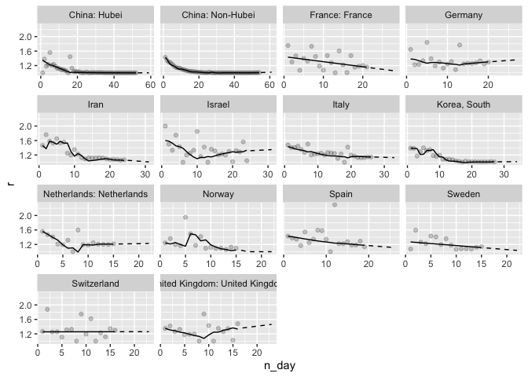
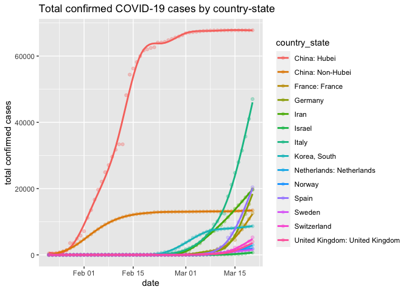

```
## Loading required package: pacman
```

```
## Registered S3 method overwritten by 'pryr':
##   method      from
##   print.bytes Rcpp
```

```
## 
## Attaching package: 'localizebase'
```

```
## The following object is masked from 'package:magrittr':
## 
##     %$%
```

```
## The following object is masked from 'package:purrr':
## 
##     %||%
```

```
## The following object is masked from 'package:ggplot2':
## 
##     %+%
```

```
## The following object is masked from 'package:base':
## 
##     %o%
```

# CONFIG

```r
# data sources
data_sources <- 
  list(
    confirmed = "https://raw.githubusercontent.com/CSSEGISandData/COVID-19/master/csse_covid_19_data/csse_covid_19_time_series/time_series_19-covid-Confirmed.csv",
    deaths = "https://raw.githubusercontent.com/CSSEGISandData/COVID-19/master/csse_covid_19_data/csse_covid_19_time_series/time_series_19-covid-Deaths.csv"
  )


MIN_SAMPLE_SIZE = 14
COUNTRY_STATE_FOR_MODELING <- 
  c("China: Hubei",
    "China: Non-Hubei",
    "France: France",
    "Germany",
    "Iran",
    "Italy",
    "Spain",
    "Korea, South",
    "Netherlands: Netherlands",
    "Norway",
    "Sweden",
    "Switzerland",
    "United Kingdom: United Kingdom")

# GLOBALS
MAX_DATE <- NULL
```


# load & tidy data


##### MODELING #####  

```r
# data_clean %>% distinct(state)
# data_clean %>% distinct(country)


DATE_INDEX_COL = "n_day" # "date
tsbl <-
  data$df_clean %>% 
  as_tsibble(key = country_state,
             index = DATE_INDEX_COL)


# Confirmed over time


#### MODELING 

# fit simple models
TARGET_VAR = "r"
FORECASTING_DAYS = 7

# trainset - prior to 2007
ts_train <- 
  tsbl %>% 
  filter(date <= max(date) - 0)

fitted <- 
  ts_train %>% 
  #model(ARIMA(!!rlang::sym(TARGET_VAR) ~ trend() + pdq(d = 0)))
  model(ETS(!!rlang::sym(TARGET_VAR) ~  error("A") + trend("A") + season("N"), opt_crit="mae"))   # "Ad", phi = 0.9; trend("M", alpha_range=c(0.1,0.2), beta = .1)


ts_train %>%  
  ggplot(aes(x=n_day,y=r)) +
  geom_point(alpha=0.2)+
  geom_line(aes(y=.fitted), data = augment(fitted))+
  geom_line(aes(y=r), data = forecast(fitted, h = 7) %>% mutate(r=pmax(r,1)), linetype = "dashed")+
  facet_wrap(vars(country_state), scales = "free_x") 
```

<!-- -->

```r
(
  ts_train %>% 
  autoplot(r) +
  geom_line(data = augment(fitted), linetype = "dashed")
) %>% ggplotly()
```

<!--html_preserve--><div id="htmlwidget-5525f8972a16e6a0cad0" style="width:672px;height:480px;" class="plotly html-widget"></div>
<script type="application/json" data-for="htmlwidget-5525f8972a16e6a0cad0">{"x":{"data":[{"x":[1,2,3,4,5,6,7,8,9,10,11,12,13,14,15,16,17,18,19,20,21,22,23,24,25,26,27,28,29,30,31,32,33,34,35,36,37,38,39,40,41,42,43,44,45,46,47,48,49,50,51,52],"y":[1,1.37957231288689,1.18417295533347,1.23200137788495,1.56256116314833,1.20980585130178,1.23339742641621,1.17909821321501,1.12443427409102,1.12848227206946,1.08604175850599,1.09339483394834,1.07077047686544,1.05162632375189,1,1.44476413115147,1.12861469526615,1.03387494026394,1.03436505537876,1.03105771544464,1.02822184067079,1.00565805259233,1.00662571939837,1.00352326959418,1.02269317927931,1,1.00316771737095,1.00776206698088,1.00618960886611,1.00627425713716,1.00484785657662,1.00641745304488,1.00859248986237,1.00292943937107,1.001698880825,1.00171087671274,1.00199013841858,1.00186760738742,1.00109480411883,1.00060591729968,1.00053170277815,1.00025094843748,1.00019185360094,1.00011804110782,1.00007376698485,1.00005900923495,1.00005900575306,1.00005900227159,1.00001474969763,1.00001474948008,1,1],"text":["n_day:  1<br />r: 1.000000<br />interaction(country_state, sep = \"/\"): China: Hubei","n_day:  2<br />r: 1.379572<br />interaction(country_state, sep = \"/\"): China: Hubei","n_day:  3<br />r: 1.184173<br />interaction(country_state, sep = \"/\"): China: Hubei","n_day:  4<br />r: 1.232001<br />interaction(country_state, sep = \"/\"): China: Hubei","n_day:  5<br />r: 1.562561<br />interaction(country_state, sep = \"/\"): China: Hubei","n_day:  6<br />r: 1.209806<br />interaction(country_state, sep = \"/\"): China: Hubei","n_day:  7<br />r: 1.233397<br />interaction(country_state, sep = \"/\"): China: Hubei","n_day:  8<br />r: 1.179098<br />interaction(country_state, sep = \"/\"): China: Hubei","n_day:  9<br />r: 1.124434<br />interaction(country_state, sep = \"/\"): China: Hubei","n_day: 10<br />r: 1.128482<br />interaction(country_state, sep = \"/\"): China: Hubei","n_day: 11<br />r: 1.086042<br />interaction(country_state, sep = \"/\"): China: Hubei","n_day: 12<br />r: 1.093395<br />interaction(country_state, sep = \"/\"): China: Hubei","n_day: 13<br />r: 1.070770<br />interaction(country_state, sep = \"/\"): China: Hubei","n_day: 14<br />r: 1.051626<br />interaction(country_state, sep = \"/\"): China: Hubei","n_day: 15<br />r: 1.000000<br />interaction(country_state, sep = \"/\"): China: Hubei","n_day: 16<br />r: 1.444764<br />interaction(country_state, sep = \"/\"): China: Hubei","n_day: 17<br />r: 1.128615<br />interaction(country_state, sep = \"/\"): China: Hubei","n_day: 18<br />r: 1.033875<br />interaction(country_state, sep = \"/\"): China: Hubei","n_day: 19<br />r: 1.034365<br />interaction(country_state, sep = \"/\"): China: Hubei","n_day: 20<br />r: 1.031058<br />interaction(country_state, sep = \"/\"): China: Hubei","n_day: 21<br />r: 1.028222<br />interaction(country_state, sep = \"/\"): China: Hubei","n_day: 22<br />r: 1.005658<br />interaction(country_state, sep = \"/\"): China: Hubei","n_day: 23<br />r: 1.006626<br />interaction(country_state, sep = \"/\"): China: Hubei","n_day: 24<br />r: 1.003523<br />interaction(country_state, sep = \"/\"): China: Hubei","n_day: 25<br />r: 1.022693<br />interaction(country_state, sep = \"/\"): China: Hubei","n_day: 26<br />r: 1.000000<br />interaction(country_state, sep = \"/\"): China: Hubei","n_day: 27<br />r: 1.003168<br />interaction(country_state, sep = \"/\"): China: Hubei","n_day: 28<br />r: 1.007762<br />interaction(country_state, sep = \"/\"): China: Hubei","n_day: 29<br />r: 1.006190<br />interaction(country_state, sep = \"/\"): China: Hubei","n_day: 30<br />r: 1.006274<br />interaction(country_state, sep = \"/\"): China: Hubei","n_day: 31<br />r: 1.004848<br />interaction(country_state, sep = \"/\"): China: Hubei","n_day: 32<br />r: 1.006417<br />interaction(country_state, sep = \"/\"): China: Hubei","n_day: 33<br />r: 1.008592<br />interaction(country_state, sep = \"/\"): China: Hubei","n_day: 34<br />r: 1.002929<br />interaction(country_state, sep = \"/\"): China: Hubei","n_day: 35<br />r: 1.001699<br />interaction(country_state, sep = \"/\"): China: Hubei","n_day: 36<br />r: 1.001711<br />interaction(country_state, sep = \"/\"): China: Hubei","n_day: 37<br />r: 1.001990<br />interaction(country_state, sep = \"/\"): China: Hubei","n_day: 38<br />r: 1.001868<br />interaction(country_state, sep = \"/\"): China: Hubei","n_day: 39<br />r: 1.001095<br />interaction(country_state, sep = \"/\"): China: Hubei","n_day: 40<br />r: 1.000606<br />interaction(country_state, sep = \"/\"): China: Hubei","n_day: 41<br />r: 1.000532<br />interaction(country_state, sep = \"/\"): China: Hubei","n_day: 42<br />r: 1.000251<br />interaction(country_state, sep = \"/\"): China: Hubei","n_day: 43<br />r: 1.000192<br />interaction(country_state, sep = \"/\"): China: Hubei","n_day: 44<br />r: 1.000118<br />interaction(country_state, sep = \"/\"): China: Hubei","n_day: 45<br />r: 1.000074<br />interaction(country_state, sep = \"/\"): China: Hubei","n_day: 46<br />r: 1.000059<br />interaction(country_state, sep = \"/\"): China: Hubei","n_day: 47<br />r: 1.000059<br />interaction(country_state, sep = \"/\"): China: Hubei","n_day: 48<br />r: 1.000059<br />interaction(country_state, sep = \"/\"): China: Hubei","n_day: 49<br />r: 1.000015<br />interaction(country_state, sep = \"/\"): China: Hubei","n_day: 50<br />r: 1.000015<br />interaction(country_state, sep = \"/\"): China: Hubei","n_day: 51<br />r: 1.000000<br />interaction(country_state, sep = \"/\"): China: Hubei","n_day: 52<br />r: 1.000000<br />interaction(country_state, sep = \"/\"): China: Hubei"],"type":"scatter","mode":"lines","line":{"width":1.88976377952756,"color":"rgba(248,118,109,1)","dash":"dash"},"hoveron":"points","name":"China: Hubei","legendgroup":"China: Hubei","showlegend":true,"xaxis":"x","yaxis":"y","hoverinfo":"text","frame":null},{"x":[1,2,3,4,5,6,7,8,9,10,11,12,13,14,15,16,17,18,19,20,21,22,23,24,25,26,27,28,29,30,31,32,33,34,35,36,37,38,39,40,41,42,43,44,45,46,47,48,49,50,51,52,53,54],"y":[1.42969518190757,1.34456671251719,1.29565217391304,1.27832609553889,1.23409512044472,1.18568568568569,1.15090755593077,1.13588850174216,1.13480787859219,1.10613173993456,1.09003215434084,1.08047197640118,1.06082778202468,1.04982499485279,1.04196901353207,1.03707886316582,1.03384754990926,1.02598086544369,1.02249978612371,1.01773761713521,1.01372903650115,1.00924499229584,1.00674969867417,1.00470907494612,1.00373371464887,1.02002374356945,1.00225015518312,1.0016257644964,1.00123666718194,1.00108074725953,1.00084824182603,1.00192618845828,1.00076899415564,1.00038420162901,1.00046086488978,1.00061420345489,1.00084401135579,1.00076663600123,1.00130228282519,1.00206564149644,1.00045808520385,1.00091575091575,1.00007624275694,1.00076236944423,1.00159975622762,1.00022817158503,1.00060831875903,1.00212782126301,1.00166830969895,1.00196835490953,1.00181337363053,1.00324308017196,1.00405953991881,1.00703803533992],"text":["n_day:  1<br />r: 1.429695<br />interaction(country_state, sep = \"/\"): China: Non-Hubei","n_day:  2<br />r: 1.344567<br />interaction(country_state, sep = \"/\"): China: Non-Hubei","n_day:  3<br />r: 1.295652<br />interaction(country_state, sep = \"/\"): China: Non-Hubei","n_day:  4<br />r: 1.278326<br />interaction(country_state, sep = \"/\"): China: Non-Hubei","n_day:  5<br />r: 1.234095<br />interaction(country_state, sep = \"/\"): China: Non-Hubei","n_day:  6<br />r: 1.185686<br />interaction(country_state, sep = \"/\"): China: Non-Hubei","n_day:  7<br />r: 1.150908<br />interaction(country_state, sep = \"/\"): China: Non-Hubei","n_day:  8<br />r: 1.135889<br />interaction(country_state, sep = \"/\"): China: Non-Hubei","n_day:  9<br />r: 1.134808<br />interaction(country_state, sep = \"/\"): China: Non-Hubei","n_day: 10<br />r: 1.106132<br />interaction(country_state, sep = \"/\"): China: Non-Hubei","n_day: 11<br />r: 1.090032<br />interaction(country_state, sep = \"/\"): China: Non-Hubei","n_day: 12<br />r: 1.080472<br />interaction(country_state, sep = \"/\"): China: Non-Hubei","n_day: 13<br />r: 1.060828<br />interaction(country_state, sep = \"/\"): China: Non-Hubei","n_day: 14<br />r: 1.049825<br />interaction(country_state, sep = \"/\"): China: Non-Hubei","n_day: 15<br />r: 1.041969<br />interaction(country_state, sep = \"/\"): China: Non-Hubei","n_day: 16<br />r: 1.037079<br />interaction(country_state, sep = \"/\"): China: Non-Hubei","n_day: 17<br />r: 1.033848<br />interaction(country_state, sep = \"/\"): China: Non-Hubei","n_day: 18<br />r: 1.025981<br />interaction(country_state, sep = \"/\"): China: Non-Hubei","n_day: 19<br />r: 1.022500<br />interaction(country_state, sep = \"/\"): China: Non-Hubei","n_day: 20<br />r: 1.017738<br />interaction(country_state, sep = \"/\"): China: Non-Hubei","n_day: 21<br />r: 1.013729<br />interaction(country_state, sep = \"/\"): China: Non-Hubei","n_day: 22<br />r: 1.009245<br />interaction(country_state, sep = \"/\"): China: Non-Hubei","n_day: 23<br />r: 1.006750<br />interaction(country_state, sep = \"/\"): China: Non-Hubei","n_day: 24<br />r: 1.004709<br />interaction(country_state, sep = \"/\"): China: Non-Hubei","n_day: 25<br />r: 1.003734<br />interaction(country_state, sep = \"/\"): China: Non-Hubei","n_day: 26<br />r: 1.020024<br />interaction(country_state, sep = \"/\"): China: Non-Hubei","n_day: 27<br />r: 1.002250<br />interaction(country_state, sep = \"/\"): China: Non-Hubei","n_day: 28<br />r: 1.001626<br />interaction(country_state, sep = \"/\"): China: Non-Hubei","n_day: 29<br />r: 1.001237<br />interaction(country_state, sep = \"/\"): China: Non-Hubei","n_day: 30<br />r: 1.001081<br />interaction(country_state, sep = \"/\"): China: Non-Hubei","n_day: 31<br />r: 1.000848<br />interaction(country_state, sep = \"/\"): China: Non-Hubei","n_day: 32<br />r: 1.001926<br />interaction(country_state, sep = \"/\"): China: Non-Hubei","n_day: 33<br />r: 1.000769<br />interaction(country_state, sep = \"/\"): China: Non-Hubei","n_day: 34<br />r: 1.000384<br />interaction(country_state, sep = \"/\"): China: Non-Hubei","n_day: 35<br />r: 1.000461<br />interaction(country_state, sep = \"/\"): China: Non-Hubei","n_day: 36<br />r: 1.000614<br />interaction(country_state, sep = \"/\"): China: Non-Hubei","n_day: 37<br />r: 1.000844<br />interaction(country_state, sep = \"/\"): China: Non-Hubei","n_day: 38<br />r: 1.000767<br />interaction(country_state, sep = \"/\"): China: Non-Hubei","n_day: 39<br />r: 1.001302<br />interaction(country_state, sep = \"/\"): China: Non-Hubei","n_day: 40<br />r: 1.002066<br />interaction(country_state, sep = \"/\"): China: Non-Hubei","n_day: 41<br />r: 1.000458<br />interaction(country_state, sep = \"/\"): China: Non-Hubei","n_day: 42<br />r: 1.000916<br />interaction(country_state, sep = \"/\"): China: Non-Hubei","n_day: 43<br />r: 1.000076<br />interaction(country_state, sep = \"/\"): China: Non-Hubei","n_day: 44<br />r: 1.000762<br />interaction(country_state, sep = \"/\"): China: Non-Hubei","n_day: 45<br />r: 1.001600<br />interaction(country_state, sep = \"/\"): China: Non-Hubei","n_day: 46<br />r: 1.000228<br />interaction(country_state, sep = \"/\"): China: Non-Hubei","n_day: 47<br />r: 1.000608<br />interaction(country_state, sep = \"/\"): China: Non-Hubei","n_day: 48<br />r: 1.002128<br />interaction(country_state, sep = \"/\"): China: Non-Hubei","n_day: 49<br />r: 1.001668<br />interaction(country_state, sep = \"/\"): China: Non-Hubei","n_day: 50<br />r: 1.001968<br />interaction(country_state, sep = \"/\"): China: Non-Hubei","n_day: 51<br />r: 1.001813<br />interaction(country_state, sep = \"/\"): China: Non-Hubei","n_day: 52<br />r: 1.003243<br />interaction(country_state, sep = \"/\"): China: Non-Hubei","n_day: 53<br />r: 1.004060<br />interaction(country_state, sep = \"/\"): China: Non-Hubei","n_day: 54<br />r: 1.007038<br />interaction(country_state, sep = \"/\"): China: Non-Hubei"],"type":"scatter","mode":"lines","line":{"width":1.88976377952756,"color":"rgba(227,137,0,1)","dash":"dash"},"hoveron":"points","name":"China: Non-Hubei","legendgroup":"China: Non-Hubei","showlegend":true,"xaxis":"x","yaxis":"y","hoverinfo":"text","frame":null},{"x":[1,2,3,4,5,6,7,8,9,10,11,12,13,14,15,16,17,18,19,20,21],"y":[1.75438596491228,1.3,1.46923076923077,1.06806282722513,1.39705882352941,1.32280701754386,1.73209549071618,1.45329249617152,1.18651211801897,1.07371225577265,1.47559966914806,1.27858744394619,1,1.60499780797896,1.22070472548484,1.00671291116581,1.47432762836186,1.15362581034223,1.18178254051228,1.20214530576136,1.16015086008647],"text":["n_day:  1<br />r: 1.754386<br />interaction(country_state, sep = \"/\"): France: France","n_day:  2<br />r: 1.300000<br />interaction(country_state, sep = \"/\"): France: France","n_day:  3<br />r: 1.469231<br />interaction(country_state, sep = \"/\"): France: France","n_day:  4<br />r: 1.068063<br />interaction(country_state, sep = \"/\"): France: France","n_day:  5<br />r: 1.397059<br />interaction(country_state, sep = \"/\"): France: France","n_day:  6<br />r: 1.322807<br />interaction(country_state, sep = \"/\"): France: France","n_day:  7<br />r: 1.732095<br />interaction(country_state, sep = \"/\"): France: France","n_day:  8<br />r: 1.453292<br />interaction(country_state, sep = \"/\"): France: France","n_day:  9<br />r: 1.186512<br />interaction(country_state, sep = \"/\"): France: France","n_day: 10<br />r: 1.073712<br />interaction(country_state, sep = \"/\"): France: France","n_day: 11<br />r: 1.475600<br />interaction(country_state, sep = \"/\"): France: France","n_day: 12<br />r: 1.278587<br />interaction(country_state, sep = \"/\"): France: France","n_day: 13<br />r: 1.000000<br />interaction(country_state, sep = \"/\"): France: France","n_day: 14<br />r: 1.604998<br />interaction(country_state, sep = \"/\"): France: France","n_day: 15<br />r: 1.220705<br />interaction(country_state, sep = \"/\"): France: France","n_day: 16<br />r: 1.006713<br />interaction(country_state, sep = \"/\"): France: France","n_day: 17<br />r: 1.474328<br />interaction(country_state, sep = \"/\"): France: France","n_day: 18<br />r: 1.153626<br />interaction(country_state, sep = \"/\"): France: France","n_day: 19<br />r: 1.181783<br />interaction(country_state, sep = \"/\"): France: France","n_day: 20<br />r: 1.202145<br />interaction(country_state, sep = \"/\"): France: France","n_day: 21<br />r: 1.160151<br />interaction(country_state, sep = \"/\"): France: France"],"type":"scatter","mode":"lines","line":{"width":1.88976377952756,"color":"rgba(196,154,0,1)","dash":"dash"},"hoveron":"points","name":"France: France","legendgroup":"France: France","showlegend":true,"xaxis":"x","yaxis":"y","hoverinfo":"text","frame":null},{"x":[1,2,3,4,5,6,7,8,9,10,11,12,13,14,15,16,17,18,19,20],"y":[1.64556962025316,1.22307692307692,1.23270440251572,1.33673469387755,1.83969465648855,1.39004149377593,1.19253731343284,1.30162703379224,1.13076923076923,1.23894557823129,1.3095401509952,1.08909853249476,1.76852743022137,1.24761904761905,1.2639040348964,1.2548748921484,1.27296479647965,1.33164092038457,1.24280035694005,1.29556135770235],"text":["n_day:  1<br />r: 1.645570<br />interaction(country_state, sep = \"/\"): Germany","n_day:  2<br />r: 1.223077<br />interaction(country_state, sep = \"/\"): Germany","n_day:  3<br />r: 1.232704<br />interaction(country_state, sep = \"/\"): Germany","n_day:  4<br />r: 1.336735<br />interaction(country_state, sep = \"/\"): Germany","n_day:  5<br />r: 1.839695<br />interaction(country_state, sep = \"/\"): Germany","n_day:  6<br />r: 1.390041<br />interaction(country_state, sep = \"/\"): Germany","n_day:  7<br />r: 1.192537<br />interaction(country_state, sep = \"/\"): Germany","n_day:  8<br />r: 1.301627<br />interaction(country_state, sep = \"/\"): Germany","n_day:  9<br />r: 1.130769<br />interaction(country_state, sep = \"/\"): Germany","n_day: 10<br />r: 1.238946<br />interaction(country_state, sep = \"/\"): Germany","n_day: 11<br />r: 1.309540<br />interaction(country_state, sep = \"/\"): Germany","n_day: 12<br />r: 1.089099<br />interaction(country_state, sep = \"/\"): Germany","n_day: 13<br />r: 1.768527<br />interaction(country_state, sep = \"/\"): Germany","n_day: 14<br />r: 1.247619<br />interaction(country_state, sep = \"/\"): Germany","n_day: 15<br />r: 1.263904<br />interaction(country_state, sep = \"/\"): Germany","n_day: 16<br />r: 1.254875<br />interaction(country_state, sep = \"/\"): Germany","n_day: 17<br />r: 1.272965<br />interaction(country_state, sep = \"/\"): Germany","n_day: 18<br />r: 1.331641<br />interaction(country_state, sep = \"/\"): Germany","n_day: 19<br />r: 1.242800<br />interaction(country_state, sep = \"/\"): Germany","n_day: 20<br />r: 1.295561<br />interaction(country_state, sep = \"/\"): Germany"],"type":"scatter","mode":"lines","line":{"width":1.88976377952756,"color":"rgba(153,168,0,1)","dash":"dash"},"hoveron":"points","name":"Germany","legendgroup":"Germany","showlegend":true,"xaxis":"x","yaxis":"y","hoverinfo":"text","frame":null},{"x":[1,2,3,4,5,6,7,8,9,10,11,12,13,14,15,16,17,18,19,20,21,22,23,24],"y":[1.46315789473684,1.76258992805755,1.58367346938775,1.52835051546392,1.64924114671164,1.53476482617587,1.55629580279813,1.25085616438356,1.20225872689938,1.35126672359806,1.22666947545818,1.1275974583548,1.09061833688699,1.12302751012428,1.11912459587167,1.11944444444444,1.12794044665012,1.120116156283,1.09497996700448,1.07554885923375,1.07858048162231,1.07372131857258,1.06024998559991,1.06720269462704],"text":["n_day:  1<br />r: 1.463158<br />interaction(country_state, sep = \"/\"): Iran","n_day:  2<br />r: 1.762590<br />interaction(country_state, sep = \"/\"): Iran","n_day:  3<br />r: 1.583673<br />interaction(country_state, sep = \"/\"): Iran","n_day:  4<br />r: 1.528351<br />interaction(country_state, sep = \"/\"): Iran","n_day:  5<br />r: 1.649241<br />interaction(country_state, sep = \"/\"): Iran","n_day:  6<br />r: 1.534765<br />interaction(country_state, sep = \"/\"): Iran","n_day:  7<br />r: 1.556296<br />interaction(country_state, sep = \"/\"): Iran","n_day:  8<br />r: 1.250856<br />interaction(country_state, sep = \"/\"): Iran","n_day:  9<br />r: 1.202259<br />interaction(country_state, sep = \"/\"): Iran","n_day: 10<br />r: 1.351267<br />interaction(country_state, sep = \"/\"): Iran","n_day: 11<br />r: 1.226669<br />interaction(country_state, sep = \"/\"): Iran","n_day: 12<br />r: 1.127597<br />interaction(country_state, sep = \"/\"): Iran","n_day: 13<br />r: 1.090618<br />interaction(country_state, sep = \"/\"): Iran","n_day: 14<br />r: 1.123028<br />interaction(country_state, sep = \"/\"): Iran","n_day: 15<br />r: 1.119125<br />interaction(country_state, sep = \"/\"): Iran","n_day: 16<br />r: 1.119444<br />interaction(country_state, sep = \"/\"): Iran","n_day: 17<br />r: 1.127940<br />interaction(country_state, sep = \"/\"): Iran","n_day: 18<br />r: 1.120116<br />interaction(country_state, sep = \"/\"): Iran","n_day: 19<br />r: 1.094980<br />interaction(country_state, sep = \"/\"): Iran","n_day: 20<br />r: 1.075549<br />interaction(country_state, sep = \"/\"): Iran","n_day: 21<br />r: 1.078580<br />interaction(country_state, sep = \"/\"): Iran","n_day: 22<br />r: 1.073721<br />interaction(country_state, sep = \"/\"): Iran","n_day: 23<br />r: 1.060250<br />interaction(country_state, sep = \"/\"): Iran","n_day: 24<br />r: 1.067203<br />interaction(country_state, sep = \"/\"): Iran"],"type":"scatter","mode":"lines","line":{"width":1.88976377952756,"color":"rgba(83,180,0,1)","dash":"dash"},"hoveron":"points","name":"Iran","legendgroup":"Iran","showlegend":true,"xaxis":"x","yaxis":"y","hoverinfo":"text","frame":null},{"x":[1,2,3,4,5,6,7,8,9,10,11,12,13,14,15,16,17,18,19,20,21,22,23,24],"y":[2,1.5,1.33333333333333,1.75,1.42857142857143,1,1.2,1.25,1.33333333333333,1.85,1.16216216216216,1.41860465116279,1,1.36065573770492,1.31325301204819,1.20183486238532,1.22900763358779,1.19875776397516,1.30051813471503,1.01593625498008,1.32156862745098,1.28486646884273,1.5635103926097,1.04135893648449],"text":["n_day:  1<br />r: 2.000000<br />interaction(country_state, sep = \"/\"): Israel","n_day:  2<br />r: 1.500000<br />interaction(country_state, sep = \"/\"): Israel","n_day:  3<br />r: 1.333333<br />interaction(country_state, sep = \"/\"): Israel","n_day:  4<br />r: 1.750000<br />interaction(country_state, sep = \"/\"): Israel","n_day:  5<br />r: 1.428571<br />interaction(country_state, sep = \"/\"): Israel","n_day:  6<br />r: 1.000000<br />interaction(country_state, sep = \"/\"): Israel","n_day:  7<br />r: 1.200000<br />interaction(country_state, sep = \"/\"): Israel","n_day:  8<br />r: 1.250000<br />interaction(country_state, sep = \"/\"): Israel","n_day:  9<br />r: 1.333333<br />interaction(country_state, sep = \"/\"): Israel","n_day: 10<br />r: 1.850000<br />interaction(country_state, sep = \"/\"): Israel","n_day: 11<br />r: 1.162162<br />interaction(country_state, sep = \"/\"): Israel","n_day: 12<br />r: 1.418605<br />interaction(country_state, sep = \"/\"): Israel","n_day: 13<br />r: 1.000000<br />interaction(country_state, sep = \"/\"): Israel","n_day: 14<br />r: 1.360656<br />interaction(country_state, sep = \"/\"): Israel","n_day: 15<br />r: 1.313253<br />interaction(country_state, sep = \"/\"): Israel","n_day: 16<br />r: 1.201835<br />interaction(country_state, sep = \"/\"): Israel","n_day: 17<br />r: 1.229008<br />interaction(country_state, sep = \"/\"): Israel","n_day: 18<br />r: 1.198758<br />interaction(country_state, sep = \"/\"): Israel","n_day: 19<br />r: 1.300518<br />interaction(country_state, sep = \"/\"): Israel","n_day: 20<br />r: 1.015936<br />interaction(country_state, sep = \"/\"): Israel","n_day: 21<br />r: 1.321569<br />interaction(country_state, sep = \"/\"): Israel","n_day: 22<br />r: 1.284866<br />interaction(country_state, sep = \"/\"): Israel","n_day: 23<br />r: 1.563510<br />interaction(country_state, sep = \"/\"): Israel","n_day: 24<br />r: 1.041359<br />interaction(country_state, sep = \"/\"): Israel"],"type":"scatter","mode":"lines","line":{"width":1.88976377952756,"color":"rgba(0,188,86,1)","dash":"dash"},"hoveron":"points","name":"Israel","legendgroup":"Israel","showlegend":true,"xaxis":"x","yaxis":"y","hoverinfo":"text","frame":null},{"x":[1,2,3,4,5,6,7,8,9,10,11,12,13,14,15,16,17,18,19,20,21,22,23,24,25,26],"y":[1.47741935483871,1.4061135371179,1.40683229813665,1.44591611479029,1.35572519083969,1.27027027027027,1.50177304964539,1.20188902007084,1.22888015717092,1.23461231015188,1.24894787957268,1.2016588906169,1.26898188093184,1.25361210266871,1.24366101694915,1.10651984300044,1.22790422701744,1,1.41710800834537,1.1980181200453,1.16968379259819,1.13064209803208,1.12601858470336,1.13353012124675,1.14902136476913,1.14587547215791],"text":["n_day:  1<br />r: 1.477419<br />interaction(country_state, sep = \"/\"): Italy","n_day:  2<br />r: 1.406114<br />interaction(country_state, sep = \"/\"): Italy","n_day:  3<br />r: 1.406832<br />interaction(country_state, sep = \"/\"): Italy","n_day:  4<br />r: 1.445916<br />interaction(country_state, sep = \"/\"): Italy","n_day:  5<br />r: 1.355725<br />interaction(country_state, sep = \"/\"): Italy","n_day:  6<br />r: 1.270270<br />interaction(country_state, sep = \"/\"): Italy","n_day:  7<br />r: 1.501773<br />interaction(country_state, sep = \"/\"): Italy","n_day:  8<br />r: 1.201889<br />interaction(country_state, sep = \"/\"): Italy","n_day:  9<br />r: 1.228880<br />interaction(country_state, sep = \"/\"): Italy","n_day: 10<br />r: 1.234612<br />interaction(country_state, sep = \"/\"): Italy","n_day: 11<br />r: 1.248948<br />interaction(country_state, sep = \"/\"): Italy","n_day: 12<br />r: 1.201659<br />interaction(country_state, sep = \"/\"): Italy","n_day: 13<br />r: 1.268982<br />interaction(country_state, sep = \"/\"): Italy","n_day: 14<br />r: 1.253612<br />interaction(country_state, sep = \"/\"): Italy","n_day: 15<br />r: 1.243661<br />interaction(country_state, sep = \"/\"): Italy","n_day: 16<br />r: 1.106520<br />interaction(country_state, sep = \"/\"): Italy","n_day: 17<br />r: 1.227904<br />interaction(country_state, sep = \"/\"): Italy","n_day: 18<br />r: 1.000000<br />interaction(country_state, sep = \"/\"): Italy","n_day: 19<br />r: 1.417108<br />interaction(country_state, sep = \"/\"): Italy","n_day: 20<br />r: 1.198018<br />interaction(country_state, sep = \"/\"): Italy","n_day: 21<br />r: 1.169684<br />interaction(country_state, sep = \"/\"): Italy","n_day: 22<br />r: 1.130642<br />interaction(country_state, sep = \"/\"): Italy","n_day: 23<br />r: 1.126019<br />interaction(country_state, sep = \"/\"): Italy","n_day: 24<br />r: 1.133530<br />interaction(country_state, sep = \"/\"): Italy","n_day: 25<br />r: 1.149021<br />interaction(country_state, sep = \"/\"): Italy","n_day: 26<br />r: 1.145875<br />interaction(country_state, sep = \"/\"): Italy"],"type":"scatter","mode":"lines","line":{"width":1.88976377952756,"color":"rgba(0,192,148,1)","dash":"dash"},"hoveron":"points","name":"Italy","legendgroup":"Italy","showlegend":true,"xaxis":"x","yaxis":"y","hoverinfo":"text","frame":null},{"x":[1,2,3,4,5,6,7,8,9,10,11,12,13,14,15,16,17,18,19,20,21,22,23,24,25,26,27],"y":[1.39030023094688,1.38372093023256,1.17286914765906,1.2906857727738,1.40047581284695,1.3233295583239,1.34788189987163,1.18603174603175,1.16033190578158,1.19630911188005,1.08387967605091,1.08308130225938,1.08295006570302,1.06795085696951,1.03877290157648,1.02242275088871,1.00468039582776,1.03221083455344,1.0147001934236,1.01397890456221,1.01341020177967,1.00939896116745,1.00906640529282,1.01019912578922,1.01117788461538,1.01806727683347,1.01015761821366],"text":["n_day:  1<br />r: 1.390300<br />interaction(country_state, sep = \"/\"): Korea, South","n_day:  2<br />r: 1.383721<br />interaction(country_state, sep = \"/\"): Korea, South","n_day:  3<br />r: 1.172869<br />interaction(country_state, sep = \"/\"): Korea, South","n_day:  4<br />r: 1.290686<br />interaction(country_state, sep = \"/\"): Korea, South","n_day:  5<br />r: 1.400476<br />interaction(country_state, sep = \"/\"): Korea, South","n_day:  6<br />r: 1.323330<br />interaction(country_state, sep = \"/\"): Korea, South","n_day:  7<br />r: 1.347882<br />interaction(country_state, sep = \"/\"): Korea, South","n_day:  8<br />r: 1.186032<br />interaction(country_state, sep = \"/\"): Korea, South","n_day:  9<br />r: 1.160332<br />interaction(country_state, sep = \"/\"): Korea, South","n_day: 10<br />r: 1.196309<br />interaction(country_state, sep = \"/\"): Korea, South","n_day: 11<br />r: 1.083880<br />interaction(country_state, sep = \"/\"): Korea, South","n_day: 12<br />r: 1.083081<br />interaction(country_state, sep = \"/\"): Korea, South","n_day: 13<br />r: 1.082950<br />interaction(country_state, sep = \"/\"): Korea, South","n_day: 14<br />r: 1.067951<br />interaction(country_state, sep = \"/\"): Korea, South","n_day: 15<br />r: 1.038773<br />interaction(country_state, sep = \"/\"): Korea, South","n_day: 16<br />r: 1.022423<br />interaction(country_state, sep = \"/\"): Korea, South","n_day: 17<br />r: 1.004680<br />interaction(country_state, sep = \"/\"): Korea, South","n_day: 18<br />r: 1.032211<br />interaction(country_state, sep = \"/\"): Korea, South","n_day: 19<br />r: 1.014700<br />interaction(country_state, sep = \"/\"): Korea, South","n_day: 20<br />r: 1.013979<br />interaction(country_state, sep = \"/\"): Korea, South","n_day: 21<br />r: 1.013410<br />interaction(country_state, sep = \"/\"): Korea, South","n_day: 22<br />r: 1.009399<br />interaction(country_state, sep = \"/\"): Korea, South","n_day: 23<br />r: 1.009066<br />interaction(country_state, sep = \"/\"): Korea, South","n_day: 24<br />r: 1.010199<br />interaction(country_state, sep = \"/\"): Korea, South","n_day: 25<br />r: 1.011178<br />interaction(country_state, sep = \"/\"): Korea, South","n_day: 26<br />r: 1.018067<br />interaction(country_state, sep = \"/\"): Korea, South","n_day: 27<br />r: 1.010158<br />interaction(country_state, sep = \"/\"): Korea, South"],"type":"scatter","mode":"lines","line":{"width":1.88976377952756,"color":"rgba(0,191,196,1)","dash":"dash"},"hoveron":"points","name":"Korea, South","legendgroup":"Korea, South","showlegend":true,"xaxis":"x","yaxis":"y","hoverinfo":"text","frame":null},{"x":[1,2,3,4,5,6,7,8,9,10,11,12,13,14,15],"y":[1.5609756097561,1.46875,1.40957446808511,1.21132075471698,1.19003115264797,1.31675392670157,1,1.59840954274354,1.19278606965174,1.18352450469239,1.24493392070485,1.206652512385,1.20293255131965,1.19941491955144,1.21707317073171],"text":["n_day:  1<br />r: 1.560976<br />interaction(country_state, sep = \"/\"): Netherlands: Netherlands","n_day:  2<br />r: 1.468750<br />interaction(country_state, sep = \"/\"): Netherlands: Netherlands","n_day:  3<br />r: 1.409574<br />interaction(country_state, sep = \"/\"): Netherlands: Netherlands","n_day:  4<br />r: 1.211321<br />interaction(country_state, sep = \"/\"): Netherlands: Netherlands","n_day:  5<br />r: 1.190031<br />interaction(country_state, sep = \"/\"): Netherlands: Netherlands","n_day:  6<br />r: 1.316754<br />interaction(country_state, sep = \"/\"): Netherlands: Netherlands","n_day:  7<br />r: 1.000000<br />interaction(country_state, sep = \"/\"): Netherlands: Netherlands","n_day:  8<br />r: 1.598410<br />interaction(country_state, sep = \"/\"): Netherlands: Netherlands","n_day:  9<br />r: 1.192786<br />interaction(country_state, sep = \"/\"): Netherlands: Netherlands","n_day: 10<br />r: 1.183525<br />interaction(country_state, sep = \"/\"): Netherlands: Netherlands","n_day: 11<br />r: 1.244934<br />interaction(country_state, sep = \"/\"): Netherlands: Netherlands","n_day: 12<br />r: 1.206653<br />interaction(country_state, sep = \"/\"): Netherlands: Netherlands","n_day: 13<br />r: 1.202933<br />interaction(country_state, sep = \"/\"): Netherlands: Netherlands","n_day: 14<br />r: 1.199415<br />interaction(country_state, sep = \"/\"): Netherlands: Netherlands","n_day: 15<br />r: 1.217073<br />interaction(country_state, sep = \"/\"): Netherlands: Netherlands"],"type":"scatter","mode":"lines","line":{"width":1.88976377952756,"color":"rgba(0,182,235,1)","dash":"dash"},"hoveron":"points","name":"Netherlands: Netherlands","legendgroup":"Netherlands: Netherlands","showlegend":true,"xaxis":"x","yaxis":"y","hoverinfo":"text","frame":null},{"x":[1,2,3,4,5,6,7,8,9,10,11,12,13,14,15],"y":[1.24137931034483,1.36111111111111,1.19727891156463,1.16477272727273,1.95121951219512,1.495,1.17391304347826,1.41880341880342,1.09437751004016,1.12018348623853,1.09172809172809,1.09752438109527,1.05946684894053,1.12645161290323,1.09621993127148],"text":["n_day:  1<br />r: 1.241379<br />interaction(country_state, sep = \"/\"): Norway","n_day:  2<br />r: 1.361111<br />interaction(country_state, sep = \"/\"): Norway","n_day:  3<br />r: 1.197279<br />interaction(country_state, sep = \"/\"): Norway","n_day:  4<br />r: 1.164773<br />interaction(country_state, sep = \"/\"): Norway","n_day:  5<br />r: 1.951220<br />interaction(country_state, sep = \"/\"): Norway","n_day:  6<br />r: 1.495000<br />interaction(country_state, sep = \"/\"): Norway","n_day:  7<br />r: 1.173913<br />interaction(country_state, sep = \"/\"): Norway","n_day:  8<br />r: 1.418803<br />interaction(country_state, sep = \"/\"): Norway","n_day:  9<br />r: 1.094378<br />interaction(country_state, sep = \"/\"): Norway","n_day: 10<br />r: 1.120183<br />interaction(country_state, sep = \"/\"): Norway","n_day: 11<br />r: 1.091728<br />interaction(country_state, sep = \"/\"): Norway","n_day: 12<br />r: 1.097524<br />interaction(country_state, sep = \"/\"): Norway","n_day: 13<br />r: 1.059467<br />interaction(country_state, sep = \"/\"): Norway","n_day: 14<br />r: 1.126452<br />interaction(country_state, sep = \"/\"): Norway","n_day: 15<br />r: 1.096220<br />interaction(country_state, sep = \"/\"): Norway"],"type":"scatter","mode":"lines","line":{"width":1.88976377952756,"color":"rgba(6,164,255,1)","dash":"dash"},"hoveron":"points","name":"Norway","legendgroup":"Norway","showlegend":true,"xaxis":"x","yaxis":"y","hoverinfo":"text","frame":null},{"x":[1,2,3,4,5,6,7,8,9,10,11,12,13,14,15,16,17,18,19],"y":[1.42857142857143,1.375,1.34545454545455,1.16666666666667,1.54440154440154,1.25,1.346,1.59435364041605,1.57968313140727,1.34336283185841,1,2.29776021080369,1.22152140672783,1.22015334063527,1.27494229289561,1.1816535908268,1.18403132448076,1.29137311286844,1.13622446139286],"text":["n_day:  1<br />r: 1.428571<br />interaction(country_state, sep = \"/\"): Spain","n_day:  2<br />r: 1.375000<br />interaction(country_state, sep = \"/\"): Spain","n_day:  3<br />r: 1.345455<br />interaction(country_state, sep = \"/\"): Spain","n_day:  4<br />r: 1.166667<br />interaction(country_state, sep = \"/\"): Spain","n_day:  5<br />r: 1.544402<br />interaction(country_state, sep = \"/\"): Spain","n_day:  6<br />r: 1.250000<br />interaction(country_state, sep = \"/\"): Spain","n_day:  7<br />r: 1.346000<br />interaction(country_state, sep = \"/\"): Spain","n_day:  8<br />r: 1.594354<br />interaction(country_state, sep = \"/\"): Spain","n_day:  9<br />r: 1.579683<br />interaction(country_state, sep = \"/\"): Spain","n_day: 10<br />r: 1.343363<br />interaction(country_state, sep = \"/\"): Spain","n_day: 11<br />r: 1.000000<br />interaction(country_state, sep = \"/\"): Spain","n_day: 12<br />r: 2.297760<br />interaction(country_state, sep = \"/\"): Spain","n_day: 13<br />r: 1.221521<br />interaction(country_state, sep = \"/\"): Spain","n_day: 14<br />r: 1.220153<br />interaction(country_state, sep = \"/\"): Spain","n_day: 15<br />r: 1.274942<br />interaction(country_state, sep = \"/\"): Spain","n_day: 16<br />r: 1.181654<br />interaction(country_state, sep = \"/\"): Spain","n_day: 17<br />r: 1.184031<br />interaction(country_state, sep = \"/\"): Spain","n_day: 18<br />r: 1.291373<br />interaction(country_state, sep = \"/\"): Spain","n_day: 19<br />r: 1.136224<br />interaction(country_state, sep = \"/\"): Spain"],"type":"scatter","mode":"lines","line":{"width":1.88976377952756,"color":"rgba(165,138,255,1)","dash":"dash"},"hoveron":"points","name":"Spain","legendgroup":"Spain","showlegend":true,"xaxis":"x","yaxis":"y","hoverinfo":"text","frame":null},{"x":[1,2,3,4,5,6,7,8,9,10,11,12,13,14,15],"y":[1.07446808510638,1.59405940594059,1.26086956521739,1.22167487684729,1.43145161290323,1.40845070422535,1.198,1.35893155258765,1.18058968058968,1.06347554630593,1.07925636007828,1.07887579329102,1.07478991596639,1.1250977326036,1.13898540653231],"text":["n_day:  1<br />r: 1.074468<br />interaction(country_state, sep = \"/\"): Sweden","n_day:  2<br />r: 1.594059<br />interaction(country_state, sep = \"/\"): Sweden","n_day:  3<br />r: 1.260870<br />interaction(country_state, sep = \"/\"): Sweden","n_day:  4<br />r: 1.221675<br />interaction(country_state, sep = \"/\"): Sweden","n_day:  5<br />r: 1.431452<br />interaction(country_state, sep = \"/\"): Sweden","n_day:  6<br />r: 1.408451<br />interaction(country_state, sep = \"/\"): Sweden","n_day:  7<br />r: 1.198000<br />interaction(country_state, sep = \"/\"): Sweden","n_day:  8<br />r: 1.358932<br />interaction(country_state, sep = \"/\"): Sweden","n_day:  9<br />r: 1.180590<br />interaction(country_state, sep = \"/\"): Sweden","n_day: 10<br />r: 1.063476<br />interaction(country_state, sep = \"/\"): Sweden","n_day: 11<br />r: 1.079256<br />interaction(country_state, sep = \"/\"): Sweden","n_day: 12<br />r: 1.078876<br />interaction(country_state, sep = \"/\"): Sweden","n_day: 13<br />r: 1.074790<br />interaction(country_state, sep = \"/\"): Sweden","n_day: 14<br />r: 1.125098<br />interaction(country_state, sep = \"/\"): Sweden","n_day: 15<br />r: 1.138985<br />interaction(country_state, sep = \"/\"): Sweden"],"type":"scatter","mode":"lines","line":{"width":1.88976377952756,"color":"rgba(223,112,248,1)","dash":"dash"},"hoveron":"points","name":"Sweden","legendgroup":"Sweden","showlegend":true,"xaxis":"x","yaxis":"y","hoverinfo":"text","frame":null},{"x":[1,2,3,4,5,6,7,8,9,10,11,12,13,14,15,16],"y":[1.26666666666667,1.87719298245614,1.25233644859813,1.25746268656716,1.10979228486647,1.31283422459893,1.32790224032587,1,1.74693251533742,1.19315188762072,1.61883738042678,1,1.22727272727273,1.12148148148148,1.34577278731836,1.29914110429448],"text":["n_day:  1<br />r: 1.266667<br />interaction(country_state, sep = \"/\"): Switzerland","n_day:  2<br />r: 1.877193<br />interaction(country_state, sep = \"/\"): Switzerland","n_day:  3<br />r: 1.252336<br />interaction(country_state, sep = \"/\"): Switzerland","n_day:  4<br />r: 1.257463<br />interaction(country_state, sep = \"/\"): Switzerland","n_day:  5<br />r: 1.109792<br />interaction(country_state, sep = \"/\"): Switzerland","n_day:  6<br />r: 1.312834<br />interaction(country_state, sep = \"/\"): Switzerland","n_day:  7<br />r: 1.327902<br />interaction(country_state, sep = \"/\"): Switzerland","n_day:  8<br />r: 1.000000<br />interaction(country_state, sep = \"/\"): Switzerland","n_day:  9<br />r: 1.746933<br />interaction(country_state, sep = \"/\"): Switzerland","n_day: 10<br />r: 1.193152<br />interaction(country_state, sep = \"/\"): Switzerland","n_day: 11<br />r: 1.618837<br />interaction(country_state, sep = \"/\"): Switzerland","n_day: 12<br />r: 1.000000<br />interaction(country_state, sep = \"/\"): Switzerland","n_day: 13<br />r: 1.227273<br />interaction(country_state, sep = \"/\"): Switzerland","n_day: 14<br />r: 1.121481<br />interaction(country_state, sep = \"/\"): Switzerland","n_day: 15<br />r: 1.345773<br />interaction(country_state, sep = \"/\"): Switzerland","n_day: 16<br />r: 1.299141<br />interaction(country_state, sep = \"/\"): Switzerland"],"type":"scatter","mode":"lines","line":{"width":1.88976377952756,"color":"rgba(251,97,215,1)","dash":"dash"},"hoveron":"points","name":"Switzerland","legendgroup":"Switzerland","showlegend":true,"xaxis":"x","yaxis":"y","hoverinfo":"text","frame":null},{"x":[1,2,3,4,5,6,7,8,9,10,11,12,13,14,15,16],"y":[1.35294117647059,1.41739130434783,1.2638036809816,1.3252427184466,1.17582417582418,1.19003115264797,1.19371727748691,1,1.75,1.42857142857143,1,1.35350877192982,1.26377187297472,1.34666666666667,1.02399086062452,1.48121978430643],"text":["n_day:  1<br />r: 1.352941<br />interaction(country_state, sep = \"/\"): United Kingdom: United Kingdom","n_day:  2<br />r: 1.417391<br />interaction(country_state, sep = \"/\"): United Kingdom: United Kingdom","n_day:  3<br />r: 1.263804<br />interaction(country_state, sep = \"/\"): United Kingdom: United Kingdom","n_day:  4<br />r: 1.325243<br />interaction(country_state, sep = \"/\"): United Kingdom: United Kingdom","n_day:  5<br />r: 1.175824<br />interaction(country_state, sep = \"/\"): United Kingdom: United Kingdom","n_day:  6<br />r: 1.190031<br />interaction(country_state, sep = \"/\"): United Kingdom: United Kingdom","n_day:  7<br />r: 1.193717<br />interaction(country_state, sep = \"/\"): United Kingdom: United Kingdom","n_day:  8<br />r: 1.000000<br />interaction(country_state, sep = \"/\"): United Kingdom: United Kingdom","n_day:  9<br />r: 1.750000<br />interaction(country_state, sep = \"/\"): United Kingdom: United Kingdom","n_day: 10<br />r: 1.428571<br />interaction(country_state, sep = \"/\"): United Kingdom: United Kingdom","n_day: 11<br />r: 1.000000<br />interaction(country_state, sep = \"/\"): United Kingdom: United Kingdom","n_day: 12<br />r: 1.353509<br />interaction(country_state, sep = \"/\"): United Kingdom: United Kingdom","n_day: 13<br />r: 1.263772<br />interaction(country_state, sep = \"/\"): United Kingdom: United Kingdom","n_day: 14<br />r: 1.346667<br />interaction(country_state, sep = \"/\"): United Kingdom: United Kingdom","n_day: 15<br />r: 1.023991<br />interaction(country_state, sep = \"/\"): United Kingdom: United Kingdom","n_day: 16<br />r: 1.481220<br />interaction(country_state, sep = \"/\"): United Kingdom: United Kingdom"],"type":"scatter","mode":"lines","line":{"width":1.88976377952756,"color":"rgba(255,102,168,1)","dash":"dash"},"hoveron":"points","name":"United Kingdom: United Kingdom","legendgroup":"United Kingdom: United Kingdom","showlegend":true,"xaxis":"x","yaxis":"y","hoverinfo":"text","frame":null}],"layout":{"margin":{"t":26.2283105022831,"r":7.30593607305936,"b":28.4931506849315,"l":25.5707762557078},"plot_bgcolor":"rgba(235,235,235,1)","paper_bgcolor":"rgba(255,255,255,1)","font":{"color":"rgba(0,0,0,1)","family":"","size":14.6118721461187},"xaxis":{"domain":[0,1],"automargin":true,"type":"linear","autorange":false,"range":[-1.65,56.65],"tickmode":"array","ticktext":[null],"categoryorder":"array","categoryarray":[null],"nticks":null,"ticks":"outside","tickcolor":"rgba(51,51,51,1)","ticklen":3.65296803652968,"tickwidth":0.66417600664176,"showticklabels":true,"tickfont":{"color":"rgba(77,77,77,1)","family":"","size":11.689497716895},"tickangle":-0,"showline":false,"linecolor":null,"linewidth":0,"showgrid":true,"gridcolor":"rgba(255,255,255,1)","gridwidth":0.66417600664176,"zeroline":false,"anchor":"y","title":{"text":"n_day [1]","font":{"color":"rgba(0,0,0,1)","family":"","size":14.6118721461187}},"hoverformat":".2f"},"yaxis":{"domain":[0,1],"automargin":true,"type":"linear","autorange":false,"range":[0.935111989459816,2.36264822134387],"tickmode":"array","ticktext":[null],"categoryorder":"array","categoryarray":[null],"nticks":null,"ticks":"outside","tickcolor":"rgba(51,51,51,1)","ticklen":3.65296803652968,"tickwidth":0.66417600664176,"showticklabels":true,"tickfont":{"color":"rgba(77,77,77,1)","family":"","size":11.689497716895},"tickangle":-0,"showline":false,"linecolor":null,"linewidth":0,"showgrid":true,"gridcolor":"rgba(255,255,255,1)","gridwidth":0.66417600664176,"zeroline":false,"anchor":"x","title":{"text":"r","font":{"color":"rgba(0,0,0,1)","family":"","size":14.6118721461187}},"hoverformat":".2f"},"shapes":[{"type":"rect","fillcolor":null,"line":{"color":null,"width":0,"linetype":[]},"yref":"paper","xref":"paper","x0":0,"x1":1,"y0":0,"y1":1}],"showlegend":true,"legend":{"bgcolor":"rgba(255,255,255,1)","bordercolor":"transparent","borderwidth":1.88976377952756,"font":{"color":"rgba(0,0,0,1)","family":"","size":11.689497716895},"y":0.913385826771654},"annotations":[{"text":"country_state","x":1.02,"y":1,"showarrow":false,"ax":0,"ay":0,"font":{"color":"rgba(0,0,0,1)","family":"","size":14.6118721461187},"xref":"paper","yref":"paper","textangle":-0,"xanchor":"left","yanchor":"bottom","legendTitle":true}],"hovermode":"closest","barmode":"relative"},"config":{"doubleClick":"reset","showSendToCloud":false},"source":"A","attrs":{"122b74d23aed2":{"x":{},"y":{},"colour":{},"type":"scatter"},"122b761aa848e":{"x":{},"y":{},"colour":{}}},"cur_data":"122b74d23aed2","visdat":{"122b74d23aed2":["function (y) ","x"],"122b761aa848e":["function (y) ","x"]},"highlight":{"on":"plotly_click","persistent":false,"dynamic":false,"selectize":false,"opacityDim":0.2,"selected":{"opacity":1},"debounce":0},"shinyEvents":["plotly_hover","plotly_click","plotly_selected","plotly_relayout","plotly_brushed","plotly_brushing","plotly_clickannotation","plotly_doubleclick","plotly_deselect","plotly_afterplot"],"base_url":"https://plot.ly"},"evals":[],"jsHooks":[]}</script><!--/html_preserve-->

```r
# for each <geo,time> calc 7 days fwd r coefs (based on fitted Rs)  
ts_forecast <- 
  ts_train %>% 
  full_join(augment(fitted) %>% select(country_state ,n_day, .fitted),
            by = c("country_state", "n_day")) %>% 
  mutate(r_lead7_prod = slide_dbl(lead(.fitted,1), prod, .size=7, .align="left"))
  


### FOCAST CASES FOR A GIVEN COUNTRY

#INPUT - 
R_FORECAST <- 1.1743536


r7coef_by_country_state <- 
  ts_forecast %>% 
  group_by(country_state) %>% 
  mutate(
    # r_closet_vs_fitted_abs_diff = abs(.fitted-R_FORECAST),
    r_closet_vs_fitted_prc_diff = 100*abs(.fitted-R_FORECAST)/R_FORECAST,
    is_r_closest = .fitted == min(.fitted[which.min(r_closet_vs_fitted_prc_diff)])
    ) %>% 
  ungroup() %>% 
  filter(is_r_closest, 
         r_closet_vs_fitted_prc_diff <= 5) %>% 
  arrange(r_lead7_prod) %>% 
  as_tibble() %>% 
  select(country_state, 
         r7coef = r_lead7_prod)
  
# QA
z <- 
  ts_forecast %>% 
  filter(country_state == "China: Hubei") %>% 
  left_join(r7coef_by_country_state,
            by = "country_state") %>% 
  mutate(confirmed_fc7 = confirmed*r7coef) %>% 
  select(country,country_state, date, n_day, confirmed, r, .fitted, r_lead7_prod, r7coef, confirmed_fc7)
  

  
  

# forecast_by_country_state <- 
#   unique(tsbl$country_state) %>% 
#   purrr::set_names() %>% 
#   map(function(country_state){
#     data_ts <- tsbl %>% filter(country_state == !!country_state)
#     # data_model <- fit %>% filter(country_state == !!country_state)
#     
#     data_ts %>% 
#       autoplot(r) +
#       geom_line(data = augment(fit),linetype = "dashed") +
#       ggtitle(country_state)
#   }
#   )


# fitted_models <- 
#   list(
#     naive_models =
#       model(ts_train,
#             Naive = NAIVE(!!rlang::sym(TARGET_VAR)),
#             Drift = RW(!!rlang::sym(TARGET_VAR) ~ drift())
#       ),
#     advanced_models =
#       model(ts_train,
#             Seasonal_naive = SNAIVE(!!rlang::sym(TARGET_VAR)),
#             ETS = ETS(!!rlang::sym(TARGET_VAR)),
#             ARIMA = ARIMA(!!rlang::sym(TARGET_VAR)),
#       ))


# forecasting <- 
#   fitted_models %>% 
#   map(
#     
#     
#   )
#   


# features: y, (y-1)/(lag(y)-1), 1+mean(x-1)
# 


# fitted_models$advanced_models %>% 
#   forecast(h = FORECASTING_DAYS) %>% 
#   autoplot(!!rlang::sym(TARGET_VAR))
# 
# 
# 
# # model with benchmark vs advanced models
# fitted_models %>% 
#   map(function(models){
#     models %>% 
#       forecast(.,h = FORECASTING_DAYS) %>% 
#       autoplot(ts) 
#       # xlab("Year") + ylab("Megalitres") +
#       # ggtitle("Forecasts for quarterly beer production") +
#       # guides(colour=guide_legend(title="Forecast"))
#   })
```


```r
# all time - by date
data$df_proc %>% 
  semi_join(data$df_clean, by = "country_state") %>% 
  ggplot(aes(date, y = confirmed, color = country_state)) + #  need to specify only the target var
  geom_point(alpha = 0.3) +
  geom_smooth(se=F,method = "gam")+
  ggtitle("Total confirmed COVID-19 cases by country-state") +
  ylab("total confirmed cases") + 
  xlab("date")
```

```
## `geom_smooth()` using formula 'y ~ s(x, bs = "cs")'
```

<!-- -->

```r
# since stable point 
(
  data$df_clean %>% 
    ggplot(aes(!!rlang::sym(DATE_INDEX_COL), y = confirmed, color = country_state)) + #  need to specify only the target var
    geom_point(alpha = 0.3)+
    geom_smooth(se=F,method = "gam")+
    ggtitle("Total confirmed COVID-19 cases by country-state") +
    ylab("total confirmed cases") +
     xlab("day")
 ) %>%  ggplotly()
```

```
## `geom_smooth()` using formula 'y ~ s(x, bs = "cs")'
```

<!--html_preserve--><div id="htmlwidget-20bfbd00750091e2568e" style="width:672px;height:480px;" class="plotly html-widget"></div>
<script type="application/json" data-for="htmlwidget-20bfbd00750091e2568e">{"x":{"data":[{"x":[1,2,3,4,5,6,7,8,9,10,11,12,13,14,15,16,17,18,19,20,21,22,23,24,25,26,27,28,29,30,31,32,33,34,35,36,37,38,39,40,41,42,43,44,45,46,47,48,49,50,51,52],"y":[3554,4903,5806,7153,11177,13522,16678,19665,22112,24953,27100,29631,31728,33366,33366,48206,54406,56249,58182,59989,61682,62031,62442,62662,64084,64084,64287,64786,65187,65596,65914,66337,66907,67103,67217,67332,67466,67592,67666,67707,67743,67760,67773,67781,67786,67790,67794,67798,67799,67800,67800,67800],"text":["n_day:  1<br />confirmed:  3554<br />country_state: China: Hubei","n_day:  2<br />confirmed:  4903<br />country_state: China: Hubei","n_day:  3<br />confirmed:  5806<br />country_state: China: Hubei","n_day:  4<br />confirmed:  7153<br />country_state: China: Hubei","n_day:  5<br />confirmed: 11177<br />country_state: China: Hubei","n_day:  6<br />confirmed: 13522<br />country_state: China: Hubei","n_day:  7<br />confirmed: 16678<br />country_state: China: Hubei","n_day:  8<br />confirmed: 19665<br />country_state: China: Hubei","n_day:  9<br />confirmed: 22112<br />country_state: China: Hubei","n_day: 10<br />confirmed: 24953<br />country_state: China: Hubei","n_day: 11<br />confirmed: 27100<br />country_state: China: Hubei","n_day: 12<br />confirmed: 29631<br />country_state: China: Hubei","n_day: 13<br />confirmed: 31728<br />country_state: China: Hubei","n_day: 14<br />confirmed: 33366<br />country_state: China: Hubei","n_day: 15<br />confirmed: 33366<br />country_state: China: Hubei","n_day: 16<br />confirmed: 48206<br />country_state: China: Hubei","n_day: 17<br />confirmed: 54406<br />country_state: China: Hubei","n_day: 18<br />confirmed: 56249<br />country_state: China: Hubei","n_day: 19<br />confirmed: 58182<br />country_state: China: Hubei","n_day: 20<br />confirmed: 59989<br />country_state: China: Hubei","n_day: 21<br />confirmed: 61682<br />country_state: China: Hubei","n_day: 22<br />confirmed: 62031<br />country_state: China: Hubei","n_day: 23<br />confirmed: 62442<br />country_state: China: Hubei","n_day: 24<br />confirmed: 62662<br />country_state: China: Hubei","n_day: 25<br />confirmed: 64084<br />country_state: China: Hubei","n_day: 26<br />confirmed: 64084<br />country_state: China: Hubei","n_day: 27<br />confirmed: 64287<br />country_state: China: Hubei","n_day: 28<br />confirmed: 64786<br />country_state: China: Hubei","n_day: 29<br />confirmed: 65187<br />country_state: China: Hubei","n_day: 30<br />confirmed: 65596<br />country_state: China: Hubei","n_day: 31<br />confirmed: 65914<br />country_state: China: Hubei","n_day: 32<br />confirmed: 66337<br />country_state: China: Hubei","n_day: 33<br />confirmed: 66907<br />country_state: China: Hubei","n_day: 34<br />confirmed: 67103<br />country_state: China: Hubei","n_day: 35<br />confirmed: 67217<br />country_state: China: Hubei","n_day: 36<br />confirmed: 67332<br />country_state: China: Hubei","n_day: 37<br />confirmed: 67466<br />country_state: China: Hubei","n_day: 38<br />confirmed: 67592<br />country_state: China: Hubei","n_day: 39<br />confirmed: 67666<br />country_state: China: Hubei","n_day: 40<br />confirmed: 67707<br />country_state: China: Hubei","n_day: 41<br />confirmed: 67743<br />country_state: China: Hubei","n_day: 42<br />confirmed: 67760<br />country_state: China: Hubei","n_day: 43<br />confirmed: 67773<br />country_state: China: Hubei","n_day: 44<br />confirmed: 67781<br />country_state: China: Hubei","n_day: 45<br />confirmed: 67786<br />country_state: China: Hubei","n_day: 46<br />confirmed: 67790<br />country_state: China: Hubei","n_day: 47<br />confirmed: 67794<br />country_state: China: Hubei","n_day: 48<br />confirmed: 67798<br />country_state: China: Hubei","n_day: 49<br />confirmed: 67799<br />country_state: China: Hubei","n_day: 50<br />confirmed: 67800<br />country_state: China: Hubei","n_day: 51<br />confirmed: 67800<br />country_state: China: Hubei","n_day: 52<br />confirmed: 67800<br />country_state: China: Hubei"],"type":"scatter","mode":"markers","marker":{"autocolorscale":false,"color":"rgba(248,118,109,1)","opacity":0.3,"size":5.66929133858268,"symbol":"circle","line":{"width":1.88976377952756,"color":"rgba(248,118,109,1)"}},"hoveron":"points","name":"China: Hubei","legendgroup":"China: Hubei","showlegend":true,"xaxis":"x","yaxis":"y","hoverinfo":"text","frame":null},{"x":[1,2,3,4,5,6,7,8,9,10,11,12,13,14,15,16,17,18,19,20,21,22,23,24,25,26,27,28,29,30,31,32,33,34,35,36,37,38,39,40,41,42,43,44,45,46,47,48,49,50,51,52,53,54],"y":[1454,1955,2533,3238,3996,4738,5453,6194,7029,7775,8475,9157,9714,10198,10626,11020,11393,11689,11952,12164,12331,12445,12529,12588,12635,12888,12917,12938,12954,12968,12979,13004,13014,13019,13025,13033,13044,13054,13071,13098,13104,13116,13117,13127,13148,13151,13159,13187,13209,13235,13259,13302,13356,13450],"text":["n_day:  1<br />confirmed:  1454<br />country_state: China: Non-Hubei","n_day:  2<br />confirmed:  1955<br />country_state: China: Non-Hubei","n_day:  3<br />confirmed:  2533<br />country_state: China: Non-Hubei","n_day:  4<br />confirmed:  3238<br />country_state: China: Non-Hubei","n_day:  5<br />confirmed:  3996<br />country_state: China: Non-Hubei","n_day:  6<br />confirmed:  4738<br />country_state: China: Non-Hubei","n_day:  7<br />confirmed:  5453<br />country_state: China: Non-Hubei","n_day:  8<br />confirmed:  6194<br />country_state: China: Non-Hubei","n_day:  9<br />confirmed:  7029<br />country_state: China: Non-Hubei","n_day: 10<br />confirmed:  7775<br />country_state: China: Non-Hubei","n_day: 11<br />confirmed:  8475<br />country_state: China: Non-Hubei","n_day: 12<br />confirmed:  9157<br />country_state: China: Non-Hubei","n_day: 13<br />confirmed:  9714<br />country_state: China: Non-Hubei","n_day: 14<br />confirmed: 10198<br />country_state: China: Non-Hubei","n_day: 15<br />confirmed: 10626<br />country_state: China: Non-Hubei","n_day: 16<br />confirmed: 11020<br />country_state: China: Non-Hubei","n_day: 17<br />confirmed: 11393<br />country_state: China: Non-Hubei","n_day: 18<br />confirmed: 11689<br />country_state: China: Non-Hubei","n_day: 19<br />confirmed: 11952<br />country_state: China: Non-Hubei","n_day: 20<br />confirmed: 12164<br />country_state: China: Non-Hubei","n_day: 21<br />confirmed: 12331<br />country_state: China: Non-Hubei","n_day: 22<br />confirmed: 12445<br />country_state: China: Non-Hubei","n_day: 23<br />confirmed: 12529<br />country_state: China: Non-Hubei","n_day: 24<br />confirmed: 12588<br />country_state: China: Non-Hubei","n_day: 25<br />confirmed: 12635<br />country_state: China: Non-Hubei","n_day: 26<br />confirmed: 12888<br />country_state: China: Non-Hubei","n_day: 27<br />confirmed: 12917<br />country_state: China: Non-Hubei","n_day: 28<br />confirmed: 12938<br />country_state: China: Non-Hubei","n_day: 29<br />confirmed: 12954<br />country_state: China: Non-Hubei","n_day: 30<br />confirmed: 12968<br />country_state: China: Non-Hubei","n_day: 31<br />confirmed: 12979<br />country_state: China: Non-Hubei","n_day: 32<br />confirmed: 13004<br />country_state: China: Non-Hubei","n_day: 33<br />confirmed: 13014<br />country_state: China: Non-Hubei","n_day: 34<br />confirmed: 13019<br />country_state: China: Non-Hubei","n_day: 35<br />confirmed: 13025<br />country_state: China: Non-Hubei","n_day: 36<br />confirmed: 13033<br />country_state: China: Non-Hubei","n_day: 37<br />confirmed: 13044<br />country_state: China: Non-Hubei","n_day: 38<br />confirmed: 13054<br />country_state: China: Non-Hubei","n_day: 39<br />confirmed: 13071<br />country_state: China: Non-Hubei","n_day: 40<br />confirmed: 13098<br />country_state: China: Non-Hubei","n_day: 41<br />confirmed: 13104<br />country_state: China: Non-Hubei","n_day: 42<br />confirmed: 13116<br />country_state: China: Non-Hubei","n_day: 43<br />confirmed: 13117<br />country_state: China: Non-Hubei","n_day: 44<br />confirmed: 13127<br />country_state: China: Non-Hubei","n_day: 45<br />confirmed: 13148<br />country_state: China: Non-Hubei","n_day: 46<br />confirmed: 13151<br />country_state: China: Non-Hubei","n_day: 47<br />confirmed: 13159<br />country_state: China: Non-Hubei","n_day: 48<br />confirmed: 13187<br />country_state: China: Non-Hubei","n_day: 49<br />confirmed: 13209<br />country_state: China: Non-Hubei","n_day: 50<br />confirmed: 13235<br />country_state: China: Non-Hubei","n_day: 51<br />confirmed: 13259<br />country_state: China: Non-Hubei","n_day: 52<br />confirmed: 13302<br />country_state: China: Non-Hubei","n_day: 53<br />confirmed: 13356<br />country_state: China: Non-Hubei","n_day: 54<br />confirmed: 13450<br />country_state: China: Non-Hubei"],"type":"scatter","mode":"markers","marker":{"autocolorscale":false,"color":"rgba(227,137,0,1)","opacity":0.3,"size":5.66929133858268,"symbol":"circle","line":{"width":1.88976377952756,"color":"rgba(227,137,0,1)"}},"hoveron":"points","name":"China: Non-Hubei","legendgroup":"China: Non-Hubei","showlegend":true,"xaxis":"x","yaxis":"y","hoverinfo":"text","frame":null},{"x":[1,2,3,4,5,6,7,8,9,10,11,12,13,14,15,16,17,18,19,20,21],"y":[100,130,191,204,285,377,653,949,1126,1209,1784,2281,2281,3661,4469,4499,6633,7652,9043,10871,12612],"text":["n_day:  1<br />confirmed:   100<br />country_state: France: France","n_day:  2<br />confirmed:   130<br />country_state: France: France","n_day:  3<br />confirmed:   191<br />country_state: France: France","n_day:  4<br />confirmed:   204<br />country_state: France: France","n_day:  5<br />confirmed:   285<br />country_state: France: France","n_day:  6<br />confirmed:   377<br />country_state: France: France","n_day:  7<br />confirmed:   653<br />country_state: France: France","n_day:  8<br />confirmed:   949<br />country_state: France: France","n_day:  9<br />confirmed:  1126<br />country_state: France: France","n_day: 10<br />confirmed:  1209<br />country_state: France: France","n_day: 11<br />confirmed:  1784<br />country_state: France: France","n_day: 12<br />confirmed:  2281<br />country_state: France: France","n_day: 13<br />confirmed:  2281<br />country_state: France: France","n_day: 14<br />confirmed:  3661<br />country_state: France: France","n_day: 15<br />confirmed:  4469<br />country_state: France: France","n_day: 16<br />confirmed:  4499<br />country_state: France: France","n_day: 17<br />confirmed:  6633<br />country_state: France: France","n_day: 18<br />confirmed:  7652<br />country_state: France: France","n_day: 19<br />confirmed:  9043<br />country_state: France: France","n_day: 20<br />confirmed: 10871<br />country_state: France: France","n_day: 21<br />confirmed: 12612<br />country_state: France: France"],"type":"scatter","mode":"markers","marker":{"autocolorscale":false,"color":"rgba(196,154,0,1)","opacity":0.3,"size":5.66929133858268,"symbol":"circle","line":{"width":1.88976377952756,"color":"rgba(196,154,0,1)"}},"hoveron":"points","name":"France: France","legendgroup":"France: France","showlegend":true,"xaxis":"x","yaxis":"y","hoverinfo":"text","frame":null},{"x":[1,2,3,4,5,6,7,8,9,10,11,12,13,14,15,16,17,18,19,20],"y":[130,159,196,262,482,670,799,1040,1176,1457,1908,2078,3675,4585,5795,7272,9257,12327,15320,19848],"text":["n_day:  1<br />confirmed:   130<br />country_state: Germany","n_day:  2<br />confirmed:   159<br />country_state: Germany","n_day:  3<br />confirmed:   196<br />country_state: Germany","n_day:  4<br />confirmed:   262<br />country_state: Germany","n_day:  5<br />confirmed:   482<br />country_state: Germany","n_day:  6<br />confirmed:   670<br />country_state: Germany","n_day:  7<br />confirmed:   799<br />country_state: Germany","n_day:  8<br />confirmed:  1040<br />country_state: Germany","n_day:  9<br />confirmed:  1176<br />country_state: Germany","n_day: 10<br />confirmed:  1457<br />country_state: Germany","n_day: 11<br />confirmed:  1908<br />country_state: Germany","n_day: 12<br />confirmed:  2078<br />country_state: Germany","n_day: 13<br />confirmed:  3675<br />country_state: Germany","n_day: 14<br />confirmed:  4585<br />country_state: Germany","n_day: 15<br />confirmed:  5795<br />country_state: Germany","n_day: 16<br />confirmed:  7272<br />country_state: Germany","n_day: 17<br />confirmed:  9257<br />country_state: Germany","n_day: 18<br />confirmed: 12327<br />country_state: Germany","n_day: 19<br />confirmed: 15320<br />country_state: Germany","n_day: 20<br />confirmed: 19848<br />country_state: Germany"],"type":"scatter","mode":"markers","marker":{"autocolorscale":false,"color":"rgba(153,168,0,1)","opacity":0.3,"size":5.66929133858268,"symbol":"circle","line":{"width":1.88976377952756,"color":"rgba(153,168,0,1)"}},"hoveron":"points","name":"Germany","legendgroup":"Germany","showlegend":true,"xaxis":"x","yaxis":"y","hoverinfo":"text","frame":null},{"x":[1,2,3,4,5,6,7,8,9,10,11,12,13,14,15,16,17,18,19,20,21,22,23,24],"y":[139,245,388,593,978,1501,2336,2922,3513,4747,5823,6566,7161,8042,9000,10075,11364,12729,13938,14991,16169,17361,18407,19644],"text":["n_day:  1<br />confirmed:   139<br />country_state: Iran","n_day:  2<br />confirmed:   245<br />country_state: Iran","n_day:  3<br />confirmed:   388<br />country_state: Iran","n_day:  4<br />confirmed:   593<br />country_state: Iran","n_day:  5<br />confirmed:   978<br />country_state: Iran","n_day:  6<br />confirmed:  1501<br />country_state: Iran","n_day:  7<br />confirmed:  2336<br />country_state: Iran","n_day:  8<br />confirmed:  2922<br />country_state: Iran","n_day:  9<br />confirmed:  3513<br />country_state: Iran","n_day: 10<br />confirmed:  4747<br />country_state: Iran","n_day: 11<br />confirmed:  5823<br />country_state: Iran","n_day: 12<br />confirmed:  6566<br />country_state: Iran","n_day: 13<br />confirmed:  7161<br />country_state: Iran","n_day: 14<br />confirmed:  8042<br />country_state: Iran","n_day: 15<br />confirmed:  9000<br />country_state: Iran","n_day: 16<br />confirmed: 10075<br />country_state: Iran","n_day: 17<br />confirmed: 11364<br />country_state: Iran","n_day: 18<br />confirmed: 12729<br />country_state: Iran","n_day: 19<br />confirmed: 13938<br />country_state: Iran","n_day: 20<br />confirmed: 14991<br />country_state: Iran","n_day: 21<br />confirmed: 16169<br />country_state: Iran","n_day: 22<br />confirmed: 17361<br />country_state: Iran","n_day: 23<br />confirmed: 18407<br />country_state: Iran","n_day: 24<br />confirmed: 19644<br />country_state: Iran"],"type":"scatter","mode":"markers","marker":{"autocolorscale":false,"color":"rgba(83,180,0,1)","opacity":0.3,"size":5.66929133858268,"symbol":"circle","line":{"width":1.88976377952756,"color":"rgba(83,180,0,1)"}},"hoveron":"points","name":"Iran","legendgroup":"Iran","showlegend":true,"xaxis":"x","yaxis":"y","hoverinfo":"text","frame":null},{"x":[1,2,3,4,5,6,7,8,9,10,11,12,13,14,15,16,17,18,19,20,21,22,23,24],"y":[2,3,4,7,10,10,12,15,20,37,43,61,61,83,109,131,161,193,251,255,337,433,677,705],"text":["n_day:  1<br />confirmed:     2<br />country_state: Israel","n_day:  2<br />confirmed:     3<br />country_state: Israel","n_day:  3<br />confirmed:     4<br />country_state: Israel","n_day:  4<br />confirmed:     7<br />country_state: Israel","n_day:  5<br />confirmed:    10<br />country_state: Israel","n_day:  6<br />confirmed:    10<br />country_state: Israel","n_day:  7<br />confirmed:    12<br />country_state: Israel","n_day:  8<br />confirmed:    15<br />country_state: Israel","n_day:  9<br />confirmed:    20<br />country_state: Israel","n_day: 10<br />confirmed:    37<br />country_state: Israel","n_day: 11<br />confirmed:    43<br />country_state: Israel","n_day: 12<br />confirmed:    61<br />country_state: Israel","n_day: 13<br />confirmed:    61<br />country_state: Israel","n_day: 14<br />confirmed:    83<br />country_state: Israel","n_day: 15<br />confirmed:   109<br />country_state: Israel","n_day: 16<br />confirmed:   131<br />country_state: Israel","n_day: 17<br />confirmed:   161<br />country_state: Israel","n_day: 18<br />confirmed:   193<br />country_state: Israel","n_day: 19<br />confirmed:   251<br />country_state: Israel","n_day: 20<br />confirmed:   255<br />country_state: Israel","n_day: 21<br />confirmed:   337<br />country_state: Israel","n_day: 22<br />confirmed:   433<br />country_state: Israel","n_day: 23<br />confirmed:   677<br />country_state: Israel","n_day: 24<br />confirmed:   705<br />country_state: Israel"],"type":"scatter","mode":"markers","marker":{"autocolorscale":false,"color":"rgba(0,188,86,1)","opacity":0.3,"size":5.66929133858268,"symbol":"circle","line":{"width":1.88976377952756,"color":"rgba(0,188,86,1)"}},"hoveron":"points","name":"Israel","legendgroup":"Israel","showlegend":true,"xaxis":"x","yaxis":"y","hoverinfo":"text","frame":null},{"x":[1,2,3,4,5,6,7,8,9,10,11,12,13,14,15,16,17,18,19,20,21,22,23,24,25,26],"y":[229,322,453,655,888,1128,1694,2036,2502,3089,3858,4636,5883,7375,9172,10149,12462,12462,17660,21157,24747,27980,31506,35713,41035,47021],"text":["n_day:  1<br />confirmed:   229<br />country_state: Italy","n_day:  2<br />confirmed:   322<br />country_state: Italy","n_day:  3<br />confirmed:   453<br />country_state: Italy","n_day:  4<br />confirmed:   655<br />country_state: Italy","n_day:  5<br />confirmed:   888<br />country_state: Italy","n_day:  6<br />confirmed:  1128<br />country_state: Italy","n_day:  7<br />confirmed:  1694<br />country_state: Italy","n_day:  8<br />confirmed:  2036<br />country_state: Italy","n_day:  9<br />confirmed:  2502<br />country_state: Italy","n_day: 10<br />confirmed:  3089<br />country_state: Italy","n_day: 11<br />confirmed:  3858<br />country_state: Italy","n_day: 12<br />confirmed:  4636<br />country_state: Italy","n_day: 13<br />confirmed:  5883<br />country_state: Italy","n_day: 14<br />confirmed:  7375<br />country_state: Italy","n_day: 15<br />confirmed:  9172<br />country_state: Italy","n_day: 16<br />confirmed: 10149<br />country_state: Italy","n_day: 17<br />confirmed: 12462<br />country_state: Italy","n_day: 18<br />confirmed: 12462<br />country_state: Italy","n_day: 19<br />confirmed: 17660<br />country_state: Italy","n_day: 20<br />confirmed: 21157<br />country_state: Italy","n_day: 21<br />confirmed: 24747<br />country_state: Italy","n_day: 22<br />confirmed: 27980<br />country_state: Italy","n_day: 23<br />confirmed: 31506<br />country_state: Italy","n_day: 24<br />confirmed: 35713<br />country_state: Italy","n_day: 25<br />confirmed: 41035<br />country_state: Italy","n_day: 26<br />confirmed: 47021<br />country_state: Italy"],"type":"scatter","mode":"markers","marker":{"autocolorscale":false,"color":"rgba(0,192,148,1)","opacity":0.3,"size":5.66929133858268,"symbol":"circle","line":{"width":1.88976377952756,"color":"rgba(0,192,148,1)"}},"hoveron":"points","name":"Italy","legendgroup":"Italy","showlegend":true,"xaxis":"x","yaxis":"y","hoverinfo":"text","frame":null},{"x":[1,2,3,4,5,6,7,8,9,10,11,12,13,14,15,16,17,18,19,20,21,22,23,24,25,26,27],"y":[602,833,977,1261,1766,2337,3150,3736,4335,5186,5621,6088,6593,7041,7314,7478,7513,7755,7869,7979,8086,8162,8236,8320,8413,8565,8652],"text":["n_day:  1<br />confirmed:   602<br />country_state: Korea, South","n_day:  2<br />confirmed:   833<br />country_state: Korea, South","n_day:  3<br />confirmed:   977<br />country_state: Korea, South","n_day:  4<br />confirmed:  1261<br />country_state: Korea, South","n_day:  5<br />confirmed:  1766<br />country_state: Korea, South","n_day:  6<br />confirmed:  2337<br />country_state: Korea, South","n_day:  7<br />confirmed:  3150<br />country_state: Korea, South","n_day:  8<br />confirmed:  3736<br />country_state: Korea, South","n_day:  9<br />confirmed:  4335<br />country_state: Korea, South","n_day: 10<br />confirmed:  5186<br />country_state: Korea, South","n_day: 11<br />confirmed:  5621<br />country_state: Korea, South","n_day: 12<br />confirmed:  6088<br />country_state: Korea, South","n_day: 13<br />confirmed:  6593<br />country_state: Korea, South","n_day: 14<br />confirmed:  7041<br />country_state: Korea, South","n_day: 15<br />confirmed:  7314<br />country_state: Korea, South","n_day: 16<br />confirmed:  7478<br />country_state: Korea, South","n_day: 17<br />confirmed:  7513<br />country_state: Korea, South","n_day: 18<br />confirmed:  7755<br />country_state: Korea, South","n_day: 19<br />confirmed:  7869<br />country_state: Korea, South","n_day: 20<br />confirmed:  7979<br />country_state: Korea, South","n_day: 21<br />confirmed:  8086<br />country_state: Korea, South","n_day: 22<br />confirmed:  8162<br />country_state: Korea, South","n_day: 23<br />confirmed:  8236<br />country_state: Korea, South","n_day: 24<br />confirmed:  8320<br />country_state: Korea, South","n_day: 25<br />confirmed:  8413<br />country_state: Korea, South","n_day: 26<br />confirmed:  8565<br />country_state: Korea, South","n_day: 27<br />confirmed:  8652<br />country_state: Korea, South"],"type":"scatter","mode":"markers","marker":{"autocolorscale":false,"color":"rgba(0,191,196,1)","opacity":0.3,"size":5.66929133858268,"symbol":"circle","line":{"width":1.88976377952756,"color":"rgba(0,191,196,1)"}},"hoveron":"points","name":"Korea, South","legendgroup":"Korea, South","showlegend":true,"xaxis":"x","yaxis":"y","hoverinfo":"text","frame":null},{"x":[1,2,3,4,5,6,7,8,9,10,11,12,13,14,15],"y":[128,188,265,321,382,503,503,804,959,1135,1413,1705,2051,2460,2994],"text":["n_day:  1<br />confirmed:   128<br />country_state: Netherlands: Netherlands","n_day:  2<br />confirmed:   188<br />country_state: Netherlands: Netherlands","n_day:  3<br />confirmed:   265<br />country_state: Netherlands: Netherlands","n_day:  4<br />confirmed:   321<br />country_state: Netherlands: Netherlands","n_day:  5<br />confirmed:   382<br />country_state: Netherlands: Netherlands","n_day:  6<br />confirmed:   503<br />country_state: Netherlands: Netherlands","n_day:  7<br />confirmed:   503<br />country_state: Netherlands: Netherlands","n_day:  8<br />confirmed:   804<br />country_state: Netherlands: Netherlands","n_day:  9<br />confirmed:   959<br />country_state: Netherlands: Netherlands","n_day: 10<br />confirmed:  1135<br />country_state: Netherlands: Netherlands","n_day: 11<br />confirmed:  1413<br />country_state: Netherlands: Netherlands","n_day: 12<br />confirmed:  1705<br />country_state: Netherlands: Netherlands","n_day: 13<br />confirmed:  2051<br />country_state: Netherlands: Netherlands","n_day: 14<br />confirmed:  2460<br />country_state: Netherlands: Netherlands","n_day: 15<br />confirmed:  2994<br />country_state: Netherlands: Netherlands"],"type":"scatter","mode":"markers","marker":{"autocolorscale":false,"color":"rgba(0,182,235,1)","opacity":0.3,"size":5.66929133858268,"symbol":"circle","line":{"width":1.88976377952756,"color":"rgba(0,182,235,1)"}},"hoveron":"points","name":"Netherlands: Netherlands","legendgroup":"Netherlands: Netherlands","showlegend":true,"xaxis":"x","yaxis":"y","hoverinfo":"text","frame":null},{"x":[1,2,3,4,5,6,7,8,9,10,11,12,13,14,15],"y":[108,147,176,205,400,598,702,996,1090,1221,1333,1463,1550,1746,1914],"text":["n_day:  1<br />confirmed:   108<br />country_state: Norway","n_day:  2<br />confirmed:   147<br />country_state: Norway","n_day:  3<br />confirmed:   176<br />country_state: Norway","n_day:  4<br />confirmed:   205<br />country_state: Norway","n_day:  5<br />confirmed:   400<br />country_state: Norway","n_day:  6<br />confirmed:   598<br />country_state: Norway","n_day:  7<br />confirmed:   702<br />country_state: Norway","n_day:  8<br />confirmed:   996<br />country_state: Norway","n_day:  9<br />confirmed:  1090<br />country_state: Norway","n_day: 10<br />confirmed:  1221<br />country_state: Norway","n_day: 11<br />confirmed:  1333<br />country_state: Norway","n_day: 12<br />confirmed:  1463<br />country_state: Norway","n_day: 13<br />confirmed:  1550<br />country_state: Norway","n_day: 14<br />confirmed:  1746<br />country_state: Norway","n_day: 15<br />confirmed:  1914<br />country_state: Norway"],"type":"scatter","mode":"markers","marker":{"autocolorscale":false,"color":"rgba(6,164,255,1)","opacity":0.3,"size":5.66929133858268,"symbol":"circle","line":{"width":1.88976377952756,"color":"rgba(6,164,255,1)"}},"hoveron":"points","name":"Norway","legendgroup":"Norway","showlegend":true,"xaxis":"x","yaxis":"y","hoverinfo":"text","frame":null},{"x":[1,2,3,4,5,6,7,8,9,10,11,12,13,14,15,16,17,18,19],"y":[120,165,222,259,400,500,673,1073,1695,2277,2277,5232,6391,7798,9942,11748,13910,17963,20410],"text":["n_day:  1<br />confirmed:   120<br />country_state: Spain","n_day:  2<br />confirmed:   165<br />country_state: Spain","n_day:  3<br />confirmed:   222<br />country_state: Spain","n_day:  4<br />confirmed:   259<br />country_state: Spain","n_day:  5<br />confirmed:   400<br />country_state: Spain","n_day:  6<br />confirmed:   500<br />country_state: Spain","n_day:  7<br />confirmed:   673<br />country_state: Spain","n_day:  8<br />confirmed:  1073<br />country_state: Spain","n_day:  9<br />confirmed:  1695<br />country_state: Spain","n_day: 10<br />confirmed:  2277<br />country_state: Spain","n_day: 11<br />confirmed:  2277<br />country_state: Spain","n_day: 12<br />confirmed:  5232<br />country_state: Spain","n_day: 13<br />confirmed:  6391<br />country_state: Spain","n_day: 14<br />confirmed:  7798<br />country_state: Spain","n_day: 15<br />confirmed:  9942<br />country_state: Spain","n_day: 16<br />confirmed: 11748<br />country_state: Spain","n_day: 17<br />confirmed: 13910<br />country_state: Spain","n_day: 18<br />confirmed: 17963<br />country_state: Spain","n_day: 19<br />confirmed: 20410<br />country_state: Spain"],"type":"scatter","mode":"markers","marker":{"autocolorscale":false,"color":"rgba(165,138,255,1)","opacity":0.3,"size":5.66929133858268,"symbol":"circle","line":{"width":1.88976377952756,"color":"rgba(165,138,255,1)"}},"hoveron":"points","name":"Spain","legendgroup":"Spain","showlegend":true,"xaxis":"x","yaxis":"y","hoverinfo":"text","frame":null},{"x":[1,2,3,4,5,6,7,8,9,10,11,12,13,14,15],"y":[101,161,203,248,355,500,599,814,961,1022,1103,1190,1279,1439,1639],"text":["n_day:  1<br />confirmed:   101<br />country_state: Sweden","n_day:  2<br />confirmed:   161<br />country_state: Sweden","n_day:  3<br />confirmed:   203<br />country_state: Sweden","n_day:  4<br />confirmed:   248<br />country_state: Sweden","n_day:  5<br />confirmed:   355<br />country_state: Sweden","n_day:  6<br />confirmed:   500<br />country_state: Sweden","n_day:  7<br />confirmed:   599<br />country_state: Sweden","n_day:  8<br />confirmed:   814<br />country_state: Sweden","n_day:  9<br />confirmed:   961<br />country_state: Sweden","n_day: 10<br />confirmed:  1022<br />country_state: Sweden","n_day: 11<br />confirmed:  1103<br />country_state: Sweden","n_day: 12<br />confirmed:  1190<br />country_state: Sweden","n_day: 13<br />confirmed:  1279<br />country_state: Sweden","n_day: 14<br />confirmed:  1439<br />country_state: Sweden","n_day: 15<br />confirmed:  1639<br />country_state: Sweden"],"type":"scatter","mode":"markers","marker":{"autocolorscale":false,"color":"rgba(223,112,248,1)","opacity":0.3,"size":5.66929133858268,"symbol":"circle","line":{"width":1.88976377952756,"color":"rgba(223,112,248,1)"}},"hoveron":"points","name":"Sweden","legendgroup":"Sweden","showlegend":true,"xaxis":"x","yaxis":"y","hoverinfo":"text","frame":null},{"x":[1,2,3,4,5,6,7,8,9,10,11,12,13,14,15,16],"y":[114,214,268,337,374,491,652,652,1139,1359,2200,2200,2700,3028,4075,5294],"text":["n_day:  1<br />confirmed:   114<br />country_state: Switzerland","n_day:  2<br />confirmed:   214<br />country_state: Switzerland","n_day:  3<br />confirmed:   268<br />country_state: Switzerland","n_day:  4<br />confirmed:   337<br />country_state: Switzerland","n_day:  5<br />confirmed:   374<br />country_state: Switzerland","n_day:  6<br />confirmed:   491<br />country_state: Switzerland","n_day:  7<br />confirmed:   652<br />country_state: Switzerland","n_day:  8<br />confirmed:   652<br />country_state: Switzerland","n_day:  9<br />confirmed:  1139<br />country_state: Switzerland","n_day: 10<br />confirmed:  1359<br />country_state: Switzerland","n_day: 11<br />confirmed:  2200<br />country_state: Switzerland","n_day: 12<br />confirmed:  2200<br />country_state: Switzerland","n_day: 13<br />confirmed:  2700<br />country_state: Switzerland","n_day: 14<br />confirmed:  3028<br />country_state: Switzerland","n_day: 15<br />confirmed:  4075<br />country_state: Switzerland","n_day: 16<br />confirmed:  5294<br />country_state: Switzerland"],"type":"scatter","mode":"markers","marker":{"autocolorscale":false,"color":"rgba(251,97,215,1)","opacity":0.3,"size":5.66929133858268,"symbol":"circle","line":{"width":1.88976377952756,"color":"rgba(251,97,215,1)"}},"hoveron":"points","name":"Switzerland","legendgroup":"Switzerland","showlegend":true,"xaxis":"x","yaxis":"y","hoverinfo":"text","frame":null},{"x":[1,2,3,4,5,6,7,8,9,10,11,12,13,14,15,16],"y":[115,163,206,273,321,382,456,456,798,1140,1140,1543,1950,2626,2689,3983],"text":["n_day:  1<br />confirmed:   115<br />country_state: United Kingdom: United Kingdom","n_day:  2<br />confirmed:   163<br />country_state: United Kingdom: United Kingdom","n_day:  3<br />confirmed:   206<br />country_state: United Kingdom: United Kingdom","n_day:  4<br />confirmed:   273<br />country_state: United Kingdom: United Kingdom","n_day:  5<br />confirmed:   321<br />country_state: United Kingdom: United Kingdom","n_day:  6<br />confirmed:   382<br />country_state: United Kingdom: United Kingdom","n_day:  7<br />confirmed:   456<br />country_state: United Kingdom: United Kingdom","n_day:  8<br />confirmed:   456<br />country_state: United Kingdom: United Kingdom","n_day:  9<br />confirmed:   798<br />country_state: United Kingdom: United Kingdom","n_day: 10<br />confirmed:  1140<br />country_state: United Kingdom: United Kingdom","n_day: 11<br />confirmed:  1140<br />country_state: United Kingdom: United Kingdom","n_day: 12<br />confirmed:  1543<br />country_state: United Kingdom: United Kingdom","n_day: 13<br />confirmed:  1950<br />country_state: United Kingdom: United Kingdom","n_day: 14<br />confirmed:  2626<br />country_state: United Kingdom: United Kingdom","n_day: 15<br />confirmed:  2689<br />country_state: United Kingdom: United Kingdom","n_day: 16<br />confirmed:  3983<br />country_state: United Kingdom: United Kingdom"],"type":"scatter","mode":"markers","marker":{"autocolorscale":false,"color":"rgba(255,102,168,1)","opacity":0.3,"size":5.66929133858268,"symbol":"circle","line":{"width":1.88976377952756,"color":"rgba(255,102,168,1)"}},"hoveron":"points","name":"United Kingdom: United Kingdom","legendgroup":"United Kingdom: United Kingdom","showlegend":true,"xaxis":"x","yaxis":"y","hoverinfo":"text","frame":null},{"x":[1,1.64556962025316,2.29113924050633,2.93670886075949,3.58227848101266,4.22784810126582,4.87341772151899,5.51898734177215,6.16455696202532,6.81012658227848,7.45569620253165,8.10126582278481,8.74683544303798,9.39240506329114,10.0379746835443,10.6835443037975,11.3291139240506,11.9746835443038,12.620253164557,13.2658227848101,13.9113924050633,14.5569620253165,15.2025316455696,15.8481012658228,16.493670886076,17.1392405063291,17.7848101265823,18.4303797468354,19.0759493670886,19.7215189873418,20.3670886075949,21.0126582278481,21.6582278481013,22.3037974683544,22.9493670886076,23.5949367088608,24.2405063291139,24.8860759493671,25.5316455696203,26.1772151898734,26.8227848101266,27.4683544303797,28.1139240506329,28.7594936708861,29.4050632911392,30.0506329113924,30.6962025316456,31.3417721518987,31.9873417721519,32.6329113924051,33.2784810126582,33.9240506329114,34.5696202531646,35.2151898734177,35.8607594936709,36.5063291139241,37.1518987341772,37.7974683544304,38.4430379746835,39.0886075949367,39.7341772151899,40.379746835443,41.0253164556962,41.6708860759494,42.3164556962025,42.9620253164557,43.6075949367089,44.253164556962,44.8987341772152,45.5443037974684,46.1898734177215,46.8354430379747,47.4810126582278,48.126582278481,48.7721518987342,49.4177215189873,50.0632911392405,50.7088607594937,51.3544303797468,52],"y":[1837.25297322798,3501.93196979839,5159.66295664566,6803.49792404661,8426.48886227811,10021.687761617,11582.14661234,13100.9174047242,14571.0521290462,15985.6881889388,17351.8319816769,18705.573152174,20086.6634429718,21534.8545966121,23089.8983556366,24791.5464625871,26679.5506600055,28793.6626904335,31172.0051827993,33803.292804718,36619.1194277271,39547.8970608376,42518.0377130605,45457.9533934067,48296.0561108872,50960.757874513,53380.4706932949,55488.6629215944,57277.5829284704,58777.4016731093,60018.9221578664,61032.9473850971,61850.2803571565,62501.7240763999,63018.0815451827,63430.15576586,63766.4999125352,64043.0777883307,64271.4765773477,64463.2790694914,64630.0680546668,64783.4263227793,64934.9366637342,65096.1818674365,65278.7402259467,65489.7101777959,65723.3038358521,65971.4304163901,66225.9991356845,66478.9192100099,66722.0998556413,66947.4502888531,67146.87972592,67312.3780112605,67440.7726779097,67536.3896762588,67604.199981848,67649.1745702175,67676.2844169075,67690.5004974582,67696.7937874098,67700.1352623024,67705.328349238,67714.1686457568,67725.8500572512,67739.4807043131,67754.1687075345,67769.0221875075,67783.149264824,67795.6580600761,67805.6566938556,67812.3553894728,67815.7752384701,67816.3240129461,67814.4118664039,67810.4489523465,67804.8454242769,67798.0114356983,67790.3571401135,67782.2926910257],"text":["n_day:  1.000000<br />confirmed:  1837.252973<br />country_state: China: Hubei","n_day:  1.645570<br />confirmed:  3501.931970<br />country_state: China: Hubei","n_day:  2.291139<br />confirmed:  5159.662957<br />country_state: China: Hubei","n_day:  2.936709<br />confirmed:  6803.497924<br />country_state: China: Hubei","n_day:  3.582278<br />confirmed:  8426.488862<br />country_state: China: Hubei","n_day:  4.227848<br />confirmed: 10021.687762<br />country_state: China: Hubei","n_day:  4.873418<br />confirmed: 11582.146612<br />country_state: China: Hubei","n_day:  5.518987<br />confirmed: 13100.917405<br />country_state: China: Hubei","n_day:  6.164557<br />confirmed: 14571.052129<br />country_state: China: Hubei","n_day:  6.810127<br />confirmed: 15985.688189<br />country_state: China: Hubei","n_day:  7.455696<br />confirmed: 17351.831982<br />country_state: China: Hubei","n_day:  8.101266<br />confirmed: 18705.573152<br />country_state: China: Hubei","n_day:  8.746835<br />confirmed: 20086.663443<br />country_state: China: Hubei","n_day:  9.392405<br />confirmed: 21534.854597<br />country_state: China: Hubei","n_day: 10.037975<br />confirmed: 23089.898356<br />country_state: China: Hubei","n_day: 10.683544<br />confirmed: 24791.546463<br />country_state: China: Hubei","n_day: 11.329114<br />confirmed: 26679.550660<br />country_state: China: Hubei","n_day: 11.974684<br />confirmed: 28793.662690<br />country_state: China: Hubei","n_day: 12.620253<br />confirmed: 31172.005183<br />country_state: China: Hubei","n_day: 13.265823<br />confirmed: 33803.292805<br />country_state: China: Hubei","n_day: 13.911392<br />confirmed: 36619.119428<br />country_state: China: Hubei","n_day: 14.556962<br />confirmed: 39547.897061<br />country_state: China: Hubei","n_day: 15.202532<br />confirmed: 42518.037713<br />country_state: China: Hubei","n_day: 15.848101<br />confirmed: 45457.953393<br />country_state: China: Hubei","n_day: 16.493671<br />confirmed: 48296.056111<br />country_state: China: Hubei","n_day: 17.139241<br />confirmed: 50960.757875<br />country_state: China: Hubei","n_day: 17.784810<br />confirmed: 53380.470693<br />country_state: China: Hubei","n_day: 18.430380<br />confirmed: 55488.662922<br />country_state: China: Hubei","n_day: 19.075949<br />confirmed: 57277.582928<br />country_state: China: Hubei","n_day: 19.721519<br />confirmed: 58777.401673<br />country_state: China: Hubei","n_day: 20.367089<br />confirmed: 60018.922158<br />country_state: China: Hubei","n_day: 21.012658<br />confirmed: 61032.947385<br />country_state: China: Hubei","n_day: 21.658228<br />confirmed: 61850.280357<br />country_state: China: Hubei","n_day: 22.303797<br />confirmed: 62501.724076<br />country_state: China: Hubei","n_day: 22.949367<br />confirmed: 63018.081545<br />country_state: China: Hubei","n_day: 23.594937<br />confirmed: 63430.155766<br />country_state: China: Hubei","n_day: 24.240506<br />confirmed: 63766.499913<br />country_state: China: Hubei","n_day: 24.886076<br />confirmed: 64043.077788<br />country_state: China: Hubei","n_day: 25.531646<br />confirmed: 64271.476577<br />country_state: China: Hubei","n_day: 26.177215<br />confirmed: 64463.279069<br />country_state: China: Hubei","n_day: 26.822785<br />confirmed: 64630.068055<br />country_state: China: Hubei","n_day: 27.468354<br />confirmed: 64783.426323<br />country_state: China: Hubei","n_day: 28.113924<br />confirmed: 64934.936664<br />country_state: China: Hubei","n_day: 28.759494<br />confirmed: 65096.181867<br />country_state: China: Hubei","n_day: 29.405063<br />confirmed: 65278.740226<br />country_state: China: Hubei","n_day: 30.050633<br />confirmed: 65489.710178<br />country_state: China: Hubei","n_day: 30.696203<br />confirmed: 65723.303836<br />country_state: China: Hubei","n_day: 31.341772<br />confirmed: 65971.430416<br />country_state: China: Hubei","n_day: 31.987342<br />confirmed: 66225.999136<br />country_state: China: Hubei","n_day: 32.632911<br />confirmed: 66478.919210<br />country_state: China: Hubei","n_day: 33.278481<br />confirmed: 66722.099856<br />country_state: China: Hubei","n_day: 33.924051<br />confirmed: 66947.450289<br />country_state: China: Hubei","n_day: 34.569620<br />confirmed: 67146.879726<br />country_state: China: Hubei","n_day: 35.215190<br />confirmed: 67312.378011<br />country_state: China: Hubei","n_day: 35.860759<br />confirmed: 67440.772678<br />country_state: China: Hubei","n_day: 36.506329<br />confirmed: 67536.389676<br />country_state: China: Hubei","n_day: 37.151899<br />confirmed: 67604.199982<br />country_state: China: Hubei","n_day: 37.797468<br />confirmed: 67649.174570<br />country_state: China: Hubei","n_day: 38.443038<br />confirmed: 67676.284417<br />country_state: China: Hubei","n_day: 39.088608<br />confirmed: 67690.500497<br />country_state: China: Hubei","n_day: 39.734177<br />confirmed: 67696.793787<br />country_state: China: Hubei","n_day: 40.379747<br />confirmed: 67700.135262<br />country_state: China: Hubei","n_day: 41.025316<br />confirmed: 67705.328349<br />country_state: China: Hubei","n_day: 41.670886<br />confirmed: 67714.168646<br />country_state: China: Hubei","n_day: 42.316456<br />confirmed: 67725.850057<br />country_state: China: Hubei","n_day: 42.962025<br />confirmed: 67739.480704<br />country_state: China: Hubei","n_day: 43.607595<br />confirmed: 67754.168708<br />country_state: China: Hubei","n_day: 44.253165<br />confirmed: 67769.022188<br />country_state: China: Hubei","n_day: 44.898734<br />confirmed: 67783.149265<br />country_state: China: Hubei","n_day: 45.544304<br />confirmed: 67795.658060<br />country_state: China: Hubei","n_day: 46.189873<br />confirmed: 67805.656694<br />country_state: China: Hubei","n_day: 46.835443<br />confirmed: 67812.355389<br />country_state: China: Hubei","n_day: 47.481013<br />confirmed: 67815.775238<br />country_state: China: Hubei","n_day: 48.126582<br />confirmed: 67816.324013<br />country_state: China: Hubei","n_day: 48.772152<br />confirmed: 67814.411866<br />country_state: China: Hubei","n_day: 49.417722<br />confirmed: 67810.448952<br />country_state: China: Hubei","n_day: 50.063291<br />confirmed: 67804.845424<br />country_state: China: Hubei","n_day: 50.708861<br />confirmed: 67798.011436<br />country_state: China: Hubei","n_day: 51.354430<br />confirmed: 67790.357140<br />country_state: China: Hubei","n_day: 52.000000<br />confirmed: 67782.292691<br />country_state: China: Hubei"],"type":"scatter","mode":"lines","name":"China: Hubei","line":{"width":3.77952755905512,"color":"rgba(248,118,109,1)","dash":"solid"},"hoveron":"points","legendgroup":"China: Hubei","showlegend":false,"xaxis":"x","yaxis":"y","hoverinfo":"text","frame":null},{"x":[1,1.67088607594937,2.34177215189873,3.0126582278481,3.68354430379747,4.35443037974684,5.0253164556962,5.69620253164557,6.36708860759494,7.0379746835443,7.70886075949367,8.37974683544304,9.05063291139241,9.72151898734177,10.3924050632911,11.0632911392405,11.7341772151899,12.4050632911392,13.0759493670886,13.746835443038,14.4177215189873,15.0886075949367,15.7594936708861,16.4303797468354,17.1012658227848,17.7721518987342,18.4430379746835,19.1139240506329,19.7848101265823,20.4556962025316,21.126582278481,21.7974683544304,22.4683544303797,23.1392405063291,23.8101265822785,24.4810126582278,25.1518987341772,25.8227848101266,26.493670886076,27.1645569620253,27.8354430379747,28.5063291139241,29.1772151898734,29.8481012658228,30.5189873417722,31.1898734177215,31.8607594936709,32.5316455696203,33.2025316455696,33.873417721519,34.5443037974684,35.2151898734177,35.8860759493671,36.5569620253165,37.2278481012658,37.8987341772152,38.5696202531646,39.2405063291139,39.9113924050633,40.5822784810127,41.253164556962,41.9240506329114,42.5949367088608,43.2658227848101,43.9367088607595,44.6075949367089,45.2784810126582,45.9493670886076,46.620253164557,47.2911392405063,47.9620253164557,48.6329113924051,49.3037974683544,49.9746835443038,50.6455696202532,51.3164556962025,51.9873417721519,52.6582278481013,53.3291139240506,54],"y":[1321.4700158127,1763.37339534704,2206.76175696077,2653.12008273327,3103.93335474391,3560.6865550721,4024.86466579721,4497.95266899863,4981.43554675574,5476.78496072137,5983.30966828815,6495.78282161013,7008.40645955328,7515.38262098355,8010.91334476689,8489.20066976927,8944.44663485663,9370.85327889495,9762.74406637638,10118.1250733635,10439.2598619383,10728.6491536092,10988.7936698843,11222.194132272,11431.3512622806,11618.7657814184,11786.9384111936,11938.300806157,12074.4817174776,12196.5918941427,12305.7334517701,12403.0085059772,12489.5191723819,12566.3675666016,12634.6558042541,12695.4860009569,12749.8627862675,12798.2452866902,12840.902987878,12878.1051850811,12910.1211735498,12937.2202485345,12959.6717052855,12977.7448390531,12991.7090491586,13001.9373897075,13009.1010784157,13013.9246173863,13017.1325087222,13019.4492545265,13021.599356902,13024.3073179518,13028.2976397789,13034.286947658,13042.5192571786,13052.5060389169,13063.6957488249,13075.5368428541,13087.4777769564,13098.9670070834,13109.4529891868,13118.3841792184,13125.2462789777,13130.1936277222,13133.9589182326,13137.293913164,13140.9503751712,13145.680066909,13152.2347510324,13161.3661901961,13173.8261470551,13190.2694882004,13210.5815616284,13234.2807532745,13260.8831891074,13289.9049950962,13320.8622972095,13353.2712214163,13386.6478936854,13420.5084399857],"text":["n_day:  1.000000<br />confirmed:  1321.470016<br />country_state: China: Non-Hubei","n_day:  1.670886<br />confirmed:  1763.373395<br />country_state: China: Non-Hubei","n_day:  2.341772<br />confirmed:  2206.761757<br />country_state: China: Non-Hubei","n_day:  3.012658<br />confirmed:  2653.120083<br />country_state: China: Non-Hubei","n_day:  3.683544<br />confirmed:  3103.933355<br />country_state: China: Non-Hubei","n_day:  4.354430<br />confirmed:  3560.686555<br />country_state: China: Non-Hubei","n_day:  5.025316<br />confirmed:  4024.864666<br />country_state: China: Non-Hubei","n_day:  5.696203<br />confirmed:  4497.952669<br />country_state: China: Non-Hubei","n_day:  6.367089<br />confirmed:  4981.435547<br />country_state: China: Non-Hubei","n_day:  7.037975<br />confirmed:  5476.784961<br />country_state: China: Non-Hubei","n_day:  7.708861<br />confirmed:  5983.309668<br />country_state: China: Non-Hubei","n_day:  8.379747<br />confirmed:  6495.782822<br />country_state: China: Non-Hubei","n_day:  9.050633<br />confirmed:  7008.406460<br />country_state: China: Non-Hubei","n_day:  9.721519<br />confirmed:  7515.382621<br />country_state: China: Non-Hubei","n_day: 10.392405<br />confirmed:  8010.913345<br />country_state: China: Non-Hubei","n_day: 11.063291<br />confirmed:  8489.200670<br />country_state: China: Non-Hubei","n_day: 11.734177<br />confirmed:  8944.446635<br />country_state: China: Non-Hubei","n_day: 12.405063<br />confirmed:  9370.853279<br />country_state: China: Non-Hubei","n_day: 13.075949<br />confirmed:  9762.744066<br />country_state: China: Non-Hubei","n_day: 13.746835<br />confirmed: 10118.125073<br />country_state: China: Non-Hubei","n_day: 14.417722<br />confirmed: 10439.259862<br />country_state: China: Non-Hubei","n_day: 15.088608<br />confirmed: 10728.649154<br />country_state: China: Non-Hubei","n_day: 15.759494<br />confirmed: 10988.793670<br />country_state: China: Non-Hubei","n_day: 16.430380<br />confirmed: 11222.194132<br />country_state: China: Non-Hubei","n_day: 17.101266<br />confirmed: 11431.351262<br />country_state: China: Non-Hubei","n_day: 17.772152<br />confirmed: 11618.765781<br />country_state: China: Non-Hubei","n_day: 18.443038<br />confirmed: 11786.938411<br />country_state: China: Non-Hubei","n_day: 19.113924<br />confirmed: 11938.300806<br />country_state: China: Non-Hubei","n_day: 19.784810<br />confirmed: 12074.481717<br />country_state: China: Non-Hubei","n_day: 20.455696<br />confirmed: 12196.591894<br />country_state: China: Non-Hubei","n_day: 21.126582<br />confirmed: 12305.733452<br />country_state: China: Non-Hubei","n_day: 21.797468<br />confirmed: 12403.008506<br />country_state: China: Non-Hubei","n_day: 22.468354<br />confirmed: 12489.519172<br />country_state: China: Non-Hubei","n_day: 23.139241<br />confirmed: 12566.367567<br />country_state: China: Non-Hubei","n_day: 23.810127<br />confirmed: 12634.655804<br />country_state: China: Non-Hubei","n_day: 24.481013<br />confirmed: 12695.486001<br />country_state: China: Non-Hubei","n_day: 25.151899<br />confirmed: 12749.862786<br />country_state: China: Non-Hubei","n_day: 25.822785<br />confirmed: 12798.245287<br />country_state: China: Non-Hubei","n_day: 26.493671<br />confirmed: 12840.902988<br />country_state: China: Non-Hubei","n_day: 27.164557<br />confirmed: 12878.105185<br />country_state: China: Non-Hubei","n_day: 27.835443<br />confirmed: 12910.121174<br />country_state: China: Non-Hubei","n_day: 28.506329<br />confirmed: 12937.220249<br />country_state: China: Non-Hubei","n_day: 29.177215<br />confirmed: 12959.671705<br />country_state: China: Non-Hubei","n_day: 29.848101<br />confirmed: 12977.744839<br />country_state: China: Non-Hubei","n_day: 30.518987<br />confirmed: 12991.709049<br />country_state: China: Non-Hubei","n_day: 31.189873<br />confirmed: 13001.937390<br />country_state: China: Non-Hubei","n_day: 31.860759<br />confirmed: 13009.101078<br />country_state: China: Non-Hubei","n_day: 32.531646<br />confirmed: 13013.924617<br />country_state: China: Non-Hubei","n_day: 33.202532<br />confirmed: 13017.132509<br />country_state: China: Non-Hubei","n_day: 33.873418<br />confirmed: 13019.449255<br />country_state: China: Non-Hubei","n_day: 34.544304<br />confirmed: 13021.599357<br />country_state: China: Non-Hubei","n_day: 35.215190<br />confirmed: 13024.307318<br />country_state: China: Non-Hubei","n_day: 35.886076<br />confirmed: 13028.297640<br />country_state: China: Non-Hubei","n_day: 36.556962<br />confirmed: 13034.286948<br />country_state: China: Non-Hubei","n_day: 37.227848<br />confirmed: 13042.519257<br />country_state: China: Non-Hubei","n_day: 37.898734<br />confirmed: 13052.506039<br />country_state: China: Non-Hubei","n_day: 38.569620<br />confirmed: 13063.695749<br />country_state: China: Non-Hubei","n_day: 39.240506<br />confirmed: 13075.536843<br />country_state: China: Non-Hubei","n_day: 39.911392<br />confirmed: 13087.477777<br />country_state: China: Non-Hubei","n_day: 40.582278<br />confirmed: 13098.967007<br />country_state: China: Non-Hubei","n_day: 41.253165<br />confirmed: 13109.452989<br />country_state: China: Non-Hubei","n_day: 41.924051<br />confirmed: 13118.384179<br />country_state: China: Non-Hubei","n_day: 42.594937<br />confirmed: 13125.246279<br />country_state: China: Non-Hubei","n_day: 43.265823<br />confirmed: 13130.193628<br />country_state: China: Non-Hubei","n_day: 43.936709<br />confirmed: 13133.958918<br />country_state: China: Non-Hubei","n_day: 44.607595<br />confirmed: 13137.293913<br />country_state: China: Non-Hubei","n_day: 45.278481<br />confirmed: 13140.950375<br />country_state: China: Non-Hubei","n_day: 45.949367<br />confirmed: 13145.680067<br />country_state: China: Non-Hubei","n_day: 46.620253<br />confirmed: 13152.234751<br />country_state: China: Non-Hubei","n_day: 47.291139<br />confirmed: 13161.366190<br />country_state: China: Non-Hubei","n_day: 47.962025<br />confirmed: 13173.826147<br />country_state: China: Non-Hubei","n_day: 48.632911<br />confirmed: 13190.269488<br />country_state: China: Non-Hubei","n_day: 49.303797<br />confirmed: 13210.581562<br />country_state: China: Non-Hubei","n_day: 49.974684<br />confirmed: 13234.280753<br />country_state: China: Non-Hubei","n_day: 50.645570<br />confirmed: 13260.883189<br />country_state: China: Non-Hubei","n_day: 51.316456<br />confirmed: 13289.904995<br />country_state: China: Non-Hubei","n_day: 51.987342<br />confirmed: 13320.862297<br />country_state: China: Non-Hubei","n_day: 52.658228<br />confirmed: 13353.271221<br />country_state: China: Non-Hubei","n_day: 53.329114<br />confirmed: 13386.647894<br />country_state: China: Non-Hubei","n_day: 54.000000<br />confirmed: 13420.508440<br />country_state: China: Non-Hubei"],"type":"scatter","mode":"lines","name":"China: Non-Hubei","line":{"width":3.77952755905512,"color":"rgba(227,137,0,1)","dash":"solid"},"hoveron":"points","legendgroup":"China: Non-Hubei","showlegend":false,"xaxis":"x","yaxis":"y","hoverinfo":"text","frame":null},{"x":[1,1.25316455696203,1.50632911392405,1.75949367088608,2.0126582278481,2.26582278481013,2.51898734177215,2.77215189873418,3.0253164556962,3.27848101265823,3.53164556962025,3.78481012658228,4.0379746835443,4.29113924050633,4.54430379746835,4.79746835443038,5.05063291139241,5.30379746835443,5.55696202531646,5.81012658227848,6.06329113924051,6.31645569620253,6.56962025316456,6.82278481012658,7.07594936708861,7.32911392405063,7.58227848101266,7.83544303797468,8.08860759493671,8.34177215189873,8.59493670886076,8.84810126582279,9.10126582278481,9.35443037974684,9.60759493670886,9.86075949367089,10.1139240506329,10.3670886075949,10.620253164557,10.873417721519,11.126582278481,11.379746835443,11.6329113924051,11.8860759493671,12.1392405063291,12.3924050632911,12.6455696202532,12.8987341772152,13.1518987341772,13.4050632911392,13.6582278481013,13.9113924050633,14.1645569620253,14.4177215189873,14.6708860759494,14.9240506329114,15.1772151898734,15.4303797468354,15.6835443037975,15.9367088607595,16.1898734177215,16.4430379746835,16.6962025316456,16.9493670886076,17.2025316455696,17.4556962025316,17.7088607594937,17.9620253164557,18.2151898734177,18.4683544303797,18.7215189873418,18.9746835443038,19.2278481012658,19.4810126582279,19.7341772151899,19.9873417721519,20.2405063291139,20.493670886076,20.746835443038,21],"y":[95.9332538709318,103.462363055307,111.099870654646,118.954175083921,127.133674758094,135.746768092133,144.901853501007,154.707329399678,165.271594203117,176.703565766275,189.196506011867,203.120546177908,218.868088491827,236.831535181049,257.403288473004,280.975750595114,307.94132377481,338.692410239515,373.608590806043,412.680596947385,455.449609426828,501.431767190053,550.143209182743,601.100074350574,653.818501639231,707.814629994392,762.604598361739,817.751170961951,873.359130837577,929.882950593665,987.782930994637,1047.51937280491,1109.55257678891,1174.34284371105,1242.35047433576,1314.03576942746,1389.86099670574,1470.29943038744,1555.82817103188,1646.92432304009,1744.06499081312,1847.72727875198,1958.38829125772,2076.52513273136,2202.61477554767,2337.00269390843,2479.65610672873,2630.47463546929,2789.35790159082,2956.20552655404,3130.91713181966,3313.39233884839,3503.53076910096,3701.23767047327,3906.75587697395,4120.85148108622,4344.33558677503,4578.0192980053,4822.71371874197,5079.22995294999,5348.37910459427,5630.97227763976,5927.77606233779,6238.75793875324,6563.19417800626,6900.33826019565,7249.44366542022,7609.76387377875,7980.55236537005,8361.06262029293,8750.54811864617,9148.24885026354,9553.29766946297,9964.77634060823,10381.7663134213,10803.3490376243,11228.6059629392,11656.618539088,12086.4682157928,12517.2364427756],"text":["n_day:  1.000000<br />confirmed:    95.933254<br />country_state: France: France","n_day:  1.253165<br />confirmed:   103.462363<br />country_state: France: France","n_day:  1.506329<br />confirmed:   111.099871<br />country_state: France: France","n_day:  1.759494<br />confirmed:   118.954175<br />country_state: France: France","n_day:  2.012658<br />confirmed:   127.133675<br />country_state: France: France","n_day:  2.265823<br />confirmed:   135.746768<br />country_state: France: France","n_day:  2.518987<br />confirmed:   144.901854<br />country_state: France: France","n_day:  2.772152<br />confirmed:   154.707329<br />country_state: France: France","n_day:  3.025316<br />confirmed:   165.271594<br />country_state: France: France","n_day:  3.278481<br />confirmed:   176.703566<br />country_state: France: France","n_day:  3.531646<br />confirmed:   189.196506<br />country_state: France: France","n_day:  3.784810<br />confirmed:   203.120546<br />country_state: France: France","n_day:  4.037975<br />confirmed:   218.868088<br />country_state: France: France","n_day:  4.291139<br />confirmed:   236.831535<br />country_state: France: France","n_day:  4.544304<br />confirmed:   257.403288<br />country_state: France: France","n_day:  4.797468<br />confirmed:   280.975751<br />country_state: France: France","n_day:  5.050633<br />confirmed:   307.941324<br />country_state: France: France","n_day:  5.303797<br />confirmed:   338.692410<br />country_state: France: France","n_day:  5.556962<br />confirmed:   373.608591<br />country_state: France: France","n_day:  5.810127<br />confirmed:   412.680597<br />country_state: France: France","n_day:  6.063291<br />confirmed:   455.449609<br />country_state: France: France","n_day:  6.316456<br />confirmed:   501.431767<br />country_state: France: France","n_day:  6.569620<br />confirmed:   550.143209<br />country_state: France: France","n_day:  6.822785<br />confirmed:   601.100074<br />country_state: France: France","n_day:  7.075949<br />confirmed:   653.818502<br />country_state: France: France","n_day:  7.329114<br />confirmed:   707.814630<br />country_state: France: France","n_day:  7.582278<br />confirmed:   762.604598<br />country_state: France: France","n_day:  7.835443<br />confirmed:   817.751171<br />country_state: France: France","n_day:  8.088608<br />confirmed:   873.359131<br />country_state: France: France","n_day:  8.341772<br />confirmed:   929.882951<br />country_state: France: France","n_day:  8.594937<br />confirmed:   987.782931<br />country_state: France: France","n_day:  8.848101<br />confirmed:  1047.519373<br />country_state: France: France","n_day:  9.101266<br />confirmed:  1109.552577<br />country_state: France: France","n_day:  9.354430<br />confirmed:  1174.342844<br />country_state: France: France","n_day:  9.607595<br />confirmed:  1242.350474<br />country_state: France: France","n_day:  9.860759<br />confirmed:  1314.035769<br />country_state: France: France","n_day: 10.113924<br />confirmed:  1389.860997<br />country_state: France: France","n_day: 10.367089<br />confirmed:  1470.299430<br />country_state: France: France","n_day: 10.620253<br />confirmed:  1555.828171<br />country_state: France: France","n_day: 10.873418<br />confirmed:  1646.924323<br />country_state: France: France","n_day: 11.126582<br />confirmed:  1744.064991<br />country_state: France: France","n_day: 11.379747<br />confirmed:  1847.727279<br />country_state: France: France","n_day: 11.632911<br />confirmed:  1958.388291<br />country_state: France: France","n_day: 11.886076<br />confirmed:  2076.525133<br />country_state: France: France","n_day: 12.139241<br />confirmed:  2202.614776<br />country_state: France: France","n_day: 12.392405<br />confirmed:  2337.002694<br />country_state: France: France","n_day: 12.645570<br />confirmed:  2479.656107<br />country_state: France: France","n_day: 12.898734<br />confirmed:  2630.474635<br />country_state: France: France","n_day: 13.151899<br />confirmed:  2789.357902<br />country_state: France: France","n_day: 13.405063<br />confirmed:  2956.205527<br />country_state: France: France","n_day: 13.658228<br />confirmed:  3130.917132<br />country_state: France: France","n_day: 13.911392<br />confirmed:  3313.392339<br />country_state: France: France","n_day: 14.164557<br />confirmed:  3503.530769<br />country_state: France: France","n_day: 14.417722<br />confirmed:  3701.237670<br />country_state: France: France","n_day: 14.670886<br />confirmed:  3906.755877<br />country_state: France: France","n_day: 14.924051<br />confirmed:  4120.851481<br />country_state: France: France","n_day: 15.177215<br />confirmed:  4344.335587<br />country_state: France: France","n_day: 15.430380<br />confirmed:  4578.019298<br />country_state: France: France","n_day: 15.683544<br />confirmed:  4822.713719<br />country_state: France: France","n_day: 15.936709<br />confirmed:  5079.229953<br />country_state: France: France","n_day: 16.189873<br />confirmed:  5348.379105<br />country_state: France: France","n_day: 16.443038<br />confirmed:  5630.972278<br />country_state: France: France","n_day: 16.696203<br />confirmed:  5927.776062<br />country_state: France: France","n_day: 16.949367<br />confirmed:  6238.757939<br />country_state: France: France","n_day: 17.202532<br />confirmed:  6563.194178<br />country_state: France: France","n_day: 17.455696<br />confirmed:  6900.338260<br />country_state: France: France","n_day: 17.708861<br />confirmed:  7249.443665<br />country_state: France: France","n_day: 17.962025<br />confirmed:  7609.763874<br />country_state: France: France","n_day: 18.215190<br />confirmed:  7980.552365<br />country_state: France: France","n_day: 18.468354<br />confirmed:  8361.062620<br />country_state: France: France","n_day: 18.721519<br />confirmed:  8750.548119<br />country_state: France: France","n_day: 18.974684<br />confirmed:  9148.248850<br />country_state: France: France","n_day: 19.227848<br />confirmed:  9553.297669<br />country_state: France: France","n_day: 19.481013<br />confirmed:  9964.776341<br />country_state: France: France","n_day: 19.734177<br />confirmed: 10381.766313<br />country_state: France: France","n_day: 19.987342<br />confirmed: 10803.349038<br />country_state: France: France","n_day: 20.240506<br />confirmed: 11228.605963<br />country_state: France: France","n_day: 20.493671<br />confirmed: 11656.618539<br />country_state: France: France","n_day: 20.746835<br />confirmed: 12086.468216<br />country_state: France: France","n_day: 21.000000<br />confirmed: 12517.236443<br />country_state: France: France"],"type":"scatter","mode":"lines","name":"France: France","line":{"width":3.77952755905512,"color":"rgba(196,154,0,1)","dash":"solid"},"hoveron":"points","legendgroup":"France: France","showlegend":false,"xaxis":"x","yaxis":"y","hoverinfo":"text","frame":null},{"x":[1,1.24050632911392,1.48101265822785,1.72151898734177,1.9620253164557,2.20253164556962,2.44303797468354,2.68354430379747,2.92405063291139,3.16455696202532,3.40506329113924,3.64556962025316,3.88607594936709,4.12658227848101,4.36708860759494,4.60759493670886,4.84810126582278,5.08860759493671,5.32911392405063,5.56962025316456,5.81012658227848,6.05063291139241,6.29113924050633,6.53164556962025,6.77215189873418,7.0126582278481,7.25316455696203,7.49367088607595,7.73417721518987,7.9746835443038,8.21518987341772,8.45569620253164,8.69620253164557,8.9367088607595,9.17721518987342,9.41772151898734,9.65822784810127,9.89873417721519,10.1392405063291,10.379746835443,10.620253164557,10.8607594936709,11.1012658227848,11.3417721518987,11.5822784810127,11.8227848101266,12.0632911392405,12.3037974683544,12.5443037974684,12.7848101265823,13.0253164556962,13.2658227848101,13.5063291139241,13.746835443038,13.9873417721519,14.2278481012658,14.4683544303797,14.7088607594937,14.9493670886076,15.1898734177215,15.4303797468354,15.6708860759494,15.9113924050633,16.1518987341772,16.3924050632911,16.6329113924051,16.873417721519,17.1139240506329,17.3544303797468,17.5949367088608,17.8354430379747,18.0759493670886,18.3164556962025,18.5569620253165,18.7974683544304,19.0379746835443,19.2784810126582,19.5189873417722,19.7594936708861,20],"y":[136.251329594414,135.899137169763,136.123742376515,137.501942846071,140.61053620983,146.026320099197,154.326092145571,166.086649980356,181.884791234952,202.295058004135,227.525749622705,257.017155203637,290.112857726974,326.156440172765,364.491485521056,404.461576751892,445.41029684532,486.681228781386,527.632282234371,568.055868652095,608.24672919893,648.527586863927,689.221164636127,730.650185504583,773.137372458341,817.005448486447,862.577136577949,910.1357896592,959.507083677743,1010.22141911092,1061.80427517824,1113.7811310992,1165.67746609332,1217.0187593801,1267.33049017903,1316.13813770964,1363.43754540115,1411.85657516112,1464.93809427381,1526.22588870362,1599.26374441494,1687.59544737213,1794.7647835396,1924.31553888171,2079.78982482892,2263.06191700971,2471.20855132098,2700.44910228352,2947.00294441813,3207.0894522456,3476.92800028674,3752.73796306233,4030.73871509316,4307.19690794288,4581.21581574539,4856.29547761854,5136.31414902288,5425.15008541897,5726.68154226734,6044.78677502857,6383.34403916318,6746.23159013175,7137.28748218073,7559.62807736148,8015.74549327312,8508.11126449317,9039.19692559919,9611.47401116866,10227.4140557791,10889.4885940082,11600.1691604332,12361.2722593857,13169.4123474108,14018.7231688387,14903.3231903262,15817.3308785299,16754.8647001067,17710.0431217132,18676.9846100063,19649.8076316426],"text":["n_day:  1.000000<br />confirmed:   136.251330<br />country_state: Germany","n_day:  1.240506<br />confirmed:   135.899137<br />country_state: Germany","n_day:  1.481013<br />confirmed:   136.123742<br />country_state: Germany","n_day:  1.721519<br />confirmed:   137.501943<br />country_state: Germany","n_day:  1.962025<br />confirmed:   140.610536<br />country_state: Germany","n_day:  2.202532<br />confirmed:   146.026320<br />country_state: Germany","n_day:  2.443038<br />confirmed:   154.326092<br />country_state: Germany","n_day:  2.683544<br />confirmed:   166.086650<br />country_state: Germany","n_day:  2.924051<br />confirmed:   181.884791<br />country_state: Germany","n_day:  3.164557<br />confirmed:   202.295058<br />country_state: Germany","n_day:  3.405063<br />confirmed:   227.525750<br />country_state: Germany","n_day:  3.645570<br />confirmed:   257.017155<br />country_state: Germany","n_day:  3.886076<br />confirmed:   290.112858<br />country_state: Germany","n_day:  4.126582<br />confirmed:   326.156440<br />country_state: Germany","n_day:  4.367089<br />confirmed:   364.491486<br />country_state: Germany","n_day:  4.607595<br />confirmed:   404.461577<br />country_state: Germany","n_day:  4.848101<br />confirmed:   445.410297<br />country_state: Germany","n_day:  5.088608<br />confirmed:   486.681229<br />country_state: Germany","n_day:  5.329114<br />confirmed:   527.632282<br />country_state: Germany","n_day:  5.569620<br />confirmed:   568.055869<br />country_state: Germany","n_day:  5.810127<br />confirmed:   608.246729<br />country_state: Germany","n_day:  6.050633<br />confirmed:   648.527587<br />country_state: Germany","n_day:  6.291139<br />confirmed:   689.221165<br />country_state: Germany","n_day:  6.531646<br />confirmed:   730.650186<br />country_state: Germany","n_day:  6.772152<br />confirmed:   773.137372<br />country_state: Germany","n_day:  7.012658<br />confirmed:   817.005448<br />country_state: Germany","n_day:  7.253165<br />confirmed:   862.577137<br />country_state: Germany","n_day:  7.493671<br />confirmed:   910.135790<br />country_state: Germany","n_day:  7.734177<br />confirmed:   959.507084<br />country_state: Germany","n_day:  7.974684<br />confirmed:  1010.221419<br />country_state: Germany","n_day:  8.215190<br />confirmed:  1061.804275<br />country_state: Germany","n_day:  8.455696<br />confirmed:  1113.781131<br />country_state: Germany","n_day:  8.696203<br />confirmed:  1165.677466<br />country_state: Germany","n_day:  8.936709<br />confirmed:  1217.018759<br />country_state: Germany","n_day:  9.177215<br />confirmed:  1267.330490<br />country_state: Germany","n_day:  9.417722<br />confirmed:  1316.138138<br />country_state: Germany","n_day:  9.658228<br />confirmed:  1363.437545<br />country_state: Germany","n_day:  9.898734<br />confirmed:  1411.856575<br />country_state: Germany","n_day: 10.139241<br />confirmed:  1464.938094<br />country_state: Germany","n_day: 10.379747<br />confirmed:  1526.225889<br />country_state: Germany","n_day: 10.620253<br />confirmed:  1599.263744<br />country_state: Germany","n_day: 10.860759<br />confirmed:  1687.595447<br />country_state: Germany","n_day: 11.101266<br />confirmed:  1794.764784<br />country_state: Germany","n_day: 11.341772<br />confirmed:  1924.315539<br />country_state: Germany","n_day: 11.582278<br />confirmed:  2079.789825<br />country_state: Germany","n_day: 11.822785<br />confirmed:  2263.061917<br />country_state: Germany","n_day: 12.063291<br />confirmed:  2471.208551<br />country_state: Germany","n_day: 12.303797<br />confirmed:  2700.449102<br />country_state: Germany","n_day: 12.544304<br />confirmed:  2947.002944<br />country_state: Germany","n_day: 12.784810<br />confirmed:  3207.089452<br />country_state: Germany","n_day: 13.025316<br />confirmed:  3476.928000<br />country_state: Germany","n_day: 13.265823<br />confirmed:  3752.737963<br />country_state: Germany","n_day: 13.506329<br />confirmed:  4030.738715<br />country_state: Germany","n_day: 13.746835<br />confirmed:  4307.196908<br />country_state: Germany","n_day: 13.987342<br />confirmed:  4581.215816<br />country_state: Germany","n_day: 14.227848<br />confirmed:  4856.295478<br />country_state: Germany","n_day: 14.468354<br />confirmed:  5136.314149<br />country_state: Germany","n_day: 14.708861<br />confirmed:  5425.150085<br />country_state: Germany","n_day: 14.949367<br />confirmed:  5726.681542<br />country_state: Germany","n_day: 15.189873<br />confirmed:  6044.786775<br />country_state: Germany","n_day: 15.430380<br />confirmed:  6383.344039<br />country_state: Germany","n_day: 15.670886<br />confirmed:  6746.231590<br />country_state: Germany","n_day: 15.911392<br />confirmed:  7137.287482<br />country_state: Germany","n_day: 16.151899<br />confirmed:  7559.628077<br />country_state: Germany","n_day: 16.392405<br />confirmed:  8015.745493<br />country_state: Germany","n_day: 16.632911<br />confirmed:  8508.111264<br />country_state: Germany","n_day: 16.873418<br />confirmed:  9039.196926<br />country_state: Germany","n_day: 17.113924<br />confirmed:  9611.474011<br />country_state: Germany","n_day: 17.354430<br />confirmed: 10227.414056<br />country_state: Germany","n_day: 17.594937<br />confirmed: 10889.488594<br />country_state: Germany","n_day: 17.835443<br />confirmed: 11600.169160<br />country_state: Germany","n_day: 18.075949<br />confirmed: 12361.272259<br />country_state: Germany","n_day: 18.316456<br />confirmed: 13169.412347<br />country_state: Germany","n_day: 18.556962<br />confirmed: 14018.723169<br />country_state: Germany","n_day: 18.797468<br />confirmed: 14903.323190<br />country_state: Germany","n_day: 19.037975<br />confirmed: 15817.330879<br />country_state: Germany","n_day: 19.278481<br />confirmed: 16754.864700<br />country_state: Germany","n_day: 19.518987<br />confirmed: 17710.043122<br />country_state: Germany","n_day: 19.759494<br />confirmed: 18676.984610<br />country_state: Germany","n_day: 20.000000<br />confirmed: 19649.807632<br />country_state: Germany"],"type":"scatter","mode":"lines","name":"Germany","line":{"width":3.77952755905512,"color":"rgba(153,168,0,1)","dash":"solid"},"hoveron":"points","legendgroup":"Germany","showlegend":false,"xaxis":"x","yaxis":"y","hoverinfo":"text","frame":null},{"x":[1,1.29113924050633,1.58227848101266,1.87341772151899,2.16455696202532,2.45569620253165,2.74683544303797,3.0379746835443,3.32911392405063,3.62025316455696,3.91139240506329,4.20253164556962,4.49367088607595,4.78481012658228,5.07594936708861,5.36708860759494,5.65822784810127,5.94936708860759,6.24050632911392,6.53164556962025,6.82278481012658,7.11392405063291,7.40506329113924,7.69620253164557,7.9873417721519,8.27848101265823,8.56962025316456,8.86075949367089,9.15189873417722,9.44303797468354,9.73417721518987,10.0253164556962,10.3164556962025,10.6075949367089,10.8987341772152,11.1898734177215,11.4810126582278,11.7721518987342,12.0632911392405,12.3544303797468,12.6455696202532,12.9367088607595,13.2278481012658,13.5189873417722,13.8101265822785,14.1012658227848,14.3924050632911,14.6835443037975,14.9746835443038,15.2658227848101,15.5569620253165,15.8481012658228,16.1392405063291,16.4303797468354,16.7215189873418,17.0126582278481,17.3037974683544,17.5949367088608,17.8860759493671,18.1772151898734,18.4683544303797,18.7594936708861,19.0506329113924,19.3417721518987,19.6329113924051,19.9240506329114,20.2151898734177,20.506329113924,20.7974683544304,21.0886075949367,21.379746835443,21.6708860759494,21.9620253164557,22.253164556962,22.5443037974684,22.8354430379747,23.126582278481,23.4177215189873,23.7088607594937,24],"y":[155.250834666724,169.589831154664,185.684874049577,205.29200975842,230.167284688157,262.066745245765,302.746437838196,353.962408872427,417.47070475542,495.021725742302,587.449078183369,693.663853727786,812.335065264637,942.131725682995,1081.72284787194,1229.77744472055,1384.9645291179,1545.95311395308,1711.45524444546,1881.48805570728,2057.57750393241,2241.33359283487,2434.36632612867,2638.28570752785,2854.70174074642,3085.2244294984,3331.46377749782,3594.73845296609,3872.98034902315,4161.9363425944,4457.31689366868,4754.83246223481,5050.19350828165,5339.11049179802,5617.29387277276,5880.4541111947,6125.30230621621,6354.14883668392,6571.25063731727,6780.86659720906,6987.25560545207,7194.67655113911,7407.38832336297,7629.64981121644,7865.71870017838,8118.65387622893,8388.0658713686,8672.94896725321,8972.29744553855,9285.10558788043,9610.36767593466,9947.07799135705,10294.2308158034,10650.8135543738,11015.4010188266,11385.9285012403,11760.276281248,12136.3246384825,12511.9538525769,12885.0442031641,13253.4759698771,13615.1294323489,13967.9894942716,14311.9192704452,14648.4064780593,14978.9924018211,15305.2183264384,15628.6255366186,15950.7553170693,16273.1489524979,16597.347727612,16924.7391070051,17255.4889634612,17589.1806265332,17925.3938381333,18263.7083401733,18603.7038745654,18944.9601832215,19287.0570080536,19629.5740909738],"text":["n_day:  1.000000<br />confirmed:   155.250835<br />country_state: Iran","n_day:  1.291139<br />confirmed:   169.589831<br />country_state: Iran","n_day:  1.582278<br />confirmed:   185.684874<br />country_state: Iran","n_day:  1.873418<br />confirmed:   205.292010<br />country_state: Iran","n_day:  2.164557<br />confirmed:   230.167285<br />country_state: Iran","n_day:  2.455696<br />confirmed:   262.066745<br />country_state: Iran","n_day:  2.746835<br />confirmed:   302.746438<br />country_state: Iran","n_day:  3.037975<br />confirmed:   353.962409<br />country_state: Iran","n_day:  3.329114<br />confirmed:   417.470705<br />country_state: Iran","n_day:  3.620253<br />confirmed:   495.021726<br />country_state: Iran","n_day:  3.911392<br />confirmed:   587.449078<br />country_state: Iran","n_day:  4.202532<br />confirmed:   693.663854<br />country_state: Iran","n_day:  4.493671<br />confirmed:   812.335065<br />country_state: Iran","n_day:  4.784810<br />confirmed:   942.131726<br />country_state: Iran","n_day:  5.075949<br />confirmed:  1081.722848<br />country_state: Iran","n_day:  5.367089<br />confirmed:  1229.777445<br />country_state: Iran","n_day:  5.658228<br />confirmed:  1384.964529<br />country_state: Iran","n_day:  5.949367<br />confirmed:  1545.953114<br />country_state: Iran","n_day:  6.240506<br />confirmed:  1711.455244<br />country_state: Iran","n_day:  6.531646<br />confirmed:  1881.488056<br />country_state: Iran","n_day:  6.822785<br />confirmed:  2057.577504<br />country_state: Iran","n_day:  7.113924<br />confirmed:  2241.333593<br />country_state: Iran","n_day:  7.405063<br />confirmed:  2434.366326<br />country_state: Iran","n_day:  7.696203<br />confirmed:  2638.285708<br />country_state: Iran","n_day:  7.987342<br />confirmed:  2854.701741<br />country_state: Iran","n_day:  8.278481<br />confirmed:  3085.224429<br />country_state: Iran","n_day:  8.569620<br />confirmed:  3331.463777<br />country_state: Iran","n_day:  8.860759<br />confirmed:  3594.738453<br />country_state: Iran","n_day:  9.151899<br />confirmed:  3872.980349<br />country_state: Iran","n_day:  9.443038<br />confirmed:  4161.936343<br />country_state: Iran","n_day:  9.734177<br />confirmed:  4457.316894<br />country_state: Iran","n_day: 10.025316<br />confirmed:  4754.832462<br />country_state: Iran","n_day: 10.316456<br />confirmed:  5050.193508<br />country_state: Iran","n_day: 10.607595<br />confirmed:  5339.110492<br />country_state: Iran","n_day: 10.898734<br />confirmed:  5617.293873<br />country_state: Iran","n_day: 11.189873<br />confirmed:  5880.454111<br />country_state: Iran","n_day: 11.481013<br />confirmed:  6125.302306<br />country_state: Iran","n_day: 11.772152<br />confirmed:  6354.148837<br />country_state: Iran","n_day: 12.063291<br />confirmed:  6571.250637<br />country_state: Iran","n_day: 12.354430<br />confirmed:  6780.866597<br />country_state: Iran","n_day: 12.645570<br />confirmed:  6987.255605<br />country_state: Iran","n_day: 12.936709<br />confirmed:  7194.676551<br />country_state: Iran","n_day: 13.227848<br />confirmed:  7407.388323<br />country_state: Iran","n_day: 13.518987<br />confirmed:  7629.649811<br />country_state: Iran","n_day: 13.810127<br />confirmed:  7865.718700<br />country_state: Iran","n_day: 14.101266<br />confirmed:  8118.653876<br />country_state: Iran","n_day: 14.392405<br />confirmed:  8388.065871<br />country_state: Iran","n_day: 14.683544<br />confirmed:  8672.948967<br />country_state: Iran","n_day: 14.974684<br />confirmed:  8972.297446<br />country_state: Iran","n_day: 15.265823<br />confirmed:  9285.105588<br />country_state: Iran","n_day: 15.556962<br />confirmed:  9610.367676<br />country_state: Iran","n_day: 15.848101<br />confirmed:  9947.077991<br />country_state: Iran","n_day: 16.139241<br />confirmed: 10294.230816<br />country_state: Iran","n_day: 16.430380<br />confirmed: 10650.813554<br />country_state: Iran","n_day: 16.721519<br />confirmed: 11015.401019<br />country_state: Iran","n_day: 17.012658<br />confirmed: 11385.928501<br />country_state: Iran","n_day: 17.303797<br />confirmed: 11760.276281<br />country_state: Iran","n_day: 17.594937<br />confirmed: 12136.324638<br />country_state: Iran","n_day: 17.886076<br />confirmed: 12511.953853<br />country_state: Iran","n_day: 18.177215<br />confirmed: 12885.044203<br />country_state: Iran","n_day: 18.468354<br />confirmed: 13253.475970<br />country_state: Iran","n_day: 18.759494<br />confirmed: 13615.129432<br />country_state: Iran","n_day: 19.050633<br />confirmed: 13967.989494<br />country_state: Iran","n_day: 19.341772<br />confirmed: 14311.919270<br />country_state: Iran","n_day: 19.632911<br />confirmed: 14648.406478<br />country_state: Iran","n_day: 19.924051<br />confirmed: 14978.992402<br />country_state: Iran","n_day: 20.215190<br />confirmed: 15305.218326<br />country_state: Iran","n_day: 20.506329<br />confirmed: 15628.625537<br />country_state: Iran","n_day: 20.797468<br />confirmed: 15950.755317<br />country_state: Iran","n_day: 21.088608<br />confirmed: 16273.148952<br />country_state: Iran","n_day: 21.379747<br />confirmed: 16597.347728<br />country_state: Iran","n_day: 21.670886<br />confirmed: 16924.739107<br />country_state: Iran","n_day: 21.962025<br />confirmed: 17255.488963<br />country_state: Iran","n_day: 22.253165<br />confirmed: 17589.180627<br />country_state: Iran","n_day: 22.544304<br />confirmed: 17925.393838<br />country_state: Iran","n_day: 22.835443<br />confirmed: 18263.708340<br />country_state: Iran","n_day: 23.126582<br />confirmed: 18603.703875<br />country_state: Iran","n_day: 23.417722<br />confirmed: 18944.960183<br />country_state: Iran","n_day: 23.708861<br />confirmed: 19287.057008<br />country_state: Iran","n_day: 24.000000<br />confirmed: 19629.574091<br />country_state: Iran"],"type":"scatter","mode":"lines","name":"Iran","line":{"width":3.77952755905512,"color":"rgba(83,180,0,1)","dash":"solid"},"hoveron":"points","legendgroup":"Iran","showlegend":false,"xaxis":"x","yaxis":"y","hoverinfo":"text","frame":null},{"x":[1,1.29113924050633,1.58227848101266,1.87341772151899,2.16455696202532,2.45569620253165,2.74683544303797,3.0379746835443,3.32911392405063,3.62025316455696,3.91139240506329,4.20253164556962,4.49367088607595,4.78481012658228,5.07594936708861,5.36708860759494,5.65822784810127,5.94936708860759,6.24050632911392,6.53164556962025,6.82278481012658,7.11392405063291,7.40506329113924,7.69620253164557,7.9873417721519,8.27848101265823,8.56962025316456,8.86075949367089,9.15189873417722,9.44303797468354,9.73417721518987,10.0253164556962,10.3164556962025,10.6075949367089,10.8987341772152,11.1898734177215,11.4810126582278,11.7721518987342,12.0632911392405,12.3544303797468,12.6455696202532,12.9367088607595,13.2278481012658,13.5189873417722,13.8101265822785,14.1012658227848,14.3924050632911,14.6835443037975,14.9746835443038,15.2658227848101,15.5569620253165,15.8481012658228,16.1392405063291,16.4303797468354,16.7215189873418,17.0126582278481,17.3037974683544,17.5949367088608,17.8860759493671,18.1772151898734,18.4683544303797,18.7594936708861,19.0506329113924,19.3417721518987,19.6329113924051,19.9240506329114,20.2151898734177,20.506329113924,20.7974683544304,21.0886075949367,21.379746835443,21.6708860759494,21.9620253164557,22.253164556962,22.5443037974684,22.8354430379747,23.126582278481,23.4177215189873,23.7088607594937,24],"y":[1.66809586816609,2.14603026522892,2.62262606106398,3.09654465444373,3.5664474441401,4.03099582892561,4.48885120757242,4.93867497885285,5.37912854153912,5.80889300698251,6.22985031654785,6.65059454474634,7.0805649429134,7.52920076238431,8.00594125449459,8.52022567057956,9.08149326197461,9.69918328001517,10.3828827379349,11.1466599902884,12.0097642931884,12.991733500205,14.1121054649087,15.3904180408696,16.8462090816579,18.4990164408439,20.3683779719979,22.4716763175793,24.8012397908828,27.3332326218719,30.0435496391207,32.9080856712034,35.9027355466944,39.0033940941679,42.1859561421982,45.4263165193597,48.7084884479658,52.0619132715478,55.531825146458,59.1634740852864,63.0021101006229,67.0929832050577,71.4813434111808,76.2124407315823,81.3315048617376,86.863529651023,92.7753004156074,99.0232001090066,105.563611684736,112.352918096311,119.347502297248,126.503747241062,133.778035881269,141.127993447288,148.58578172275,156.299094150318,164.425562379882,173.122818061333,182.548492844559,192.860218379452,204.215626315901,216.772348303797,230.686016999262,246.076379122289,263.032141017636,281.640985545253,301.990595565091,324.168653937097,348.262843521223,374.360847177416,402.550347765627,432.892510052944,465.237900308048,499.336656220536,534.938296982208,571.792341784868,609.648309820318,648.25572028036,687.364092356797,726.722945241432],"text":["n_day:  1.000000<br />confirmed:     1.668096<br />country_state: Israel","n_day:  1.291139<br />confirmed:     2.146030<br />country_state: Israel","n_day:  1.582278<br />confirmed:     2.622626<br />country_state: Israel","n_day:  1.873418<br />confirmed:     3.096545<br />country_state: Israel","n_day:  2.164557<br />confirmed:     3.566447<br />country_state: Israel","n_day:  2.455696<br />confirmed:     4.030996<br />country_state: Israel","n_day:  2.746835<br />confirmed:     4.488851<br />country_state: Israel","n_day:  3.037975<br />confirmed:     4.938675<br />country_state: Israel","n_day:  3.329114<br />confirmed:     5.379129<br />country_state: Israel","n_day:  3.620253<br />confirmed:     5.808893<br />country_state: Israel","n_day:  3.911392<br />confirmed:     6.229850<br />country_state: Israel","n_day:  4.202532<br />confirmed:     6.650595<br />country_state: Israel","n_day:  4.493671<br />confirmed:     7.080565<br />country_state: Israel","n_day:  4.784810<br />confirmed:     7.529201<br />country_state: Israel","n_day:  5.075949<br />confirmed:     8.005941<br />country_state: Israel","n_day:  5.367089<br />confirmed:     8.520226<br />country_state: Israel","n_day:  5.658228<br />confirmed:     9.081493<br />country_state: Israel","n_day:  5.949367<br />confirmed:     9.699183<br />country_state: Israel","n_day:  6.240506<br />confirmed:    10.382883<br />country_state: Israel","n_day:  6.531646<br />confirmed:    11.146660<br />country_state: Israel","n_day:  6.822785<br />confirmed:    12.009764<br />country_state: Israel","n_day:  7.113924<br />confirmed:    12.991734<br />country_state: Israel","n_day:  7.405063<br />confirmed:    14.112105<br />country_state: Israel","n_day:  7.696203<br />confirmed:    15.390418<br />country_state: Israel","n_day:  7.987342<br />confirmed:    16.846209<br />country_state: Israel","n_day:  8.278481<br />confirmed:    18.499016<br />country_state: Israel","n_day:  8.569620<br />confirmed:    20.368378<br />country_state: Israel","n_day:  8.860759<br />confirmed:    22.471676<br />country_state: Israel","n_day:  9.151899<br />confirmed:    24.801240<br />country_state: Israel","n_day:  9.443038<br />confirmed:    27.333233<br />country_state: Israel","n_day:  9.734177<br />confirmed:    30.043550<br />country_state: Israel","n_day: 10.025316<br />confirmed:    32.908086<br />country_state: Israel","n_day: 10.316456<br />confirmed:    35.902736<br />country_state: Israel","n_day: 10.607595<br />confirmed:    39.003394<br />country_state: Israel","n_day: 10.898734<br />confirmed:    42.185956<br />country_state: Israel","n_day: 11.189873<br />confirmed:    45.426317<br />country_state: Israel","n_day: 11.481013<br />confirmed:    48.708488<br />country_state: Israel","n_day: 11.772152<br />confirmed:    52.061913<br />country_state: Israel","n_day: 12.063291<br />confirmed:    55.531825<br />country_state: Israel","n_day: 12.354430<br />confirmed:    59.163474<br />country_state: Israel","n_day: 12.645570<br />confirmed:    63.002110<br />country_state: Israel","n_day: 12.936709<br />confirmed:    67.092983<br />country_state: Israel","n_day: 13.227848<br />confirmed:    71.481343<br />country_state: Israel","n_day: 13.518987<br />confirmed:    76.212441<br />country_state: Israel","n_day: 13.810127<br />confirmed:    81.331505<br />country_state: Israel","n_day: 14.101266<br />confirmed:    86.863530<br />country_state: Israel","n_day: 14.392405<br />confirmed:    92.775300<br />country_state: Israel","n_day: 14.683544<br />confirmed:    99.023200<br />country_state: Israel","n_day: 14.974684<br />confirmed:   105.563612<br />country_state: Israel","n_day: 15.265823<br />confirmed:   112.352918<br />country_state: Israel","n_day: 15.556962<br />confirmed:   119.347502<br />country_state: Israel","n_day: 15.848101<br />confirmed:   126.503747<br />country_state: Israel","n_day: 16.139241<br />confirmed:   133.778036<br />country_state: Israel","n_day: 16.430380<br />confirmed:   141.127993<br />country_state: Israel","n_day: 16.721519<br />confirmed:   148.585782<br />country_state: Israel","n_day: 17.012658<br />confirmed:   156.299094<br />country_state: Israel","n_day: 17.303797<br />confirmed:   164.425562<br />country_state: Israel","n_day: 17.594937<br />confirmed:   173.122818<br />country_state: Israel","n_day: 17.886076<br />confirmed:   182.548493<br />country_state: Israel","n_day: 18.177215<br />confirmed:   192.860218<br />country_state: Israel","n_day: 18.468354<br />confirmed:   204.215626<br />country_state: Israel","n_day: 18.759494<br />confirmed:   216.772348<br />country_state: Israel","n_day: 19.050633<br />confirmed:   230.686017<br />country_state: Israel","n_day: 19.341772<br />confirmed:   246.076379<br />country_state: Israel","n_day: 19.632911<br />confirmed:   263.032141<br />country_state: Israel","n_day: 19.924051<br />confirmed:   281.640986<br />country_state: Israel","n_day: 20.215190<br />confirmed:   301.990596<br />country_state: Israel","n_day: 20.506329<br />confirmed:   324.168654<br />country_state: Israel","n_day: 20.797468<br />confirmed:   348.262844<br />country_state: Israel","n_day: 21.088608<br />confirmed:   374.360847<br />country_state: Israel","n_day: 21.379747<br />confirmed:   402.550348<br />country_state: Israel","n_day: 21.670886<br />confirmed:   432.892510<br />country_state: Israel","n_day: 21.962025<br />confirmed:   465.237900<br />country_state: Israel","n_day: 22.253165<br />confirmed:   499.336656<br />country_state: Israel","n_day: 22.544304<br />confirmed:   534.938297<br />country_state: Israel","n_day: 22.835443<br />confirmed:   571.792342<br />country_state: Israel","n_day: 23.126582<br />confirmed:   609.648310<br />country_state: Israel","n_day: 23.417722<br />confirmed:   648.255720<br />country_state: Israel","n_day: 23.708861<br />confirmed:   687.364092<br />country_state: Israel","n_day: 24.000000<br />confirmed:   726.722945<br />country_state: Israel"],"type":"scatter","mode":"lines","name":"Israel","line":{"width":3.77952755905512,"color":"rgba(0,188,86,1)","dash":"solid"},"hoveron":"points","legendgroup":"Israel","showlegend":false,"xaxis":"x","yaxis":"y","hoverinfo":"text","frame":null},{"x":[1,1.31645569620253,1.63291139240506,1.9493670886076,2.26582278481013,2.58227848101266,2.89873417721519,3.21518987341772,3.53164556962025,3.84810126582278,4.16455696202532,4.48101265822785,4.79746835443038,5.11392405063291,5.43037974683544,5.74683544303798,6.06329113924051,6.37974683544304,6.69620253164557,7.0126582278481,7.32911392405063,7.64556962025317,7.9620253164557,8.27848101265823,8.59493670886076,8.91139240506329,9.22784810126582,9.54430379746836,9.86075949367089,10.1772151898734,10.493670886076,10.8101265822785,11.126582278481,11.4430379746835,11.7594936708861,12.0759493670886,12.3924050632911,12.7088607594937,13.0253164556962,13.3417721518987,13.6582278481013,13.9746835443038,14.2911392405063,14.6075949367089,14.9240506329114,15.2405063291139,15.5569620253165,15.873417721519,16.1898734177215,16.5063291139241,16.8227848101266,17.1392405063291,17.4556962025316,17.7721518987342,18.0886075949367,18.4050632911392,18.7215189873418,19.0379746835443,19.3544303797468,19.6708860759494,19.9873417721519,20.3037974683544,20.620253164557,20.9367088607595,21.253164556962,21.5696202531646,21.8860759493671,22.2025316455696,22.5189873417722,22.8354430379747,23.1518987341772,23.4683544303797,23.7848101265823,24.1012658227848,24.4177215189873,24.7341772151899,25.0506329113924,25.3670886075949,25.6835443037975,26],"y":[218.402906450448,251.829072211613,286.006849270323,321.6878489241,359.623682470499,400.565961207048,445.266296431292,494.476299440765,548.94758153301,609.430617805558,676.491392880553,750.309015279325,831.013878948082,918.736377833043,1013.60690588044,1115.75585703647,1225.31362524737,1342.41060445935,1467.16466663804,1599.31391555641,1738.15740304296,1882.96972393282,2033.02547306112,2187.59924526299,2345.96563537357,2507.399238228,2671.17464866141,2836.85395778413,3007.34140090559,3187.69743539917,3383.01845567263,3598.40085613377,3838.94103119035,4109.73537525014,4415.88028272091,4762.47214801046,5152.90334273796,5581.03103287954,6037.39752758041,6512.54180781626,6997.0028545628,7481.31964879574,7956.03117149077,8411.6764036236,8838.80067291535,9234.27066551561,9613.136493174,9993.69780129012,10394.2542352636,10833.105440494,11328.5510623809,11898.8907463239,12562.4241377227,13337.2170485744,14227.3052867311,15214.9781536198,16280.6542834483,17404.7523104243,18567.6908687556,19749.8885926498,20931.7641163148,22093.7360739582,23217.2540542356,24302.2753400477,25364.7658749598,26421.219451214,27488.1298610529,28581.9908967185,29719.2963504534,30916.5400144997,32190.2156810999,33554.6608190012,35007.0880421393,36536.5435964615,38132.0234346559,39782.5235094105,41477.0397734131,43204.5681793518,44954.1046799145,46714.6452277893],"text":["n_day:  1.000000<br />confirmed:   218.402906<br />country_state: Italy","n_day:  1.316456<br />confirmed:   251.829072<br />country_state: Italy","n_day:  1.632911<br />confirmed:   286.006849<br />country_state: Italy","n_day:  1.949367<br />confirmed:   321.687849<br />country_state: Italy","n_day:  2.265823<br />confirmed:   359.623682<br />country_state: Italy","n_day:  2.582278<br />confirmed:   400.565961<br />country_state: Italy","n_day:  2.898734<br />confirmed:   445.266296<br />country_state: Italy","n_day:  3.215190<br />confirmed:   494.476299<br />country_state: Italy","n_day:  3.531646<br />confirmed:   548.947582<br />country_state: Italy","n_day:  3.848101<br />confirmed:   609.430618<br />country_state: Italy","n_day:  4.164557<br />confirmed:   676.491393<br />country_state: Italy","n_day:  4.481013<br />confirmed:   750.309015<br />country_state: Italy","n_day:  4.797468<br />confirmed:   831.013879<br />country_state: Italy","n_day:  5.113924<br />confirmed:   918.736378<br />country_state: Italy","n_day:  5.430380<br />confirmed:  1013.606906<br />country_state: Italy","n_day:  5.746835<br />confirmed:  1115.755857<br />country_state: Italy","n_day:  6.063291<br />confirmed:  1225.313625<br />country_state: Italy","n_day:  6.379747<br />confirmed:  1342.410604<br />country_state: Italy","n_day:  6.696203<br />confirmed:  1467.164667<br />country_state: Italy","n_day:  7.012658<br />confirmed:  1599.313916<br />country_state: Italy","n_day:  7.329114<br />confirmed:  1738.157403<br />country_state: Italy","n_day:  7.645570<br />confirmed:  1882.969724<br />country_state: Italy","n_day:  7.962025<br />confirmed:  2033.025473<br />country_state: Italy","n_day:  8.278481<br />confirmed:  2187.599245<br />country_state: Italy","n_day:  8.594937<br />confirmed:  2345.965635<br />country_state: Italy","n_day:  8.911392<br />confirmed:  2507.399238<br />country_state: Italy","n_day:  9.227848<br />confirmed:  2671.174649<br />country_state: Italy","n_day:  9.544304<br />confirmed:  2836.853958<br />country_state: Italy","n_day:  9.860759<br />confirmed:  3007.341401<br />country_state: Italy","n_day: 10.177215<br />confirmed:  3187.697435<br />country_state: Italy","n_day: 10.493671<br />confirmed:  3383.018456<br />country_state: Italy","n_day: 10.810127<br />confirmed:  3598.400856<br />country_state: Italy","n_day: 11.126582<br />confirmed:  3838.941031<br />country_state: Italy","n_day: 11.443038<br />confirmed:  4109.735375<br />country_state: Italy","n_day: 11.759494<br />confirmed:  4415.880283<br />country_state: Italy","n_day: 12.075949<br />confirmed:  4762.472148<br />country_state: Italy","n_day: 12.392405<br />confirmed:  5152.903343<br />country_state: Italy","n_day: 12.708861<br />confirmed:  5581.031033<br />country_state: Italy","n_day: 13.025316<br />confirmed:  6037.397528<br />country_state: Italy","n_day: 13.341772<br />confirmed:  6512.541808<br />country_state: Italy","n_day: 13.658228<br />confirmed:  6997.002855<br />country_state: Italy","n_day: 13.974684<br />confirmed:  7481.319649<br />country_state: Italy","n_day: 14.291139<br />confirmed:  7956.031171<br />country_state: Italy","n_day: 14.607595<br />confirmed:  8411.676404<br />country_state: Italy","n_day: 14.924051<br />confirmed:  8838.800673<br />country_state: Italy","n_day: 15.240506<br />confirmed:  9234.270666<br />country_state: Italy","n_day: 15.556962<br />confirmed:  9613.136493<br />country_state: Italy","n_day: 15.873418<br />confirmed:  9993.697801<br />country_state: Italy","n_day: 16.189873<br />confirmed: 10394.254235<br />country_state: Italy","n_day: 16.506329<br />confirmed: 10833.105440<br />country_state: Italy","n_day: 16.822785<br />confirmed: 11328.551062<br />country_state: Italy","n_day: 17.139241<br />confirmed: 11898.890746<br />country_state: Italy","n_day: 17.455696<br />confirmed: 12562.424138<br />country_state: Italy","n_day: 17.772152<br />confirmed: 13337.217049<br />country_state: Italy","n_day: 18.088608<br />confirmed: 14227.305287<br />country_state: Italy","n_day: 18.405063<br />confirmed: 15214.978154<br />country_state: Italy","n_day: 18.721519<br />confirmed: 16280.654283<br />country_state: Italy","n_day: 19.037975<br />confirmed: 17404.752310<br />country_state: Italy","n_day: 19.354430<br />confirmed: 18567.690869<br />country_state: Italy","n_day: 19.670886<br />confirmed: 19749.888593<br />country_state: Italy","n_day: 19.987342<br />confirmed: 20931.764116<br />country_state: Italy","n_day: 20.303797<br />confirmed: 22093.736074<br />country_state: Italy","n_day: 20.620253<br />confirmed: 23217.254054<br />country_state: Italy","n_day: 20.936709<br />confirmed: 24302.275340<br />country_state: Italy","n_day: 21.253165<br />confirmed: 25364.765875<br />country_state: Italy","n_day: 21.569620<br />confirmed: 26421.219451<br />country_state: Italy","n_day: 21.886076<br />confirmed: 27488.129861<br />country_state: Italy","n_day: 22.202532<br />confirmed: 28581.990897<br />country_state: Italy","n_day: 22.518987<br />confirmed: 29719.296350<br />country_state: Italy","n_day: 22.835443<br />confirmed: 30916.540014<br />country_state: Italy","n_day: 23.151899<br />confirmed: 32190.215681<br />country_state: Italy","n_day: 23.468354<br />confirmed: 33554.660819<br />country_state: Italy","n_day: 23.784810<br />confirmed: 35007.088042<br />country_state: Italy","n_day: 24.101266<br />confirmed: 36536.543596<br />country_state: Italy","n_day: 24.417722<br />confirmed: 38132.023435<br />country_state: Italy","n_day: 24.734177<br />confirmed: 39782.523509<br />country_state: Italy","n_day: 25.050633<br />confirmed: 41477.039773<br />country_state: Italy","n_day: 25.367089<br />confirmed: 43204.568179<br />country_state: Italy","n_day: 25.683544<br />confirmed: 44954.104680<br />country_state: Italy","n_day: 26.000000<br />confirmed: 46714.645228<br />country_state: Italy"],"type":"scatter","mode":"lines","name":"Italy","line":{"width":3.77952755905512,"color":"rgba(0,192,148,1)","dash":"solid"},"hoveron":"points","legendgroup":"Italy","showlegend":false,"xaxis":"x","yaxis":"y","hoverinfo":"text","frame":null},{"x":[1,1.32911392405063,1.65822784810127,1.9873417721519,2.31645569620253,2.64556962025316,2.9746835443038,3.30379746835443,3.63291139240506,3.9620253164557,4.29113924050633,4.62025316455696,4.94936708860759,5.27848101265823,5.60759493670886,5.93670886075949,6.26582278481013,6.59493670886076,6.92405063291139,7.25316455696202,7.58227848101266,7.91139240506329,8.24050632911392,8.56962025316456,8.89873417721519,9.22784810126582,9.55696202531646,9.88607594936709,10.2151898734177,10.5443037974684,10.873417721519,11.2025316455696,11.5316455696203,11.8607594936709,12.1898734177215,12.5189873417722,12.8481012658228,13.1772151898734,13.506329113924,13.8354430379747,14.1645569620253,14.4936708860759,14.8227848101266,15.1518987341772,15.4810126582278,15.8101265822785,16.1392405063291,16.4683544303797,16.7974683544304,17.126582278481,17.4556962025316,17.7848101265823,18.1139240506329,18.4430379746835,18.7721518987342,19.1012658227848,19.4303797468354,19.7594936708861,20.0886075949367,20.4177215189873,20.746835443038,21.0759493670886,21.4050632911392,21.7341772151899,22.0632911392405,22.3924050632911,22.7215189873418,23.0506329113924,23.379746835443,23.7088607594937,24.0379746835443,24.3670886075949,24.6962025316456,25.0253164556962,25.3544303797468,25.6835443037975,26.0126582278481,26.3417721518987,26.6708860759494,27],"y":[626.338647211732,670.794573880705,717.413948038852,768.360217175352,825.796828779377,891.887230340102,968.794869346706,1058.68319328836,1163.71564965425,1286.04840370687,1426.65516915482,1584.03006152891,1756.35497089188,1941.8117873065,2138.58240083552,2344.84870154171,2558.79257948782,2778.59592473661,3002.45071123909,3228.85473836999,3456.6593718362,3684.73567243887,3911.95470097918,4137.18751825827,4359.30518507731,4577.17876223745,4789.67931053986,4995.73261531654,5194.90063457047,5387.15576028595,5572.47722501359,5750.84426130404,5922.23610170793,6086.63197877589,6244.01112505857,6394.35277310659,6537.59468875712,6673.44260242912,6801.52157882552,6921.45660165955,7032.87265464446,7135.39472149349,7228.64778591987,7312.25683163686,7385.84727332414,7449.47376825473,7504.42569260711,7552.21307738681,7594.34595359941,7632.33435225043,7667.68830434546,7701.91784089002,7736.53299288968,7773.02963731244,7812.05440887272,7852.93761679197,7894.89633799112,7937.14764939115,7978.908627913,8019.39635047764,8057.82789400601,8093.42033541907,8125.43650013911,8153.96049068442,8179.78679230201,8203.73331347161,8226.61796267292,8249.25864838566,8272.47327908953,8297.07976326426,8323.89600938955,8353.64711523421,8386.32110458307,8421.55451109426,8458.98170374458,8498.23705151084,8538.95492336985,8580.76968829843,8623.31571527339,8666.22737327153],"text":["n_day:  1.000000<br />confirmed:   626.338647<br />country_state: Korea, South","n_day:  1.329114<br />confirmed:   670.794574<br />country_state: Korea, South","n_day:  1.658228<br />confirmed:   717.413948<br />country_state: Korea, South","n_day:  1.987342<br />confirmed:   768.360217<br />country_state: Korea, South","n_day:  2.316456<br />confirmed:   825.796829<br />country_state: Korea, South","n_day:  2.645570<br />confirmed:   891.887230<br />country_state: Korea, South","n_day:  2.974684<br />confirmed:   968.794869<br />country_state: Korea, South","n_day:  3.303797<br />confirmed:  1058.683193<br />country_state: Korea, South","n_day:  3.632911<br />confirmed:  1163.715650<br />country_state: Korea, South","n_day:  3.962025<br />confirmed:  1286.048404<br />country_state: Korea, South","n_day:  4.291139<br />confirmed:  1426.655169<br />country_state: Korea, South","n_day:  4.620253<br />confirmed:  1584.030062<br />country_state: Korea, South","n_day:  4.949367<br />confirmed:  1756.354971<br />country_state: Korea, South","n_day:  5.278481<br />confirmed:  1941.811787<br />country_state: Korea, South","n_day:  5.607595<br />confirmed:  2138.582401<br />country_state: Korea, South","n_day:  5.936709<br />confirmed:  2344.848702<br />country_state: Korea, South","n_day:  6.265823<br />confirmed:  2558.792579<br />country_state: Korea, South","n_day:  6.594937<br />confirmed:  2778.595925<br />country_state: Korea, South","n_day:  6.924051<br />confirmed:  3002.450711<br />country_state: Korea, South","n_day:  7.253165<br />confirmed:  3228.854738<br />country_state: Korea, South","n_day:  7.582278<br />confirmed:  3456.659372<br />country_state: Korea, South","n_day:  7.911392<br />confirmed:  3684.735672<br />country_state: Korea, South","n_day:  8.240506<br />confirmed:  3911.954701<br />country_state: Korea, South","n_day:  8.569620<br />confirmed:  4137.187518<br />country_state: Korea, South","n_day:  8.898734<br />confirmed:  4359.305185<br />country_state: Korea, South","n_day:  9.227848<br />confirmed:  4577.178762<br />country_state: Korea, South","n_day:  9.556962<br />confirmed:  4789.679311<br />country_state: Korea, South","n_day:  9.886076<br />confirmed:  4995.732615<br />country_state: Korea, South","n_day: 10.215190<br />confirmed:  5194.900635<br />country_state: Korea, South","n_day: 10.544304<br />confirmed:  5387.155760<br />country_state: Korea, South","n_day: 10.873418<br />confirmed:  5572.477225<br />country_state: Korea, South","n_day: 11.202532<br />confirmed:  5750.844261<br />country_state: Korea, South","n_day: 11.531646<br />confirmed:  5922.236102<br />country_state: Korea, South","n_day: 11.860759<br />confirmed:  6086.631979<br />country_state: Korea, South","n_day: 12.189873<br />confirmed:  6244.011125<br />country_state: Korea, South","n_day: 12.518987<br />confirmed:  6394.352773<br />country_state: Korea, South","n_day: 12.848101<br />confirmed:  6537.594689<br />country_state: Korea, South","n_day: 13.177215<br />confirmed:  6673.442602<br />country_state: Korea, South","n_day: 13.506329<br />confirmed:  6801.521579<br />country_state: Korea, South","n_day: 13.835443<br />confirmed:  6921.456602<br />country_state: Korea, South","n_day: 14.164557<br />confirmed:  7032.872655<br />country_state: Korea, South","n_day: 14.493671<br />confirmed:  7135.394721<br />country_state: Korea, South","n_day: 14.822785<br />confirmed:  7228.647786<br />country_state: Korea, South","n_day: 15.151899<br />confirmed:  7312.256832<br />country_state: Korea, South","n_day: 15.481013<br />confirmed:  7385.847273<br />country_state: Korea, South","n_day: 15.810127<br />confirmed:  7449.473768<br />country_state: Korea, South","n_day: 16.139241<br />confirmed:  7504.425693<br />country_state: Korea, South","n_day: 16.468354<br />confirmed:  7552.213077<br />country_state: Korea, South","n_day: 16.797468<br />confirmed:  7594.345954<br />country_state: Korea, South","n_day: 17.126582<br />confirmed:  7632.334352<br />country_state: Korea, South","n_day: 17.455696<br />confirmed:  7667.688304<br />country_state: Korea, South","n_day: 17.784810<br />confirmed:  7701.917841<br />country_state: Korea, South","n_day: 18.113924<br />confirmed:  7736.532993<br />country_state: Korea, South","n_day: 18.443038<br />confirmed:  7773.029637<br />country_state: Korea, South","n_day: 18.772152<br />confirmed:  7812.054409<br />country_state: Korea, South","n_day: 19.101266<br />confirmed:  7852.937617<br />country_state: Korea, South","n_day: 19.430380<br />confirmed:  7894.896338<br />country_state: Korea, South","n_day: 19.759494<br />confirmed:  7937.147649<br />country_state: Korea, South","n_day: 20.088608<br />confirmed:  7978.908628<br />country_state: Korea, South","n_day: 20.417722<br />confirmed:  8019.396350<br />country_state: Korea, South","n_day: 20.746835<br />confirmed:  8057.827894<br />country_state: Korea, South","n_day: 21.075949<br />confirmed:  8093.420335<br />country_state: Korea, South","n_day: 21.405063<br />confirmed:  8125.436500<br />country_state: Korea, South","n_day: 21.734177<br />confirmed:  8153.960491<br />country_state: Korea, South","n_day: 22.063291<br />confirmed:  8179.786792<br />country_state: Korea, South","n_day: 22.392405<br />confirmed:  8203.733313<br />country_state: Korea, South","n_day: 22.721519<br />confirmed:  8226.617963<br />country_state: Korea, South","n_day: 23.050633<br />confirmed:  8249.258648<br />country_state: Korea, South","n_day: 23.379747<br />confirmed:  8272.473279<br />country_state: Korea, South","n_day: 23.708861<br />confirmed:  8297.079763<br />country_state: Korea, South","n_day: 24.037975<br />confirmed:  8323.896009<br />country_state: Korea, South","n_day: 24.367089<br />confirmed:  8353.647115<br />country_state: Korea, South","n_day: 24.696203<br />confirmed:  8386.321105<br />country_state: Korea, South","n_day: 25.025316<br />confirmed:  8421.554511<br />country_state: Korea, South","n_day: 25.354430<br />confirmed:  8458.981704<br />country_state: Korea, South","n_day: 25.683544<br />confirmed:  8498.237052<br />country_state: Korea, South","n_day: 26.012658<br />confirmed:  8538.954923<br />country_state: Korea, South","n_day: 26.341772<br />confirmed:  8580.769688<br />country_state: Korea, South","n_day: 26.670886<br />confirmed:  8623.315715<br />country_state: Korea, South","n_day: 27.000000<br />confirmed:  8666.227373<br />country_state: Korea, South"],"type":"scatter","mode":"lines","name":"Korea, South","line":{"width":3.77952755905512,"color":"rgba(0,191,196,1)","dash":"solid"},"hoveron":"points","legendgroup":"Korea, South","showlegend":false,"xaxis":"x","yaxis":"y","hoverinfo":"text","frame":null},{"x":[1,1.17721518987342,1.35443037974684,1.53164556962025,1.70886075949367,1.88607594936709,2.06329113924051,2.24050632911392,2.41772151898734,2.59493670886076,2.77215189873418,2.94936708860759,3.12658227848101,3.30379746835443,3.48101265822785,3.65822784810127,3.83544303797468,4.0126582278481,4.18987341772152,4.36708860759494,4.54430379746835,4.72151898734177,4.89873417721519,5.07594936708861,5.25316455696202,5.43037974683544,5.60759493670886,5.78481012658228,5.9620253164557,6.13924050632911,6.31645569620253,6.49367088607595,6.67088607594937,6.84810126582278,7.0253164556962,7.20253164556962,7.37974683544304,7.55696202531646,7.73417721518987,7.91139240506329,8.08860759493671,8.26582278481013,8.44303797468354,8.62025316455696,8.79746835443038,8.9746835443038,9.15189873417722,9.32911392405063,9.50632911392405,9.68354430379747,9.86075949367089,10.0379746835443,10.2151898734177,10.3924050632911,10.5696202531646,10.746835443038,10.9240506329114,11.1012658227848,11.2784810126582,11.4556962025316,11.6329113924051,11.8101265822785,11.9873417721519,12.1645569620253,12.3417721518987,12.5189873417722,12.6962025316456,12.873417721519,13.0506329113924,13.2278481012658,13.4050632911392,13.5822784810127,13.7594936708861,13.9367088607595,14.1139240506329,14.2911392405063,14.4683544303797,14.6455696202532,14.8227848101266,15],"y":[126.941096532874,138.740803222485,150.528620270482,162.29265803525,174.021026875174,185.701837148641,197.323199214037,208.873223429746,220.340020154155,231.711770827555,242.988198814808,254.193230869938,265.353841383711,276.497004746896,287.649695350257,298.838887584561,310.091555840575,321.434674509065,332.895570627466,344.512266345421,356.335148486354,368.415292636708,380.803774382929,393.551669311462,406.71005300875,420.330001061239,434.462589055373,449.166346021046,464.586447268254,480.923968932868,498.380918831186,517.15930477951,537.461134594138,559.488416091372,583.443157087511,609.527365398855,637.881328134063,668.29996164516,700.458116220083,734.030521598515,768.691907520139,804.117003724635,839.980539951687,875.957245940976,911.721989069699,947.08672368079,982.257735599935,1017.51178106091,1053.12561629749,1089.37599754346,1126.53968103258,1164.89342299865,1204.71397967542,1246.27604916167,1289.73084145555,1335.03815999926,1382.1413431549,1430.9837292846,1481.50865675047,1533.65946391461,1587.37948913915,1642.6120707862,1699.30660988351,1757.52134443236,1817.40865350604,1879.12402026266,1942.82292786033,2008.66085945714,2076.79329821121,2147.37572728062,2220.5636298235,2296.47532213245,2374.93395274032,2455.6219128672,2538.22072686751,2622.4119190957,2707.87701390617,2794.29753565336,2881.3550086917,2968.73095737562],"text":["n_day:  1.000000<br />confirmed:   126.941097<br />country_state: Netherlands: Netherlands","n_day:  1.177215<br />confirmed:   138.740803<br />country_state: Netherlands: Netherlands","n_day:  1.354430<br />confirmed:   150.528620<br />country_state: Netherlands: Netherlands","n_day:  1.531646<br />confirmed:   162.292658<br />country_state: Netherlands: Netherlands","n_day:  1.708861<br />confirmed:   174.021027<br />country_state: Netherlands: Netherlands","n_day:  1.886076<br />confirmed:   185.701837<br />country_state: Netherlands: Netherlands","n_day:  2.063291<br />confirmed:   197.323199<br />country_state: Netherlands: Netherlands","n_day:  2.240506<br />confirmed:   208.873223<br />country_state: Netherlands: Netherlands","n_day:  2.417722<br />confirmed:   220.340020<br />country_state: Netherlands: Netherlands","n_day:  2.594937<br />confirmed:   231.711771<br />country_state: Netherlands: Netherlands","n_day:  2.772152<br />confirmed:   242.988199<br />country_state: Netherlands: Netherlands","n_day:  2.949367<br />confirmed:   254.193231<br />country_state: Netherlands: Netherlands","n_day:  3.126582<br />confirmed:   265.353841<br />country_state: Netherlands: Netherlands","n_day:  3.303797<br />confirmed:   276.497005<br />country_state: Netherlands: Netherlands","n_day:  3.481013<br />confirmed:   287.649695<br />country_state: Netherlands: Netherlands","n_day:  3.658228<br />confirmed:   298.838888<br />country_state: Netherlands: Netherlands","n_day:  3.835443<br />confirmed:   310.091556<br />country_state: Netherlands: Netherlands","n_day:  4.012658<br />confirmed:   321.434675<br />country_state: Netherlands: Netherlands","n_day:  4.189873<br />confirmed:   332.895571<br />country_state: Netherlands: Netherlands","n_day:  4.367089<br />confirmed:   344.512266<br />country_state: Netherlands: Netherlands","n_day:  4.544304<br />confirmed:   356.335148<br />country_state: Netherlands: Netherlands","n_day:  4.721519<br />confirmed:   368.415293<br />country_state: Netherlands: Netherlands","n_day:  4.898734<br />confirmed:   380.803774<br />country_state: Netherlands: Netherlands","n_day:  5.075949<br />confirmed:   393.551669<br />country_state: Netherlands: Netherlands","n_day:  5.253165<br />confirmed:   406.710053<br />country_state: Netherlands: Netherlands","n_day:  5.430380<br />confirmed:   420.330001<br />country_state: Netherlands: Netherlands","n_day:  5.607595<br />confirmed:   434.462589<br />country_state: Netherlands: Netherlands","n_day:  5.784810<br />confirmed:   449.166346<br />country_state: Netherlands: Netherlands","n_day:  5.962025<br />confirmed:   464.586447<br />country_state: Netherlands: Netherlands","n_day:  6.139241<br />confirmed:   480.923969<br />country_state: Netherlands: Netherlands","n_day:  6.316456<br />confirmed:   498.380919<br />country_state: Netherlands: Netherlands","n_day:  6.493671<br />confirmed:   517.159305<br />country_state: Netherlands: Netherlands","n_day:  6.670886<br />confirmed:   537.461135<br />country_state: Netherlands: Netherlands","n_day:  6.848101<br />confirmed:   559.488416<br />country_state: Netherlands: Netherlands","n_day:  7.025316<br />confirmed:   583.443157<br />country_state: Netherlands: Netherlands","n_day:  7.202532<br />confirmed:   609.527365<br />country_state: Netherlands: Netherlands","n_day:  7.379747<br />confirmed:   637.881328<br />country_state: Netherlands: Netherlands","n_day:  7.556962<br />confirmed:   668.299962<br />country_state: Netherlands: Netherlands","n_day:  7.734177<br />confirmed:   700.458116<br />country_state: Netherlands: Netherlands","n_day:  7.911392<br />confirmed:   734.030522<br />country_state: Netherlands: Netherlands","n_day:  8.088608<br />confirmed:   768.691908<br />country_state: Netherlands: Netherlands","n_day:  8.265823<br />confirmed:   804.117004<br />country_state: Netherlands: Netherlands","n_day:  8.443038<br />confirmed:   839.980540<br />country_state: Netherlands: Netherlands","n_day:  8.620253<br />confirmed:   875.957246<br />country_state: Netherlands: Netherlands","n_day:  8.797468<br />confirmed:   911.721989<br />country_state: Netherlands: Netherlands","n_day:  8.974684<br />confirmed:   947.086724<br />country_state: Netherlands: Netherlands","n_day:  9.151899<br />confirmed:   982.257736<br />country_state: Netherlands: Netherlands","n_day:  9.329114<br />confirmed:  1017.511781<br />country_state: Netherlands: Netherlands","n_day:  9.506329<br />confirmed:  1053.125616<br />country_state: Netherlands: Netherlands","n_day:  9.683544<br />confirmed:  1089.375998<br />country_state: Netherlands: Netherlands","n_day:  9.860759<br />confirmed:  1126.539681<br />country_state: Netherlands: Netherlands","n_day: 10.037975<br />confirmed:  1164.893423<br />country_state: Netherlands: Netherlands","n_day: 10.215190<br />confirmed:  1204.713980<br />country_state: Netherlands: Netherlands","n_day: 10.392405<br />confirmed:  1246.276049<br />country_state: Netherlands: Netherlands","n_day: 10.569620<br />confirmed:  1289.730841<br />country_state: Netherlands: Netherlands","n_day: 10.746835<br />confirmed:  1335.038160<br />country_state: Netherlands: Netherlands","n_day: 10.924051<br />confirmed:  1382.141343<br />country_state: Netherlands: Netherlands","n_day: 11.101266<br />confirmed:  1430.983729<br />country_state: Netherlands: Netherlands","n_day: 11.278481<br />confirmed:  1481.508657<br />country_state: Netherlands: Netherlands","n_day: 11.455696<br />confirmed:  1533.659464<br />country_state: Netherlands: Netherlands","n_day: 11.632911<br />confirmed:  1587.379489<br />country_state: Netherlands: Netherlands","n_day: 11.810127<br />confirmed:  1642.612071<br />country_state: Netherlands: Netherlands","n_day: 11.987342<br />confirmed:  1699.306610<br />country_state: Netherlands: Netherlands","n_day: 12.164557<br />confirmed:  1757.521344<br />country_state: Netherlands: Netherlands","n_day: 12.341772<br />confirmed:  1817.408654<br />country_state: Netherlands: Netherlands","n_day: 12.518987<br />confirmed:  1879.124020<br />country_state: Netherlands: Netherlands","n_day: 12.696203<br />confirmed:  1942.822928<br />country_state: Netherlands: Netherlands","n_day: 12.873418<br />confirmed:  2008.660859<br />country_state: Netherlands: Netherlands","n_day: 13.050633<br />confirmed:  2076.793298<br />country_state: Netherlands: Netherlands","n_day: 13.227848<br />confirmed:  2147.375727<br />country_state: Netherlands: Netherlands","n_day: 13.405063<br />confirmed:  2220.563630<br />country_state: Netherlands: Netherlands","n_day: 13.582278<br />confirmed:  2296.475322<br />country_state: Netherlands: Netherlands","n_day: 13.759494<br />confirmed:  2374.933953<br />country_state: Netherlands: Netherlands","n_day: 13.936709<br />confirmed:  2455.621913<br />country_state: Netherlands: Netherlands","n_day: 14.113924<br />confirmed:  2538.220727<br />country_state: Netherlands: Netherlands","n_day: 14.291139<br />confirmed:  2622.411919<br />country_state: Netherlands: Netherlands","n_day: 14.468354<br />confirmed:  2707.877014<br />country_state: Netherlands: Netherlands","n_day: 14.645570<br />confirmed:  2794.297536<br />country_state: Netherlands: Netherlands","n_day: 14.822785<br />confirmed:  2881.355009<br />country_state: Netherlands: Netherlands","n_day: 15.000000<br />confirmed:  2968.730957<br />country_state: Netherlands: Netherlands"],"type":"scatter","mode":"lines","name":"Netherlands: Netherlands","line":{"width":3.77952755905512,"color":"rgba(0,182,235,1)","dash":"solid"},"hoveron":"points","legendgroup":"Netherlands: Netherlands","showlegend":false,"xaxis":"x","yaxis":"y","hoverinfo":"text","frame":null},{"x":[1,1.17721518987342,1.35443037974684,1.53164556962025,1.70886075949367,1.88607594936709,2.06329113924051,2.24050632911392,2.41772151898734,2.59493670886076,2.77215189873418,2.94936708860759,3.12658227848101,3.30379746835443,3.48101265822785,3.65822784810127,3.83544303797468,4.0126582278481,4.18987341772152,4.36708860759494,4.54430379746835,4.72151898734177,4.89873417721519,5.07594936708861,5.25316455696202,5.43037974683544,5.60759493670886,5.78481012658228,5.9620253164557,6.13924050632911,6.31645569620253,6.49367088607595,6.67088607594937,6.84810126582278,7.0253164556962,7.20253164556962,7.37974683544304,7.55696202531646,7.73417721518987,7.91139240506329,8.08860759493671,8.26582278481013,8.44303797468354,8.62025316455696,8.79746835443038,8.9746835443038,9.15189873417722,9.32911392405063,9.50632911392405,9.68354430379747,9.86075949367089,10.0379746835443,10.2151898734177,10.3924050632911,10.5696202531646,10.746835443038,10.9240506329114,11.1012658227848,11.2784810126582,11.4556962025316,11.6329113924051,11.8101265822785,11.9873417721519,12.1645569620253,12.3417721518987,12.5189873417722,12.6962025316456,12.873417721519,13.0506329113924,13.2278481012658,13.4050632911392,13.5822784810127,13.7594936708861,13.9367088607595,14.1139240506329,14.2911392405063,14.4683544303797,14.6455696202532,14.8227848101266,15],"y":[104.751921183758,109.200893188182,113.726151489721,118.40398238549,123.310672172604,128.522507148178,134.115773609327,140.166757853165,146.751746176808,153.947233239734,161.863546540063,170.68196096041,180.592684919695,191.785926836834,204.451895130745,218.780798220346,234.962844524553,253.188242462285,273.640992358537,296.316814689844,320.993758639619,347.437748207835,375.414707394467,404.690560199486,435.031230622865,466.202642664579,497.970720324599,530.110834611997,562.508178016599,595.118795596462,627.899913285781,660.80875701875,693.802552729562,726.838526352413,759.873903821495,792.865911071004,825.759335860074,858.429365612779,890.726991615776,922.503180862407,953.608900346018,983.895117059949,1013.21279799755,1041.41291015216,1068.34648899035,1093.93276932192,1118.28716177822,1141.5601352875,1163.90215877802,1185.46370117804,1206.39523141583,1226.84721841964,1246.97013111773,1266.91383878795,1286.79223168306,1306.66343256699,1326.58076700032,1346.59756054363,1366.7671387575,1387.1428272025,1407.77795143922,1428.72583702823,1450.04001996111,1471.77781388647,1493.99980002529,1516.76666733921,1540.13910478987,1564.1778013389,1588.94344594796,1614.49672757867,1640.89833519268,1668.19595731013,1696.33403696246,1725.20778227294,1754.71209814755,1784.74188949226,1815.19206121307,1845.95751821593,1876.93316540684,1908.01390769178],"text":["n_day:  1.000000<br />confirmed:   104.751921<br />country_state: Norway","n_day:  1.177215<br />confirmed:   109.200893<br />country_state: Norway","n_day:  1.354430<br />confirmed:   113.726151<br />country_state: Norway","n_day:  1.531646<br />confirmed:   118.403982<br />country_state: Norway","n_day:  1.708861<br />confirmed:   123.310672<br />country_state: Norway","n_day:  1.886076<br />confirmed:   128.522507<br />country_state: Norway","n_day:  2.063291<br />confirmed:   134.115774<br />country_state: Norway","n_day:  2.240506<br />confirmed:   140.166758<br />country_state: Norway","n_day:  2.417722<br />confirmed:   146.751746<br />country_state: Norway","n_day:  2.594937<br />confirmed:   153.947233<br />country_state: Norway","n_day:  2.772152<br />confirmed:   161.863547<br />country_state: Norway","n_day:  2.949367<br />confirmed:   170.681961<br />country_state: Norway","n_day:  3.126582<br />confirmed:   180.592685<br />country_state: Norway","n_day:  3.303797<br />confirmed:   191.785927<br />country_state: Norway","n_day:  3.481013<br />confirmed:   204.451895<br />country_state: Norway","n_day:  3.658228<br />confirmed:   218.780798<br />country_state: Norway","n_day:  3.835443<br />confirmed:   234.962845<br />country_state: Norway","n_day:  4.012658<br />confirmed:   253.188242<br />country_state: Norway","n_day:  4.189873<br />confirmed:   273.640992<br />country_state: Norway","n_day:  4.367089<br />confirmed:   296.316815<br />country_state: Norway","n_day:  4.544304<br />confirmed:   320.993759<br />country_state: Norway","n_day:  4.721519<br />confirmed:   347.437748<br />country_state: Norway","n_day:  4.898734<br />confirmed:   375.414707<br />country_state: Norway","n_day:  5.075949<br />confirmed:   404.690560<br />country_state: Norway","n_day:  5.253165<br />confirmed:   435.031231<br />country_state: Norway","n_day:  5.430380<br />confirmed:   466.202643<br />country_state: Norway","n_day:  5.607595<br />confirmed:   497.970720<br />country_state: Norway","n_day:  5.784810<br />confirmed:   530.110835<br />country_state: Norway","n_day:  5.962025<br />confirmed:   562.508178<br />country_state: Norway","n_day:  6.139241<br />confirmed:   595.118796<br />country_state: Norway","n_day:  6.316456<br />confirmed:   627.899913<br />country_state: Norway","n_day:  6.493671<br />confirmed:   660.808757<br />country_state: Norway","n_day:  6.670886<br />confirmed:   693.802553<br />country_state: Norway","n_day:  6.848101<br />confirmed:   726.838526<br />country_state: Norway","n_day:  7.025316<br />confirmed:   759.873904<br />country_state: Norway","n_day:  7.202532<br />confirmed:   792.865911<br />country_state: Norway","n_day:  7.379747<br />confirmed:   825.759336<br />country_state: Norway","n_day:  7.556962<br />confirmed:   858.429366<br />country_state: Norway","n_day:  7.734177<br />confirmed:   890.726992<br />country_state: Norway","n_day:  7.911392<br />confirmed:   922.503181<br />country_state: Norway","n_day:  8.088608<br />confirmed:   953.608900<br />country_state: Norway","n_day:  8.265823<br />confirmed:   983.895117<br />country_state: Norway","n_day:  8.443038<br />confirmed:  1013.212798<br />country_state: Norway","n_day:  8.620253<br />confirmed:  1041.412910<br />country_state: Norway","n_day:  8.797468<br />confirmed:  1068.346489<br />country_state: Norway","n_day:  8.974684<br />confirmed:  1093.932769<br />country_state: Norway","n_day:  9.151899<br />confirmed:  1118.287162<br />country_state: Norway","n_day:  9.329114<br />confirmed:  1141.560135<br />country_state: Norway","n_day:  9.506329<br />confirmed:  1163.902159<br />country_state: Norway","n_day:  9.683544<br />confirmed:  1185.463701<br />country_state: Norway","n_day:  9.860759<br />confirmed:  1206.395231<br />country_state: Norway","n_day: 10.037975<br />confirmed:  1226.847218<br />country_state: Norway","n_day: 10.215190<br />confirmed:  1246.970131<br />country_state: Norway","n_day: 10.392405<br />confirmed:  1266.913839<br />country_state: Norway","n_day: 10.569620<br />confirmed:  1286.792232<br />country_state: Norway","n_day: 10.746835<br />confirmed:  1306.663433<br />country_state: Norway","n_day: 10.924051<br />confirmed:  1326.580767<br />country_state: Norway","n_day: 11.101266<br />confirmed:  1346.597561<br />country_state: Norway","n_day: 11.278481<br />confirmed:  1366.767139<br />country_state: Norway","n_day: 11.455696<br />confirmed:  1387.142827<br />country_state: Norway","n_day: 11.632911<br />confirmed:  1407.777951<br />country_state: Norway","n_day: 11.810127<br />confirmed:  1428.725837<br />country_state: Norway","n_day: 11.987342<br />confirmed:  1450.040020<br />country_state: Norway","n_day: 12.164557<br />confirmed:  1471.777814<br />country_state: Norway","n_day: 12.341772<br />confirmed:  1493.999800<br />country_state: Norway","n_day: 12.518987<br />confirmed:  1516.766667<br />country_state: Norway","n_day: 12.696203<br />confirmed:  1540.139105<br />country_state: Norway","n_day: 12.873418<br />confirmed:  1564.177801<br />country_state: Norway","n_day: 13.050633<br />confirmed:  1588.943446<br />country_state: Norway","n_day: 13.227848<br />confirmed:  1614.496728<br />country_state: Norway","n_day: 13.405063<br />confirmed:  1640.898335<br />country_state: Norway","n_day: 13.582278<br />confirmed:  1668.195957<br />country_state: Norway","n_day: 13.759494<br />confirmed:  1696.334037<br />country_state: Norway","n_day: 13.936709<br />confirmed:  1725.207782<br />country_state: Norway","n_day: 14.113924<br />confirmed:  1754.712098<br />country_state: Norway","n_day: 14.291139<br />confirmed:  1784.741889<br />country_state: Norway","n_day: 14.468354<br />confirmed:  1815.192061<br />country_state: Norway","n_day: 14.645570<br />confirmed:  1845.957518<br />country_state: Norway","n_day: 14.822785<br />confirmed:  1876.933165<br />country_state: Norway","n_day: 15.000000<br />confirmed:  1908.013908<br />country_state: Norway"],"type":"scatter","mode":"lines","name":"Norway","line":{"width":3.77952755905512,"color":"rgba(6,164,255,1)","dash":"solid"},"hoveron":"points","legendgroup":"Norway","showlegend":false,"xaxis":"x","yaxis":"y","hoverinfo":"text","frame":null},{"x":[1,1.22784810126582,1.45569620253165,1.68354430379747,1.91139240506329,2.13924050632911,2.36708860759494,2.59493670886076,2.82278481012658,3.0506329113924,3.27848101265823,3.50632911392405,3.73417721518987,3.9620253164557,4.18987341772152,4.41772151898734,4.64556962025316,4.87341772151899,5.10126582278481,5.32911392405063,5.55696202531646,5.78481012658228,6.0126582278481,6.24050632911392,6.46835443037975,6.69620253164557,6.92405063291139,7.15189873417722,7.37974683544304,7.60759493670886,7.83544303797468,8.0632911392405,8.29113924050633,8.51898734177215,8.74683544303797,8.9746835443038,9.20253164556962,9.43037974683544,9.65822784810127,9.88607594936709,10.1139240506329,10.3417721518987,10.5696202531646,10.7974683544304,11.0253164556962,11.253164556962,11.4810126582278,11.7088607594937,11.9367088607595,12.1645569620253,12.3924050632911,12.620253164557,12.8481012658228,13.0759493670886,13.3037974683544,13.5316455696203,13.7594936708861,13.9873417721519,14.2151898734177,14.4430379746835,14.6708860759494,14.8987341772152,15.126582278481,15.3544303797468,15.5822784810127,15.8101265822785,16.0379746835443,16.2658227848101,16.4936708860759,16.7215189873418,16.9493670886076,17.1772151898734,17.4050632911392,17.6329113924051,17.8607594936709,18.0886075949367,18.3164556962025,18.5443037974684,18.7721518987342,19],"y":[118.051912782077,127.686480027638,137.391705295823,147.238246609254,157.296761990551,167.637909462337,178.332347047238,189.450732767872,201.063724646863,213.242184553892,226.090074024514,239.780764517191,254.496367432951,270.418994172822,287.730756137834,306.613764729015,327.250131347393,349.821967393997,374.515358473973,401.636920351688,431.632614323342,464.956163802553,502.061292202938,543.401722938114,589.4311794217,640.603385067309,697.372063288562,760.180230003786,829.346426498585,905.108887843902,987.70451067377,1077.37019162222,1174.34282732328,1278.85931441099,1391.15654951937,1511.47142928246,1640.2519279813,1779.12714774589,1930.13680269143,2095.32101919415,2276.71992363028,2476.37364237604,2696.32230180766,2938.60602830137,3205.26373784112,3497.12879569126,3811.56679320903,4145.32360089984,4495.14508926906,4857.7771288221,5229.96559006437,5608.45634350126,5989.99525963816,6371.36309675283,6751.43387946387,7132.32619521825,7516.43773364169,7906.16618435995,8303.90923699874,8712.06458118381,9133.02990654091,9569.20290269577,10022.9170698071,10495.3535787213,10986.6968662409,11497.098504161,12026.7100642769,12575.6831183838,13144.1692382769,13732.3199957516,14340.2869626029,14968.0311378525,15614.0000504473,16275.9194974594,16951.510831115,17638.49540364,18334.5945672606,19037.5296742029,19745.022076693,20454.7931269571],"text":["n_day:  1.000000<br />confirmed:   118.051913<br />country_state: Spain","n_day:  1.227848<br />confirmed:   127.686480<br />country_state: Spain","n_day:  1.455696<br />confirmed:   137.391705<br />country_state: Spain","n_day:  1.683544<br />confirmed:   147.238247<br />country_state: Spain","n_day:  1.911392<br />confirmed:   157.296762<br />country_state: Spain","n_day:  2.139241<br />confirmed:   167.637909<br />country_state: Spain","n_day:  2.367089<br />confirmed:   178.332347<br />country_state: Spain","n_day:  2.594937<br />confirmed:   189.450733<br />country_state: Spain","n_day:  2.822785<br />confirmed:   201.063725<br />country_state: Spain","n_day:  3.050633<br />confirmed:   213.242185<br />country_state: Spain","n_day:  3.278481<br />confirmed:   226.090074<br />country_state: Spain","n_day:  3.506329<br />confirmed:   239.780765<br />country_state: Spain","n_day:  3.734177<br />confirmed:   254.496367<br />country_state: Spain","n_day:  3.962025<br />confirmed:   270.418994<br />country_state: Spain","n_day:  4.189873<br />confirmed:   287.730756<br />country_state: Spain","n_day:  4.417722<br />confirmed:   306.613765<br />country_state: Spain","n_day:  4.645570<br />confirmed:   327.250131<br />country_state: Spain","n_day:  4.873418<br />confirmed:   349.821967<br />country_state: Spain","n_day:  5.101266<br />confirmed:   374.515358<br />country_state: Spain","n_day:  5.329114<br />confirmed:   401.636920<br />country_state: Spain","n_day:  5.556962<br />confirmed:   431.632614<br />country_state: Spain","n_day:  5.784810<br />confirmed:   464.956164<br />country_state: Spain","n_day:  6.012658<br />confirmed:   502.061292<br />country_state: Spain","n_day:  6.240506<br />confirmed:   543.401723<br />country_state: Spain","n_day:  6.468354<br />confirmed:   589.431179<br />country_state: Spain","n_day:  6.696203<br />confirmed:   640.603385<br />country_state: Spain","n_day:  6.924051<br />confirmed:   697.372063<br />country_state: Spain","n_day:  7.151899<br />confirmed:   760.180230<br />country_state: Spain","n_day:  7.379747<br />confirmed:   829.346426<br />country_state: Spain","n_day:  7.607595<br />confirmed:   905.108888<br />country_state: Spain","n_day:  7.835443<br />confirmed:   987.704511<br />country_state: Spain","n_day:  8.063291<br />confirmed:  1077.370192<br />country_state: Spain","n_day:  8.291139<br />confirmed:  1174.342827<br />country_state: Spain","n_day:  8.518987<br />confirmed:  1278.859314<br />country_state: Spain","n_day:  8.746835<br />confirmed:  1391.156550<br />country_state: Spain","n_day:  8.974684<br />confirmed:  1511.471429<br />country_state: Spain","n_day:  9.202532<br />confirmed:  1640.251928<br />country_state: Spain","n_day:  9.430380<br />confirmed:  1779.127148<br />country_state: Spain","n_day:  9.658228<br />confirmed:  1930.136803<br />country_state: Spain","n_day:  9.886076<br />confirmed:  2095.321019<br />country_state: Spain","n_day: 10.113924<br />confirmed:  2276.719924<br />country_state: Spain","n_day: 10.341772<br />confirmed:  2476.373642<br />country_state: Spain","n_day: 10.569620<br />confirmed:  2696.322302<br />country_state: Spain","n_day: 10.797468<br />confirmed:  2938.606028<br />country_state: Spain","n_day: 11.025316<br />confirmed:  3205.263738<br />country_state: Spain","n_day: 11.253165<br />confirmed:  3497.128796<br />country_state: Spain","n_day: 11.481013<br />confirmed:  3811.566793<br />country_state: Spain","n_day: 11.708861<br />confirmed:  4145.323601<br />country_state: Spain","n_day: 11.936709<br />confirmed:  4495.145089<br />country_state: Spain","n_day: 12.164557<br />confirmed:  4857.777129<br />country_state: Spain","n_day: 12.392405<br />confirmed:  5229.965590<br />country_state: Spain","n_day: 12.620253<br />confirmed:  5608.456344<br />country_state: Spain","n_day: 12.848101<br />confirmed:  5989.995260<br />country_state: Spain","n_day: 13.075949<br />confirmed:  6371.363097<br />country_state: Spain","n_day: 13.303797<br />confirmed:  6751.433879<br />country_state: Spain","n_day: 13.531646<br />confirmed:  7132.326195<br />country_state: Spain","n_day: 13.759494<br />confirmed:  7516.437734<br />country_state: Spain","n_day: 13.987342<br />confirmed:  7906.166184<br />country_state: Spain","n_day: 14.215190<br />confirmed:  8303.909237<br />country_state: Spain","n_day: 14.443038<br />confirmed:  8712.064581<br />country_state: Spain","n_day: 14.670886<br />confirmed:  9133.029907<br />country_state: Spain","n_day: 14.898734<br />confirmed:  9569.202903<br />country_state: Spain","n_day: 15.126582<br />confirmed: 10022.917070<br />country_state: Spain","n_day: 15.354430<br />confirmed: 10495.353579<br />country_state: Spain","n_day: 15.582278<br />confirmed: 10986.696866<br />country_state: Spain","n_day: 15.810127<br />confirmed: 11497.098504<br />country_state: Spain","n_day: 16.037975<br />confirmed: 12026.710064<br />country_state: Spain","n_day: 16.265823<br />confirmed: 12575.683118<br />country_state: Spain","n_day: 16.493671<br />confirmed: 13144.169238<br />country_state: Spain","n_day: 16.721519<br />confirmed: 13732.319996<br />country_state: Spain","n_day: 16.949367<br />confirmed: 14340.286963<br />country_state: Spain","n_day: 17.177215<br />confirmed: 14968.031138<br />country_state: Spain","n_day: 17.405063<br />confirmed: 15614.000050<br />country_state: Spain","n_day: 17.632911<br />confirmed: 16275.919497<br />country_state: Spain","n_day: 17.860759<br />confirmed: 16951.510831<br />country_state: Spain","n_day: 18.088608<br />confirmed: 17638.495404<br />country_state: Spain","n_day: 18.316456<br />confirmed: 18334.594567<br />country_state: Spain","n_day: 18.544304<br />confirmed: 19037.529674<br />country_state: Spain","n_day: 18.772152<br />confirmed: 19745.022077<br />country_state: Spain","n_day: 19.000000<br />confirmed: 20454.793127<br />country_state: Spain"],"type":"scatter","mode":"lines","name":"Spain","line":{"width":3.77952755905512,"color":"rgba(165,138,255,1)","dash":"solid"},"hoveron":"points","legendgroup":"Spain","showlegend":false,"xaxis":"x","yaxis":"y","hoverinfo":"text","frame":null},{"x":[1,1.17721518987342,1.35443037974684,1.53164556962025,1.70886075949367,1.88607594936709,2.06329113924051,2.24050632911392,2.41772151898734,2.59493670886076,2.77215189873418,2.94936708860759,3.12658227848101,3.30379746835443,3.48101265822785,3.65822784810127,3.83544303797468,4.0126582278481,4.18987341772152,4.36708860759494,4.54430379746835,4.72151898734177,4.89873417721519,5.07594936708861,5.25316455696202,5.43037974683544,5.60759493670886,5.78481012658228,5.9620253164557,6.13924050632911,6.31645569620253,6.49367088607595,6.67088607594937,6.84810126582278,7.0253164556962,7.20253164556962,7.37974683544304,7.55696202531646,7.73417721518987,7.91139240506329,8.08860759493671,8.26582278481013,8.44303797468354,8.62025316455696,8.79746835443038,8.9746835443038,9.15189873417722,9.32911392405063,9.50632911392405,9.68354430379747,9.86075949367089,10.0379746835443,10.2151898734177,10.3924050632911,10.5696202531646,10.746835443038,10.9240506329114,11.1012658227848,11.2784810126582,11.4556962025316,11.6329113924051,11.8101265822785,11.9873417721519,12.1645569620253,12.3417721518987,12.5189873417722,12.6962025316456,12.873417721519,13.0506329113924,13.2278481012658,13.4050632911392,13.5822784810127,13.7594936708861,13.9367088607595,14.1139240506329,14.2911392405063,14.4683544303797,14.6455696202532,14.8227848101266,15],"y":[102.475429574007,112.640564987258,122.734197684619,132.684824950202,142.420944068116,151.871052322474,160.963646997384,169.627225376958,177.790284745307,185.382058882925,192.451370170671,199.297818008179,206.25257907755,213.646830060886,221.811747640289,231.078508497859,241.778289315698,254.242266775908,268.792209083439,285.464542972148,303.965810445788,323.984177576175,345.207810435127,367.324875094459,390.023537625989,412.991964101534,435.918320592911,458.520656008088,480.8644072253,503.239132393921,525.938125017844,549.254678600962,573.482086647169,598.913642660357,625.842640144419,654.562372603249,685.255047369804,717.481266543192,750.585534905625,783.912140274135,816.805370465756,848.60951329752,878.66885658646,906.327688149611,930.93056511327,952.090276633619,970.191182916639,985.755530512992,999.305565973337,1011.36353584833,1022.45168668864,1033.09226504492,1043.80751746784,1055.11582357149,1067.30354677717,1080.29742540726,1093.99326229175,1108.28686026065,1123.07402214397,1138.2505507717,1153.71224897386,1169.35491958044,1185.0849604712,1200.99897185885,1217.35807388852,1234.42881137081,1252.47772911631,1271.77137193562,1292.57628463934,1315.15901203804,1339.78609894235,1366.68201421319,1395.73707252248,1426.68223968327,1459.24750014533,1493.16283835847,1528.15823877246,1563.96368583709,1600.30916400215,1636.92465771742],"text":["n_day:  1.000000<br />confirmed:   102.475430<br />country_state: Sweden","n_day:  1.177215<br />confirmed:   112.640565<br />country_state: Sweden","n_day:  1.354430<br />confirmed:   122.734198<br />country_state: Sweden","n_day:  1.531646<br />confirmed:   132.684825<br />country_state: Sweden","n_day:  1.708861<br />confirmed:   142.420944<br />country_state: Sweden","n_day:  1.886076<br />confirmed:   151.871052<br />country_state: Sweden","n_day:  2.063291<br />confirmed:   160.963647<br />country_state: Sweden","n_day:  2.240506<br />confirmed:   169.627225<br />country_state: Sweden","n_day:  2.417722<br />confirmed:   177.790285<br />country_state: Sweden","n_day:  2.594937<br />confirmed:   185.382059<br />country_state: Sweden","n_day:  2.772152<br />confirmed:   192.451370<br />country_state: Sweden","n_day:  2.949367<br />confirmed:   199.297818<br />country_state: Sweden","n_day:  3.126582<br />confirmed:   206.252579<br />country_state: Sweden","n_day:  3.303797<br />confirmed:   213.646830<br />country_state: Sweden","n_day:  3.481013<br />confirmed:   221.811748<br />country_state: Sweden","n_day:  3.658228<br />confirmed:   231.078508<br />country_state: Sweden","n_day:  3.835443<br />confirmed:   241.778289<br />country_state: Sweden","n_day:  4.012658<br />confirmed:   254.242267<br />country_state: Sweden","n_day:  4.189873<br />confirmed:   268.792209<br />country_state: Sweden","n_day:  4.367089<br />confirmed:   285.464543<br />country_state: Sweden","n_day:  4.544304<br />confirmed:   303.965810<br />country_state: Sweden","n_day:  4.721519<br />confirmed:   323.984178<br />country_state: Sweden","n_day:  4.898734<br />confirmed:   345.207810<br />country_state: Sweden","n_day:  5.075949<br />confirmed:   367.324875<br />country_state: Sweden","n_day:  5.253165<br />confirmed:   390.023538<br />country_state: Sweden","n_day:  5.430380<br />confirmed:   412.991964<br />country_state: Sweden","n_day:  5.607595<br />confirmed:   435.918321<br />country_state: Sweden","n_day:  5.784810<br />confirmed:   458.520656<br />country_state: Sweden","n_day:  5.962025<br />confirmed:   480.864407<br />country_state: Sweden","n_day:  6.139241<br />confirmed:   503.239132<br />country_state: Sweden","n_day:  6.316456<br />confirmed:   525.938125<br />country_state: Sweden","n_day:  6.493671<br />confirmed:   549.254679<br />country_state: Sweden","n_day:  6.670886<br />confirmed:   573.482087<br />country_state: Sweden","n_day:  6.848101<br />confirmed:   598.913643<br />country_state: Sweden","n_day:  7.025316<br />confirmed:   625.842640<br />country_state: Sweden","n_day:  7.202532<br />confirmed:   654.562373<br />country_state: Sweden","n_day:  7.379747<br />confirmed:   685.255047<br />country_state: Sweden","n_day:  7.556962<br />confirmed:   717.481267<br />country_state: Sweden","n_day:  7.734177<br />confirmed:   750.585535<br />country_state: Sweden","n_day:  7.911392<br />confirmed:   783.912140<br />country_state: Sweden","n_day:  8.088608<br />confirmed:   816.805370<br />country_state: Sweden","n_day:  8.265823<br />confirmed:   848.609513<br />country_state: Sweden","n_day:  8.443038<br />confirmed:   878.668857<br />country_state: Sweden","n_day:  8.620253<br />confirmed:   906.327688<br />country_state: Sweden","n_day:  8.797468<br />confirmed:   930.930565<br />country_state: Sweden","n_day:  8.974684<br />confirmed:   952.090277<br />country_state: Sweden","n_day:  9.151899<br />confirmed:   970.191183<br />country_state: Sweden","n_day:  9.329114<br />confirmed:   985.755531<br />country_state: Sweden","n_day:  9.506329<br />confirmed:   999.305566<br />country_state: Sweden","n_day:  9.683544<br />confirmed:  1011.363536<br />country_state: Sweden","n_day:  9.860759<br />confirmed:  1022.451687<br />country_state: Sweden","n_day: 10.037975<br />confirmed:  1033.092265<br />country_state: Sweden","n_day: 10.215190<br />confirmed:  1043.807517<br />country_state: Sweden","n_day: 10.392405<br />confirmed:  1055.115824<br />country_state: Sweden","n_day: 10.569620<br />confirmed:  1067.303547<br />country_state: Sweden","n_day: 10.746835<br />confirmed:  1080.297425<br />country_state: Sweden","n_day: 10.924051<br />confirmed:  1093.993262<br />country_state: Sweden","n_day: 11.101266<br />confirmed:  1108.286860<br />country_state: Sweden","n_day: 11.278481<br />confirmed:  1123.074022<br />country_state: Sweden","n_day: 11.455696<br />confirmed:  1138.250551<br />country_state: Sweden","n_day: 11.632911<br />confirmed:  1153.712249<br />country_state: Sweden","n_day: 11.810127<br />confirmed:  1169.354920<br />country_state: Sweden","n_day: 11.987342<br />confirmed:  1185.084960<br />country_state: Sweden","n_day: 12.164557<br />confirmed:  1200.998972<br />country_state: Sweden","n_day: 12.341772<br />confirmed:  1217.358074<br />country_state: Sweden","n_day: 12.518987<br />confirmed:  1234.428811<br />country_state: Sweden","n_day: 12.696203<br />confirmed:  1252.477729<br />country_state: Sweden","n_day: 12.873418<br />confirmed:  1271.771372<br />country_state: Sweden","n_day: 13.050633<br />confirmed:  1292.576285<br />country_state: Sweden","n_day: 13.227848<br />confirmed:  1315.159012<br />country_state: Sweden","n_day: 13.405063<br />confirmed:  1339.786099<br />country_state: Sweden","n_day: 13.582278<br />confirmed:  1366.682014<br />country_state: Sweden","n_day: 13.759494<br />confirmed:  1395.737073<br />country_state: Sweden","n_day: 13.936709<br />confirmed:  1426.682240<br />country_state: Sweden","n_day: 14.113924<br />confirmed:  1459.247500<br />country_state: Sweden","n_day: 14.291139<br />confirmed:  1493.162838<br />country_state: Sweden","n_day: 14.468354<br />confirmed:  1528.158239<br />country_state: Sweden","n_day: 14.645570<br />confirmed:  1563.963686<br />country_state: Sweden","n_day: 14.822785<br />confirmed:  1600.309164<br />country_state: Sweden","n_day: 15.000000<br />confirmed:  1636.924658<br />country_state: Sweden"],"type":"scatter","mode":"lines","name":"Sweden","line":{"width":3.77952755905512,"color":"rgba(223,112,248,1)","dash":"solid"},"hoveron":"points","legendgroup":"Sweden","showlegend":false,"xaxis":"x","yaxis":"y","hoverinfo":"text","frame":null},{"x":[1,1.18987341772152,1.37974683544304,1.56962025316456,1.75949367088608,1.9493670886076,2.13924050632911,2.32911392405063,2.51898734177215,2.70886075949367,2.89873417721519,3.08860759493671,3.27848101265823,3.46835443037975,3.65822784810127,3.84810126582278,4.0379746835443,4.22784810126582,4.41772151898734,4.60759493670886,4.79746835443038,4.9873417721519,5.17721518987342,5.36708860759494,5.55696202531646,5.74683544303798,5.93670886075949,6.12658227848101,6.31645569620253,6.50632911392405,6.69620253164557,6.88607594936709,7.07594936708861,7.26582278481013,7.45569620253165,7.64556962025317,7.83544303797468,8.0253164556962,8.21518987341772,8.40506329113924,8.59493670886076,8.78481012658228,8.9746835443038,9.16455696202532,9.35443037974684,9.54430379746836,9.73417721518987,9.92405063291139,10.1139240506329,10.3037974683544,10.493670886076,10.6835443037975,10.873417721519,11.0632911392405,11.253164556962,11.4430379746835,11.6329113924051,11.8227848101266,12.0126582278481,12.2025316455696,12.3924050632911,12.5822784810127,12.7721518987342,12.9620253164557,13.1518987341772,13.3417721518987,13.5316455696203,13.7215189873418,13.9113924050633,14.1012658227848,14.2911392405063,14.4810126582278,14.6708860759494,14.8607594936709,15.0506329113924,15.2405063291139,15.4303797468354,15.620253164557,15.8101265822785,16],"y":[121.794936629332,137.478376807182,153.069454347566,168.475806613013,183.605070966053,198.364884769221,212.662885385046,226.406710176061,239.503996504798,251.862910717302,263.477512857929,274.521981858012,285.193176817109,295.687956834774,306.203181010564,316.935708444034,328.08239823474,339.840109482239,352.401483624077,365.831248317199,380.046249444372,394.955095267253,410.466394047501,426.488754046774,442.930783526727,459.701090749021,476.70828397531,493.890546880891,511.52987732457,530.130088767424,550.198691597233,572.243196201777,596.77111296884,624.289952286198,655.307224541636,690.330440122931,729.812863314373,773.904213309411,822.648683678295,876.090362041853,934.273336020914,997.241693236304,1065.03952130885,1137.71090785939,1215.29963603919,1297.54623732564,1383.31893792937,1471.33007565036,1560.29198828856,1648.91701364393,1735.91748951644,1820.00575370605,1899.89414401273,1974.31142255353,2042.97181047185,2107.11699040185,2168.12003951456,2227.35403498099,2286.19205397215,2346.00717365907,2408.17247121275,2474.06102380421,2545.03449608927,2622.2496752509,2706.68613493604,2799.31760558385,2901.11781763352,3013.0605015242,3136.11938769507,3271.26820658529,3419.48068863403,3581.52686756041,3756.55908068288,3942.95823080286,4139.10046977784,4343.36194946533,4554.11882172282,4769.74723840781,4988.6233513778,5209.12331249029],"text":["n_day:  1.000000<br />confirmed:   121.794937<br />country_state: Switzerland","n_day:  1.189873<br />confirmed:   137.478377<br />country_state: Switzerland","n_day:  1.379747<br />confirmed:   153.069454<br />country_state: Switzerland","n_day:  1.569620<br />confirmed:   168.475807<br />country_state: Switzerland","n_day:  1.759494<br />confirmed:   183.605071<br />country_state: Switzerland","n_day:  1.949367<br />confirmed:   198.364885<br />country_state: Switzerland","n_day:  2.139241<br />confirmed:   212.662885<br />country_state: Switzerland","n_day:  2.329114<br />confirmed:   226.406710<br />country_state: Switzerland","n_day:  2.518987<br />confirmed:   239.503997<br />country_state: Switzerland","n_day:  2.708861<br />confirmed:   251.862911<br />country_state: Switzerland","n_day:  2.898734<br />confirmed:   263.477513<br />country_state: Switzerland","n_day:  3.088608<br />confirmed:   274.521982<br />country_state: Switzerland","n_day:  3.278481<br />confirmed:   285.193177<br />country_state: Switzerland","n_day:  3.468354<br />confirmed:   295.687957<br />country_state: Switzerland","n_day:  3.658228<br />confirmed:   306.203181<br />country_state: Switzerland","n_day:  3.848101<br />confirmed:   316.935708<br />country_state: Switzerland","n_day:  4.037975<br />confirmed:   328.082398<br />country_state: Switzerland","n_day:  4.227848<br />confirmed:   339.840109<br />country_state: Switzerland","n_day:  4.417722<br />confirmed:   352.401484<br />country_state: Switzerland","n_day:  4.607595<br />confirmed:   365.831248<br />country_state: Switzerland","n_day:  4.797468<br />confirmed:   380.046249<br />country_state: Switzerland","n_day:  4.987342<br />confirmed:   394.955095<br />country_state: Switzerland","n_day:  5.177215<br />confirmed:   410.466394<br />country_state: Switzerland","n_day:  5.367089<br />confirmed:   426.488754<br />country_state: Switzerland","n_day:  5.556962<br />confirmed:   442.930784<br />country_state: Switzerland","n_day:  5.746835<br />confirmed:   459.701091<br />country_state: Switzerland","n_day:  5.936709<br />confirmed:   476.708284<br />country_state: Switzerland","n_day:  6.126582<br />confirmed:   493.890547<br />country_state: Switzerland","n_day:  6.316456<br />confirmed:   511.529877<br />country_state: Switzerland","n_day:  6.506329<br />confirmed:   530.130089<br />country_state: Switzerland","n_day:  6.696203<br />confirmed:   550.198692<br />country_state: Switzerland","n_day:  6.886076<br />confirmed:   572.243196<br />country_state: Switzerland","n_day:  7.075949<br />confirmed:   596.771113<br />country_state: Switzerland","n_day:  7.265823<br />confirmed:   624.289952<br />country_state: Switzerland","n_day:  7.455696<br />confirmed:   655.307225<br />country_state: Switzerland","n_day:  7.645570<br />confirmed:   690.330440<br />country_state: Switzerland","n_day:  7.835443<br />confirmed:   729.812863<br />country_state: Switzerland","n_day:  8.025316<br />confirmed:   773.904213<br />country_state: Switzerland","n_day:  8.215190<br />confirmed:   822.648684<br />country_state: Switzerland","n_day:  8.405063<br />confirmed:   876.090362<br />country_state: Switzerland","n_day:  8.594937<br />confirmed:   934.273336<br />country_state: Switzerland","n_day:  8.784810<br />confirmed:   997.241693<br />country_state: Switzerland","n_day:  8.974684<br />confirmed:  1065.039521<br />country_state: Switzerland","n_day:  9.164557<br />confirmed:  1137.710908<br />country_state: Switzerland","n_day:  9.354430<br />confirmed:  1215.299636<br />country_state: Switzerland","n_day:  9.544304<br />confirmed:  1297.546237<br />country_state: Switzerland","n_day:  9.734177<br />confirmed:  1383.318938<br />country_state: Switzerland","n_day:  9.924051<br />confirmed:  1471.330076<br />country_state: Switzerland","n_day: 10.113924<br />confirmed:  1560.291988<br />country_state: Switzerland","n_day: 10.303797<br />confirmed:  1648.917014<br />country_state: Switzerland","n_day: 10.493671<br />confirmed:  1735.917490<br />country_state: Switzerland","n_day: 10.683544<br />confirmed:  1820.005754<br />country_state: Switzerland","n_day: 10.873418<br />confirmed:  1899.894144<br />country_state: Switzerland","n_day: 11.063291<br />confirmed:  1974.311423<br />country_state: Switzerland","n_day: 11.253165<br />confirmed:  2042.971810<br />country_state: Switzerland","n_day: 11.443038<br />confirmed:  2107.116990<br />country_state: Switzerland","n_day: 11.632911<br />confirmed:  2168.120040<br />country_state: Switzerland","n_day: 11.822785<br />confirmed:  2227.354035<br />country_state: Switzerland","n_day: 12.012658<br />confirmed:  2286.192054<br />country_state: Switzerland","n_day: 12.202532<br />confirmed:  2346.007174<br />country_state: Switzerland","n_day: 12.392405<br />confirmed:  2408.172471<br />country_state: Switzerland","n_day: 12.582278<br />confirmed:  2474.061024<br />country_state: Switzerland","n_day: 12.772152<br />confirmed:  2545.034496<br />country_state: Switzerland","n_day: 12.962025<br />confirmed:  2622.249675<br />country_state: Switzerland","n_day: 13.151899<br />confirmed:  2706.686135<br />country_state: Switzerland","n_day: 13.341772<br />confirmed:  2799.317606<br />country_state: Switzerland","n_day: 13.531646<br />confirmed:  2901.117818<br />country_state: Switzerland","n_day: 13.721519<br />confirmed:  3013.060502<br />country_state: Switzerland","n_day: 13.911392<br />confirmed:  3136.119388<br />country_state: Switzerland","n_day: 14.101266<br />confirmed:  3271.268207<br />country_state: Switzerland","n_day: 14.291139<br />confirmed:  3419.480689<br />country_state: Switzerland","n_day: 14.481013<br />confirmed:  3581.526868<br />country_state: Switzerland","n_day: 14.670886<br />confirmed:  3756.559081<br />country_state: Switzerland","n_day: 14.860759<br />confirmed:  3942.958231<br />country_state: Switzerland","n_day: 15.050633<br />confirmed:  4139.100470<br />country_state: Switzerland","n_day: 15.240506<br />confirmed:  4343.361949<br />country_state: Switzerland","n_day: 15.430380<br />confirmed:  4554.118822<br />country_state: Switzerland","n_day: 15.620253<br />confirmed:  4769.747238<br />country_state: Switzerland","n_day: 15.810127<br />confirmed:  4988.623351<br />country_state: Switzerland","n_day: 16.000000<br />confirmed:  5209.123312<br />country_state: Switzerland"],"type":"scatter","mode":"lines","name":"Switzerland","line":{"width":3.77952755905512,"color":"rgba(251,97,215,1)","dash":"solid"},"hoveron":"points","legendgroup":"Switzerland","showlegend":false,"xaxis":"x","yaxis":"y","hoverinfo":"text","frame":null},{"x":[1,1.18987341772152,1.37974683544304,1.56962025316456,1.75949367088608,1.9493670886076,2.13924050632911,2.32911392405063,2.51898734177215,2.70886075949367,2.89873417721519,3.08860759493671,3.27848101265823,3.46835443037975,3.65822784810127,3.84810126582278,4.0379746835443,4.22784810126582,4.41772151898734,4.60759493670886,4.79746835443038,4.9873417721519,5.17721518987342,5.36708860759494,5.55696202531646,5.74683544303798,5.93670886075949,6.12658227848101,6.31645569620253,6.50632911392405,6.69620253164557,6.88607594936709,7.07594936708861,7.26582278481013,7.45569620253165,7.64556962025317,7.83544303797468,8.0253164556962,8.21518987341772,8.40506329113924,8.59493670886076,8.78481012658228,8.9746835443038,9.16455696202532,9.35443037974684,9.54430379746836,9.73417721518987,9.92405063291139,10.1139240506329,10.3037974683544,10.493670886076,10.6835443037975,10.873417721519,11.0632911392405,11.253164556962,11.4430379746835,11.6329113924051,11.8227848101266,12.0126582278481,12.2025316455696,12.3924050632911,12.5822784810127,12.7721518987342,12.9620253164557,13.1518987341772,13.3417721518987,13.5316455696203,13.7215189873418,13.9113924050633,14.1012658227848,14.2911392405063,14.4810126582278,14.6708860759494,14.8607594936709,15.0506329113924,15.2405063291139,15.4303797468354,15.620253164557,15.8101265822785,16],"y":[115.748980387667,124.470889425099,133.194880177792,141.923034361005,150.657433689997,159.400159880029,168.153294646359,176.91891970425,185.699116768958,194.49598503665,203.314462165214,212.165438060227,221.06055212101,230.011443746882,239.029752337163,248.127117291171,257.315178008228,266.605573887653,276.010776841327,285.568507326188,295.345675770888,305.410818605178,315.832472258808,326.679173161532,338.019457743098,349.921862433259,362.454923661766,375.692547633447,389.771064188398,404.867076479793,421.15785888269,438.820685772147,458.032831523222,478.971570510972,501.814177110457,526.737925696734,553.881553975793,583.168159894093,614.445875534049,647.562757711143,682.366863240856,718.706248938669,756.428971620065,795.383088100526,835.416733875481,876.456409669059,918.65403425782,962.20181055195,1007.29194146163,1054.11662989706,1102.86807876842,1153.73849098589,1206.92006945967,1262.6040055485,1320.92079752535,1381.90686938014,1445.59055269139,1512.0001790376,1581.16407999727,1653.1105871489,1727.868032071,1805.46474634208,1885.93029565817,1969.31640059352,2055.69394509962,2145.13444499615,2237.70941610278,2333.49037423919,2432.54883522505,2534.95631488004,2640.78432902385,2750.06744648985,2862.54681456446,2977.82365594173,3095.49833157842,3215.17120243129,3336.44262945711,3458.91297361264,3582.18259585464,3705.85185713988],"text":["n_day:  1.000000<br />confirmed:   115.748980<br />country_state: United Kingdom: United Kingdom","n_day:  1.189873<br />confirmed:   124.470889<br />country_state: United Kingdom: United Kingdom","n_day:  1.379747<br />confirmed:   133.194880<br />country_state: United Kingdom: United Kingdom","n_day:  1.569620<br />confirmed:   141.923034<br />country_state: United Kingdom: United Kingdom","n_day:  1.759494<br />confirmed:   150.657434<br />country_state: United Kingdom: United Kingdom","n_day:  1.949367<br />confirmed:   159.400160<br />country_state: United Kingdom: United Kingdom","n_day:  2.139241<br />confirmed:   168.153295<br />country_state: United Kingdom: United Kingdom","n_day:  2.329114<br />confirmed:   176.918920<br />country_state: United Kingdom: United Kingdom","n_day:  2.518987<br />confirmed:   185.699117<br />country_state: United Kingdom: United Kingdom","n_day:  2.708861<br />confirmed:   194.495985<br />country_state: United Kingdom: United Kingdom","n_day:  2.898734<br />confirmed:   203.314462<br />country_state: United Kingdom: United Kingdom","n_day:  3.088608<br />confirmed:   212.165438<br />country_state: United Kingdom: United Kingdom","n_day:  3.278481<br />confirmed:   221.060552<br />country_state: United Kingdom: United Kingdom","n_day:  3.468354<br />confirmed:   230.011444<br />country_state: United Kingdom: United Kingdom","n_day:  3.658228<br />confirmed:   239.029752<br />country_state: United Kingdom: United Kingdom","n_day:  3.848101<br />confirmed:   248.127117<br />country_state: United Kingdom: United Kingdom","n_day:  4.037975<br />confirmed:   257.315178<br />country_state: United Kingdom: United Kingdom","n_day:  4.227848<br />confirmed:   266.605574<br />country_state: United Kingdom: United Kingdom","n_day:  4.417722<br />confirmed:   276.010777<br />country_state: United Kingdom: United Kingdom","n_day:  4.607595<br />confirmed:   285.568507<br />country_state: United Kingdom: United Kingdom","n_day:  4.797468<br />confirmed:   295.345676<br />country_state: United Kingdom: United Kingdom","n_day:  4.987342<br />confirmed:   305.410819<br />country_state: United Kingdom: United Kingdom","n_day:  5.177215<br />confirmed:   315.832472<br />country_state: United Kingdom: United Kingdom","n_day:  5.367089<br />confirmed:   326.679173<br />country_state: United Kingdom: United Kingdom","n_day:  5.556962<br />confirmed:   338.019458<br />country_state: United Kingdom: United Kingdom","n_day:  5.746835<br />confirmed:   349.921862<br />country_state: United Kingdom: United Kingdom","n_day:  5.936709<br />confirmed:   362.454924<br />country_state: United Kingdom: United Kingdom","n_day:  6.126582<br />confirmed:   375.692548<br />country_state: United Kingdom: United Kingdom","n_day:  6.316456<br />confirmed:   389.771064<br />country_state: United Kingdom: United Kingdom","n_day:  6.506329<br />confirmed:   404.867076<br />country_state: United Kingdom: United Kingdom","n_day:  6.696203<br />confirmed:   421.157859<br />country_state: United Kingdom: United Kingdom","n_day:  6.886076<br />confirmed:   438.820686<br />country_state: United Kingdom: United Kingdom","n_day:  7.075949<br />confirmed:   458.032832<br />country_state: United Kingdom: United Kingdom","n_day:  7.265823<br />confirmed:   478.971571<br />country_state: United Kingdom: United Kingdom","n_day:  7.455696<br />confirmed:   501.814177<br />country_state: United Kingdom: United Kingdom","n_day:  7.645570<br />confirmed:   526.737926<br />country_state: United Kingdom: United Kingdom","n_day:  7.835443<br />confirmed:   553.881554<br />country_state: United Kingdom: United Kingdom","n_day:  8.025316<br />confirmed:   583.168160<br />country_state: United Kingdom: United Kingdom","n_day:  8.215190<br />confirmed:   614.445876<br />country_state: United Kingdom: United Kingdom","n_day:  8.405063<br />confirmed:   647.562758<br />country_state: United Kingdom: United Kingdom","n_day:  8.594937<br />confirmed:   682.366863<br />country_state: United Kingdom: United Kingdom","n_day:  8.784810<br />confirmed:   718.706249<br />country_state: United Kingdom: United Kingdom","n_day:  8.974684<br />confirmed:   756.428972<br />country_state: United Kingdom: United Kingdom","n_day:  9.164557<br />confirmed:   795.383088<br />country_state: United Kingdom: United Kingdom","n_day:  9.354430<br />confirmed:   835.416734<br />country_state: United Kingdom: United Kingdom","n_day:  9.544304<br />confirmed:   876.456410<br />country_state: United Kingdom: United Kingdom","n_day:  9.734177<br />confirmed:   918.654034<br />country_state: United Kingdom: United Kingdom","n_day:  9.924051<br />confirmed:   962.201811<br />country_state: United Kingdom: United Kingdom","n_day: 10.113924<br />confirmed:  1007.291941<br />country_state: United Kingdom: United Kingdom","n_day: 10.303797<br />confirmed:  1054.116630<br />country_state: United Kingdom: United Kingdom","n_day: 10.493671<br />confirmed:  1102.868079<br />country_state: United Kingdom: United Kingdom","n_day: 10.683544<br />confirmed:  1153.738491<br />country_state: United Kingdom: United Kingdom","n_day: 10.873418<br />confirmed:  1206.920069<br />country_state: United Kingdom: United Kingdom","n_day: 11.063291<br />confirmed:  1262.604006<br />country_state: United Kingdom: United Kingdom","n_day: 11.253165<br />confirmed:  1320.920798<br />country_state: United Kingdom: United Kingdom","n_day: 11.443038<br />confirmed:  1381.906869<br />country_state: United Kingdom: United Kingdom","n_day: 11.632911<br />confirmed:  1445.590553<br />country_state: United Kingdom: United Kingdom","n_day: 11.822785<br />confirmed:  1512.000179<br />country_state: United Kingdom: United Kingdom","n_day: 12.012658<br />confirmed:  1581.164080<br />country_state: United Kingdom: United Kingdom","n_day: 12.202532<br />confirmed:  1653.110587<br />country_state: United Kingdom: United Kingdom","n_day: 12.392405<br />confirmed:  1727.868032<br />country_state: United Kingdom: United Kingdom","n_day: 12.582278<br />confirmed:  1805.464746<br />country_state: United Kingdom: United Kingdom","n_day: 12.772152<br />confirmed:  1885.930296<br />country_state: United Kingdom: United Kingdom","n_day: 12.962025<br />confirmed:  1969.316401<br />country_state: United Kingdom: United Kingdom","n_day: 13.151899<br />confirmed:  2055.693945<br />country_state: United Kingdom: United Kingdom","n_day: 13.341772<br />confirmed:  2145.134445<br />country_state: United Kingdom: United Kingdom","n_day: 13.531646<br />confirmed:  2237.709416<br />country_state: United Kingdom: United Kingdom","n_day: 13.721519<br />confirmed:  2333.490374<br />country_state: United Kingdom: United Kingdom","n_day: 13.911392<br />confirmed:  2432.548835<br />country_state: United Kingdom: United Kingdom","n_day: 14.101266<br />confirmed:  2534.956315<br />country_state: United Kingdom: United Kingdom","n_day: 14.291139<br />confirmed:  2640.784329<br />country_state: United Kingdom: United Kingdom","n_day: 14.481013<br />confirmed:  2750.067446<br />country_state: United Kingdom: United Kingdom","n_day: 14.670886<br />confirmed:  2862.546815<br />country_state: United Kingdom: United Kingdom","n_day: 14.860759<br />confirmed:  2977.823656<br />country_state: United Kingdom: United Kingdom","n_day: 15.050633<br />confirmed:  3095.498332<br />country_state: United Kingdom: United Kingdom","n_day: 15.240506<br />confirmed:  3215.171202<br />country_state: United Kingdom: United Kingdom","n_day: 15.430380<br />confirmed:  3336.442629<br />country_state: United Kingdom: United Kingdom","n_day: 15.620253<br />confirmed:  3458.912974<br />country_state: United Kingdom: United Kingdom","n_day: 15.810127<br />confirmed:  3582.182596<br />country_state: United Kingdom: United Kingdom","n_day: 16.000000<br />confirmed:  3705.851857<br />country_state: United Kingdom: United Kingdom"],"type":"scatter","mode":"lines","name":"United Kingdom: United Kingdom","line":{"width":3.77952755905512,"color":"rgba(255,102,168,1)","dash":"solid"},"hoveron":"points","legendgroup":"United Kingdom: United Kingdom","showlegend":false,"xaxis":"x","yaxis":"y","hoverinfo":"text","frame":null}],"layout":{"margin":{"t":43.7625570776256,"r":7.30593607305936,"b":28.4931506849315,"l":25.5707762557078},"plot_bgcolor":"rgba(235,235,235,1)","paper_bgcolor":"rgba(255,255,255,1)","font":{"color":"rgba(0,0,0,1)","family":"","size":14.6118721461187},"title":{"text":"Total confirmed COVID-19 cases by country-state","font":{"color":"rgba(0,0,0,1)","family":"","size":17.5342465753425},"x":0,"xref":"paper"},"xaxis":{"domain":[0,1],"automargin":true,"type":"linear","autorange":false,"range":[-1.65,56.65],"tickmode":"array","ticktext":[null],"categoryorder":"array","categoryarray":[null],"nticks":null,"ticks":"outside","tickcolor":"rgba(51,51,51,1)","ticklen":3.65296803652968,"tickwidth":0.66417600664176,"showticklabels":true,"tickfont":{"color":"rgba(77,77,77,1)","family":"","size":11.689497716895},"tickangle":-0,"showline":false,"linecolor":null,"linewidth":0,"showgrid":true,"gridcolor":"rgba(255,255,255,1)","gridwidth":0.66417600664176,"zeroline":false,"anchor":"y","title":{"text":"day","font":{"color":"rgba(0,0,0,1)","family":"","size":14.6118721461187}},"hoverformat":".2f"},"yaxis":{"domain":[0,1],"automargin":true,"type":"linear","autorange":false,"range":[-3389.06469998573,71207.0568088],"tickmode":"array","ticktext":[null],"categoryorder":"array","categoryarray":[null],"nticks":null,"ticks":"outside","tickcolor":"rgba(51,51,51,1)","ticklen":3.65296803652968,"tickwidth":0.66417600664176,"showticklabels":true,"tickfont":{"color":"rgba(77,77,77,1)","family":"","size":11.689497716895},"tickangle":-0,"showline":false,"linecolor":null,"linewidth":0,"showgrid":true,"gridcolor":"rgba(255,255,255,1)","gridwidth":0.66417600664176,"zeroline":false,"anchor":"x","title":{"text":"total confirmed cases","font":{"color":"rgba(0,0,0,1)","family":"","size":14.6118721461187}},"hoverformat":".2f"},"shapes":[{"type":"rect","fillcolor":null,"line":{"color":null,"width":0,"linetype":[]},"yref":"paper","xref":"paper","x0":0,"x1":1,"y0":0,"y1":1}],"showlegend":true,"legend":{"bgcolor":"rgba(255,255,255,1)","bordercolor":"transparent","borderwidth":1.88976377952756,"font":{"color":"rgba(0,0,0,1)","family":"","size":11.689497716895},"y":0.913385826771654},"annotations":[{"text":"country_state","x":1.02,"y":1,"showarrow":false,"ax":0,"ay":0,"font":{"color":"rgba(0,0,0,1)","family":"","size":14.6118721461187},"xref":"paper","yref":"paper","textangle":-0,"xanchor":"left","yanchor":"bottom","legendTitle":true}],"hovermode":"closest","barmode":"relative"},"config":{"doubleClick":"reset","showSendToCloud":false},"source":"A","attrs":{"122b7488f57d3":{"x":{},"y":{},"colour":{},"type":"scatter"},"122b73acf02dc":{"x":{},"y":{},"colour":{}}},"cur_data":"122b7488f57d3","visdat":{"122b7488f57d3":["function (y) ","x"],"122b73acf02dc":["function (y) ","x"]},"highlight":{"on":"plotly_click","persistent":false,"dynamic":false,"selectize":false,"opacityDim":0.2,"selected":{"opacity":1},"debounce":0},"shinyEvents":["plotly_hover","plotly_click","plotly_selected","plotly_relayout","plotly_brushed","plotly_brushing","plotly_clickannotation","plotly_doubleclick","plotly_deselect","plotly_afterplot"],"base_url":"https://plot.ly"},"evals":[],"jsHooks":[]}</script><!--/html_preserve-->

```r
# since first confirmed
(
  data$df_proc %>% 
    semi_join(data$df_clean, by = "country_state") %>% 
    filter_verbose(confirmed>=1) %>%
    group_by(country_state) %>% 
    arrange(country_state, date) %>% 
    mutate(n_day = row_number()) %>% 
    ungroup() %>% 
    ggplot(aes(!!rlang::sym(DATE_INDEX_COL), y = log(confirmed), color = country_state)) + #  need to specify only the target var
    geom_point(alpha = 0.3)+
    geom_smooth(se=F)+
    ylab("total confirmed cases") + 
    xlab("days (since first confirmed case)") +
    # ylim(0,7e4)+
    ggtitle("total confirmed cases")
) %>% ggplotly()
```

```
## filtered out 207/826 (25.06%) [confirmed >= 1]
```

```
## `geom_smooth()` using method = 'loess' and formula 'y ~ x'
```

<!--html_preserve--><div id="htmlwidget-6f8c266df0db3f62d71c" style="width:672px;height:480px;" class="plotly html-widget"></div>
<script type="application/json" data-for="htmlwidget-6f8c266df0db3f62d71c">{"x":{"data":[{"x":[1,2,3,4,5,6,7,8,9,10,11,12,13,14,15,16,17,18,19,20,21,22,23,24,25,26,27,28,29,30,31,32,33,34,35,36,37,38,39,40,41,42,43,44,45,46,47,48,49,50,51,52,53,54,55,56,57,58,59],"y":[6.09582456243222,6.09582456243222,6.30809844150953,6.63463335786169,6.96413561241824,7.26052259808985,8.1758290087146,8.1758290087146,8.49760254165123,8.66664714458457,8.87528712810838,9.32161337438561,9.51207326765062,9.72184576464693,9.88659568486591,10.0038757265674,10.1247493344323,10.2072890068678,10.2965763895762,10.3649548507596,10.4152926964156,10.4152926964156,10.7832387736193,10.9042297208797,10.9375435421309,10.9713313075326,11.0019164910633,11.029747433133,11.0353895390689,11.0419934048659,11.045510482286,11.0679500017666,11.0679500017666,11.0711127124912,11.0788448096156,11.0850153415315,11.0912699974633,11.0961061410234,11.1025030898927,11.1110588744244,11.1139840313493,11.1156814707086,11.117390885539,11.1193790462556,11.1212449118327,11.1223391170905,11.1229448508964,11.1234764123708,11.1237273293259,11.1239191645253,11.1240371986668,11.124110962931,11.124169970425,11.1242289744373,11.1242879749683,11.1243027245572,11.1243174739285,11.1243174739285,11.1243174739285],"text":["n_day:  1<br />log(confirmed):  6.0958246<br />country_state: China: Hubei","n_day:  2<br />log(confirmed):  6.0958246<br />country_state: China: Hubei","n_day:  3<br />log(confirmed):  6.3080984<br />country_state: China: Hubei","n_day:  4<br />log(confirmed):  6.6346334<br />country_state: China: Hubei","n_day:  5<br />log(confirmed):  6.9641356<br />country_state: China: Hubei","n_day:  6<br />log(confirmed):  7.2605226<br />country_state: China: Hubei","n_day:  7<br />log(confirmed):  8.1758290<br />country_state: China: Hubei","n_day:  8<br />log(confirmed):  8.1758290<br />country_state: China: Hubei","n_day:  9<br />log(confirmed):  8.4976025<br />country_state: China: Hubei","n_day: 10<br />log(confirmed):  8.6666471<br />country_state: China: Hubei","n_day: 11<br />log(confirmed):  8.8752871<br />country_state: China: Hubei","n_day: 12<br />log(confirmed):  9.3216134<br />country_state: China: Hubei","n_day: 13<br />log(confirmed):  9.5120733<br />country_state: China: Hubei","n_day: 14<br />log(confirmed):  9.7218458<br />country_state: China: Hubei","n_day: 15<br />log(confirmed):  9.8865957<br />country_state: China: Hubei","n_day: 16<br />log(confirmed): 10.0038757<br />country_state: China: Hubei","n_day: 17<br />log(confirmed): 10.1247493<br />country_state: China: Hubei","n_day: 18<br />log(confirmed): 10.2072890<br />country_state: China: Hubei","n_day: 19<br />log(confirmed): 10.2965764<br />country_state: China: Hubei","n_day: 20<br />log(confirmed): 10.3649549<br />country_state: China: Hubei","n_day: 21<br />log(confirmed): 10.4152927<br />country_state: China: Hubei","n_day: 22<br />log(confirmed): 10.4152927<br />country_state: China: Hubei","n_day: 23<br />log(confirmed): 10.7832388<br />country_state: China: Hubei","n_day: 24<br />log(confirmed): 10.9042297<br />country_state: China: Hubei","n_day: 25<br />log(confirmed): 10.9375435<br />country_state: China: Hubei","n_day: 26<br />log(confirmed): 10.9713313<br />country_state: China: Hubei","n_day: 27<br />log(confirmed): 11.0019165<br />country_state: China: Hubei","n_day: 28<br />log(confirmed): 11.0297474<br />country_state: China: Hubei","n_day: 29<br />log(confirmed): 11.0353895<br />country_state: China: Hubei","n_day: 30<br />log(confirmed): 11.0419934<br />country_state: China: Hubei","n_day: 31<br />log(confirmed): 11.0455105<br />country_state: China: Hubei","n_day: 32<br />log(confirmed): 11.0679500<br />country_state: China: Hubei","n_day: 33<br />log(confirmed): 11.0679500<br />country_state: China: Hubei","n_day: 34<br />log(confirmed): 11.0711127<br />country_state: China: Hubei","n_day: 35<br />log(confirmed): 11.0788448<br />country_state: China: Hubei","n_day: 36<br />log(confirmed): 11.0850153<br />country_state: China: Hubei","n_day: 37<br />log(confirmed): 11.0912700<br />country_state: China: Hubei","n_day: 38<br />log(confirmed): 11.0961061<br />country_state: China: Hubei","n_day: 39<br />log(confirmed): 11.1025031<br />country_state: China: Hubei","n_day: 40<br />log(confirmed): 11.1110589<br />country_state: China: Hubei","n_day: 41<br />log(confirmed): 11.1139840<br />country_state: China: Hubei","n_day: 42<br />log(confirmed): 11.1156815<br />country_state: China: Hubei","n_day: 43<br />log(confirmed): 11.1173909<br />country_state: China: Hubei","n_day: 44<br />log(confirmed): 11.1193790<br />country_state: China: Hubei","n_day: 45<br />log(confirmed): 11.1212449<br />country_state: China: Hubei","n_day: 46<br />log(confirmed): 11.1223391<br />country_state: China: Hubei","n_day: 47<br />log(confirmed): 11.1229449<br />country_state: China: Hubei","n_day: 48<br />log(confirmed): 11.1234764<br />country_state: China: Hubei","n_day: 49<br />log(confirmed): 11.1237273<br />country_state: China: Hubei","n_day: 50<br />log(confirmed): 11.1239192<br />country_state: China: Hubei","n_day: 51<br />log(confirmed): 11.1240372<br />country_state: China: Hubei","n_day: 52<br />log(confirmed): 11.1241110<br />country_state: China: Hubei","n_day: 53<br />log(confirmed): 11.1241700<br />country_state: China: Hubei","n_day: 54<br />log(confirmed): 11.1242290<br />country_state: China: Hubei","n_day: 55<br />log(confirmed): 11.1242880<br />country_state: China: Hubei","n_day: 56<br />log(confirmed): 11.1243027<br />country_state: China: Hubei","n_day: 57<br />log(confirmed): 11.1243175<br />country_state: China: Hubei","n_day: 58<br />log(confirmed): 11.1243175<br />country_state: China: Hubei","n_day: 59<br />log(confirmed): 11.1243175<br />country_state: China: Hubei"],"type":"scatter","mode":"markers","marker":{"autocolorscale":false,"color":"rgba(248,118,109,1)","opacity":0.3,"size":5.66929133858268,"symbol":"circle","line":{"width":1.88976377952756,"color":"rgba(248,118,109,1)"}},"hoveron":"points","name":"China: Hubei","legendgroup":"China: Hubei","showlegend":true,"xaxis":"x","yaxis":"y","hoverinfo":"text","frame":null},{"x":[1,2,3,4,5,6,7,8,9,10,11,12,13,14,15,16,17,18,19,20,21,22,23,24,25,26,27,28,29,30,31,32,33,34,35,36,37,38,39,40,41,42,43,44,45,46,47,48,49,50,51,52,53,54,55,56,57,58,59],"y":[4.64439089914137,5.29330482472449,5.91620206260743,6.46925031679577,6.92461239604856,7.28207365809346,7.57814547241947,7.83715965000168,8.08271113423758,8.29304913976844,8.46337038471873,8.60392119492606,8.73133636053315,8.85779972717591,8.95866873704743,9.04487593224865,9.12227389310773,9.18132342290569,9.2299469016151,9.27105910701089,9.30746708270691,9.34075441069812,9.36640350760777,9.3886539073726,9.40623604879726,9.41987169587053,9.42907421480169,9.43580123624555,9.4404992581843,9.4442260198223,9.46405192485681,9.46629955223202,9.46792399660393,9.46915989974286,9.47024006341551,9.47108794568776,9.4730122814238,9.47378098005493,9.4741651078974,9.47462586662157,9.47523988153072,9.47608353690921,9.47684987919516,9.47815131478555,9.480214825778,9.48067280609285,9.48158813796454,9.48166437781514,9.48242645680341,9.48402493478411,9.48425308034196,9.48486121415014,9.4869867748077,9.48865369442386,9.4906201146612,9.49243184611472,9.49566967884437,9.49972100106354,9.50673438502998],"text":["n_day:  1<br />log(confirmed):  4.6443909<br />country_state: China: Non-Hubei","n_day:  2<br />log(confirmed):  5.2933048<br />country_state: China: Non-Hubei","n_day:  3<br />log(confirmed):  5.9162021<br />country_state: China: Non-Hubei","n_day:  4<br />log(confirmed):  6.4692503<br />country_state: China: Non-Hubei","n_day:  5<br />log(confirmed):  6.9246124<br />country_state: China: Non-Hubei","n_day:  6<br />log(confirmed):  7.2820737<br />country_state: China: Non-Hubei","n_day:  7<br />log(confirmed):  7.5781455<br />country_state: China: Non-Hubei","n_day:  8<br />log(confirmed):  7.8371597<br />country_state: China: Non-Hubei","n_day:  9<br />log(confirmed):  8.0827111<br />country_state: China: Non-Hubei","n_day: 10<br />log(confirmed):  8.2930491<br />country_state: China: Non-Hubei","n_day: 11<br />log(confirmed):  8.4633704<br />country_state: China: Non-Hubei","n_day: 12<br />log(confirmed):  8.6039212<br />country_state: China: Non-Hubei","n_day: 13<br />log(confirmed):  8.7313364<br />country_state: China: Non-Hubei","n_day: 14<br />log(confirmed):  8.8577997<br />country_state: China: Non-Hubei","n_day: 15<br />log(confirmed):  8.9586687<br />country_state: China: Non-Hubei","n_day: 16<br />log(confirmed):  9.0448759<br />country_state: China: Non-Hubei","n_day: 17<br />log(confirmed):  9.1222739<br />country_state: China: Non-Hubei","n_day: 18<br />log(confirmed):  9.1813234<br />country_state: China: Non-Hubei","n_day: 19<br />log(confirmed):  9.2299469<br />country_state: China: Non-Hubei","n_day: 20<br />log(confirmed):  9.2710591<br />country_state: China: Non-Hubei","n_day: 21<br />log(confirmed):  9.3074671<br />country_state: China: Non-Hubei","n_day: 22<br />log(confirmed):  9.3407544<br />country_state: China: Non-Hubei","n_day: 23<br />log(confirmed):  9.3664035<br />country_state: China: Non-Hubei","n_day: 24<br />log(confirmed):  9.3886539<br />country_state: China: Non-Hubei","n_day: 25<br />log(confirmed):  9.4062360<br />country_state: China: Non-Hubei","n_day: 26<br />log(confirmed):  9.4198717<br />country_state: China: Non-Hubei","n_day: 27<br />log(confirmed):  9.4290742<br />country_state: China: Non-Hubei","n_day: 28<br />log(confirmed):  9.4358012<br />country_state: China: Non-Hubei","n_day: 29<br />log(confirmed):  9.4404993<br />country_state: China: Non-Hubei","n_day: 30<br />log(confirmed):  9.4442260<br />country_state: China: Non-Hubei","n_day: 31<br />log(confirmed):  9.4640519<br />country_state: China: Non-Hubei","n_day: 32<br />log(confirmed):  9.4662996<br />country_state: China: Non-Hubei","n_day: 33<br />log(confirmed):  9.4679240<br />country_state: China: Non-Hubei","n_day: 34<br />log(confirmed):  9.4691599<br />country_state: China: Non-Hubei","n_day: 35<br />log(confirmed):  9.4702401<br />country_state: China: Non-Hubei","n_day: 36<br />log(confirmed):  9.4710879<br />country_state: China: Non-Hubei","n_day: 37<br />log(confirmed):  9.4730123<br />country_state: China: Non-Hubei","n_day: 38<br />log(confirmed):  9.4737810<br />country_state: China: Non-Hubei","n_day: 39<br />log(confirmed):  9.4741651<br />country_state: China: Non-Hubei","n_day: 40<br />log(confirmed):  9.4746259<br />country_state: China: Non-Hubei","n_day: 41<br />log(confirmed):  9.4752399<br />country_state: China: Non-Hubei","n_day: 42<br />log(confirmed):  9.4760835<br />country_state: China: Non-Hubei","n_day: 43<br />log(confirmed):  9.4768499<br />country_state: China: Non-Hubei","n_day: 44<br />log(confirmed):  9.4781513<br />country_state: China: Non-Hubei","n_day: 45<br />log(confirmed):  9.4802148<br />country_state: China: Non-Hubei","n_day: 46<br />log(confirmed):  9.4806728<br />country_state: China: Non-Hubei","n_day: 47<br />log(confirmed):  9.4815881<br />country_state: China: Non-Hubei","n_day: 48<br />log(confirmed):  9.4816644<br />country_state: China: Non-Hubei","n_day: 49<br />log(confirmed):  9.4824265<br />country_state: China: Non-Hubei","n_day: 50<br />log(confirmed):  9.4840249<br />country_state: China: Non-Hubei","n_day: 51<br />log(confirmed):  9.4842531<br />country_state: China: Non-Hubei","n_day: 52<br />log(confirmed):  9.4848612<br />country_state: China: Non-Hubei","n_day: 53<br />log(confirmed):  9.4869868<br />country_state: China: Non-Hubei","n_day: 54<br />log(confirmed):  9.4886537<br />country_state: China: Non-Hubei","n_day: 55<br />log(confirmed):  9.4906201<br />country_state: China: Non-Hubei","n_day: 56<br />log(confirmed):  9.4924318<br />country_state: China: Non-Hubei","n_day: 57<br />log(confirmed):  9.4956697<br />country_state: China: Non-Hubei","n_day: 58<br />log(confirmed):  9.4997210<br />country_state: China: Non-Hubei","n_day: 59<br />log(confirmed):  9.5067344<br />country_state: China: Non-Hubei"],"type":"scatter","mode":"markers","marker":{"autocolorscale":false,"color":"rgba(227,137,0,1)","opacity":0.3,"size":5.66929133858268,"symbol":"circle","line":{"width":1.88976377952756,"color":"rgba(227,137,0,1)"}},"hoveron":"points","name":"China: Non-Hubei","legendgroup":"China: Non-Hubei","showlegend":true,"xaxis":"x","yaxis":"y","hoverinfo":"text","frame":null},{"x":[1,2,3,4,5,6,7,8,9,10,11,12,13,14,15,16,17,18,19,20,21,22,23,24,25,26,27,28,29,30,31,32,33,34,35,36,37,38,39,40,41,42,43,44,45,46,47,48,49,50,51,52,53,54,55,56,57],"y":[0.693147180559945,1.09861228866811,1.09861228866811,1.09861228866811,1.38629436111989,1.6094379124341,1.6094379124341,1.6094379124341,1.79175946922805,1.79175946922805,1.79175946922805,1.79175946922805,1.79175946922805,1.79175946922805,1.79175946922805,2.39789527279837,2.39789527279837,2.39789527279837,2.39789527279837,2.39789527279837,2.39789527279837,2.39789527279837,2.484906649788,2.484906649788,2.484906649788,2.484906649788,2.484906649788,2.484906649788,2.484906649788,2.484906649788,2.484906649788,2.484906649788,2.63905732961526,2.89037175789616,3.63758615972639,4.04305126783455,4.60517018598809,4.86753445045558,5.25227342804663,5.31811999384422,5.65248918026865,5.93224518744801,6.48157712927643,6.85540879860993,7.02642680869964,7.09754885061479,7.48661331313996,7.73236922228439,7.73236922228439,8.20549161312024,8.40491994893345,8.41161042884117,8.79981246952556,8.94272233056014,9.10974625674048,9.293853972204,9.44240402066495],"text":["n_day:  1<br />log(confirmed):  0.6931472<br />country_state: France: France","n_day:  2<br />log(confirmed):  1.0986123<br />country_state: France: France","n_day:  3<br />log(confirmed):  1.0986123<br />country_state: France: France","n_day:  4<br />log(confirmed):  1.0986123<br />country_state: France: France","n_day:  5<br />log(confirmed):  1.3862944<br />country_state: France: France","n_day:  6<br />log(confirmed):  1.6094379<br />country_state: France: France","n_day:  7<br />log(confirmed):  1.6094379<br />country_state: France: France","n_day:  8<br />log(confirmed):  1.6094379<br />country_state: France: France","n_day:  9<br />log(confirmed):  1.7917595<br />country_state: France: France","n_day: 10<br />log(confirmed):  1.7917595<br />country_state: France: France","n_day: 11<br />log(confirmed):  1.7917595<br />country_state: France: France","n_day: 12<br />log(confirmed):  1.7917595<br />country_state: France: France","n_day: 13<br />log(confirmed):  1.7917595<br />country_state: France: France","n_day: 14<br />log(confirmed):  1.7917595<br />country_state: France: France","n_day: 15<br />log(confirmed):  1.7917595<br />country_state: France: France","n_day: 16<br />log(confirmed):  2.3978953<br />country_state: France: France","n_day: 17<br />log(confirmed):  2.3978953<br />country_state: France: France","n_day: 18<br />log(confirmed):  2.3978953<br />country_state: France: France","n_day: 19<br />log(confirmed):  2.3978953<br />country_state: France: France","n_day: 20<br />log(confirmed):  2.3978953<br />country_state: France: France","n_day: 21<br />log(confirmed):  2.3978953<br />country_state: France: France","n_day: 22<br />log(confirmed):  2.3978953<br />country_state: France: France","n_day: 23<br />log(confirmed):  2.4849066<br />country_state: France: France","n_day: 24<br />log(confirmed):  2.4849066<br />country_state: France: France","n_day: 25<br />log(confirmed):  2.4849066<br />country_state: France: France","n_day: 26<br />log(confirmed):  2.4849066<br />country_state: France: France","n_day: 27<br />log(confirmed):  2.4849066<br />country_state: France: France","n_day: 28<br />log(confirmed):  2.4849066<br />country_state: France: France","n_day: 29<br />log(confirmed):  2.4849066<br />country_state: France: France","n_day: 30<br />log(confirmed):  2.4849066<br />country_state: France: France","n_day: 31<br />log(confirmed):  2.4849066<br />country_state: France: France","n_day: 32<br />log(confirmed):  2.4849066<br />country_state: France: France","n_day: 33<br />log(confirmed):  2.6390573<br />country_state: France: France","n_day: 34<br />log(confirmed):  2.8903718<br />country_state: France: France","n_day: 35<br />log(confirmed):  3.6375862<br />country_state: France: France","n_day: 36<br />log(confirmed):  4.0430513<br />country_state: France: France","n_day: 37<br />log(confirmed):  4.6051702<br />country_state: France: France","n_day: 38<br />log(confirmed):  4.8675345<br />country_state: France: France","n_day: 39<br />log(confirmed):  5.2522734<br />country_state: France: France","n_day: 40<br />log(confirmed):  5.3181200<br />country_state: France: France","n_day: 41<br />log(confirmed):  5.6524892<br />country_state: France: France","n_day: 42<br />log(confirmed):  5.9322452<br />country_state: France: France","n_day: 43<br />log(confirmed):  6.4815771<br />country_state: France: France","n_day: 44<br />log(confirmed):  6.8554088<br />country_state: France: France","n_day: 45<br />log(confirmed):  7.0264268<br />country_state: France: France","n_day: 46<br />log(confirmed):  7.0975489<br />country_state: France: France","n_day: 47<br />log(confirmed):  7.4866133<br />country_state: France: France","n_day: 48<br />log(confirmed):  7.7323692<br />country_state: France: France","n_day: 49<br />log(confirmed):  7.7323692<br />country_state: France: France","n_day: 50<br />log(confirmed):  8.2054916<br />country_state: France: France","n_day: 51<br />log(confirmed):  8.4049199<br />country_state: France: France","n_day: 52<br />log(confirmed):  8.4116104<br />country_state: France: France","n_day: 53<br />log(confirmed):  8.7998125<br />country_state: France: France","n_day: 54<br />log(confirmed):  8.9427223<br />country_state: France: France","n_day: 55<br />log(confirmed):  9.1097463<br />country_state: France: France","n_day: 56<br />log(confirmed):  9.2938540<br />country_state: France: France","n_day: 57<br />log(confirmed):  9.4424040<br />country_state: France: France"],"type":"scatter","mode":"markers","marker":{"autocolorscale":false,"color":"rgba(196,154,0,1)","opacity":0.3,"size":5.66929133858268,"symbol":"circle","line":{"width":1.88976377952756,"color":"rgba(196,154,0,1)"}},"hoveron":"points","name":"France: France","legendgroup":"France: France","showlegend":true,"xaxis":"x","yaxis":"y","hoverinfo":"text","frame":null},{"x":[1,2,3,4,5,6,7,8,9,10,11,12,13,14,15,16,17,18,19,20,21,22,23,24,25,26,27,28,29,30,31,32,33,34,35,36,37,38,39,40,41,42,43,44,45,46,47,48,49,50,51,52,53,54],"y":[0,1.38629436111989,1.38629436111989,1.38629436111989,1.6094379124341,2.07944154167984,2.30258509299405,2.484906649788,2.484906649788,2.484906649788,2.484906649788,2.56494935746154,2.56494935746154,2.63905732961526,2.63905732961526,2.77258872223978,2.77258872223978,2.77258872223978,2.77258872223978,2.77258872223978,2.77258872223978,2.77258872223978,2.77258872223978,2.77258872223978,2.77258872223978,2.77258872223978,2.77258872223978,2.77258872223978,2.77258872223978,2.83321334405622,3.29583686600433,3.8286413964891,3.87120101090789,4.36944785246702,4.86753445045558,5.06890420222023,5.27811465923052,5.5683445037611,6.1779441140506,6.50727771238501,6.68336094576627,6.94697599213542,7.06987412845857,7.2841348061952,7.55381085200823,7.63916117165917,8.20930841164694,8.43054538469057,8.66475075577385,8.89178663585731,9.13313530106721,9.41954725755152,9.63691444329458,9.89585852537164],"text":["n_day:  1<br />log(confirmed):  0.0000000<br />country_state: Germany","n_day:  2<br />log(confirmed):  1.3862944<br />country_state: Germany","n_day:  3<br />log(confirmed):  1.3862944<br />country_state: Germany","n_day:  4<br />log(confirmed):  1.3862944<br />country_state: Germany","n_day:  5<br />log(confirmed):  1.6094379<br />country_state: Germany","n_day:  6<br />log(confirmed):  2.0794415<br />country_state: Germany","n_day:  7<br />log(confirmed):  2.3025851<br />country_state: Germany","n_day:  8<br />log(confirmed):  2.4849066<br />country_state: Germany","n_day:  9<br />log(confirmed):  2.4849066<br />country_state: Germany","n_day: 10<br />log(confirmed):  2.4849066<br />country_state: Germany","n_day: 11<br />log(confirmed):  2.4849066<br />country_state: Germany","n_day: 12<br />log(confirmed):  2.5649494<br />country_state: Germany","n_day: 13<br />log(confirmed):  2.5649494<br />country_state: Germany","n_day: 14<br />log(confirmed):  2.6390573<br />country_state: Germany","n_day: 15<br />log(confirmed):  2.6390573<br />country_state: Germany","n_day: 16<br />log(confirmed):  2.7725887<br />country_state: Germany","n_day: 17<br />log(confirmed):  2.7725887<br />country_state: Germany","n_day: 18<br />log(confirmed):  2.7725887<br />country_state: Germany","n_day: 19<br />log(confirmed):  2.7725887<br />country_state: Germany","n_day: 20<br />log(confirmed):  2.7725887<br />country_state: Germany","n_day: 21<br />log(confirmed):  2.7725887<br />country_state: Germany","n_day: 22<br />log(confirmed):  2.7725887<br />country_state: Germany","n_day: 23<br />log(confirmed):  2.7725887<br />country_state: Germany","n_day: 24<br />log(confirmed):  2.7725887<br />country_state: Germany","n_day: 25<br />log(confirmed):  2.7725887<br />country_state: Germany","n_day: 26<br />log(confirmed):  2.7725887<br />country_state: Germany","n_day: 27<br />log(confirmed):  2.7725887<br />country_state: Germany","n_day: 28<br />log(confirmed):  2.7725887<br />country_state: Germany","n_day: 29<br />log(confirmed):  2.7725887<br />country_state: Germany","n_day: 30<br />log(confirmed):  2.8332133<br />country_state: Germany","n_day: 31<br />log(confirmed):  3.2958369<br />country_state: Germany","n_day: 32<br />log(confirmed):  3.8286414<br />country_state: Germany","n_day: 33<br />log(confirmed):  3.8712010<br />country_state: Germany","n_day: 34<br />log(confirmed):  4.3694479<br />country_state: Germany","n_day: 35<br />log(confirmed):  4.8675345<br />country_state: Germany","n_day: 36<br />log(confirmed):  5.0689042<br />country_state: Germany","n_day: 37<br />log(confirmed):  5.2781147<br />country_state: Germany","n_day: 38<br />log(confirmed):  5.5683445<br />country_state: Germany","n_day: 39<br />log(confirmed):  6.1779441<br />country_state: Germany","n_day: 40<br />log(confirmed):  6.5072777<br />country_state: Germany","n_day: 41<br />log(confirmed):  6.6833609<br />country_state: Germany","n_day: 42<br />log(confirmed):  6.9469760<br />country_state: Germany","n_day: 43<br />log(confirmed):  7.0698741<br />country_state: Germany","n_day: 44<br />log(confirmed):  7.2841348<br />country_state: Germany","n_day: 45<br />log(confirmed):  7.5538109<br />country_state: Germany","n_day: 46<br />log(confirmed):  7.6391612<br />country_state: Germany","n_day: 47<br />log(confirmed):  8.2093084<br />country_state: Germany","n_day: 48<br />log(confirmed):  8.4305454<br />country_state: Germany","n_day: 49<br />log(confirmed):  8.6647508<br />country_state: Germany","n_day: 50<br />log(confirmed):  8.8917866<br />country_state: Germany","n_day: 51<br />log(confirmed):  9.1331353<br />country_state: Germany","n_day: 52<br />log(confirmed):  9.4195473<br />country_state: Germany","n_day: 53<br />log(confirmed):  9.6369144<br />country_state: Germany","n_day: 54<br />log(confirmed):  9.8958585<br />country_state: Germany"],"type":"scatter","mode":"markers","marker":{"autocolorscale":false,"color":"rgba(153,168,0,1)","opacity":0.3,"size":5.66929133858268,"symbol":"circle","line":{"width":1.88976377952756,"color":"rgba(153,168,0,1)"}},"hoveron":"points","name":"Germany","legendgroup":"Germany","showlegend":true,"xaxis":"x","yaxis":"y","hoverinfo":"text","frame":null},{"x":[1,2,3,4,5,6,7,8,9,10,11,12,13,14,15,16,17,18,19,20,21,22,23,24,25,26,27,28,29,30,31],"y":[0.693147180559945,1.6094379124341,2.89037175789616,3.3322045101752,3.76120011569356,4.11087386417331,4.55387689160054,4.93447393313069,5.50125821054473,5.96100533962327,6.38519439899773,6.88550967003482,7.31388683163346,7.75619534394812,7.98002359231065,8.16422565226583,8.46526811855132,8.66957087183712,8.78966009806154,8.87640491500694,8.99243308745722,9.10497985631836,9.21781238681488,9.33820574297408,9.45163813387043,9.54237420199846,9.61520530001231,9.69085110773981,9.76198159024195,9.82048630603272,9.88552722715914],"text":["n_day:  1<br />log(confirmed):  0.6931472<br />country_state: Iran","n_day:  2<br />log(confirmed):  1.6094379<br />country_state: Iran","n_day:  3<br />log(confirmed):  2.8903718<br />country_state: Iran","n_day:  4<br />log(confirmed):  3.3322045<br />country_state: Iran","n_day:  5<br />log(confirmed):  3.7612001<br />country_state: Iran","n_day:  6<br />log(confirmed):  4.1108739<br />country_state: Iran","n_day:  7<br />log(confirmed):  4.5538769<br />country_state: Iran","n_day:  8<br />log(confirmed):  4.9344739<br />country_state: Iran","n_day:  9<br />log(confirmed):  5.5012582<br />country_state: Iran","n_day: 10<br />log(confirmed):  5.9610053<br />country_state: Iran","n_day: 11<br />log(confirmed):  6.3851944<br />country_state: Iran","n_day: 12<br />log(confirmed):  6.8855097<br />country_state: Iran","n_day: 13<br />log(confirmed):  7.3138868<br />country_state: Iran","n_day: 14<br />log(confirmed):  7.7561953<br />country_state: Iran","n_day: 15<br />log(confirmed):  7.9800236<br />country_state: Iran","n_day: 16<br />log(confirmed):  8.1642257<br />country_state: Iran","n_day: 17<br />log(confirmed):  8.4652681<br />country_state: Iran","n_day: 18<br />log(confirmed):  8.6695709<br />country_state: Iran","n_day: 19<br />log(confirmed):  8.7896601<br />country_state: Iran","n_day: 20<br />log(confirmed):  8.8764049<br />country_state: Iran","n_day: 21<br />log(confirmed):  8.9924331<br />country_state: Iran","n_day: 22<br />log(confirmed):  9.1049799<br />country_state: Iran","n_day: 23<br />log(confirmed):  9.2178124<br />country_state: Iran","n_day: 24<br />log(confirmed):  9.3382057<br />country_state: Iran","n_day: 25<br />log(confirmed):  9.4516381<br />country_state: Iran","n_day: 26<br />log(confirmed):  9.5423742<br />country_state: Iran","n_day: 27<br />log(confirmed):  9.6152053<br />country_state: Iran","n_day: 28<br />log(confirmed):  9.6908511<br />country_state: Iran","n_day: 29<br />log(confirmed):  9.7619816<br />country_state: Iran","n_day: 30<br />log(confirmed):  9.8204863<br />country_state: Iran","n_day: 31<br />log(confirmed):  9.8855272<br />country_state: Iran"],"type":"scatter","mode":"markers","marker":{"autocolorscale":false,"color":"rgba(83,180,0,1)","opacity":0.3,"size":5.66929133858268,"symbol":"circle","line":{"width":1.88976377952756,"color":"rgba(83,180,0,1)"}},"hoveron":"points","name":"Iran","legendgroup":"Iran","showlegend":true,"xaxis":"x","yaxis":"y","hoverinfo":"text","frame":null},{"x":[1,2,3,4,5,6,7,8,9,10,11,12,13,14,15,16,17,18,19,20,21,22,23,24,25,26,27,28,29],"y":[0,0,0,0,0,0.693147180559945,1.09861228866811,1.38629436111989,1.94591014905531,2.30258509299405,2.30258509299405,2.484906649788,2.70805020110221,2.99573227355399,3.61091791264422,3.76120011569356,4.11087386417331,4.11087386417331,4.4188406077966,4.69134788222914,4.87519732320115,5.08140436498446,5.26269018890489,5.52545293913178,5.54126354515843,5.82008293035236,6.07073772800249,6.51767127291227,6.55819780281227],"text":["n_day:  1<br />log(confirmed):  0.0000000<br />country_state: Israel","n_day:  2<br />log(confirmed):  0.0000000<br />country_state: Israel","n_day:  3<br />log(confirmed):  0.0000000<br />country_state: Israel","n_day:  4<br />log(confirmed):  0.0000000<br />country_state: Israel","n_day:  5<br />log(confirmed):  0.0000000<br />country_state: Israel","n_day:  6<br />log(confirmed):  0.6931472<br />country_state: Israel","n_day:  7<br />log(confirmed):  1.0986123<br />country_state: Israel","n_day:  8<br />log(confirmed):  1.3862944<br />country_state: Israel","n_day:  9<br />log(confirmed):  1.9459101<br />country_state: Israel","n_day: 10<br />log(confirmed):  2.3025851<br />country_state: Israel","n_day: 11<br />log(confirmed):  2.3025851<br />country_state: Israel","n_day: 12<br />log(confirmed):  2.4849066<br />country_state: Israel","n_day: 13<br />log(confirmed):  2.7080502<br />country_state: Israel","n_day: 14<br />log(confirmed):  2.9957323<br />country_state: Israel","n_day: 15<br />log(confirmed):  3.6109179<br />country_state: Israel","n_day: 16<br />log(confirmed):  3.7612001<br />country_state: Israel","n_day: 17<br />log(confirmed):  4.1108739<br />country_state: Israel","n_day: 18<br />log(confirmed):  4.1108739<br />country_state: Israel","n_day: 19<br />log(confirmed):  4.4188406<br />country_state: Israel","n_day: 20<br />log(confirmed):  4.6913479<br />country_state: Israel","n_day: 21<br />log(confirmed):  4.8751973<br />country_state: Israel","n_day: 22<br />log(confirmed):  5.0814044<br />country_state: Israel","n_day: 23<br />log(confirmed):  5.2626902<br />country_state: Israel","n_day: 24<br />log(confirmed):  5.5254529<br />country_state: Israel","n_day: 25<br />log(confirmed):  5.5412635<br />country_state: Israel","n_day: 26<br />log(confirmed):  5.8200829<br />country_state: Israel","n_day: 27<br />log(confirmed):  6.0707377<br />country_state: Israel","n_day: 28<br />log(confirmed):  6.5176713<br />country_state: Israel","n_day: 29<br />log(confirmed):  6.5581978<br />country_state: Israel"],"type":"scatter","mode":"markers","marker":{"autocolorscale":false,"color":"rgba(0,188,86,1)","opacity":0.3,"size":5.66929133858268,"symbol":"circle","line":{"width":1.88976377952756,"color":"rgba(0,188,86,1)"}},"hoveron":"points","name":"Israel","legendgroup":"Israel","showlegend":true,"xaxis":"x","yaxis":"y","hoverinfo":"text","frame":null},{"x":[1,2,3,4,5,6,7,8,9,10,11,12,13,14,15,16,17,18,19,20,21,22,23,24,25,26,27,28,29,30,31,32,33,34,35,36,37,38,39,40,41,42,43,44,45,46,47,48,49,50],"y":[0.693147180559945,0.693147180559945,0.693147180559945,0.693147180559945,0.693147180559945,0.693147180559945,0.693147180559945,1.09861228866811,1.09861228866811,1.09861228866811,1.09861228866811,1.09861228866811,1.09861228866811,1.09861228866811,1.09861228866811,1.09861228866811,1.09861228866811,1.09861228866811,1.09861228866811,1.09861228866811,1.09861228866811,2.99573227355399,4.12713438504509,5.04342511691925,5.43372200355424,5.77455154554441,6.11589212548303,6.48463523563525,6.78897174299217,7.028201432058,7.434847875212,7.61874237767041,7.82484569102686,8.03560269291858,8.25790419346567,8.44160720445964,8.67982211486446,8.90585118120802,9.1239106439778,9.22513045744882,9.43043929310417,9.43043929310417,9.77905747415795,9.95972609898332,10.1164595485288,10.2392452482195,10.3579332828659,10.4832700471411,10.6221806400638,10.7583495894136],"text":["n_day:  1<br />log(confirmed):  0.6931472<br />country_state: Italy","n_day:  2<br />log(confirmed):  0.6931472<br />country_state: Italy","n_day:  3<br />log(confirmed):  0.6931472<br />country_state: Italy","n_day:  4<br />log(confirmed):  0.6931472<br />country_state: Italy","n_day:  5<br />log(confirmed):  0.6931472<br />country_state: Italy","n_day:  6<br />log(confirmed):  0.6931472<br />country_state: Italy","n_day:  7<br />log(confirmed):  0.6931472<br />country_state: Italy","n_day:  8<br />log(confirmed):  1.0986123<br />country_state: Italy","n_day:  9<br />log(confirmed):  1.0986123<br />country_state: Italy","n_day: 10<br />log(confirmed):  1.0986123<br />country_state: Italy","n_day: 11<br />log(confirmed):  1.0986123<br />country_state: Italy","n_day: 12<br />log(confirmed):  1.0986123<br />country_state: Italy","n_day: 13<br />log(confirmed):  1.0986123<br />country_state: Italy","n_day: 14<br />log(confirmed):  1.0986123<br />country_state: Italy","n_day: 15<br />log(confirmed):  1.0986123<br />country_state: Italy","n_day: 16<br />log(confirmed):  1.0986123<br />country_state: Italy","n_day: 17<br />log(confirmed):  1.0986123<br />country_state: Italy","n_day: 18<br />log(confirmed):  1.0986123<br />country_state: Italy","n_day: 19<br />log(confirmed):  1.0986123<br />country_state: Italy","n_day: 20<br />log(confirmed):  1.0986123<br />country_state: Italy","n_day: 21<br />log(confirmed):  1.0986123<br />country_state: Italy","n_day: 22<br />log(confirmed):  2.9957323<br />country_state: Italy","n_day: 23<br />log(confirmed):  4.1271344<br />country_state: Italy","n_day: 24<br />log(confirmed):  5.0434251<br />country_state: Italy","n_day: 25<br />log(confirmed):  5.4337220<br />country_state: Italy","n_day: 26<br />log(confirmed):  5.7745515<br />country_state: Italy","n_day: 27<br />log(confirmed):  6.1158921<br />country_state: Italy","n_day: 28<br />log(confirmed):  6.4846352<br />country_state: Italy","n_day: 29<br />log(confirmed):  6.7889717<br />country_state: Italy","n_day: 30<br />log(confirmed):  7.0282014<br />country_state: Italy","n_day: 31<br />log(confirmed):  7.4348479<br />country_state: Italy","n_day: 32<br />log(confirmed):  7.6187424<br />country_state: Italy","n_day: 33<br />log(confirmed):  7.8248457<br />country_state: Italy","n_day: 34<br />log(confirmed):  8.0356027<br />country_state: Italy","n_day: 35<br />log(confirmed):  8.2579042<br />country_state: Italy","n_day: 36<br />log(confirmed):  8.4416072<br />country_state: Italy","n_day: 37<br />log(confirmed):  8.6798221<br />country_state: Italy","n_day: 38<br />log(confirmed):  8.9058512<br />country_state: Italy","n_day: 39<br />log(confirmed):  9.1239106<br />country_state: Italy","n_day: 40<br />log(confirmed):  9.2251305<br />country_state: Italy","n_day: 41<br />log(confirmed):  9.4304393<br />country_state: Italy","n_day: 42<br />log(confirmed):  9.4304393<br />country_state: Italy","n_day: 43<br />log(confirmed):  9.7790575<br />country_state: Italy","n_day: 44<br />log(confirmed):  9.9597261<br />country_state: Italy","n_day: 45<br />log(confirmed): 10.1164595<br />country_state: Italy","n_day: 46<br />log(confirmed): 10.2392452<br />country_state: Italy","n_day: 47<br />log(confirmed): 10.3579333<br />country_state: Italy","n_day: 48<br />log(confirmed): 10.4832700<br />country_state: Italy","n_day: 49<br />log(confirmed): 10.6221806<br />country_state: Italy","n_day: 50<br />log(confirmed): 10.7583496<br />country_state: Italy"],"type":"scatter","mode":"markers","marker":{"autocolorscale":false,"color":"rgba(0,192,148,1)","opacity":0.3,"size":5.66929133858268,"symbol":"circle","line":{"width":1.88976377952756,"color":"rgba(0,192,148,1)"}},"hoveron":"points","name":"Italy","legendgroup":"Italy","showlegend":true,"xaxis":"x","yaxis":"y","hoverinfo":"text","frame":null},{"x":[1,2,3,4,5,6,7,8,9,10,11,12,13,14,15,16,17,18,19,20,21,22,23,24,25,26,27,28,29,30,31,32,33,34,35,36,37,38,39,40,41,42,43,44,45,46,47,48,49,50,51,52,53,54,55,56,57,58,59],"y":[0,0,0.693147180559945,0.693147180559945,1.09861228866811,1.38629436111989,1.38629436111989,1.38629436111989,1.38629436111989,2.39789527279837,2.484906649788,2.70805020110221,2.70805020110221,2.77258872223978,2.94443897916644,3.13549421592915,3.17805383034795,3.17805383034795,3.2188758248682,3.29583686600433,3.3322045101752,3.3322045101752,3.3322045101752,3.3322045101752,3.3322045101752,3.36729582998647,3.40119738166216,3.43398720448515,3.43398720448515,4.64439089914137,5.31811999384422,6.07073772800249,6.40025744530882,6.72503364216684,6.88448665204278,7.13966033596492,7.47647238116391,7.75662333453886,8.05515773181968,8.22577079934873,8.37447688921464,8.55371796609861,8.63426486300208,8.71407489954152,8.7937637591133,8.85950548451913,8.89754559870933,8.91972065553706,8.92439013236916,8.95609307561064,8.97068626853498,8.98456836930828,8.99788945020072,9.00724451596575,9.01627006814768,9.02641753381525,9.03753340755081,9.05543941075822,9.06554578707295],"text":["n_day:  1<br />log(confirmed):  0.0000000<br />country_state: Korea, South","n_day:  2<br />log(confirmed):  0.0000000<br />country_state: Korea, South","n_day:  3<br />log(confirmed):  0.6931472<br />country_state: Korea, South","n_day:  4<br />log(confirmed):  0.6931472<br />country_state: Korea, South","n_day:  5<br />log(confirmed):  1.0986123<br />country_state: Korea, South","n_day:  6<br />log(confirmed):  1.3862944<br />country_state: Korea, South","n_day:  7<br />log(confirmed):  1.3862944<br />country_state: Korea, South","n_day:  8<br />log(confirmed):  1.3862944<br />country_state: Korea, South","n_day:  9<br />log(confirmed):  1.3862944<br />country_state: Korea, South","n_day: 10<br />log(confirmed):  2.3978953<br />country_state: Korea, South","n_day: 11<br />log(confirmed):  2.4849066<br />country_state: Korea, South","n_day: 12<br />log(confirmed):  2.7080502<br />country_state: Korea, South","n_day: 13<br />log(confirmed):  2.7080502<br />country_state: Korea, South","n_day: 14<br />log(confirmed):  2.7725887<br />country_state: Korea, South","n_day: 15<br />log(confirmed):  2.9444390<br />country_state: Korea, South","n_day: 16<br />log(confirmed):  3.1354942<br />country_state: Korea, South","n_day: 17<br />log(confirmed):  3.1780538<br />country_state: Korea, South","n_day: 18<br />log(confirmed):  3.1780538<br />country_state: Korea, South","n_day: 19<br />log(confirmed):  3.2188758<br />country_state: Korea, South","n_day: 20<br />log(confirmed):  3.2958369<br />country_state: Korea, South","n_day: 21<br />log(confirmed):  3.3322045<br />country_state: Korea, South","n_day: 22<br />log(confirmed):  3.3322045<br />country_state: Korea, South","n_day: 23<br />log(confirmed):  3.3322045<br />country_state: Korea, South","n_day: 24<br />log(confirmed):  3.3322045<br />country_state: Korea, South","n_day: 25<br />log(confirmed):  3.3322045<br />country_state: Korea, South","n_day: 26<br />log(confirmed):  3.3672958<br />country_state: Korea, South","n_day: 27<br />log(confirmed):  3.4011974<br />country_state: Korea, South","n_day: 28<br />log(confirmed):  3.4339872<br />country_state: Korea, South","n_day: 29<br />log(confirmed):  3.4339872<br />country_state: Korea, South","n_day: 30<br />log(confirmed):  4.6443909<br />country_state: Korea, South","n_day: 31<br />log(confirmed):  5.3181200<br />country_state: Korea, South","n_day: 32<br />log(confirmed):  6.0707377<br />country_state: Korea, South","n_day: 33<br />log(confirmed):  6.4002574<br />country_state: Korea, South","n_day: 34<br />log(confirmed):  6.7250336<br />country_state: Korea, South","n_day: 35<br />log(confirmed):  6.8844867<br />country_state: Korea, South","n_day: 36<br />log(confirmed):  7.1396603<br />country_state: Korea, South","n_day: 37<br />log(confirmed):  7.4764724<br />country_state: Korea, South","n_day: 38<br />log(confirmed):  7.7566233<br />country_state: Korea, South","n_day: 39<br />log(confirmed):  8.0551577<br />country_state: Korea, South","n_day: 40<br />log(confirmed):  8.2257708<br />country_state: Korea, South","n_day: 41<br />log(confirmed):  8.3744769<br />country_state: Korea, South","n_day: 42<br />log(confirmed):  8.5537180<br />country_state: Korea, South","n_day: 43<br />log(confirmed):  8.6342649<br />country_state: Korea, South","n_day: 44<br />log(confirmed):  8.7140749<br />country_state: Korea, South","n_day: 45<br />log(confirmed):  8.7937638<br />country_state: Korea, South","n_day: 46<br />log(confirmed):  8.8595055<br />country_state: Korea, South","n_day: 47<br />log(confirmed):  8.8975456<br />country_state: Korea, South","n_day: 48<br />log(confirmed):  8.9197207<br />country_state: Korea, South","n_day: 49<br />log(confirmed):  8.9243901<br />country_state: Korea, South","n_day: 50<br />log(confirmed):  8.9560931<br />country_state: Korea, South","n_day: 51<br />log(confirmed):  8.9706863<br />country_state: Korea, South","n_day: 52<br />log(confirmed):  8.9845684<br />country_state: Korea, South","n_day: 53<br />log(confirmed):  8.9978895<br />country_state: Korea, South","n_day: 54<br />log(confirmed):  9.0072445<br />country_state: Korea, South","n_day: 55<br />log(confirmed):  9.0162701<br />country_state: Korea, South","n_day: 56<br />log(confirmed):  9.0264175<br />country_state: Korea, South","n_day: 57<br />log(confirmed):  9.0375334<br />country_state: Korea, South","n_day: 58<br />log(confirmed):  9.0554394<br />country_state: Korea, South","n_day: 59<br />log(confirmed):  9.0655458<br />country_state: Korea, South"],"type":"scatter","mode":"markers","marker":{"autocolorscale":false,"color":"rgba(0,191,196,1)","opacity":0.3,"size":5.66929133858268,"symbol":"circle","line":{"width":1.88976377952756,"color":"rgba(0,191,196,1)"}},"hoveron":"points","name":"Korea, South","legendgroup":"Korea, South","showlegend":true,"xaxis":"x","yaxis":"y","hoverinfo":"text","frame":null},{"x":[1,2,3,4,5,6,7,8,9,10,11,12,13,14,15,16,17,18,19,20,21,22,23],"y":[0,0,1.79175946922805,2.30258509299405,2.89037175789616,3.17805383034795,3.63758615972639,4.40671924726425,4.85203026391962,5.23644196282995,5.57972982598622,5.77144112313002,5.94542060860658,6.22059017009974,6.22059017009974,6.68959926917897,6.86589107488344,7.0343879299155,7.25347038268453,7.44132038971762,7.62608275807238,7.80791662892641,8.00436556497957],"text":["n_day:  1<br />log(confirmed):  0.0000000<br />country_state: Netherlands: Netherlands","n_day:  2<br />log(confirmed):  0.0000000<br />country_state: Netherlands: Netherlands","n_day:  3<br />log(confirmed):  1.7917595<br />country_state: Netherlands: Netherlands","n_day:  4<br />log(confirmed):  2.3025851<br />country_state: Netherlands: Netherlands","n_day:  5<br />log(confirmed):  2.8903718<br />country_state: Netherlands: Netherlands","n_day:  6<br />log(confirmed):  3.1780538<br />country_state: Netherlands: Netherlands","n_day:  7<br />log(confirmed):  3.6375862<br />country_state: Netherlands: Netherlands","n_day:  8<br />log(confirmed):  4.4067192<br />country_state: Netherlands: Netherlands","n_day:  9<br />log(confirmed):  4.8520303<br />country_state: Netherlands: Netherlands","n_day: 10<br />log(confirmed):  5.2364420<br />country_state: Netherlands: Netherlands","n_day: 11<br />log(confirmed):  5.5797298<br />country_state: Netherlands: Netherlands","n_day: 12<br />log(confirmed):  5.7714411<br />country_state: Netherlands: Netherlands","n_day: 13<br />log(confirmed):  5.9454206<br />country_state: Netherlands: Netherlands","n_day: 14<br />log(confirmed):  6.2205902<br />country_state: Netherlands: Netherlands","n_day: 15<br />log(confirmed):  6.2205902<br />country_state: Netherlands: Netherlands","n_day: 16<br />log(confirmed):  6.6895993<br />country_state: Netherlands: Netherlands","n_day: 17<br />log(confirmed):  6.8658911<br />country_state: Netherlands: Netherlands","n_day: 18<br />log(confirmed):  7.0343879<br />country_state: Netherlands: Netherlands","n_day: 19<br />log(confirmed):  7.2534704<br />country_state: Netherlands: Netherlands","n_day: 20<br />log(confirmed):  7.4413204<br />country_state: Netherlands: Netherlands","n_day: 21<br />log(confirmed):  7.6260828<br />country_state: Netherlands: Netherlands","n_day: 22<br />log(confirmed):  7.8079166<br />country_state: Netherlands: Netherlands","n_day: 23<br />log(confirmed):  8.0043656<br />country_state: Netherlands: Netherlands"],"type":"scatter","mode":"markers","marker":{"autocolorscale":false,"color":"rgba(0,182,235,1)","opacity":0.3,"size":5.66929133858268,"symbol":"circle","line":{"width":1.88976377952756,"color":"rgba(0,182,235,1)"}},"hoveron":"points","name":"Netherlands: Netherlands","legendgroup":"Netherlands: Netherlands","showlegend":true,"xaxis":"x","yaxis":"y","hoverinfo":"text","frame":null},{"x":[1,2,3,4,5,6,7,8,9,10,11,12,13,14,15,16,17,18,19,20,21,22,23,24],"y":[0,0,1.79175946922805,2.70805020110221,2.94443897916644,3.2188758248682,3.46573590279973,4.02535169073515,4.46590811865458,4.68213122712422,4.99043258677874,5.17048399503815,5.32300997913841,5.99146454710798,6.39359075395063,6.55393340402581,6.9037472575846,6.99393297522319,7.1074254741107,7.19518732017871,7.28824440102012,7.34601020991329,7.46508273639955,7.5569505720129],"text":["n_day:  1<br />log(confirmed):  0.0000000<br />country_state: Norway","n_day:  2<br />log(confirmed):  0.0000000<br />country_state: Norway","n_day:  3<br />log(confirmed):  1.7917595<br />country_state: Norway","n_day:  4<br />log(confirmed):  2.7080502<br />country_state: Norway","n_day:  5<br />log(confirmed):  2.9444390<br />country_state: Norway","n_day:  6<br />log(confirmed):  3.2188758<br />country_state: Norway","n_day:  7<br />log(confirmed):  3.4657359<br />country_state: Norway","n_day:  8<br />log(confirmed):  4.0253517<br />country_state: Norway","n_day:  9<br />log(confirmed):  4.4659081<br />country_state: Norway","n_day: 10<br />log(confirmed):  4.6821312<br />country_state: Norway","n_day: 11<br />log(confirmed):  4.9904326<br />country_state: Norway","n_day: 12<br />log(confirmed):  5.1704840<br />country_state: Norway","n_day: 13<br />log(confirmed):  5.3230100<br />country_state: Norway","n_day: 14<br />log(confirmed):  5.9914645<br />country_state: Norway","n_day: 15<br />log(confirmed):  6.3935908<br />country_state: Norway","n_day: 16<br />log(confirmed):  6.5539334<br />country_state: Norway","n_day: 17<br />log(confirmed):  6.9037473<br />country_state: Norway","n_day: 18<br />log(confirmed):  6.9939330<br />country_state: Norway","n_day: 19<br />log(confirmed):  7.1074255<br />country_state: Norway","n_day: 20<br />log(confirmed):  7.1951873<br />country_state: Norway","n_day: 21<br />log(confirmed):  7.2882444<br />country_state: Norway","n_day: 22<br />log(confirmed):  7.3460102<br />country_state: Norway","n_day: 23<br />log(confirmed):  7.4650827<br />country_state: Norway","n_day: 24<br />log(confirmed):  7.5569506<br />country_state: Norway"],"type":"scatter","mode":"markers","marker":{"autocolorscale":false,"color":"rgba(6,164,255,1)","opacity":0.3,"size":5.66929133858268,"symbol":"circle","line":{"width":1.88976377952756,"color":"rgba(6,164,255,1)"}},"hoveron":"points","name":"Norway","legendgroup":"Norway","showlegend":true,"xaxis":"x","yaxis":"y","hoverinfo":"text","frame":null},{"x":[1,2,3,4,5,6,7,8,9,10,11,12,13,14,15,16,17,18,19,20,21,22,23,24,25,26,27,28,29,30,31,32,33,34,35,36,37,38,39,40,41,42,43,44,45,46,47,48,49],"y":[0,0,0,0,0,0,0,0,0.693147180559945,0.693147180559945,0.693147180559945,0.693147180559945,0.693147180559945,0.693147180559945,0.693147180559945,0.693147180559945,0.693147180559945,0.693147180559945,0.693147180559945,0.693147180559945,0.693147180559945,0.693147180559945,0.693147180559945,0.693147180559945,1.79175946922805,2.56494935746154,2.70805020110221,3.46573590279973,3.80666248977032,4.43081679884331,4.78749174278205,5.10594547390058,5.40267738187228,5.55682806169954,5.99146454710798,6.21460809842219,6.51174532964473,6.9782137426307,7.43543801981455,7.73061406606374,7.73061406606374,8.56254889313703,8.76264602965028,8.96162256954254,9.20452348665462,9.37143829231851,9.54036328491749,9.79606936576883,9.92378025580389],"text":["n_day:  1<br />log(confirmed):  0.0000000<br />country_state: Spain","n_day:  2<br />log(confirmed):  0.0000000<br />country_state: Spain","n_day:  3<br />log(confirmed):  0.0000000<br />country_state: Spain","n_day:  4<br />log(confirmed):  0.0000000<br />country_state: Spain","n_day:  5<br />log(confirmed):  0.0000000<br />country_state: Spain","n_day:  6<br />log(confirmed):  0.0000000<br />country_state: Spain","n_day:  7<br />log(confirmed):  0.0000000<br />country_state: Spain","n_day:  8<br />log(confirmed):  0.0000000<br />country_state: Spain","n_day:  9<br />log(confirmed):  0.6931472<br />country_state: Spain","n_day: 10<br />log(confirmed):  0.6931472<br />country_state: Spain","n_day: 11<br />log(confirmed):  0.6931472<br />country_state: Spain","n_day: 12<br />log(confirmed):  0.6931472<br />country_state: Spain","n_day: 13<br />log(confirmed):  0.6931472<br />country_state: Spain","n_day: 14<br />log(confirmed):  0.6931472<br />country_state: Spain","n_day: 15<br />log(confirmed):  0.6931472<br />country_state: Spain","n_day: 16<br />log(confirmed):  0.6931472<br />country_state: Spain","n_day: 17<br />log(confirmed):  0.6931472<br />country_state: Spain","n_day: 18<br />log(confirmed):  0.6931472<br />country_state: Spain","n_day: 19<br />log(confirmed):  0.6931472<br />country_state: Spain","n_day: 20<br />log(confirmed):  0.6931472<br />country_state: Spain","n_day: 21<br />log(confirmed):  0.6931472<br />country_state: Spain","n_day: 22<br />log(confirmed):  0.6931472<br />country_state: Spain","n_day: 23<br />log(confirmed):  0.6931472<br />country_state: Spain","n_day: 24<br />log(confirmed):  0.6931472<br />country_state: Spain","n_day: 25<br />log(confirmed):  1.7917595<br />country_state: Spain","n_day: 26<br />log(confirmed):  2.5649494<br />country_state: Spain","n_day: 27<br />log(confirmed):  2.7080502<br />country_state: Spain","n_day: 28<br />log(confirmed):  3.4657359<br />country_state: Spain","n_day: 29<br />log(confirmed):  3.8066625<br />country_state: Spain","n_day: 30<br />log(confirmed):  4.4308168<br />country_state: Spain","n_day: 31<br />log(confirmed):  4.7874917<br />country_state: Spain","n_day: 32<br />log(confirmed):  5.1059455<br />country_state: Spain","n_day: 33<br />log(confirmed):  5.4026774<br />country_state: Spain","n_day: 34<br />log(confirmed):  5.5568281<br />country_state: Spain","n_day: 35<br />log(confirmed):  5.9914645<br />country_state: Spain","n_day: 36<br />log(confirmed):  6.2146081<br />country_state: Spain","n_day: 37<br />log(confirmed):  6.5117453<br />country_state: Spain","n_day: 38<br />log(confirmed):  6.9782137<br />country_state: Spain","n_day: 39<br />log(confirmed):  7.4354380<br />country_state: Spain","n_day: 40<br />log(confirmed):  7.7306141<br />country_state: Spain","n_day: 41<br />log(confirmed):  7.7306141<br />country_state: Spain","n_day: 42<br />log(confirmed):  8.5625489<br />country_state: Spain","n_day: 43<br />log(confirmed):  8.7626460<br />country_state: Spain","n_day: 44<br />log(confirmed):  8.9616226<br />country_state: Spain","n_day: 45<br />log(confirmed):  9.2045235<br />country_state: Spain","n_day: 46<br />log(confirmed):  9.3714383<br />country_state: Spain","n_day: 47<br />log(confirmed):  9.5403633<br />country_state: Spain","n_day: 48<br />log(confirmed):  9.7960694<br />country_state: Spain","n_day: 49<br />log(confirmed):  9.9237803<br />country_state: Spain"],"type":"scatter","mode":"markers","marker":{"autocolorscale":false,"color":"rgba(165,138,255,1)","opacity":0.3,"size":5.66929133858268,"symbol":"circle","line":{"width":1.88976377952756,"color":"rgba(165,138,255,1)"}},"hoveron":"points","name":"Spain","legendgroup":"Spain","showlegend":true,"xaxis":"x","yaxis":"y","hoverinfo":"text","frame":null},{"x":[1,2,3,4,5,6,7,8,9,10,11,12,13,14,15,16,17,18,19,20,21,22,23,24,25,26,27,28,29,30,31,32,33,34,35,36,37,38,39,40,41,42,43,44,45,46,47,48,49,50],"y":[0,0,0,0,0,0,0,0,0,0,0,0,0,0,0,0,0,0,0,0,0,0,0,0,0,0,0.693147180559945,1.94591014905531,1.94591014905531,2.484906649788,2.63905732961526,2.70805020110221,3.04452243772342,3.55534806148941,4.54329478227,4.61512051684126,5.08140436498446,5.31320597904179,5.51342874616498,5.87211778947542,6.21460809842219,6.39526159811545,6.70196036600254,6.86797440897029,6.92951677076365,7.0057890192535,7.08170858610557,7.15383380157884,7.27170370688737,7.40184157874383],"text":["n_day:  1<br />log(confirmed):  0.0000000<br />country_state: Sweden","n_day:  2<br />log(confirmed):  0.0000000<br />country_state: Sweden","n_day:  3<br />log(confirmed):  0.0000000<br />country_state: Sweden","n_day:  4<br />log(confirmed):  0.0000000<br />country_state: Sweden","n_day:  5<br />log(confirmed):  0.0000000<br />country_state: Sweden","n_day:  6<br />log(confirmed):  0.0000000<br />country_state: Sweden","n_day:  7<br />log(confirmed):  0.0000000<br />country_state: Sweden","n_day:  8<br />log(confirmed):  0.0000000<br />country_state: Sweden","n_day:  9<br />log(confirmed):  0.0000000<br />country_state: Sweden","n_day: 10<br />log(confirmed):  0.0000000<br />country_state: Sweden","n_day: 11<br />log(confirmed):  0.0000000<br />country_state: Sweden","n_day: 12<br />log(confirmed):  0.0000000<br />country_state: Sweden","n_day: 13<br />log(confirmed):  0.0000000<br />country_state: Sweden","n_day: 14<br />log(confirmed):  0.0000000<br />country_state: Sweden","n_day: 15<br />log(confirmed):  0.0000000<br />country_state: Sweden","n_day: 16<br />log(confirmed):  0.0000000<br />country_state: Sweden","n_day: 17<br />log(confirmed):  0.0000000<br />country_state: Sweden","n_day: 18<br />log(confirmed):  0.0000000<br />country_state: Sweden","n_day: 19<br />log(confirmed):  0.0000000<br />country_state: Sweden","n_day: 20<br />log(confirmed):  0.0000000<br />country_state: Sweden","n_day: 21<br />log(confirmed):  0.0000000<br />country_state: Sweden","n_day: 22<br />log(confirmed):  0.0000000<br />country_state: Sweden","n_day: 23<br />log(confirmed):  0.0000000<br />country_state: Sweden","n_day: 24<br />log(confirmed):  0.0000000<br />country_state: Sweden","n_day: 25<br />log(confirmed):  0.0000000<br />country_state: Sweden","n_day: 26<br />log(confirmed):  0.0000000<br />country_state: Sweden","n_day: 27<br />log(confirmed):  0.6931472<br />country_state: Sweden","n_day: 28<br />log(confirmed):  1.9459101<br />country_state: Sweden","n_day: 29<br />log(confirmed):  1.9459101<br />country_state: Sweden","n_day: 30<br />log(confirmed):  2.4849066<br />country_state: Sweden","n_day: 31<br />log(confirmed):  2.6390573<br />country_state: Sweden","n_day: 32<br />log(confirmed):  2.7080502<br />country_state: Sweden","n_day: 33<br />log(confirmed):  3.0445224<br />country_state: Sweden","n_day: 34<br />log(confirmed):  3.5553481<br />country_state: Sweden","n_day: 35<br />log(confirmed):  4.5432948<br />country_state: Sweden","n_day: 36<br />log(confirmed):  4.6151205<br />country_state: Sweden","n_day: 37<br />log(confirmed):  5.0814044<br />country_state: Sweden","n_day: 38<br />log(confirmed):  5.3132060<br />country_state: Sweden","n_day: 39<br />log(confirmed):  5.5134287<br />country_state: Sweden","n_day: 40<br />log(confirmed):  5.8721178<br />country_state: Sweden","n_day: 41<br />log(confirmed):  6.2146081<br />country_state: Sweden","n_day: 42<br />log(confirmed):  6.3952616<br />country_state: Sweden","n_day: 43<br />log(confirmed):  6.7019604<br />country_state: Sweden","n_day: 44<br />log(confirmed):  6.8679744<br />country_state: Sweden","n_day: 45<br />log(confirmed):  6.9295168<br />country_state: Sweden","n_day: 46<br />log(confirmed):  7.0057890<br />country_state: Sweden","n_day: 47<br />log(confirmed):  7.0817086<br />country_state: Sweden","n_day: 48<br />log(confirmed):  7.1538338<br />country_state: Sweden","n_day: 49<br />log(confirmed):  7.2717037<br />country_state: Sweden","n_day: 50<br />log(confirmed):  7.4018416<br />country_state: Sweden"],"type":"scatter","mode":"markers","marker":{"autocolorscale":false,"color":"rgba(223,112,248,1)","opacity":0.3,"size":5.66929133858268,"symbol":"circle","line":{"width":1.88976377952756,"color":"rgba(223,112,248,1)"}},"hoveron":"points","name":"Sweden","legendgroup":"Sweden","showlegend":true,"xaxis":"x","yaxis":"y","hoverinfo":"text","frame":null},{"x":[1,2,3,4,5,6,7,8,9,10,11,12,13,14,15,16,17,18,19,20,21,22,23,24,25],"y":[0,0,2.07944154167984,2.07944154167984,2.89037175789616,3.29583686600433,3.73766961828337,4.02535169073515,4.49980967033027,4.7361984483945,5.36597601502185,5.59098698051086,5.82008293035236,5.92425579741453,6.19644412779452,6.48004456192665,6.48004456192665,7.03790596344718,7.21450441415114,7.69621263934641,7.69621263934641,7.90100705199242,8.01565761455734,8.31262602567496,8.57432938278705],"text":["n_day:  1<br />log(confirmed):  0.0000000<br />country_state: Switzerland","n_day:  2<br />log(confirmed):  0.0000000<br />country_state: Switzerland","n_day:  3<br />log(confirmed):  2.0794415<br />country_state: Switzerland","n_day:  4<br />log(confirmed):  2.0794415<br />country_state: Switzerland","n_day:  5<br />log(confirmed):  2.8903718<br />country_state: Switzerland","n_day:  6<br />log(confirmed):  3.2958369<br />country_state: Switzerland","n_day:  7<br />log(confirmed):  3.7376696<br />country_state: Switzerland","n_day:  8<br />log(confirmed):  4.0253517<br />country_state: Switzerland","n_day:  9<br />log(confirmed):  4.4998097<br />country_state: Switzerland","n_day: 10<br />log(confirmed):  4.7361984<br />country_state: Switzerland","n_day: 11<br />log(confirmed):  5.3659760<br />country_state: Switzerland","n_day: 12<br />log(confirmed):  5.5909870<br />country_state: Switzerland","n_day: 13<br />log(confirmed):  5.8200829<br />country_state: Switzerland","n_day: 14<br />log(confirmed):  5.9242558<br />country_state: Switzerland","n_day: 15<br />log(confirmed):  6.1964441<br />country_state: Switzerland","n_day: 16<br />log(confirmed):  6.4800446<br />country_state: Switzerland","n_day: 17<br />log(confirmed):  6.4800446<br />country_state: Switzerland","n_day: 18<br />log(confirmed):  7.0379060<br />country_state: Switzerland","n_day: 19<br />log(confirmed):  7.2145044<br />country_state: Switzerland","n_day: 20<br />log(confirmed):  7.6962126<br />country_state: Switzerland","n_day: 21<br />log(confirmed):  7.6962126<br />country_state: Switzerland","n_day: 22<br />log(confirmed):  7.9010071<br />country_state: Switzerland","n_day: 23<br />log(confirmed):  8.0156576<br />country_state: Switzerland","n_day: 24<br />log(confirmed):  8.3126260<br />country_state: Switzerland","n_day: 25<br />log(confirmed):  8.5743294<br />country_state: Switzerland"],"type":"scatter","mode":"markers","marker":{"autocolorscale":false,"color":"rgba(251,97,215,1)","opacity":0.3,"size":5.66929133858268,"symbol":"circle","line":{"width":1.88976377952756,"color":"rgba(251,97,215,1)"}},"hoveron":"points","name":"Switzerland","legendgroup":"Switzerland","showlegend":true,"xaxis":"x","yaxis":"y","hoverinfo":"text","frame":null},{"x":[1,2,3,4,5,6,7,8,9,10,11,12,13,14,15,16,17,18,19,20,21,22,23,24,25,26,27,28,29,30,31,32,33,34,35,36,37,38,39,40,41,42,43,44,45,46,47,48,49,50],"y":[0.693147180559945,0.693147180559945,0.693147180559945,0.693147180559945,0.693147180559945,0.693147180559945,0.693147180559945,1.09861228866811,1.09861228866811,1.09861228866811,2.07944154167984,2.07944154167984,2.19722457733622,2.19722457733622,2.19722457733622,2.19722457733622,2.19722457733622,2.19722457733622,2.19722457733622,2.19722457733622,2.19722457733622,2.19722457733622,2.19722457733622,2.19722457733622,2.56494935746154,2.56494935746154,2.56494935746154,2.70805020110221,2.99573227355399,3.13549421592915,3.58351893845611,3.68887945411394,3.93182563272433,4.44265125649032,4.74493212836325,5.09375020080676,5.32787616878958,5.60947179518496,5.77144112313002,5.94542060860658,6.12249280951439,6.12249280951439,6.68210859744981,7.03878354138854,7.03878354138854,7.34148385236316,7.57558465155779,7.87321705486274,7.89692465626886,8.28979058318164],"text":["n_day:  1<br />log(confirmed):  0.6931472<br />country_state: United Kingdom: United Kingdom","n_day:  2<br />log(confirmed):  0.6931472<br />country_state: United Kingdom: United Kingdom","n_day:  3<br />log(confirmed):  0.6931472<br />country_state: United Kingdom: United Kingdom","n_day:  4<br />log(confirmed):  0.6931472<br />country_state: United Kingdom: United Kingdom","n_day:  5<br />log(confirmed):  0.6931472<br />country_state: United Kingdom: United Kingdom","n_day:  6<br />log(confirmed):  0.6931472<br />country_state: United Kingdom: United Kingdom","n_day:  7<br />log(confirmed):  0.6931472<br />country_state: United Kingdom: United Kingdom","n_day:  8<br />log(confirmed):  1.0986123<br />country_state: United Kingdom: United Kingdom","n_day:  9<br />log(confirmed):  1.0986123<br />country_state: United Kingdom: United Kingdom","n_day: 10<br />log(confirmed):  1.0986123<br />country_state: United Kingdom: United Kingdom","n_day: 11<br />log(confirmed):  2.0794415<br />country_state: United Kingdom: United Kingdom","n_day: 12<br />log(confirmed):  2.0794415<br />country_state: United Kingdom: United Kingdom","n_day: 13<br />log(confirmed):  2.1972246<br />country_state: United Kingdom: United Kingdom","n_day: 14<br />log(confirmed):  2.1972246<br />country_state: United Kingdom: United Kingdom","n_day: 15<br />log(confirmed):  2.1972246<br />country_state: United Kingdom: United Kingdom","n_day: 16<br />log(confirmed):  2.1972246<br />country_state: United Kingdom: United Kingdom","n_day: 17<br />log(confirmed):  2.1972246<br />country_state: United Kingdom: United Kingdom","n_day: 18<br />log(confirmed):  2.1972246<br />country_state: United Kingdom: United Kingdom","n_day: 19<br />log(confirmed):  2.1972246<br />country_state: United Kingdom: United Kingdom","n_day: 20<br />log(confirmed):  2.1972246<br />country_state: United Kingdom: United Kingdom","n_day: 21<br />log(confirmed):  2.1972246<br />country_state: United Kingdom: United Kingdom","n_day: 22<br />log(confirmed):  2.1972246<br />country_state: United Kingdom: United Kingdom","n_day: 23<br />log(confirmed):  2.1972246<br />country_state: United Kingdom: United Kingdom","n_day: 24<br />log(confirmed):  2.1972246<br />country_state: United Kingdom: United Kingdom","n_day: 25<br />log(confirmed):  2.5649494<br />country_state: United Kingdom: United Kingdom","n_day: 26<br />log(confirmed):  2.5649494<br />country_state: United Kingdom: United Kingdom","n_day: 27<br />log(confirmed):  2.5649494<br />country_state: United Kingdom: United Kingdom","n_day: 28<br />log(confirmed):  2.7080502<br />country_state: United Kingdom: United Kingdom","n_day: 29<br />log(confirmed):  2.9957323<br />country_state: United Kingdom: United Kingdom","n_day: 30<br />log(confirmed):  3.1354942<br />country_state: United Kingdom: United Kingdom","n_day: 31<br />log(confirmed):  3.5835189<br />country_state: United Kingdom: United Kingdom","n_day: 32<br />log(confirmed):  3.6888795<br />country_state: United Kingdom: United Kingdom","n_day: 33<br />log(confirmed):  3.9318256<br />country_state: United Kingdom: United Kingdom","n_day: 34<br />log(confirmed):  4.4426513<br />country_state: United Kingdom: United Kingdom","n_day: 35<br />log(confirmed):  4.7449321<br />country_state: United Kingdom: United Kingdom","n_day: 36<br />log(confirmed):  5.0937502<br />country_state: United Kingdom: United Kingdom","n_day: 37<br />log(confirmed):  5.3278762<br />country_state: United Kingdom: United Kingdom","n_day: 38<br />log(confirmed):  5.6094718<br />country_state: United Kingdom: United Kingdom","n_day: 39<br />log(confirmed):  5.7714411<br />country_state: United Kingdom: United Kingdom","n_day: 40<br />log(confirmed):  5.9454206<br />country_state: United Kingdom: United Kingdom","n_day: 41<br />log(confirmed):  6.1224928<br />country_state: United Kingdom: United Kingdom","n_day: 42<br />log(confirmed):  6.1224928<br />country_state: United Kingdom: United Kingdom","n_day: 43<br />log(confirmed):  6.6821086<br />country_state: United Kingdom: United Kingdom","n_day: 44<br />log(confirmed):  7.0387835<br />country_state: United Kingdom: United Kingdom","n_day: 45<br />log(confirmed):  7.0387835<br />country_state: United Kingdom: United Kingdom","n_day: 46<br />log(confirmed):  7.3414839<br />country_state: United Kingdom: United Kingdom","n_day: 47<br />log(confirmed):  7.5755847<br />country_state: United Kingdom: United Kingdom","n_day: 48<br />log(confirmed):  7.8732171<br />country_state: United Kingdom: United Kingdom","n_day: 49<br />log(confirmed):  7.8969247<br />country_state: United Kingdom: United Kingdom","n_day: 50<br />log(confirmed):  8.2897906<br />country_state: United Kingdom: United Kingdom"],"type":"scatter","mode":"markers","marker":{"autocolorscale":false,"color":"rgba(255,102,168,1)","opacity":0.3,"size":5.66929133858268,"symbol":"circle","line":{"width":1.88976377952756,"color":"rgba(255,102,168,1)"}},"hoveron":"points","name":"United Kingdom: United Kingdom","legendgroup":"United Kingdom: United Kingdom","showlegend":true,"xaxis":"x","yaxis":"y","hoverinfo":"text","frame":null},{"x":[1,1.73417721518987,2.46835443037975,3.20253164556962,3.93670886075949,4.67088607594937,5.40506329113924,6.13924050632911,6.87341772151899,7.60759493670886,8.34177215189873,9.07594936708861,9.81012658227848,10.5443037974684,11.2784810126582,12.0126582278481,12.746835443038,13.4810126582278,14.2151898734177,14.9493670886076,15.6835443037975,16.4177215189873,17.1518987341772,17.8860759493671,18.620253164557,19.3544303797468,20.0886075949367,20.8227848101266,21.5569620253165,22.2911392405063,23.0253164556962,23.7594936708861,24.493670886076,25.2278481012658,25.9620253164557,26.6962025316456,27.4303797468354,28.1645569620253,28.8987341772152,29.6329113924051,30.3670886075949,31.1012658227848,31.8354430379747,32.5696202531646,33.3037974683544,34.0379746835443,34.7721518987342,35.5063291139241,36.2405063291139,36.9746835443038,37.7088607594937,38.4430379746835,39.1772151898734,39.9113924050633,40.6455696202532,41.379746835443,42.1139240506329,42.8481012658228,43.5822784810127,44.3164556962025,45.0506329113924,45.7848101265823,46.5189873417722,47.253164556962,47.9873417721519,48.7215189873418,49.4556962025316,50.1898734177215,50.9240506329114,51.6582278481013,52.3924050632911,53.126582278481,53.8607594936709,54.5949367088608,55.3291139240506,56.0632911392405,56.7974683544304,57.5316455696203,58.2658227848101,59],"y":[5.82011502450163,6.08900487878059,6.35089286642751,6.60572897723955,6.85346320101392,7.0940455275478,7.32742594663838,7.55355444808285,7.77238102167841,7.98385565722223,8.1879047887206,8.38438912235215,8.57342316898801,8.75516226892515,8.92976176246054,9.09737698989115,9.25816329151397,9.41227600762596,9.5598704785241,9.70110204450536,9.8342276119698,9.95730424904264,10.071076705831,10.1763006249527,10.2737316490257,10.3641254206678,10.448237582497,10.5268237771312,10.6006396471882,10.670440835286,10.7369769041467,10.7957439441441,10.8436501986055,10.8825396442874,10.9142562579461,10.9406440163381,10.9635468962199,10.9848088743479,11.0062739274784,11.029786032368,11.0556520413754,11.076176703331,11.0908580844354,11.100696210671,11.1066911080204,11.1098428024663,11.1111513199912,11.1116166865777,11.1122389282084,11.1140180708659,11.1179541405327,11.1240396229399,11.1288740795774,11.1323192362428,11.1346529853141,11.1361532191695,11.1370978301871,11.137764710745,11.1384317532212,11.1393768499939,11.1408742882113,11.1423050638278,11.1431033400328,11.1433288096866,11.1430411656496,11.1423001007823,11.1411653079452,11.1396964799986,11.1379533098029,11.1359954902187,11.1338620184876,11.1314735616694,11.1287991277759,11.1258206144141,11.122519919191,11.1188789397135,11.1148795735886,11.1105037184231,11.105733271824,11.1005501313983],"text":["n_day:  1.000000<br />log(confirmed):  5.820115025<br />country_state: China: Hubei","n_day:  1.734177<br />log(confirmed):  6.089004879<br />country_state: China: Hubei","n_day:  2.468354<br />log(confirmed):  6.350892866<br />country_state: China: Hubei","n_day:  3.202532<br />log(confirmed):  6.605728977<br />country_state: China: Hubei","n_day:  3.936709<br />log(confirmed):  6.853463201<br />country_state: China: Hubei","n_day:  4.670886<br />log(confirmed):  7.094045528<br />country_state: China: Hubei","n_day:  5.405063<br />log(confirmed):  7.327425947<br />country_state: China: Hubei","n_day:  6.139241<br />log(confirmed):  7.553554448<br />country_state: China: Hubei","n_day:  6.873418<br />log(confirmed):  7.772381022<br />country_state: China: Hubei","n_day:  7.607595<br />log(confirmed):  7.983855657<br />country_state: China: Hubei","n_day:  8.341772<br />log(confirmed):  8.187904789<br />country_state: China: Hubei","n_day:  9.075949<br />log(confirmed):  8.384389122<br />country_state: China: Hubei","n_day:  9.810127<br />log(confirmed):  8.573423169<br />country_state: China: Hubei","n_day: 10.544304<br />log(confirmed):  8.755162269<br />country_state: China: Hubei","n_day: 11.278481<br />log(confirmed):  8.929761762<br />country_state: China: Hubei","n_day: 12.012658<br />log(confirmed):  9.097376990<br />country_state: China: Hubei","n_day: 12.746835<br />log(confirmed):  9.258163292<br />country_state: China: Hubei","n_day: 13.481013<br />log(confirmed):  9.412276008<br />country_state: China: Hubei","n_day: 14.215190<br />log(confirmed):  9.559870479<br />country_state: China: Hubei","n_day: 14.949367<br />log(confirmed):  9.701102045<br />country_state: China: Hubei","n_day: 15.683544<br />log(confirmed):  9.834227612<br />country_state: China: Hubei","n_day: 16.417722<br />log(confirmed):  9.957304249<br />country_state: China: Hubei","n_day: 17.151899<br />log(confirmed): 10.071076706<br />country_state: China: Hubei","n_day: 17.886076<br />log(confirmed): 10.176300625<br />country_state: China: Hubei","n_day: 18.620253<br />log(confirmed): 10.273731649<br />country_state: China: Hubei","n_day: 19.354430<br />log(confirmed): 10.364125421<br />country_state: China: Hubei","n_day: 20.088608<br />log(confirmed): 10.448237582<br />country_state: China: Hubei","n_day: 20.822785<br />log(confirmed): 10.526823777<br />country_state: China: Hubei","n_day: 21.556962<br />log(confirmed): 10.600639647<br />country_state: China: Hubei","n_day: 22.291139<br />log(confirmed): 10.670440835<br />country_state: China: Hubei","n_day: 23.025316<br />log(confirmed): 10.736976904<br />country_state: China: Hubei","n_day: 23.759494<br />log(confirmed): 10.795743944<br />country_state: China: Hubei","n_day: 24.493671<br />log(confirmed): 10.843650199<br />country_state: China: Hubei","n_day: 25.227848<br />log(confirmed): 10.882539644<br />country_state: China: Hubei","n_day: 25.962025<br />log(confirmed): 10.914256258<br />country_state: China: Hubei","n_day: 26.696203<br />log(confirmed): 10.940644016<br />country_state: China: Hubei","n_day: 27.430380<br />log(confirmed): 10.963546896<br />country_state: China: Hubei","n_day: 28.164557<br />log(confirmed): 10.984808874<br />country_state: China: Hubei","n_day: 28.898734<br />log(confirmed): 11.006273927<br />country_state: China: Hubei","n_day: 29.632911<br />log(confirmed): 11.029786032<br />country_state: China: Hubei","n_day: 30.367089<br />log(confirmed): 11.055652041<br />country_state: China: Hubei","n_day: 31.101266<br />log(confirmed): 11.076176703<br />country_state: China: Hubei","n_day: 31.835443<br />log(confirmed): 11.090858084<br />country_state: China: Hubei","n_day: 32.569620<br />log(confirmed): 11.100696211<br />country_state: China: Hubei","n_day: 33.303797<br />log(confirmed): 11.106691108<br />country_state: China: Hubei","n_day: 34.037975<br />log(confirmed): 11.109842802<br />country_state: China: Hubei","n_day: 34.772152<br />log(confirmed): 11.111151320<br />country_state: China: Hubei","n_day: 35.506329<br />log(confirmed): 11.111616687<br />country_state: China: Hubei","n_day: 36.240506<br />log(confirmed): 11.112238928<br />country_state: China: Hubei","n_day: 36.974684<br />log(confirmed): 11.114018071<br />country_state: China: Hubei","n_day: 37.708861<br />log(confirmed): 11.117954141<br />country_state: China: Hubei","n_day: 38.443038<br />log(confirmed): 11.124039623<br />country_state: China: Hubei","n_day: 39.177215<br />log(confirmed): 11.128874080<br />country_state: China: Hubei","n_day: 39.911392<br />log(confirmed): 11.132319236<br />country_state: China: Hubei","n_day: 40.645570<br />log(confirmed): 11.134652985<br />country_state: China: Hubei","n_day: 41.379747<br />log(confirmed): 11.136153219<br />country_state: China: Hubei","n_day: 42.113924<br />log(confirmed): 11.137097830<br />country_state: China: Hubei","n_day: 42.848101<br />log(confirmed): 11.137764711<br />country_state: China: Hubei","n_day: 43.582278<br />log(confirmed): 11.138431753<br />country_state: China: Hubei","n_day: 44.316456<br />log(confirmed): 11.139376850<br />country_state: China: Hubei","n_day: 45.050633<br />log(confirmed): 11.140874288<br />country_state: China: Hubei","n_day: 45.784810<br />log(confirmed): 11.142305064<br />country_state: China: Hubei","n_day: 46.518987<br />log(confirmed): 11.143103340<br />country_state: China: Hubei","n_day: 47.253165<br />log(confirmed): 11.143328810<br />country_state: China: Hubei","n_day: 47.987342<br />log(confirmed): 11.143041166<br />country_state: China: Hubei","n_day: 48.721519<br />log(confirmed): 11.142300101<br />country_state: China: Hubei","n_day: 49.455696<br />log(confirmed): 11.141165308<br />country_state: China: Hubei","n_day: 50.189873<br />log(confirmed): 11.139696480<br />country_state: China: Hubei","n_day: 50.924051<br />log(confirmed): 11.137953310<br />country_state: China: Hubei","n_day: 51.658228<br />log(confirmed): 11.135995490<br />country_state: China: Hubei","n_day: 52.392405<br />log(confirmed): 11.133862018<br />country_state: China: Hubei","n_day: 53.126582<br />log(confirmed): 11.131473562<br />country_state: China: Hubei","n_day: 53.860759<br />log(confirmed): 11.128799128<br />country_state: China: Hubei","n_day: 54.594937<br />log(confirmed): 11.125820614<br />country_state: China: Hubei","n_day: 55.329114<br />log(confirmed): 11.122519919<br />country_state: China: Hubei","n_day: 56.063291<br />log(confirmed): 11.118878940<br />country_state: China: Hubei","n_day: 56.797468<br />log(confirmed): 11.114879574<br />country_state: China: Hubei","n_day: 57.531646<br />log(confirmed): 11.110503718<br />country_state: China: Hubei","n_day: 58.265823<br />log(confirmed): 11.105733272<br />country_state: China: Hubei","n_day: 59.000000<br />log(confirmed): 11.100550131<br />country_state: China: Hubei"],"type":"scatter","mode":"lines","name":"China: Hubei","line":{"width":3.77952755905512,"color":"rgba(248,118,109,1)","dash":"solid"},"hoveron":"points","legendgroup":"China: Hubei","showlegend":false,"xaxis":"x","yaxis":"y","hoverinfo":"text","frame":null},{"x":[1,1.73417721518987,2.46835443037975,3.20253164556962,3.93670886075949,4.67088607594937,5.40506329113924,6.13924050632911,6.87341772151899,7.60759493670886,8.34177215189873,9.07594936708861,9.81012658227848,10.5443037974684,11.2784810126582,12.0126582278481,12.746835443038,13.4810126582278,14.2151898734177,14.9493670886076,15.6835443037975,16.4177215189873,17.1518987341772,17.8860759493671,18.620253164557,19.3544303797468,20.0886075949367,20.8227848101266,21.5569620253165,22.2911392405063,23.0253164556962,23.7594936708861,24.493670886076,25.2278481012658,25.9620253164557,26.6962025316456,27.4303797468354,28.1645569620253,28.8987341772152,29.6329113924051,30.3670886075949,31.1012658227848,31.8354430379747,32.5696202531646,33.3037974683544,34.0379746835443,34.7721518987342,35.5063291139241,36.2405063291139,36.9746835443038,37.7088607594937,38.4430379746835,39.1772151898734,39.9113924050633,40.6455696202532,41.379746835443,42.1139240506329,42.8481012658228,43.5822784810127,44.3164556962025,45.0506329113924,45.7848101265823,46.5189873417722,47.253164556962,47.9873417721519,48.7215189873418,49.4556962025316,50.1898734177215,50.9240506329114,51.6582278481013,52.3924050632911,53.126582278481,53.8607594936709,54.5949367088608,55.3291139240506,56.0632911392405,56.7974683544304,57.5316455696203,58.2658227848101,59],"y":[5.36985028562847,5.63035973057828,5.88280482479826,6.12703544962506,6.36290148639533,6.59025281644574,6.80893932111292,7.01881088173354,7.21971737964424,7.41150869618168,7.59396617791451,7.76667620704853,7.92995740525357,8.08424668968976,8.22998097751723,8.36759718589612,8.49753223198655,8.62022303294866,8.73610650594259,8.84561956812845,8.94438457333063,9.02752310911501,9.09697658530652,9.15471404361324,9.20270452574323,9.24291707340454,9.27732072830524,9.30788453215339,9.33657752665704,9.36536875352427,9.39621839277249,9.42311581878412,9.44093698030386,9.45147862158308,9.45653748687318,9.45791032042554,9.45739386649152,9.45678486932253,9.45788007316993,9.46247622228512,9.47113848850746,9.4777892914609,9.48175463925437,9.48353823572485,9.48364378470933,9.48257499004481,9.48083555556827,9.4789291851167,9.4773595825271,9.47663045163645,9.47724549628175,9.47921677259688,9.48087615151511,9.48211610188122,9.48303066734475,9.4837138915552,9.48425981816208,9.48476249081491,9.4853159531632,9.48601424885647,9.48695019935278,9.48791389776131,9.48871381720921,9.48937056593952,9.48990475219527,9.4903369842195,9.49068787025526,9.49097801854557,9.49122803733347,9.49145853486201,9.49168352183419,9.49187836843987,9.49203251853084,9.49213944052398,9.49219260283614,9.4921854738842,9.49211152208503,9.49196421585548,9.49173702361242,9.49142341377273],"text":["n_day:  1.000000<br />log(confirmed):  5.369850286<br />country_state: China: Non-Hubei","n_day:  1.734177<br />log(confirmed):  5.630359731<br />country_state: China: Non-Hubei","n_day:  2.468354<br />log(confirmed):  5.882804825<br />country_state: China: Non-Hubei","n_day:  3.202532<br />log(confirmed):  6.127035450<br />country_state: China: Non-Hubei","n_day:  3.936709<br />log(confirmed):  6.362901486<br />country_state: China: Non-Hubei","n_day:  4.670886<br />log(confirmed):  6.590252816<br />country_state: China: Non-Hubei","n_day:  5.405063<br />log(confirmed):  6.808939321<br />country_state: China: Non-Hubei","n_day:  6.139241<br />log(confirmed):  7.018810882<br />country_state: China: Non-Hubei","n_day:  6.873418<br />log(confirmed):  7.219717380<br />country_state: China: Non-Hubei","n_day:  7.607595<br />log(confirmed):  7.411508696<br />country_state: China: Non-Hubei","n_day:  8.341772<br />log(confirmed):  7.593966178<br />country_state: China: Non-Hubei","n_day:  9.075949<br />log(confirmed):  7.766676207<br />country_state: China: Non-Hubei","n_day:  9.810127<br />log(confirmed):  7.929957405<br />country_state: China: Non-Hubei","n_day: 10.544304<br />log(confirmed):  8.084246690<br />country_state: China: Non-Hubei","n_day: 11.278481<br />log(confirmed):  8.229980978<br />country_state: China: Non-Hubei","n_day: 12.012658<br />log(confirmed):  8.367597186<br />country_state: China: Non-Hubei","n_day: 12.746835<br />log(confirmed):  8.497532232<br />country_state: China: Non-Hubei","n_day: 13.481013<br />log(confirmed):  8.620223033<br />country_state: China: Non-Hubei","n_day: 14.215190<br />log(confirmed):  8.736106506<br />country_state: China: Non-Hubei","n_day: 14.949367<br />log(confirmed):  8.845619568<br />country_state: China: Non-Hubei","n_day: 15.683544<br />log(confirmed):  8.944384573<br />country_state: China: Non-Hubei","n_day: 16.417722<br />log(confirmed):  9.027523109<br />country_state: China: Non-Hubei","n_day: 17.151899<br />log(confirmed):  9.096976585<br />country_state: China: Non-Hubei","n_day: 17.886076<br />log(confirmed):  9.154714044<br />country_state: China: Non-Hubei","n_day: 18.620253<br />log(confirmed):  9.202704526<br />country_state: China: Non-Hubei","n_day: 19.354430<br />log(confirmed):  9.242917073<br />country_state: China: Non-Hubei","n_day: 20.088608<br />log(confirmed):  9.277320728<br />country_state: China: Non-Hubei","n_day: 20.822785<br />log(confirmed):  9.307884532<br />country_state: China: Non-Hubei","n_day: 21.556962<br />log(confirmed):  9.336577527<br />country_state: China: Non-Hubei","n_day: 22.291139<br />log(confirmed):  9.365368754<br />country_state: China: Non-Hubei","n_day: 23.025316<br />log(confirmed):  9.396218393<br />country_state: China: Non-Hubei","n_day: 23.759494<br />log(confirmed):  9.423115819<br />country_state: China: Non-Hubei","n_day: 24.493671<br />log(confirmed):  9.440936980<br />country_state: China: Non-Hubei","n_day: 25.227848<br />log(confirmed):  9.451478622<br />country_state: China: Non-Hubei","n_day: 25.962025<br />log(confirmed):  9.456537487<br />country_state: China: Non-Hubei","n_day: 26.696203<br />log(confirmed):  9.457910320<br />country_state: China: Non-Hubei","n_day: 27.430380<br />log(confirmed):  9.457393866<br />country_state: China: Non-Hubei","n_day: 28.164557<br />log(confirmed):  9.456784869<br />country_state: China: Non-Hubei","n_day: 28.898734<br />log(confirmed):  9.457880073<br />country_state: China: Non-Hubei","n_day: 29.632911<br />log(confirmed):  9.462476222<br />country_state: China: Non-Hubei","n_day: 30.367089<br />log(confirmed):  9.471138489<br />country_state: China: Non-Hubei","n_day: 31.101266<br />log(confirmed):  9.477789291<br />country_state: China: Non-Hubei","n_day: 31.835443<br />log(confirmed):  9.481754639<br />country_state: China: Non-Hubei","n_day: 32.569620<br />log(confirmed):  9.483538236<br />country_state: China: Non-Hubei","n_day: 33.303797<br />log(confirmed):  9.483643785<br />country_state: China: Non-Hubei","n_day: 34.037975<br />log(confirmed):  9.482574990<br />country_state: China: Non-Hubei","n_day: 34.772152<br />log(confirmed):  9.480835556<br />country_state: China: Non-Hubei","n_day: 35.506329<br />log(confirmed):  9.478929185<br />country_state: China: Non-Hubei","n_day: 36.240506<br />log(confirmed):  9.477359583<br />country_state: China: Non-Hubei","n_day: 36.974684<br />log(confirmed):  9.476630452<br />country_state: China: Non-Hubei","n_day: 37.708861<br />log(confirmed):  9.477245496<br />country_state: China: Non-Hubei","n_day: 38.443038<br />log(confirmed):  9.479216773<br />country_state: China: Non-Hubei","n_day: 39.177215<br />log(confirmed):  9.480876152<br />country_state: China: Non-Hubei","n_day: 39.911392<br />log(confirmed):  9.482116102<br />country_state: China: Non-Hubei","n_day: 40.645570<br />log(confirmed):  9.483030667<br />country_state: China: Non-Hubei","n_day: 41.379747<br />log(confirmed):  9.483713892<br />country_state: China: Non-Hubei","n_day: 42.113924<br />log(confirmed):  9.484259818<br />country_state: China: Non-Hubei","n_day: 42.848101<br />log(confirmed):  9.484762491<br />country_state: China: Non-Hubei","n_day: 43.582278<br />log(confirmed):  9.485315953<br />country_state: China: Non-Hubei","n_day: 44.316456<br />log(confirmed):  9.486014249<br />country_state: China: Non-Hubei","n_day: 45.050633<br />log(confirmed):  9.486950199<br />country_state: China: Non-Hubei","n_day: 45.784810<br />log(confirmed):  9.487913898<br />country_state: China: Non-Hubei","n_day: 46.518987<br />log(confirmed):  9.488713817<br />country_state: China: Non-Hubei","n_day: 47.253165<br />log(confirmed):  9.489370566<br />country_state: China: Non-Hubei","n_day: 47.987342<br />log(confirmed):  9.489904752<br />country_state: China: Non-Hubei","n_day: 48.721519<br />log(confirmed):  9.490336984<br />country_state: China: Non-Hubei","n_day: 49.455696<br />log(confirmed):  9.490687870<br />country_state: China: Non-Hubei","n_day: 50.189873<br />log(confirmed):  9.490978019<br />country_state: China: Non-Hubei","n_day: 50.924051<br />log(confirmed):  9.491228037<br />country_state: China: Non-Hubei","n_day: 51.658228<br />log(confirmed):  9.491458535<br />country_state: China: Non-Hubei","n_day: 52.392405<br />log(confirmed):  9.491683522<br />country_state: China: Non-Hubei","n_day: 53.126582<br />log(confirmed):  9.491878368<br />country_state: China: Non-Hubei","n_day: 53.860759<br />log(confirmed):  9.492032519<br />country_state: China: Non-Hubei","n_day: 54.594937<br />log(confirmed):  9.492139441<br />country_state: China: Non-Hubei","n_day: 55.329114<br />log(confirmed):  9.492192603<br />country_state: China: Non-Hubei","n_day: 56.063291<br />log(confirmed):  9.492185474<br />country_state: China: Non-Hubei","n_day: 56.797468<br />log(confirmed):  9.492111522<br />country_state: China: Non-Hubei","n_day: 57.531646<br />log(confirmed):  9.491964216<br />country_state: China: Non-Hubei","n_day: 58.265823<br />log(confirmed):  9.491737024<br />country_state: China: Non-Hubei","n_day: 59.000000<br />log(confirmed):  9.491423414<br />country_state: China: Non-Hubei"],"type":"scatter","mode":"lines","name":"China: Non-Hubei","line":{"width":3.77952755905512,"color":"rgba(227,137,0,1)","dash":"solid"},"hoveron":"points","legendgroup":"China: Non-Hubei","showlegend":false,"xaxis":"x","yaxis":"y","hoverinfo":"text","frame":null},{"x":[1,1.70886075949367,2.41772151898734,3.12658227848101,3.83544303797468,4.54430379746835,5.25316455696202,5.9620253164557,6.67088607594937,7.37974683544304,8.08860759493671,8.79746835443038,9.50632911392405,10.2151898734177,10.9240506329114,11.6329113924051,12.3417721518987,13.0506329113924,13.7594936708861,14.4683544303797,15.1772151898734,15.8860759493671,16.5949367088608,17.3037974683544,18.0126582278481,18.7215189873418,19.4303797468354,20.1392405063291,20.8481012658228,21.5569620253165,22.2658227848101,22.9746835443038,23.6835443037975,24.3924050632911,25.1012658227848,25.8101265822785,26.5189873417722,27.2278481012658,27.9367088607595,28.6455696202532,29.3544303797468,30.0632911392405,30.7721518987342,31.4810126582278,32.1898734177215,32.8987341772152,33.6075949367089,34.3164556962025,35.0253164556962,35.7341772151899,36.4430379746835,37.1518987341772,37.8607594936709,38.5696202531646,39.2784810126582,39.9873417721519,40.6962025316456,41.4050632911392,42.1139240506329,42.8227848101266,43.5316455696203,44.2405063291139,44.9493670886076,45.6582278481013,46.3670886075949,47.0759493670886,47.7848101265823,48.4936708860759,49.2025316455696,49.9113924050633,50.620253164557,51.3291139240506,52.0379746835443,52.746835443038,53.4556962025316,54.1645569620253,54.873417721519,55.5822784810127,56.2911392405063,57],"y":[0.948068342507604,1.01619046580614,1.08312460452384,1.14880977725984,1.21318500261325,1.27618929918319,1.33776168556878,1.39784118036915,1.45636680218341,1.51327756961068,1.56850656100481,1.62159973119527,1.67249567178099,1.72146655863643,1.76878456763607,1.81472187465439,1.85955065556584,1.9035430862449,1.94697134256604,1.99010760040374,2.03293359260977,2.06973612226893,2.09958059856052,2.12429199240348,2.14569527471674,2.16561541641924,2.18587738842992,2.20830616166771,2.23472670705156,2.26696399550038,2.30511611291041,2.33377428474815,2.35234787424304,2.36520897581856,2.37672968389821,2.39128209290548,2.41323829726385,2.44697039139682,2.49685046972786,2.56725062668048,2.66075382028559,2.76887106144409,2.8887515194261,3.01909724820904,3.15861030177034,3.30599273408743,3.45994659913773,3.61917395089867,3.78237684334769,3.94825733046219,4.11896256270547,4.30520648495133,4.50484187727967,4.71443113682828,4.93053666073494,5.14972084613747,5.36854609017365,5.58357478998129,5.79136934269816,5.98849214546208,6.17704192270004,6.36848858638789,6.56267408284533,6.75885325724928,6.95628095477661,7.15421202060424,7.35190129990903,7.5486036378679,7.74357387965773,7.93606687045542,8.12610846006235,8.31472598466242,8.50211803751566,8.68846990010506,8.8739668539136,9.05879418042427,9.24313716112006,9.42718107748395,9.61111121099894,9.79511284314801],"text":["n_day:  1.000000<br />log(confirmed):  0.948068343<br />country_state: France: France","n_day:  1.708861<br />log(confirmed):  1.016190466<br />country_state: France: France","n_day:  2.417722<br />log(confirmed):  1.083124605<br />country_state: France: France","n_day:  3.126582<br />log(confirmed):  1.148809777<br />country_state: France: France","n_day:  3.835443<br />log(confirmed):  1.213185003<br />country_state: France: France","n_day:  4.544304<br />log(confirmed):  1.276189299<br />country_state: France: France","n_day:  5.253165<br />log(confirmed):  1.337761686<br />country_state: France: France","n_day:  5.962025<br />log(confirmed):  1.397841180<br />country_state: France: France","n_day:  6.670886<br />log(confirmed):  1.456366802<br />country_state: France: France","n_day:  7.379747<br />log(confirmed):  1.513277570<br />country_state: France: France","n_day:  8.088608<br />log(confirmed):  1.568506561<br />country_state: France: France","n_day:  8.797468<br />log(confirmed):  1.621599731<br />country_state: France: France","n_day:  9.506329<br />log(confirmed):  1.672495672<br />country_state: France: France","n_day: 10.215190<br />log(confirmed):  1.721466559<br />country_state: France: France","n_day: 10.924051<br />log(confirmed):  1.768784568<br />country_state: France: France","n_day: 11.632911<br />log(confirmed):  1.814721875<br />country_state: France: France","n_day: 12.341772<br />log(confirmed):  1.859550656<br />country_state: France: France","n_day: 13.050633<br />log(confirmed):  1.903543086<br />country_state: France: France","n_day: 13.759494<br />log(confirmed):  1.946971343<br />country_state: France: France","n_day: 14.468354<br />log(confirmed):  1.990107600<br />country_state: France: France","n_day: 15.177215<br />log(confirmed):  2.032933593<br />country_state: France: France","n_day: 15.886076<br />log(confirmed):  2.069736122<br />country_state: France: France","n_day: 16.594937<br />log(confirmed):  2.099580599<br />country_state: France: France","n_day: 17.303797<br />log(confirmed):  2.124291992<br />country_state: France: France","n_day: 18.012658<br />log(confirmed):  2.145695275<br />country_state: France: France","n_day: 18.721519<br />log(confirmed):  2.165615416<br />country_state: France: France","n_day: 19.430380<br />log(confirmed):  2.185877388<br />country_state: France: France","n_day: 20.139241<br />log(confirmed):  2.208306162<br />country_state: France: France","n_day: 20.848101<br />log(confirmed):  2.234726707<br />country_state: France: France","n_day: 21.556962<br />log(confirmed):  2.266963996<br />country_state: France: France","n_day: 22.265823<br />log(confirmed):  2.305116113<br />country_state: France: France","n_day: 22.974684<br />log(confirmed):  2.333774285<br />country_state: France: France","n_day: 23.683544<br />log(confirmed):  2.352347874<br />country_state: France: France","n_day: 24.392405<br />log(confirmed):  2.365208976<br />country_state: France: France","n_day: 25.101266<br />log(confirmed):  2.376729684<br />country_state: France: France","n_day: 25.810127<br />log(confirmed):  2.391282093<br />country_state: France: France","n_day: 26.518987<br />log(confirmed):  2.413238297<br />country_state: France: France","n_day: 27.227848<br />log(confirmed):  2.446970391<br />country_state: France: France","n_day: 27.936709<br />log(confirmed):  2.496850470<br />country_state: France: France","n_day: 28.645570<br />log(confirmed):  2.567250627<br />country_state: France: France","n_day: 29.354430<br />log(confirmed):  2.660753820<br />country_state: France: France","n_day: 30.063291<br />log(confirmed):  2.768871061<br />country_state: France: France","n_day: 30.772152<br />log(confirmed):  2.888751519<br />country_state: France: France","n_day: 31.481013<br />log(confirmed):  3.019097248<br />country_state: France: France","n_day: 32.189873<br />log(confirmed):  3.158610302<br />country_state: France: France","n_day: 32.898734<br />log(confirmed):  3.305992734<br />country_state: France: France","n_day: 33.607595<br />log(confirmed):  3.459946599<br />country_state: France: France","n_day: 34.316456<br />log(confirmed):  3.619173951<br />country_state: France: France","n_day: 35.025316<br />log(confirmed):  3.782376843<br />country_state: France: France","n_day: 35.734177<br />log(confirmed):  3.948257330<br />country_state: France: France","n_day: 36.443038<br />log(confirmed):  4.118962563<br />country_state: France: France","n_day: 37.151899<br />log(confirmed):  4.305206485<br />country_state: France: France","n_day: 37.860759<br />log(confirmed):  4.504841877<br />country_state: France: France","n_day: 38.569620<br />log(confirmed):  4.714431137<br />country_state: France: France","n_day: 39.278481<br />log(confirmed):  4.930536661<br />country_state: France: France","n_day: 39.987342<br />log(confirmed):  5.149720846<br />country_state: France: France","n_day: 40.696203<br />log(confirmed):  5.368546090<br />country_state: France: France","n_day: 41.405063<br />log(confirmed):  5.583574790<br />country_state: France: France","n_day: 42.113924<br />log(confirmed):  5.791369343<br />country_state: France: France","n_day: 42.822785<br />log(confirmed):  5.988492145<br />country_state: France: France","n_day: 43.531646<br />log(confirmed):  6.177041923<br />country_state: France: France","n_day: 44.240506<br />log(confirmed):  6.368488586<br />country_state: France: France","n_day: 44.949367<br />log(confirmed):  6.562674083<br />country_state: France: France","n_day: 45.658228<br />log(confirmed):  6.758853257<br />country_state: France: France","n_day: 46.367089<br />log(confirmed):  6.956280955<br />country_state: France: France","n_day: 47.075949<br />log(confirmed):  7.154212021<br />country_state: France: France","n_day: 47.784810<br />log(confirmed):  7.351901300<br />country_state: France: France","n_day: 48.493671<br />log(confirmed):  7.548603638<br />country_state: France: France","n_day: 49.202532<br />log(confirmed):  7.743573880<br />country_state: France: France","n_day: 49.911392<br />log(confirmed):  7.936066870<br />country_state: France: France","n_day: 50.620253<br />log(confirmed):  8.126108460<br />country_state: France: France","n_day: 51.329114<br />log(confirmed):  8.314725985<br />country_state: France: France","n_day: 52.037975<br />log(confirmed):  8.502118038<br />country_state: France: France","n_day: 52.746835<br />log(confirmed):  8.688469900<br />country_state: France: France","n_day: 53.455696<br />log(confirmed):  8.873966854<br />country_state: France: France","n_day: 54.164557<br />log(confirmed):  9.058794180<br />country_state: France: France","n_day: 54.873418<br />log(confirmed):  9.243137161<br />country_state: France: France","n_day: 55.582278<br />log(confirmed):  9.427181077<br />country_state: France: France","n_day: 56.291139<br />log(confirmed):  9.611111211<br />country_state: France: France","n_day: 57.000000<br />log(confirmed):  9.795112843<br />country_state: France: France"],"type":"scatter","mode":"lines","name":"France: France","line":{"width":3.77952755905512,"color":"rgba(196,154,0,1)","dash":"solid"},"hoveron":"points","legendgroup":"France: France","showlegend":false,"xaxis":"x","yaxis":"y","hoverinfo":"text","frame":null},{"x":[1,1.67088607594937,2.34177215189873,3.0126582278481,3.68354430379747,4.35443037974684,5.0253164556962,5.69620253164557,6.36708860759494,7.0379746835443,7.70886075949367,8.37974683544304,9.05063291139241,9.72151898734177,10.3924050632911,11.0632911392405,11.7341772151899,12.4050632911392,13.0759493670886,13.746835443038,14.4177215189873,15.0886075949367,15.7594936708861,16.4303797468354,17.1012658227848,17.7721518987342,18.4430379746835,19.1139240506329,19.7848101265823,20.4556962025316,21.126582278481,21.7974683544304,22.4683544303797,23.1392405063291,23.8101265822785,24.4810126582278,25.1518987341772,25.8227848101266,26.493670886076,27.1645569620253,27.8354430379747,28.5063291139241,29.1772151898734,29.8481012658228,30.5189873417722,31.1898734177215,31.8607594936709,32.5316455696203,33.2025316455696,33.873417721519,34.5443037974684,35.2151898734177,35.8860759493671,36.5569620253165,37.2278481012658,37.8987341772152,38.5696202531646,39.2405063291139,39.9113924050633,40.5822784810127,41.253164556962,41.9240506329114,42.5949367088608,43.2658227848101,43.9367088607595,44.6075949367089,45.2784810126582,45.9493670886076,46.620253164557,47.2911392405063,47.9620253164557,48.6329113924051,49.3037974683544,49.9746835443038,50.6455696202532,51.3164556962025,51.9873417721519,52.6582278481013,53.3291139240506,54],"y":[1.02299649918735,1.13644524133538,1.24684412646569,1.35395294242625,1.45753147706502,1.55733951822999,1.6531368537691,1.74468327153034,1.83173855936167,1.91406131520816,1.99113860406301,2.06303281051306,2.13024711756748,2.19328470823545,2.25264876552613,2.30884247244871,2.36236901201235,2.41373156722623,2.46343332109953,2.51197745664142,2.55672215645183,2.58736246606528,2.6057298189497,2.61487120986006,2.61783363355132,2.61766408477844,2.61740955829637,2.62011704886009,2.62883355122455,2.64660606014472,2.67595354615859,2.70093802434583,2.71631103996192,2.72676816648619,2.737004977398,2.7517170461767,2.77559994630165,2.81334925125221,2.86966053450773,2.94884861071575,3.04533716351897,3.1546138315745,3.27518335697298,3.40555048180502,3.54421994816125,3.68969649813229,3.84048487380877,3.9950898172813,4.15201607064051,4.30976837597703,4.47167179724933,4.64540852005701,4.82903936192224,5.02036023580741,5.21716705467491,5.41725573148714,5.6184221792065,5.81846231079536,6.01517203921613,6.20634727743119,6.39069827562694,6.5760125908901,6.76421255973555,6.95484432445111,7.1474540273246,7.34158781064385,7.53679181669666,7.73261218777088,7.9285950661543,8.12428659413476,8.31923291400008,8.51340467955841,8.70729326073785,8.90110892629918,9.0950607707768,9.2893578887051,9.48420937461849,9.67982432305137,9.87641182853812,10.0741809856132],"text":["n_day:  1.000000<br />log(confirmed):  1.022996499<br />country_state: Germany","n_day:  1.670886<br />log(confirmed):  1.136445241<br />country_state: Germany","n_day:  2.341772<br />log(confirmed):  1.246844126<br />country_state: Germany","n_day:  3.012658<br />log(confirmed):  1.353952942<br />country_state: Germany","n_day:  3.683544<br />log(confirmed):  1.457531477<br />country_state: Germany","n_day:  4.354430<br />log(confirmed):  1.557339518<br />country_state: Germany","n_day:  5.025316<br />log(confirmed):  1.653136854<br />country_state: Germany","n_day:  5.696203<br />log(confirmed):  1.744683272<br />country_state: Germany","n_day:  6.367089<br />log(confirmed):  1.831738559<br />country_state: Germany","n_day:  7.037975<br />log(confirmed):  1.914061315<br />country_state: Germany","n_day:  7.708861<br />log(confirmed):  1.991138604<br />country_state: Germany","n_day:  8.379747<br />log(confirmed):  2.063032811<br />country_state: Germany","n_day:  9.050633<br />log(confirmed):  2.130247118<br />country_state: Germany","n_day:  9.721519<br />log(confirmed):  2.193284708<br />country_state: Germany","n_day: 10.392405<br />log(confirmed):  2.252648766<br />country_state: Germany","n_day: 11.063291<br />log(confirmed):  2.308842472<br />country_state: Germany","n_day: 11.734177<br />log(confirmed):  2.362369012<br />country_state: Germany","n_day: 12.405063<br />log(confirmed):  2.413731567<br />country_state: Germany","n_day: 13.075949<br />log(confirmed):  2.463433321<br />country_state: Germany","n_day: 13.746835<br />log(confirmed):  2.511977457<br />country_state: Germany","n_day: 14.417722<br />log(confirmed):  2.556722156<br />country_state: Germany","n_day: 15.088608<br />log(confirmed):  2.587362466<br />country_state: Germany","n_day: 15.759494<br />log(confirmed):  2.605729819<br />country_state: Germany","n_day: 16.430380<br />log(confirmed):  2.614871210<br />country_state: Germany","n_day: 17.101266<br />log(confirmed):  2.617833634<br />country_state: Germany","n_day: 17.772152<br />log(confirmed):  2.617664085<br />country_state: Germany","n_day: 18.443038<br />log(confirmed):  2.617409558<br />country_state: Germany","n_day: 19.113924<br />log(confirmed):  2.620117049<br />country_state: Germany","n_day: 19.784810<br />log(confirmed):  2.628833551<br />country_state: Germany","n_day: 20.455696<br />log(confirmed):  2.646606060<br />country_state: Germany","n_day: 21.126582<br />log(confirmed):  2.675953546<br />country_state: Germany","n_day: 21.797468<br />log(confirmed):  2.700938024<br />country_state: Germany","n_day: 22.468354<br />log(confirmed):  2.716311040<br />country_state: Germany","n_day: 23.139241<br />log(confirmed):  2.726768166<br />country_state: Germany","n_day: 23.810127<br />log(confirmed):  2.737004977<br />country_state: Germany","n_day: 24.481013<br />log(confirmed):  2.751717046<br />country_state: Germany","n_day: 25.151899<br />log(confirmed):  2.775599946<br />country_state: Germany","n_day: 25.822785<br />log(confirmed):  2.813349251<br />country_state: Germany","n_day: 26.493671<br />log(confirmed):  2.869660535<br />country_state: Germany","n_day: 27.164557<br />log(confirmed):  2.948848611<br />country_state: Germany","n_day: 27.835443<br />log(confirmed):  3.045337164<br />country_state: Germany","n_day: 28.506329<br />log(confirmed):  3.154613832<br />country_state: Germany","n_day: 29.177215<br />log(confirmed):  3.275183357<br />country_state: Germany","n_day: 29.848101<br />log(confirmed):  3.405550482<br />country_state: Germany","n_day: 30.518987<br />log(confirmed):  3.544219948<br />country_state: Germany","n_day: 31.189873<br />log(confirmed):  3.689696498<br />country_state: Germany","n_day: 31.860759<br />log(confirmed):  3.840484874<br />country_state: Germany","n_day: 32.531646<br />log(confirmed):  3.995089817<br />country_state: Germany","n_day: 33.202532<br />log(confirmed):  4.152016071<br />country_state: Germany","n_day: 33.873418<br />log(confirmed):  4.309768376<br />country_state: Germany","n_day: 34.544304<br />log(confirmed):  4.471671797<br />country_state: Germany","n_day: 35.215190<br />log(confirmed):  4.645408520<br />country_state: Germany","n_day: 35.886076<br />log(confirmed):  4.829039362<br />country_state: Germany","n_day: 36.556962<br />log(confirmed):  5.020360236<br />country_state: Germany","n_day: 37.227848<br />log(confirmed):  5.217167055<br />country_state: Germany","n_day: 37.898734<br />log(confirmed):  5.417255731<br />country_state: Germany","n_day: 38.569620<br />log(confirmed):  5.618422179<br />country_state: Germany","n_day: 39.240506<br />log(confirmed):  5.818462311<br />country_state: Germany","n_day: 39.911392<br />log(confirmed):  6.015172039<br />country_state: Germany","n_day: 40.582278<br />log(confirmed):  6.206347277<br />country_state: Germany","n_day: 41.253165<br />log(confirmed):  6.390698276<br />country_state: Germany","n_day: 41.924051<br />log(confirmed):  6.576012591<br />country_state: Germany","n_day: 42.594937<br />log(confirmed):  6.764212560<br />country_state: Germany","n_day: 43.265823<br />log(confirmed):  6.954844324<br />country_state: Germany","n_day: 43.936709<br />log(confirmed):  7.147454027<br />country_state: Germany","n_day: 44.607595<br />log(confirmed):  7.341587811<br />country_state: Germany","n_day: 45.278481<br />log(confirmed):  7.536791817<br />country_state: Germany","n_day: 45.949367<br />log(confirmed):  7.732612188<br />country_state: Germany","n_day: 46.620253<br />log(confirmed):  7.928595066<br />country_state: Germany","n_day: 47.291139<br />log(confirmed):  8.124286594<br />country_state: Germany","n_day: 47.962025<br />log(confirmed):  8.319232914<br />country_state: Germany","n_day: 48.632911<br />log(confirmed):  8.513404680<br />country_state: Germany","n_day: 49.303797<br />log(confirmed):  8.707293261<br />country_state: Germany","n_day: 49.974684<br />log(confirmed):  8.901108926<br />country_state: Germany","n_day: 50.645570<br />log(confirmed):  9.095060771<br />country_state: Germany","n_day: 51.316456<br />log(confirmed):  9.289357889<br />country_state: Germany","n_day: 51.987342<br />log(confirmed):  9.484209375<br />country_state: Germany","n_day: 52.658228<br />log(confirmed):  9.679824323<br />country_state: Germany","n_day: 53.329114<br />log(confirmed):  9.876411829<br />country_state: Germany","n_day: 54.000000<br />log(confirmed): 10.074180986<br />country_state: Germany"],"type":"scatter","mode":"lines","name":"Germany","line":{"width":3.77952755905512,"color":"rgba(153,168,0,1)","dash":"solid"},"hoveron":"points","legendgroup":"Germany","showlegend":false,"xaxis":"x","yaxis":"y","hoverinfo":"text","frame":null},{"x":[1,1.37974683544304,1.75949367088608,2.13924050632911,2.51898734177215,2.89873417721519,3.27848101265823,3.65822784810127,4.0379746835443,4.41772151898734,4.79746835443038,5.17721518987342,5.55696202531646,5.93670886075949,6.31645569620253,6.69620253164557,7.07594936708861,7.45569620253165,7.83544303797468,8.21518987341772,8.59493670886076,8.9746835443038,9.35443037974684,9.73417721518987,10.1139240506329,10.493670886076,10.873417721519,11.253164556962,11.6329113924051,12.0126582278481,12.3924050632911,12.7721518987342,13.1518987341772,13.5316455696203,13.9113924050633,14.2911392405063,14.6708860759494,15.0506329113924,15.4303797468354,15.8101265822785,16.1898734177215,16.5696202531646,16.9493670886076,17.3291139240506,17.7088607594937,18.0886075949367,18.4683544303797,18.8481012658228,19.2278481012658,19.6075949367089,19.9873417721519,20.3670886075949,20.746835443038,21.126582278481,21.5063291139241,21.8860759493671,22.2658227848101,22.6455696202532,23.0253164556962,23.4050632911392,23.7848101265823,24.1645569620253,24.5443037974684,24.9240506329114,25.3037974683544,25.6835443037975,26.0632911392405,26.4430379746835,26.8227848101266,27.2025316455696,27.5822784810127,27.9620253164557,28.3417721518987,28.7215189873418,29.1012658227848,29.4810126582279,29.8607594936709,30.2405063291139,30.620253164557,31],"y":[1.0860695510804,1.34246911073291,1.59480380236359,1.84306673345618,2.0872510114944,2.32734974396198,2.56335603834263,2.79526300212009,3.02306415798596,3.24680203089598,3.4665051742747,3.68216879283314,3.89378809128237,4.10135827433343,4.30487454669735,4.50433211308519,4.69972617820799,4.89105194677679,5.07830462350264,5.2612753725409,5.43914394243026,5.61209886351413,5.78045808466644,5.94453955476115,6.10466122267221,6.26114103727356,6.41429694743916,6.56444690204295,6.71190884995889,6.85700168356176,7.00075803720357,7.14339183138367,7.28415793799657,7.42231122893676,7.55710657609875,7.68779885137703,7.81364292666611,7.93389367386049,8.04780596485466,8.15463467154314,8.25341078663496,8.34278683900822,8.42368731450706,8.49734290394959,8.56498429815391,8.6278421879381,8.68714726412028,8.74413021751854,8.80002173895098,8.85605251923569,8.91345324919078,8.97013626046403,9.02305267508487,9.07265442630954,9.11939724961433,9.16373688047554,9.20612905436946,9.24702950677239,9.28689397316061,9.32617818901043,9.36533788979812,9.40457246751959,9.44217775930698,9.47782749660644,9.51161434227524,9.5436309591706,9.57397001014977,9.60272415806998,9.62998606578847,9.65584839616247,9.68040381204924,9.703744976306,9.72590472171714,9.74679550644588,9.76635486729381,9.78452082196343,9.80123138815725,9.8164245835778,9.83003842592758,9.8420109329091],"text":["n_day:  1.000000<br />log(confirmed):  1.086069551<br />country_state: Iran","n_day:  1.379747<br />log(confirmed):  1.342469111<br />country_state: Iran","n_day:  1.759494<br />log(confirmed):  1.594803802<br />country_state: Iran","n_day:  2.139241<br />log(confirmed):  1.843066733<br />country_state: Iran","n_day:  2.518987<br />log(confirmed):  2.087251011<br />country_state: Iran","n_day:  2.898734<br />log(confirmed):  2.327349744<br />country_state: Iran","n_day:  3.278481<br />log(confirmed):  2.563356038<br />country_state: Iran","n_day:  3.658228<br />log(confirmed):  2.795263002<br />country_state: Iran","n_day:  4.037975<br />log(confirmed):  3.023064158<br />country_state: Iran","n_day:  4.417722<br />log(confirmed):  3.246802031<br />country_state: Iran","n_day:  4.797468<br />log(confirmed):  3.466505174<br />country_state: Iran","n_day:  5.177215<br />log(confirmed):  3.682168793<br />country_state: Iran","n_day:  5.556962<br />log(confirmed):  3.893788091<br />country_state: Iran","n_day:  5.936709<br />log(confirmed):  4.101358274<br />country_state: Iran","n_day:  6.316456<br />log(confirmed):  4.304874547<br />country_state: Iran","n_day:  6.696203<br />log(confirmed):  4.504332113<br />country_state: Iran","n_day:  7.075949<br />log(confirmed):  4.699726178<br />country_state: Iran","n_day:  7.455696<br />log(confirmed):  4.891051947<br />country_state: Iran","n_day:  7.835443<br />log(confirmed):  5.078304624<br />country_state: Iran","n_day:  8.215190<br />log(confirmed):  5.261275373<br />country_state: Iran","n_day:  8.594937<br />log(confirmed):  5.439143942<br />country_state: Iran","n_day:  8.974684<br />log(confirmed):  5.612098864<br />country_state: Iran","n_day:  9.354430<br />log(confirmed):  5.780458085<br />country_state: Iran","n_day:  9.734177<br />log(confirmed):  5.944539555<br />country_state: Iran","n_day: 10.113924<br />log(confirmed):  6.104661223<br />country_state: Iran","n_day: 10.493671<br />log(confirmed):  6.261141037<br />country_state: Iran","n_day: 10.873418<br />log(confirmed):  6.414296947<br />country_state: Iran","n_day: 11.253165<br />log(confirmed):  6.564446902<br />country_state: Iran","n_day: 11.632911<br />log(confirmed):  6.711908850<br />country_state: Iran","n_day: 12.012658<br />log(confirmed):  6.857001684<br />country_state: Iran","n_day: 12.392405<br />log(confirmed):  7.000758037<br />country_state: Iran","n_day: 12.772152<br />log(confirmed):  7.143391831<br />country_state: Iran","n_day: 13.151899<br />log(confirmed):  7.284157938<br />country_state: Iran","n_day: 13.531646<br />log(confirmed):  7.422311229<br />country_state: Iran","n_day: 13.911392<br />log(confirmed):  7.557106576<br />country_state: Iran","n_day: 14.291139<br />log(confirmed):  7.687798851<br />country_state: Iran","n_day: 14.670886<br />log(confirmed):  7.813642927<br />country_state: Iran","n_day: 15.050633<br />log(confirmed):  7.933893674<br />country_state: Iran","n_day: 15.430380<br />log(confirmed):  8.047805965<br />country_state: Iran","n_day: 15.810127<br />log(confirmed):  8.154634672<br />country_state: Iran","n_day: 16.189873<br />log(confirmed):  8.253410787<br />country_state: Iran","n_day: 16.569620<br />log(confirmed):  8.342786839<br />country_state: Iran","n_day: 16.949367<br />log(confirmed):  8.423687315<br />country_state: Iran","n_day: 17.329114<br />log(confirmed):  8.497342904<br />country_state: Iran","n_day: 17.708861<br />log(confirmed):  8.564984298<br />country_state: Iran","n_day: 18.088608<br />log(confirmed):  8.627842188<br />country_state: Iran","n_day: 18.468354<br />log(confirmed):  8.687147264<br />country_state: Iran","n_day: 18.848101<br />log(confirmed):  8.744130218<br />country_state: Iran","n_day: 19.227848<br />log(confirmed):  8.800021739<br />country_state: Iran","n_day: 19.607595<br />log(confirmed):  8.856052519<br />country_state: Iran","n_day: 19.987342<br />log(confirmed):  8.913453249<br />country_state: Iran","n_day: 20.367089<br />log(confirmed):  8.970136260<br />country_state: Iran","n_day: 20.746835<br />log(confirmed):  9.023052675<br />country_state: Iran","n_day: 21.126582<br />log(confirmed):  9.072654426<br />country_state: Iran","n_day: 21.506329<br />log(confirmed):  9.119397250<br />country_state: Iran","n_day: 21.886076<br />log(confirmed):  9.163736880<br />country_state: Iran","n_day: 22.265823<br />log(confirmed):  9.206129054<br />country_state: Iran","n_day: 22.645570<br />log(confirmed):  9.247029507<br />country_state: Iran","n_day: 23.025316<br />log(confirmed):  9.286893973<br />country_state: Iran","n_day: 23.405063<br />log(confirmed):  9.326178189<br />country_state: Iran","n_day: 23.784810<br />log(confirmed):  9.365337890<br />country_state: Iran","n_day: 24.164557<br />log(confirmed):  9.404572468<br />country_state: Iran","n_day: 24.544304<br />log(confirmed):  9.442177759<br />country_state: Iran","n_day: 24.924051<br />log(confirmed):  9.477827497<br />country_state: Iran","n_day: 25.303797<br />log(confirmed):  9.511614342<br />country_state: Iran","n_day: 25.683544<br />log(confirmed):  9.543630959<br />country_state: Iran","n_day: 26.063291<br />log(confirmed):  9.573970010<br />country_state: Iran","n_day: 26.443038<br />log(confirmed):  9.602724158<br />country_state: Iran","n_day: 26.822785<br />log(confirmed):  9.629986066<br />country_state: Iran","n_day: 27.202532<br />log(confirmed):  9.655848396<br />country_state: Iran","n_day: 27.582278<br />log(confirmed):  9.680403812<br />country_state: Iran","n_day: 27.962025<br />log(confirmed):  9.703744976<br />country_state: Iran","n_day: 28.341772<br />log(confirmed):  9.725904722<br />country_state: Iran","n_day: 28.721519<br />log(confirmed):  9.746795506<br />country_state: Iran","n_day: 29.101266<br />log(confirmed):  9.766354867<br />country_state: Iran","n_day: 29.481013<br />log(confirmed):  9.784520822<br />country_state: Iran","n_day: 29.860759<br />log(confirmed):  9.801231388<br />country_state: Iran","n_day: 30.240506<br />log(confirmed):  9.816424584<br />country_state: Iran","n_day: 30.620253<br />log(confirmed):  9.830038426<br />country_state: Iran","n_day: 31.000000<br />log(confirmed):  9.842010933<br />country_state: Iran"],"type":"scatter","mode":"lines","name":"Iran","line":{"width":3.77952755905512,"color":"rgba(83,180,0,1)","dash":"solid"},"hoveron":"points","legendgroup":"Iran","showlegend":false,"xaxis":"x","yaxis":"y","hoverinfo":"text","frame":null},{"x":[1,1.35443037974684,1.70886075949367,2.06329113924051,2.41772151898734,2.77215189873418,3.12658227848101,3.48101265822785,3.83544303797468,4.18987341772152,4.54430379746835,4.89873417721519,5.25316455696202,5.60759493670886,5.9620253164557,6.31645569620253,6.67088607594937,7.0253164556962,7.37974683544304,7.73417721518987,8.08860759493671,8.44303797468354,8.79746835443038,9.15189873417722,9.50632911392405,9.86075949367089,10.2151898734177,10.5696202531646,10.9240506329114,11.2784810126582,11.6329113924051,11.9873417721519,12.3417721518987,12.6962025316456,13.0506329113924,13.4050632911392,13.7594936708861,14.1139240506329,14.4683544303797,14.8227848101266,15.1772151898734,15.5316455696203,15.8860759493671,16.2405063291139,16.5949367088608,16.9493670886076,17.3037974683544,17.6582278481013,18.0126582278481,18.3670886075949,18.7215189873418,19.0759493670886,19.4303797468354,19.7848101265823,20.1392405063291,20.493670886076,20.8481012658228,21.2025316455696,21.5569620253165,21.9113924050633,22.2658227848101,22.620253164557,22.9746835443038,23.3291139240506,23.6835443037975,24.0379746835443,24.3924050632911,24.746835443038,25.1012658227848,25.4556962025316,25.8101265822785,26.1645569620253,26.5189873417722,26.873417721519,27.2278481012658,27.5822784810127,27.9367088607595,28.2911392405063,28.6455696202532,29],"y":[-0.328733787546538,-0.258792098349975,-0.187374463438779,-0.114406375329072,-0.0398133265369752,0.0364791904213888,0.114545683029898,0.19446065877243,0.276298625132863,0.360162536111759,0.446181517666702,0.534221360271952,0.624117913681601,0.715707027649745,0.808824551930478,0.903306336277892,0.998988230446083,1.09570608418914,1.19329574726117,1.29159306941625,1.39062431444346,1.49416667703975,1.6029075151578,1.71573126545804,1.83152236460088,1.94916524924673,2.06754435605602,2.18554412168917,2.30204898280659,2.4159433760687,2.52611173813592,2.63143850566867,2.73204142368068,2.82935697590661,2.92403485296406,3.01672342867625,3.10807107686639,3.19872617135771,3.28933708597343,3.38055219453677,3.47295624544759,3.56643030241573,3.66057380004277,3.75500695862331,3.84934999845193,3.94322313982322,4.03624660303176,4.12804060837214,4.21822537613895,4.30642112662677,4.39224808013019,4.47529596875694,4.55461643350851,4.63058418831176,4.70411739002184,4.77613419549388,4.84755276158303,4.91929124514442,4.99226780303319,5.06740059210449,5.14437157530243,5.22065611980431,5.29621883733554,5.37115310302424,5.44555229199852,5.51950977938649,5.59311894031625,5.66647314991593,5.73966578331363,5.81279021563746,5.88593982201553,5.95918635915204,6.03242538080863,6.10559453430723,6.1786538718415,6.25156344560508,6.32428330779163,6.39677351059477,6.46899410620817,6.54090514682546],"text":["n_day:  1.000000<br />log(confirmed): -0.328733788<br />country_state: Israel","n_day:  1.354430<br />log(confirmed): -0.258792098<br />country_state: Israel","n_day:  1.708861<br />log(confirmed): -0.187374463<br />country_state: Israel","n_day:  2.063291<br />log(confirmed): -0.114406375<br />country_state: Israel","n_day:  2.417722<br />log(confirmed): -0.039813327<br />country_state: Israel","n_day:  2.772152<br />log(confirmed):  0.036479190<br />country_state: Israel","n_day:  3.126582<br />log(confirmed):  0.114545683<br />country_state: Israel","n_day:  3.481013<br />log(confirmed):  0.194460659<br />country_state: Israel","n_day:  3.835443<br />log(confirmed):  0.276298625<br />country_state: Israel","n_day:  4.189873<br />log(confirmed):  0.360162536<br />country_state: Israel","n_day:  4.544304<br />log(confirmed):  0.446181518<br />country_state: Israel","n_day:  4.898734<br />log(confirmed):  0.534221360<br />country_state: Israel","n_day:  5.253165<br />log(confirmed):  0.624117914<br />country_state: Israel","n_day:  5.607595<br />log(confirmed):  0.715707028<br />country_state: Israel","n_day:  5.962025<br />log(confirmed):  0.808824552<br />country_state: Israel","n_day:  6.316456<br />log(confirmed):  0.903306336<br />country_state: Israel","n_day:  6.670886<br />log(confirmed):  0.998988230<br />country_state: Israel","n_day:  7.025316<br />log(confirmed):  1.095706084<br />country_state: Israel","n_day:  7.379747<br />log(confirmed):  1.193295747<br />country_state: Israel","n_day:  7.734177<br />log(confirmed):  1.291593069<br />country_state: Israel","n_day:  8.088608<br />log(confirmed):  1.390624314<br />country_state: Israel","n_day:  8.443038<br />log(confirmed):  1.494166677<br />country_state: Israel","n_day:  8.797468<br />log(confirmed):  1.602907515<br />country_state: Israel","n_day:  9.151899<br />log(confirmed):  1.715731265<br />country_state: Israel","n_day:  9.506329<br />log(confirmed):  1.831522365<br />country_state: Israel","n_day:  9.860759<br />log(confirmed):  1.949165249<br />country_state: Israel","n_day: 10.215190<br />log(confirmed):  2.067544356<br />country_state: Israel","n_day: 10.569620<br />log(confirmed):  2.185544122<br />country_state: Israel","n_day: 10.924051<br />log(confirmed):  2.302048983<br />country_state: Israel","n_day: 11.278481<br />log(confirmed):  2.415943376<br />country_state: Israel","n_day: 11.632911<br />log(confirmed):  2.526111738<br />country_state: Israel","n_day: 11.987342<br />log(confirmed):  2.631438506<br />country_state: Israel","n_day: 12.341772<br />log(confirmed):  2.732041424<br />country_state: Israel","n_day: 12.696203<br />log(confirmed):  2.829356976<br />country_state: Israel","n_day: 13.050633<br />log(confirmed):  2.924034853<br />country_state: Israel","n_day: 13.405063<br />log(confirmed):  3.016723429<br />country_state: Israel","n_day: 13.759494<br />log(confirmed):  3.108071077<br />country_state: Israel","n_day: 14.113924<br />log(confirmed):  3.198726171<br />country_state: Israel","n_day: 14.468354<br />log(confirmed):  3.289337086<br />country_state: Israel","n_day: 14.822785<br />log(confirmed):  3.380552195<br />country_state: Israel","n_day: 15.177215<br />log(confirmed):  3.472956245<br />country_state: Israel","n_day: 15.531646<br />log(confirmed):  3.566430302<br />country_state: Israel","n_day: 15.886076<br />log(confirmed):  3.660573800<br />country_state: Israel","n_day: 16.240506<br />log(confirmed):  3.755006959<br />country_state: Israel","n_day: 16.594937<br />log(confirmed):  3.849349998<br />country_state: Israel","n_day: 16.949367<br />log(confirmed):  3.943223140<br />country_state: Israel","n_day: 17.303797<br />log(confirmed):  4.036246603<br />country_state: Israel","n_day: 17.658228<br />log(confirmed):  4.128040608<br />country_state: Israel","n_day: 18.012658<br />log(confirmed):  4.218225376<br />country_state: Israel","n_day: 18.367089<br />log(confirmed):  4.306421127<br />country_state: Israel","n_day: 18.721519<br />log(confirmed):  4.392248080<br />country_state: Israel","n_day: 19.075949<br />log(confirmed):  4.475295969<br />country_state: Israel","n_day: 19.430380<br />log(confirmed):  4.554616434<br />country_state: Israel","n_day: 19.784810<br />log(confirmed):  4.630584188<br />country_state: Israel","n_day: 20.139241<br />log(confirmed):  4.704117390<br />country_state: Israel","n_day: 20.493671<br />log(confirmed):  4.776134195<br />country_state: Israel","n_day: 20.848101<br />log(confirmed):  4.847552762<br />country_state: Israel","n_day: 21.202532<br />log(confirmed):  4.919291245<br />country_state: Israel","n_day: 21.556962<br />log(confirmed):  4.992267803<br />country_state: Israel","n_day: 21.911392<br />log(confirmed):  5.067400592<br />country_state: Israel","n_day: 22.265823<br />log(confirmed):  5.144371575<br />country_state: Israel","n_day: 22.620253<br />log(confirmed):  5.220656120<br />country_state: Israel","n_day: 22.974684<br />log(confirmed):  5.296218837<br />country_state: Israel","n_day: 23.329114<br />log(confirmed):  5.371153103<br />country_state: Israel","n_day: 23.683544<br />log(confirmed):  5.445552292<br />country_state: Israel","n_day: 24.037975<br />log(confirmed):  5.519509779<br />country_state: Israel","n_day: 24.392405<br />log(confirmed):  5.593118940<br />country_state: Israel","n_day: 24.746835<br />log(confirmed):  5.666473150<br />country_state: Israel","n_day: 25.101266<br />log(confirmed):  5.739665783<br />country_state: Israel","n_day: 25.455696<br />log(confirmed):  5.812790216<br />country_state: Israel","n_day: 25.810127<br />log(confirmed):  5.885939822<br />country_state: Israel","n_day: 26.164557<br />log(confirmed):  5.959186359<br />country_state: Israel","n_day: 26.518987<br />log(confirmed):  6.032425381<br />country_state: Israel","n_day: 26.873418<br />log(confirmed):  6.105594534<br />country_state: Israel","n_day: 27.227848<br />log(confirmed):  6.178653872<br />country_state: Israel","n_day: 27.582278<br />log(confirmed):  6.251563446<br />country_state: Israel","n_day: 27.936709<br />log(confirmed):  6.324283308<br />country_state: Israel","n_day: 28.291139<br />log(confirmed):  6.396773511<br />country_state: Israel","n_day: 28.645570<br />log(confirmed):  6.468994106<br />country_state: Israel","n_day: 29.000000<br />log(confirmed):  6.540905147<br />country_state: Israel"],"type":"scatter","mode":"lines","name":"Israel","line":{"width":3.77952755905512,"color":"rgba(0,188,86,1)","dash":"solid"},"hoveron":"points","legendgroup":"Israel","showlegend":false,"xaxis":"x","yaxis":"y","hoverinfo":"text","frame":null},{"x":[1,1.62025316455696,2.24050632911392,2.86075949367089,3.48101265822785,4.10126582278481,4.72151898734177,5.34177215189873,5.9620253164557,6.58227848101266,7.20253164556962,7.82278481012658,8.44303797468354,9.06329113924051,9.68354430379747,10.3037974683544,10.9240506329114,11.5443037974684,12.1645569620253,12.7848101265823,13.4050632911392,14.0253164556962,14.6455696202532,15.2658227848101,15.8860759493671,16.506329113924,17.126582278481,17.746835443038,18.3670886075949,18.9873417721519,19.6075949367089,20.2278481012658,20.8481012658228,21.4683544303797,22.0886075949367,22.7088607594937,23.3291139240506,23.9493670886076,24.5696202531646,25.1898734177215,25.8101265822785,26.4303797468354,27.0506329113924,27.6708860759494,28.2911392405063,28.9113924050633,29.5316455696203,30.1518987341772,30.7721518987342,31.3924050632911,32.0126582278481,32.6329113924051,33.253164556962,33.873417721519,34.4936708860759,35.1139240506329,35.7341772151899,36.3544303797468,36.9746835443038,37.5949367088608,38.2151898734177,38.8354430379747,39.4556962025316,40.0759493670886,40.6962025316456,41.3164556962025,41.9367088607595,42.5569620253165,43.1772151898734,43.7974683544304,44.4177215189873,45.0379746835443,45.6582278481013,46.2784810126582,46.8987341772152,47.5189873417722,48.1392405063291,48.7594936708861,49.379746835443,50],"y":[1.19136138404008,1.07980230137022,0.978379160868566,0.887000754306058,0.805575873453636,0.734013310082242,0.672221855962817,0.620110302866303,0.57758744256364,0.54456206682577,0.520940862237865,0.506704204220622,0.502067161996781,0.507279538262262,0.522591135712985,0.548251757044871,0.584511204953841,0.631619282135816,0.689825791286716,0.759380535102461,0.838948137630273,0.923905873072422,1.01519338740172,1.11422098707735,1.2223989785585,1.34113766830435,1.47184736277409,1.6159383684269,1.77482099172198,1.94990553911849,2.15496252070319,2.39843333060789,2.67198971522493,2.96729737984841,3.27602202977237,3.58982937029091,3.9003851066981,4.19935494428801,4.47840458835471,4.73180456327215,4.9918959613632,5.26719058487227,5.55311939494035,5.84511335270843,6.13860341931747,6.42902055590847,6.71179572362239,6.98235988360023,7.23614399698295,7.46857902491155,7.67509880765603,7.85948087046263,8.0293923275026,8.18693342001677,8.334204389246,8.47330547643111,8.60633692281296,8.73539896963238,8.86259185813021,8.99001582954731,9.11905570835546,9.24268326916195,9.35895398248536,9.46834268498187,9.57132421330765,9.66837340411888,9.75996509407173,9.84657411982238,9.928675318027,10.0067435253418,10.0809822022569,10.150723775231,10.2157880878933,10.2760480825663,10.3313767015728,10.3816468872356,10.4267315818775,10.4665037278211,10.5008362673892,10.5296021429045],"text":["n_day:  1.000000<br />log(confirmed):  1.191361384<br />country_state: Italy","n_day:  1.620253<br />log(confirmed):  1.079802301<br />country_state: Italy","n_day:  2.240506<br />log(confirmed):  0.978379161<br />country_state: Italy","n_day:  2.860759<br />log(confirmed):  0.887000754<br />country_state: Italy","n_day:  3.481013<br />log(confirmed):  0.805575873<br />country_state: Italy","n_day:  4.101266<br />log(confirmed):  0.734013310<br />country_state: Italy","n_day:  4.721519<br />log(confirmed):  0.672221856<br />country_state: Italy","n_day:  5.341772<br />log(confirmed):  0.620110303<br />country_state: Italy","n_day:  5.962025<br />log(confirmed):  0.577587443<br />country_state: Italy","n_day:  6.582278<br />log(confirmed):  0.544562067<br />country_state: Italy","n_day:  7.202532<br />log(confirmed):  0.520940862<br />country_state: Italy","n_day:  7.822785<br />log(confirmed):  0.506704204<br />country_state: Italy","n_day:  8.443038<br />log(confirmed):  0.502067162<br />country_state: Italy","n_day:  9.063291<br />log(confirmed):  0.507279538<br />country_state: Italy","n_day:  9.683544<br />log(confirmed):  0.522591136<br />country_state: Italy","n_day: 10.303797<br />log(confirmed):  0.548251757<br />country_state: Italy","n_day: 10.924051<br />log(confirmed):  0.584511205<br />country_state: Italy","n_day: 11.544304<br />log(confirmed):  0.631619282<br />country_state: Italy","n_day: 12.164557<br />log(confirmed):  0.689825791<br />country_state: Italy","n_day: 12.784810<br />log(confirmed):  0.759380535<br />country_state: Italy","n_day: 13.405063<br />log(confirmed):  0.838948138<br />country_state: Italy","n_day: 14.025316<br />log(confirmed):  0.923905873<br />country_state: Italy","n_day: 14.645570<br />log(confirmed):  1.015193387<br />country_state: Italy","n_day: 15.265823<br />log(confirmed):  1.114220987<br />country_state: Italy","n_day: 15.886076<br />log(confirmed):  1.222398979<br />country_state: Italy","n_day: 16.506329<br />log(confirmed):  1.341137668<br />country_state: Italy","n_day: 17.126582<br />log(confirmed):  1.471847363<br />country_state: Italy","n_day: 17.746835<br />log(confirmed):  1.615938368<br />country_state: Italy","n_day: 18.367089<br />log(confirmed):  1.774820992<br />country_state: Italy","n_day: 18.987342<br />log(confirmed):  1.949905539<br />country_state: Italy","n_day: 19.607595<br />log(confirmed):  2.154962521<br />country_state: Italy","n_day: 20.227848<br />log(confirmed):  2.398433331<br />country_state: Italy","n_day: 20.848101<br />log(confirmed):  2.671989715<br />country_state: Italy","n_day: 21.468354<br />log(confirmed):  2.967297380<br />country_state: Italy","n_day: 22.088608<br />log(confirmed):  3.276022030<br />country_state: Italy","n_day: 22.708861<br />log(confirmed):  3.589829370<br />country_state: Italy","n_day: 23.329114<br />log(confirmed):  3.900385107<br />country_state: Italy","n_day: 23.949367<br />log(confirmed):  4.199354944<br />country_state: Italy","n_day: 24.569620<br />log(confirmed):  4.478404588<br />country_state: Italy","n_day: 25.189873<br />log(confirmed):  4.731804563<br />country_state: Italy","n_day: 25.810127<br />log(confirmed):  4.991895961<br />country_state: Italy","n_day: 26.430380<br />log(confirmed):  5.267190585<br />country_state: Italy","n_day: 27.050633<br />log(confirmed):  5.553119395<br />country_state: Italy","n_day: 27.670886<br />log(confirmed):  5.845113353<br />country_state: Italy","n_day: 28.291139<br />log(confirmed):  6.138603419<br />country_state: Italy","n_day: 28.911392<br />log(confirmed):  6.429020556<br />country_state: Italy","n_day: 29.531646<br />log(confirmed):  6.711795724<br />country_state: Italy","n_day: 30.151899<br />log(confirmed):  6.982359884<br />country_state: Italy","n_day: 30.772152<br />log(confirmed):  7.236143997<br />country_state: Italy","n_day: 31.392405<br />log(confirmed):  7.468579025<br />country_state: Italy","n_day: 32.012658<br />log(confirmed):  7.675098808<br />country_state: Italy","n_day: 32.632911<br />log(confirmed):  7.859480870<br />country_state: Italy","n_day: 33.253165<br />log(confirmed):  8.029392328<br />country_state: Italy","n_day: 33.873418<br />log(confirmed):  8.186933420<br />country_state: Italy","n_day: 34.493671<br />log(confirmed):  8.334204389<br />country_state: Italy","n_day: 35.113924<br />log(confirmed):  8.473305476<br />country_state: Italy","n_day: 35.734177<br />log(confirmed):  8.606336923<br />country_state: Italy","n_day: 36.354430<br />log(confirmed):  8.735398970<br />country_state: Italy","n_day: 36.974684<br />log(confirmed):  8.862591858<br />country_state: Italy","n_day: 37.594937<br />log(confirmed):  8.990015830<br />country_state: Italy","n_day: 38.215190<br />log(confirmed):  9.119055708<br />country_state: Italy","n_day: 38.835443<br />log(confirmed):  9.242683269<br />country_state: Italy","n_day: 39.455696<br />log(confirmed):  9.358953982<br />country_state: Italy","n_day: 40.075949<br />log(confirmed):  9.468342685<br />country_state: Italy","n_day: 40.696203<br />log(confirmed):  9.571324213<br />country_state: Italy","n_day: 41.316456<br />log(confirmed):  9.668373404<br />country_state: Italy","n_day: 41.936709<br />log(confirmed):  9.759965094<br />country_state: Italy","n_day: 42.556962<br />log(confirmed):  9.846574120<br />country_state: Italy","n_day: 43.177215<br />log(confirmed):  9.928675318<br />country_state: Italy","n_day: 43.797468<br />log(confirmed): 10.006743525<br />country_state: Italy","n_day: 44.417722<br />log(confirmed): 10.080982202<br />country_state: Italy","n_day: 45.037975<br />log(confirmed): 10.150723775<br />country_state: Italy","n_day: 45.658228<br />log(confirmed): 10.215788088<br />country_state: Italy","n_day: 46.278481<br />log(confirmed): 10.276048083<br />country_state: Italy","n_day: 46.898734<br />log(confirmed): 10.331376702<br />country_state: Italy","n_day: 47.518987<br />log(confirmed): 10.381646887<br />country_state: Italy","n_day: 48.139241<br />log(confirmed): 10.426731582<br />country_state: Italy","n_day: 48.759494<br />log(confirmed): 10.466503728<br />country_state: Italy","n_day: 49.379747<br />log(confirmed): 10.500836267<br />country_state: Italy","n_day: 50.000000<br />log(confirmed): 10.529602143<br />country_state: Italy"],"type":"scatter","mode":"lines","name":"Italy","line":{"width":3.77952755905512,"color":"rgba(0,192,148,1)","dash":"solid"},"hoveron":"points","legendgroup":"Italy","showlegend":false,"xaxis":"x","yaxis":"y","hoverinfo":"text","frame":null},{"x":[1,1.73417721518987,2.46835443037975,3.20253164556962,3.93670886075949,4.67088607594937,5.40506329113924,6.13924050632911,6.87341772151899,7.60759493670886,8.34177215189873,9.07594936708861,9.81012658227848,10.5443037974684,11.2784810126582,12.0126582278481,12.746835443038,13.4810126582278,14.2151898734177,14.9493670886076,15.6835443037975,16.4177215189873,17.1518987341772,17.8860759493671,18.620253164557,19.3544303797468,20.0886075949367,20.8227848101266,21.5569620253165,22.2911392405063,23.0253164556962,23.7594936708861,24.493670886076,25.2278481012658,25.9620253164557,26.6962025316456,27.4303797468354,28.1645569620253,28.8987341772152,29.6329113924051,30.3670886075949,31.1012658227848,31.8354430379747,32.5696202531646,33.3037974683544,34.0379746835443,34.7721518987342,35.5063291139241,36.2405063291139,36.9746835443038,37.7088607594937,38.4430379746835,39.1772151898734,39.9113924050633,40.6455696202532,41.379746835443,42.1139240506329,42.8481012658228,43.5822784810127,44.3164556962025,45.0506329113924,45.7848101265823,46.5189873417722,47.253164556962,47.9873417721519,48.7215189873418,49.4556962025316,50.1898734177215,50.9240506329114,51.6582278481013,52.3924050632911,53.126582278481,53.8607594936709,54.5949367088608,55.3291139240506,56.0632911392405,56.7974683544304,57.5316455696203,58.2658227848101,59],"y":[0.376365103819501,0.498254595466381,0.619863136061236,0.740905481505055,0.861096387698824,0.980150610543533,1.09778290594017,1.21370802978972,1.32764073799317,1.43929578645152,1.54823724770565,1.65355134841586,1.75585256231875,1.85600890980609,1.95488841126963,2.05335908710114,2.15228895769237,2.2525460434351,2.35499836472108,2.46051394194208,2.5621795928081,2.65204544602518,2.73304550780788,2.80815815247694,2.88036175435306,2.95263468775696,3.02795532700938,3.10930204643102,3.1996532203426,3.30198722306485,3.41927870045081,3.55039363971654,3.69175061905631,3.84202236414873,3.9998816006724,4.16400105430592,4.33305345072789,4.50571151561691,4.68064797465158,4.85653555351049,5.03644941705926,5.24350008091062,5.47571077222792,5.72648262952223,5.98921679130457,6.25731439608602,6.5241765823776,6.78320448869036,7.02779925353537,7.25136201542365,7.44729391286626,7.61483567530472,7.77370081602769,7.92572361316959,8.07037569573213,8.20712869271697,8.33545423312581,8.45482394596033,8.56470946022221,8.66458240491313,8.75392178204272,8.83401729044033,8.90599345929908,8.96968329572257,9.02491980681441,9.07153599967821,9.10936488141756,9.13823945913609,9.15799273993738,9.16845773092504,9.16955795767043,9.16168019218868,9.14492069644137,9.11931435791418,9.08489606409279,9.04170070246287,8.98976316051009,8.92911832572012,8.85980108557864,8.78184632757132],"text":["n_day:  1.000000<br />log(confirmed):  0.376365104<br />country_state: Korea, South","n_day:  1.734177<br />log(confirmed):  0.498254595<br />country_state: Korea, South","n_day:  2.468354<br />log(confirmed):  0.619863136<br />country_state: Korea, South","n_day:  3.202532<br />log(confirmed):  0.740905482<br />country_state: Korea, South","n_day:  3.936709<br />log(confirmed):  0.861096388<br />country_state: Korea, South","n_day:  4.670886<br />log(confirmed):  0.980150611<br />country_state: Korea, South","n_day:  5.405063<br />log(confirmed):  1.097782906<br />country_state: Korea, South","n_day:  6.139241<br />log(confirmed):  1.213708030<br />country_state: Korea, South","n_day:  6.873418<br />log(confirmed):  1.327640738<br />country_state: Korea, South","n_day:  7.607595<br />log(confirmed):  1.439295786<br />country_state: Korea, South","n_day:  8.341772<br />log(confirmed):  1.548237248<br />country_state: Korea, South","n_day:  9.075949<br />log(confirmed):  1.653551348<br />country_state: Korea, South","n_day:  9.810127<br />log(confirmed):  1.755852562<br />country_state: Korea, South","n_day: 10.544304<br />log(confirmed):  1.856008910<br />country_state: Korea, South","n_day: 11.278481<br />log(confirmed):  1.954888411<br />country_state: Korea, South","n_day: 12.012658<br />log(confirmed):  2.053359087<br />country_state: Korea, South","n_day: 12.746835<br />log(confirmed):  2.152288958<br />country_state: Korea, South","n_day: 13.481013<br />log(confirmed):  2.252546043<br />country_state: Korea, South","n_day: 14.215190<br />log(confirmed):  2.354998365<br />country_state: Korea, South","n_day: 14.949367<br />log(confirmed):  2.460513942<br />country_state: Korea, South","n_day: 15.683544<br />log(confirmed):  2.562179593<br />country_state: Korea, South","n_day: 16.417722<br />log(confirmed):  2.652045446<br />country_state: Korea, South","n_day: 17.151899<br />log(confirmed):  2.733045508<br />country_state: Korea, South","n_day: 17.886076<br />log(confirmed):  2.808158152<br />country_state: Korea, South","n_day: 18.620253<br />log(confirmed):  2.880361754<br />country_state: Korea, South","n_day: 19.354430<br />log(confirmed):  2.952634688<br />country_state: Korea, South","n_day: 20.088608<br />log(confirmed):  3.027955327<br />country_state: Korea, South","n_day: 20.822785<br />log(confirmed):  3.109302046<br />country_state: Korea, South","n_day: 21.556962<br />log(confirmed):  3.199653220<br />country_state: Korea, South","n_day: 22.291139<br />log(confirmed):  3.301987223<br />country_state: Korea, South","n_day: 23.025316<br />log(confirmed):  3.419278700<br />country_state: Korea, South","n_day: 23.759494<br />log(confirmed):  3.550393640<br />country_state: Korea, South","n_day: 24.493671<br />log(confirmed):  3.691750619<br />country_state: Korea, South","n_day: 25.227848<br />log(confirmed):  3.842022364<br />country_state: Korea, South","n_day: 25.962025<br />log(confirmed):  3.999881601<br />country_state: Korea, South","n_day: 26.696203<br />log(confirmed):  4.164001054<br />country_state: Korea, South","n_day: 27.430380<br />log(confirmed):  4.333053451<br />country_state: Korea, South","n_day: 28.164557<br />log(confirmed):  4.505711516<br />country_state: Korea, South","n_day: 28.898734<br />log(confirmed):  4.680647975<br />country_state: Korea, South","n_day: 29.632911<br />log(confirmed):  4.856535554<br />country_state: Korea, South","n_day: 30.367089<br />log(confirmed):  5.036449417<br />country_state: Korea, South","n_day: 31.101266<br />log(confirmed):  5.243500081<br />country_state: Korea, South","n_day: 31.835443<br />log(confirmed):  5.475710772<br />country_state: Korea, South","n_day: 32.569620<br />log(confirmed):  5.726482630<br />country_state: Korea, South","n_day: 33.303797<br />log(confirmed):  5.989216791<br />country_state: Korea, South","n_day: 34.037975<br />log(confirmed):  6.257314396<br />country_state: Korea, South","n_day: 34.772152<br />log(confirmed):  6.524176582<br />country_state: Korea, South","n_day: 35.506329<br />log(confirmed):  6.783204489<br />country_state: Korea, South","n_day: 36.240506<br />log(confirmed):  7.027799254<br />country_state: Korea, South","n_day: 36.974684<br />log(confirmed):  7.251362015<br />country_state: Korea, South","n_day: 37.708861<br />log(confirmed):  7.447293913<br />country_state: Korea, South","n_day: 38.443038<br />log(confirmed):  7.614835675<br />country_state: Korea, South","n_day: 39.177215<br />log(confirmed):  7.773700816<br />country_state: Korea, South","n_day: 39.911392<br />log(confirmed):  7.925723613<br />country_state: Korea, South","n_day: 40.645570<br />log(confirmed):  8.070375696<br />country_state: Korea, South","n_day: 41.379747<br />log(confirmed):  8.207128693<br />country_state: Korea, South","n_day: 42.113924<br />log(confirmed):  8.335454233<br />country_state: Korea, South","n_day: 42.848101<br />log(confirmed):  8.454823946<br />country_state: Korea, South","n_day: 43.582278<br />log(confirmed):  8.564709460<br />country_state: Korea, South","n_day: 44.316456<br />log(confirmed):  8.664582405<br />country_state: Korea, South","n_day: 45.050633<br />log(confirmed):  8.753921782<br />country_state: Korea, South","n_day: 45.784810<br />log(confirmed):  8.834017290<br />country_state: Korea, South","n_day: 46.518987<br />log(confirmed):  8.905993459<br />country_state: Korea, South","n_day: 47.253165<br />log(confirmed):  8.969683296<br />country_state: Korea, South","n_day: 47.987342<br />log(confirmed):  9.024919807<br />country_state: Korea, South","n_day: 48.721519<br />log(confirmed):  9.071536000<br />country_state: Korea, South","n_day: 49.455696<br />log(confirmed):  9.109364881<br />country_state: Korea, South","n_day: 50.189873<br />log(confirmed):  9.138239459<br />country_state: Korea, South","n_day: 50.924051<br />log(confirmed):  9.157992740<br />country_state: Korea, South","n_day: 51.658228<br />log(confirmed):  9.168457731<br />country_state: Korea, South","n_day: 52.392405<br />log(confirmed):  9.169557958<br />country_state: Korea, South","n_day: 53.126582<br />log(confirmed):  9.161680192<br />country_state: Korea, South","n_day: 53.860759<br />log(confirmed):  9.144920696<br />country_state: Korea, South","n_day: 54.594937<br />log(confirmed):  9.119314358<br />country_state: Korea, South","n_day: 55.329114<br />log(confirmed):  9.084896064<br />country_state: Korea, South","n_day: 56.063291<br />log(confirmed):  9.041700702<br />country_state: Korea, South","n_day: 56.797468<br />log(confirmed):  8.989763161<br />country_state: Korea, South","n_day: 57.531646<br />log(confirmed):  8.929118326<br />country_state: Korea, South","n_day: 58.265823<br />log(confirmed):  8.859801086<br />country_state: Korea, South","n_day: 59.000000<br />log(confirmed):  8.781846328<br />country_state: Korea, South"],"type":"scatter","mode":"lines","name":"Korea, South","line":{"width":3.77952755905512,"color":"rgba(0,191,196,1)","dash":"solid"},"hoveron":"points","legendgroup":"Korea, South","showlegend":false,"xaxis":"x","yaxis":"y","hoverinfo":"text","frame":null},{"x":[1,1.27848101265823,1.55696202531646,1.83544303797468,2.11392405063291,2.39240506329114,2.67088607594937,2.94936708860759,3.22784810126582,3.50632911392405,3.78481012658228,4.06329113924051,4.34177215189873,4.62025316455696,4.89873417721519,5.17721518987342,5.45569620253165,5.73417721518987,6.0126582278481,6.29113924050633,6.56962025316456,6.84810126582278,7.12658227848101,7.40506329113924,7.68354430379747,7.9620253164557,8.24050632911392,8.51898734177215,8.79746835443038,9.07594936708861,9.35443037974684,9.63291139240506,9.91139240506329,10.1898734177215,10.4683544303797,10.746835443038,11.0253164556962,11.3037974683544,11.5822784810127,11.8607594936709,12.1392405063291,12.4177215189873,12.6962025316456,12.9746835443038,13.253164556962,13.5316455696203,13.8101265822785,14.0886075949367,14.3670886075949,14.6455696202532,14.9240506329114,15.2025316455696,15.4810126582278,15.7594936708861,16.0379746835443,16.3164556962025,16.5949367088608,16.873417721519,17.1518987341772,17.4303797468354,17.7088607594937,17.9873417721519,18.2658227848101,18.5443037974684,18.8227848101266,19.1012658227848,19.379746835443,19.6582278481013,19.9367088607595,20.2151898734177,20.4936708860759,20.7721518987342,21.0506329113924,21.3291139240506,21.6075949367089,21.8860759493671,22.1645569620253,22.4430379746835,22.7215189873418,23],"y":[-0.1835504623372,0.0491167278057297,0.277511642451952,0.501633207242173,0.721480347817097,0.93705198981743,1.14834705888388,1.35536448065715,1.55813802225645,1.75673043340783,1.95113566708433,2.14134591861056,2.3273533833111,2.50915025651055,2.68672873353348,2.8600810097045,3.02919928034819,3.19407574078914,3.35470082385085,3.51019906280975,3.66006201670534,3.8046080375554,3.94415547737773,4.0790226881901,4.20952802201031,4.33598983085614,4.45872646674539,4.57805628169583,4.69429762772526,4.80767199777251,4.91669598106296,5.02105669210437,5.12113558367891,5.21731410856875,5.30997371955607,5.39949586942304,5.48626201095182,5.5706535969246,5.65305208012354,5.73383891333082,5.81251886201183,5.88452180168492,5.95014100588742,6.01058071843312,6.06704518313578,6.12073864380917,6.17286534426707,6.22462952832326,6.27723543979149,6.33188732248556,6.38978942021921,6.45064672051821,6.51112532603257,6.57106833431514,6.6305152367546,6.68950552473964,6.74807868965895,6.80627422290122,6.86413161585515,6.92169035990942,6.97898994645273,7.03606986687375,7.09287703225759,7.149315005275,7.20538302491968,7.26108052632448,7.31640694462225,7.37136171494587,7.42594427242819,7.48015405220208,7.53399048940038,7.58745301915598,7.64054073006281,7.69324028956941,7.74554729828987,7.79746477396331,7.84899573432887,7.90014319712567,7.95091018009286,8.00129970096955],"text":["n_day:  1.000000<br />log(confirmed): -0.183550462<br />country_state: Netherlands: Netherlands","n_day:  1.278481<br />log(confirmed):  0.049116728<br />country_state: Netherlands: Netherlands","n_day:  1.556962<br />log(confirmed):  0.277511642<br />country_state: Netherlands: Netherlands","n_day:  1.835443<br />log(confirmed):  0.501633207<br />country_state: Netherlands: Netherlands","n_day:  2.113924<br />log(confirmed):  0.721480348<br />country_state: Netherlands: Netherlands","n_day:  2.392405<br />log(confirmed):  0.937051990<br />country_state: Netherlands: Netherlands","n_day:  2.670886<br />log(confirmed):  1.148347059<br />country_state: Netherlands: Netherlands","n_day:  2.949367<br />log(confirmed):  1.355364481<br />country_state: Netherlands: Netherlands","n_day:  3.227848<br />log(confirmed):  1.558138022<br />country_state: Netherlands: Netherlands","n_day:  3.506329<br />log(confirmed):  1.756730433<br />country_state: Netherlands: Netherlands","n_day:  3.784810<br />log(confirmed):  1.951135667<br />country_state: Netherlands: Netherlands","n_day:  4.063291<br />log(confirmed):  2.141345919<br />country_state: Netherlands: Netherlands","n_day:  4.341772<br />log(confirmed):  2.327353383<br />country_state: Netherlands: Netherlands","n_day:  4.620253<br />log(confirmed):  2.509150257<br />country_state: Netherlands: Netherlands","n_day:  4.898734<br />log(confirmed):  2.686728734<br />country_state: Netherlands: Netherlands","n_day:  5.177215<br />log(confirmed):  2.860081010<br />country_state: Netherlands: Netherlands","n_day:  5.455696<br />log(confirmed):  3.029199280<br />country_state: Netherlands: Netherlands","n_day:  5.734177<br />log(confirmed):  3.194075741<br />country_state: Netherlands: Netherlands","n_day:  6.012658<br />log(confirmed):  3.354700824<br />country_state: Netherlands: Netherlands","n_day:  6.291139<br />log(confirmed):  3.510199063<br />country_state: Netherlands: Netherlands","n_day:  6.569620<br />log(confirmed):  3.660062017<br />country_state: Netherlands: Netherlands","n_day:  6.848101<br />log(confirmed):  3.804608038<br />country_state: Netherlands: Netherlands","n_day:  7.126582<br />log(confirmed):  3.944155477<br />country_state: Netherlands: Netherlands","n_day:  7.405063<br />log(confirmed):  4.079022688<br />country_state: Netherlands: Netherlands","n_day:  7.683544<br />log(confirmed):  4.209528022<br />country_state: Netherlands: Netherlands","n_day:  7.962025<br />log(confirmed):  4.335989831<br />country_state: Netherlands: Netherlands","n_day:  8.240506<br />log(confirmed):  4.458726467<br />country_state: Netherlands: Netherlands","n_day:  8.518987<br />log(confirmed):  4.578056282<br />country_state: Netherlands: Netherlands","n_day:  8.797468<br />log(confirmed):  4.694297628<br />country_state: Netherlands: Netherlands","n_day:  9.075949<br />log(confirmed):  4.807671998<br />country_state: Netherlands: Netherlands","n_day:  9.354430<br />log(confirmed):  4.916695981<br />country_state: Netherlands: Netherlands","n_day:  9.632911<br />log(confirmed):  5.021056692<br />country_state: Netherlands: Netherlands","n_day:  9.911392<br />log(confirmed):  5.121135584<br />country_state: Netherlands: Netherlands","n_day: 10.189873<br />log(confirmed):  5.217314109<br />country_state: Netherlands: Netherlands","n_day: 10.468354<br />log(confirmed):  5.309973720<br />country_state: Netherlands: Netherlands","n_day: 10.746835<br />log(confirmed):  5.399495869<br />country_state: Netherlands: Netherlands","n_day: 11.025316<br />log(confirmed):  5.486262011<br />country_state: Netherlands: Netherlands","n_day: 11.303797<br />log(confirmed):  5.570653597<br />country_state: Netherlands: Netherlands","n_day: 11.582278<br />log(confirmed):  5.653052080<br />country_state: Netherlands: Netherlands","n_day: 11.860759<br />log(confirmed):  5.733838913<br />country_state: Netherlands: Netherlands","n_day: 12.139241<br />log(confirmed):  5.812518862<br />country_state: Netherlands: Netherlands","n_day: 12.417722<br />log(confirmed):  5.884521802<br />country_state: Netherlands: Netherlands","n_day: 12.696203<br />log(confirmed):  5.950141006<br />country_state: Netherlands: Netherlands","n_day: 12.974684<br />log(confirmed):  6.010580718<br />country_state: Netherlands: Netherlands","n_day: 13.253165<br />log(confirmed):  6.067045183<br />country_state: Netherlands: Netherlands","n_day: 13.531646<br />log(confirmed):  6.120738644<br />country_state: Netherlands: Netherlands","n_day: 13.810127<br />log(confirmed):  6.172865344<br />country_state: Netherlands: Netherlands","n_day: 14.088608<br />log(confirmed):  6.224629528<br />country_state: Netherlands: Netherlands","n_day: 14.367089<br />log(confirmed):  6.277235440<br />country_state: Netherlands: Netherlands","n_day: 14.645570<br />log(confirmed):  6.331887322<br />country_state: Netherlands: Netherlands","n_day: 14.924051<br />log(confirmed):  6.389789420<br />country_state: Netherlands: Netherlands","n_day: 15.202532<br />log(confirmed):  6.450646721<br />country_state: Netherlands: Netherlands","n_day: 15.481013<br />log(confirmed):  6.511125326<br />country_state: Netherlands: Netherlands","n_day: 15.759494<br />log(confirmed):  6.571068334<br />country_state: Netherlands: Netherlands","n_day: 16.037975<br />log(confirmed):  6.630515237<br />country_state: Netherlands: Netherlands","n_day: 16.316456<br />log(confirmed):  6.689505525<br />country_state: Netherlands: Netherlands","n_day: 16.594937<br />log(confirmed):  6.748078690<br />country_state: Netherlands: Netherlands","n_day: 16.873418<br />log(confirmed):  6.806274223<br />country_state: Netherlands: Netherlands","n_day: 17.151899<br />log(confirmed):  6.864131616<br />country_state: Netherlands: Netherlands","n_day: 17.430380<br />log(confirmed):  6.921690360<br />country_state: Netherlands: Netherlands","n_day: 17.708861<br />log(confirmed):  6.978989946<br />country_state: Netherlands: Netherlands","n_day: 17.987342<br />log(confirmed):  7.036069867<br />country_state: Netherlands: Netherlands","n_day: 18.265823<br />log(confirmed):  7.092877032<br />country_state: Netherlands: Netherlands","n_day: 18.544304<br />log(confirmed):  7.149315005<br />country_state: Netherlands: Netherlands","n_day: 18.822785<br />log(confirmed):  7.205383025<br />country_state: Netherlands: Netherlands","n_day: 19.101266<br />log(confirmed):  7.261080526<br />country_state: Netherlands: Netherlands","n_day: 19.379747<br />log(confirmed):  7.316406945<br />country_state: Netherlands: Netherlands","n_day: 19.658228<br />log(confirmed):  7.371361715<br />country_state: Netherlands: Netherlands","n_day: 19.936709<br />log(confirmed):  7.425944272<br />country_state: Netherlands: Netherlands","n_day: 20.215190<br />log(confirmed):  7.480154052<br />country_state: Netherlands: Netherlands","n_day: 20.493671<br />log(confirmed):  7.533990489<br />country_state: Netherlands: Netherlands","n_day: 20.772152<br />log(confirmed):  7.587453019<br />country_state: Netherlands: Netherlands","n_day: 21.050633<br />log(confirmed):  7.640540730<br />country_state: Netherlands: Netherlands","n_day: 21.329114<br />log(confirmed):  7.693240290<br />country_state: Netherlands: Netherlands","n_day: 21.607595<br />log(confirmed):  7.745547298<br />country_state: Netherlands: Netherlands","n_day: 21.886076<br />log(confirmed):  7.797464774<br />country_state: Netherlands: Netherlands","n_day: 22.164557<br />log(confirmed):  7.848995734<br />country_state: Netherlands: Netherlands","n_day: 22.443038<br />log(confirmed):  7.900143197<br />country_state: Netherlands: Netherlands","n_day: 22.721519<br />log(confirmed):  7.950910180<br />country_state: Netherlands: Netherlands","n_day: 23.000000<br />log(confirmed):  8.001299701<br />country_state: Netherlands: Netherlands"],"type":"scatter","mode":"lines","name":"Netherlands: Netherlands","line":{"width":3.77952755905512,"color":"rgba(0,182,235,1)","dash":"solid"},"hoveron":"points","legendgroup":"Netherlands: Netherlands","showlegend":false,"xaxis":"x","yaxis":"y","hoverinfo":"text","frame":null},{"x":[1,1.29113924050633,1.58227848101266,1.87341772151899,2.16455696202532,2.45569620253165,2.74683544303797,3.0379746835443,3.32911392405063,3.62025316455696,3.91139240506329,4.20253164556962,4.49367088607595,4.78481012658228,5.07594936708861,5.36708860759494,5.65822784810127,5.94936708860759,6.24050632911392,6.53164556962025,6.82278481012658,7.11392405063291,7.40506329113924,7.69620253164557,7.9873417721519,8.27848101265823,8.56962025316456,8.86075949367089,9.15189873417722,9.44303797468354,9.73417721518987,10.0253164556962,10.3164556962025,10.6075949367089,10.8987341772152,11.1898734177215,11.4810126582278,11.7721518987342,12.0632911392405,12.3544303797468,12.6455696202532,12.9367088607595,13.2278481012658,13.5189873417722,13.8101265822785,14.1012658227848,14.3924050632911,14.6835443037975,14.9746835443038,15.2658227848101,15.5569620253165,15.8481012658228,16.1392405063291,16.4303797468354,16.7215189873418,17.0126582278481,17.3037974683544,17.5949367088608,17.8860759493671,18.1772151898734,18.4683544303797,18.7594936708861,19.0506329113924,19.3417721518987,19.6329113924051,19.9240506329114,20.2151898734177,20.506329113924,20.7974683544304,21.0886075949367,21.379746835443,21.6708860759494,21.9620253164557,22.253164556962,22.5443037974684,22.8354430379747,23.126582278481,23.4177215189873,23.7088607594937,24],"y":[-0.0253611195882249,0.203068078821006,0.427008299219248,0.646188451318889,0.860337444832319,1.06918418947193,1.27245759495011,1.46988932472017,1.6615110123728,1.84760133496116,2.02837820741969,2.20405954468281,2.37486326168494,2.54100727336053,2.702709494644,2.86018784046977,3.01366022577229,3.16334456548597,3.30697989648343,3.44072849209301,3.56580939287372,3.68355713539887,3.79530625624174,3.9023912919756,4.00614677917376,4.10790725440949,4.20900725425607,4.31078131528681,4.41343725763224,4.51192491122151,4.60618359883269,4.6970816241905,4.78548729101964,4.87226890304482,4.95829476399075,5.04443317758215,5.13155244754371,5.22052087760016,5.31219168336317,5.40658153500908,5.50282283234196,5.60006840227559,5.69747107172376,5.79418366760025,5.88935901681886,5.98214994629338,6.0717092829376,6.15718985366529,6.23774448539027,6.31487572448046,6.39127499205956,6.46656250512319,6.54033773089261,6.61220013658908,6.68174918943385,6.74858435664818,6.81230510545332,6.87251090307053,6.92880121672108,6.98117614689685,7.03098292440715,7.078328559957,7.12316345213562,7.16543799953224,7.20510260073606,7.24210765433633,7.27640355892227,7.30794071308308,7.33666951540801,7.36254990777361,7.38569505258775,7.40615743559223,7.4239442657833,7.43906275215721,7.45152010371022,7.4613235294386,7.46848023833858,7.47299743940643,7.47488234163839,7.47414215403074],"text":["n_day:  1.000000<br />log(confirmed): -0.025361120<br />country_state: Norway","n_day:  1.291139<br />log(confirmed):  0.203068079<br />country_state: Norway","n_day:  1.582278<br />log(confirmed):  0.427008299<br />country_state: Norway","n_day:  1.873418<br />log(confirmed):  0.646188451<br />country_state: Norway","n_day:  2.164557<br />log(confirmed):  0.860337445<br />country_state: Norway","n_day:  2.455696<br />log(confirmed):  1.069184189<br />country_state: Norway","n_day:  2.746835<br />log(confirmed):  1.272457595<br />country_state: Norway","n_day:  3.037975<br />log(confirmed):  1.469889325<br />country_state: Norway","n_day:  3.329114<br />log(confirmed):  1.661511012<br />country_state: Norway","n_day:  3.620253<br />log(confirmed):  1.847601335<br />country_state: Norway","n_day:  3.911392<br />log(confirmed):  2.028378207<br />country_state: Norway","n_day:  4.202532<br />log(confirmed):  2.204059545<br />country_state: Norway","n_day:  4.493671<br />log(confirmed):  2.374863262<br />country_state: Norway","n_day:  4.784810<br />log(confirmed):  2.541007273<br />country_state: Norway","n_day:  5.075949<br />log(confirmed):  2.702709495<br />country_state: Norway","n_day:  5.367089<br />log(confirmed):  2.860187840<br />country_state: Norway","n_day:  5.658228<br />log(confirmed):  3.013660226<br />country_state: Norway","n_day:  5.949367<br />log(confirmed):  3.163344565<br />country_state: Norway","n_day:  6.240506<br />log(confirmed):  3.306979896<br />country_state: Norway","n_day:  6.531646<br />log(confirmed):  3.440728492<br />country_state: Norway","n_day:  6.822785<br />log(confirmed):  3.565809393<br />country_state: Norway","n_day:  7.113924<br />log(confirmed):  3.683557135<br />country_state: Norway","n_day:  7.405063<br />log(confirmed):  3.795306256<br />country_state: Norway","n_day:  7.696203<br />log(confirmed):  3.902391292<br />country_state: Norway","n_day:  7.987342<br />log(confirmed):  4.006146779<br />country_state: Norway","n_day:  8.278481<br />log(confirmed):  4.107907254<br />country_state: Norway","n_day:  8.569620<br />log(confirmed):  4.209007254<br />country_state: Norway","n_day:  8.860759<br />log(confirmed):  4.310781315<br />country_state: Norway","n_day:  9.151899<br />log(confirmed):  4.413437258<br />country_state: Norway","n_day:  9.443038<br />log(confirmed):  4.511924911<br />country_state: Norway","n_day:  9.734177<br />log(confirmed):  4.606183599<br />country_state: Norway","n_day: 10.025316<br />log(confirmed):  4.697081624<br />country_state: Norway","n_day: 10.316456<br />log(confirmed):  4.785487291<br />country_state: Norway","n_day: 10.607595<br />log(confirmed):  4.872268903<br />country_state: Norway","n_day: 10.898734<br />log(confirmed):  4.958294764<br />country_state: Norway","n_day: 11.189873<br />log(confirmed):  5.044433178<br />country_state: Norway","n_day: 11.481013<br />log(confirmed):  5.131552448<br />country_state: Norway","n_day: 11.772152<br />log(confirmed):  5.220520878<br />country_state: Norway","n_day: 12.063291<br />log(confirmed):  5.312191683<br />country_state: Norway","n_day: 12.354430<br />log(confirmed):  5.406581535<br />country_state: Norway","n_day: 12.645570<br />log(confirmed):  5.502822832<br />country_state: Norway","n_day: 12.936709<br />log(confirmed):  5.600068402<br />country_state: Norway","n_day: 13.227848<br />log(confirmed):  5.697471072<br />country_state: Norway","n_day: 13.518987<br />log(confirmed):  5.794183668<br />country_state: Norway","n_day: 13.810127<br />log(confirmed):  5.889359017<br />country_state: Norway","n_day: 14.101266<br />log(confirmed):  5.982149946<br />country_state: Norway","n_day: 14.392405<br />log(confirmed):  6.071709283<br />country_state: Norway","n_day: 14.683544<br />log(confirmed):  6.157189854<br />country_state: Norway","n_day: 14.974684<br />log(confirmed):  6.237744485<br />country_state: Norway","n_day: 15.265823<br />log(confirmed):  6.314875724<br />country_state: Norway","n_day: 15.556962<br />log(confirmed):  6.391274992<br />country_state: Norway","n_day: 15.848101<br />log(confirmed):  6.466562505<br />country_state: Norway","n_day: 16.139241<br />log(confirmed):  6.540337731<br />country_state: Norway","n_day: 16.430380<br />log(confirmed):  6.612200137<br />country_state: Norway","n_day: 16.721519<br />log(confirmed):  6.681749189<br />country_state: Norway","n_day: 17.012658<br />log(confirmed):  6.748584357<br />country_state: Norway","n_day: 17.303797<br />log(confirmed):  6.812305105<br />country_state: Norway","n_day: 17.594937<br />log(confirmed):  6.872510903<br />country_state: Norway","n_day: 17.886076<br />log(confirmed):  6.928801217<br />country_state: Norway","n_day: 18.177215<br />log(confirmed):  6.981176147<br />country_state: Norway","n_day: 18.468354<br />log(confirmed):  7.030982924<br />country_state: Norway","n_day: 18.759494<br />log(confirmed):  7.078328560<br />country_state: Norway","n_day: 19.050633<br />log(confirmed):  7.123163452<br />country_state: Norway","n_day: 19.341772<br />log(confirmed):  7.165438000<br />country_state: Norway","n_day: 19.632911<br />log(confirmed):  7.205102601<br />country_state: Norway","n_day: 19.924051<br />log(confirmed):  7.242107654<br />country_state: Norway","n_day: 20.215190<br />log(confirmed):  7.276403559<br />country_state: Norway","n_day: 20.506329<br />log(confirmed):  7.307940713<br />country_state: Norway","n_day: 20.797468<br />log(confirmed):  7.336669515<br />country_state: Norway","n_day: 21.088608<br />log(confirmed):  7.362549908<br />country_state: Norway","n_day: 21.379747<br />log(confirmed):  7.385695053<br />country_state: Norway","n_day: 21.670886<br />log(confirmed):  7.406157436<br />country_state: Norway","n_day: 21.962025<br />log(confirmed):  7.423944266<br />country_state: Norway","n_day: 22.253165<br />log(confirmed):  7.439062752<br />country_state: Norway","n_day: 22.544304<br />log(confirmed):  7.451520104<br />country_state: Norway","n_day: 22.835443<br />log(confirmed):  7.461323529<br />country_state: Norway","n_day: 23.126582<br />log(confirmed):  7.468480238<br />country_state: Norway","n_day: 23.417722<br />log(confirmed):  7.472997439<br />country_state: Norway","n_day: 23.708861<br />log(confirmed):  7.474882342<br />country_state: Norway","n_day: 24.000000<br />log(confirmed):  7.474142154<br />country_state: Norway"],"type":"scatter","mode":"lines","name":"Norway","line":{"width":3.77952755905512,"color":"rgba(6,164,255,1)","dash":"solid"},"hoveron":"points","legendgroup":"Norway","showlegend":false,"xaxis":"x","yaxis":"y","hoverinfo":"text","frame":null},{"x":[1,1.60759493670886,2.21518987341772,2.82278481012658,3.43037974683544,4.0379746835443,4.64556962025316,5.25316455696203,5.86075949367089,6.46835443037975,7.07594936708861,7.68354430379747,8.29113924050633,8.89873417721519,9.50632911392405,10.1139240506329,10.7215189873418,11.3291139240506,11.9367088607595,12.5443037974684,13.1518987341772,13.7594936708861,14.3670886075949,14.9746835443038,15.5822784810127,16.1898734177215,16.7974683544304,17.4050632911392,18.0126582278481,18.620253164557,19.2278481012658,19.8354430379747,20.4430379746835,21.0506329113924,21.6582278481013,22.2658227848101,22.873417721519,23.4810126582278,24.0886075949367,24.6962025316456,25.3037974683544,25.9113924050633,26.5189873417722,27.126582278481,27.7341772151899,28.3417721518987,28.9493670886076,29.5569620253165,30.1645569620253,30.7721518987342,31.379746835443,31.9873417721519,32.5949367088608,33.2025316455696,33.8101265822785,34.4177215189873,35.0253164556962,35.6329113924051,36.2405063291139,36.8481012658228,37.4556962025316,38.0632911392405,38.6708860759494,39.2784810126582,39.8860759493671,40.493670886076,41.1012658227848,41.7088607594937,42.3164556962025,42.9240506329114,43.5316455696203,44.1392405063291,44.746835443038,45.3544303797468,45.9620253164557,46.5696202531646,47.1772151898734,47.7848101265823,48.3924050632911,49],"y":[0.135700163681301,0.121985599263426,0.111298677285079,0.103473628128375,0.098344682175426,0.0957460698083462,0.0955120214092487,0.0974767673602472,0.101474538043455,0.107339563840986,0.114892493915771,0.123096039738729,0.131895722593422,0.142016160701562,0.15418197228486,0.169117775565028,0.187548188763778,0.21019783010282,0.237791317803866,0.271053270088629,0.310163461261478,0.344490132303241,0.372047363692837,0.395979699183865,0.419431682529919,0.445547857484596,0.477472767801493,0.518350957234205,0.571326969536328,0.63954534846146,0.725338899217059,0.822338202285226,0.928359798247501,1.04326104765732,1.16689931106812,1.29913194903333,1.4398163221064,1.58880979084075,1.74596971578983,1.91115345750706,2.08719965931995,2.28981654090415,2.51663749414181,2.76208831286074,3.02059479088881,3.28658272205383,3.55447790018366,3.81870611910613,4.07369317264908,4.31386485464035,4.53985386585069,4.77093387033869,5.00711551853245,5.24625538324301,5.48621003728142,5.72483605345873,5.95999000458601,6.18952846347429,6.41130800293464,6.6231851957781,6.82617981392243,7.02684533552093,7.22526002202613,7.42117035487127,7.61432281548959,7.80446388531435,7.99134004577879,8.17469777831615,8.35428356435969,8.52984388534265,8.70145222132277,8.86955384026356,9.03420533195159,9.1954574049904,9.35336076798352,9.50796612953448,9.65932419824681,9.80748568272403,9.95250129156968,10.0944217333873],"text":["n_day:  1.000000<br />log(confirmed):  0.135700164<br />country_state: Spain","n_day:  1.607595<br />log(confirmed):  0.121985599<br />country_state: Spain","n_day:  2.215190<br />log(confirmed):  0.111298677<br />country_state: Spain","n_day:  2.822785<br />log(confirmed):  0.103473628<br />country_state: Spain","n_day:  3.430380<br />log(confirmed):  0.098344682<br />country_state: Spain","n_day:  4.037975<br />log(confirmed):  0.095746070<br />country_state: Spain","n_day:  4.645570<br />log(confirmed):  0.095512021<br />country_state: Spain","n_day:  5.253165<br />log(confirmed):  0.097476767<br />country_state: Spain","n_day:  5.860759<br />log(confirmed):  0.101474538<br />country_state: Spain","n_day:  6.468354<br />log(confirmed):  0.107339564<br />country_state: Spain","n_day:  7.075949<br />log(confirmed):  0.114892494<br />country_state: Spain","n_day:  7.683544<br />log(confirmed):  0.123096040<br />country_state: Spain","n_day:  8.291139<br />log(confirmed):  0.131895723<br />country_state: Spain","n_day:  8.898734<br />log(confirmed):  0.142016161<br />country_state: Spain","n_day:  9.506329<br />log(confirmed):  0.154181972<br />country_state: Spain","n_day: 10.113924<br />log(confirmed):  0.169117776<br />country_state: Spain","n_day: 10.721519<br />log(confirmed):  0.187548189<br />country_state: Spain","n_day: 11.329114<br />log(confirmed):  0.210197830<br />country_state: Spain","n_day: 11.936709<br />log(confirmed):  0.237791318<br />country_state: Spain","n_day: 12.544304<br />log(confirmed):  0.271053270<br />country_state: Spain","n_day: 13.151899<br />log(confirmed):  0.310163461<br />country_state: Spain","n_day: 13.759494<br />log(confirmed):  0.344490132<br />country_state: Spain","n_day: 14.367089<br />log(confirmed):  0.372047364<br />country_state: Spain","n_day: 14.974684<br />log(confirmed):  0.395979699<br />country_state: Spain","n_day: 15.582278<br />log(confirmed):  0.419431683<br />country_state: Spain","n_day: 16.189873<br />log(confirmed):  0.445547857<br />country_state: Spain","n_day: 16.797468<br />log(confirmed):  0.477472768<br />country_state: Spain","n_day: 17.405063<br />log(confirmed):  0.518350957<br />country_state: Spain","n_day: 18.012658<br />log(confirmed):  0.571326970<br />country_state: Spain","n_day: 18.620253<br />log(confirmed):  0.639545348<br />country_state: Spain","n_day: 19.227848<br />log(confirmed):  0.725338899<br />country_state: Spain","n_day: 19.835443<br />log(confirmed):  0.822338202<br />country_state: Spain","n_day: 20.443038<br />log(confirmed):  0.928359798<br />country_state: Spain","n_day: 21.050633<br />log(confirmed):  1.043261048<br />country_state: Spain","n_day: 21.658228<br />log(confirmed):  1.166899311<br />country_state: Spain","n_day: 22.265823<br />log(confirmed):  1.299131949<br />country_state: Spain","n_day: 22.873418<br />log(confirmed):  1.439816322<br />country_state: Spain","n_day: 23.481013<br />log(confirmed):  1.588809791<br />country_state: Spain","n_day: 24.088608<br />log(confirmed):  1.745969716<br />country_state: Spain","n_day: 24.696203<br />log(confirmed):  1.911153458<br />country_state: Spain","n_day: 25.303797<br />log(confirmed):  2.087199659<br />country_state: Spain","n_day: 25.911392<br />log(confirmed):  2.289816541<br />country_state: Spain","n_day: 26.518987<br />log(confirmed):  2.516637494<br />country_state: Spain","n_day: 27.126582<br />log(confirmed):  2.762088313<br />country_state: Spain","n_day: 27.734177<br />log(confirmed):  3.020594791<br />country_state: Spain","n_day: 28.341772<br />log(confirmed):  3.286582722<br />country_state: Spain","n_day: 28.949367<br />log(confirmed):  3.554477900<br />country_state: Spain","n_day: 29.556962<br />log(confirmed):  3.818706119<br />country_state: Spain","n_day: 30.164557<br />log(confirmed):  4.073693173<br />country_state: Spain","n_day: 30.772152<br />log(confirmed):  4.313864855<br />country_state: Spain","n_day: 31.379747<br />log(confirmed):  4.539853866<br />country_state: Spain","n_day: 31.987342<br />log(confirmed):  4.770933870<br />country_state: Spain","n_day: 32.594937<br />log(confirmed):  5.007115519<br />country_state: Spain","n_day: 33.202532<br />log(confirmed):  5.246255383<br />country_state: Spain","n_day: 33.810127<br />log(confirmed):  5.486210037<br />country_state: Spain","n_day: 34.417722<br />log(confirmed):  5.724836053<br />country_state: Spain","n_day: 35.025316<br />log(confirmed):  5.959990005<br />country_state: Spain","n_day: 35.632911<br />log(confirmed):  6.189528463<br />country_state: Spain","n_day: 36.240506<br />log(confirmed):  6.411308003<br />country_state: Spain","n_day: 36.848101<br />log(confirmed):  6.623185196<br />country_state: Spain","n_day: 37.455696<br />log(confirmed):  6.826179814<br />country_state: Spain","n_day: 38.063291<br />log(confirmed):  7.026845336<br />country_state: Spain","n_day: 38.670886<br />log(confirmed):  7.225260022<br />country_state: Spain","n_day: 39.278481<br />log(confirmed):  7.421170355<br />country_state: Spain","n_day: 39.886076<br />log(confirmed):  7.614322815<br />country_state: Spain","n_day: 40.493671<br />log(confirmed):  7.804463885<br />country_state: Spain","n_day: 41.101266<br />log(confirmed):  7.991340046<br />country_state: Spain","n_day: 41.708861<br />log(confirmed):  8.174697778<br />country_state: Spain","n_day: 42.316456<br />log(confirmed):  8.354283564<br />country_state: Spain","n_day: 42.924051<br />log(confirmed):  8.529843885<br />country_state: Spain","n_day: 43.531646<br />log(confirmed):  8.701452221<br />country_state: Spain","n_day: 44.139241<br />log(confirmed):  8.869553840<br />country_state: Spain","n_day: 44.746835<br />log(confirmed):  9.034205332<br />country_state: Spain","n_day: 45.354430<br />log(confirmed):  9.195457405<br />country_state: Spain","n_day: 45.962025<br />log(confirmed):  9.353360768<br />country_state: Spain","n_day: 46.569620<br />log(confirmed):  9.507966130<br />country_state: Spain","n_day: 47.177215<br />log(confirmed):  9.659324198<br />country_state: Spain","n_day: 47.784810<br />log(confirmed):  9.807485683<br />country_state: Spain","n_day: 48.392405<br />log(confirmed):  9.952501292<br />country_state: Spain","n_day: 49.000000<br />log(confirmed): 10.094421733<br />country_state: Spain"],"type":"scatter","mode":"lines","name":"Spain","line":{"width":3.77952755905512,"color":"rgba(165,138,255,1)","dash":"solid"},"hoveron":"points","legendgroup":"Spain","showlegend":false,"xaxis":"x","yaxis":"y","hoverinfo":"text","frame":null},{"x":[1,1.62025316455696,2.24050632911392,2.86075949367089,3.48101265822785,4.10126582278481,4.72151898734177,5.34177215189873,5.9620253164557,6.58227848101266,7.20253164556962,7.82278481012658,8.44303797468354,9.06329113924051,9.68354430379747,10.3037974683544,10.9240506329114,11.5443037974684,12.1645569620253,12.7848101265823,13.4050632911392,14.0253164556962,14.6455696202532,15.2658227848101,15.8860759493671,16.506329113924,17.126582278481,17.746835443038,18.3670886075949,18.9873417721519,19.6075949367089,20.2278481012658,20.8481012658228,21.4683544303797,22.0886075949367,22.7088607594937,23.3291139240506,23.9493670886076,24.5696202531646,25.1898734177215,25.8101265822785,26.4303797468354,27.0506329113924,27.6708860759494,28.2911392405063,28.9113924050633,29.5316455696203,30.1518987341772,30.7721518987342,31.3924050632911,32.0126582278481,32.6329113924051,33.253164556962,33.873417721519,34.4936708860759,35.1139240506329,35.7341772151899,36.3544303797468,36.9746835443038,37.5949367088608,38.2151898734177,38.8354430379747,39.4556962025316,40.0759493670886,40.6962025316456,41.3164556962025,41.9367088607595,42.5569620253165,43.1772151898734,43.7974683544304,44.4177215189873,45.0379746835443,45.6582278481013,46.2784810126582,46.8987341772152,47.5189873417722,48.1392405063291,48.7594936708861,49.379746835443,50],"y":[0.21658200828236,0.172032613779291,0.130460371710566,0.0917280486359878,0.0556984111153623,0.0222342257084938,-0.00880174102481321,-0.037546722524754,-0.064137952231524,-0.0887126635853187,-0.111468169772066,-0.133160175683303,-0.153573666435971,-0.172188348796764,-0.188483929532381,-0.201940115409517,-0.212036613194869,-0.218253129655134,-0.220069371557009,-0.21696504566719,-0.211064757988363,-0.210051310012483,-0.212410878164287,-0.215847557347294,-0.218065442465026,-0.216768628421002,-0.209661210118742,-0.194447282461769,-0.1688309403536,-0.130516278697758,-0.085199343447317,-0.0393516828667357,0.00915679776874156,0.0624596506428122,0.122690427939173,0.191982681841523,0.272469964533558,0.366285828198977,0.475563825021477,0.602820929684597,0.754344047364708,0.928813832041876,1.12246788107811,1.3315437918354,1.55227916167576,1.7809115879612,2.01367866805371,2.2468179993153,2.47656717910797,2.69916380479374,2.91085132481471,3.12254168667922,3.34426417071222,3.57262633823716,3.80423575057749,4.03569996905666,4.26362655499815,4.48462306972539,4.69529707456184,4.89225613083097,5.07325111860261,5.24950446757285,5.42416923092155,5.59653826983922,5.76590444551638,5.93156061914354,6.09279965191122,6.24891440500994,6.3991977396302,6.54294251696253,6.67984838299231,6.81091688204506,6.936414786763,7.05652913343613,7.17144695835446,7.281355297808,7.38644118808676,7.48689166548073,7.58289376627992,7.67463452677435],"text":["n_day:  1.000000<br />log(confirmed):  0.216582008<br />country_state: Sweden","n_day:  1.620253<br />log(confirmed):  0.172032614<br />country_state: Sweden","n_day:  2.240506<br />log(confirmed):  0.130460372<br />country_state: Sweden","n_day:  2.860759<br />log(confirmed):  0.091728049<br />country_state: Sweden","n_day:  3.481013<br />log(confirmed):  0.055698411<br />country_state: Sweden","n_day:  4.101266<br />log(confirmed):  0.022234226<br />country_state: Sweden","n_day:  4.721519<br />log(confirmed): -0.008801741<br />country_state: Sweden","n_day:  5.341772<br />log(confirmed): -0.037546723<br />country_state: Sweden","n_day:  5.962025<br />log(confirmed): -0.064137952<br />country_state: Sweden","n_day:  6.582278<br />log(confirmed): -0.088712664<br />country_state: Sweden","n_day:  7.202532<br />log(confirmed): -0.111468170<br />country_state: Sweden","n_day:  7.822785<br />log(confirmed): -0.133160176<br />country_state: Sweden","n_day:  8.443038<br />log(confirmed): -0.153573666<br />country_state: Sweden","n_day:  9.063291<br />log(confirmed): -0.172188349<br />country_state: Sweden","n_day:  9.683544<br />log(confirmed): -0.188483930<br />country_state: Sweden","n_day: 10.303797<br />log(confirmed): -0.201940115<br />country_state: Sweden","n_day: 10.924051<br />log(confirmed): -0.212036613<br />country_state: Sweden","n_day: 11.544304<br />log(confirmed): -0.218253130<br />country_state: Sweden","n_day: 12.164557<br />log(confirmed): -0.220069372<br />country_state: Sweden","n_day: 12.784810<br />log(confirmed): -0.216965046<br />country_state: Sweden","n_day: 13.405063<br />log(confirmed): -0.211064758<br />country_state: Sweden","n_day: 14.025316<br />log(confirmed): -0.210051310<br />country_state: Sweden","n_day: 14.645570<br />log(confirmed): -0.212410878<br />country_state: Sweden","n_day: 15.265823<br />log(confirmed): -0.215847557<br />country_state: Sweden","n_day: 15.886076<br />log(confirmed): -0.218065442<br />country_state: Sweden","n_day: 16.506329<br />log(confirmed): -0.216768628<br />country_state: Sweden","n_day: 17.126582<br />log(confirmed): -0.209661210<br />country_state: Sweden","n_day: 17.746835<br />log(confirmed): -0.194447282<br />country_state: Sweden","n_day: 18.367089<br />log(confirmed): -0.168830940<br />country_state: Sweden","n_day: 18.987342<br />log(confirmed): -0.130516279<br />country_state: Sweden","n_day: 19.607595<br />log(confirmed): -0.085199343<br />country_state: Sweden","n_day: 20.227848<br />log(confirmed): -0.039351683<br />country_state: Sweden","n_day: 20.848101<br />log(confirmed):  0.009156798<br />country_state: Sweden","n_day: 21.468354<br />log(confirmed):  0.062459651<br />country_state: Sweden","n_day: 22.088608<br />log(confirmed):  0.122690428<br />country_state: Sweden","n_day: 22.708861<br />log(confirmed):  0.191982682<br />country_state: Sweden","n_day: 23.329114<br />log(confirmed):  0.272469965<br />country_state: Sweden","n_day: 23.949367<br />log(confirmed):  0.366285828<br />country_state: Sweden","n_day: 24.569620<br />log(confirmed):  0.475563825<br />country_state: Sweden","n_day: 25.189873<br />log(confirmed):  0.602820930<br />country_state: Sweden","n_day: 25.810127<br />log(confirmed):  0.754344047<br />country_state: Sweden","n_day: 26.430380<br />log(confirmed):  0.928813832<br />country_state: Sweden","n_day: 27.050633<br />log(confirmed):  1.122467881<br />country_state: Sweden","n_day: 27.670886<br />log(confirmed):  1.331543792<br />country_state: Sweden","n_day: 28.291139<br />log(confirmed):  1.552279162<br />country_state: Sweden","n_day: 28.911392<br />log(confirmed):  1.780911588<br />country_state: Sweden","n_day: 29.531646<br />log(confirmed):  2.013678668<br />country_state: Sweden","n_day: 30.151899<br />log(confirmed):  2.246817999<br />country_state: Sweden","n_day: 30.772152<br />log(confirmed):  2.476567179<br />country_state: Sweden","n_day: 31.392405<br />log(confirmed):  2.699163805<br />country_state: Sweden","n_day: 32.012658<br />log(confirmed):  2.910851325<br />country_state: Sweden","n_day: 32.632911<br />log(confirmed):  3.122541687<br />country_state: Sweden","n_day: 33.253165<br />log(confirmed):  3.344264171<br />country_state: Sweden","n_day: 33.873418<br />log(confirmed):  3.572626338<br />country_state: Sweden","n_day: 34.493671<br />log(confirmed):  3.804235751<br />country_state: Sweden","n_day: 35.113924<br />log(confirmed):  4.035699969<br />country_state: Sweden","n_day: 35.734177<br />log(confirmed):  4.263626555<br />country_state: Sweden","n_day: 36.354430<br />log(confirmed):  4.484623070<br />country_state: Sweden","n_day: 36.974684<br />log(confirmed):  4.695297075<br />country_state: Sweden","n_day: 37.594937<br />log(confirmed):  4.892256131<br />country_state: Sweden","n_day: 38.215190<br />log(confirmed):  5.073251119<br />country_state: Sweden","n_day: 38.835443<br />log(confirmed):  5.249504468<br />country_state: Sweden","n_day: 39.455696<br />log(confirmed):  5.424169231<br />country_state: Sweden","n_day: 40.075949<br />log(confirmed):  5.596538270<br />country_state: Sweden","n_day: 40.696203<br />log(confirmed):  5.765904446<br />country_state: Sweden","n_day: 41.316456<br />log(confirmed):  5.931560619<br />country_state: Sweden","n_day: 41.936709<br />log(confirmed):  6.092799652<br />country_state: Sweden","n_day: 42.556962<br />log(confirmed):  6.248914405<br />country_state: Sweden","n_day: 43.177215<br />log(confirmed):  6.399197740<br />country_state: Sweden","n_day: 43.797468<br />log(confirmed):  6.542942517<br />country_state: Sweden","n_day: 44.417722<br />log(confirmed):  6.679848383<br />country_state: Sweden","n_day: 45.037975<br />log(confirmed):  6.810916882<br />country_state: Sweden","n_day: 45.658228<br />log(confirmed):  6.936414787<br />country_state: Sweden","n_day: 46.278481<br />log(confirmed):  7.056529133<br />country_state: Sweden","n_day: 46.898734<br />log(confirmed):  7.171446958<br />country_state: Sweden","n_day: 47.518987<br />log(confirmed):  7.281355298<br />country_state: Sweden","n_day: 48.139241<br />log(confirmed):  7.386441188<br />country_state: Sweden","n_day: 48.759494<br />log(confirmed):  7.486891665<br />country_state: Sweden","n_day: 49.379747<br />log(confirmed):  7.582893766<br />country_state: Sweden","n_day: 50.000000<br />log(confirmed):  7.674634527<br />country_state: Sweden"],"type":"scatter","mode":"lines","name":"Sweden","line":{"width":3.77952755905512,"color":"rgba(223,112,248,1)","dash":"solid"},"hoveron":"points","legendgroup":"Sweden","showlegend":false,"xaxis":"x","yaxis":"y","hoverinfo":"text","frame":null},{"x":[1,1.30379746835443,1.60759493670886,1.91139240506329,2.21518987341772,2.51898734177215,2.82278481012658,3.12658227848101,3.43037974683544,3.73417721518987,4.0379746835443,4.34177215189873,4.64556962025316,4.94936708860759,5.25316455696203,5.55696202531646,5.86075949367089,6.16455696202532,6.46835443037975,6.77215189873418,7.07594936708861,7.37974683544304,7.68354430379747,7.9873417721519,8.29113924050633,8.59493670886076,8.89873417721519,9.20253164556962,9.50632911392405,9.81012658227848,10.1139240506329,10.4177215189873,10.7215189873418,11.0253164556962,11.3291139240506,11.6329113924051,11.9367088607595,12.2405063291139,12.5443037974684,12.8481012658228,13.1518987341772,13.4556962025316,13.7594936708861,14.0632911392405,14.3670886075949,14.6708860759494,14.9746835443038,15.2784810126582,15.5822784810127,15.8860759493671,16.1898734177215,16.493670886076,16.7974683544304,17.1012658227848,17.4050632911392,17.7088607594937,18.0126582278481,18.3164556962025,18.620253164557,18.9240506329114,19.2278481012658,19.5316455696203,19.8354430379747,20.1392405063291,20.4430379746835,20.746835443038,21.0506329113924,21.3544303797468,21.6582278481013,21.9620253164557,22.2658227848101,22.5696202531646,22.873417721519,23.1772151898734,23.4810126582278,23.7848101265823,24.0886075949367,24.3924050632911,24.6962025316456,25],"y":[-0.0719254616390487,0.168026614859057,0.403391764583166,0.633115949723461,0.856688731191561,1.07513248911959,1.28859057664642,1.49713007515139,1.70081806601384,1.89972163061315,2.09390156907774,2.28295451074036,2.46672034396445,2.64535852594707,2.81902851388526,2.9878897649761,3.15210173641664,3.31182388540393,3.46721566913504,3.61843654480702,3.76546646052616,3.90476781891954,4.03576196145279,4.1595765837621,4.27733938148368,4.39017805025372,4.49922028570842,4.60559378348398,4.71042623921658,4.81484534854243,4.91942992218222,5.01949483000459,5.11440564958773,5.20503610416931,5.292259916987,5.37695081127849,5.45998251028146,5.54222873723359,5.62456321537256,5.70785966793605,5.79208821252052,5.87267822141701,5.94954175741261,6.02349196481344,6.09534198792566,6.1659049710554,6.23599405850881,6.30642239459203,6.37800312361121,6.45154938987248,6.52717055724338,6.60266739512876,6.67778720066651,6.75251113228336,6.82682034840606,6.90069600746134,6.97411926787595,7.04707128807663,7.11953322649011,7.19148624154314,7.26303231099897,7.33442730539843,7.40562582215174,7.4765686133996,7.54719643128269,7.61745002794171,7.68727015551734,7.75659756615026,7.82537301198118,7.89353724515077,7.96109099896982,8.02810886334529,8.09459810757421,8.16056494732599,8.22601559827008,8.2909562760759,8.3553931964129,8.41933257495049,8.48278062735812,8.54574356930522],"text":["n_day:  1.000000<br />log(confirmed): -0.071925462<br />country_state: Switzerland","n_day:  1.303797<br />log(confirmed):  0.168026615<br />country_state: Switzerland","n_day:  1.607595<br />log(confirmed):  0.403391765<br />country_state: Switzerland","n_day:  1.911392<br />log(confirmed):  0.633115950<br />country_state: Switzerland","n_day:  2.215190<br />log(confirmed):  0.856688731<br />country_state: Switzerland","n_day:  2.518987<br />log(confirmed):  1.075132489<br />country_state: Switzerland","n_day:  2.822785<br />log(confirmed):  1.288590577<br />country_state: Switzerland","n_day:  3.126582<br />log(confirmed):  1.497130075<br />country_state: Switzerland","n_day:  3.430380<br />log(confirmed):  1.700818066<br />country_state: Switzerland","n_day:  3.734177<br />log(confirmed):  1.899721631<br />country_state: Switzerland","n_day:  4.037975<br />log(confirmed):  2.093901569<br />country_state: Switzerland","n_day:  4.341772<br />log(confirmed):  2.282954511<br />country_state: Switzerland","n_day:  4.645570<br />log(confirmed):  2.466720344<br />country_state: Switzerland","n_day:  4.949367<br />log(confirmed):  2.645358526<br />country_state: Switzerland","n_day:  5.253165<br />log(confirmed):  2.819028514<br />country_state: Switzerland","n_day:  5.556962<br />log(confirmed):  2.987889765<br />country_state: Switzerland","n_day:  5.860759<br />log(confirmed):  3.152101736<br />country_state: Switzerland","n_day:  6.164557<br />log(confirmed):  3.311823885<br />country_state: Switzerland","n_day:  6.468354<br />log(confirmed):  3.467215669<br />country_state: Switzerland","n_day:  6.772152<br />log(confirmed):  3.618436545<br />country_state: Switzerland","n_day:  7.075949<br />log(confirmed):  3.765466461<br />country_state: Switzerland","n_day:  7.379747<br />log(confirmed):  3.904767819<br />country_state: Switzerland","n_day:  7.683544<br />log(confirmed):  4.035761961<br />country_state: Switzerland","n_day:  7.987342<br />log(confirmed):  4.159576584<br />country_state: Switzerland","n_day:  8.291139<br />log(confirmed):  4.277339381<br />country_state: Switzerland","n_day:  8.594937<br />log(confirmed):  4.390178050<br />country_state: Switzerland","n_day:  8.898734<br />log(confirmed):  4.499220286<br />country_state: Switzerland","n_day:  9.202532<br />log(confirmed):  4.605593783<br />country_state: Switzerland","n_day:  9.506329<br />log(confirmed):  4.710426239<br />country_state: Switzerland","n_day:  9.810127<br />log(confirmed):  4.814845349<br />country_state: Switzerland","n_day: 10.113924<br />log(confirmed):  4.919429922<br />country_state: Switzerland","n_day: 10.417722<br />log(confirmed):  5.019494830<br />country_state: Switzerland","n_day: 10.721519<br />log(confirmed):  5.114405650<br />country_state: Switzerland","n_day: 11.025316<br />log(confirmed):  5.205036104<br />country_state: Switzerland","n_day: 11.329114<br />log(confirmed):  5.292259917<br />country_state: Switzerland","n_day: 11.632911<br />log(confirmed):  5.376950811<br />country_state: Switzerland","n_day: 11.936709<br />log(confirmed):  5.459982510<br />country_state: Switzerland","n_day: 12.240506<br />log(confirmed):  5.542228737<br />country_state: Switzerland","n_day: 12.544304<br />log(confirmed):  5.624563215<br />country_state: Switzerland","n_day: 12.848101<br />log(confirmed):  5.707859668<br />country_state: Switzerland","n_day: 13.151899<br />log(confirmed):  5.792088213<br />country_state: Switzerland","n_day: 13.455696<br />log(confirmed):  5.872678221<br />country_state: Switzerland","n_day: 13.759494<br />log(confirmed):  5.949541757<br />country_state: Switzerland","n_day: 14.063291<br />log(confirmed):  6.023491965<br />country_state: Switzerland","n_day: 14.367089<br />log(confirmed):  6.095341988<br />country_state: Switzerland","n_day: 14.670886<br />log(confirmed):  6.165904971<br />country_state: Switzerland","n_day: 14.974684<br />log(confirmed):  6.235994059<br />country_state: Switzerland","n_day: 15.278481<br />log(confirmed):  6.306422395<br />country_state: Switzerland","n_day: 15.582278<br />log(confirmed):  6.378003124<br />country_state: Switzerland","n_day: 15.886076<br />log(confirmed):  6.451549390<br />country_state: Switzerland","n_day: 16.189873<br />log(confirmed):  6.527170557<br />country_state: Switzerland","n_day: 16.493671<br />log(confirmed):  6.602667395<br />country_state: Switzerland","n_day: 16.797468<br />log(confirmed):  6.677787201<br />country_state: Switzerland","n_day: 17.101266<br />log(confirmed):  6.752511132<br />country_state: Switzerland","n_day: 17.405063<br />log(confirmed):  6.826820348<br />country_state: Switzerland","n_day: 17.708861<br />log(confirmed):  6.900696007<br />country_state: Switzerland","n_day: 18.012658<br />log(confirmed):  6.974119268<br />country_state: Switzerland","n_day: 18.316456<br />log(confirmed):  7.047071288<br />country_state: Switzerland","n_day: 18.620253<br />log(confirmed):  7.119533226<br />country_state: Switzerland","n_day: 18.924051<br />log(confirmed):  7.191486242<br />country_state: Switzerland","n_day: 19.227848<br />log(confirmed):  7.263032311<br />country_state: Switzerland","n_day: 19.531646<br />log(confirmed):  7.334427305<br />country_state: Switzerland","n_day: 19.835443<br />log(confirmed):  7.405625822<br />country_state: Switzerland","n_day: 20.139241<br />log(confirmed):  7.476568613<br />country_state: Switzerland","n_day: 20.443038<br />log(confirmed):  7.547196431<br />country_state: Switzerland","n_day: 20.746835<br />log(confirmed):  7.617450028<br />country_state: Switzerland","n_day: 21.050633<br />log(confirmed):  7.687270156<br />country_state: Switzerland","n_day: 21.354430<br />log(confirmed):  7.756597566<br />country_state: Switzerland","n_day: 21.658228<br />log(confirmed):  7.825373012<br />country_state: Switzerland","n_day: 21.962025<br />log(confirmed):  7.893537245<br />country_state: Switzerland","n_day: 22.265823<br />log(confirmed):  7.961090999<br />country_state: Switzerland","n_day: 22.569620<br />log(confirmed):  8.028108863<br />country_state: Switzerland","n_day: 22.873418<br />log(confirmed):  8.094598108<br />country_state: Switzerland","n_day: 23.177215<br />log(confirmed):  8.160564947<br />country_state: Switzerland","n_day: 23.481013<br />log(confirmed):  8.226015598<br />country_state: Switzerland","n_day: 23.784810<br />log(confirmed):  8.290956276<br />country_state: Switzerland","n_day: 24.088608<br />log(confirmed):  8.355393196<br />country_state: Switzerland","n_day: 24.392405<br />log(confirmed):  8.419332575<br />country_state: Switzerland","n_day: 24.696203<br />log(confirmed):  8.482780627<br />country_state: Switzerland","n_day: 25.000000<br />log(confirmed):  8.545743569<br />country_state: Switzerland"],"type":"scatter","mode":"lines","name":"Switzerland","line":{"width":3.77952755905512,"color":"rgba(251,97,215,1)","dash":"solid"},"hoveron":"points","legendgroup":"Switzerland","showlegend":false,"xaxis":"x","yaxis":"y","hoverinfo":"text","frame":null},{"x":[1,1.62025316455696,2.24050632911392,2.86075949367089,3.48101265822785,4.10126582278481,4.72151898734177,5.34177215189873,5.9620253164557,6.58227848101266,7.20253164556962,7.82278481012658,8.44303797468354,9.06329113924051,9.68354430379747,10.3037974683544,10.9240506329114,11.5443037974684,12.1645569620253,12.7848101265823,13.4050632911392,14.0253164556962,14.6455696202532,15.2658227848101,15.8860759493671,16.506329113924,17.126582278481,17.746835443038,18.3670886075949,18.9873417721519,19.6075949367089,20.2278481012658,20.8481012658228,21.4683544303797,22.0886075949367,22.7088607594937,23.3291139240506,23.9493670886076,24.5696202531646,25.1898734177215,25.8101265822785,26.4303797468354,27.0506329113924,27.6708860759494,28.2911392405063,28.9113924050633,29.5316455696203,30.1518987341772,30.7721518987342,31.3924050632911,32.0126582278481,32.6329113924051,33.253164556962,33.873417721519,34.4936708860759,35.1139240506329,35.7341772151899,36.3544303797468,36.9746835443038,37.5949367088608,38.2151898734177,38.8354430379747,39.4556962025316,40.0759493670886,40.6962025316456,41.3164556962025,41.9367088607595,42.5569620253165,43.1772151898734,43.7974683544304,44.4177215189873,45.0379746835443,45.6582278481013,46.2784810126582,46.8987341772152,47.5189873417722,48.1392405063291,48.7594936708861,49.379746835443,50],"y":[0.384796564907308,0.468988517006927,0.551903865078253,0.633485850561827,0.713677714898189,0.792422699527879,0.869664045891439,0.945344995429409,1.01940878958233,1.09179866979074,1.16242603947829,1.23088936414539,1.29726487479938,1.36178618892927,1.42468692402406,1.48620069757276,1.54656112706438,1.6060018299879,1.66475642383235,1.72305852608672,1.78044261322121,1.83486830232156,1.88660455613949,1.9361224165848,1.9838929255673,2.03038712499681,2.07607605678312,2.12143076283604,2.16692228506539,2.21302166538096,2.25140991286705,2.27563851230929,2.29016564183953,2.29945357176124,2.30796457237791,2.32016091399302,2.34050486691003,2.37345870143243,2.4234846878637,2.49441804314891,2.5795862390418,2.67505151395909,2.77964597867758,2.89220174397407,3.01155092062535,3.13652561940822,3.26595795109948,3.39868002647592,3.53352395631433,3.66932185139152,3.80490795737869,3.944383484053,4.09120050489652,4.2438354040992,4.400764565851,4.56046437434185,4.72141121376171,4.88208146830051,5.0409515221482,5.19649775949474,5.34772274612396,5.49980394173092,5.65415324309225,5.81040011540714,5.96817402387474,6.12710443369421,6.28682081006471,6.4469526181854,6.60712932325545,6.76698039047402,6.92635074713269,7.08577251941783,7.24538601908939,7.40528923330829,7.56558014923548,7.72635675403188,7.88771703485842,8.04975897887603,8.21258057324565,8.3762798051282],"text":["n_day:  1.000000<br />log(confirmed):  0.384796565<br />country_state: United Kingdom: United Kingdom","n_day:  1.620253<br />log(confirmed):  0.468988517<br />country_state: United Kingdom: United Kingdom","n_day:  2.240506<br />log(confirmed):  0.551903865<br />country_state: United Kingdom: United Kingdom","n_day:  2.860759<br />log(confirmed):  0.633485851<br />country_state: United Kingdom: United Kingdom","n_day:  3.481013<br />log(confirmed):  0.713677715<br />country_state: United Kingdom: United Kingdom","n_day:  4.101266<br />log(confirmed):  0.792422700<br />country_state: United Kingdom: United Kingdom","n_day:  4.721519<br />log(confirmed):  0.869664046<br />country_state: United Kingdom: United Kingdom","n_day:  5.341772<br />log(confirmed):  0.945344995<br />country_state: United Kingdom: United Kingdom","n_day:  5.962025<br />log(confirmed):  1.019408790<br />country_state: United Kingdom: United Kingdom","n_day:  6.582278<br />log(confirmed):  1.091798670<br />country_state: United Kingdom: United Kingdom","n_day:  7.202532<br />log(confirmed):  1.162426039<br />country_state: United Kingdom: United Kingdom","n_day:  7.822785<br />log(confirmed):  1.230889364<br />country_state: United Kingdom: United Kingdom","n_day:  8.443038<br />log(confirmed):  1.297264875<br />country_state: United Kingdom: United Kingdom","n_day:  9.063291<br />log(confirmed):  1.361786189<br />country_state: United Kingdom: United Kingdom","n_day:  9.683544<br />log(confirmed):  1.424686924<br />country_state: United Kingdom: United Kingdom","n_day: 10.303797<br />log(confirmed):  1.486200698<br />country_state: United Kingdom: United Kingdom","n_day: 10.924051<br />log(confirmed):  1.546561127<br />country_state: United Kingdom: United Kingdom","n_day: 11.544304<br />log(confirmed):  1.606001830<br />country_state: United Kingdom: United Kingdom","n_day: 12.164557<br />log(confirmed):  1.664756424<br />country_state: United Kingdom: United Kingdom","n_day: 12.784810<br />log(confirmed):  1.723058526<br />country_state: United Kingdom: United Kingdom","n_day: 13.405063<br />log(confirmed):  1.780442613<br />country_state: United Kingdom: United Kingdom","n_day: 14.025316<br />log(confirmed):  1.834868302<br />country_state: United Kingdom: United Kingdom","n_day: 14.645570<br />log(confirmed):  1.886604556<br />country_state: United Kingdom: United Kingdom","n_day: 15.265823<br />log(confirmed):  1.936122417<br />country_state: United Kingdom: United Kingdom","n_day: 15.886076<br />log(confirmed):  1.983892926<br />country_state: United Kingdom: United Kingdom","n_day: 16.506329<br />log(confirmed):  2.030387125<br />country_state: United Kingdom: United Kingdom","n_day: 17.126582<br />log(confirmed):  2.076076057<br />country_state: United Kingdom: United Kingdom","n_day: 17.746835<br />log(confirmed):  2.121430763<br />country_state: United Kingdom: United Kingdom","n_day: 18.367089<br />log(confirmed):  2.166922285<br />country_state: United Kingdom: United Kingdom","n_day: 18.987342<br />log(confirmed):  2.213021665<br />country_state: United Kingdom: United Kingdom","n_day: 19.607595<br />log(confirmed):  2.251409913<br />country_state: United Kingdom: United Kingdom","n_day: 20.227848<br />log(confirmed):  2.275638512<br />country_state: United Kingdom: United Kingdom","n_day: 20.848101<br />log(confirmed):  2.290165642<br />country_state: United Kingdom: United Kingdom","n_day: 21.468354<br />log(confirmed):  2.299453572<br />country_state: United Kingdom: United Kingdom","n_day: 22.088608<br />log(confirmed):  2.307964572<br />country_state: United Kingdom: United Kingdom","n_day: 22.708861<br />log(confirmed):  2.320160914<br />country_state: United Kingdom: United Kingdom","n_day: 23.329114<br />log(confirmed):  2.340504867<br />country_state: United Kingdom: United Kingdom","n_day: 23.949367<br />log(confirmed):  2.373458701<br />country_state: United Kingdom: United Kingdom","n_day: 24.569620<br />log(confirmed):  2.423484688<br />country_state: United Kingdom: United Kingdom","n_day: 25.189873<br />log(confirmed):  2.494418043<br />country_state: United Kingdom: United Kingdom","n_day: 25.810127<br />log(confirmed):  2.579586239<br />country_state: United Kingdom: United Kingdom","n_day: 26.430380<br />log(confirmed):  2.675051514<br />country_state: United Kingdom: United Kingdom","n_day: 27.050633<br />log(confirmed):  2.779645979<br />country_state: United Kingdom: United Kingdom","n_day: 27.670886<br />log(confirmed):  2.892201744<br />country_state: United Kingdom: United Kingdom","n_day: 28.291139<br />log(confirmed):  3.011550921<br />country_state: United Kingdom: United Kingdom","n_day: 28.911392<br />log(confirmed):  3.136525619<br />country_state: United Kingdom: United Kingdom","n_day: 29.531646<br />log(confirmed):  3.265957951<br />country_state: United Kingdom: United Kingdom","n_day: 30.151899<br />log(confirmed):  3.398680026<br />country_state: United Kingdom: United Kingdom","n_day: 30.772152<br />log(confirmed):  3.533523956<br />country_state: United Kingdom: United Kingdom","n_day: 31.392405<br />log(confirmed):  3.669321851<br />country_state: United Kingdom: United Kingdom","n_day: 32.012658<br />log(confirmed):  3.804907957<br />country_state: United Kingdom: United Kingdom","n_day: 32.632911<br />log(confirmed):  3.944383484<br />country_state: United Kingdom: United Kingdom","n_day: 33.253165<br />log(confirmed):  4.091200505<br />country_state: United Kingdom: United Kingdom","n_day: 33.873418<br />log(confirmed):  4.243835404<br />country_state: United Kingdom: United Kingdom","n_day: 34.493671<br />log(confirmed):  4.400764566<br />country_state: United Kingdom: United Kingdom","n_day: 35.113924<br />log(confirmed):  4.560464374<br />country_state: United Kingdom: United Kingdom","n_day: 35.734177<br />log(confirmed):  4.721411214<br />country_state: United Kingdom: United Kingdom","n_day: 36.354430<br />log(confirmed):  4.882081468<br />country_state: United Kingdom: United Kingdom","n_day: 36.974684<br />log(confirmed):  5.040951522<br />country_state: United Kingdom: United Kingdom","n_day: 37.594937<br />log(confirmed):  5.196497759<br />country_state: United Kingdom: United Kingdom","n_day: 38.215190<br />log(confirmed):  5.347722746<br />country_state: United Kingdom: United Kingdom","n_day: 38.835443<br />log(confirmed):  5.499803942<br />country_state: United Kingdom: United Kingdom","n_day: 39.455696<br />log(confirmed):  5.654153243<br />country_state: United Kingdom: United Kingdom","n_day: 40.075949<br />log(confirmed):  5.810400115<br />country_state: United Kingdom: United Kingdom","n_day: 40.696203<br />log(confirmed):  5.968174024<br />country_state: United Kingdom: United Kingdom","n_day: 41.316456<br />log(confirmed):  6.127104434<br />country_state: United Kingdom: United Kingdom","n_day: 41.936709<br />log(confirmed):  6.286820810<br />country_state: United Kingdom: United Kingdom","n_day: 42.556962<br />log(confirmed):  6.446952618<br />country_state: United Kingdom: United Kingdom","n_day: 43.177215<br />log(confirmed):  6.607129323<br />country_state: United Kingdom: United Kingdom","n_day: 43.797468<br />log(confirmed):  6.766980390<br />country_state: United Kingdom: United Kingdom","n_day: 44.417722<br />log(confirmed):  6.926350747<br />country_state: United Kingdom: United Kingdom","n_day: 45.037975<br />log(confirmed):  7.085772519<br />country_state: United Kingdom: United Kingdom","n_day: 45.658228<br />log(confirmed):  7.245386019<br />country_state: United Kingdom: United Kingdom","n_day: 46.278481<br />log(confirmed):  7.405289233<br />country_state: United Kingdom: United Kingdom","n_day: 46.898734<br />log(confirmed):  7.565580149<br />country_state: United Kingdom: United Kingdom","n_day: 47.518987<br />log(confirmed):  7.726356754<br />country_state: United Kingdom: United Kingdom","n_day: 48.139241<br />log(confirmed):  7.887717035<br />country_state: United Kingdom: United Kingdom","n_day: 48.759494<br />log(confirmed):  8.049758979<br />country_state: United Kingdom: United Kingdom","n_day: 49.379747<br />log(confirmed):  8.212580573<br />country_state: United Kingdom: United Kingdom","n_day: 50.000000<br />log(confirmed):  8.376279805<br />country_state: United Kingdom: United Kingdom"],"type":"scatter","mode":"lines","name":"United Kingdom: United Kingdom","line":{"width":3.77952755905512,"color":"rgba(255,102,168,1)","dash":"solid"},"hoveron":"points","legendgroup":"United Kingdom: United Kingdom","showlegend":false,"xaxis":"x","yaxis":"y","hoverinfo":"text","frame":null}],"layout":{"margin":{"t":43.7625570776256,"r":7.30593607305936,"b":28.4931506849315,"l":25.5707762557078},"plot_bgcolor":"rgba(235,235,235,1)","paper_bgcolor":"rgba(255,255,255,1)","font":{"color":"rgba(0,0,0,1)","family":"","size":14.6118721461187},"title":{"text":"total confirmed cases","font":{"color":"rgba(0,0,0,1)","family":"","size":17.5342465753425},"x":0,"xref":"paper"},"xaxis":{"domain":[0,1],"automargin":true,"type":"linear","autorange":false,"range":[-1.9,61.9],"tickmode":"array","ticktext":[null],"categoryorder":"array","categoryarray":[null],"nticks":null,"ticks":"outside","tickcolor":"rgba(51,51,51,1)","ticklen":3.65296803652968,"tickwidth":0.66417600664176,"showticklabels":true,"tickfont":{"color":"rgba(77,77,77,1)","family":"","size":11.689497716895},"tickangle":-0,"showline":false,"linecolor":null,"linewidth":0,"showgrid":true,"gridcolor":"rgba(255,255,255,1)","gridwidth":0.66417600664176,"zeroline":false,"anchor":"y","title":{"text":"days (since first confirmed case)","font":{"color":"rgba(0,0,0,1)","family":"","size":14.6118721461187}},"hoverformat":".2f"},"yaxis":{"domain":[0,1],"automargin":true,"type":"linear","autorange":false,"range":[-0.902336917408194,11.7169319395483],"tickmode":"array","ticktext":[null],"categoryorder":"array","categoryarray":[null],"nticks":null,"ticks":"outside","tickcolor":"rgba(51,51,51,1)","ticklen":3.65296803652968,"tickwidth":0.66417600664176,"showticklabels":true,"tickfont":{"color":"rgba(77,77,77,1)","family":"","size":11.689497716895},"tickangle":-0,"showline":false,"linecolor":null,"linewidth":0,"showgrid":true,"gridcolor":"rgba(255,255,255,1)","gridwidth":0.66417600664176,"zeroline":false,"anchor":"x","title":{"text":"total confirmed cases","font":{"color":"rgba(0,0,0,1)","family":"","size":14.6118721461187}},"hoverformat":".2f"},"shapes":[{"type":"rect","fillcolor":null,"line":{"color":null,"width":0,"linetype":[]},"yref":"paper","xref":"paper","x0":0,"x1":1,"y0":0,"y1":1}],"showlegend":true,"legend":{"bgcolor":"rgba(255,255,255,1)","bordercolor":"transparent","borderwidth":1.88976377952756,"font":{"color":"rgba(0,0,0,1)","family":"","size":11.689497716895},"y":0.913385826771654},"annotations":[{"text":"country_state","x":1.02,"y":1,"showarrow":false,"ax":0,"ay":0,"font":{"color":"rgba(0,0,0,1)","family":"","size":14.6118721461187},"xref":"paper","yref":"paper","textangle":-0,"xanchor":"left","yanchor":"bottom","legendTitle":true}],"hovermode":"closest","barmode":"relative"},"config":{"doubleClick":"reset","showSendToCloud":false},"source":"A","attrs":{"122b7529dc3b4":{"x":{},"y":{},"colour":{},"type":"scatter"},"122b7739b88cb":{"x":{},"y":{},"colour":{}}},"cur_data":"122b7529dc3b4","visdat":{"122b7529dc3b4":["function (y) ","x"],"122b7739b88cb":["function (y) ","x"]},"highlight":{"on":"plotly_click","persistent":false,"dynamic":false,"selectize":false,"opacityDim":0.2,"selected":{"opacity":1},"debounce":0},"shinyEvents":["plotly_hover","plotly_click","plotly_selected","plotly_relayout","plotly_brushed","plotly_brushing","plotly_clickannotation","plotly_doubleclick","plotly_deselect","plotly_afterplot"],"base_url":"https://plot.ly"},"evals":[],"jsHooks":[]}</script><!--/html_preserve-->

```r
# new cases since confirmed cases > 30
(
  data$df_proc %>% 
    semi_join(data$df_clean, by = "country_state") %>% 
    filter_verbose(confirmed>=30) %>%
    group_by(country_state) %>%
    arrange(country_state, date) %>%
    mutate(n_day = row_number(),
           latest_r = r[which.max(date)]
           ) %>%
    ungroup() %>%
    arrange(latest_r) %>% 
    ggplot(aes(n_day, y = new_cases, color = country_state)) + #  need to specify only the target var
    geom_bar(stat="identity") +
    geom_smooth(se=F, method ="gam") +
    # ylim(0,5e3)+
    facet_wrap(vars(country_state), scales = "free") +
    ggtitle("new cases by day") +
    ylab("new cases") + 
    xlab("days") 
) %>% ggplotly()
```

```
## filtered out 446/826 (54%) [confirmed >= 30]
```

```
## `geom_smooth()` using formula 'y ~ s(x, bs = "cs")'
```

```
## Warning: Removed 2 rows containing non-finite values (stat_smooth).
```

```
## Warning: Removed 2 rows containing missing values (position_stack).
```

<!--html_preserve--><div id="htmlwidget-747804036698b23f480a" style="width:672px;height:480px;" class="plotly html-widget"></div>
<script type="application/json" data-for="htmlwidget-747804036698b23f480a">{"x":{"data":[{"orientation":"v","width":[0.9,0.9,0.9,0.9,0.9,0.9,0.899999999999999,0.899999999999999,0.899999999999999,0.899999999999999,0.899999999999999,0.899999999999999,0.899999999999999,0.899999999999999,0.899999999999999,0.899999999999999,0.899999999999999,0.899999999999999,0.899999999999999,0.899999999999999,0.899999999999999,0.899999999999999,0.899999999999999,0.899999999999999,0.899999999999999,0.899999999999999,0.899999999999999,0.899999999999999,0.899999999999999,0.899999999999999,0.900000000000002,0.900000000000006,0.900000000000006,0.900000000000006,0.900000000000006,0.900000000000006,0.900000000000006,0.900000000000006,0.900000000000006,0.900000000000006,0.900000000000006,0.900000000000006,0.900000000000006,0.900000000000006,0.900000000000006,0.900000000000006,0.900000000000006,0.900000000000006,0.900000000000006,0.900000000000006,0.900000000000006,0.900000000000006,0.900000000000006,0.900000000000006,0.900000000000006,0.900000000000006,0.900000000000006,0.900000000000006],"base":[0,0,0,0,0,0,0,0,0,0,0,0,0,0,0,0,0,0,0,0,0,0,0,0,0,0,0,0,0,0,0,0,0,0,0,0,0,0,0,0,0,0,0,0,0,0,0,0,0,0,0,0,0,0,0,0,0,0],"x":[2,3,4,5,6,7,8,9,10,11,12,13,14,15,16,17,18,19,20,21,22,23,24,25,26,27,28,29,30,31,32,33,34,35,36,37,38,39,40,41,42,43,44,45,46,47,48,49,50,51,52,53,54,55,56,57,58,59],"y":[0,105,212,297,365,2131,0,1349,903,1347,4024,2345,3156,2987,2447,2841,2147,2531,2097,1638,0,14840,6200,1843,1933,1807,1693,349,411,220,1422,0,203,499,401,409,318,423,570,196,114,115,134,126,74,41,36,17,13,8,5,4,4,4,1,1,0,0],"text":["n_day:  2<br />new_cases:     0<br />country_state: China: Hubei","n_day:  3<br />new_cases:   105<br />country_state: China: Hubei","n_day:  4<br />new_cases:   212<br />country_state: China: Hubei","n_day:  5<br />new_cases:   297<br />country_state: China: Hubei","n_day:  6<br />new_cases:   365<br />country_state: China: Hubei","n_day:  7<br />new_cases:  2131<br />country_state: China: Hubei","n_day:  8<br />new_cases:     0<br />country_state: China: Hubei","n_day:  9<br />new_cases:  1349<br />country_state: China: Hubei","n_day: 10<br />new_cases:   903<br />country_state: China: Hubei","n_day: 11<br />new_cases:  1347<br />country_state: China: Hubei","n_day: 12<br />new_cases:  4024<br />country_state: China: Hubei","n_day: 13<br />new_cases:  2345<br />country_state: China: Hubei","n_day: 14<br />new_cases:  3156<br />country_state: China: Hubei","n_day: 15<br />new_cases:  2987<br />country_state: China: Hubei","n_day: 16<br />new_cases:  2447<br />country_state: China: Hubei","n_day: 17<br />new_cases:  2841<br />country_state: China: Hubei","n_day: 18<br />new_cases:  2147<br />country_state: China: Hubei","n_day: 19<br />new_cases:  2531<br />country_state: China: Hubei","n_day: 20<br />new_cases:  2097<br />country_state: China: Hubei","n_day: 21<br />new_cases:  1638<br />country_state: China: Hubei","n_day: 22<br />new_cases:     0<br />country_state: China: Hubei","n_day: 23<br />new_cases: 14840<br />country_state: China: Hubei","n_day: 24<br />new_cases:  6200<br />country_state: China: Hubei","n_day: 25<br />new_cases:  1843<br />country_state: China: Hubei","n_day: 26<br />new_cases:  1933<br />country_state: China: Hubei","n_day: 27<br />new_cases:  1807<br />country_state: China: Hubei","n_day: 28<br />new_cases:  1693<br />country_state: China: Hubei","n_day: 29<br />new_cases:   349<br />country_state: China: Hubei","n_day: 30<br />new_cases:   411<br />country_state: China: Hubei","n_day: 31<br />new_cases:   220<br />country_state: China: Hubei","n_day: 32<br />new_cases:  1422<br />country_state: China: Hubei","n_day: 33<br />new_cases:     0<br />country_state: China: Hubei","n_day: 34<br />new_cases:   203<br />country_state: China: Hubei","n_day: 35<br />new_cases:   499<br />country_state: China: Hubei","n_day: 36<br />new_cases:   401<br />country_state: China: Hubei","n_day: 37<br />new_cases:   409<br />country_state: China: Hubei","n_day: 38<br />new_cases:   318<br />country_state: China: Hubei","n_day: 39<br />new_cases:   423<br />country_state: China: Hubei","n_day: 40<br />new_cases:   570<br />country_state: China: Hubei","n_day: 41<br />new_cases:   196<br />country_state: China: Hubei","n_day: 42<br />new_cases:   114<br />country_state: China: Hubei","n_day: 43<br />new_cases:   115<br />country_state: China: Hubei","n_day: 44<br />new_cases:   134<br />country_state: China: Hubei","n_day: 45<br />new_cases:   126<br />country_state: China: Hubei","n_day: 46<br />new_cases:    74<br />country_state: China: Hubei","n_day: 47<br />new_cases:    41<br />country_state: China: Hubei","n_day: 48<br />new_cases:    36<br />country_state: China: Hubei","n_day: 49<br />new_cases:    17<br />country_state: China: Hubei","n_day: 50<br />new_cases:    13<br />country_state: China: Hubei","n_day: 51<br />new_cases:     8<br />country_state: China: Hubei","n_day: 52<br />new_cases:     5<br />country_state: China: Hubei","n_day: 53<br />new_cases:     4<br />country_state: China: Hubei","n_day: 54<br />new_cases:     4<br />country_state: China: Hubei","n_day: 55<br />new_cases:     4<br />country_state: China: Hubei","n_day: 56<br />new_cases:     1<br />country_state: China: Hubei","n_day: 57<br />new_cases:     1<br />country_state: China: Hubei","n_day: 58<br />new_cases:     0<br />country_state: China: Hubei","n_day: 59<br />new_cases:     0<br />country_state: China: Hubei"],"type":"bar","marker":{"autocolorscale":false,"color":"rgba(89,89,89,1)","line":{"width":1.88976377952756,"color":"rgba(248,118,109,1)"}},"name":"China: Hubei","legendgroup":"China: Hubei","showlegend":true,"xaxis":"x","yaxis":"y","hoverinfo":"text","frame":null},{"orientation":"v","width":[0.9,0.9,0.9,0.9,0.9,0.9,0.899999999999999,0.899999999999999,0.899999999999999,0.899999999999999,0.899999999999999,0.899999999999999,0.899999999999999,0.899999999999999,0.899999999999999,0.899999999999999,0.899999999999999,0.899999999999999,0.899999999999999,0.899999999999999,0.899999999999999,0.899999999999999,0.899999999999999,0.899999999999999,0.899999999999999,0.899999999999999,0.899999999999999,0.899999999999999,0.899999999999999,0.899999999999999,0.900000000000002,0.900000000000006,0.900000000000006,0.900000000000006,0.900000000000006,0.900000000000006,0.900000000000006,0.900000000000006,0.900000000000006,0.900000000000006,0.900000000000006,0.900000000000006,0.900000000000006,0.900000000000006,0.900000000000006,0.900000000000006,0.900000000000006,0.900000000000006,0.900000000000006,0.900000000000006,0.900000000000006,0.900000000000006,0.900000000000006,0.900000000000006,0.900000000000006,0.900000000000006,0.900000000000006,0.900000000000006],"base":[0,0,0,0,0,0,0,0,0,0,0,0,0,0,0,0,0,0,0,0,0,0,0,0,0,0,0,0,0,0,0,0,0,0,0,0,0,0,0,0,0,0,0,0,0,0,0,0,0,0,0,0,0,0,0,0,0,0],"x":[2,3,4,5,6,7,8,9,10,11,12,13,14,15,16,17,18,19,20,21,22,23,24,25,26,27,28,29,30,31,32,33,34,35,36,37,38,39,40,41,42,43,44,45,46,47,48,49,50,51,52,53,54,55,56,57,58,59],"y":[95,172,274,372,437,501,578,705,758,742,715,741,835,746,700,682,557,484,428,394,373,296,263,212,167,114,84,59,47,253,29,21,16,14,11,25,10,5,6,8,11,10,17,27,6,12,1,10,21,3,8,28,22,26,24,43,54,94],"text":["n_day:  2<br />new_cases:    95<br />country_state: China: Non-Hubei","n_day:  3<br />new_cases:   172<br />country_state: China: Non-Hubei","n_day:  4<br />new_cases:   274<br />country_state: China: Non-Hubei","n_day:  5<br />new_cases:   372<br />country_state: China: Non-Hubei","n_day:  6<br />new_cases:   437<br />country_state: China: Non-Hubei","n_day:  7<br />new_cases:   501<br />country_state: China: Non-Hubei","n_day:  8<br />new_cases:   578<br />country_state: China: Non-Hubei","n_day:  9<br />new_cases:   705<br />country_state: China: Non-Hubei","n_day: 10<br />new_cases:   758<br />country_state: China: Non-Hubei","n_day: 11<br />new_cases:   742<br />country_state: China: Non-Hubei","n_day: 12<br />new_cases:   715<br />country_state: China: Non-Hubei","n_day: 13<br />new_cases:   741<br />country_state: China: Non-Hubei","n_day: 14<br />new_cases:   835<br />country_state: China: Non-Hubei","n_day: 15<br />new_cases:   746<br />country_state: China: Non-Hubei","n_day: 16<br />new_cases:   700<br />country_state: China: Non-Hubei","n_day: 17<br />new_cases:   682<br />country_state: China: Non-Hubei","n_day: 18<br />new_cases:   557<br />country_state: China: Non-Hubei","n_day: 19<br />new_cases:   484<br />country_state: China: Non-Hubei","n_day: 20<br />new_cases:   428<br />country_state: China: Non-Hubei","n_day: 21<br />new_cases:   394<br />country_state: China: Non-Hubei","n_day: 22<br />new_cases:   373<br />country_state: China: Non-Hubei","n_day: 23<br />new_cases:   296<br />country_state: China: Non-Hubei","n_day: 24<br />new_cases:   263<br />country_state: China: Non-Hubei","n_day: 25<br />new_cases:   212<br />country_state: China: Non-Hubei","n_day: 26<br />new_cases:   167<br />country_state: China: Non-Hubei","n_day: 27<br />new_cases:   114<br />country_state: China: Non-Hubei","n_day: 28<br />new_cases:    84<br />country_state: China: Non-Hubei","n_day: 29<br />new_cases:    59<br />country_state: China: Non-Hubei","n_day: 30<br />new_cases:    47<br />country_state: China: Non-Hubei","n_day: 31<br />new_cases:   253<br />country_state: China: Non-Hubei","n_day: 32<br />new_cases:    29<br />country_state: China: Non-Hubei","n_day: 33<br />new_cases:    21<br />country_state: China: Non-Hubei","n_day: 34<br />new_cases:    16<br />country_state: China: Non-Hubei","n_day: 35<br />new_cases:    14<br />country_state: China: Non-Hubei","n_day: 36<br />new_cases:    11<br />country_state: China: Non-Hubei","n_day: 37<br />new_cases:    25<br />country_state: China: Non-Hubei","n_day: 38<br />new_cases:    10<br />country_state: China: Non-Hubei","n_day: 39<br />new_cases:     5<br />country_state: China: Non-Hubei","n_day: 40<br />new_cases:     6<br />country_state: China: Non-Hubei","n_day: 41<br />new_cases:     8<br />country_state: China: Non-Hubei","n_day: 42<br />new_cases:    11<br />country_state: China: Non-Hubei","n_day: 43<br />new_cases:    10<br />country_state: China: Non-Hubei","n_day: 44<br />new_cases:    17<br />country_state: China: Non-Hubei","n_day: 45<br />new_cases:    27<br />country_state: China: Non-Hubei","n_day: 46<br />new_cases:     6<br />country_state: China: Non-Hubei","n_day: 47<br />new_cases:    12<br />country_state: China: Non-Hubei","n_day: 48<br />new_cases:     1<br />country_state: China: Non-Hubei","n_day: 49<br />new_cases:    10<br />country_state: China: Non-Hubei","n_day: 50<br />new_cases:    21<br />country_state: China: Non-Hubei","n_day: 51<br />new_cases:     3<br />country_state: China: Non-Hubei","n_day: 52<br />new_cases:     8<br />country_state: China: Non-Hubei","n_day: 53<br />new_cases:    28<br />country_state: China: Non-Hubei","n_day: 54<br />new_cases:    22<br />country_state: China: Non-Hubei","n_day: 55<br />new_cases:    26<br />country_state: China: Non-Hubei","n_day: 56<br />new_cases:    24<br />country_state: China: Non-Hubei","n_day: 57<br />new_cases:    43<br />country_state: China: Non-Hubei","n_day: 58<br />new_cases:    54<br />country_state: China: Non-Hubei","n_day: 59<br />new_cases:    94<br />country_state: China: Non-Hubei"],"type":"bar","marker":{"autocolorscale":false,"color":"rgba(89,89,89,1)","line":{"width":1.88976377952756,"color":"rgba(227,137,0,1)"}},"name":"China: Non-Hubei","legendgroup":"China: Non-Hubei","showlegend":true,"xaxis":"x2","yaxis":"y2","hoverinfo":"text","frame":null},{"orientation":"v","width":[0.9,0.9,0.9,0.9,0.9,0.9,0.9,0.899999999999999,0.899999999999999,0.899999999999999,0.899999999999999,0.899999999999999,0.899999999999999,0.899999999999999,0.899999999999999,0.899999999999999,0.899999999999999,0.899999999999999,0.899999999999999,0.899999999999999,0.899999999999999,0.899999999999999,0.899999999999999],"base":[0,0,0,0,0,0,0,0,0,0,0,0,0,0,0,0,0,0,0,0,0,0,0],"x":[1,2,3,4,5,6,7,8,9,10,11,12,13,14,15,16,17,18,19,20,21,22,23],"y":[20,19,43,30,61,13,81,92,276,296,177,83,575,497,0,1380,808,30,2134,1019,1391,1828,1741],"text":["n_day:  1<br />new_cases:    20<br />country_state: France: France","n_day:  2<br />new_cases:    19<br />country_state: France: France","n_day:  3<br />new_cases:    43<br />country_state: France: France","n_day:  4<br />new_cases:    30<br />country_state: France: France","n_day:  5<br />new_cases:    61<br />country_state: France: France","n_day:  6<br />new_cases:    13<br />country_state: France: France","n_day:  7<br />new_cases:    81<br />country_state: France: France","n_day:  8<br />new_cases:    92<br />country_state: France: France","n_day:  9<br />new_cases:   276<br />country_state: France: France","n_day: 10<br />new_cases:   296<br />country_state: France: France","n_day: 11<br />new_cases:   177<br />country_state: France: France","n_day: 12<br />new_cases:    83<br />country_state: France: France","n_day: 13<br />new_cases:   575<br />country_state: France: France","n_day: 14<br />new_cases:   497<br />country_state: France: France","n_day: 15<br />new_cases:     0<br />country_state: France: France","n_day: 16<br />new_cases:  1380<br />country_state: France: France","n_day: 17<br />new_cases:   808<br />country_state: France: France","n_day: 18<br />new_cases:    30<br />country_state: France: France","n_day: 19<br />new_cases:  2134<br />country_state: France: France","n_day: 20<br />new_cases:  1019<br />country_state: France: France","n_day: 21<br />new_cases:  1391<br />country_state: France: France","n_day: 22<br />new_cases:  1828<br />country_state: France: France","n_day: 23<br />new_cases:  1741<br />country_state: France: France"],"type":"bar","marker":{"autocolorscale":false,"color":"rgba(89,89,89,1)","line":{"width":1.88976377952756,"color":"rgba(196,154,0,1)"}},"name":"France: France","legendgroup":"France: France","showlegend":true,"xaxis":"x3","yaxis":"y3","hoverinfo":"text","frame":null},{"orientation":"v","width":[0.9,0.9,0.9,0.9,0.9,0.9,0.9,0.899999999999999,0.899999999999999,0.899999999999999,0.899999999999999,0.899999999999999,0.899999999999999,0.899999999999999,0.899999999999999,0.899999999999999,0.899999999999999,0.899999999999999,0.899999999999999,0.899999999999999,0.899999999999999,0.899999999999999,0.899999999999999],"base":[0,0,0,0,0,0,0,0,0,0,0,0,0,0,0,0,0,0,0,0,0,0,0],"x":[1,2,3,4,5,6,7,8,9,10,11,12,13,14,15,16,17,18,19,20,21,22,23],"y":[19,2,31,51,29,37,66,220,188,129,241,136,281,451,170,1597,910,1210,1477,1985,3070,2993,4528],"text":["n_day:  1<br />new_cases:    19<br />country_state: Germany","n_day:  2<br />new_cases:     2<br />country_state: Germany","n_day:  3<br />new_cases:    31<br />country_state: Germany","n_day:  4<br />new_cases:    51<br />country_state: Germany","n_day:  5<br />new_cases:    29<br />country_state: Germany","n_day:  6<br />new_cases:    37<br />country_state: Germany","n_day:  7<br />new_cases:    66<br />country_state: Germany","n_day:  8<br />new_cases:   220<br />country_state: Germany","n_day:  9<br />new_cases:   188<br />country_state: Germany","n_day: 10<br />new_cases:   129<br />country_state: Germany","n_day: 11<br />new_cases:   241<br />country_state: Germany","n_day: 12<br />new_cases:   136<br />country_state: Germany","n_day: 13<br />new_cases:   281<br />country_state: Germany","n_day: 14<br />new_cases:   451<br />country_state: Germany","n_day: 15<br />new_cases:   170<br />country_state: Germany","n_day: 16<br />new_cases:  1597<br />country_state: Germany","n_day: 17<br />new_cases:   910<br />country_state: Germany","n_day: 18<br />new_cases:  1210<br />country_state: Germany","n_day: 19<br />new_cases:  1477<br />country_state: Germany","n_day: 20<br />new_cases:  1985<br />country_state: Germany","n_day: 21<br />new_cases:  3070<br />country_state: Germany","n_day: 22<br />new_cases:  2993<br />country_state: Germany","n_day: 23<br />new_cases:  4528<br />country_state: Germany"],"type":"bar","marker":{"autocolorscale":false,"color":"rgba(89,89,89,1)","line":{"width":1.88976377952756,"color":"rgba(153,168,0,1)"}},"name":"Germany","legendgroup":"Germany","showlegend":true,"xaxis":"x4","yaxis":"y4","hoverinfo":"text","frame":null},{"orientation":"v","width":[0.9,0.9,0.9,0.9,0.9,0.9,0.9,0.899999999999999,0.899999999999999,0.899999999999999,0.899999999999999,0.899999999999999,0.899999999999999,0.899999999999999,0.899999999999999,0.899999999999999,0.899999999999999,0.899999999999999,0.899999999999999,0.899999999999999,0.899999999999999,0.899999999999999,0.899999999999999,0.899999999999999,0.899999999999999,0.899999999999999,0.899999999999999],"base":[0,0,0,0,0,0,0,0,0,0,0,0,0,0,0,0,0,0,0,0,0,0,0,0,0,0,0],"x":[1,2,3,4,5,6,7,8,9,10,11,12,13,14,15,16,17,18,19,20,21,22,23,24,25,26,27],"y":[15,18,34,44,106,143,205,385,523,835,586,591,1234,1076,743,595,881,958,1075,1289,1365,1209,1053,1178,1192,1046,1237],"text":["n_day:  1<br />new_cases:    15<br />country_state: Iran","n_day:  2<br />new_cases:    18<br />country_state: Iran","n_day:  3<br />new_cases:    34<br />country_state: Iran","n_day:  4<br />new_cases:    44<br />country_state: Iran","n_day:  5<br />new_cases:   106<br />country_state: Iran","n_day:  6<br />new_cases:   143<br />country_state: Iran","n_day:  7<br />new_cases:   205<br />country_state: Iran","n_day:  8<br />new_cases:   385<br />country_state: Iran","n_day:  9<br />new_cases:   523<br />country_state: Iran","n_day: 10<br />new_cases:   835<br />country_state: Iran","n_day: 11<br />new_cases:   586<br />country_state: Iran","n_day: 12<br />new_cases:   591<br />country_state: Iran","n_day: 13<br />new_cases:  1234<br />country_state: Iran","n_day: 14<br />new_cases:  1076<br />country_state: Iran","n_day: 15<br />new_cases:   743<br />country_state: Iran","n_day: 16<br />new_cases:   595<br />country_state: Iran","n_day: 17<br />new_cases:   881<br />country_state: Iran","n_day: 18<br />new_cases:   958<br />country_state: Iran","n_day: 19<br />new_cases:  1075<br />country_state: Iran","n_day: 20<br />new_cases:  1289<br />country_state: Iran","n_day: 21<br />new_cases:  1365<br />country_state: Iran","n_day: 22<br />new_cases:  1209<br />country_state: Iran","n_day: 23<br />new_cases:  1053<br />country_state: Iran","n_day: 24<br />new_cases:  1178<br />country_state: Iran","n_day: 25<br />new_cases:  1192<br />country_state: Iran","n_day: 26<br />new_cases:  1046<br />country_state: Iran","n_day: 27<br />new_cases:  1237<br />country_state: Iran"],"type":"bar","marker":{"autocolorscale":false,"color":"rgba(89,89,89,1)","line":{"width":1.88976377952756,"color":"rgba(83,180,0,1)"}},"name":"Iran","legendgroup":"Iran","showlegend":true,"xaxis":"x5","yaxis":"y5","hoverinfo":"text","frame":null},{"orientation":"v","width":[0.9,0.9,0.9,0.9,0.9,0.9,0.9,0.899999999999999,0.899999999999999,0.899999999999999,0.899999999999999,0.899999999999999,0.899999999999999,0.899999999999999,0.899999999999999],"base":[0,0,0,0,0,0,0,0,0,0,0,0,0,0,0],"x":[1,2,3,4,5,6,7,8,9,10,11,12,13,14,15],"y":[17,6,18,0,22,26,22,30,32,58,4,82,96,244,28],"text":["n_day:  1<br />new_cases:    17<br />country_state: Israel","n_day:  2<br />new_cases:     6<br />country_state: Israel","n_day:  3<br />new_cases:    18<br />country_state: Israel","n_day:  4<br />new_cases:     0<br />country_state: Israel","n_day:  5<br />new_cases:    22<br />country_state: Israel","n_day:  6<br />new_cases:    26<br />country_state: Israel","n_day:  7<br />new_cases:    22<br />country_state: Israel","n_day:  8<br />new_cases:    30<br />country_state: Israel","n_day:  9<br />new_cases:    32<br />country_state: Israel","n_day: 10<br />new_cases:    58<br />country_state: Israel","n_day: 11<br />new_cases:     4<br />country_state: Israel","n_day: 12<br />new_cases:    82<br />country_state: Israel","n_day: 13<br />new_cases:    96<br />country_state: Israel","n_day: 14<br />new_cases:   244<br />country_state: Israel","n_day: 15<br />new_cases:    28<br />country_state: Israel"],"type":"bar","marker":{"autocolorscale":false,"color":"rgba(89,89,89,1)","line":{"width":1.88976377952756,"color":"rgba(0,188,86,1)"}},"name":"Israel","legendgroup":"Israel","showlegend":true,"xaxis":"x6","yaxis":"y6","hoverinfo":"text","frame":null},{"orientation":"v","width":[0.9,0.9,0.9,0.9,0.9,0.9,0.9,0.899999999999999,0.899999999999999,0.899999999999999,0.899999999999999,0.899999999999999,0.899999999999999,0.899999999999999,0.899999999999999,0.899999999999999,0.899999999999999,0.899999999999999,0.899999999999999,0.899999999999999,0.899999999999999,0.899999999999999,0.899999999999999,0.899999999999999,0.899999999999999,0.899999999999999,0.899999999999999,0.899999999999999],"base":[0,0,0,0,0,0,0,0,0,0,0,0,0,0,0,0,0,0,0,0,0,0,0,0,0,0,0,0],"x":[1,2,3,4,5,6,7,8,9,10,11,12,13,14,15,16,17,18,19,20,21,22,23,24,25,26,27,28],"y":[42,93,74,93,131,202,233,240,566,342,466,587,769,778,1247,1492,1797,977,2313,0,5198,3497,3590,3233,3526,4207,5322,5986],"text":["n_day:  1<br />new_cases:    42<br />country_state: Italy","n_day:  2<br />new_cases:    93<br />country_state: Italy","n_day:  3<br />new_cases:    74<br />country_state: Italy","n_day:  4<br />new_cases:    93<br />country_state: Italy","n_day:  5<br />new_cases:   131<br />country_state: Italy","n_day:  6<br />new_cases:   202<br />country_state: Italy","n_day:  7<br />new_cases:   233<br />country_state: Italy","n_day:  8<br />new_cases:   240<br />country_state: Italy","n_day:  9<br />new_cases:   566<br />country_state: Italy","n_day: 10<br />new_cases:   342<br />country_state: Italy","n_day: 11<br />new_cases:   466<br />country_state: Italy","n_day: 12<br />new_cases:   587<br />country_state: Italy","n_day: 13<br />new_cases:   769<br />country_state: Italy","n_day: 14<br />new_cases:   778<br />country_state: Italy","n_day: 15<br />new_cases:  1247<br />country_state: Italy","n_day: 16<br />new_cases:  1492<br />country_state: Italy","n_day: 17<br />new_cases:  1797<br />country_state: Italy","n_day: 18<br />new_cases:   977<br />country_state: Italy","n_day: 19<br />new_cases:  2313<br />country_state: Italy","n_day: 20<br />new_cases:     0<br />country_state: Italy","n_day: 21<br />new_cases:  5198<br />country_state: Italy","n_day: 22<br />new_cases:  3497<br />country_state: Italy","n_day: 23<br />new_cases:  3590<br />country_state: Italy","n_day: 24<br />new_cases:  3233<br />country_state: Italy","n_day: 25<br />new_cases:  3526<br />country_state: Italy","n_day: 26<br />new_cases:  4207<br />country_state: Italy","n_day: 27<br />new_cases:  5322<br />country_state: Italy","n_day: 28<br />new_cases:  5986<br />country_state: Italy"],"type":"bar","marker":{"autocolorscale":false,"color":"rgba(89,89,89,1)","line":{"width":1.88976377952756,"color":"rgba(0,192,148,1)"}},"name":"Italy","legendgroup":"Italy","showlegend":true,"xaxis":"x7","yaxis":"y7","hoverinfo":"text","frame":null},{"orientation":"v","width":[0.9,0.9,0.9,0.9,0.9,0.9,0.9,0.899999999999999,0.899999999999999,0.899999999999999,0.899999999999999,0.899999999999999,0.899999999999999,0.899999999999999,0.899999999999999,0.899999999999999,0.899999999999999,0.899999999999999,0.899999999999999,0.899999999999999,0.899999999999999,0.899999999999999,0.899999999999999,0.899999999999999,0.899999999999999,0.899999999999999,0.899999999999999,0.899999999999999,0.899999999999999,0.899999999999999,0.899999999999999,0.900000000000002,0.900000000000006],"base":[0,0,0,0,0,0,0,0,0,0,0,0,0,0,0,0,0,0,0,0,0,0,0,0,0,0,0,0,0,0,0,0,0],"x":[1,2,3,4,5,6,7,8,9,10,11,12,13,14,15,16,17,18,19,20,21,22,23,24,25,26,27,28,29,30,31,32,33],"y":[1,1,0,73,100,229,169,231,144,284,505,571,813,586,599,851,435,467,505,448,273,164,35,242,114,110,107,76,74,84,93,152,87],"text":["n_day:  1<br />new_cases:     1<br />country_state: Korea, South","n_day:  2<br />new_cases:     1<br />country_state: Korea, South","n_day:  3<br />new_cases:     0<br />country_state: Korea, South","n_day:  4<br />new_cases:    73<br />country_state: Korea, South","n_day:  5<br />new_cases:   100<br />country_state: Korea, South","n_day:  6<br />new_cases:   229<br />country_state: Korea, South","n_day:  7<br />new_cases:   169<br />country_state: Korea, South","n_day:  8<br />new_cases:   231<br />country_state: Korea, South","n_day:  9<br />new_cases:   144<br />country_state: Korea, South","n_day: 10<br />new_cases:   284<br />country_state: Korea, South","n_day: 11<br />new_cases:   505<br />country_state: Korea, South","n_day: 12<br />new_cases:   571<br />country_state: Korea, South","n_day: 13<br />new_cases:   813<br />country_state: Korea, South","n_day: 14<br />new_cases:   586<br />country_state: Korea, South","n_day: 15<br />new_cases:   599<br />country_state: Korea, South","n_day: 16<br />new_cases:   851<br />country_state: Korea, South","n_day: 17<br />new_cases:   435<br />country_state: Korea, South","n_day: 18<br />new_cases:   467<br />country_state: Korea, South","n_day: 19<br />new_cases:   505<br />country_state: Korea, South","n_day: 20<br />new_cases:   448<br />country_state: Korea, South","n_day: 21<br />new_cases:   273<br />country_state: Korea, South","n_day: 22<br />new_cases:   164<br />country_state: Korea, South","n_day: 23<br />new_cases:    35<br />country_state: Korea, South","n_day: 24<br />new_cases:   242<br />country_state: Korea, South","n_day: 25<br />new_cases:   114<br />country_state: Korea, South","n_day: 26<br />new_cases:   110<br />country_state: Korea, South","n_day: 27<br />new_cases:   107<br />country_state: Korea, South","n_day: 28<br />new_cases:    76<br />country_state: Korea, South","n_day: 29<br />new_cases:    74<br />country_state: Korea, South","n_day: 30<br />new_cases:    84<br />country_state: Korea, South","n_day: 31<br />new_cases:    93<br />country_state: Korea, South","n_day: 32<br />new_cases:   152<br />country_state: Korea, South","n_day: 33<br />new_cases:    87<br />country_state: Korea, South"],"type":"bar","marker":{"autocolorscale":false,"color":"rgba(89,89,89,1)","line":{"width":1.88976377952756,"color":"rgba(0,191,196,1)"}},"name":"Korea, South","legendgroup":"Korea, South","showlegend":true,"xaxis":"x8","yaxis":"y8","hoverinfo":"text","frame":null},{"orientation":"v","width":[0.9,0.9,0.9,0.9,0.9,0.9,0.9,0.899999999999999,0.899999999999999,0.899999999999999,0.899999999999999,0.899999999999999,0.899999999999999,0.899999999999999,0.899999999999999,0.899999999999999,0.899999999999999],"base":[0,0,0,0,0,0,0,0,0,0,0,0,0,0,0,0,0],"x":[1,2,3,4,5,6,7,8,9,10,11,12,13,14,15,16,17],"y":[14,44,46,60,77,56,61,121,0,301,155,176,278,292,346,409,534],"text":["n_day:  1<br />new_cases:    14<br />country_state: Netherlands: Netherlands","n_day:  2<br />new_cases:    44<br />country_state: Netherlands: Netherlands","n_day:  3<br />new_cases:    46<br />country_state: Netherlands: Netherlands","n_day:  4<br />new_cases:    60<br />country_state: Netherlands: Netherlands","n_day:  5<br />new_cases:    77<br />country_state: Netherlands: Netherlands","n_day:  6<br />new_cases:    56<br />country_state: Netherlands: Netherlands","n_day:  7<br />new_cases:    61<br />country_state: Netherlands: Netherlands","n_day:  8<br />new_cases:   121<br />country_state: Netherlands: Netherlands","n_day:  9<br />new_cases:     0<br />country_state: Netherlands: Netherlands","n_day: 10<br />new_cases:   301<br />country_state: Netherlands: Netherlands","n_day: 11<br />new_cases:   155<br />country_state: Netherlands: Netherlands","n_day: 12<br />new_cases:   176<br />country_state: Netherlands: Netherlands","n_day: 13<br />new_cases:   278<br />country_state: Netherlands: Netherlands","n_day: 14<br />new_cases:   292<br />country_state: Netherlands: Netherlands","n_day: 15<br />new_cases:   346<br />country_state: Netherlands: Netherlands","n_day: 16<br />new_cases:   409<br />country_state: Netherlands: Netherlands","n_day: 17<br />new_cases:   534<br />country_state: Netherlands: Netherlands"],"type":"bar","marker":{"autocolorscale":false,"color":"rgba(89,89,89,1)","line":{"width":1.88976377952756,"color":"rgba(0,182,235,1)"}},"name":"Netherlands: Netherlands","legendgroup":"Netherlands: Netherlands","showlegend":true,"xaxis":"x9","yaxis":"y9","hoverinfo":"text","frame":null},{"orientation":"v","width":[0.9,0.9,0.9,0.9,0.9,0.9,0.9,0.899999999999999,0.899999999999999,0.899999999999999,0.899999999999999,0.899999999999999,0.899999999999999,0.899999999999999,0.899999999999999,0.899999999999999,0.899999999999999,0.899999999999999],"base":[0,0,0,0,0,0,0,0,0,0,0,0,0,0,0,0,0,0],"x":[1,2,3,4,5,6,7,8,9,10,11,12,13,14,15,16,17,18],"y":[7,24,31,21,39,29,29,195,198,104,294,94,131,112,130,87,196,168],"text":["n_day:  1<br />new_cases:     7<br />country_state: Norway","n_day:  2<br />new_cases:    24<br />country_state: Norway","n_day:  3<br />new_cases:    31<br />country_state: Norway","n_day:  4<br />new_cases:    21<br />country_state: Norway","n_day:  5<br />new_cases:    39<br />country_state: Norway","n_day:  6<br />new_cases:    29<br />country_state: Norway","n_day:  7<br />new_cases:    29<br />country_state: Norway","n_day:  8<br />new_cases:   195<br />country_state: Norway","n_day:  9<br />new_cases:   198<br />country_state: Norway","n_day: 10<br />new_cases:   104<br />country_state: Norway","n_day: 11<br />new_cases:   294<br />country_state: Norway","n_day: 12<br />new_cases:    94<br />country_state: Norway","n_day: 13<br />new_cases:   131<br />country_state: Norway","n_day: 14<br />new_cases:   112<br />country_state: Norway","n_day: 15<br />new_cases:   130<br />country_state: Norway","n_day: 16<br />new_cases:    87<br />country_state: Norway","n_day: 17<br />new_cases:   196<br />country_state: Norway","n_day: 18<br />new_cases:   168<br />country_state: Norway"],"type":"bar","marker":{"autocolorscale":false,"color":"rgba(89,89,89,1)","line":{"width":1.88976377952756,"color":"rgba(6,164,255,1)"}},"name":"Norway","legendgroup":"Norway","showlegend":true,"xaxis":"x10","yaxis":"y10","hoverinfo":"text","frame":null},{"orientation":"v","width":[0.9,0.9,0.9,0.9,0.9,0.9,0.9,0.899999999999999,0.899999999999999,0.899999999999999,0.899999999999999,0.899999999999999,0.899999999999999,0.899999999999999,0.899999999999999,0.899999999999999,0.899999999999999,0.899999999999999,0.899999999999999,0.899999999999999,0.899999999999999,0.899999999999999],"base":[0,0,0,0,0,0,0,0,0,0,0,0,0,0,0,0,0,0,0,0,0,0],"x":[1,2,3,4,5,6,7,8,9,10,11,12,13,14,15,16,17,18,19,20,21,22],"y":[17,13,39,36,45,57,37,141,100,173,400,622,582,0,2955,1159,1407,2144,1806,2162,4053,2447],"text":["n_day:  1<br />new_cases:    17<br />country_state: Spain","n_day:  2<br />new_cases:    13<br />country_state: Spain","n_day:  3<br />new_cases:    39<br />country_state: Spain","n_day:  4<br />new_cases:    36<br />country_state: Spain","n_day:  5<br />new_cases:    45<br />country_state: Spain","n_day:  6<br />new_cases:    57<br />country_state: Spain","n_day:  7<br />new_cases:    37<br />country_state: Spain","n_day:  8<br />new_cases:   141<br />country_state: Spain","n_day:  9<br />new_cases:   100<br />country_state: Spain","n_day: 10<br />new_cases:   173<br />country_state: Spain","n_day: 11<br />new_cases:   400<br />country_state: Spain","n_day: 12<br />new_cases:   622<br />country_state: Spain","n_day: 13<br />new_cases:   582<br />country_state: Spain","n_day: 14<br />new_cases:     0<br />country_state: Spain","n_day: 15<br />new_cases:  2955<br />country_state: Spain","n_day: 16<br />new_cases:  1159<br />country_state: Spain","n_day: 17<br />new_cases:  1407<br />country_state: Spain","n_day: 18<br />new_cases:  2144<br />country_state: Spain","n_day: 19<br />new_cases:  1806<br />country_state: Spain","n_day: 20<br />new_cases:  2162<br />country_state: Spain","n_day: 21<br />new_cases:  4053<br />country_state: Spain","n_day: 22<br />new_cases:  2447<br />country_state: Spain"],"type":"bar","marker":{"autocolorscale":false,"color":"rgba(89,89,89,1)","line":{"width":1.88976377952756,"color":"rgba(165,138,255,1)"}},"name":"Spain","legendgroup":"Spain","showlegend":true,"xaxis":"x11","yaxis":"y11","hoverinfo":"text","frame":null},{"orientation":"v","width":[0.9,0.9,0.9,0.9,0.9,0.9,0.9,0.899999999999999,0.899999999999999,0.899999999999999,0.899999999999999,0.899999999999999,0.899999999999999,0.899999999999999,0.899999999999999,0.899999999999999,0.899999999999999],"base":[0,0,0,0,0,0,0,0,0,0,0,0,0,0,0,0,0],"x":[1,2,3,4,5,6,7,8,9,10,11,12,13,14,15,16,17],"y":[14,59,7,60,42,45,107,145,99,215,147,61,81,87,89,160,200],"text":["n_day:  1<br />new_cases:    14<br />country_state: Sweden","n_day:  2<br />new_cases:    59<br />country_state: Sweden","n_day:  3<br />new_cases:     7<br />country_state: Sweden","n_day:  4<br />new_cases:    60<br />country_state: Sweden","n_day:  5<br />new_cases:    42<br />country_state: Sweden","n_day:  6<br />new_cases:    45<br />country_state: Sweden","n_day:  7<br />new_cases:   107<br />country_state: Sweden","n_day:  8<br />new_cases:   145<br />country_state: Sweden","n_day:  9<br />new_cases:    99<br />country_state: Sweden","n_day: 10<br />new_cases:   215<br />country_state: Sweden","n_day: 11<br />new_cases:   147<br />country_state: Sweden","n_day: 12<br />new_cases:    61<br />country_state: Sweden","n_day: 13<br />new_cases:    81<br />country_state: Sweden","n_day: 14<br />new_cases:    87<br />country_state: Sweden","n_day: 15<br />new_cases:    89<br />country_state: Sweden","n_day: 16<br />new_cases:   160<br />country_state: Sweden","n_day: 17<br />new_cases:   200<br />country_state: Sweden"],"type":"bar","marker":{"autocolorscale":false,"color":"rgba(89,89,89,1)","line":{"width":1.88976377952756,"color":"rgba(223,112,248,1)"}},"name":"Sweden","legendgroup":"Sweden","showlegend":true,"xaxis":"x12","yaxis":"y12","hoverinfo":"text","frame":null},{"orientation":"v","width":[0.9,0.9,0.9,0.9,0.9,0.9,0.9,0.899999999999999,0.899999999999999,0.899999999999999,0.899999999999999,0.899999999999999,0.899999999999999,0.899999999999999,0.899999999999999,0.899999999999999,0.899999999999999,0.899999999999999,0.899999999999999],"base":[0,0,0,0,0,0,0,0,0,0,0,0,0,0,0,0,0,0,0],"x":[1,2,3,4,5,6,7,8,9,10,11,12,13,14,15,16,17,18,19],"y":[15,14,34,24,100,54,69,37,117,161,0,487,220,841,0,500,328,1047,1219],"text":["n_day:  1<br />new_cases:    15<br />country_state: Switzerland","n_day:  2<br />new_cases:    14<br />country_state: Switzerland","n_day:  3<br />new_cases:    34<br />country_state: Switzerland","n_day:  4<br />new_cases:    24<br />country_state: Switzerland","n_day:  5<br />new_cases:   100<br />country_state: Switzerland","n_day:  6<br />new_cases:    54<br />country_state: Switzerland","n_day:  7<br />new_cases:    69<br />country_state: Switzerland","n_day:  8<br />new_cases:    37<br />country_state: Switzerland","n_day:  9<br />new_cases:   117<br />country_state: Switzerland","n_day: 10<br />new_cases:   161<br />country_state: Switzerland","n_day: 11<br />new_cases:     0<br />country_state: Switzerland","n_day: 12<br />new_cases:   487<br />country_state: Switzerland","n_day: 13<br />new_cases:   220<br />country_state: Switzerland","n_day: 14<br />new_cases:   841<br />country_state: Switzerland","n_day: 15<br />new_cases:     0<br />country_state: Switzerland","n_day: 16<br />new_cases:   500<br />country_state: Switzerland","n_day: 17<br />new_cases:   328<br />country_state: Switzerland","n_day: 18<br />new_cases:  1047<br />country_state: Switzerland","n_day: 19<br />new_cases:  1219<br />country_state: Switzerland"],"type":"bar","marker":{"autocolorscale":false,"color":"rgba(89,89,89,1)","line":{"width":1.88976377952756,"color":"rgba(251,97,215,1)"}},"name":"Switzerland","legendgroup":"Switzerland","showlegend":true,"xaxis":"x13","yaxis":"y13","hoverinfo":"text","frame":null},{"orientation":"v","width":[0.9,0.9,0.9,0.9,0.9,0.9,0.9,0.899999999999999,0.899999999999999,0.899999999999999,0.899999999999999,0.899999999999999,0.899999999999999,0.899999999999999,0.899999999999999,0.899999999999999,0.899999999999999,0.899999999999999,0.899999999999999,0.899999999999999],"base":[0,0,0,0,0,0,0,0,0,0,0,0,0,0,0,0,0,0,0,0],"x":[1,2,3,4,5,6,7,8,9,10,11,12,13,14,15,16,17,18,19,20],"y":[13,4,11,34,30,48,43,67,48,61,74,0,342,342,0,403,407,676,63,1294],"text":["n_day:  1<br />new_cases:    13<br />country_state: United Kingdom: United Kingdom","n_day:  2<br />new_cases:     4<br />country_state: United Kingdom: United Kingdom","n_day:  3<br />new_cases:    11<br />country_state: United Kingdom: United Kingdom","n_day:  4<br />new_cases:    34<br />country_state: United Kingdom: United Kingdom","n_day:  5<br />new_cases:    30<br />country_state: United Kingdom: United Kingdom","n_day:  6<br />new_cases:    48<br />country_state: United Kingdom: United Kingdom","n_day:  7<br />new_cases:    43<br />country_state: United Kingdom: United Kingdom","n_day:  8<br />new_cases:    67<br />country_state: United Kingdom: United Kingdom","n_day:  9<br />new_cases:    48<br />country_state: United Kingdom: United Kingdom","n_day: 10<br />new_cases:    61<br />country_state: United Kingdom: United Kingdom","n_day: 11<br />new_cases:    74<br />country_state: United Kingdom: United Kingdom","n_day: 12<br />new_cases:     0<br />country_state: United Kingdom: United Kingdom","n_day: 13<br />new_cases:   342<br />country_state: United Kingdom: United Kingdom","n_day: 14<br />new_cases:   342<br />country_state: United Kingdom: United Kingdom","n_day: 15<br />new_cases:     0<br />country_state: United Kingdom: United Kingdom","n_day: 16<br />new_cases:   403<br />country_state: United Kingdom: United Kingdom","n_day: 17<br />new_cases:   407<br />country_state: United Kingdom: United Kingdom","n_day: 18<br />new_cases:   676<br />country_state: United Kingdom: United Kingdom","n_day: 19<br />new_cases:    63<br />country_state: United Kingdom: United Kingdom","n_day: 20<br />new_cases:  1294<br />country_state: United Kingdom: United Kingdom"],"type":"bar","marker":{"autocolorscale":false,"color":"rgba(89,89,89,1)","line":{"width":1.88976377952756,"color":"rgba(255,102,168,1)"}},"name":"United Kingdom: United Kingdom","legendgroup":"United Kingdom: United Kingdom","showlegend":true,"xaxis":"x14","yaxis":"y14","hoverinfo":"text","frame":null},{"x":[2,2.72151898734177,3.44303797468354,4.16455696202532,4.88607594936709,5.60759493670886,6.32911392405063,7.0506329113924,7.77215189873418,8.49367088607595,9.21518987341772,9.93670886075949,10.6582278481013,11.379746835443,12.1012658227848,12.8227848101266,13.5443037974684,14.2658227848101,14.9873417721519,15.7088607594937,16.4303797468354,17.1518987341772,17.873417721519,18.5949367088608,19.3164556962025,20.0379746835443,20.7594936708861,21.4810126582278,22.2025316455696,22.9240506329114,23.6455696202532,24.3670886075949,25.0886075949367,25.8101265822785,26.5316455696203,27.253164556962,27.9746835443038,28.6962025316456,29.4177215189873,30.1392405063291,30.8607594936709,31.5822784810127,32.3037974683544,33.0253164556962,33.746835443038,34.4683544303797,35.1898734177215,35.9113924050633,36.6329113924051,37.3544303797468,38.0759493670886,38.7974683544304,39.5189873417722,40.2405063291139,40.9620253164557,41.6835443037975,42.4050632911392,43.126582278481,43.8481012658228,44.5696202531646,45.2911392405063,46.0126582278481,46.7341772151899,47.4556962025316,48.1772151898734,48.8987341772152,49.620253164557,50.3417721518987,51.0632911392405,51.7848101265823,52.506329113924,53.2278481012658,53.9493670886076,54.6708860759494,55.3924050632911,56.1139240506329,56.8354430379747,57.5569620253165,58.2784810126582,59],"y":[131.708760831694,285.512466713477,439.020912972739,591.93883998696,743.970988133617,894.822097790192,1044.19690933416,1191.80016314301,1337.3365995942,1480.51018791423,1620.8996816849,1757.82125757039,1890.55802913548,2018.39310994493,2140.60961356353,2256.49065355605,2365.31934348726,2466.37879692194,2558.94979265104,2642.24230015329,2715.38442590038,2777.49971625889,2827.71171759538,2865.14397627645,2888.92003866866,2898.16345113858,2891.99776005281,2869.64771767595,2831.51459483751,2778.75870660235,2712.5530187726,2634.0704971504,2544.48410753787,2444.96681573716,2336.69158755038,2220.83138877967,2098.61000419517,1971.5355864251,1841.21514687136,1709.25579619167,1577.26464504374,1446.84880408528,1319.61538397401,1197.17149536763,1081.12381024094,972.642072388615,871.639199063053,777.803501865829,690.823292398519,610.386882262697,536.182583059937,467.898706391814,405.223563859901,347.84588882615,295.479720275006,247.878320905791,204.798327500827,165.996376842432,131.229105712929,100.253150894639,72.8251491698811,48.7017373209767,27.6392600774605,9.38881923724963,-6.30301839740251,-19.6898355552697,-31.0252149651243,-40.5627393557405,-48.5559914558904,-55.2585539943481,-60.9240096998862,-65.7925522010022,-69.9980430295399,-73.6236368915156,-76.7521762107239,-79.4665034109601,-81.8494609160175,-83.9838911496915,-85.9526365357763,-87.8385394980666],"text":["n_day:  2.000000<br />new_cases:  131.7087608<br />country_state: China: Hubei","n_day:  2.721519<br />new_cases:  285.5124667<br />country_state: China: Hubei","n_day:  3.443038<br />new_cases:  439.0209130<br />country_state: China: Hubei","n_day:  4.164557<br />new_cases:  591.9388400<br />country_state: China: Hubei","n_day:  4.886076<br />new_cases:  743.9709881<br />country_state: China: Hubei","n_day:  5.607595<br />new_cases:  894.8220978<br />country_state: China: Hubei","n_day:  6.329114<br />new_cases: 1044.1969093<br />country_state: China: Hubei","n_day:  7.050633<br />new_cases: 1191.8001631<br />country_state: China: Hubei","n_day:  7.772152<br />new_cases: 1337.3365996<br />country_state: China: Hubei","n_day:  8.493671<br />new_cases: 1480.5101879<br />country_state: China: Hubei","n_day:  9.215190<br />new_cases: 1620.8996817<br />country_state: China: Hubei","n_day:  9.936709<br />new_cases: 1757.8212576<br />country_state: China: Hubei","n_day: 10.658228<br />new_cases: 1890.5580291<br />country_state: China: Hubei","n_day: 11.379747<br />new_cases: 2018.3931099<br />country_state: China: Hubei","n_day: 12.101266<br />new_cases: 2140.6096136<br />country_state: China: Hubei","n_day: 12.822785<br />new_cases: 2256.4906536<br />country_state: China: Hubei","n_day: 13.544304<br />new_cases: 2365.3193435<br />country_state: China: Hubei","n_day: 14.265823<br />new_cases: 2466.3787969<br />country_state: China: Hubei","n_day: 14.987342<br />new_cases: 2558.9497927<br />country_state: China: Hubei","n_day: 15.708861<br />new_cases: 2642.2423002<br />country_state: China: Hubei","n_day: 16.430380<br />new_cases: 2715.3844259<br />country_state: China: Hubei","n_day: 17.151899<br />new_cases: 2777.4997163<br />country_state: China: Hubei","n_day: 17.873418<br />new_cases: 2827.7117176<br />country_state: China: Hubei","n_day: 18.594937<br />new_cases: 2865.1439763<br />country_state: China: Hubei","n_day: 19.316456<br />new_cases: 2888.9200387<br />country_state: China: Hubei","n_day: 20.037975<br />new_cases: 2898.1634511<br />country_state: China: Hubei","n_day: 20.759494<br />new_cases: 2891.9977601<br />country_state: China: Hubei","n_day: 21.481013<br />new_cases: 2869.6477177<br />country_state: China: Hubei","n_day: 22.202532<br />new_cases: 2831.5145948<br />country_state: China: Hubei","n_day: 22.924051<br />new_cases: 2778.7587066<br />country_state: China: Hubei","n_day: 23.645570<br />new_cases: 2712.5530188<br />country_state: China: Hubei","n_day: 24.367089<br />new_cases: 2634.0704972<br />country_state: China: Hubei","n_day: 25.088608<br />new_cases: 2544.4841075<br />country_state: China: Hubei","n_day: 25.810127<br />new_cases: 2444.9668157<br />country_state: China: Hubei","n_day: 26.531646<br />new_cases: 2336.6915876<br />country_state: China: Hubei","n_day: 27.253165<br />new_cases: 2220.8313888<br />country_state: China: Hubei","n_day: 27.974684<br />new_cases: 2098.6100042<br />country_state: China: Hubei","n_day: 28.696203<br />new_cases: 1971.5355864<br />country_state: China: Hubei","n_day: 29.417722<br />new_cases: 1841.2151469<br />country_state: China: Hubei","n_day: 30.139241<br />new_cases: 1709.2557962<br />country_state: China: Hubei","n_day: 30.860759<br />new_cases: 1577.2646450<br />country_state: China: Hubei","n_day: 31.582278<br />new_cases: 1446.8488041<br />country_state: China: Hubei","n_day: 32.303797<br />new_cases: 1319.6153840<br />country_state: China: Hubei","n_day: 33.025316<br />new_cases: 1197.1714954<br />country_state: China: Hubei","n_day: 33.746835<br />new_cases: 1081.1238102<br />country_state: China: Hubei","n_day: 34.468354<br />new_cases:  972.6420724<br />country_state: China: Hubei","n_day: 35.189873<br />new_cases:  871.6391991<br />country_state: China: Hubei","n_day: 35.911392<br />new_cases:  777.8035019<br />country_state: China: Hubei","n_day: 36.632911<br />new_cases:  690.8232924<br />country_state: China: Hubei","n_day: 37.354430<br />new_cases:  610.3868823<br />country_state: China: Hubei","n_day: 38.075949<br />new_cases:  536.1825831<br />country_state: China: Hubei","n_day: 38.797468<br />new_cases:  467.8987064<br />country_state: China: Hubei","n_day: 39.518987<br />new_cases:  405.2235639<br />country_state: China: Hubei","n_day: 40.240506<br />new_cases:  347.8458888<br />country_state: China: Hubei","n_day: 40.962025<br />new_cases:  295.4797203<br />country_state: China: Hubei","n_day: 41.683544<br />new_cases:  247.8783209<br />country_state: China: Hubei","n_day: 42.405063<br />new_cases:  204.7983275<br />country_state: China: Hubei","n_day: 43.126582<br />new_cases:  165.9963768<br />country_state: China: Hubei","n_day: 43.848101<br />new_cases:  131.2291057<br />country_state: China: Hubei","n_day: 44.569620<br />new_cases:  100.2531509<br />country_state: China: Hubei","n_day: 45.291139<br />new_cases:   72.8251492<br />country_state: China: Hubei","n_day: 46.012658<br />new_cases:   48.7017373<br />country_state: China: Hubei","n_day: 46.734177<br />new_cases:   27.6392601<br />country_state: China: Hubei","n_day: 47.455696<br />new_cases:    9.3888192<br />country_state: China: Hubei","n_day: 48.177215<br />new_cases:   -6.3030184<br />country_state: China: Hubei","n_day: 48.898734<br />new_cases:  -19.6898356<br />country_state: China: Hubei","n_day: 49.620253<br />new_cases:  -31.0252150<br />country_state: China: Hubei","n_day: 50.341772<br />new_cases:  -40.5627394<br />country_state: China: Hubei","n_day: 51.063291<br />new_cases:  -48.5559915<br />country_state: China: Hubei","n_day: 51.784810<br />new_cases:  -55.2585540<br />country_state: China: Hubei","n_day: 52.506329<br />new_cases:  -60.9240097<br />country_state: China: Hubei","n_day: 53.227848<br />new_cases:  -65.7925522<br />country_state: China: Hubei","n_day: 53.949367<br />new_cases:  -69.9980430<br />country_state: China: Hubei","n_day: 54.670886<br />new_cases:  -73.6236369<br />country_state: China: Hubei","n_day: 55.392405<br />new_cases:  -76.7521762<br />country_state: China: Hubei","n_day: 56.113924<br />new_cases:  -79.4665034<br />country_state: China: Hubei","n_day: 56.835443<br />new_cases:  -81.8494609<br />country_state: China: Hubei","n_day: 57.556962<br />new_cases:  -83.9838911<br />country_state: China: Hubei","n_day: 58.278481<br />new_cases:  -85.9526365<br />country_state: China: Hubei","n_day: 59.000000<br />new_cases:  -87.8385395<br />country_state: China: Hubei"],"type":"scatter","mode":"lines","name":"China: Hubei","line":{"width":3.77952755905512,"color":"rgba(248,118,109,1)","dash":"solid"},"hoveron":"points","legendgroup":"China: Hubei","showlegend":false,"xaxis":"x","yaxis":"y","hoverinfo":"text","frame":null},{"x":[2,2.72151898734177,3.44303797468354,4.16455696202532,4.88607594936709,5.60759493670886,6.32911392405063,7.0506329113924,7.77215189873418,8.49367088607595,9.21518987341772,9.93670886075949,10.6582278481013,11.379746835443,12.1012658227848,12.8227848101266,13.5443037974684,14.2658227848101,14.9873417721519,15.7088607594937,16.4303797468354,17.1518987341772,17.873417721519,18.5949367088608,19.3164556962025,20.0379746835443,20.7594936708861,21.4810126582278,22.2025316455696,22.9240506329114,23.6455696202532,24.3670886075949,25.0886075949367,25.8101265822785,26.5316455696203,27.253164556962,27.9746835443038,28.6962025316456,29.4177215189873,30.1392405063291,30.8607594936709,31.5822784810127,32.3037974683544,33.0253164556962,33.746835443038,34.4683544303797,35.1898734177215,35.9113924050633,36.6329113924051,37.3544303797468,38.0759493670886,38.7974683544304,39.5189873417722,40.2405063291139,40.9620253164557,41.6835443037975,42.4050632911392,43.126582278481,43.8481012658228,44.5696202531646,45.2911392405063,46.0126582278481,46.7341772151899,47.4556962025316,48.1772151898734,48.8987341772152,49.620253164557,50.3417721518987,51.0632911392405,51.7848101265823,52.506329113924,53.2278481012658,53.9493670886076,54.6708860759494,55.3924050632911,56.1139240506329,56.8354430379747,57.5569620253165,58.2784810126582,59],"y":[86.117483180394,155.229464960086,223.694722816385,290.866532825898,356.098171065232,418.742913610995,478.154036539793,533.684815928233,584.688527852923,630.518964959594,670.613797805447,704.586588734327,732.073047991259,752.708885821269,766.129812469383,771.971538180626,769.869773200023,759.4602277726,740.404502866832,713.149416548294,679.049580373491,639.510173718165,595.936375958056,549.733366468906,502.306324626457,455.060429806448,409.400861384623,366.657064063562,327.278066970374,291.144889183473,258.129082947128,228.102200505608,200.935794103184,176.501415984123,154.670618392696,135.314953573172,118.293997105645,103.40030671306,90.4031417638325,79.071738234456,69.1753321014251,60.4831593412333,52.7644559303749,45.7884578453437,39.3244720369153,33.212495840406,27.495867908109,22.2542657245309,17.5673667741789,13.5148485415597,10.1763885111801,7.63166416754693,5.960352995167,5.24031187667041,5.44016158207527,6.3592069068517,7.78218783145477,9.4938443363397,11.2789164019615,12.9221440087753,14.2082671372364,14.9220257677997,14.862157367753,14.0786822880028,12.838973854992,11.4175721084217,10.0890170879932,9.12784883340755,8.80860738436618,9.4058327805701,11.1940650617206,14.4126776347712,19.0217613772164,24.8482250792644,31.7181573181149,39.4576466709675,47.8927817150216,56.849651027477,66.1543431855333,75.6329467663899],"text":["n_day:  2.000000<br />new_cases:   86.1174832<br />country_state: China: Non-Hubei","n_day:  2.721519<br />new_cases:  155.2294650<br />country_state: China: Non-Hubei","n_day:  3.443038<br />new_cases:  223.6947228<br />country_state: China: Non-Hubei","n_day:  4.164557<br />new_cases:  290.8665328<br />country_state: China: Non-Hubei","n_day:  4.886076<br />new_cases:  356.0981711<br />country_state: China: Non-Hubei","n_day:  5.607595<br />new_cases:  418.7429136<br />country_state: China: Non-Hubei","n_day:  6.329114<br />new_cases:  478.1540365<br />country_state: China: Non-Hubei","n_day:  7.050633<br />new_cases:  533.6848159<br />country_state: China: Non-Hubei","n_day:  7.772152<br />new_cases:  584.6885279<br />country_state: China: Non-Hubei","n_day:  8.493671<br />new_cases:  630.5189650<br />country_state: China: Non-Hubei","n_day:  9.215190<br />new_cases:  670.6137978<br />country_state: China: Non-Hubei","n_day:  9.936709<br />new_cases:  704.5865887<br />country_state: China: Non-Hubei","n_day: 10.658228<br />new_cases:  732.0730480<br />country_state: China: Non-Hubei","n_day: 11.379747<br />new_cases:  752.7088858<br />country_state: China: Non-Hubei","n_day: 12.101266<br />new_cases:  766.1298125<br />country_state: China: Non-Hubei","n_day: 12.822785<br />new_cases:  771.9715382<br />country_state: China: Non-Hubei","n_day: 13.544304<br />new_cases:  769.8697732<br />country_state: China: Non-Hubei","n_day: 14.265823<br />new_cases:  759.4602278<br />country_state: China: Non-Hubei","n_day: 14.987342<br />new_cases:  740.4045029<br />country_state: China: Non-Hubei","n_day: 15.708861<br />new_cases:  713.1494165<br />country_state: China: Non-Hubei","n_day: 16.430380<br />new_cases:  679.0495804<br />country_state: China: Non-Hubei","n_day: 17.151899<br />new_cases:  639.5101737<br />country_state: China: Non-Hubei","n_day: 17.873418<br />new_cases:  595.9363760<br />country_state: China: Non-Hubei","n_day: 18.594937<br />new_cases:  549.7333665<br />country_state: China: Non-Hubei","n_day: 19.316456<br />new_cases:  502.3063246<br />country_state: China: Non-Hubei","n_day: 20.037975<br />new_cases:  455.0604298<br />country_state: China: Non-Hubei","n_day: 20.759494<br />new_cases:  409.4008614<br />country_state: China: Non-Hubei","n_day: 21.481013<br />new_cases:  366.6570641<br />country_state: China: Non-Hubei","n_day: 22.202532<br />new_cases:  327.2780670<br />country_state: China: Non-Hubei","n_day: 22.924051<br />new_cases:  291.1448892<br />country_state: China: Non-Hubei","n_day: 23.645570<br />new_cases:  258.1290829<br />country_state: China: Non-Hubei","n_day: 24.367089<br />new_cases:  228.1022005<br />country_state: China: Non-Hubei","n_day: 25.088608<br />new_cases:  200.9357941<br />country_state: China: Non-Hubei","n_day: 25.810127<br />new_cases:  176.5014160<br />country_state: China: Non-Hubei","n_day: 26.531646<br />new_cases:  154.6706184<br />country_state: China: Non-Hubei","n_day: 27.253165<br />new_cases:  135.3149536<br />country_state: China: Non-Hubei","n_day: 27.974684<br />new_cases:  118.2939971<br />country_state: China: Non-Hubei","n_day: 28.696203<br />new_cases:  103.4003067<br />country_state: China: Non-Hubei","n_day: 29.417722<br />new_cases:   90.4031418<br />country_state: China: Non-Hubei","n_day: 30.139241<br />new_cases:   79.0717382<br />country_state: China: Non-Hubei","n_day: 30.860759<br />new_cases:   69.1753321<br />country_state: China: Non-Hubei","n_day: 31.582278<br />new_cases:   60.4831593<br />country_state: China: Non-Hubei","n_day: 32.303797<br />new_cases:   52.7644559<br />country_state: China: Non-Hubei","n_day: 33.025316<br />new_cases:   45.7884578<br />country_state: China: Non-Hubei","n_day: 33.746835<br />new_cases:   39.3244720<br />country_state: China: Non-Hubei","n_day: 34.468354<br />new_cases:   33.2124958<br />country_state: China: Non-Hubei","n_day: 35.189873<br />new_cases:   27.4958679<br />country_state: China: Non-Hubei","n_day: 35.911392<br />new_cases:   22.2542657<br />country_state: China: Non-Hubei","n_day: 36.632911<br />new_cases:   17.5673668<br />country_state: China: Non-Hubei","n_day: 37.354430<br />new_cases:   13.5148485<br />country_state: China: Non-Hubei","n_day: 38.075949<br />new_cases:   10.1763885<br />country_state: China: Non-Hubei","n_day: 38.797468<br />new_cases:    7.6316642<br />country_state: China: Non-Hubei","n_day: 39.518987<br />new_cases:    5.9603530<br />country_state: China: Non-Hubei","n_day: 40.240506<br />new_cases:    5.2403119<br />country_state: China: Non-Hubei","n_day: 40.962025<br />new_cases:    5.4401616<br />country_state: China: Non-Hubei","n_day: 41.683544<br />new_cases:    6.3592069<br />country_state: China: Non-Hubei","n_day: 42.405063<br />new_cases:    7.7821878<br />country_state: China: Non-Hubei","n_day: 43.126582<br />new_cases:    9.4938443<br />country_state: China: Non-Hubei","n_day: 43.848101<br />new_cases:   11.2789164<br />country_state: China: Non-Hubei","n_day: 44.569620<br />new_cases:   12.9221440<br />country_state: China: Non-Hubei","n_day: 45.291139<br />new_cases:   14.2082671<br />country_state: China: Non-Hubei","n_day: 46.012658<br />new_cases:   14.9220258<br />country_state: China: Non-Hubei","n_day: 46.734177<br />new_cases:   14.8621574<br />country_state: China: Non-Hubei","n_day: 47.455696<br />new_cases:   14.0786823<br />country_state: China: Non-Hubei","n_day: 48.177215<br />new_cases:   12.8389739<br />country_state: China: Non-Hubei","n_day: 48.898734<br />new_cases:   11.4175721<br />country_state: China: Non-Hubei","n_day: 49.620253<br />new_cases:   10.0890171<br />country_state: China: Non-Hubei","n_day: 50.341772<br />new_cases:    9.1278488<br />country_state: China: Non-Hubei","n_day: 51.063291<br />new_cases:    8.8086074<br />country_state: China: Non-Hubei","n_day: 51.784810<br />new_cases:    9.4058328<br />country_state: China: Non-Hubei","n_day: 52.506329<br />new_cases:   11.1940651<br />country_state: China: Non-Hubei","n_day: 53.227848<br />new_cases:   14.4126776<br />country_state: China: Non-Hubei","n_day: 53.949367<br />new_cases:   19.0217614<br />country_state: China: Non-Hubei","n_day: 54.670886<br />new_cases:   24.8482251<br />country_state: China: Non-Hubei","n_day: 55.392405<br />new_cases:   31.7181573<br />country_state: China: Non-Hubei","n_day: 56.113924<br />new_cases:   39.4576467<br />country_state: China: Non-Hubei","n_day: 56.835443<br />new_cases:   47.8927817<br />country_state: China: Non-Hubei","n_day: 57.556962<br />new_cases:   56.8496510<br />country_state: China: Non-Hubei","n_day: 58.278481<br />new_cases:   66.1543432<br />country_state: China: Non-Hubei","n_day: 59.000000<br />new_cases:   75.6329468<br />country_state: China: Non-Hubei"],"type":"scatter","mode":"lines","name":"China: Non-Hubei","line":{"width":3.77952755905512,"color":"rgba(227,137,0,1)","dash":"solid"},"hoveron":"points","legendgroup":"China: Non-Hubei","showlegend":false,"xaxis":"x2","yaxis":"y2","hoverinfo":"text","frame":null},{"x":[1,1.27848101265823,1.55696202531646,1.83544303797468,2.11392405063291,2.39240506329114,2.67088607594937,2.94936708860759,3.22784810126582,3.50632911392405,3.78481012658228,4.06329113924051,4.34177215189873,4.62025316455696,4.89873417721519,5.17721518987342,5.45569620253165,5.73417721518987,6.0126582278481,6.29113924050633,6.56962025316456,6.84810126582278,7.12658227848101,7.40506329113924,7.68354430379747,7.9620253164557,8.24050632911392,8.51898734177215,8.79746835443038,9.07594936708861,9.35443037974684,9.63291139240506,9.91139240506329,10.1898734177215,10.4683544303797,10.746835443038,11.0253164556962,11.3037974683544,11.5822784810127,11.8607594936709,12.1392405063291,12.4177215189873,12.6962025316456,12.9746835443038,13.253164556962,13.5316455696203,13.8101265822785,14.0886075949367,14.3670886075949,14.6455696202532,14.9240506329114,15.2025316455696,15.4810126582278,15.7594936708861,16.0379746835443,16.3164556962025,16.5949367088608,16.873417721519,17.1518987341772,17.4303797468354,17.7088607594937,17.9873417721519,18.2658227848101,18.5443037974684,18.8227848101266,19.1012658227848,19.379746835443,19.6582278481013,19.9367088607595,20.2151898734177,20.4936708860759,20.7721518987342,21.0506329113924,21.3291139240506,21.6075949367089,21.8860759493671,22.1645569620253,22.4430379746835,22.7215189873418,23],"y":[-32.6227601482126,-27.7029562385013,-22.7695065587059,-17.8087653387423,-12.8070868085269,-7.75082519797513,-2.62633473700275,2.58003034447385,7.88191581653888,13.2929917222921,18.8308694357574,24.5214252928051,30.3915763348529,36.4682396033186,42.7783321396209,49.3487709851771,56.2064731814059,63.3783557697248,70.8912070550574,78.7679110058272,87.0268377671162,95.6861060455407,104.763834547716,114.27814198026,124.247147049786,134.688968462913,145.621724926254,157.064059461821,169.040710258066,181.580347868891,194.711708387622,208.463527907585,222.864542522106,237.94348832451,253.729101408125,270.250117866274,287.533748467884,305.598668719362,324.460586894491,344.135208287906,364.63823819424,385.985381908128,408.192344724205,431.274831937104,455.248541457981,480.121817253533,505.881849624919,532.512048532371,559.99582393612,588.316585796398,617.457744073438,647.402708727471,678.134889718729,709.637631265994,741.890333101102,774.866281001118,808.538234811514,842.878954377763,877.861199545338,913.457730159708,949.64130606635,986.384687110733,1023.66006140514,1061.42935330758,1099.64560930306,1138.2615831492,1177.2300286036,1216.50369942388,1256.03534936764,1295.7777321925,1335.68360165606,1375.70847180907,1415.82977809725,1456.03540967118,1496.31332006147,1536.65146279873,1577.03779141357,1617.46025943658,1657.90682039839,1698.36542782958],"text":["n_day:  1.000000<br />new_cases:  -32.6227601<br />country_state: France: France","n_day:  1.278481<br />new_cases:  -27.7029562<br />country_state: France: France","n_day:  1.556962<br />new_cases:  -22.7695066<br />country_state: France: France","n_day:  1.835443<br />new_cases:  -17.8087653<br />country_state: France: France","n_day:  2.113924<br />new_cases:  -12.8070868<br />country_state: France: France","n_day:  2.392405<br />new_cases:   -7.7508252<br />country_state: France: France","n_day:  2.670886<br />new_cases:   -2.6263347<br />country_state: France: France","n_day:  2.949367<br />new_cases:    2.5800303<br />country_state: France: France","n_day:  3.227848<br />new_cases:    7.8819158<br />country_state: France: France","n_day:  3.506329<br />new_cases:   13.2929917<br />country_state: France: France","n_day:  3.784810<br />new_cases:   18.8308694<br />country_state: France: France","n_day:  4.063291<br />new_cases:   24.5214253<br />country_state: France: France","n_day:  4.341772<br />new_cases:   30.3915763<br />country_state: France: France","n_day:  4.620253<br />new_cases:   36.4682396<br />country_state: France: France","n_day:  4.898734<br />new_cases:   42.7783321<br />country_state: France: France","n_day:  5.177215<br />new_cases:   49.3487710<br />country_state: France: France","n_day:  5.455696<br />new_cases:   56.2064732<br />country_state: France: France","n_day:  5.734177<br />new_cases:   63.3783558<br />country_state: France: France","n_day:  6.012658<br />new_cases:   70.8912071<br />country_state: France: France","n_day:  6.291139<br />new_cases:   78.7679110<br />country_state: France: France","n_day:  6.569620<br />new_cases:   87.0268378<br />country_state: France: France","n_day:  6.848101<br />new_cases:   95.6861060<br />country_state: France: France","n_day:  7.126582<br />new_cases:  104.7638345<br />country_state: France: France","n_day:  7.405063<br />new_cases:  114.2781420<br />country_state: France: France","n_day:  7.683544<br />new_cases:  124.2471470<br />country_state: France: France","n_day:  7.962025<br />new_cases:  134.6889685<br />country_state: France: France","n_day:  8.240506<br />new_cases:  145.6217249<br />country_state: France: France","n_day:  8.518987<br />new_cases:  157.0640595<br />country_state: France: France","n_day:  8.797468<br />new_cases:  169.0407103<br />country_state: France: France","n_day:  9.075949<br />new_cases:  181.5803479<br />country_state: France: France","n_day:  9.354430<br />new_cases:  194.7117084<br />country_state: France: France","n_day:  9.632911<br />new_cases:  208.4635279<br />country_state: France: France","n_day:  9.911392<br />new_cases:  222.8645425<br />country_state: France: France","n_day: 10.189873<br />new_cases:  237.9434883<br />country_state: France: France","n_day: 10.468354<br />new_cases:  253.7291014<br />country_state: France: France","n_day: 10.746835<br />new_cases:  270.2501179<br />country_state: France: France","n_day: 11.025316<br />new_cases:  287.5337485<br />country_state: France: France","n_day: 11.303797<br />new_cases:  305.5986687<br />country_state: France: France","n_day: 11.582278<br />new_cases:  324.4605869<br />country_state: France: France","n_day: 11.860759<br />new_cases:  344.1352083<br />country_state: France: France","n_day: 12.139241<br />new_cases:  364.6382382<br />country_state: France: France","n_day: 12.417722<br />new_cases:  385.9853819<br />country_state: France: France","n_day: 12.696203<br />new_cases:  408.1923447<br />country_state: France: France","n_day: 12.974684<br />new_cases:  431.2748319<br />country_state: France: France","n_day: 13.253165<br />new_cases:  455.2485415<br />country_state: France: France","n_day: 13.531646<br />new_cases:  480.1218173<br />country_state: France: France","n_day: 13.810127<br />new_cases:  505.8818496<br />country_state: France: France","n_day: 14.088608<br />new_cases:  532.5120485<br />country_state: France: France","n_day: 14.367089<br />new_cases:  559.9958239<br />country_state: France: France","n_day: 14.645570<br />new_cases:  588.3165858<br />country_state: France: France","n_day: 14.924051<br />new_cases:  617.4577441<br />country_state: France: France","n_day: 15.202532<br />new_cases:  647.4027087<br />country_state: France: France","n_day: 15.481013<br />new_cases:  678.1348897<br />country_state: France: France","n_day: 15.759494<br />new_cases:  709.6376313<br />country_state: France: France","n_day: 16.037975<br />new_cases:  741.8903331<br />country_state: France: France","n_day: 16.316456<br />new_cases:  774.8662810<br />country_state: France: France","n_day: 16.594937<br />new_cases:  808.5382348<br />country_state: France: France","n_day: 16.873418<br />new_cases:  842.8789544<br />country_state: France: France","n_day: 17.151899<br />new_cases:  877.8611995<br />country_state: France: France","n_day: 17.430380<br />new_cases:  913.4577302<br />country_state: France: France","n_day: 17.708861<br />new_cases:  949.6413061<br />country_state: France: France","n_day: 17.987342<br />new_cases:  986.3846871<br />country_state: France: France","n_day: 18.265823<br />new_cases: 1023.6600614<br />country_state: France: France","n_day: 18.544304<br />new_cases: 1061.4293533<br />country_state: France: France","n_day: 18.822785<br />new_cases: 1099.6456093<br />country_state: France: France","n_day: 19.101266<br />new_cases: 1138.2615831<br />country_state: France: France","n_day: 19.379747<br />new_cases: 1177.2300286<br />country_state: France: France","n_day: 19.658228<br />new_cases: 1216.5036994<br />country_state: France: France","n_day: 19.936709<br />new_cases: 1256.0353494<br />country_state: France: France","n_day: 20.215190<br />new_cases: 1295.7777322<br />country_state: France: France","n_day: 20.493671<br />new_cases: 1335.6836017<br />country_state: France: France","n_day: 20.772152<br />new_cases: 1375.7084718<br />country_state: France: France","n_day: 21.050633<br />new_cases: 1415.8297781<br />country_state: France: France","n_day: 21.329114<br />new_cases: 1456.0354097<br />country_state: France: France","n_day: 21.607595<br />new_cases: 1496.3133201<br />country_state: France: France","n_day: 21.886076<br />new_cases: 1536.6514628<br />country_state: France: France","n_day: 22.164557<br />new_cases: 1577.0377914<br />country_state: France: France","n_day: 22.443038<br />new_cases: 1617.4602594<br />country_state: France: France","n_day: 22.721519<br />new_cases: 1657.9068204<br />country_state: France: France","n_day: 23.000000<br />new_cases: 1698.3654278<br />country_state: France: France"],"type":"scatter","mode":"lines","name":"France: France","line":{"width":3.77952755905512,"color":"rgba(196,154,0,1)","dash":"solid"},"hoveron":"points","legendgroup":"France: France","showlegend":false,"xaxis":"x3","yaxis":"y3","hoverinfo":"text","frame":null},{"x":[1,1.27848101265823,1.55696202531646,1.83544303797468,2.11392405063291,2.39240506329114,2.67088607594937,2.94936708860759,3.22784810126582,3.50632911392405,3.78481012658228,4.06329113924051,4.34177215189873,4.62025316455696,4.89873417721519,5.17721518987342,5.45569620253165,5.73417721518987,6.0126582278481,6.29113924050633,6.56962025316456,6.84810126582278,7.12658227848101,7.40506329113924,7.68354430379747,7.9620253164557,8.24050632911392,8.51898734177215,8.79746835443038,9.07594936708861,9.35443037974684,9.63291139240506,9.91139240506329,10.1898734177215,10.4683544303797,10.746835443038,11.0253164556962,11.3037974683544,11.5822784810127,11.8607594936709,12.1392405063291,12.4177215189873,12.6962025316456,12.9746835443038,13.253164556962,13.5316455696203,13.8101265822785,14.0886075949367,14.3670886075949,14.6455696202532,14.9240506329114,15.2025316455696,15.4810126582278,15.7594936708861,16.0379746835443,16.3164556962025,16.5949367088608,16.873417721519,17.1518987341772,17.4303797468354,17.7088607594937,17.9873417721519,18.2658227848101,18.5443037974684,18.8227848101266,19.1012658227848,19.379746835443,19.6582278481013,19.9367088607595,20.2151898734177,20.4936708860759,20.7721518987342,21.0506329113924,21.3291139240506,21.6075949367089,21.8860759493671,22.1645569620253,22.4430379746835,22.7215189873418,23],"y":[8.30128708327845,10.6325691911219,12.9844551100895,15.3775486513072,17.8324536259007,20.369773844994,23.0101131197131,25.7740752611825,28.682264080528,31.7552956727076,35.015780720201,38.4905125509112,42.206811162117,46.191996551097,50.4733887151308,55.0783076514965,60.0340733574737,65.3680058303409,71.1053843449531,77.2095968913936,83.5724786297482,90.0818789341184,96.6256471786051,103.091632737309,109.367684984331,115.341653293772,120.901387039735,125.950454494824,130.575156126778,134.979684142128,139.370195609721,143.952847598401,148.933797177013,154.519201414401,160.915217379412,168.32800214089,176.979118198757,187.176332271753,199.257379456259,213.56002493739,230.422033900261,250.181171529985,273.175203011678,299.741893530451,330.21886218067,364.798221668905,403.253534700693,445.283565517166,490.587078359454,538.862837468688,589.809607085998,643.126151452515,698.511234809371,755.669620301502,814.666005302365,876.122985239609,940.711146771352,1009.10107655572,1081.96336125082,1159.96858751478,1243.78734200572,1334.09021138175,1431.52664659392,1536.36667037964,1648.55211021669,1768.01397210085,1894.68326202787,2028.4909859935,2169.36814999352,2317.24576002367,2472.05482207973,2633.67058243951,2801.52546093288,2974.84070574656,3152.8362645491,3334.732085009,3519.7481147948,3707.10430157502,3896.02059301819,4085.71693679284],"text":["n_day:  1.000000<br />new_cases:    8.3012871<br />country_state: Germany","n_day:  1.278481<br />new_cases:   10.6325692<br />country_state: Germany","n_day:  1.556962<br />new_cases:   12.9844551<br />country_state: Germany","n_day:  1.835443<br />new_cases:   15.3775487<br />country_state: Germany","n_day:  2.113924<br />new_cases:   17.8324536<br />country_state: Germany","n_day:  2.392405<br />new_cases:   20.3697738<br />country_state: Germany","n_day:  2.670886<br />new_cases:   23.0101131<br />country_state: Germany","n_day:  2.949367<br />new_cases:   25.7740753<br />country_state: Germany","n_day:  3.227848<br />new_cases:   28.6822641<br />country_state: Germany","n_day:  3.506329<br />new_cases:   31.7552957<br />country_state: Germany","n_day:  3.784810<br />new_cases:   35.0157807<br />country_state: Germany","n_day:  4.063291<br />new_cases:   38.4905126<br />country_state: Germany","n_day:  4.341772<br />new_cases:   42.2068112<br />country_state: Germany","n_day:  4.620253<br />new_cases:   46.1919966<br />country_state: Germany","n_day:  4.898734<br />new_cases:   50.4733887<br />country_state: Germany","n_day:  5.177215<br />new_cases:   55.0783077<br />country_state: Germany","n_day:  5.455696<br />new_cases:   60.0340734<br />country_state: Germany","n_day:  5.734177<br />new_cases:   65.3680058<br />country_state: Germany","n_day:  6.012658<br />new_cases:   71.1053843<br />country_state: Germany","n_day:  6.291139<br />new_cases:   77.2095969<br />country_state: Germany","n_day:  6.569620<br />new_cases:   83.5724786<br />country_state: Germany","n_day:  6.848101<br />new_cases:   90.0818789<br />country_state: Germany","n_day:  7.126582<br />new_cases:   96.6256472<br />country_state: Germany","n_day:  7.405063<br />new_cases:  103.0916327<br />country_state: Germany","n_day:  7.683544<br />new_cases:  109.3676850<br />country_state: Germany","n_day:  7.962025<br />new_cases:  115.3416533<br />country_state: Germany","n_day:  8.240506<br />new_cases:  120.9013870<br />country_state: Germany","n_day:  8.518987<br />new_cases:  125.9504545<br />country_state: Germany","n_day:  8.797468<br />new_cases:  130.5751561<br />country_state: Germany","n_day:  9.075949<br />new_cases:  134.9796841<br />country_state: Germany","n_day:  9.354430<br />new_cases:  139.3701956<br />country_state: Germany","n_day:  9.632911<br />new_cases:  143.9528476<br />country_state: Germany","n_day:  9.911392<br />new_cases:  148.9337972<br />country_state: Germany","n_day: 10.189873<br />new_cases:  154.5192014<br />country_state: Germany","n_day: 10.468354<br />new_cases:  160.9152174<br />country_state: Germany","n_day: 10.746835<br />new_cases:  168.3280021<br />country_state: Germany","n_day: 11.025316<br />new_cases:  176.9791182<br />country_state: Germany","n_day: 11.303797<br />new_cases:  187.1763323<br />country_state: Germany","n_day: 11.582278<br />new_cases:  199.2573795<br />country_state: Germany","n_day: 11.860759<br />new_cases:  213.5600249<br />country_state: Germany","n_day: 12.139241<br />new_cases:  230.4220339<br />country_state: Germany","n_day: 12.417722<br />new_cases:  250.1811715<br />country_state: Germany","n_day: 12.696203<br />new_cases:  273.1752030<br />country_state: Germany","n_day: 12.974684<br />new_cases:  299.7418935<br />country_state: Germany","n_day: 13.253165<br />new_cases:  330.2188622<br />country_state: Germany","n_day: 13.531646<br />new_cases:  364.7982217<br />country_state: Germany","n_day: 13.810127<br />new_cases:  403.2535347<br />country_state: Germany","n_day: 14.088608<br />new_cases:  445.2835655<br />country_state: Germany","n_day: 14.367089<br />new_cases:  490.5870784<br />country_state: Germany","n_day: 14.645570<br />new_cases:  538.8628375<br />country_state: Germany","n_day: 14.924051<br />new_cases:  589.8096071<br />country_state: Germany","n_day: 15.202532<br />new_cases:  643.1261515<br />country_state: Germany","n_day: 15.481013<br />new_cases:  698.5112348<br />country_state: Germany","n_day: 15.759494<br />new_cases:  755.6696203<br />country_state: Germany","n_day: 16.037975<br />new_cases:  814.6660053<br />country_state: Germany","n_day: 16.316456<br />new_cases:  876.1229852<br />country_state: Germany","n_day: 16.594937<br />new_cases:  940.7111468<br />country_state: Germany","n_day: 16.873418<br />new_cases: 1009.1010766<br />country_state: Germany","n_day: 17.151899<br />new_cases: 1081.9633613<br />country_state: Germany","n_day: 17.430380<br />new_cases: 1159.9685875<br />country_state: Germany","n_day: 17.708861<br />new_cases: 1243.7873420<br />country_state: Germany","n_day: 17.987342<br />new_cases: 1334.0902114<br />country_state: Germany","n_day: 18.265823<br />new_cases: 1431.5266466<br />country_state: Germany","n_day: 18.544304<br />new_cases: 1536.3666704<br />country_state: Germany","n_day: 18.822785<br />new_cases: 1648.5521102<br />country_state: Germany","n_day: 19.101266<br />new_cases: 1768.0139721<br />country_state: Germany","n_day: 19.379747<br />new_cases: 1894.6832620<br />country_state: Germany","n_day: 19.658228<br />new_cases: 2028.4909860<br />country_state: Germany","n_day: 19.936709<br />new_cases: 2169.3681500<br />country_state: Germany","n_day: 20.215190<br />new_cases: 2317.2457600<br />country_state: Germany","n_day: 20.493671<br />new_cases: 2472.0548221<br />country_state: Germany","n_day: 20.772152<br />new_cases: 2633.6705824<br />country_state: Germany","n_day: 21.050633<br />new_cases: 2801.5254609<br />country_state: Germany","n_day: 21.329114<br />new_cases: 2974.8407057<br />country_state: Germany","n_day: 21.607595<br />new_cases: 3152.8362645<br />country_state: Germany","n_day: 21.886076<br />new_cases: 3334.7320850<br />country_state: Germany","n_day: 22.164557<br />new_cases: 3519.7481148<br />country_state: Germany","n_day: 22.443038<br />new_cases: 3707.1043016<br />country_state: Germany","n_day: 22.721519<br />new_cases: 3896.0205930<br />country_state: Germany","n_day: 23.000000<br />new_cases: 4085.7169368<br />country_state: Germany"],"type":"scatter","mode":"lines","name":"Germany","line":{"width":3.77952755905512,"color":"rgba(153,168,0,1)","dash":"solid"},"hoveron":"points","legendgroup":"Germany","showlegend":false,"xaxis":"x4","yaxis":"y4","hoverinfo":"text","frame":null},{"x":[1,1.32911392405063,1.65822784810127,1.9873417721519,2.31645569620253,2.64556962025316,2.9746835443038,3.30379746835443,3.63291139240506,3.9620253164557,4.29113924050633,4.62025316455696,4.94936708860759,5.27848101265823,5.60759493670886,5.93670886075949,6.26582278481013,6.59493670886076,6.92405063291139,7.25316455696202,7.58227848101266,7.91139240506329,8.24050632911392,8.56962025316456,8.89873417721519,9.22784810126582,9.55696202531646,9.88607594936709,10.2151898734177,10.5443037974684,10.873417721519,11.2025316455696,11.5316455696203,11.8607594936709,12.1898734177215,12.5189873417722,12.8481012658228,13.1772151898734,13.506329113924,13.8354430379747,14.1645569620253,14.4936708860759,14.8227848101266,15.1518987341772,15.4810126582278,15.8101265822785,16.1392405063291,16.4683544303797,16.7974683544304,17.126582278481,17.4556962025316,17.7848101265823,18.1139240506329,18.4430379746835,18.7721518987342,19.1012658227848,19.4303797468354,19.7594936708861,20.0886075949367,20.4177215189873,20.746835443038,21.0759493670886,21.4050632911392,21.7341772151899,22.0632911392405,22.3924050632911,22.7215189873418,23.0506329113924,23.379746835443,23.7088607594937,24.0379746835443,24.3670886075949,24.6962025316456,25.0253164556962,25.3544303797468,25.6835443037975,26.0126582278481,26.3417721518987,26.6708860759494,27],"y":[-81.5846290324707,-60.2999239052471,-38.9724370945018,-17.5593869167133,3.98200831163975,25.6945302740795,47.6209606541276,69.8040811353053,92.2866734011342,115.111437268091,138.307779391287,161.877230697142,185.817812062543,210.127544364374,234.80444847952,259.846545284866,285.251855657297,311.018400473697,337.142935741762,363.583856358267,390.255207743994,417.068564872088,443.935502715694,470.767596247958,497.476420442023,523.973550271035,550.170560708138,575.980599007131,601.3350901844,626.177251361225,650.450496193972,674.098238339002,697.063891452681,719.290869191372,740.722585211437,761.302453169242,780.990280539813,799.837609740511,817.927874289069,835.344539722392,852.171071577392,868.490935390975,884.387596700051,899.944521041527,915.245150812754,930.349881410711,945.252813396972,959.936199879106,974.382293964681,988.573348761267,1002.49161737643,1016.11935291774,1029.43880849277,1042.43200923022,1055.06730152659,1067.29182974353,1079.05091441171,1090.2898760618,1100.95403522447,1110.98871243041,1120.33922821027,1128.95090309475,1136.77281982538,1143.82160035319,1150.17228623953,1155.90184529773,1161.08724534113,1165.80545418306,1170.13343963683,1174.14816951578,1177.92661163324,1181.5409686596,1185.02559997276,1188.39681853469,1191.67082616697,1194.86382469124,1197.99201592908,1201.0716017021,1204.11878383191,1207.14976414012],"text":["n_day:  1.000000<br />new_cases:  -81.5846290<br />country_state: Iran","n_day:  1.329114<br />new_cases:  -60.2999239<br />country_state: Iran","n_day:  1.658228<br />new_cases:  -38.9724371<br />country_state: Iran","n_day:  1.987342<br />new_cases:  -17.5593869<br />country_state: Iran","n_day:  2.316456<br />new_cases:    3.9820083<br />country_state: Iran","n_day:  2.645570<br />new_cases:   25.6945303<br />country_state: Iran","n_day:  2.974684<br />new_cases:   47.6209607<br />country_state: Iran","n_day:  3.303797<br />new_cases:   69.8040811<br />country_state: Iran","n_day:  3.632911<br />new_cases:   92.2866734<br />country_state: Iran","n_day:  3.962025<br />new_cases:  115.1114373<br />country_state: Iran","n_day:  4.291139<br />new_cases:  138.3077794<br />country_state: Iran","n_day:  4.620253<br />new_cases:  161.8772307<br />country_state: Iran","n_day:  4.949367<br />new_cases:  185.8178121<br />country_state: Iran","n_day:  5.278481<br />new_cases:  210.1275444<br />country_state: Iran","n_day:  5.607595<br />new_cases:  234.8044485<br />country_state: Iran","n_day:  5.936709<br />new_cases:  259.8465453<br />country_state: Iran","n_day:  6.265823<br />new_cases:  285.2518557<br />country_state: Iran","n_day:  6.594937<br />new_cases:  311.0184005<br />country_state: Iran","n_day:  6.924051<br />new_cases:  337.1429357<br />country_state: Iran","n_day:  7.253165<br />new_cases:  363.5838564<br />country_state: Iran","n_day:  7.582278<br />new_cases:  390.2552077<br />country_state: Iran","n_day:  7.911392<br />new_cases:  417.0685649<br />country_state: Iran","n_day:  8.240506<br />new_cases:  443.9355027<br />country_state: Iran","n_day:  8.569620<br />new_cases:  470.7675962<br />country_state: Iran","n_day:  8.898734<br />new_cases:  497.4764204<br />country_state: Iran","n_day:  9.227848<br />new_cases:  523.9735503<br />country_state: Iran","n_day:  9.556962<br />new_cases:  550.1705607<br />country_state: Iran","n_day:  9.886076<br />new_cases:  575.9805990<br />country_state: Iran","n_day: 10.215190<br />new_cases:  601.3350902<br />country_state: Iran","n_day: 10.544304<br />new_cases:  626.1772514<br />country_state: Iran","n_day: 10.873418<br />new_cases:  650.4504962<br />country_state: Iran","n_day: 11.202532<br />new_cases:  674.0982383<br />country_state: Iran","n_day: 11.531646<br />new_cases:  697.0638915<br />country_state: Iran","n_day: 11.860759<br />new_cases:  719.2908692<br />country_state: Iran","n_day: 12.189873<br />new_cases:  740.7225852<br />country_state: Iran","n_day: 12.518987<br />new_cases:  761.3024532<br />country_state: Iran","n_day: 12.848101<br />new_cases:  780.9902805<br />country_state: Iran","n_day: 13.177215<br />new_cases:  799.8376097<br />country_state: Iran","n_day: 13.506329<br />new_cases:  817.9278743<br />country_state: Iran","n_day: 13.835443<br />new_cases:  835.3445397<br />country_state: Iran","n_day: 14.164557<br />new_cases:  852.1710716<br />country_state: Iran","n_day: 14.493671<br />new_cases:  868.4909354<br />country_state: Iran","n_day: 14.822785<br />new_cases:  884.3875967<br />country_state: Iran","n_day: 15.151899<br />new_cases:  899.9445210<br />country_state: Iran","n_day: 15.481013<br />new_cases:  915.2451508<br />country_state: Iran","n_day: 15.810127<br />new_cases:  930.3498814<br />country_state: Iran","n_day: 16.139241<br />new_cases:  945.2528134<br />country_state: Iran","n_day: 16.468354<br />new_cases:  959.9361999<br />country_state: Iran","n_day: 16.797468<br />new_cases:  974.3822940<br />country_state: Iran","n_day: 17.126582<br />new_cases:  988.5733488<br />country_state: Iran","n_day: 17.455696<br />new_cases: 1002.4916174<br />country_state: Iran","n_day: 17.784810<br />new_cases: 1016.1193529<br />country_state: Iran","n_day: 18.113924<br />new_cases: 1029.4388085<br />country_state: Iran","n_day: 18.443038<br />new_cases: 1042.4320092<br />country_state: Iran","n_day: 18.772152<br />new_cases: 1055.0673015<br />country_state: Iran","n_day: 19.101266<br />new_cases: 1067.2918297<br />country_state: Iran","n_day: 19.430380<br />new_cases: 1079.0509144<br />country_state: Iran","n_day: 19.759494<br />new_cases: 1090.2898761<br />country_state: Iran","n_day: 20.088608<br />new_cases: 1100.9540352<br />country_state: Iran","n_day: 20.417722<br />new_cases: 1110.9887124<br />country_state: Iran","n_day: 20.746835<br />new_cases: 1120.3392282<br />country_state: Iran","n_day: 21.075949<br />new_cases: 1128.9509031<br />country_state: Iran","n_day: 21.405063<br />new_cases: 1136.7728198<br />country_state: Iran","n_day: 21.734177<br />new_cases: 1143.8216004<br />country_state: Iran","n_day: 22.063291<br />new_cases: 1150.1722862<br />country_state: Iran","n_day: 22.392405<br />new_cases: 1155.9018453<br />country_state: Iran","n_day: 22.721519<br />new_cases: 1161.0872453<br />country_state: Iran","n_day: 23.050633<br />new_cases: 1165.8054542<br />country_state: Iran","n_day: 23.379747<br />new_cases: 1170.1334396<br />country_state: Iran","n_day: 23.708861<br />new_cases: 1174.1481695<br />country_state: Iran","n_day: 24.037975<br />new_cases: 1177.9266116<br />country_state: Iran","n_day: 24.367089<br />new_cases: 1181.5409687<br />country_state: Iran","n_day: 24.696203<br />new_cases: 1185.0256000<br />country_state: Iran","n_day: 25.025316<br />new_cases: 1188.3968185<br />country_state: Iran","n_day: 25.354430<br />new_cases: 1191.6708262<br />country_state: Iran","n_day: 25.683544<br />new_cases: 1194.8638247<br />country_state: Iran","n_day: 26.012658<br />new_cases: 1197.9920159<br />country_state: Iran","n_day: 26.341772<br />new_cases: 1201.0716017<br />country_state: Iran","n_day: 26.670886<br />new_cases: 1204.1187838<br />country_state: Iran","n_day: 27.000000<br />new_cases: 1207.1497641<br />country_state: Iran"],"type":"scatter","mode":"lines","name":"Iran","line":{"width":3.77952755905512,"color":"rgba(83,180,0,1)","dash":"solid"},"hoveron":"points","legendgroup":"Iran","showlegend":false,"xaxis":"x5","yaxis":"y5","hoverinfo":"text","frame":null},{"x":[1,1.17721518987342,1.35443037974684,1.53164556962025,1.70886075949367,1.88607594936709,2.06329113924051,2.24050632911392,2.41772151898734,2.59493670886076,2.77215189873418,2.94936708860759,3.12658227848101,3.30379746835443,3.48101265822785,3.65822784810127,3.83544303797468,4.0126582278481,4.18987341772152,4.36708860759494,4.54430379746835,4.72151898734177,4.89873417721519,5.07594936708861,5.25316455696202,5.43037974683544,5.60759493670886,5.78481012658228,5.9620253164557,6.13924050632911,6.31645569620253,6.49367088607595,6.67088607594937,6.84810126582278,7.0253164556962,7.20253164556962,7.37974683544304,7.55696202531646,7.73417721518987,7.91139240506329,8.08860759493671,8.26582278481013,8.44303797468354,8.62025316455696,8.79746835443038,8.9746835443038,9.15189873417722,9.32911392405063,9.50632911392405,9.68354430379747,9.86075949367089,10.0379746835443,10.2151898734177,10.3924050632911,10.5696202531646,10.746835443038,10.9240506329114,11.1012658227848,11.2784810126582,11.4556962025316,11.6329113924051,11.8101265822785,11.9873417721519,12.1645569620253,12.3417721518987,12.5189873417722,12.6962025316456,12.873417721519,13.0506329113924,13.2278481012658,13.4050632911392,13.5822784810127,13.7594936708861,13.9367088607595,14.1139240506329,14.2911392405063,14.4683544303797,14.6455696202532,14.8227848101266,15],"y":[2.00290841554033,2.95845926800147,3.91427743423814,4.87063022802582,5.82778496314002,6.78600895335625,7.74556951245003,8.70673395419686,9.66976959237226,10.6349439862096,11.6025645511633,12.5730222810916,13.5467186938585,14.5240553073282,15.5054336393648,16.4912552078324,17.4819215305952,18.4778341255174,19.4793929333312,20.4869500633188,21.5008023265786,22.5212434538739,23.5485671759674,24.5830672236224,25.6250373276017,26.6747712186684,27.7325626275856,28.7987049353605,29.8734874570917,30.9571968847106,32.050119866429,33.152543050459,34.2647530850125,35.3870366183015,36.5196802985378,37.6629707739334,38.8171681717452,39.9823842158393,41.1586790385364,42.3461127203585,43.5447453418276,44.7546369834655,45.9758477257945,47.2084376493363,48.4524667914726,49.7079522217612,50.9747874125557,52.2528437483325,53.5419926135677,54.8421053927378,56.1530534703191,57.4747082307878,58.8069410586203,60.1496205843354,61.5024502010002,62.8648771836319,64.2363267755875,65.6162242202239,67.0039947608981,68.399063640967,69.8008561037875,71.2087973927167,72.6222978812247,74.0405009985769,75.4623192744388,76.8866576250937,78.3124209668252,79.7385142159167,81.1638422886517,82.5873101013137,84.0078225701862,85.4244088450284,86.8370846994709,88.2463364006867,89.6526531134223,91.0565240024246,92.4584382324402,93.8588849682157,95.2583533744979,96.6573326160334],"text":["n_day:  1.000000<br />new_cases:    2.0029084<br />country_state: Israel","n_day:  1.177215<br />new_cases:    2.9584593<br />country_state: Israel","n_day:  1.354430<br />new_cases:    3.9142774<br />country_state: Israel","n_day:  1.531646<br />new_cases:    4.8706302<br />country_state: Israel","n_day:  1.708861<br />new_cases:    5.8277850<br />country_state: Israel","n_day:  1.886076<br />new_cases:    6.7860090<br />country_state: Israel","n_day:  2.063291<br />new_cases:    7.7455695<br />country_state: Israel","n_day:  2.240506<br />new_cases:    8.7067340<br />country_state: Israel","n_day:  2.417722<br />new_cases:    9.6697696<br />country_state: Israel","n_day:  2.594937<br />new_cases:   10.6349440<br />country_state: Israel","n_day:  2.772152<br />new_cases:   11.6025646<br />country_state: Israel","n_day:  2.949367<br />new_cases:   12.5730223<br />country_state: Israel","n_day:  3.126582<br />new_cases:   13.5467187<br />country_state: Israel","n_day:  3.303797<br />new_cases:   14.5240553<br />country_state: Israel","n_day:  3.481013<br />new_cases:   15.5054336<br />country_state: Israel","n_day:  3.658228<br />new_cases:   16.4912552<br />country_state: Israel","n_day:  3.835443<br />new_cases:   17.4819215<br />country_state: Israel","n_day:  4.012658<br />new_cases:   18.4778341<br />country_state: Israel","n_day:  4.189873<br />new_cases:   19.4793929<br />country_state: Israel","n_day:  4.367089<br />new_cases:   20.4869501<br />country_state: Israel","n_day:  4.544304<br />new_cases:   21.5008023<br />country_state: Israel","n_day:  4.721519<br />new_cases:   22.5212435<br />country_state: Israel","n_day:  4.898734<br />new_cases:   23.5485672<br />country_state: Israel","n_day:  5.075949<br />new_cases:   24.5830672<br />country_state: Israel","n_day:  5.253165<br />new_cases:   25.6250373<br />country_state: Israel","n_day:  5.430380<br />new_cases:   26.6747712<br />country_state: Israel","n_day:  5.607595<br />new_cases:   27.7325626<br />country_state: Israel","n_day:  5.784810<br />new_cases:   28.7987049<br />country_state: Israel","n_day:  5.962025<br />new_cases:   29.8734875<br />country_state: Israel","n_day:  6.139241<br />new_cases:   30.9571969<br />country_state: Israel","n_day:  6.316456<br />new_cases:   32.0501199<br />country_state: Israel","n_day:  6.493671<br />new_cases:   33.1525431<br />country_state: Israel","n_day:  6.670886<br />new_cases:   34.2647531<br />country_state: Israel","n_day:  6.848101<br />new_cases:   35.3870366<br />country_state: Israel","n_day:  7.025316<br />new_cases:   36.5196803<br />country_state: Israel","n_day:  7.202532<br />new_cases:   37.6629708<br />country_state: Israel","n_day:  7.379747<br />new_cases:   38.8171682<br />country_state: Israel","n_day:  7.556962<br />new_cases:   39.9823842<br />country_state: Israel","n_day:  7.734177<br />new_cases:   41.1586790<br />country_state: Israel","n_day:  7.911392<br />new_cases:   42.3461127<br />country_state: Israel","n_day:  8.088608<br />new_cases:   43.5447453<br />country_state: Israel","n_day:  8.265823<br />new_cases:   44.7546370<br />country_state: Israel","n_day:  8.443038<br />new_cases:   45.9758477<br />country_state: Israel","n_day:  8.620253<br />new_cases:   47.2084376<br />country_state: Israel","n_day:  8.797468<br />new_cases:   48.4524668<br />country_state: Israel","n_day:  8.974684<br />new_cases:   49.7079522<br />country_state: Israel","n_day:  9.151899<br />new_cases:   50.9747874<br />country_state: Israel","n_day:  9.329114<br />new_cases:   52.2528437<br />country_state: Israel","n_day:  9.506329<br />new_cases:   53.5419926<br />country_state: Israel","n_day:  9.683544<br />new_cases:   54.8421054<br />country_state: Israel","n_day:  9.860759<br />new_cases:   56.1530535<br />country_state: Israel","n_day: 10.037975<br />new_cases:   57.4747082<br />country_state: Israel","n_day: 10.215190<br />new_cases:   58.8069411<br />country_state: Israel","n_day: 10.392405<br />new_cases:   60.1496206<br />country_state: Israel","n_day: 10.569620<br />new_cases:   61.5024502<br />country_state: Israel","n_day: 10.746835<br />new_cases:   62.8648772<br />country_state: Israel","n_day: 10.924051<br />new_cases:   64.2363268<br />country_state: Israel","n_day: 11.101266<br />new_cases:   65.6162242<br />country_state: Israel","n_day: 11.278481<br />new_cases:   67.0039948<br />country_state: Israel","n_day: 11.455696<br />new_cases:   68.3990636<br />country_state: Israel","n_day: 11.632911<br />new_cases:   69.8008561<br />country_state: Israel","n_day: 11.810127<br />new_cases:   71.2087974<br />country_state: Israel","n_day: 11.987342<br />new_cases:   72.6222979<br />country_state: Israel","n_day: 12.164557<br />new_cases:   74.0405010<br />country_state: Israel","n_day: 12.341772<br />new_cases:   75.4623193<br />country_state: Israel","n_day: 12.518987<br />new_cases:   76.8866576<br />country_state: Israel","n_day: 12.696203<br />new_cases:   78.3124210<br />country_state: Israel","n_day: 12.873418<br />new_cases:   79.7385142<br />country_state: Israel","n_day: 13.050633<br />new_cases:   81.1638423<br />country_state: Israel","n_day: 13.227848<br />new_cases:   82.5873101<br />country_state: Israel","n_day: 13.405063<br />new_cases:   84.0078226<br />country_state: Israel","n_day: 13.582278<br />new_cases:   85.4244088<br />country_state: Israel","n_day: 13.759494<br />new_cases:   86.8370847<br />country_state: Israel","n_day: 13.936709<br />new_cases:   88.2463364<br />country_state: Israel","n_day: 14.113924<br />new_cases:   89.6526531<br />country_state: Israel","n_day: 14.291139<br />new_cases:   91.0565240<br />country_state: Israel","n_day: 14.468354<br />new_cases:   92.4584382<br />country_state: Israel","n_day: 14.645570<br />new_cases:   93.8588850<br />country_state: Israel","n_day: 14.822785<br />new_cases:   95.2583534<br />country_state: Israel","n_day: 15.000000<br />new_cases:   96.6573326<br />country_state: Israel"],"type":"scatter","mode":"lines","name":"Israel","line":{"width":3.77952755905512,"color":"rgba(0,188,86,1)","dash":"solid"},"hoveron":"points","legendgroup":"Israel","showlegend":false,"xaxis":"x6","yaxis":"y6","hoverinfo":"text","frame":null},{"x":[1,1.34177215189873,1.68354430379747,2.0253164556962,2.36708860759494,2.70886075949367,3.0506329113924,3.39240506329114,3.73417721518987,4.07594936708861,4.41772151898734,4.75949367088608,5.10126582278481,5.44303797468354,5.78481012658228,6.12658227848101,6.46835443037975,6.81012658227848,7.15189873417722,7.49367088607595,7.83544303797468,8.17721518987342,8.51898734177215,8.86075949367089,9.20253164556962,9.54430379746835,9.88607594936709,10.2278481012658,10.5696202531646,10.9113924050633,11.253164556962,11.5949367088608,11.9367088607595,12.2784810126582,12.620253164557,12.9620253164557,13.3037974683544,13.6455696202532,13.9873417721519,14.3291139240506,14.6708860759494,15.0126582278481,15.3544303797468,15.6962025316456,16.0379746835443,16.379746835443,16.7215189873418,17.0632911392405,17.4050632911392,17.746835443038,18.0886075949367,18.4303797468354,18.7721518987342,19.1139240506329,19.4556962025316,19.7974683544304,20.1392405063291,20.4810126582278,20.8227848101266,21.1645569620253,21.506329113924,21.8481012658228,22.1898734177215,22.5316455696203,22.873417721519,23.2151898734177,23.5569620253165,23.8987341772152,24.2405063291139,24.5822784810127,24.9240506329114,25.2658227848101,25.6075949367089,25.9493670886076,26.2911392405063,26.6329113924051,26.9746835443038,27.3164556962025,27.6582278481013,28],"y":[-15.1533739477703,-3.57487299421439,8.04750765925769,19.7576477125688,31.5994268656349,43.6167248183754,55.8534212707068,68.3533959225496,81.1605284738208,94.3187411548423,107.878862069994,121.906200925615,136.467890919037,151.631065247593,167.462857108617,184.030399699441,201.400826217397,219.641269859819,238.819207718591,259.012546562538,280.311250963197,302.805957161145,326.587301396965,351.745919911235,378.372448944535,406.557524737448,436.391783530552,467.965501339023,501.364766557706,536.672965890911,573.973441014772,613.349533605424,654.884585339,698.661937891636,744.764932939465,793.276912158621,844.274630416375,897.797984753049,953.874058807349,1012.52992335312,1073.7926491642,1137.68930701443,1204.24696767766,1273.49270192774,1345.4535895905,1420.16572628587,1497.69114161976,1578.09649982317,1661.44846512705,1747.81370176241,1837.25887396021,1929.85064595144,2025.65568196708,2124.73851502793,2227.03580554356,2332.28601137616,2440.21054070643,2550.53080171506,2662.96820258276,2777.24415149021,2893.08005661812,3010.19732614718,3128.32845110919,3247.40488187889,3367.53016334292,3488.81351480768,3611.36415557956,3735.29130496497,3860.7041822703,3987.71200680195,4116.42399786632,4246.92439296687,4379.09903184854,4512.7391438714,4647.63537572956,4783.57837411715,4920.35878572827,5057.76725725704,5195.59443539757,5333.630966844],"text":["n_day:  1.000000<br />new_cases:  -15.1533739<br />country_state: Italy","n_day:  1.341772<br />new_cases:   -3.5748730<br />country_state: Italy","n_day:  1.683544<br />new_cases:    8.0475077<br />country_state: Italy","n_day:  2.025316<br />new_cases:   19.7576477<br />country_state: Italy","n_day:  2.367089<br />new_cases:   31.5994269<br />country_state: Italy","n_day:  2.708861<br />new_cases:   43.6167248<br />country_state: Italy","n_day:  3.050633<br />new_cases:   55.8534213<br />country_state: Italy","n_day:  3.392405<br />new_cases:   68.3533959<br />country_state: Italy","n_day:  3.734177<br />new_cases:   81.1605285<br />country_state: Italy","n_day:  4.075949<br />new_cases:   94.3187412<br />country_state: Italy","n_day:  4.417722<br />new_cases:  107.8788621<br />country_state: Italy","n_day:  4.759494<br />new_cases:  121.9062009<br />country_state: Italy","n_day:  5.101266<br />new_cases:  136.4678909<br />country_state: Italy","n_day:  5.443038<br />new_cases:  151.6310652<br />country_state: Italy","n_day:  5.784810<br />new_cases:  167.4628571<br />country_state: Italy","n_day:  6.126582<br />new_cases:  184.0303997<br />country_state: Italy","n_day:  6.468354<br />new_cases:  201.4008262<br />country_state: Italy","n_day:  6.810127<br />new_cases:  219.6412699<br />country_state: Italy","n_day:  7.151899<br />new_cases:  238.8192077<br />country_state: Italy","n_day:  7.493671<br />new_cases:  259.0125466<br />country_state: Italy","n_day:  7.835443<br />new_cases:  280.3112510<br />country_state: Italy","n_day:  8.177215<br />new_cases:  302.8059572<br />country_state: Italy","n_day:  8.518987<br />new_cases:  326.5873014<br />country_state: Italy","n_day:  8.860759<br />new_cases:  351.7459199<br />country_state: Italy","n_day:  9.202532<br />new_cases:  378.3724489<br />country_state: Italy","n_day:  9.544304<br />new_cases:  406.5575247<br />country_state: Italy","n_day:  9.886076<br />new_cases:  436.3917835<br />country_state: Italy","n_day: 10.227848<br />new_cases:  467.9655013<br />country_state: Italy","n_day: 10.569620<br />new_cases:  501.3647666<br />country_state: Italy","n_day: 10.911392<br />new_cases:  536.6729659<br />country_state: Italy","n_day: 11.253165<br />new_cases:  573.9734410<br />country_state: Italy","n_day: 11.594937<br />new_cases:  613.3495336<br />country_state: Italy","n_day: 11.936709<br />new_cases:  654.8845853<br />country_state: Italy","n_day: 12.278481<br />new_cases:  698.6619379<br />country_state: Italy","n_day: 12.620253<br />new_cases:  744.7649329<br />country_state: Italy","n_day: 12.962025<br />new_cases:  793.2769122<br />country_state: Italy","n_day: 13.303797<br />new_cases:  844.2746304<br />country_state: Italy","n_day: 13.645570<br />new_cases:  897.7979848<br />country_state: Italy","n_day: 13.987342<br />new_cases:  953.8740588<br />country_state: Italy","n_day: 14.329114<br />new_cases: 1012.5299234<br />country_state: Italy","n_day: 14.670886<br />new_cases: 1073.7926492<br />country_state: Italy","n_day: 15.012658<br />new_cases: 1137.6893070<br />country_state: Italy","n_day: 15.354430<br />new_cases: 1204.2469677<br />country_state: Italy","n_day: 15.696203<br />new_cases: 1273.4927019<br />country_state: Italy","n_day: 16.037975<br />new_cases: 1345.4535896<br />country_state: Italy","n_day: 16.379747<br />new_cases: 1420.1657263<br />country_state: Italy","n_day: 16.721519<br />new_cases: 1497.6911416<br />country_state: Italy","n_day: 17.063291<br />new_cases: 1578.0964998<br />country_state: Italy","n_day: 17.405063<br />new_cases: 1661.4484651<br />country_state: Italy","n_day: 17.746835<br />new_cases: 1747.8137018<br />country_state: Italy","n_day: 18.088608<br />new_cases: 1837.2588740<br />country_state: Italy","n_day: 18.430380<br />new_cases: 1929.8506460<br />country_state: Italy","n_day: 18.772152<br />new_cases: 2025.6556820<br />country_state: Italy","n_day: 19.113924<br />new_cases: 2124.7385150<br />country_state: Italy","n_day: 19.455696<br />new_cases: 2227.0358055<br />country_state: Italy","n_day: 19.797468<br />new_cases: 2332.2860114<br />country_state: Italy","n_day: 20.139241<br />new_cases: 2440.2105407<br />country_state: Italy","n_day: 20.481013<br />new_cases: 2550.5308017<br />country_state: Italy","n_day: 20.822785<br />new_cases: 2662.9682026<br />country_state: Italy","n_day: 21.164557<br />new_cases: 2777.2441515<br />country_state: Italy","n_day: 21.506329<br />new_cases: 2893.0800566<br />country_state: Italy","n_day: 21.848101<br />new_cases: 3010.1973261<br />country_state: Italy","n_day: 22.189873<br />new_cases: 3128.3284511<br />country_state: Italy","n_day: 22.531646<br />new_cases: 3247.4048819<br />country_state: Italy","n_day: 22.873418<br />new_cases: 3367.5301633<br />country_state: Italy","n_day: 23.215190<br />new_cases: 3488.8135148<br />country_state: Italy","n_day: 23.556962<br />new_cases: 3611.3641556<br />country_state: Italy","n_day: 23.898734<br />new_cases: 3735.2913050<br />country_state: Italy","n_day: 24.240506<br />new_cases: 3860.7041823<br />country_state: Italy","n_day: 24.582278<br />new_cases: 3987.7120068<br />country_state: Italy","n_day: 24.924051<br />new_cases: 4116.4239979<br />country_state: Italy","n_day: 25.265823<br />new_cases: 4246.9243930<br />country_state: Italy","n_day: 25.607595<br />new_cases: 4379.0990318<br />country_state: Italy","n_day: 25.949367<br />new_cases: 4512.7391439<br />country_state: Italy","n_day: 26.291139<br />new_cases: 4647.6353757<br />country_state: Italy","n_day: 26.632911<br />new_cases: 4783.5783741<br />country_state: Italy","n_day: 26.974684<br />new_cases: 4920.3587857<br />country_state: Italy","n_day: 27.316456<br />new_cases: 5057.7672573<br />country_state: Italy","n_day: 27.658228<br />new_cases: 5195.5944354<br />country_state: Italy","n_day: 28.000000<br />new_cases: 5333.6309668<br />country_state: Italy"],"type":"scatter","mode":"lines","name":"Italy","line":{"width":3.77952755905512,"color":"rgba(0,192,148,1)","dash":"solid"},"hoveron":"points","legendgroup":"Italy","showlegend":false,"xaxis":"x7","yaxis":"y7","hoverinfo":"text","frame":null},{"x":[1,1.40506329113924,1.81012658227848,2.21518987341772,2.62025316455696,3.0253164556962,3.43037974683544,3.83544303797468,4.24050632911392,4.64556962025316,5.05063291139241,5.45569620253165,5.86075949367089,6.26582278481013,6.67088607594937,7.07594936708861,7.48101265822785,7.88607594936709,8.29113924050633,8.69620253164557,9.10126582278481,9.50632911392405,9.91139240506329,10.3164556962025,10.7215189873418,11.126582278481,11.5316455696203,11.9367088607595,12.3417721518987,12.746835443038,13.1518987341772,13.5569620253165,13.9620253164557,14.3670886075949,14.7721518987342,15.1772151898734,15.5822784810127,15.9873417721519,16.3924050632911,16.7974683544304,17.2025316455696,17.6075949367089,18.0126582278481,18.4177215189873,18.8227848101266,19.2278481012658,19.6329113924051,20.0379746835443,20.4430379746835,20.8481012658228,21.253164556962,21.6582278481013,22.0632911392405,22.4683544303797,22.873417721519,23.2784810126582,23.6835443037975,24.0886075949367,24.493670886076,24.8987341772152,25.3037974683544,25.7088607594937,26.1139240506329,26.5189873417722,26.9240506329114,27.3291139240506,27.7341772151899,28.1392405063291,28.5443037974684,28.9493670886076,29.3544303797468,29.7594936708861,30.1645569620253,30.5696202531646,30.9746835443038,31.379746835443,31.7848101265823,32.1898734177215,32.5949367088608,33],"y":[-25.4957653461738,-12.2613459282579,0.949997741698885,14.1151899157373,27.2111548458981,40.2148167842223,53.1030999827504,65.8529286935234,78.4412271685821,90.8457292616028,103.17562789181,115.815785335282,129.185775538216,143.705172446808,159.793550007254,177.870482165752,198.355542868498,221.668306061688,248.211769232713,277.886196954247,310.010641712091,343.87178009594,378.756288695488,413.95084410043,448.742122900462,482.416801685279,514.261557044575,543.58533720842,569.955998226232,593.108433450236,612.780320187702,628.709335745902,640.633157432107,648.289462553588,651.415928417616,649.750232331463,643.116691089922,631.824430338873,616.351116602267,597.174585621804,574.772673139185,549.62321489611,522.20404663428,492.993004095395,462.467913480859,431.097098856125,399.321551335343,367.577377400527,336.300683533693,305.927576216856,276.894161932029,249.636547161229,224.590838386471,202.189000810644,182.614522889185,165.665754118974,151.107913763898,138.706221087843,128.225895354696,119.432155828344,112.090221772674,105.965312451571,100.828256177081,96.550574893787,93.0908878460744,90.4106861109856,88.4714607655629,87.2347028868489,86.6619035518858,86.7145538377164,87.3541448213827,88.5403643019776,90.2185790023954,92.327326321749,94.8051016001903,97.5904001778717,100.621717394945,103.837548591562,107.176389107875,110.576734284036],"text":["n_day:  1.000000<br />new_cases:  -25.4957653<br />country_state: Korea, South","n_day:  1.405063<br />new_cases:  -12.2613459<br />country_state: Korea, South","n_day:  1.810127<br />new_cases:    0.9499977<br />country_state: Korea, South","n_day:  2.215190<br />new_cases:   14.1151899<br />country_state: Korea, South","n_day:  2.620253<br />new_cases:   27.2111548<br />country_state: Korea, South","n_day:  3.025316<br />new_cases:   40.2148168<br />country_state: Korea, South","n_day:  3.430380<br />new_cases:   53.1031000<br />country_state: Korea, South","n_day:  3.835443<br />new_cases:   65.8529287<br />country_state: Korea, South","n_day:  4.240506<br />new_cases:   78.4412272<br />country_state: Korea, South","n_day:  4.645570<br />new_cases:   90.8457293<br />country_state: Korea, South","n_day:  5.050633<br />new_cases:  103.1756279<br />country_state: Korea, South","n_day:  5.455696<br />new_cases:  115.8157853<br />country_state: Korea, South","n_day:  5.860759<br />new_cases:  129.1857755<br />country_state: Korea, South","n_day:  6.265823<br />new_cases:  143.7051724<br />country_state: Korea, South","n_day:  6.670886<br />new_cases:  159.7935500<br />country_state: Korea, South","n_day:  7.075949<br />new_cases:  177.8704822<br />country_state: Korea, South","n_day:  7.481013<br />new_cases:  198.3555429<br />country_state: Korea, South","n_day:  7.886076<br />new_cases:  221.6683061<br />country_state: Korea, South","n_day:  8.291139<br />new_cases:  248.2117692<br />country_state: Korea, South","n_day:  8.696203<br />new_cases:  277.8861970<br />country_state: Korea, South","n_day:  9.101266<br />new_cases:  310.0106417<br />country_state: Korea, South","n_day:  9.506329<br />new_cases:  343.8717801<br />country_state: Korea, South","n_day:  9.911392<br />new_cases:  378.7562887<br />country_state: Korea, South","n_day: 10.316456<br />new_cases:  413.9508441<br />country_state: Korea, South","n_day: 10.721519<br />new_cases:  448.7421229<br />country_state: Korea, South","n_day: 11.126582<br />new_cases:  482.4168017<br />country_state: Korea, South","n_day: 11.531646<br />new_cases:  514.2615570<br />country_state: Korea, South","n_day: 11.936709<br />new_cases:  543.5853372<br />country_state: Korea, South","n_day: 12.341772<br />new_cases:  569.9559982<br />country_state: Korea, South","n_day: 12.746835<br />new_cases:  593.1084335<br />country_state: Korea, South","n_day: 13.151899<br />new_cases:  612.7803202<br />country_state: Korea, South","n_day: 13.556962<br />new_cases:  628.7093357<br />country_state: Korea, South","n_day: 13.962025<br />new_cases:  640.6331574<br />country_state: Korea, South","n_day: 14.367089<br />new_cases:  648.2894626<br />country_state: Korea, South","n_day: 14.772152<br />new_cases:  651.4159284<br />country_state: Korea, South","n_day: 15.177215<br />new_cases:  649.7502323<br />country_state: Korea, South","n_day: 15.582278<br />new_cases:  643.1166911<br />country_state: Korea, South","n_day: 15.987342<br />new_cases:  631.8244303<br />country_state: Korea, South","n_day: 16.392405<br />new_cases:  616.3511166<br />country_state: Korea, South","n_day: 16.797468<br />new_cases:  597.1745856<br />country_state: Korea, South","n_day: 17.202532<br />new_cases:  574.7726731<br />country_state: Korea, South","n_day: 17.607595<br />new_cases:  549.6232149<br />country_state: Korea, South","n_day: 18.012658<br />new_cases:  522.2040466<br />country_state: Korea, South","n_day: 18.417722<br />new_cases:  492.9930041<br />country_state: Korea, South","n_day: 18.822785<br />new_cases:  462.4679135<br />country_state: Korea, South","n_day: 19.227848<br />new_cases:  431.0970989<br />country_state: Korea, South","n_day: 19.632911<br />new_cases:  399.3215513<br />country_state: Korea, South","n_day: 20.037975<br />new_cases:  367.5773774<br />country_state: Korea, South","n_day: 20.443038<br />new_cases:  336.3006835<br />country_state: Korea, South","n_day: 20.848101<br />new_cases:  305.9275762<br />country_state: Korea, South","n_day: 21.253165<br />new_cases:  276.8941619<br />country_state: Korea, South","n_day: 21.658228<br />new_cases:  249.6365472<br />country_state: Korea, South","n_day: 22.063291<br />new_cases:  224.5908384<br />country_state: Korea, South","n_day: 22.468354<br />new_cases:  202.1890008<br />country_state: Korea, South","n_day: 22.873418<br />new_cases:  182.6145229<br />country_state: Korea, South","n_day: 23.278481<br />new_cases:  165.6657541<br />country_state: Korea, South","n_day: 23.683544<br />new_cases:  151.1079138<br />country_state: Korea, South","n_day: 24.088608<br />new_cases:  138.7062211<br />country_state: Korea, South","n_day: 24.493671<br />new_cases:  128.2258954<br />country_state: Korea, South","n_day: 24.898734<br />new_cases:  119.4321558<br />country_state: Korea, South","n_day: 25.303797<br />new_cases:  112.0902218<br />country_state: Korea, South","n_day: 25.708861<br />new_cases:  105.9653125<br />country_state: Korea, South","n_day: 26.113924<br />new_cases:  100.8282562<br />country_state: Korea, South","n_day: 26.518987<br />new_cases:   96.5505749<br />country_state: Korea, South","n_day: 26.924051<br />new_cases:   93.0908878<br />country_state: Korea, South","n_day: 27.329114<br />new_cases:   90.4106861<br />country_state: Korea, South","n_day: 27.734177<br />new_cases:   88.4714608<br />country_state: Korea, South","n_day: 28.139241<br />new_cases:   87.2347029<br />country_state: Korea, South","n_day: 28.544304<br />new_cases:   86.6619036<br />country_state: Korea, South","n_day: 28.949367<br />new_cases:   86.7145538<br />country_state: Korea, South","n_day: 29.354430<br />new_cases:   87.3541448<br />country_state: Korea, South","n_day: 29.759494<br />new_cases:   88.5403643<br />country_state: Korea, South","n_day: 30.164557<br />new_cases:   90.2185790<br />country_state: Korea, South","n_day: 30.569620<br />new_cases:   92.3273263<br />country_state: Korea, South","n_day: 30.974684<br />new_cases:   94.8051016<br />country_state: Korea, South","n_day: 31.379747<br />new_cases:   97.5904002<br />country_state: Korea, South","n_day: 31.784810<br />new_cases:  100.6217174<br />country_state: Korea, South","n_day: 32.189873<br />new_cases:  103.8375486<br />country_state: Korea, South","n_day: 32.594937<br />new_cases:  107.1763891<br />country_state: Korea, South","n_day: 33.000000<br />new_cases:  110.5767343<br />country_state: Korea, South"],"type":"scatter","mode":"lines","name":"Korea, South","line":{"width":3.77952755905512,"color":"rgba(0,191,196,1)","dash":"solid"},"hoveron":"points","legendgroup":"Korea, South","showlegend":false,"xaxis":"x8","yaxis":"y8","hoverinfo":"text","frame":null},{"x":[1,1.20253164556962,1.40506329113924,1.60759493670886,1.81012658227848,2.0126582278481,2.21518987341772,2.41772151898734,2.62025316455696,2.82278481012658,3.0253164556962,3.22784810126582,3.43037974683544,3.63291139240506,3.83544303797468,4.0379746835443,4.24050632911392,4.44303797468354,4.64556962025316,4.84810126582278,5.05063291139241,5.25316455696202,5.45569620253165,5.65822784810127,5.86075949367089,6.06329113924051,6.26582278481013,6.46835443037975,6.67088607594937,6.87341772151899,7.07594936708861,7.27848101265823,7.48101265822785,7.68354430379747,7.88607594936709,8.08860759493671,8.29113924050633,8.49367088607595,8.69620253164557,8.89873417721519,9.10126582278481,9.30379746835443,9.50632911392405,9.70886075949367,9.91139240506329,10.1139240506329,10.3164556962025,10.5189873417722,10.7215189873418,10.9240506329114,11.126582278481,11.3291139240506,11.5316455696203,11.7341772151899,11.9367088607595,12.1392405063291,12.3417721518987,12.5443037974684,12.746835443038,12.9493670886076,13.1518987341772,13.3544303797468,13.5569620253165,13.7594936708861,13.9620253164557,14.1645569620253,14.3670886075949,14.5696202531646,14.7721518987342,14.9746835443038,15.1772151898734,15.379746835443,15.5822784810127,15.7848101265823,15.9873417721519,16.1898734177215,16.3924050632911,16.5949367088608,16.7974683544304,17],"y":[21.2857646870511,23.0929929158123,24.8998610611157,26.7060090395029,28.5110767675161,30.3147041616972,32.1165311385884,33.9161976147315,35.7133435066684,37.50761919242,39.3003737326042,41.0965183213226,42.9014126885745,44.7204165643592,46.5588896786757,48.4221917615235,50.3156825429016,52.2447217528093,54.2147527402042,56.2337548602671,58.3126393579082,60.4624807963156,62.6943537386779,65.0193327481832,67.4484923880198,69.9929072213761,72.6636518114402,75.4717226906548,78.4272092840411,81.5396157860263,84.8184366371943,88.273166278129,91.9132991494145,95.7483296916346,99.7877523453731,104.041061551214,108.515659133331,113.20723725571,118.107417289476,123.207816518612,128.500052227102,133.975741698929,139.626502218077,145.44395106853,151.419709088211,157.548936839789,163.836976925482,170.290991565048,176.918142978245,183.725593384831,190.720505004563,197.9100400572,205.301360762499,212.90156940527,220.71417217342,228.737101304661,236.967809557117,245.403749688912,254.04237445817,262.881136623016,271.917488941573,281.148884171966,290.57264183084,300.183689483797,309.974885722747,319.939020919959,330.068885447705,340.357269678256,350.796963983882,361.380758736854,372.101444309443,382.951232219723,393.917736904629,404.986380580683,416.142571963436,427.371719768438,438.659232711239,449.990519507389,461.350988872439,472.726049521938],"text":["n_day:  1.000000<br />new_cases:   21.2857647<br />country_state: Netherlands: Netherlands","n_day:  1.202532<br />new_cases:   23.0929929<br />country_state: Netherlands: Netherlands","n_day:  1.405063<br />new_cases:   24.8998611<br />country_state: Netherlands: Netherlands","n_day:  1.607595<br />new_cases:   26.7060090<br />country_state: Netherlands: Netherlands","n_day:  1.810127<br />new_cases:   28.5110768<br />country_state: Netherlands: Netherlands","n_day:  2.012658<br />new_cases:   30.3147042<br />country_state: Netherlands: Netherlands","n_day:  2.215190<br />new_cases:   32.1165311<br />country_state: Netherlands: Netherlands","n_day:  2.417722<br />new_cases:   33.9161976<br />country_state: Netherlands: Netherlands","n_day:  2.620253<br />new_cases:   35.7133435<br />country_state: Netherlands: Netherlands","n_day:  2.822785<br />new_cases:   37.5076192<br />country_state: Netherlands: Netherlands","n_day:  3.025316<br />new_cases:   39.3003737<br />country_state: Netherlands: Netherlands","n_day:  3.227848<br />new_cases:   41.0965183<br />country_state: Netherlands: Netherlands","n_day:  3.430380<br />new_cases:   42.9014127<br />country_state: Netherlands: Netherlands","n_day:  3.632911<br />new_cases:   44.7204166<br />country_state: Netherlands: Netherlands","n_day:  3.835443<br />new_cases:   46.5588897<br />country_state: Netherlands: Netherlands","n_day:  4.037975<br />new_cases:   48.4221918<br />country_state: Netherlands: Netherlands","n_day:  4.240506<br />new_cases:   50.3156825<br />country_state: Netherlands: Netherlands","n_day:  4.443038<br />new_cases:   52.2447218<br />country_state: Netherlands: Netherlands","n_day:  4.645570<br />new_cases:   54.2147527<br />country_state: Netherlands: Netherlands","n_day:  4.848101<br />new_cases:   56.2337549<br />country_state: Netherlands: Netherlands","n_day:  5.050633<br />new_cases:   58.3126394<br />country_state: Netherlands: Netherlands","n_day:  5.253165<br />new_cases:   60.4624808<br />country_state: Netherlands: Netherlands","n_day:  5.455696<br />new_cases:   62.6943537<br />country_state: Netherlands: Netherlands","n_day:  5.658228<br />new_cases:   65.0193327<br />country_state: Netherlands: Netherlands","n_day:  5.860759<br />new_cases:   67.4484924<br />country_state: Netherlands: Netherlands","n_day:  6.063291<br />new_cases:   69.9929072<br />country_state: Netherlands: Netherlands","n_day:  6.265823<br />new_cases:   72.6636518<br />country_state: Netherlands: Netherlands","n_day:  6.468354<br />new_cases:   75.4717227<br />country_state: Netherlands: Netherlands","n_day:  6.670886<br />new_cases:   78.4272093<br />country_state: Netherlands: Netherlands","n_day:  6.873418<br />new_cases:   81.5396158<br />country_state: Netherlands: Netherlands","n_day:  7.075949<br />new_cases:   84.8184366<br />country_state: Netherlands: Netherlands","n_day:  7.278481<br />new_cases:   88.2731663<br />country_state: Netherlands: Netherlands","n_day:  7.481013<br />new_cases:   91.9132991<br />country_state: Netherlands: Netherlands","n_day:  7.683544<br />new_cases:   95.7483297<br />country_state: Netherlands: Netherlands","n_day:  7.886076<br />new_cases:   99.7877523<br />country_state: Netherlands: Netherlands","n_day:  8.088608<br />new_cases:  104.0410616<br />country_state: Netherlands: Netherlands","n_day:  8.291139<br />new_cases:  108.5156591<br />country_state: Netherlands: Netherlands","n_day:  8.493671<br />new_cases:  113.2072373<br />country_state: Netherlands: Netherlands","n_day:  8.696203<br />new_cases:  118.1074173<br />country_state: Netherlands: Netherlands","n_day:  8.898734<br />new_cases:  123.2078165<br />country_state: Netherlands: Netherlands","n_day:  9.101266<br />new_cases:  128.5000522<br />country_state: Netherlands: Netherlands","n_day:  9.303797<br />new_cases:  133.9757417<br />country_state: Netherlands: Netherlands","n_day:  9.506329<br />new_cases:  139.6265022<br />country_state: Netherlands: Netherlands","n_day:  9.708861<br />new_cases:  145.4439511<br />country_state: Netherlands: Netherlands","n_day:  9.911392<br />new_cases:  151.4197091<br />country_state: Netherlands: Netherlands","n_day: 10.113924<br />new_cases:  157.5489368<br />country_state: Netherlands: Netherlands","n_day: 10.316456<br />new_cases:  163.8369769<br />country_state: Netherlands: Netherlands","n_day: 10.518987<br />new_cases:  170.2909916<br />country_state: Netherlands: Netherlands","n_day: 10.721519<br />new_cases:  176.9181430<br />country_state: Netherlands: Netherlands","n_day: 10.924051<br />new_cases:  183.7255934<br />country_state: Netherlands: Netherlands","n_day: 11.126582<br />new_cases:  190.7205050<br />country_state: Netherlands: Netherlands","n_day: 11.329114<br />new_cases:  197.9100401<br />country_state: Netherlands: Netherlands","n_day: 11.531646<br />new_cases:  205.3013608<br />country_state: Netherlands: Netherlands","n_day: 11.734177<br />new_cases:  212.9015694<br />country_state: Netherlands: Netherlands","n_day: 11.936709<br />new_cases:  220.7141722<br />country_state: Netherlands: Netherlands","n_day: 12.139241<br />new_cases:  228.7371013<br />country_state: Netherlands: Netherlands","n_day: 12.341772<br />new_cases:  236.9678096<br />country_state: Netherlands: Netherlands","n_day: 12.544304<br />new_cases:  245.4037497<br />country_state: Netherlands: Netherlands","n_day: 12.746835<br />new_cases:  254.0423745<br />country_state: Netherlands: Netherlands","n_day: 12.949367<br />new_cases:  262.8811366<br />country_state: Netherlands: Netherlands","n_day: 13.151899<br />new_cases:  271.9174889<br />country_state: Netherlands: Netherlands","n_day: 13.354430<br />new_cases:  281.1488842<br />country_state: Netherlands: Netherlands","n_day: 13.556962<br />new_cases:  290.5726418<br />country_state: Netherlands: Netherlands","n_day: 13.759494<br />new_cases:  300.1836895<br />country_state: Netherlands: Netherlands","n_day: 13.962025<br />new_cases:  309.9748857<br />country_state: Netherlands: Netherlands","n_day: 14.164557<br />new_cases:  319.9390209<br />country_state: Netherlands: Netherlands","n_day: 14.367089<br />new_cases:  330.0688854<br />country_state: Netherlands: Netherlands","n_day: 14.569620<br />new_cases:  340.3572697<br />country_state: Netherlands: Netherlands","n_day: 14.772152<br />new_cases:  350.7969640<br />country_state: Netherlands: Netherlands","n_day: 14.974684<br />new_cases:  361.3807587<br />country_state: Netherlands: Netherlands","n_day: 15.177215<br />new_cases:  372.1014443<br />country_state: Netherlands: Netherlands","n_day: 15.379747<br />new_cases:  382.9512322<br />country_state: Netherlands: Netherlands","n_day: 15.582278<br />new_cases:  393.9177369<br />country_state: Netherlands: Netherlands","n_day: 15.784810<br />new_cases:  404.9863806<br />country_state: Netherlands: Netherlands","n_day: 15.987342<br />new_cases:  416.1425720<br />country_state: Netherlands: Netherlands","n_day: 16.189873<br />new_cases:  427.3717198<br />country_state: Netherlands: Netherlands","n_day: 16.392405<br />new_cases:  438.6592327<br />country_state: Netherlands: Netherlands","n_day: 16.594937<br />new_cases:  449.9905195<br />country_state: Netherlands: Netherlands","n_day: 16.797468<br />new_cases:  461.3509889<br />country_state: Netherlands: Netherlands","n_day: 17.000000<br />new_cases:  472.7260495<br />country_state: Netherlands: Netherlands"],"type":"scatter","mode":"lines","name":"Netherlands: Netherlands","line":{"width":3.77952755905512,"color":"rgba(0,182,235,1)","dash":"solid"},"hoveron":"points","legendgroup":"Netherlands: Netherlands","showlegend":false,"xaxis":"x9","yaxis":"y9","hoverinfo":"text","frame":null},{"x":[1,1.21518987341772,1.43037974683544,1.64556962025316,1.86075949367089,2.07594936708861,2.29113924050633,2.50632911392405,2.72151898734177,2.93670886075949,3.15189873417722,3.36708860759494,3.58227848101266,3.79746835443038,4.0126582278481,4.22784810126582,4.44303797468354,4.65822784810127,4.87341772151899,5.08860759493671,5.30379746835443,5.51898734177215,5.73417721518987,5.9493670886076,6.16455696202532,6.37974683544304,6.59493670886076,6.81012658227848,7.0253164556962,7.24050632911392,7.45569620253165,7.67088607594937,7.88607594936709,8.10126582278481,8.31645569620253,8.53164556962025,8.74683544303798,8.9620253164557,9.17721518987342,9.39240506329114,9.60759493670886,9.82278481012658,10.0379746835443,10.253164556962,10.4683544303797,10.6835443037975,10.8987341772152,11.1139240506329,11.3291139240506,11.5443037974684,11.7594936708861,11.9746835443038,12.1898734177215,12.4050632911392,12.620253164557,12.8354430379747,13.0506329113924,13.2658227848101,13.4810126582278,13.6962025316456,13.9113924050633,14.126582278481,14.3417721518987,14.5569620253165,14.7721518987342,14.9873417721519,15.2025316455696,15.4177215189873,15.6329113924051,15.8481012658228,16.0632911392405,16.2784810126582,16.493670886076,16.7088607594937,16.9240506329114,17.1392405063291,17.3544303797468,17.5696202531646,17.7848101265823,18],"y":[12.4740460651531,15.350547939104,18.2272948203457,21.104531716169,23.982503633865,26.8614555807243,29.741632564038,32.6232795910967,35.5066416691914,38.3919629564565,41.2793497292735,44.1686191263049,47.0595518786376,49.9519287173582,52.8455303735534,55.7401375783099,58.6355310627144,61.5314915578536,64.4277581776102,67.3228078641018,70.2136583562313,73.0972461092996,75.970507578608,78.8303792194573,81.6737974871488,84.4976988369836,87.2990197242626,90.0745470407633,92.8193290022983,95.5272920982517,98.192344122567,100.808392869188,103.369346132058,105.86911170512,108.301597382319,110.660710957598,112.940987266557,115.140469883759,117.258422175741,119.294108733728,121.246794148949,123.11574301263,124.900219915999,126.599489450281,128.212817420926,129.740678997926,131.187028095668,132.556440309911,133.853491236414,135.082756470937,136.248811609237,137.356232247075,138.409593980209,139.413472904075,140.372475094676,141.291253097895,142.174463457025,143.02676271536,143.852807416191,144.657254102812,145.444759318515,146.219979606592,146.987476399771,147.750103705873,148.509238655833,149.266209683978,150.022345224631,150.778973712117,151.537423580761,152.299023264889,153.065101198824,153.836827131436,154.614110580737,155.396260095618,156.182580523855,156.972376713222,157.764953511492,158.55961576644,159.355668325839,160.152416037465],"text":["n_day:  1.000000<br />new_cases:   12.4740461<br />country_state: Norway","n_day:  1.215190<br />new_cases:   15.3505479<br />country_state: Norway","n_day:  1.430380<br />new_cases:   18.2272948<br />country_state: Norway","n_day:  1.645570<br />new_cases:   21.1045317<br />country_state: Norway","n_day:  1.860759<br />new_cases:   23.9825036<br />country_state: Norway","n_day:  2.075949<br />new_cases:   26.8614556<br />country_state: Norway","n_day:  2.291139<br />new_cases:   29.7416326<br />country_state: Norway","n_day:  2.506329<br />new_cases:   32.6232796<br />country_state: Norway","n_day:  2.721519<br />new_cases:   35.5066417<br />country_state: Norway","n_day:  2.936709<br />new_cases:   38.3919630<br />country_state: Norway","n_day:  3.151899<br />new_cases:   41.2793497<br />country_state: Norway","n_day:  3.367089<br />new_cases:   44.1686191<br />country_state: Norway","n_day:  3.582278<br />new_cases:   47.0595519<br />country_state: Norway","n_day:  3.797468<br />new_cases:   49.9519287<br />country_state: Norway","n_day:  4.012658<br />new_cases:   52.8455304<br />country_state: Norway","n_day:  4.227848<br />new_cases:   55.7401376<br />country_state: Norway","n_day:  4.443038<br />new_cases:   58.6355311<br />country_state: Norway","n_day:  4.658228<br />new_cases:   61.5314916<br />country_state: Norway","n_day:  4.873418<br />new_cases:   64.4277582<br />country_state: Norway","n_day:  5.088608<br />new_cases:   67.3228079<br />country_state: Norway","n_day:  5.303797<br />new_cases:   70.2136584<br />country_state: Norway","n_day:  5.518987<br />new_cases:   73.0972461<br />country_state: Norway","n_day:  5.734177<br />new_cases:   75.9705076<br />country_state: Norway","n_day:  5.949367<br />new_cases:   78.8303792<br />country_state: Norway","n_day:  6.164557<br />new_cases:   81.6737975<br />country_state: Norway","n_day:  6.379747<br />new_cases:   84.4976988<br />country_state: Norway","n_day:  6.594937<br />new_cases:   87.2990197<br />country_state: Norway","n_day:  6.810127<br />new_cases:   90.0745470<br />country_state: Norway","n_day:  7.025316<br />new_cases:   92.8193290<br />country_state: Norway","n_day:  7.240506<br />new_cases:   95.5272921<br />country_state: Norway","n_day:  7.455696<br />new_cases:   98.1923441<br />country_state: Norway","n_day:  7.670886<br />new_cases:  100.8083929<br />country_state: Norway","n_day:  7.886076<br />new_cases:  103.3693461<br />country_state: Norway","n_day:  8.101266<br />new_cases:  105.8691117<br />country_state: Norway","n_day:  8.316456<br />new_cases:  108.3015974<br />country_state: Norway","n_day:  8.531646<br />new_cases:  110.6607110<br />country_state: Norway","n_day:  8.746835<br />new_cases:  112.9409873<br />country_state: Norway","n_day:  8.962025<br />new_cases:  115.1404699<br />country_state: Norway","n_day:  9.177215<br />new_cases:  117.2584222<br />country_state: Norway","n_day:  9.392405<br />new_cases:  119.2941087<br />country_state: Norway","n_day:  9.607595<br />new_cases:  121.2467941<br />country_state: Norway","n_day:  9.822785<br />new_cases:  123.1157430<br />country_state: Norway","n_day: 10.037975<br />new_cases:  124.9002199<br />country_state: Norway","n_day: 10.253165<br />new_cases:  126.5994895<br />country_state: Norway","n_day: 10.468354<br />new_cases:  128.2128174<br />country_state: Norway","n_day: 10.683544<br />new_cases:  129.7406790<br />country_state: Norway","n_day: 10.898734<br />new_cases:  131.1870281<br />country_state: Norway","n_day: 11.113924<br />new_cases:  132.5564403<br />country_state: Norway","n_day: 11.329114<br />new_cases:  133.8534912<br />country_state: Norway","n_day: 11.544304<br />new_cases:  135.0827565<br />country_state: Norway","n_day: 11.759494<br />new_cases:  136.2488116<br />country_state: Norway","n_day: 11.974684<br />new_cases:  137.3562322<br />country_state: Norway","n_day: 12.189873<br />new_cases:  138.4095940<br />country_state: Norway","n_day: 12.405063<br />new_cases:  139.4134729<br />country_state: Norway","n_day: 12.620253<br />new_cases:  140.3724751<br />country_state: Norway","n_day: 12.835443<br />new_cases:  141.2912531<br />country_state: Norway","n_day: 13.050633<br />new_cases:  142.1744635<br />country_state: Norway","n_day: 13.265823<br />new_cases:  143.0267627<br />country_state: Norway","n_day: 13.481013<br />new_cases:  143.8528074<br />country_state: Norway","n_day: 13.696203<br />new_cases:  144.6572541<br />country_state: Norway","n_day: 13.911392<br />new_cases:  145.4447593<br />country_state: Norway","n_day: 14.126582<br />new_cases:  146.2199796<br />country_state: Norway","n_day: 14.341772<br />new_cases:  146.9874764<br />country_state: Norway","n_day: 14.556962<br />new_cases:  147.7501037<br />country_state: Norway","n_day: 14.772152<br />new_cases:  148.5092387<br />country_state: Norway","n_day: 14.987342<br />new_cases:  149.2662097<br />country_state: Norway","n_day: 15.202532<br />new_cases:  150.0223452<br />country_state: Norway","n_day: 15.417722<br />new_cases:  150.7789737<br />country_state: Norway","n_day: 15.632911<br />new_cases:  151.5374236<br />country_state: Norway","n_day: 15.848101<br />new_cases:  152.2990233<br />country_state: Norway","n_day: 16.063291<br />new_cases:  153.0651012<br />country_state: Norway","n_day: 16.278481<br />new_cases:  153.8368271<br />country_state: Norway","n_day: 16.493671<br />new_cases:  154.6141106<br />country_state: Norway","n_day: 16.708861<br />new_cases:  155.3962601<br />country_state: Norway","n_day: 16.924051<br />new_cases:  156.1825805<br />country_state: Norway","n_day: 17.139241<br />new_cases:  156.9723767<br />country_state: Norway","n_day: 17.354430<br />new_cases:  157.7649535<br />country_state: Norway","n_day: 17.569620<br />new_cases:  158.5596158<br />country_state: Norway","n_day: 17.784810<br />new_cases:  159.3556683<br />country_state: Norway","n_day: 18.000000<br />new_cases:  160.1524160<br />country_state: Norway"],"type":"scatter","mode":"lines","name":"Norway","line":{"width":3.77952755905512,"color":"rgba(6,164,255,1)","dash":"solid"},"hoveron":"points","legendgroup":"Norway","showlegend":false,"xaxis":"x10","yaxis":"y10","hoverinfo":"text","frame":null},{"x":[1,1.26582278481013,1.53164556962025,1.79746835443038,2.06329113924051,2.32911392405063,2.59493670886076,2.86075949367089,3.12658227848101,3.39240506329114,3.65822784810127,3.92405063291139,4.18987341772152,4.45569620253165,4.72151898734177,4.9873417721519,5.25316455696202,5.51898734177215,5.78481012658228,6.0506329113924,6.31645569620253,6.58227848101266,6.84810126582278,7.11392405063291,7.37974683544304,7.64556962025316,7.91139240506329,8.17721518987342,8.44303797468354,8.70886075949367,8.9746835443038,9.24050632911392,9.50632911392405,9.77215189873418,10.0379746835443,10.3037974683544,10.5696202531646,10.8354430379747,11.1012658227848,11.3670886075949,11.6329113924051,11.8987341772152,12.1645569620253,12.4303797468354,12.6962025316456,12.9620253164557,13.2278481012658,13.4936708860759,13.7594936708861,14.0253164556962,14.2911392405063,14.5569620253165,14.8227848101266,15.0886075949367,15.3544303797468,15.620253164557,15.8860759493671,16.1518987341772,16.4177215189873,16.6835443037975,16.9493670886076,17.2151898734177,17.4810126582278,17.746835443038,18.0126582278481,18.2784810126582,18.5443037974684,18.8101265822785,19.0759493670886,19.3417721518987,19.6075949367089,19.873417721519,20.1392405063291,20.4050632911392,20.6708860759494,20.9367088607595,21.2025316455696,21.4683544303797,21.7341772151899,22],"y":[-74.4209299262437,-69.4156399458258,-64.3814885697873,-59.2896144025087,-54.111156048369,-48.8172521117486,-43.3790411970268,-37.7676619085834,-31.9542528507984,-25.9098956540514,-19.5964207955166,-12.9562591054592,-5.92939865390649,1.5441724891151,9.5244662535779,18.0714945694552,27.24526936672,37.1058025753452,47.7132161541661,59.130969031102,71.4263780210517,84.6669748390346,98.9202912000705,114.253858819179,130.73520941138,148.431874691694,167.41138637514,187.739562796423,209.462304244103,232.612660654387,257.22346779094,283.327561417429,310.957777297521,340.146951194883,370.927918873182,403.333516096084,437.392735302724,473.113062829137,510.494508544106,549.537074809917,590.24076398886,632.605578443222,676.631520535291,722.318592627356,769.666770867502,818.649922058415,869.166809313456,921.10277407445,974.343157783227,1028.77330188162,1084.27854781144,1140.74423701454,1198.05571093273,1256.09903838714,1314.80393095683,1374.16774649564,1434.1936618918,1494.88485403355,1556.24449980911,1618.27577610672,1680.98185981461,1744.36592782101,1808.42924454197,1873.1387416929,1938.43165412113,2004.24423748824,2070.51274745579,2137.17343968537,2204.16256983855,2271.4163935769,2338.871166562,2406.46704395768,2474.17514956947,2541.98137528869,2609.87170395713,2677.83211841658,2745.84860150885,2813.90713607573,2881.99370495902,2950.09429100052],"text":["n_day:  1.000000<br />new_cases:  -74.4209299<br />country_state: Spain","n_day:  1.265823<br />new_cases:  -69.4156399<br />country_state: Spain","n_day:  1.531646<br />new_cases:  -64.3814886<br />country_state: Spain","n_day:  1.797468<br />new_cases:  -59.2896144<br />country_state: Spain","n_day:  2.063291<br />new_cases:  -54.1111560<br />country_state: Spain","n_day:  2.329114<br />new_cases:  -48.8172521<br />country_state: Spain","n_day:  2.594937<br />new_cases:  -43.3790412<br />country_state: Spain","n_day:  2.860759<br />new_cases:  -37.7676619<br />country_state: Spain","n_day:  3.126582<br />new_cases:  -31.9542529<br />country_state: Spain","n_day:  3.392405<br />new_cases:  -25.9098957<br />country_state: Spain","n_day:  3.658228<br />new_cases:  -19.5964208<br />country_state: Spain","n_day:  3.924051<br />new_cases:  -12.9562591<br />country_state: Spain","n_day:  4.189873<br />new_cases:   -5.9293987<br />country_state: Spain","n_day:  4.455696<br />new_cases:    1.5441725<br />country_state: Spain","n_day:  4.721519<br />new_cases:    9.5244663<br />country_state: Spain","n_day:  4.987342<br />new_cases:   18.0714946<br />country_state: Spain","n_day:  5.253165<br />new_cases:   27.2452694<br />country_state: Spain","n_day:  5.518987<br />new_cases:   37.1058026<br />country_state: Spain","n_day:  5.784810<br />new_cases:   47.7132162<br />country_state: Spain","n_day:  6.050633<br />new_cases:   59.1309690<br />country_state: Spain","n_day:  6.316456<br />new_cases:   71.4263780<br />country_state: Spain","n_day:  6.582278<br />new_cases:   84.6669748<br />country_state: Spain","n_day:  6.848101<br />new_cases:   98.9202912<br />country_state: Spain","n_day:  7.113924<br />new_cases:  114.2538588<br />country_state: Spain","n_day:  7.379747<br />new_cases:  130.7352094<br />country_state: Spain","n_day:  7.645570<br />new_cases:  148.4318747<br />country_state: Spain","n_day:  7.911392<br />new_cases:  167.4113864<br />country_state: Spain","n_day:  8.177215<br />new_cases:  187.7395628<br />country_state: Spain","n_day:  8.443038<br />new_cases:  209.4623042<br />country_state: Spain","n_day:  8.708861<br />new_cases:  232.6126607<br />country_state: Spain","n_day:  8.974684<br />new_cases:  257.2234678<br />country_state: Spain","n_day:  9.240506<br />new_cases:  283.3275614<br />country_state: Spain","n_day:  9.506329<br />new_cases:  310.9577773<br />country_state: Spain","n_day:  9.772152<br />new_cases:  340.1469512<br />country_state: Spain","n_day: 10.037975<br />new_cases:  370.9279189<br />country_state: Spain","n_day: 10.303797<br />new_cases:  403.3335161<br />country_state: Spain","n_day: 10.569620<br />new_cases:  437.3927353<br />country_state: Spain","n_day: 10.835443<br />new_cases:  473.1130628<br />country_state: Spain","n_day: 11.101266<br />new_cases:  510.4945085<br />country_state: Spain","n_day: 11.367089<br />new_cases:  549.5370748<br />country_state: Spain","n_day: 11.632911<br />new_cases:  590.2407640<br />country_state: Spain","n_day: 11.898734<br />new_cases:  632.6055784<br />country_state: Spain","n_day: 12.164557<br />new_cases:  676.6315205<br />country_state: Spain","n_day: 12.430380<br />new_cases:  722.3185926<br />country_state: Spain","n_day: 12.696203<br />new_cases:  769.6667709<br />country_state: Spain","n_day: 12.962025<br />new_cases:  818.6499221<br />country_state: Spain","n_day: 13.227848<br />new_cases:  869.1668093<br />country_state: Spain","n_day: 13.493671<br />new_cases:  921.1027741<br />country_state: Spain","n_day: 13.759494<br />new_cases:  974.3431578<br />country_state: Spain","n_day: 14.025316<br />new_cases: 1028.7733019<br />country_state: Spain","n_day: 14.291139<br />new_cases: 1084.2785478<br />country_state: Spain","n_day: 14.556962<br />new_cases: 1140.7442370<br />country_state: Spain","n_day: 14.822785<br />new_cases: 1198.0557109<br />country_state: Spain","n_day: 15.088608<br />new_cases: 1256.0990384<br />country_state: Spain","n_day: 15.354430<br />new_cases: 1314.8039310<br />country_state: Spain","n_day: 15.620253<br />new_cases: 1374.1677465<br />country_state: Spain","n_day: 15.886076<br />new_cases: 1434.1936619<br />country_state: Spain","n_day: 16.151899<br />new_cases: 1494.8848540<br />country_state: Spain","n_day: 16.417722<br />new_cases: 1556.2444998<br />country_state: Spain","n_day: 16.683544<br />new_cases: 1618.2757761<br />country_state: Spain","n_day: 16.949367<br />new_cases: 1680.9818598<br />country_state: Spain","n_day: 17.215190<br />new_cases: 1744.3659278<br />country_state: Spain","n_day: 17.481013<br />new_cases: 1808.4292445<br />country_state: Spain","n_day: 17.746835<br />new_cases: 1873.1387417<br />country_state: Spain","n_day: 18.012658<br />new_cases: 1938.4316541<br />country_state: Spain","n_day: 18.278481<br />new_cases: 2004.2442375<br />country_state: Spain","n_day: 18.544304<br />new_cases: 2070.5127475<br />country_state: Spain","n_day: 18.810127<br />new_cases: 2137.1734397<br />country_state: Spain","n_day: 19.075949<br />new_cases: 2204.1625698<br />country_state: Spain","n_day: 19.341772<br />new_cases: 2271.4163936<br />country_state: Spain","n_day: 19.607595<br />new_cases: 2338.8711666<br />country_state: Spain","n_day: 19.873418<br />new_cases: 2406.4670440<br />country_state: Spain","n_day: 20.139241<br />new_cases: 2474.1751496<br />country_state: Spain","n_day: 20.405063<br />new_cases: 2541.9813753<br />country_state: Spain","n_day: 20.670886<br />new_cases: 2609.8717040<br />country_state: Spain","n_day: 20.936709<br />new_cases: 2677.8321184<br />country_state: Spain","n_day: 21.202532<br />new_cases: 2745.8486015<br />country_state: Spain","n_day: 21.468354<br />new_cases: 2813.9071361<br />country_state: Spain","n_day: 21.734177<br />new_cases: 2881.9937050<br />country_state: Spain","n_day: 22.000000<br />new_cases: 2950.0942910<br />country_state: Spain"],"type":"scatter","mode":"lines","name":"Spain","line":{"width":3.77952755905512,"color":"rgba(165,138,255,1)","dash":"solid"},"hoveron":"points","legendgroup":"Spain","showlegend":false,"xaxis":"x11","yaxis":"y11","hoverinfo":"text","frame":null},{"x":[1,1.20253164556962,1.40506329113924,1.60759493670886,1.81012658227848,2.0126582278481,2.21518987341772,2.41772151898734,2.62025316455696,2.82278481012658,3.0253164556962,3.22784810126582,3.43037974683544,3.63291139240506,3.83544303797468,4.0379746835443,4.24050632911392,4.44303797468354,4.64556962025316,4.84810126582278,5.05063291139241,5.25316455696202,5.45569620253165,5.65822784810127,5.86075949367089,6.06329113924051,6.26582278481013,6.46835443037975,6.67088607594937,6.87341772151899,7.07594936708861,7.27848101265823,7.48101265822785,7.68354430379747,7.88607594936709,8.08860759493671,8.29113924050633,8.49367088607595,8.69620253164557,8.89873417721519,9.10126582278481,9.30379746835443,9.50632911392405,9.70886075949367,9.91139240506329,10.1139240506329,10.3164556962025,10.5189873417722,10.7215189873418,10.9240506329114,11.126582278481,11.3291139240506,11.5316455696203,11.7341772151899,11.9367088607595,12.1392405063291,12.3417721518987,12.5443037974684,12.746835443038,12.9493670886076,13.1518987341772,13.3544303797468,13.5569620253165,13.7594936708861,13.9620253164557,14.1645569620253,14.3670886075949,14.5696202531646,14.7721518987342,14.9746835443038,15.1772151898734,15.379746835443,15.5822784810127,15.7848101265823,15.9873417721519,16.1898734177215,16.3924050632911,16.5949367088608,16.7974683544304,17],"y":[33.7942935426019,35.5287575595529,37.2631242861578,38.9972964320702,40.7311767069442,42.4646678204334,44.1976724821917,45.930093401873,47.6618332891309,49.3927944021016,51.1228056837163,52.8515423350913,54.5786601985165,56.3038151162822,58.0266629306782,59.7468594839947,61.4640606185216,63.1779221765492,64.8880910879863,66.5939439869379,68.2945450171507,69.9889409153774,71.6761784183707,73.3553042628834,75.0253651856681,76.6854079234776,78.3344792130646,79.9716194212224,81.5957948639672,83.2059240826201,84.8009248222573,86.3797148279551,87.9412118447896,89.4843336178371,91.0079978921738,92.5111224128758,93.9927402400468,95.4525297024486,96.8903934526071,98.3062343682729,99.6999553271966,101.071459207129,102.42064888582,103.747427241021,105.051697630802,106.333841812855,107.59561766425,108.839028986363,110.066079580568,111.278773248239,112.479113790749,113.669105009475,114.850750705789,116.026052116346,117.196856594592,118.364772974999,119.531389574277,120.698294709139,121.867076696295,123.039323852456,124.216624494334,125.40056693864,126.592689276089,127.793627940319,129.003239455707,130.221354630918,131.447804274617,132.68241919547,133.925030202144,135.175468103302,136.433563707612,137.699094527237,138.971414809991,140.249676960666,141.533032140987,142.820631512682,144.111626237474,145.405167477089,146.700406393253,147.996494147692],"text":["n_day:  1.000000<br />new_cases:   33.7942935<br />country_state: Sweden","n_day:  1.202532<br />new_cases:   35.5287576<br />country_state: Sweden","n_day:  1.405063<br />new_cases:   37.2631243<br />country_state: Sweden","n_day:  1.607595<br />new_cases:   38.9972964<br />country_state: Sweden","n_day:  1.810127<br />new_cases:   40.7311767<br />country_state: Sweden","n_day:  2.012658<br />new_cases:   42.4646678<br />country_state: Sweden","n_day:  2.215190<br />new_cases:   44.1976725<br />country_state: Sweden","n_day:  2.417722<br />new_cases:   45.9300934<br />country_state: Sweden","n_day:  2.620253<br />new_cases:   47.6618333<br />country_state: Sweden","n_day:  2.822785<br />new_cases:   49.3927944<br />country_state: Sweden","n_day:  3.025316<br />new_cases:   51.1228057<br />country_state: Sweden","n_day:  3.227848<br />new_cases:   52.8515423<br />country_state: Sweden","n_day:  3.430380<br />new_cases:   54.5786602<br />country_state: Sweden","n_day:  3.632911<br />new_cases:   56.3038151<br />country_state: Sweden","n_day:  3.835443<br />new_cases:   58.0266629<br />country_state: Sweden","n_day:  4.037975<br />new_cases:   59.7468595<br />country_state: Sweden","n_day:  4.240506<br />new_cases:   61.4640606<br />country_state: Sweden","n_day:  4.443038<br />new_cases:   63.1779222<br />country_state: Sweden","n_day:  4.645570<br />new_cases:   64.8880911<br />country_state: Sweden","n_day:  4.848101<br />new_cases:   66.5939440<br />country_state: Sweden","n_day:  5.050633<br />new_cases:   68.2945450<br />country_state: Sweden","n_day:  5.253165<br />new_cases:   69.9889409<br />country_state: Sweden","n_day:  5.455696<br />new_cases:   71.6761784<br />country_state: Sweden","n_day:  5.658228<br />new_cases:   73.3553043<br />country_state: Sweden","n_day:  5.860759<br />new_cases:   75.0253652<br />country_state: Sweden","n_day:  6.063291<br />new_cases:   76.6854079<br />country_state: Sweden","n_day:  6.265823<br />new_cases:   78.3344792<br />country_state: Sweden","n_day:  6.468354<br />new_cases:   79.9716194<br />country_state: Sweden","n_day:  6.670886<br />new_cases:   81.5957949<br />country_state: Sweden","n_day:  6.873418<br />new_cases:   83.2059241<br />country_state: Sweden","n_day:  7.075949<br />new_cases:   84.8009248<br />country_state: Sweden","n_day:  7.278481<br />new_cases:   86.3797148<br />country_state: Sweden","n_day:  7.481013<br />new_cases:   87.9412118<br />country_state: Sweden","n_day:  7.683544<br />new_cases:   89.4843336<br />country_state: Sweden","n_day:  7.886076<br />new_cases:   91.0079979<br />country_state: Sweden","n_day:  8.088608<br />new_cases:   92.5111224<br />country_state: Sweden","n_day:  8.291139<br />new_cases:   93.9927402<br />country_state: Sweden","n_day:  8.493671<br />new_cases:   95.4525297<br />country_state: Sweden","n_day:  8.696203<br />new_cases:   96.8903935<br />country_state: Sweden","n_day:  8.898734<br />new_cases:   98.3062344<br />country_state: Sweden","n_day:  9.101266<br />new_cases:   99.6999553<br />country_state: Sweden","n_day:  9.303797<br />new_cases:  101.0714592<br />country_state: Sweden","n_day:  9.506329<br />new_cases:  102.4206489<br />country_state: Sweden","n_day:  9.708861<br />new_cases:  103.7474272<br />country_state: Sweden","n_day:  9.911392<br />new_cases:  105.0516976<br />country_state: Sweden","n_day: 10.113924<br />new_cases:  106.3338418<br />country_state: Sweden","n_day: 10.316456<br />new_cases:  107.5956177<br />country_state: Sweden","n_day: 10.518987<br />new_cases:  108.8390290<br />country_state: Sweden","n_day: 10.721519<br />new_cases:  110.0660796<br />country_state: Sweden","n_day: 10.924051<br />new_cases:  111.2787732<br />country_state: Sweden","n_day: 11.126582<br />new_cases:  112.4791138<br />country_state: Sweden","n_day: 11.329114<br />new_cases:  113.6691050<br />country_state: Sweden","n_day: 11.531646<br />new_cases:  114.8507507<br />country_state: Sweden","n_day: 11.734177<br />new_cases:  116.0260521<br />country_state: Sweden","n_day: 11.936709<br />new_cases:  117.1968566<br />country_state: Sweden","n_day: 12.139241<br />new_cases:  118.3647730<br />country_state: Sweden","n_day: 12.341772<br />new_cases:  119.5313896<br />country_state: Sweden","n_day: 12.544304<br />new_cases:  120.6982947<br />country_state: Sweden","n_day: 12.746835<br />new_cases:  121.8670767<br />country_state: Sweden","n_day: 12.949367<br />new_cases:  123.0393239<br />country_state: Sweden","n_day: 13.151899<br />new_cases:  124.2166245<br />country_state: Sweden","n_day: 13.354430<br />new_cases:  125.4005669<br />country_state: Sweden","n_day: 13.556962<br />new_cases:  126.5926893<br />country_state: Sweden","n_day: 13.759494<br />new_cases:  127.7936279<br />country_state: Sweden","n_day: 13.962025<br />new_cases:  129.0032395<br />country_state: Sweden","n_day: 14.164557<br />new_cases:  130.2213546<br />country_state: Sweden","n_day: 14.367089<br />new_cases:  131.4478043<br />country_state: Sweden","n_day: 14.569620<br />new_cases:  132.6824192<br />country_state: Sweden","n_day: 14.772152<br />new_cases:  133.9250302<br />country_state: Sweden","n_day: 14.974684<br />new_cases:  135.1754681<br />country_state: Sweden","n_day: 15.177215<br />new_cases:  136.4335637<br />country_state: Sweden","n_day: 15.379747<br />new_cases:  137.6990945<br />country_state: Sweden","n_day: 15.582278<br />new_cases:  138.9714148<br />country_state: Sweden","n_day: 15.784810<br />new_cases:  140.2496770<br />country_state: Sweden","n_day: 15.987342<br />new_cases:  141.5330321<br />country_state: Sweden","n_day: 16.189873<br />new_cases:  142.8206315<br />country_state: Sweden","n_day: 16.392405<br />new_cases:  144.1116262<br />country_state: Sweden","n_day: 16.594937<br />new_cases:  145.4051675<br />country_state: Sweden","n_day: 16.797468<br />new_cases:  146.7004064<br />country_state: Sweden","n_day: 17.000000<br />new_cases:  147.9964941<br />country_state: Sweden"],"type":"scatter","mode":"lines","name":"Sweden","line":{"width":3.77952755905512,"color":"rgba(223,112,248,1)","dash":"solid"},"hoveron":"points","legendgroup":"Sweden","showlegend":false,"xaxis":"x12","yaxis":"y12","hoverinfo":"text","frame":null},{"x":[1,1.22784810126582,1.45569620253165,1.68354430379747,1.91139240506329,2.13924050632911,2.36708860759494,2.59493670886076,2.82278481012658,3.0506329113924,3.27848101265823,3.50632911392405,3.73417721518987,3.9620253164557,4.18987341772152,4.41772151898734,4.64556962025316,4.87341772151899,5.10126582278481,5.32911392405063,5.55696202531646,5.78481012658228,6.0126582278481,6.24050632911392,6.46835443037975,6.69620253164557,6.92405063291139,7.15189873417722,7.37974683544304,7.60759493670886,7.83544303797468,8.0632911392405,8.29113924050633,8.51898734177215,8.74683544303797,8.9746835443038,9.20253164556962,9.43037974683544,9.65822784810127,9.88607594936709,10.1139240506329,10.3417721518987,10.5696202531646,10.7974683544304,11.0253164556962,11.253164556962,11.4810126582278,11.7088607594937,11.9367088607595,12.1645569620253,12.3924050632911,12.620253164557,12.8481012658228,13.0759493670886,13.3037974683544,13.5316455696203,13.7594936708861,13.9873417721519,14.2151898734177,14.4430379746835,14.6708860759494,14.8987341772152,15.126582278481,15.3544303797468,15.5822784810127,15.8101265822785,16.0379746835443,16.2658227848101,16.4936708860759,16.7215189873418,16.9493670886076,17.1772151898734,17.4050632911392,17.6329113924051,17.8607594936709,18.0886075949367,18.3164556962025,18.5443037974684,18.7721518987342,19],"y":[-14.8435072983932,-12.1548178350887,-9.46150233261166,-6.7589347517906,-4.04248905345335,-1.30753919842768,1.45054085245859,4.23637713837741,7.0545956985009,9.90983119647804,12.8081186953806,15.758429892636,18.7701062601149,21.8524892696884,25.0149203932271,28.2667411026021,31.617292869684,35.0759171663437,38.6520646949159,42.3584989128952,46.2118131709133,50.2288141603512,54.4263085725906,58.8211030990125,63.4300044309982,68.2698192599289,73.357354277186,78.7092442742726,84.3401257066084,90.2633457805272,96.4922302148781,103.04010472851,109.920295040271,117.146126869012,124.73092593358,132.688017952825,141.029900743218,149.764439425299,158.897888590765,168.436501214315,178.386530270648,188.754228734463,199.545849580459,210.767645783335,222.425866784448,234.523242816676,247.052381088512,260.004079737423,273.369136900873,287.138350716331,301.302519321262,315.852440853133,330.778913449411,346.072907007683,361.73569703284,377.784532721086,394.238037349603,411.114834195569,428.433546536163,446.212797648566,464.471210809957,483.227409297516,502.498995088974,522.285235794391,542.569540286011,563.334794530763,584.563884495573,606.239696147369,628.34511545308,650.863028379632,673.776320893953,697.065875679511,720.696665961625,744.62607818656,768.81145207677,793.21012735471,817.779443742834,842.476740963595,867.259358739449,892.084636792848],"text":["n_day:  1.000000<br />new_cases:  -14.8435073<br />country_state: Switzerland","n_day:  1.227848<br />new_cases:  -12.1548178<br />country_state: Switzerland","n_day:  1.455696<br />new_cases:   -9.4615023<br />country_state: Switzerland","n_day:  1.683544<br />new_cases:   -6.7589348<br />country_state: Switzerland","n_day:  1.911392<br />new_cases:   -4.0424891<br />country_state: Switzerland","n_day:  2.139241<br />new_cases:   -1.3075392<br />country_state: Switzerland","n_day:  2.367089<br />new_cases:    1.4505409<br />country_state: Switzerland","n_day:  2.594937<br />new_cases:    4.2363771<br />country_state: Switzerland","n_day:  2.822785<br />new_cases:    7.0545957<br />country_state: Switzerland","n_day:  3.050633<br />new_cases:    9.9098312<br />country_state: Switzerland","n_day:  3.278481<br />new_cases:   12.8081187<br />country_state: Switzerland","n_day:  3.506329<br />new_cases:   15.7584299<br />country_state: Switzerland","n_day:  3.734177<br />new_cases:   18.7701063<br />country_state: Switzerland","n_day:  3.962025<br />new_cases:   21.8524893<br />country_state: Switzerland","n_day:  4.189873<br />new_cases:   25.0149204<br />country_state: Switzerland","n_day:  4.417722<br />new_cases:   28.2667411<br />country_state: Switzerland","n_day:  4.645570<br />new_cases:   31.6172929<br />country_state: Switzerland","n_day:  4.873418<br />new_cases:   35.0759172<br />country_state: Switzerland","n_day:  5.101266<br />new_cases:   38.6520647<br />country_state: Switzerland","n_day:  5.329114<br />new_cases:   42.3584989<br />country_state: Switzerland","n_day:  5.556962<br />new_cases:   46.2118132<br />country_state: Switzerland","n_day:  5.784810<br />new_cases:   50.2288142<br />country_state: Switzerland","n_day:  6.012658<br />new_cases:   54.4263086<br />country_state: Switzerland","n_day:  6.240506<br />new_cases:   58.8211031<br />country_state: Switzerland","n_day:  6.468354<br />new_cases:   63.4300044<br />country_state: Switzerland","n_day:  6.696203<br />new_cases:   68.2698193<br />country_state: Switzerland","n_day:  6.924051<br />new_cases:   73.3573543<br />country_state: Switzerland","n_day:  7.151899<br />new_cases:   78.7092443<br />country_state: Switzerland","n_day:  7.379747<br />new_cases:   84.3401257<br />country_state: Switzerland","n_day:  7.607595<br />new_cases:   90.2633458<br />country_state: Switzerland","n_day:  7.835443<br />new_cases:   96.4922302<br />country_state: Switzerland","n_day:  8.063291<br />new_cases:  103.0401047<br />country_state: Switzerland","n_day:  8.291139<br />new_cases:  109.9202950<br />country_state: Switzerland","n_day:  8.518987<br />new_cases:  117.1461269<br />country_state: Switzerland","n_day:  8.746835<br />new_cases:  124.7309259<br />country_state: Switzerland","n_day:  8.974684<br />new_cases:  132.6880180<br />country_state: Switzerland","n_day:  9.202532<br />new_cases:  141.0299007<br />country_state: Switzerland","n_day:  9.430380<br />new_cases:  149.7644394<br />country_state: Switzerland","n_day:  9.658228<br />new_cases:  158.8978886<br />country_state: Switzerland","n_day:  9.886076<br />new_cases:  168.4365012<br />country_state: Switzerland","n_day: 10.113924<br />new_cases:  178.3865303<br />country_state: Switzerland","n_day: 10.341772<br />new_cases:  188.7542287<br />country_state: Switzerland","n_day: 10.569620<br />new_cases:  199.5458496<br />country_state: Switzerland","n_day: 10.797468<br />new_cases:  210.7676458<br />country_state: Switzerland","n_day: 11.025316<br />new_cases:  222.4258668<br />country_state: Switzerland","n_day: 11.253165<br />new_cases:  234.5232428<br />country_state: Switzerland","n_day: 11.481013<br />new_cases:  247.0523811<br />country_state: Switzerland","n_day: 11.708861<br />new_cases:  260.0040797<br />country_state: Switzerland","n_day: 11.936709<br />new_cases:  273.3691369<br />country_state: Switzerland","n_day: 12.164557<br />new_cases:  287.1383507<br />country_state: Switzerland","n_day: 12.392405<br />new_cases:  301.3025193<br />country_state: Switzerland","n_day: 12.620253<br />new_cases:  315.8524409<br />country_state: Switzerland","n_day: 12.848101<br />new_cases:  330.7789134<br />country_state: Switzerland","n_day: 13.075949<br />new_cases:  346.0729070<br />country_state: Switzerland","n_day: 13.303797<br />new_cases:  361.7356970<br />country_state: Switzerland","n_day: 13.531646<br />new_cases:  377.7845327<br />country_state: Switzerland","n_day: 13.759494<br />new_cases:  394.2380373<br />country_state: Switzerland","n_day: 13.987342<br />new_cases:  411.1148342<br />country_state: Switzerland","n_day: 14.215190<br />new_cases:  428.4335465<br />country_state: Switzerland","n_day: 14.443038<br />new_cases:  446.2127976<br />country_state: Switzerland","n_day: 14.670886<br />new_cases:  464.4712108<br />country_state: Switzerland","n_day: 14.898734<br />new_cases:  483.2274093<br />country_state: Switzerland","n_day: 15.126582<br />new_cases:  502.4989951<br />country_state: Switzerland","n_day: 15.354430<br />new_cases:  522.2852358<br />country_state: Switzerland","n_day: 15.582278<br />new_cases:  542.5695403<br />country_state: Switzerland","n_day: 15.810127<br />new_cases:  563.3347945<br />country_state: Switzerland","n_day: 16.037975<br />new_cases:  584.5638845<br />country_state: Switzerland","n_day: 16.265823<br />new_cases:  606.2396961<br />country_state: Switzerland","n_day: 16.493671<br />new_cases:  628.3451155<br />country_state: Switzerland","n_day: 16.721519<br />new_cases:  650.8630284<br />country_state: Switzerland","n_day: 16.949367<br />new_cases:  673.7763209<br />country_state: Switzerland","n_day: 17.177215<br />new_cases:  697.0658757<br />country_state: Switzerland","n_day: 17.405063<br />new_cases:  720.6966660<br />country_state: Switzerland","n_day: 17.632911<br />new_cases:  744.6260782<br />country_state: Switzerland","n_day: 17.860759<br />new_cases:  768.8114521<br />country_state: Switzerland","n_day: 18.088608<br />new_cases:  793.2101274<br />country_state: Switzerland","n_day: 18.316456<br />new_cases:  817.7794437<br />country_state: Switzerland","n_day: 18.544304<br />new_cases:  842.4767410<br />country_state: Switzerland","n_day: 18.772152<br />new_cases:  867.2593587<br />country_state: Switzerland","n_day: 19.000000<br />new_cases:  892.0846368<br />country_state: Switzerland"],"type":"scatter","mode":"lines","name":"Switzerland","line":{"width":3.77952755905512,"color":"rgba(251,97,215,1)","dash":"solid"},"hoveron":"points","legendgroup":"Switzerland","showlegend":false,"xaxis":"x13","yaxis":"y13","hoverinfo":"text","frame":null},{"x":[1,1.24050632911392,1.48101265822785,1.72151898734177,1.9620253164557,2.20253164556962,2.44303797468354,2.68354430379747,2.92405063291139,3.16455696202532,3.40506329113924,3.64556962025316,3.88607594936709,4.12658227848101,4.36708860759494,4.60759493670886,4.84810126582278,5.08860759493671,5.32911392405063,5.56962025316456,5.81012658227848,6.05063291139241,6.29113924050633,6.53164556962025,6.77215189873418,7.0126582278481,7.25316455696203,7.49367088607595,7.73417721518987,7.9746835443038,8.21518987341772,8.45569620253164,8.69620253164557,8.9367088607595,9.17721518987342,9.41772151898734,9.65822784810127,9.89873417721519,10.1392405063291,10.379746835443,10.620253164557,10.8607594936709,11.1012658227848,11.3417721518987,11.5822784810127,11.8227848101266,12.0632911392405,12.3037974683544,12.5443037974684,12.7848101265823,13.0253164556962,13.2658227848101,13.5063291139241,13.746835443038,13.9873417721519,14.2278481012658,14.4683544303797,14.7088607594937,14.9493670886076,15.1898734177215,15.4303797468354,15.6708860759494,15.9113924050633,16.1518987341772,16.3924050632911,16.6329113924051,16.873417721519,17.1139240506329,17.3544303797468,17.5949367088608,17.8354430379747,18.0759493670886,18.3164556962025,18.5569620253165,18.7974683544304,19.0379746835443,19.2784810126582,19.5189873417722,19.7594936708861,20],"y":[-21.785623665046,-19.8035282182488,-17.8180477999872,-15.8257974387966,-13.8233921632126,-11.8074470017708,-9.77457698300665,-7.72139713545565,-5.64452248765341,-3.54056085167108,-1.40494826617664,0.769336436282117,2.98962382906756,5.26324448554204,7.59752897906793,9.99980788300766,12.4774117707235,15.0376712155778,17.6879654873247,20.4371507259728,23.2957904887648,26.2745434430832,29.3840682563109,32.6350235958304,36.0380681290246,39.6038605232759,43.3430594459672,47.266409821981,51.3856593196357,55.7132025384989,60.2614448603257,65.0427916668711,70.06964833989,75.3544202611374,80.9095128123685,86.7473313753381,92.8797114344222,99.3152994974513,106.061633443761,113.126250039604,120.516686051237,128.240478244913,136.305163386887,144.718278243412,153.48735746851,162.61783193179,172.109080954322,181.959402393703,192.167094107533,202.730453953408,213.647779788927,224.917369471688,236.537520859287,248.506530931468,260.822643996589,273.484022722373,286.488822753689,299.835199735405,313.521309312393,327.545307129521,341.90534883166,356.599590063678,371.625882507676,386.976621106087,402.639480867437,418.601981171314,434.851641397307,451.375980925003,468.16251913399,485.198775403856,502.472269114188,519.969515219038,537.669051835248,555.545613147377,573.573909913152,591.728652890298,609.984552836541,628.316320509607,646.698666667221,665.10630206711],"text":["n_day:  1.000000<br />new_cases:  -21.7856237<br />country_state: United Kingdom: United Kingdom","n_day:  1.240506<br />new_cases:  -19.8035282<br />country_state: United Kingdom: United Kingdom","n_day:  1.481013<br />new_cases:  -17.8180478<br />country_state: United Kingdom: United Kingdom","n_day:  1.721519<br />new_cases:  -15.8257974<br />country_state: United Kingdom: United Kingdom","n_day:  1.962025<br />new_cases:  -13.8233922<br />country_state: United Kingdom: United Kingdom","n_day:  2.202532<br />new_cases:  -11.8074470<br />country_state: United Kingdom: United Kingdom","n_day:  2.443038<br />new_cases:   -9.7745770<br />country_state: United Kingdom: United Kingdom","n_day:  2.683544<br />new_cases:   -7.7213971<br />country_state: United Kingdom: United Kingdom","n_day:  2.924051<br />new_cases:   -5.6445225<br />country_state: United Kingdom: United Kingdom","n_day:  3.164557<br />new_cases:   -3.5405609<br />country_state: United Kingdom: United Kingdom","n_day:  3.405063<br />new_cases:   -1.4049483<br />country_state: United Kingdom: United Kingdom","n_day:  3.645570<br />new_cases:    0.7693364<br />country_state: United Kingdom: United Kingdom","n_day:  3.886076<br />new_cases:    2.9896238<br />country_state: United Kingdom: United Kingdom","n_day:  4.126582<br />new_cases:    5.2632445<br />country_state: United Kingdom: United Kingdom","n_day:  4.367089<br />new_cases:    7.5975290<br />country_state: United Kingdom: United Kingdom","n_day:  4.607595<br />new_cases:    9.9998079<br />country_state: United Kingdom: United Kingdom","n_day:  4.848101<br />new_cases:   12.4774118<br />country_state: United Kingdom: United Kingdom","n_day:  5.088608<br />new_cases:   15.0376712<br />country_state: United Kingdom: United Kingdom","n_day:  5.329114<br />new_cases:   17.6879655<br />country_state: United Kingdom: United Kingdom","n_day:  5.569620<br />new_cases:   20.4371507<br />country_state: United Kingdom: United Kingdom","n_day:  5.810127<br />new_cases:   23.2957905<br />country_state: United Kingdom: United Kingdom","n_day:  6.050633<br />new_cases:   26.2745434<br />country_state: United Kingdom: United Kingdom","n_day:  6.291139<br />new_cases:   29.3840683<br />country_state: United Kingdom: United Kingdom","n_day:  6.531646<br />new_cases:   32.6350236<br />country_state: United Kingdom: United Kingdom","n_day:  6.772152<br />new_cases:   36.0380681<br />country_state: United Kingdom: United Kingdom","n_day:  7.012658<br />new_cases:   39.6038605<br />country_state: United Kingdom: United Kingdom","n_day:  7.253165<br />new_cases:   43.3430594<br />country_state: United Kingdom: United Kingdom","n_day:  7.493671<br />new_cases:   47.2664098<br />country_state: United Kingdom: United Kingdom","n_day:  7.734177<br />new_cases:   51.3856593<br />country_state: United Kingdom: United Kingdom","n_day:  7.974684<br />new_cases:   55.7132025<br />country_state: United Kingdom: United Kingdom","n_day:  8.215190<br />new_cases:   60.2614449<br />country_state: United Kingdom: United Kingdom","n_day:  8.455696<br />new_cases:   65.0427917<br />country_state: United Kingdom: United Kingdom","n_day:  8.696203<br />new_cases:   70.0696483<br />country_state: United Kingdom: United Kingdom","n_day:  8.936709<br />new_cases:   75.3544203<br />country_state: United Kingdom: United Kingdom","n_day:  9.177215<br />new_cases:   80.9095128<br />country_state: United Kingdom: United Kingdom","n_day:  9.417722<br />new_cases:   86.7473314<br />country_state: United Kingdom: United Kingdom","n_day:  9.658228<br />new_cases:   92.8797114<br />country_state: United Kingdom: United Kingdom","n_day:  9.898734<br />new_cases:   99.3152995<br />country_state: United Kingdom: United Kingdom","n_day: 10.139241<br />new_cases:  106.0616334<br />country_state: United Kingdom: United Kingdom","n_day: 10.379747<br />new_cases:  113.1262500<br />country_state: United Kingdom: United Kingdom","n_day: 10.620253<br />new_cases:  120.5166861<br />country_state: United Kingdom: United Kingdom","n_day: 10.860759<br />new_cases:  128.2404782<br />country_state: United Kingdom: United Kingdom","n_day: 11.101266<br />new_cases:  136.3051634<br />country_state: United Kingdom: United Kingdom","n_day: 11.341772<br />new_cases:  144.7182782<br />country_state: United Kingdom: United Kingdom","n_day: 11.582278<br />new_cases:  153.4873575<br />country_state: United Kingdom: United Kingdom","n_day: 11.822785<br />new_cases:  162.6178319<br />country_state: United Kingdom: United Kingdom","n_day: 12.063291<br />new_cases:  172.1090810<br />country_state: United Kingdom: United Kingdom","n_day: 12.303797<br />new_cases:  181.9594024<br />country_state: United Kingdom: United Kingdom","n_day: 12.544304<br />new_cases:  192.1670941<br />country_state: United Kingdom: United Kingdom","n_day: 12.784810<br />new_cases:  202.7304540<br />country_state: United Kingdom: United Kingdom","n_day: 13.025316<br />new_cases:  213.6477798<br />country_state: United Kingdom: United Kingdom","n_day: 13.265823<br />new_cases:  224.9173695<br />country_state: United Kingdom: United Kingdom","n_day: 13.506329<br />new_cases:  236.5375209<br />country_state: United Kingdom: United Kingdom","n_day: 13.746835<br />new_cases:  248.5065309<br />country_state: United Kingdom: United Kingdom","n_day: 13.987342<br />new_cases:  260.8226440<br />country_state: United Kingdom: United Kingdom","n_day: 14.227848<br />new_cases:  273.4840227<br />country_state: United Kingdom: United Kingdom","n_day: 14.468354<br />new_cases:  286.4888228<br />country_state: United Kingdom: United Kingdom","n_day: 14.708861<br />new_cases:  299.8351997<br />country_state: United Kingdom: United Kingdom","n_day: 14.949367<br />new_cases:  313.5213093<br />country_state: United Kingdom: United Kingdom","n_day: 15.189873<br />new_cases:  327.5453071<br />country_state: United Kingdom: United Kingdom","n_day: 15.430380<br />new_cases:  341.9053488<br />country_state: United Kingdom: United Kingdom","n_day: 15.670886<br />new_cases:  356.5995901<br />country_state: United Kingdom: United Kingdom","n_day: 15.911392<br />new_cases:  371.6258825<br />country_state: United Kingdom: United Kingdom","n_day: 16.151899<br />new_cases:  386.9766211<br />country_state: United Kingdom: United Kingdom","n_day: 16.392405<br />new_cases:  402.6394809<br />country_state: United Kingdom: United Kingdom","n_day: 16.632911<br />new_cases:  418.6019812<br />country_state: United Kingdom: United Kingdom","n_day: 16.873418<br />new_cases:  434.8516414<br />country_state: United Kingdom: United Kingdom","n_day: 17.113924<br />new_cases:  451.3759809<br />country_state: United Kingdom: United Kingdom","n_day: 17.354430<br />new_cases:  468.1625191<br />country_state: United Kingdom: United Kingdom","n_day: 17.594937<br />new_cases:  485.1987754<br />country_state: United Kingdom: United Kingdom","n_day: 17.835443<br />new_cases:  502.4722691<br />country_state: United Kingdom: United Kingdom","n_day: 18.075949<br />new_cases:  519.9695152<br />country_state: United Kingdom: United Kingdom","n_day: 18.316456<br />new_cases:  537.6690518<br />country_state: United Kingdom: United Kingdom","n_day: 18.556962<br />new_cases:  555.5456131<br />country_state: United Kingdom: United Kingdom","n_day: 18.797468<br />new_cases:  573.5739099<br />country_state: United Kingdom: United Kingdom","n_day: 19.037975<br />new_cases:  591.7286529<br />country_state: United Kingdom: United Kingdom","n_day: 19.278481<br />new_cases:  609.9845528<br />country_state: United Kingdom: United Kingdom","n_day: 19.518987<br />new_cases:  628.3163205<br />country_state: United Kingdom: United Kingdom","n_day: 19.759494<br />new_cases:  646.6986667<br />country_state: United Kingdom: United Kingdom","n_day: 20.000000<br />new_cases:  665.1063021<br />country_state: United Kingdom: United Kingdom"],"type":"scatter","mode":"lines","name":"United Kingdom: United Kingdom","line":{"width":3.77952755905512,"color":"rgba(255,102,168,1)","dash":"solid"},"hoveron":"points","legendgroup":"United Kingdom: United Kingdom","showlegend":false,"xaxis":"x14","yaxis":"y14","hoverinfo":"text","frame":null}],"layout":{"margin":{"t":55.4520547945205,"r":7.30593607305936,"b":28.4931506849315,"l":25.5707762557078},"plot_bgcolor":"rgba(235,235,235,1)","paper_bgcolor":"rgba(255,255,255,1)","font":{"color":"rgba(0,0,0,1)","family":"","size":14.6118721461187},"title":{"text":"new cases by day","font":{"color":"rgba(0,0,0,1)","family":"","size":17.5342465753425},"x":0,"xref":"paper"},"xaxis":{"domain":[0,0.238139714167111],"automargin":true,"type":"linear","autorange":false,"range":[-1.345,62.345],"tickmode":"array","ticktext":[null],"categoryorder":"array","categoryarray":[null],"nticks":null,"ticks":"outside","tickcolor":"rgba(51,51,51,1)","ticklen":3.65296803652968,"tickwidth":0.66417600664176,"showticklabels":true,"tickfont":{"color":"rgba(77,77,77,1)","family":"","size":11.689497716895},"tickangle":-0,"showline":false,"linecolor":null,"linewidth":0,"showgrid":true,"gridcolor":"rgba(255,255,255,1)","gridwidth":0.66417600664176,"zeroline":false,"anchor":"y","title":"","hoverformat":".2f"},"annotations":[{"text":"days","x":0.5,"y":-0.0228310502283105,"showarrow":false,"ax":0,"ay":0,"font":{"color":"rgba(0,0,0,1)","family":"","size":14.6118721461187},"xref":"paper","yref":"paper","textangle":-0,"xanchor":"center","yanchor":"top","annotationType":"axis"},{"text":"new cases","x":-0.0163078930202218,"y":0.5,"showarrow":false,"ax":0,"ay":0,"font":{"color":"rgba(0,0,0,1)","family":"","size":14.6118721461187},"xref":"paper","yref":"paper","textangle":-90,"xanchor":"right","yanchor":"center","annotationType":"axis"},{"text":"China: Hubei","x":0.119069857083556,"y":1,"showarrow":false,"ax":0,"ay":0,"font":{"color":"rgba(26,26,26,1)","family":"","size":11.689497716895},"xref":"paper","yref":"paper","textangle":-0,"xanchor":"center","yanchor":"bottom"},{"text":"China: Non-Hubei","x":0.375,"y":1,"showarrow":false,"ax":0,"ay":0,"font":{"color":"rgba(26,26,26,1)","family":"","size":11.689497716895},"xref":"paper","yref":"paper","textangle":-0,"xanchor":"center","yanchor":"bottom"},{"text":"France: France","x":0.625,"y":1,"showarrow":false,"ax":0,"ay":0,"font":{"color":"rgba(26,26,26,1)","family":"","size":11.689497716895},"xref":"paper","yref":"paper","textangle":-0,"xanchor":"center","yanchor":"bottom"},{"text":"Germany","x":0.880930142916444,"y":1,"showarrow":false,"ax":0,"ay":0,"font":{"color":"rgba(26,26,26,1)","family":"","size":11.689497716895},"xref":"paper","yref":"paper","textangle":-0,"xanchor":"center","yanchor":"bottom"},{"text":"Iran","x":0.119069857083556,"y":0.709042479590425,"showarrow":false,"ax":0,"ay":0,"font":{"color":"rgba(26,26,26,1)","family":"","size":11.689497716895},"xref":"paper","yref":"paper","textangle":-0,"xanchor":"center","yanchor":"bottom"},{"text":"Israel","x":0.375,"y":0.709042479590425,"showarrow":false,"ax":0,"ay":0,"font":{"color":"rgba(26,26,26,1)","family":"","size":11.689497716895},"xref":"paper","yref":"paper","textangle":-0,"xanchor":"center","yanchor":"bottom"},{"text":"Italy","x":0.625,"y":0.709042479590425,"showarrow":false,"ax":0,"ay":0,"font":{"color":"rgba(26,26,26,1)","family":"","size":11.689497716895},"xref":"paper","yref":"paper","textangle":-0,"xanchor":"center","yanchor":"bottom"},{"text":"Korea, South","x":0.880930142916444,"y":0.709042479590425,"showarrow":false,"ax":0,"ay":0,"font":{"color":"rgba(26,26,26,1)","family":"","size":11.689497716895},"xref":"paper","yref":"paper","textangle":-0,"xanchor":"center","yanchor":"bottom"},{"text":"Netherlands: Netherlands","x":0.119069857083556,"y":0.459042479590425,"showarrow":false,"ax":0,"ay":0,"font":{"color":"rgba(26,26,26,1)","family":"","size":11.689497716895},"xref":"paper","yref":"paper","textangle":-0,"xanchor":"center","yanchor":"bottom"},{"text":"Norway","x":0.375,"y":0.459042479590425,"showarrow":false,"ax":0,"ay":0,"font":{"color":"rgba(26,26,26,1)","family":"","size":11.689497716895},"xref":"paper","yref":"paper","textangle":-0,"xanchor":"center","yanchor":"bottom"},{"text":"Spain","x":0.625,"y":0.459042479590425,"showarrow":false,"ax":0,"ay":0,"font":{"color":"rgba(26,26,26,1)","family":"","size":11.689497716895},"xref":"paper","yref":"paper","textangle":-0,"xanchor":"center","yanchor":"bottom"},{"text":"Sweden","x":0.880930142916444,"y":0.459042479590425,"showarrow":false,"ax":0,"ay":0,"font":{"color":"rgba(26,26,26,1)","family":"","size":11.689497716895},"xref":"paper","yref":"paper","textangle":-0,"xanchor":"center","yanchor":"bottom"},{"text":"Switzerland","x":0.119069857083556,"y":0.209042479590425,"showarrow":false,"ax":0,"ay":0,"font":{"color":"rgba(26,26,26,1)","family":"","size":11.689497716895},"xref":"paper","yref":"paper","textangle":-0,"xanchor":"center","yanchor":"bottom"},{"text":"United Kingdom: United Kingdom","x":0.375,"y":0.209042479590425,"showarrow":false,"ax":0,"ay":0,"font":{"color":"rgba(26,26,26,1)","family":"","size":11.689497716895},"xref":"paper","yref":"paper","textangle":-0,"xanchor":"center","yanchor":"bottom"},{"text":"country_state","x":1.02,"y":1,"showarrow":false,"ax":0,"ay":0,"font":{"color":"rgba(0,0,0,1)","family":"","size":14.6118721461187},"xref":"paper","yref":"paper","textangle":-0,"xanchor":"left","yanchor":"bottom","legendTitle":true}],"yaxis":{"domain":[0.790957520409575,1],"automargin":true,"type":"linear","autorange":false,"range":[-834.23046647297,15586.3919269749],"tickmode":"array","ticktext":[null],"categoryorder":"array","categoryarray":[null],"nticks":null,"ticks":"outside","tickcolor":"rgba(51,51,51,1)","ticklen":3.65296803652968,"tickwidth":0.66417600664176,"showticklabels":true,"tickfont":{"color":"rgba(77,77,77,1)","family":"","size":11.689497716895},"tickangle":-0,"showline":false,"linecolor":null,"linewidth":0,"showgrid":true,"gridcolor":"rgba(255,255,255,1)","gridwidth":0.66417600664176,"zeroline":false,"anchor":"x","title":"","hoverformat":".2f"},"shapes":[{"type":"rect","fillcolor":null,"line":{"color":null,"width":0,"linetype":[]},"yref":"paper","xref":"paper","x0":0,"x1":0.238139714167111,"y0":0.790957520409575,"y1":1},{"type":"rect","fillcolor":"rgba(217,217,217,1)","line":{"color":"transparent","width":0.66417600664176,"linetype":"solid"},"yref":"paper","xref":"paper","x0":0,"x1":0.238139714167111,"y0":0,"y1":23.37899543379,"yanchor":1,"ysizemode":"pixel"},{"type":"rect","fillcolor":null,"line":{"color":null,"width":0,"linetype":[]},"yref":"paper","xref":"paper","x0":0.261860285832889,"x1":0.488139714167111,"y0":0.790957520409575,"y1":1},{"type":"rect","fillcolor":"rgba(217,217,217,1)","line":{"color":"transparent","width":0.66417600664176,"linetype":"solid"},"yref":"paper","xref":"paper","x0":0.261860285832889,"x1":0.488139714167111,"y0":0,"y1":23.37899543379,"yanchor":1,"ysizemode":"pixel"},{"type":"rect","fillcolor":null,"line":{"color":null,"width":0,"linetype":[]},"yref":"paper","xref":"paper","x0":0.511860285832889,"x1":0.738139714167111,"y0":0.790957520409575,"y1":1},{"type":"rect","fillcolor":"rgba(217,217,217,1)","line":{"color":"transparent","width":0.66417600664176,"linetype":"solid"},"yref":"paper","xref":"paper","x0":0.511860285832889,"x1":0.738139714167111,"y0":0,"y1":23.37899543379,"yanchor":1,"ysizemode":"pixel"},{"type":"rect","fillcolor":null,"line":{"color":null,"width":0,"linetype":[]},"yref":"paper","xref":"paper","x0":0.761860285832889,"x1":1,"y0":0.790957520409575,"y1":1},{"type":"rect","fillcolor":"rgba(217,217,217,1)","line":{"color":"transparent","width":0.66417600664176,"linetype":"solid"},"yref":"paper","xref":"paper","x0":0.761860285832889,"x1":1,"y0":0,"y1":23.37899543379,"yanchor":1,"ysizemode":"pixel"},{"type":"rect","fillcolor":null,"line":{"color":null,"width":0,"linetype":[]},"yref":"paper","xref":"paper","x0":0,"x1":0.238139714167111,"y0":0.540957520409575,"y1":0.709042479590425},{"type":"rect","fillcolor":"rgba(217,217,217,1)","line":{"color":"transparent","width":0.66417600664176,"linetype":"solid"},"yref":"paper","xref":"paper","x0":0,"x1":0.238139714167111,"y0":0,"y1":23.37899543379,"yanchor":0.709042479590425,"ysizemode":"pixel"},{"type":"rect","fillcolor":null,"line":{"color":null,"width":0,"linetype":[]},"yref":"paper","xref":"paper","x0":0.261860285832889,"x1":0.488139714167111,"y0":0.540957520409575,"y1":0.709042479590425},{"type":"rect","fillcolor":"rgba(217,217,217,1)","line":{"color":"transparent","width":0.66417600664176,"linetype":"solid"},"yref":"paper","xref":"paper","x0":0.261860285832889,"x1":0.488139714167111,"y0":0,"y1":23.37899543379,"yanchor":0.709042479590425,"ysizemode":"pixel"},{"type":"rect","fillcolor":null,"line":{"color":null,"width":0,"linetype":[]},"yref":"paper","xref":"paper","x0":0.511860285832889,"x1":0.738139714167111,"y0":0.540957520409575,"y1":0.709042479590425},{"type":"rect","fillcolor":"rgba(217,217,217,1)","line":{"color":"transparent","width":0.66417600664176,"linetype":"solid"},"yref":"paper","xref":"paper","x0":0.511860285832889,"x1":0.738139714167111,"y0":0,"y1":23.37899543379,"yanchor":0.709042479590425,"ysizemode":"pixel"},{"type":"rect","fillcolor":null,"line":{"color":null,"width":0,"linetype":[]},"yref":"paper","xref":"paper","x0":0.761860285832889,"x1":1,"y0":0.540957520409575,"y1":0.709042479590425},{"type":"rect","fillcolor":"rgba(217,217,217,1)","line":{"color":"transparent","width":0.66417600664176,"linetype":"solid"},"yref":"paper","xref":"paper","x0":0.761860285832889,"x1":1,"y0":0,"y1":23.37899543379,"yanchor":0.709042479590425,"ysizemode":"pixel"},{"type":"rect","fillcolor":null,"line":{"color":null,"width":0,"linetype":[]},"yref":"paper","xref":"paper","x0":0,"x1":0.238139714167111,"y0":0.290957520409575,"y1":0.459042479590425},{"type":"rect","fillcolor":"rgba(217,217,217,1)","line":{"color":"transparent","width":0.66417600664176,"linetype":"solid"},"yref":"paper","xref":"paper","x0":0,"x1":0.238139714167111,"y0":0,"y1":23.37899543379,"yanchor":0.459042479590425,"ysizemode":"pixel"},{"type":"rect","fillcolor":null,"line":{"color":null,"width":0,"linetype":[]},"yref":"paper","xref":"paper","x0":0.261860285832889,"x1":0.488139714167111,"y0":0.290957520409575,"y1":0.459042479590425},{"type":"rect","fillcolor":"rgba(217,217,217,1)","line":{"color":"transparent","width":0.66417600664176,"linetype":"solid"},"yref":"paper","xref":"paper","x0":0.261860285832889,"x1":0.488139714167111,"y0":0,"y1":23.37899543379,"yanchor":0.459042479590425,"ysizemode":"pixel"},{"type":"rect","fillcolor":null,"line":{"color":null,"width":0,"linetype":[]},"yref":"paper","xref":"paper","x0":0.511860285832889,"x1":0.738139714167111,"y0":0.290957520409575,"y1":0.459042479590425},{"type":"rect","fillcolor":"rgba(217,217,217,1)","line":{"color":"transparent","width":0.66417600664176,"linetype":"solid"},"yref":"paper","xref":"paper","x0":0.511860285832889,"x1":0.738139714167111,"y0":0,"y1":23.37899543379,"yanchor":0.459042479590425,"ysizemode":"pixel"},{"type":"rect","fillcolor":null,"line":{"color":null,"width":0,"linetype":[]},"yref":"paper","xref":"paper","x0":0.761860285832889,"x1":1,"y0":0.290957520409575,"y1":0.459042479590425},{"type":"rect","fillcolor":"rgba(217,217,217,1)","line":{"color":"transparent","width":0.66417600664176,"linetype":"solid"},"yref":"paper","xref":"paper","x0":0.761860285832889,"x1":1,"y0":0,"y1":23.37899543379,"yanchor":0.459042479590425,"ysizemode":"pixel"},{"type":"rect","fillcolor":null,"line":{"color":null,"width":0,"linetype":[]},"yref":"paper","xref":"paper","x0":0,"x1":0.238139714167111,"y0":0,"y1":0.209042479590425},{"type":"rect","fillcolor":"rgba(217,217,217,1)","line":{"color":"transparent","width":0.66417600664176,"linetype":"solid"},"yref":"paper","xref":"paper","x0":0,"x1":0.238139714167111,"y0":0,"y1":23.37899543379,"yanchor":0.209042479590425,"ysizemode":"pixel"},{"type":"rect","fillcolor":null,"line":{"color":null,"width":0,"linetype":[]},"yref":"paper","xref":"paper","x0":0.261860285832889,"x1":0.488139714167111,"y0":0,"y1":0.209042479590425},{"type":"rect","fillcolor":"rgba(217,217,217,1)","line":{"color":"transparent","width":0.66417600664176,"linetype":"solid"},"yref":"paper","xref":"paper","x0":0.261860285832889,"x1":0.488139714167111,"y0":0,"y1":23.37899543379,"yanchor":0.209042479590425,"ysizemode":"pixel"}],"xaxis2":{"type":"linear","autorange":false,"range":[-1.345,62.345],"tickmode":"array","ticktext":null,"categoryorder":"array","categoryarray":null,"nticks":null,"ticks":"outside","tickcolor":"rgba(51,51,51,1)","ticklen":3.65296803652968,"tickwidth":0.66417600664176,"showticklabels":true,"tickfont":{"color":"rgba(77,77,77,1)","family":"","size":11.689497716895},"tickangle":-0,"showline":false,"linecolor":null,"linewidth":0,"showgrid":true,"domain":[0.261860285832889,0.488139714167111],"gridcolor":"rgba(255,255,255,1)","gridwidth":0.66417600664176,"zeroline":false,"anchor":"y2","title":"","hoverformat":".2f"},"yaxis2":{"type":"linear","autorange":false,"range":[-41.75,876.75],"tickmode":"array","ticktext":null,"categoryorder":"array","categoryarray":null,"nticks":null,"ticks":"outside","tickcolor":"rgba(51,51,51,1)","ticklen":3.65296803652968,"tickwidth":0.66417600664176,"showticklabels":true,"tickfont":{"color":"rgba(77,77,77,1)","family":"","size":11.689497716895},"tickangle":-0,"showline":false,"linecolor":null,"linewidth":0,"showgrid":true,"domain":[0.790957520409575,1],"gridcolor":"rgba(255,255,255,1)","gridwidth":0.66417600664176,"zeroline":false,"anchor":"x2","title":"","hoverformat":".2f"},"xaxis3":{"type":"linear","autorange":false,"range":[-0.595,24.595],"tickmode":"array","ticktext":null,"categoryorder":"array","categoryarray":null,"nticks":null,"ticks":"outside","tickcolor":"rgba(51,51,51,1)","ticklen":3.65296803652968,"tickwidth":0.66417600664176,"showticklabels":true,"tickfont":{"color":"rgba(77,77,77,1)","family":"","size":11.689497716895},"tickangle":-0,"showline":false,"linecolor":null,"linewidth":0,"showgrid":true,"domain":[0.511860285832889,0.738139714167111],"gridcolor":"rgba(255,255,255,1)","gridwidth":0.66417600664176,"zeroline":false,"anchor":"y3","title":"","hoverformat":".2f"},"yaxis3":{"type":"linear","autorange":false,"range":[-140.953898155623,2242.33113800741],"tickmode":"array","ticktext":null,"categoryorder":"array","categoryarray":null,"nticks":null,"ticks":"outside","tickcolor":"rgba(51,51,51,1)","ticklen":3.65296803652968,"tickwidth":0.66417600664176,"showticklabels":true,"tickfont":{"color":"rgba(77,77,77,1)","family":"","size":11.689497716895},"tickangle":-0,"showline":false,"linecolor":null,"linewidth":0,"showgrid":true,"domain":[0.790957520409575,1],"gridcolor":"rgba(255,255,255,1)","gridwidth":0.66417600664176,"zeroline":false,"anchor":"x3","title":"","hoverformat":".2f"},"xaxis4":{"type":"linear","autorange":false,"range":[-0.595,24.595],"tickmode":"array","ticktext":null,"categoryorder":"array","categoryarray":null,"nticks":null,"ticks":"outside","tickcolor":"rgba(51,51,51,1)","ticklen":3.65296803652968,"tickwidth":0.66417600664176,"showticklabels":true,"tickfont":{"color":"rgba(77,77,77,1)","family":"","size":11.689497716895},"tickangle":-0,"showline":false,"linecolor":null,"linewidth":0,"showgrid":true,"domain":[0.761860285832889,1],"gridcolor":"rgba(255,255,255,1)","gridwidth":0.66417600664176,"zeroline":false,"anchor":"y4","title":"","hoverformat":".2f"},"yaxis4":{"type":"linear","autorange":false,"range":[-226.4,4754.4],"tickmode":"array","ticktext":null,"categoryorder":"array","categoryarray":null,"nticks":null,"ticks":"outside","tickcolor":"rgba(51,51,51,1)","ticklen":3.65296803652968,"tickwidth":0.66417600664176,"showticklabels":true,"tickfont":{"color":"rgba(77,77,77,1)","family":"","size":11.689497716895},"tickangle":-0,"showline":false,"linecolor":null,"linewidth":0,"showgrid":true,"domain":[0.790957520409575,1],"gridcolor":"rgba(255,255,255,1)","gridwidth":0.66417600664176,"zeroline":false,"anchor":"x4","title":"","hoverformat":".2f"},"xaxis5":{"type":"linear","autorange":false,"range":[-0.795,28.795],"tickmode":"array","ticktext":null,"categoryorder":"array","categoryarray":null,"nticks":null,"ticks":"outside","tickcolor":"rgba(51,51,51,1)","ticklen":3.65296803652968,"tickwidth":0.66417600664176,"showticklabels":true,"tickfont":{"color":"rgba(77,77,77,1)","family":"","size":11.689497716895},"tickangle":-0,"showline":false,"linecolor":null,"linewidth":0,"showgrid":true,"domain":[0,0.238139714167111],"gridcolor":"rgba(255,255,255,1)","gridwidth":0.66417600664176,"zeroline":false,"anchor":"y5","title":"","hoverformat":".2f"},"yaxis5":{"type":"linear","autorange":false,"range":[-153.913860484094,1437.32923145162],"tickmode":"array","ticktext":null,"categoryorder":"array","categoryarray":null,"nticks":null,"ticks":"outside","tickcolor":"rgba(51,51,51,1)","ticklen":3.65296803652968,"tickwidth":0.66417600664176,"showticklabels":true,"tickfont":{"color":"rgba(77,77,77,1)","family":"","size":11.689497716895},"tickangle":-0,"showline":false,"linecolor":null,"linewidth":0,"showgrid":true,"domain":[0.540957520409575,0.709042479590425],"gridcolor":"rgba(255,255,255,1)","gridwidth":0.66417600664176,"zeroline":false,"anchor":"x5","title":"","hoverformat":".2f"},"xaxis6":{"type":"linear","autorange":false,"range":[-0.195,16.195],"tickmode":"array","ticktext":null,"categoryorder":"array","categoryarray":null,"nticks":null,"ticks":"outside","tickcolor":"rgba(51,51,51,1)","ticklen":3.65296803652968,"tickwidth":0.66417600664176,"showticklabels":true,"tickfont":{"color":"rgba(77,77,77,1)","family":"","size":11.689497716895},"tickangle":-0,"showline":false,"linecolor":null,"linewidth":0,"showgrid":true,"domain":[0.261860285832889,0.488139714167111],"gridcolor":"rgba(255,255,255,1)","gridwidth":0.66417600664176,"zeroline":false,"anchor":"y6","title":"","hoverformat":".2f"},"yaxis6":{"type":"linear","autorange":false,"range":[-12.2,256.2],"tickmode":"array","ticktext":null,"categoryorder":"array","categoryarray":null,"nticks":null,"ticks":"outside","tickcolor":"rgba(51,51,51,1)","ticklen":3.65296803652968,"tickwidth":0.66417600664176,"showticklabels":true,"tickfont":{"color":"rgba(77,77,77,1)","family":"","size":11.689497716895},"tickangle":-0,"showline":false,"linecolor":null,"linewidth":0,"showgrid":true,"domain":[0.540957520409575,0.709042479590425],"gridcolor":"rgba(255,255,255,1)","gridwidth":0.66417600664176,"zeroline":false,"anchor":"x6","title":"","hoverformat":".2f"},"xaxis7":{"type":"linear","autorange":false,"range":[-0.845,29.845],"tickmode":"array","ticktext":null,"categoryorder":"array","categoryarray":null,"nticks":null,"ticks":"outside","tickcolor":"rgba(51,51,51,1)","ticklen":3.65296803652968,"tickwidth":0.66417600664176,"showticklabels":true,"tickfont":{"color":"rgba(77,77,77,1)","family":"","size":11.689497716895},"tickangle":-0,"showline":false,"linecolor":null,"linewidth":0,"showgrid":true,"domain":[0.511860285832889,0.738139714167111],"gridcolor":"rgba(255,255,255,1)","gridwidth":0.66417600664176,"zeroline":false,"anchor":"y7","title":"","hoverformat":".2f"},"yaxis7":{"type":"linear","autorange":false,"range":[-315.211042645159,6286.05766869739],"tickmode":"array","ticktext":null,"categoryorder":"array","categoryarray":null,"nticks":null,"ticks":"outside","tickcolor":"rgba(51,51,51,1)","ticklen":3.65296803652968,"tickwidth":0.66417600664176,"showticklabels":true,"tickfont":{"color":"rgba(77,77,77,1)","family":"","size":11.689497716895},"tickangle":-0,"showline":false,"linecolor":null,"linewidth":0,"showgrid":true,"domain":[0.540957520409575,0.709042479590425],"gridcolor":"rgba(255,255,255,1)","gridwidth":0.66417600664176,"zeroline":false,"anchor":"x7","title":"","hoverformat":".2f"},"xaxis8":{"type":"linear","autorange":false,"range":[-1.095,35.095],"tickmode":"array","ticktext":null,"categoryorder":"array","categoryarray":null,"nticks":null,"ticks":"outside","tickcolor":"rgba(51,51,51,1)","ticklen":3.65296803652968,"tickwidth":0.66417600664176,"showticklabels":true,"tickfont":{"color":"rgba(77,77,77,1)","family":"","size":11.689497716895},"tickangle":-0,"showline":false,"linecolor":null,"linewidth":0,"showgrid":true,"domain":[0.761860285832889,1],"gridcolor":"rgba(255,255,255,1)","gridwidth":0.66417600664176,"zeroline":false,"anchor":"y8","title":"","hoverformat":".2f"},"yaxis8":{"type":"linear","autorange":false,"range":[-69.3205536134825,894.824788267309],"tickmode":"array","ticktext":null,"categoryorder":"array","categoryarray":null,"nticks":null,"ticks":"outside","tickcolor":"rgba(51,51,51,1)","ticklen":3.65296803652968,"tickwidth":0.66417600664176,"showticklabels":true,"tickfont":{"color":"rgba(77,77,77,1)","family":"","size":11.689497716895},"tickangle":-0,"showline":false,"linecolor":null,"linewidth":0,"showgrid":true,"domain":[0.540957520409575,0.709042479590425],"gridcolor":"rgba(255,255,255,1)","gridwidth":0.66417600664176,"zeroline":false,"anchor":"x8","title":"","hoverformat":".2f"},"xaxis9":{"type":"linear","autorange":false,"range":[-0.295,18.295],"tickmode":"array","ticktext":null,"categoryorder":"array","categoryarray":null,"nticks":null,"ticks":"outside","tickcolor":"rgba(51,51,51,1)","ticklen":3.65296803652968,"tickwidth":0.66417600664176,"showticklabels":true,"tickfont":{"color":"rgba(77,77,77,1)","family":"","size":11.689497716895},"tickangle":-0,"showline":false,"linecolor":null,"linewidth":0,"showgrid":true,"domain":[0,0.238139714167111],"gridcolor":"rgba(255,255,255,1)","gridwidth":0.66417600664176,"zeroline":false,"anchor":"y9","title":"","hoverformat":".2f"},"yaxis9":{"type":"linear","autorange":false,"range":[-26.7,560.7],"tickmode":"array","ticktext":null,"categoryorder":"array","categoryarray":null,"nticks":null,"ticks":"outside","tickcolor":"rgba(51,51,51,1)","ticklen":3.65296803652968,"tickwidth":0.66417600664176,"showticklabels":true,"tickfont":{"color":"rgba(77,77,77,1)","family":"","size":11.689497716895},"tickangle":-0,"showline":false,"linecolor":null,"linewidth":0,"showgrid":true,"domain":[0.290957520409575,0.459042479590425],"gridcolor":"rgba(255,255,255,1)","gridwidth":0.66417600664176,"zeroline":false,"anchor":"x9","title":"","hoverformat":".2f"},"xaxis10":{"type":"linear","autorange":false,"range":[-0.345,19.345],"tickmode":"array","ticktext":null,"categoryorder":"array","categoryarray":null,"nticks":null,"ticks":"outside","tickcolor":"rgba(51,51,51,1)","ticklen":3.65296803652968,"tickwidth":0.66417600664176,"showticklabels":true,"tickfont":{"color":"rgba(77,77,77,1)","family":"","size":11.689497716895},"tickangle":-0,"showline":false,"linecolor":null,"linewidth":0,"showgrid":true,"domain":[0.261860285832889,0.488139714167111],"gridcolor":"rgba(255,255,255,1)","gridwidth":0.66417600664176,"zeroline":false,"anchor":"y10","title":"","hoverformat":".2f"},"yaxis10":{"type":"linear","autorange":false,"range":[-14.7,308.7],"tickmode":"array","ticktext":null,"categoryorder":"array","categoryarray":null,"nticks":null,"ticks":"outside","tickcolor":"rgba(51,51,51,1)","ticklen":3.65296803652968,"tickwidth":0.66417600664176,"showticklabels":true,"tickfont":{"color":"rgba(77,77,77,1)","family":"","size":11.689497716895},"tickangle":-0,"showline":false,"linecolor":null,"linewidth":0,"showgrid":true,"domain":[0.290957520409575,0.459042479590425],"gridcolor":"rgba(255,255,255,1)","gridwidth":0.66417600664176,"zeroline":false,"anchor":"x10","title":"","hoverformat":".2f"},"xaxis11":{"type":"linear","autorange":false,"range":[-0.545,23.545],"tickmode":"array","ticktext":null,"categoryorder":"array","categoryarray":null,"nticks":null,"ticks":"outside","tickcolor":"rgba(51,51,51,1)","ticklen":3.65296803652968,"tickwidth":0.66417600664176,"showticklabels":true,"tickfont":{"color":"rgba(77,77,77,1)","family":"","size":11.689497716895},"tickangle":-0,"showline":false,"linecolor":null,"linewidth":0,"showgrid":true,"domain":[0.511860285832889,0.738139714167111],"gridcolor":"rgba(255,255,255,1)","gridwidth":0.66417600664176,"zeroline":false,"anchor":"y11","title":"","hoverformat":".2f"},"yaxis11":{"type":"linear","autorange":false,"range":[-280.791976422556,4259.37104649631],"tickmode":"array","ticktext":null,"categoryorder":"array","categoryarray":null,"nticks":null,"ticks":"outside","tickcolor":"rgba(51,51,51,1)","ticklen":3.65296803652968,"tickwidth":0.66417600664176,"showticklabels":true,"tickfont":{"color":"rgba(77,77,77,1)","family":"","size":11.689497716895},"tickangle":-0,"showline":false,"linecolor":null,"linewidth":0,"showgrid":true,"domain":[0.290957520409575,0.459042479590425],"gridcolor":"rgba(255,255,255,1)","gridwidth":0.66417600664176,"zeroline":false,"anchor":"x11","title":"","hoverformat":".2f"},"xaxis12":{"type":"linear","autorange":false,"range":[-0.295,18.295],"tickmode":"array","ticktext":null,"categoryorder":"array","categoryarray":null,"nticks":null,"ticks":"outside","tickcolor":"rgba(51,51,51,1)","ticklen":3.65296803652968,"tickwidth":0.66417600664176,"showticklabels":true,"tickfont":{"color":"rgba(77,77,77,1)","family":"","size":11.689497716895},"tickangle":-0,"showline":false,"linecolor":null,"linewidth":0,"showgrid":true,"domain":[0.761860285832889,1],"gridcolor":"rgba(255,255,255,1)","gridwidth":0.66417600664176,"zeroline":false,"anchor":"y12","title":"","hoverformat":".2f"},"yaxis12":{"type":"linear","autorange":false,"range":[-10.75,225.75],"tickmode":"array","ticktext":null,"categoryorder":"array","categoryarray":null,"nticks":null,"ticks":"outside","tickcolor":"rgba(51,51,51,1)","ticklen":3.65296803652968,"tickwidth":0.66417600664176,"showticklabels":true,"tickfont":{"color":"rgba(77,77,77,1)","family":"","size":11.689497716895},"tickangle":-0,"showline":false,"linecolor":null,"linewidth":0,"showgrid":true,"domain":[0.290957520409575,0.459042479590425],"gridcolor":"rgba(255,255,255,1)","gridwidth":0.66417600664176,"zeroline":false,"anchor":"x12","title":"","hoverformat":".2f"},"xaxis13":{"type":"linear","autorange":false,"range":[-0.395,20.395],"tickmode":"array","ticktext":null,"categoryorder":"array","categoryarray":null,"nticks":null,"ticks":"outside","tickcolor":"rgba(51,51,51,1)","ticklen":3.65296803652968,"tickwidth":0.66417600664176,"showticklabels":true,"tickfont":{"color":"rgba(77,77,77,1)","family":"","size":11.689497716895},"tickangle":-0,"showline":false,"linecolor":null,"linewidth":0,"showgrid":true,"domain":[0,0.238139714167111],"gridcolor":"rgba(255,255,255,1)","gridwidth":0.66417600664176,"zeroline":false,"anchor":"y13","title":"","hoverformat":".2f"},"yaxis13":{"type":"linear","autorange":false,"range":[-76.5356826633129,1280.69217536492],"tickmode":"array","ticktext":null,"categoryorder":"array","categoryarray":null,"nticks":null,"ticks":"outside","tickcolor":"rgba(51,51,51,1)","ticklen":3.65296803652968,"tickwidth":0.66417600664176,"showticklabels":true,"tickfont":{"color":"rgba(77,77,77,1)","family":"","size":11.689497716895},"tickangle":-0,"showline":false,"linecolor":null,"linewidth":0,"showgrid":true,"domain":[0,0.209042479590425],"gridcolor":"rgba(255,255,255,1)","gridwidth":0.66417600664176,"zeroline":false,"anchor":"x13","title":"","hoverformat":".2f"},"xaxis14":{"type":"linear","autorange":false,"range":[-0.445,21.445],"tickmode":"array","ticktext":null,"categoryorder":"array","categoryarray":null,"nticks":null,"ticks":"outside","tickcolor":"rgba(51,51,51,1)","ticklen":3.65296803652968,"tickwidth":0.66417600664176,"showticklabels":true,"tickfont":{"color":"rgba(77,77,77,1)","family":"","size":11.689497716895},"tickangle":-0,"showline":false,"linecolor":null,"linewidth":0,"showgrid":true,"domain":[0.261860285832889,0.488139714167111],"gridcolor":"rgba(255,255,255,1)","gridwidth":0.66417600664176,"zeroline":false,"anchor":"y14","title":"","hoverformat":".2f"},"yaxis14":{"type":"linear","autorange":false,"range":[-87.5749048482983,1359.78928118325],"tickmode":"array","ticktext":null,"categoryorder":"array","categoryarray":null,"nticks":null,"ticks":"outside","tickcolor":"rgba(51,51,51,1)","ticklen":3.65296803652968,"tickwidth":0.66417600664176,"showticklabels":true,"tickfont":{"color":"rgba(77,77,77,1)","family":"","size":11.689497716895},"tickangle":-0,"showline":false,"linecolor":null,"linewidth":0,"showgrid":true,"domain":[0,0.209042479590425],"gridcolor":"rgba(255,255,255,1)","gridwidth":0.66417600664176,"zeroline":false,"anchor":"x14","title":"","hoverformat":".2f"},"showlegend":true,"legend":{"bgcolor":"rgba(255,255,255,1)","bordercolor":"transparent","borderwidth":1.88976377952756,"font":{"color":"rgba(0,0,0,1)","family":"","size":11.689497716895},"y":0.913385826771654},"hovermode":"closest","barmode":"relative"},"config":{"doubleClick":"reset","showSendToCloud":false},"source":"A","attrs":{"122b72c7af436":{"x":{},"y":{},"colour":{},"type":"bar"},"122b73c371c0a":{"x":{},"y":{},"colour":{}}},"cur_data":"122b72c7af436","visdat":{"122b72c7af436":["function (y) ","x"],"122b73c371c0a":["function (y) ","x"]},"highlight":{"on":"plotly_click","persistent":false,"dynamic":false,"selectize":false,"opacityDim":0.2,"selected":{"opacity":1},"debounce":0},"shinyEvents":["plotly_hover","plotly_click","plotly_selected","plotly_relayout","plotly_brushed","plotly_brushing","plotly_clickannotation","plotly_doubleclick","plotly_deselect","plotly_afterplot"],"base_url":"https://plot.ly"},"evals":[],"jsHooks":[]}</script><!--/html_preserve-->

```r
# R by date
(
  data$df_proc %>% 
    semi_join(data$df_clean, by = "country_state") %>% 
    # filter_verbose(confirmed>=1) %>%
    group_by(country_state) %>% 
    arrange(country_state, date) %>% 
    mutate(n_day = row_number()) %>% 
    ungroup() %>% 
    ggplot(aes(date, r, color = country_state)) + #  need to specify only the target var
    geom_point(alpha = 0.3) +
    # geom_smooth(se=F) +
    geom_smooth(se=F, method ="gam", formula = y ~ s(x, bs = "cs",k=4)) +
    facet_wrap(vars(country_state), scales = "free_x") +
    ggtitle("daily growth rates R (R = total cases in day i / total cases in day i-1)", 
            subtitle = "if R = 1 ==> NO NEW CASES")+
    ylab("R") +
    ylim(1,1.75)+
    xlab("date") 
) %>% 
  ggplotly()
```

```
## Warning: Removed 262 rows containing non-finite values (stat_smooth).
```

<!--html_preserve--><div id="htmlwidget-296d3b4115b1c0b331a9" style="width:672px;height:480px;" class="plotly html-widget"></div>
<script type="application/json" data-for="htmlwidget-296d3b4115b1c0b331a9">{"x":{"data":[{"x":[18283,18284,18285,18286,18287,18288,18289,18290,18291,18292,18293,18294,18295,18296,18297,18298,18299,18300,18301,18302,18303,18304,18305,18306,18307,18308,18309,18310,18311,18312,18313,18314,18315,18316,18317,18318,18319,18320,18321,18322,18323,18324,18325,18326,18327,18328,18329,18330,18331,18332,18333,18334,18335,18336,18337,18338,18339,18340,18341],"y":[null,1,1.23648648648649,1.38615664845173,1.39027595269382,1.34499054820416,null,1,1.37957231288689,1.18417295533347,1.23200137788495,1.56256116314833,1.20980585130178,1.23339742641621,1.17909821321501,1.12443427409102,1.12848227206946,1.08604175850599,1.09339483394834,1.07077047686544,1.05162632375189,1,1.44476413115147,1.12861469526615,1.03387494026394,1.03436505537876,1.03105771544464,1.02822184067079,1.00565805259233,1.00662571939837,1.00352326959418,1.02269317927931,1,1.00316771737095,1.00776206698088,1.00618960886611,1.00627425713716,1.00484785657662,1.00641745304488,1.00859248986237,1.00292943937107,1.001698880825,1.00171087671274,1.00199013841858,1.00186760738742,1.00109480411883,1.00060591729968,1.00053170277815,1.00025094843748,1.00019185360094,1.00011804110782,1.00007376698485,1.00005900923495,1.00005900575306,1.00005900227159,1.00001474969763,1.00001474948008,1,1],"text":["date: 2020-01-22<br />r:       NA<br />country_state: China: Hubei","date: 2020-01-23<br />r: 1.000000<br />country_state: China: Hubei","date: 2020-01-24<br />r: 1.236486<br />country_state: China: Hubei","date: 2020-01-25<br />r: 1.386157<br />country_state: China: Hubei","date: 2020-01-26<br />r: 1.390276<br />country_state: China: Hubei","date: 2020-01-27<br />r: 1.344991<br />country_state: China: Hubei","date: 2020-01-28<br />r: 2.497540<br />country_state: China: Hubei","date: 2020-01-29<br />r: 1.000000<br />country_state: China: Hubei","date: 2020-01-30<br />r: 1.379572<br />country_state: China: Hubei","date: 2020-01-31<br />r: 1.184173<br />country_state: China: Hubei","date: 2020-02-01<br />r: 1.232001<br />country_state: China: Hubei","date: 2020-02-02<br />r: 1.562561<br />country_state: China: Hubei","date: 2020-02-03<br />r: 1.209806<br />country_state: China: Hubei","date: 2020-02-04<br />r: 1.233397<br />country_state: China: Hubei","date: 2020-02-05<br />r: 1.179098<br />country_state: China: Hubei","date: 2020-02-06<br />r: 1.124434<br />country_state: China: Hubei","date: 2020-02-07<br />r: 1.128482<br />country_state: China: Hubei","date: 2020-02-08<br />r: 1.086042<br />country_state: China: Hubei","date: 2020-02-09<br />r: 1.093395<br />country_state: China: Hubei","date: 2020-02-10<br />r: 1.070770<br />country_state: China: Hubei","date: 2020-02-11<br />r: 1.051626<br />country_state: China: Hubei","date: 2020-02-12<br />r: 1.000000<br />country_state: China: Hubei","date: 2020-02-13<br />r: 1.444764<br />country_state: China: Hubei","date: 2020-02-14<br />r: 1.128615<br />country_state: China: Hubei","date: 2020-02-15<br />r: 1.033875<br />country_state: China: Hubei","date: 2020-02-16<br />r: 1.034365<br />country_state: China: Hubei","date: 2020-02-17<br />r: 1.031058<br />country_state: China: Hubei","date: 2020-02-18<br />r: 1.028222<br />country_state: China: Hubei","date: 2020-02-19<br />r: 1.005658<br />country_state: China: Hubei","date: 2020-02-20<br />r: 1.006626<br />country_state: China: Hubei","date: 2020-02-21<br />r: 1.003523<br />country_state: China: Hubei","date: 2020-02-22<br />r: 1.022693<br />country_state: China: Hubei","date: 2020-02-23<br />r: 1.000000<br />country_state: China: Hubei","date: 2020-02-24<br />r: 1.003168<br />country_state: China: Hubei","date: 2020-02-25<br />r: 1.007762<br />country_state: China: Hubei","date: 2020-02-26<br />r: 1.006190<br />country_state: China: Hubei","date: 2020-02-27<br />r: 1.006274<br />country_state: China: Hubei","date: 2020-02-28<br />r: 1.004848<br />country_state: China: Hubei","date: 2020-02-29<br />r: 1.006417<br />country_state: China: Hubei","date: 2020-03-01<br />r: 1.008592<br />country_state: China: Hubei","date: 2020-03-02<br />r: 1.002929<br />country_state: China: Hubei","date: 2020-03-03<br />r: 1.001699<br />country_state: China: Hubei","date: 2020-03-04<br />r: 1.001711<br />country_state: China: Hubei","date: 2020-03-05<br />r: 1.001990<br />country_state: China: Hubei","date: 2020-03-06<br />r: 1.001868<br />country_state: China: Hubei","date: 2020-03-07<br />r: 1.001095<br />country_state: China: Hubei","date: 2020-03-08<br />r: 1.000606<br />country_state: China: Hubei","date: 2020-03-09<br />r: 1.000532<br />country_state: China: Hubei","date: 2020-03-10<br />r: 1.000251<br />country_state: China: Hubei","date: 2020-03-11<br />r: 1.000192<br />country_state: China: Hubei","date: 2020-03-12<br />r: 1.000118<br />country_state: China: Hubei","date: 2020-03-13<br />r: 1.000074<br />country_state: China: Hubei","date: 2020-03-14<br />r: 1.000059<br />country_state: China: Hubei","date: 2020-03-15<br />r: 1.000059<br />country_state: China: Hubei","date: 2020-03-16<br />r: 1.000059<br />country_state: China: Hubei","date: 2020-03-17<br />r: 1.000015<br />country_state: China: Hubei","date: 2020-03-18<br />r: 1.000015<br />country_state: China: Hubei","date: 2020-03-19<br />r: 1.000000<br />country_state: China: Hubei","date: 2020-03-20<br />r: 1.000000<br />country_state: China: Hubei"],"type":"scatter","mode":"markers","marker":{"autocolorscale":false,"color":"rgba(248,118,109,1)","opacity":0.3,"size":5.66929133858268,"symbol":"circle","line":{"width":1.88976377952756,"color":"rgba(248,118,109,1)"}},"hoveron":"points","name":"China: Hubei","legendgroup":"China: Hubei","showlegend":true,"xaxis":"x","yaxis":"y","hoverinfo":"text","frame":null},{"x":[18283,18284,18285,18286,18287,18288,18289,18290,18291,18292,18293,18294,18295,18296,18297,18298,18299,18300,18301,18302,18303,18304,18305,18306,18307,18308,18309,18310,18311,18312,18313,18314,18315,18316,18317,18318,18319,18320,18321,18322,18323,18324,18325,18326,18327,18328,18329,18330,18331,18332,18333,18334,18335,18336,18337,18338,18339,18340,18341],"y":[null,null,null,1.73854447439353,1.57674418604651,1.42969518190757,1.34456671251719,1.29565217391304,1.27832609553889,1.23409512044472,1.18568568568569,1.15090755593077,1.13588850174216,1.13480787859219,1.10613173993456,1.09003215434084,1.08047197640118,1.06082778202468,1.04982499485279,1.04196901353207,1.03707886316582,1.03384754990926,1.02598086544369,1.02249978612371,1.01773761713521,1.01372903650115,1.00924499229584,1.00674969867417,1.00470907494612,1.00373371464887,1.02002374356945,1.00225015518312,1.0016257644964,1.00123666718194,1.00108074725953,1.00084824182603,1.00192618845828,1.00076899415564,1.00038420162901,1.00046086488978,1.00061420345489,1.00084401135579,1.00076663600123,1.00130228282519,1.00206564149644,1.00045808520385,1.00091575091575,1.00007624275694,1.00076236944423,1.00159975622762,1.00022817158503,1.00060831875903,1.00212782126301,1.00166830969895,1.00196835490953,1.00181337363053,1.00324308017196,1.00405953991881,1.00703803533992],"text":["date: 2020-01-22<br />r:       NA<br />country_state: China: Non-Hubei","date: 2020-01-23<br />r: 1.913462<br />country_state: China: Non-Hubei","date: 2020-01-24<br />r: 1.864322<br />country_state: China: Non-Hubei","date: 2020-01-25<br />r: 1.738544<br />country_state: China: Non-Hubei","date: 2020-01-26<br />r: 1.576744<br />country_state: China: Non-Hubei","date: 2020-01-27<br />r: 1.429695<br />country_state: China: Non-Hubei","date: 2020-01-28<br />r: 1.344567<br />country_state: China: Non-Hubei","date: 2020-01-29<br />r: 1.295652<br />country_state: China: Non-Hubei","date: 2020-01-30<br />r: 1.278326<br />country_state: China: Non-Hubei","date: 2020-01-31<br />r: 1.234095<br />country_state: China: Non-Hubei","date: 2020-02-01<br />r: 1.185686<br />country_state: China: Non-Hubei","date: 2020-02-02<br />r: 1.150908<br />country_state: China: Non-Hubei","date: 2020-02-03<br />r: 1.135889<br />country_state: China: Non-Hubei","date: 2020-02-04<br />r: 1.134808<br />country_state: China: Non-Hubei","date: 2020-02-05<br />r: 1.106132<br />country_state: China: Non-Hubei","date: 2020-02-06<br />r: 1.090032<br />country_state: China: Non-Hubei","date: 2020-02-07<br />r: 1.080472<br />country_state: China: Non-Hubei","date: 2020-02-08<br />r: 1.060828<br />country_state: China: Non-Hubei","date: 2020-02-09<br />r: 1.049825<br />country_state: China: Non-Hubei","date: 2020-02-10<br />r: 1.041969<br />country_state: China: Non-Hubei","date: 2020-02-11<br />r: 1.037079<br />country_state: China: Non-Hubei","date: 2020-02-12<br />r: 1.033848<br />country_state: China: Non-Hubei","date: 2020-02-13<br />r: 1.025981<br />country_state: China: Non-Hubei","date: 2020-02-14<br />r: 1.022500<br />country_state: China: Non-Hubei","date: 2020-02-15<br />r: 1.017738<br />country_state: China: Non-Hubei","date: 2020-02-16<br />r: 1.013729<br />country_state: China: Non-Hubei","date: 2020-02-17<br />r: 1.009245<br />country_state: China: Non-Hubei","date: 2020-02-18<br />r: 1.006750<br />country_state: China: Non-Hubei","date: 2020-02-19<br />r: 1.004709<br />country_state: China: Non-Hubei","date: 2020-02-20<br />r: 1.003734<br />country_state: China: Non-Hubei","date: 2020-02-21<br />r: 1.020024<br />country_state: China: Non-Hubei","date: 2020-02-22<br />r: 1.002250<br />country_state: China: Non-Hubei","date: 2020-02-23<br />r: 1.001626<br />country_state: China: Non-Hubei","date: 2020-02-24<br />r: 1.001237<br />country_state: China: Non-Hubei","date: 2020-02-25<br />r: 1.001081<br />country_state: China: Non-Hubei","date: 2020-02-26<br />r: 1.000848<br />country_state: China: Non-Hubei","date: 2020-02-27<br />r: 1.001926<br />country_state: China: Non-Hubei","date: 2020-02-28<br />r: 1.000769<br />country_state: China: Non-Hubei","date: 2020-02-29<br />r: 1.000384<br />country_state: China: Non-Hubei","date: 2020-03-01<br />r: 1.000461<br />country_state: China: Non-Hubei","date: 2020-03-02<br />r: 1.000614<br />country_state: China: Non-Hubei","date: 2020-03-03<br />r: 1.000844<br />country_state: China: Non-Hubei","date: 2020-03-04<br />r: 1.000767<br />country_state: China: Non-Hubei","date: 2020-03-05<br />r: 1.001302<br />country_state: China: Non-Hubei","date: 2020-03-06<br />r: 1.002066<br />country_state: China: Non-Hubei","date: 2020-03-07<br />r: 1.000458<br />country_state: China: Non-Hubei","date: 2020-03-08<br />r: 1.000916<br />country_state: China: Non-Hubei","date: 2020-03-09<br />r: 1.000076<br />country_state: China: Non-Hubei","date: 2020-03-10<br />r: 1.000762<br />country_state: China: Non-Hubei","date: 2020-03-11<br />r: 1.001600<br />country_state: China: Non-Hubei","date: 2020-03-12<br />r: 1.000228<br />country_state: China: Non-Hubei","date: 2020-03-13<br />r: 1.000608<br />country_state: China: Non-Hubei","date: 2020-03-14<br />r: 1.002128<br />country_state: China: Non-Hubei","date: 2020-03-15<br />r: 1.001668<br />country_state: China: Non-Hubei","date: 2020-03-16<br />r: 1.001968<br />country_state: China: Non-Hubei","date: 2020-03-17<br />r: 1.001813<br />country_state: China: Non-Hubei","date: 2020-03-18<br />r: 1.003243<br />country_state: China: Non-Hubei","date: 2020-03-19<br />r: 1.004060<br />country_state: China: Non-Hubei","date: 2020-03-20<br />r: 1.007038<br />country_state: China: Non-Hubei"],"type":"scatter","mode":"markers","marker":{"autocolorscale":false,"color":"rgba(227,137,0,1)","opacity":0.3,"size":5.66929133858268,"symbol":"circle","line":{"width":1.88976377952756,"color":"rgba(227,137,0,1)"}},"hoveron":"points","name":"China: Non-Hubei","legendgroup":"China: Non-Hubei","showlegend":true,"xaxis":"x2","yaxis":"y","hoverinfo":"text","frame":null},{"x":[18283,18284,18285,18286,18287,18288,18289,18290,18291,18292,18293,18294,18295,18296,18297,18298,18299,18300,18301,18302,18303,18304,18305,18306,18307,18308,18309,18310,18311,18312,18313,18314,18315,18316,18317,18318,18319,18320,18321,18322,18323,18324,18325,18326,18327,18328,18329,18330,18331,18332,18333,18334,18335,18336,18337,18338,18339,18340,18341],"y":[null,null,null,1.5,1,1,1.33333333333333,1.25,1,1,1.2,1,1,1,1,1,1,null,1,1,1,1,1,1,1.09090909090909,1,1,1,1,1,1,1,1,1,1.16666666666667,1.28571428571429,null,1.5,null,1.3,1.46923076923077,1.06806282722513,1.39705882352941,1.32280701754386,1.73209549071618,1.45329249617152,1.18651211801897,1.07371225577265,1.47559966914806,1.27858744394619,1,1.60499780797896,1.22070472548484,1.00671291116581,1.47432762836186,1.15362581034223,1.18178254051228,1.20214530576136,1.16015086008647],"text":["date: 2020-01-22<br />r:       NA<br />country_state: France: France","date: 2020-01-23<br />r:       NA<br />country_state: France: France","date: 2020-01-24<br />r: 0.000000<br />country_state: France: France","date: 2020-01-25<br />r: 1.500000<br />country_state: France: France","date: 2020-01-26<br />r: 1.000000<br />country_state: France: France","date: 2020-01-27<br />r: 1.000000<br />country_state: France: France","date: 2020-01-28<br />r: 1.333333<br />country_state: France: France","date: 2020-01-29<br />r: 1.250000<br />country_state: France: France","date: 2020-01-30<br />r: 1.000000<br />country_state: France: France","date: 2020-01-31<br />r: 1.000000<br />country_state: France: France","date: 2020-02-01<br />r: 1.200000<br />country_state: France: France","date: 2020-02-02<br />r: 1.000000<br />country_state: France: France","date: 2020-02-03<br />r: 1.000000<br />country_state: France: France","date: 2020-02-04<br />r: 1.000000<br />country_state: France: France","date: 2020-02-05<br />r: 1.000000<br />country_state: France: France","date: 2020-02-06<br />r: 1.000000<br />country_state: France: France","date: 2020-02-07<br />r: 1.000000<br />country_state: France: France","date: 2020-02-08<br />r: 1.833333<br />country_state: France: France","date: 2020-02-09<br />r: 1.000000<br />country_state: France: France","date: 2020-02-10<br />r: 1.000000<br />country_state: France: France","date: 2020-02-11<br />r: 1.000000<br />country_state: France: France","date: 2020-02-12<br />r: 1.000000<br />country_state: France: France","date: 2020-02-13<br />r: 1.000000<br />country_state: France: France","date: 2020-02-14<br />r: 1.000000<br />country_state: France: France","date: 2020-02-15<br />r: 1.090909<br />country_state: France: France","date: 2020-02-16<br />r: 1.000000<br />country_state: France: France","date: 2020-02-17<br />r: 1.000000<br />country_state: France: France","date: 2020-02-18<br />r: 1.000000<br />country_state: France: France","date: 2020-02-19<br />r: 1.000000<br />country_state: France: France","date: 2020-02-20<br />r: 1.000000<br />country_state: France: France","date: 2020-02-21<br />r: 1.000000<br />country_state: France: France","date: 2020-02-22<br />r: 1.000000<br />country_state: France: France","date: 2020-02-23<br />r: 1.000000<br />country_state: France: France","date: 2020-02-24<br />r: 1.000000<br />country_state: France: France","date: 2020-02-25<br />r: 1.166667<br />country_state: France: France","date: 2020-02-26<br />r: 1.285714<br />country_state: France: France","date: 2020-02-27<br />r: 2.111111<br />country_state: France: France","date: 2020-02-28<br />r: 1.500000<br />country_state: France: France","date: 2020-02-29<br />r: 1.754386<br />country_state: France: France","date: 2020-03-01<br />r: 1.300000<br />country_state: France: France","date: 2020-03-02<br />r: 1.469231<br />country_state: France: France","date: 2020-03-03<br />r: 1.068063<br />country_state: France: France","date: 2020-03-04<br />r: 1.397059<br />country_state: France: France","date: 2020-03-05<br />r: 1.322807<br />country_state: France: France","date: 2020-03-06<br />r: 1.732095<br />country_state: France: France","date: 2020-03-07<br />r: 1.453292<br />country_state: France: France","date: 2020-03-08<br />r: 1.186512<br />country_state: France: France","date: 2020-03-09<br />r: 1.073712<br />country_state: France: France","date: 2020-03-10<br />r: 1.475600<br />country_state: France: France","date: 2020-03-11<br />r: 1.278587<br />country_state: France: France","date: 2020-03-12<br />r: 1.000000<br />country_state: France: France","date: 2020-03-13<br />r: 1.604998<br />country_state: France: France","date: 2020-03-14<br />r: 1.220705<br />country_state: France: France","date: 2020-03-15<br />r: 1.006713<br />country_state: France: France","date: 2020-03-16<br />r: 1.474328<br />country_state: France: France","date: 2020-03-17<br />r: 1.153626<br />country_state: France: France","date: 2020-03-18<br />r: 1.181783<br />country_state: France: France","date: 2020-03-19<br />r: 1.202145<br />country_state: France: France","date: 2020-03-20<br />r: 1.160151<br />country_state: France: France"],"type":"scatter","mode":"markers","marker":{"autocolorscale":false,"color":"rgba(196,154,0,1)","opacity":0.3,"size":5.66929133858268,"symbol":"circle","line":{"width":1.88976377952756,"color":"rgba(196,154,0,1)"}},"hoveron":"points","name":"France: France","legendgroup":"France: France","showlegend":true,"xaxis":"x3","yaxis":"y","hoverinfo":"text","frame":null},{"x":[18283,18284,18285,18286,18287,18288,18289,18290,18291,18292,18293,18294,18295,18296,18297,18298,18299,18300,18301,18302,18303,18304,18305,18306,18307,18308,18309,18310,18311,18312,18313,18314,18315,18316,18317,18318,18319,18320,18321,18322,18323,18324,18325,18326,18327,18328,18329,18330,18331,18332,18333,18334,18335,18336,18337,18338,18339,18340,18341],"y":[null,null,null,null,null,null,null,1,1,1.25,1.6,1.25,1.2,1,1,1,1.08333333333333,1,1.07692307692308,1,1.14285714285714,1,1,1,1,1,1,1,1,1,1,1,1,1,1.0625,1.58823529411765,1.7037037037037,1.04347826086957,1.64583333333333,1.64556962025316,1.22307692307692,1.23270440251572,1.33673469387755,null,1.39004149377593,1.19253731343284,1.30162703379224,1.13076923076923,1.23894557823129,1.3095401509952,1.08909853249476,null,1.24761904761905,1.2639040348964,1.2548748921484,1.27296479647965,1.33164092038457,1.24280035694005,1.29556135770235],"text":["date: 2020-01-22<br />r:       NA<br />country_state: Germany","date: 2020-01-23<br />r:       NA<br />country_state: Germany","date: 2020-01-24<br />r:       NA<br />country_state: Germany","date: 2020-01-25<br />r:       NA<br />country_state: Germany","date: 2020-01-26<br />r:       NA<br />country_state: Germany","date: 2020-01-27<br />r: 0.000000<br />country_state: Germany","date: 2020-01-28<br />r: 4.000000<br />country_state: Germany","date: 2020-01-29<br />r: 1.000000<br />country_state: Germany","date: 2020-01-30<br />r: 1.000000<br />country_state: Germany","date: 2020-01-31<br />r: 1.250000<br />country_state: Germany","date: 2020-02-01<br />r: 1.600000<br />country_state: Germany","date: 2020-02-02<br />r: 1.250000<br />country_state: Germany","date: 2020-02-03<br />r: 1.200000<br />country_state: Germany","date: 2020-02-04<br />r: 1.000000<br />country_state: Germany","date: 2020-02-05<br />r: 1.000000<br />country_state: Germany","date: 2020-02-06<br />r: 1.000000<br />country_state: Germany","date: 2020-02-07<br />r: 1.083333<br />country_state: Germany","date: 2020-02-08<br />r: 1.000000<br />country_state: Germany","date: 2020-02-09<br />r: 1.076923<br />country_state: Germany","date: 2020-02-10<br />r: 1.000000<br />country_state: Germany","date: 2020-02-11<br />r: 1.142857<br />country_state: Germany","date: 2020-02-12<br />r: 1.000000<br />country_state: Germany","date: 2020-02-13<br />r: 1.000000<br />country_state: Germany","date: 2020-02-14<br />r: 1.000000<br />country_state: Germany","date: 2020-02-15<br />r: 1.000000<br />country_state: Germany","date: 2020-02-16<br />r: 1.000000<br />country_state: Germany","date: 2020-02-17<br />r: 1.000000<br />country_state: Germany","date: 2020-02-18<br />r: 1.000000<br />country_state: Germany","date: 2020-02-19<br />r: 1.000000<br />country_state: Germany","date: 2020-02-20<br />r: 1.000000<br />country_state: Germany","date: 2020-02-21<br />r: 1.000000<br />country_state: Germany","date: 2020-02-22<br />r: 1.000000<br />country_state: Germany","date: 2020-02-23<br />r: 1.000000<br />country_state: Germany","date: 2020-02-24<br />r: 1.000000<br />country_state: Germany","date: 2020-02-25<br />r: 1.062500<br />country_state: Germany","date: 2020-02-26<br />r: 1.588235<br />country_state: Germany","date: 2020-02-27<br />r: 1.703704<br />country_state: Germany","date: 2020-02-28<br />r: 1.043478<br />country_state: Germany","date: 2020-02-29<br />r: 1.645833<br />country_state: Germany","date: 2020-03-01<br />r: 1.645570<br />country_state: Germany","date: 2020-03-02<br />r: 1.223077<br />country_state: Germany","date: 2020-03-03<br />r: 1.232704<br />country_state: Germany","date: 2020-03-04<br />r: 1.336735<br />country_state: Germany","date: 2020-03-05<br />r: 1.839695<br />country_state: Germany","date: 2020-03-06<br />r: 1.390041<br />country_state: Germany","date: 2020-03-07<br />r: 1.192537<br />country_state: Germany","date: 2020-03-08<br />r: 1.301627<br />country_state: Germany","date: 2020-03-09<br />r: 1.130769<br />country_state: Germany","date: 2020-03-10<br />r: 1.238946<br />country_state: Germany","date: 2020-03-11<br />r: 1.309540<br />country_state: Germany","date: 2020-03-12<br />r: 1.089099<br />country_state: Germany","date: 2020-03-13<br />r: 1.768527<br />country_state: Germany","date: 2020-03-14<br />r: 1.247619<br />country_state: Germany","date: 2020-03-15<br />r: 1.263904<br />country_state: Germany","date: 2020-03-16<br />r: 1.254875<br />country_state: Germany","date: 2020-03-17<br />r: 1.272965<br />country_state: Germany","date: 2020-03-18<br />r: 1.331641<br />country_state: Germany","date: 2020-03-19<br />r: 1.242800<br />country_state: Germany","date: 2020-03-20<br />r: 1.295561<br />country_state: Germany"],"type":"scatter","mode":"markers","marker":{"autocolorscale":false,"color":"rgba(153,168,0,1)","opacity":0.3,"size":5.66929133858268,"symbol":"circle","line":{"width":1.88976377952756,"color":"rgba(153,168,0,1)"}},"hoveron":"points","name":"Germany","legendgroup":"Germany","showlegend":true,"xaxis":"x4","yaxis":"y","hoverinfo":"text","frame":null},{"x":[18283,18284,18285,18286,18287,18288,18289,18290,18291,18292,18293,18294,18295,18296,18297,18298,18299,18300,18301,18302,18303,18304,18305,18306,18307,18308,18309,18310,18311,18312,18313,18314,18315,18316,18317,18318,18319,18320,18321,18322,18323,18324,18325,18326,18327,18328,18329,18330,18331,18332,18333,18334,18335,18336,18337,18338,18339,18340,18341],"y":[null,null,null,null,null,null,null,null,null,null,null,null,null,null,null,null,null,null,null,null,null,null,null,null,null,null,null,null,null,null,null,1.55555555555556,1.53571428571429,1.41860465116279,1.55737704918033,1.46315789473684,null,1.58367346938775,1.52835051546392,1.64924114671164,1.53476482617587,1.55629580279813,1.25085616438356,1.20225872689938,1.35126672359806,1.22666947545818,1.1275974583548,1.09061833688699,1.12302751012428,1.11912459587167,1.11944444444444,1.12794044665012,1.120116156283,1.09497996700448,1.07554885923375,1.07858048162231,1.07372131857258,1.06024998559991,1.06720269462704],"text":["date: 2020-01-22<br />r:       NA<br />country_state: Iran","date: 2020-01-23<br />r:       NA<br />country_state: Iran","date: 2020-01-24<br />r:       NA<br />country_state: Iran","date: 2020-01-25<br />r:       NA<br />country_state: Iran","date: 2020-01-26<br />r:       NA<br />country_state: Iran","date: 2020-01-27<br />r:       NA<br />country_state: Iran","date: 2020-01-28<br />r:       NA<br />country_state: Iran","date: 2020-01-29<br />r:       NA<br />country_state: Iran","date: 2020-01-30<br />r:       NA<br />country_state: Iran","date: 2020-01-31<br />r:       NA<br />country_state: Iran","date: 2020-02-01<br />r:       NA<br />country_state: Iran","date: 2020-02-02<br />r:       NA<br />country_state: Iran","date: 2020-02-03<br />r:       NA<br />country_state: Iran","date: 2020-02-04<br />r:       NA<br />country_state: Iran","date: 2020-02-05<br />r:       NA<br />country_state: Iran","date: 2020-02-06<br />r:       NA<br />country_state: Iran","date: 2020-02-07<br />r:       NA<br />country_state: Iran","date: 2020-02-08<br />r:       NA<br />country_state: Iran","date: 2020-02-09<br />r:       NA<br />country_state: Iran","date: 2020-02-10<br />r:       NA<br />country_state: Iran","date: 2020-02-11<br />r:       NA<br />country_state: Iran","date: 2020-02-12<br />r:       NA<br />country_state: Iran","date: 2020-02-13<br />r:       NA<br />country_state: Iran","date: 2020-02-14<br />r:       NA<br />country_state: Iran","date: 2020-02-15<br />r:       NA<br />country_state: Iran","date: 2020-02-16<br />r:       NA<br />country_state: Iran","date: 2020-02-17<br />r:       NA<br />country_state: Iran","date: 2020-02-18<br />r:       NA<br />country_state: Iran","date: 2020-02-19<br />r: 0.000000<br />country_state: Iran","date: 2020-02-20<br />r: 2.500000<br />country_state: Iran","date: 2020-02-21<br />r: 3.600000<br />country_state: Iran","date: 2020-02-22<br />r: 1.555556<br />country_state: Iran","date: 2020-02-23<br />r: 1.535714<br />country_state: Iran","date: 2020-02-24<br />r: 1.418605<br />country_state: Iran","date: 2020-02-25<br />r: 1.557377<br />country_state: Iran","date: 2020-02-26<br />r: 1.463158<br />country_state: Iran","date: 2020-02-27<br />r: 1.762590<br />country_state: Iran","date: 2020-02-28<br />r: 1.583673<br />country_state: Iran","date: 2020-02-29<br />r: 1.528351<br />country_state: Iran","date: 2020-03-01<br />r: 1.649241<br />country_state: Iran","date: 2020-03-02<br />r: 1.534765<br />country_state: Iran","date: 2020-03-03<br />r: 1.556296<br />country_state: Iran","date: 2020-03-04<br />r: 1.250856<br />country_state: Iran","date: 2020-03-05<br />r: 1.202259<br />country_state: Iran","date: 2020-03-06<br />r: 1.351267<br />country_state: Iran","date: 2020-03-07<br />r: 1.226669<br />country_state: Iran","date: 2020-03-08<br />r: 1.127597<br />country_state: Iran","date: 2020-03-09<br />r: 1.090618<br />country_state: Iran","date: 2020-03-10<br />r: 1.123028<br />country_state: Iran","date: 2020-03-11<br />r: 1.119125<br />country_state: Iran","date: 2020-03-12<br />r: 1.119444<br />country_state: Iran","date: 2020-03-13<br />r: 1.127940<br />country_state: Iran","date: 2020-03-14<br />r: 1.120116<br />country_state: Iran","date: 2020-03-15<br />r: 1.094980<br />country_state: Iran","date: 2020-03-16<br />r: 1.075549<br />country_state: Iran","date: 2020-03-17<br />r: 1.078580<br />country_state: Iran","date: 2020-03-18<br />r: 1.073721<br />country_state: Iran","date: 2020-03-19<br />r: 1.060250<br />country_state: Iran","date: 2020-03-20<br />r: 1.067203<br />country_state: Iran"],"type":"scatter","mode":"markers","marker":{"autocolorscale":false,"color":"rgba(83,180,0,1)","opacity":0.3,"size":5.66929133858268,"symbol":"circle","line":{"width":1.88976377952756,"color":"rgba(83,180,0,1)"}},"hoveron":"points","name":"Iran","legendgroup":"Iran","showlegend":true,"xaxis":"x5","yaxis":"y2","hoverinfo":"text","frame":null},{"x":[18283,18284,18285,18286,18287,18288,18289,18290,18291,18292,18293,18294,18295,18296,18297,18298,18299,18300,18301,18302,18303,18304,18305,18306,18307,18308,18309,18310,18311,18312,18313,18314,18315,18316,18317,18318,18319,18320,18321,18322,18323,18324,18325,18326,18327,18328,18329,18330,18331,18332,18333,18334,18335,18336,18337,18338,18339,18340,18341],"y":[null,null,null,null,null,null,null,null,null,null,null,null,null,null,null,null,null,null,null,null,null,null,null,null,null,null,null,null,null,null,null,1,1,1,1,null,1.5,1.33333333333333,1.75,1.42857142857143,1,1.2,1.25,1.33333333333333,null,1.16216216216216,1.41860465116279,1,1.36065573770492,1.31325301204819,1.20183486238532,1.22900763358779,1.19875776397516,1.30051813471503,1.01593625498008,1.32156862745098,1.28486646884273,1.5635103926097,1.04135893648449],"text":["date: 2020-01-22<br />r:       NA<br />country_state: Israel","date: 2020-01-23<br />r:       NA<br />country_state: Israel","date: 2020-01-24<br />r:       NA<br />country_state: Israel","date: 2020-01-25<br />r:       NA<br />country_state: Israel","date: 2020-01-26<br />r:       NA<br />country_state: Israel","date: 2020-01-27<br />r:       NA<br />country_state: Israel","date: 2020-01-28<br />r:       NA<br />country_state: Israel","date: 2020-01-29<br />r:       NA<br />country_state: Israel","date: 2020-01-30<br />r:       NA<br />country_state: Israel","date: 2020-01-31<br />r:       NA<br />country_state: Israel","date: 2020-02-01<br />r:       NA<br />country_state: Israel","date: 2020-02-02<br />r:       NA<br />country_state: Israel","date: 2020-02-03<br />r:       NA<br />country_state: Israel","date: 2020-02-04<br />r:       NA<br />country_state: Israel","date: 2020-02-05<br />r:       NA<br />country_state: Israel","date: 2020-02-06<br />r:       NA<br />country_state: Israel","date: 2020-02-07<br />r:       NA<br />country_state: Israel","date: 2020-02-08<br />r:       NA<br />country_state: Israel","date: 2020-02-09<br />r:       NA<br />country_state: Israel","date: 2020-02-10<br />r:       NA<br />country_state: Israel","date: 2020-02-11<br />r:       NA<br />country_state: Israel","date: 2020-02-12<br />r:       NA<br />country_state: Israel","date: 2020-02-13<br />r:       NA<br />country_state: Israel","date: 2020-02-14<br />r:       NA<br />country_state: Israel","date: 2020-02-15<br />r:       NA<br />country_state: Israel","date: 2020-02-16<br />r:       NA<br />country_state: Israel","date: 2020-02-17<br />r:       NA<br />country_state: Israel","date: 2020-02-18<br />r:       NA<br />country_state: Israel","date: 2020-02-19<br />r:       NA<br />country_state: Israel","date: 2020-02-20<br />r:       NA<br />country_state: Israel","date: 2020-02-21<br />r: 0.000000<br />country_state: Israel","date: 2020-02-22<br />r: 1.000000<br />country_state: Israel","date: 2020-02-23<br />r: 1.000000<br />country_state: Israel","date: 2020-02-24<br />r: 1.000000<br />country_state: Israel","date: 2020-02-25<br />r: 1.000000<br />country_state: Israel","date: 2020-02-26<br />r: 2.000000<br />country_state: Israel","date: 2020-02-27<br />r: 1.500000<br />country_state: Israel","date: 2020-02-28<br />r: 1.333333<br />country_state: Israel","date: 2020-02-29<br />r: 1.750000<br />country_state: Israel","date: 2020-03-01<br />r: 1.428571<br />country_state: Israel","date: 2020-03-02<br />r: 1.000000<br />country_state: Israel","date: 2020-03-03<br />r: 1.200000<br />country_state: Israel","date: 2020-03-04<br />r: 1.250000<br />country_state: Israel","date: 2020-03-05<br />r: 1.333333<br />country_state: Israel","date: 2020-03-06<br />r: 1.850000<br />country_state: Israel","date: 2020-03-07<br />r: 1.162162<br />country_state: Israel","date: 2020-03-08<br />r: 1.418605<br />country_state: Israel","date: 2020-03-09<br />r: 1.000000<br />country_state: Israel","date: 2020-03-10<br />r: 1.360656<br />country_state: Israel","date: 2020-03-11<br />r: 1.313253<br />country_state: Israel","date: 2020-03-12<br />r: 1.201835<br />country_state: Israel","date: 2020-03-13<br />r: 1.229008<br />country_state: Israel","date: 2020-03-14<br />r: 1.198758<br />country_state: Israel","date: 2020-03-15<br />r: 1.300518<br />country_state: Israel","date: 2020-03-16<br />r: 1.015936<br />country_state: Israel","date: 2020-03-17<br />r: 1.321569<br />country_state: Israel","date: 2020-03-18<br />r: 1.284866<br />country_state: Israel","date: 2020-03-19<br />r: 1.563510<br />country_state: Israel","date: 2020-03-20<br />r: 1.041359<br />country_state: Israel"],"type":"scatter","mode":"markers","marker":{"autocolorscale":false,"color":"rgba(0,188,86,1)","opacity":0.3,"size":5.66929133858268,"symbol":"circle","line":{"width":1.88976377952756,"color":"rgba(0,188,86,1)"}},"hoveron":"points","name":"Israel","legendgroup":"Israel","showlegend":true,"xaxis":"x6","yaxis":"y2","hoverinfo":"text","frame":null},{"x":[18283,18284,18285,18286,18287,18288,18289,18290,18291,18292,18293,18294,18295,18296,18297,18298,18299,18300,18301,18302,18303,18304,18305,18306,18307,18308,18309,18310,18311,18312,18313,18314,18315,18316,18317,18318,18319,18320,18321,18322,18323,18324,18325,18326,18327,18328,18329,18330,18331,18332,18333,18334,18335,18336,18337,18338,18339,18340,18341],"y":[null,null,null,null,null,null,null,null,null,null,1,1,1,1,1,1,1.5,1,1,1,1,1,1,1,1,1,1,1,1,1,null,null,null,1.47741935483871,1.4061135371179,1.40683229813665,1.44591611479029,1.35572519083969,1.27027027027027,1.50177304964539,1.20188902007084,1.22888015717092,1.23461231015188,1.24894787957268,1.2016588906169,1.26898188093184,1.25361210266871,1.24366101694915,1.10651984300044,1.22790422701744,1,1.41710800834537,1.1980181200453,1.16968379259819,1.13064209803208,1.12601858470336,1.13353012124675,1.14902136476913,1.14587547215791],"text":["date: 2020-01-22<br />r:       NA<br />country_state: Italy","date: 2020-01-23<br />r:       NA<br />country_state: Italy","date: 2020-01-24<br />r:       NA<br />country_state: Italy","date: 2020-01-25<br />r:       NA<br />country_state: Italy","date: 2020-01-26<br />r:       NA<br />country_state: Italy","date: 2020-01-27<br />r:       NA<br />country_state: Italy","date: 2020-01-28<br />r:       NA<br />country_state: Italy","date: 2020-01-29<br />r:       NA<br />country_state: Italy","date: 2020-01-30<br />r:       NA<br />country_state: Italy","date: 2020-01-31<br />r: 0.000000<br />country_state: Italy","date: 2020-02-01<br />r: 1.000000<br />country_state: Italy","date: 2020-02-02<br />r: 1.000000<br />country_state: Italy","date: 2020-02-03<br />r: 1.000000<br />country_state: Italy","date: 2020-02-04<br />r: 1.000000<br />country_state: Italy","date: 2020-02-05<br />r: 1.000000<br />country_state: Italy","date: 2020-02-06<br />r: 1.000000<br />country_state: Italy","date: 2020-02-07<br />r: 1.500000<br />country_state: Italy","date: 2020-02-08<br />r: 1.000000<br />country_state: Italy","date: 2020-02-09<br />r: 1.000000<br />country_state: Italy","date: 2020-02-10<br />r: 1.000000<br />country_state: Italy","date: 2020-02-11<br />r: 1.000000<br />country_state: Italy","date: 2020-02-12<br />r: 1.000000<br />country_state: Italy","date: 2020-02-13<br />r: 1.000000<br />country_state: Italy","date: 2020-02-14<br />r: 1.000000<br />country_state: Italy","date: 2020-02-15<br />r: 1.000000<br />country_state: Italy","date: 2020-02-16<br />r: 1.000000<br />country_state: Italy","date: 2020-02-17<br />r: 1.000000<br />country_state: Italy","date: 2020-02-18<br />r: 1.000000<br />country_state: Italy","date: 2020-02-19<br />r: 1.000000<br />country_state: Italy","date: 2020-02-20<br />r: 1.000000<br />country_state: Italy","date: 2020-02-21<br />r: 6.666667<br />country_state: Italy","date: 2020-02-22<br />r: 3.100000<br />country_state: Italy","date: 2020-02-23<br />r: 2.500000<br />country_state: Italy","date: 2020-02-24<br />r: 1.477419<br />country_state: Italy","date: 2020-02-25<br />r: 1.406114<br />country_state: Italy","date: 2020-02-26<br />r: 1.406832<br />country_state: Italy","date: 2020-02-27<br />r: 1.445916<br />country_state: Italy","date: 2020-02-28<br />r: 1.355725<br />country_state: Italy","date: 2020-02-29<br />r: 1.270270<br />country_state: Italy","date: 2020-03-01<br />r: 1.501773<br />country_state: Italy","date: 2020-03-02<br />r: 1.201889<br />country_state: Italy","date: 2020-03-03<br />r: 1.228880<br />country_state: Italy","date: 2020-03-04<br />r: 1.234612<br />country_state: Italy","date: 2020-03-05<br />r: 1.248948<br />country_state: Italy","date: 2020-03-06<br />r: 1.201659<br />country_state: Italy","date: 2020-03-07<br />r: 1.268982<br />country_state: Italy","date: 2020-03-08<br />r: 1.253612<br />country_state: Italy","date: 2020-03-09<br />r: 1.243661<br />country_state: Italy","date: 2020-03-10<br />r: 1.106520<br />country_state: Italy","date: 2020-03-11<br />r: 1.227904<br />country_state: Italy","date: 2020-03-12<br />r: 1.000000<br />country_state: Italy","date: 2020-03-13<br />r: 1.417108<br />country_state: Italy","date: 2020-03-14<br />r: 1.198018<br />country_state: Italy","date: 2020-03-15<br />r: 1.169684<br />country_state: Italy","date: 2020-03-16<br />r: 1.130642<br />country_state: Italy","date: 2020-03-17<br />r: 1.126019<br />country_state: Italy","date: 2020-03-18<br />r: 1.133530<br />country_state: Italy","date: 2020-03-19<br />r: 1.149021<br />country_state: Italy","date: 2020-03-20<br />r: 1.145875<br />country_state: Italy"],"type":"scatter","mode":"markers","marker":{"autocolorscale":false,"color":"rgba(0,192,148,1)","opacity":0.3,"size":5.66929133858268,"symbol":"circle","line":{"width":1.88976377952756,"color":"rgba(0,192,148,1)"}},"hoveron":"points","name":"Italy","legendgroup":"Italy","showlegend":true,"xaxis":"x7","yaxis":"y2","hoverinfo":"text","frame":null},{"x":[18283,18284,18285,18286,18287,18288,18289,18290,18291,18292,18293,18294,18295,18296,18297,18298,18299,18300,18301,18302,18303,18304,18305,18306,18307,18308,18309,18310,18311,18312,18313,18314,18315,18316,18317,18318,18319,18320,18321,18322,18323,18324,18325,18326,18327,18328,18329,18330,18331,18332,18333,18334,18335,18336,18337,18338,18339,18340,18341],"y":[null,1,null,1,1.5,1.33333333333333,1,1,1,null,1.09090909090909,1.25,1,1.06666666666667,1.1875,1.21052631578947,1.04347826086957,1,1.04166666666667,1.08,1.03703703703704,1,1,1,1,1.03571428571429,1.03448275862069,1.03333333333333,1,null,null,null,1.39030023094688,1.38372093023256,1.17286914765906,1.2906857727738,1.40047581284695,1.3233295583239,1.34788189987163,1.18603174603175,1.16033190578158,1.19630911188005,1.08387967605091,1.08308130225938,1.08295006570302,1.06795085696951,1.03877290157648,1.02242275088871,1.00468039582776,1.03221083455344,1.0147001934236,1.01397890456221,1.01341020177967,1.00939896116745,1.00906640529282,1.01019912578922,1.01117788461538,1.01806727683347,1.01015761821366],"text":["date: 2020-01-22<br />r:       NA<br />country_state: Korea, South","date: 2020-01-23<br />r: 1.000000<br />country_state: Korea, South","date: 2020-01-24<br />r: 2.000000<br />country_state: Korea, South","date: 2020-01-25<br />r: 1.000000<br />country_state: Korea, South","date: 2020-01-26<br />r: 1.500000<br />country_state: Korea, South","date: 2020-01-27<br />r: 1.333333<br />country_state: Korea, South","date: 2020-01-28<br />r: 1.000000<br />country_state: Korea, South","date: 2020-01-29<br />r: 1.000000<br />country_state: Korea, South","date: 2020-01-30<br />r: 1.000000<br />country_state: Korea, South","date: 2020-01-31<br />r: 2.750000<br />country_state: Korea, South","date: 2020-02-01<br />r: 1.090909<br />country_state: Korea, South","date: 2020-02-02<br />r: 1.250000<br />country_state: Korea, South","date: 2020-02-03<br />r: 1.000000<br />country_state: Korea, South","date: 2020-02-04<br />r: 1.066667<br />country_state: Korea, South","date: 2020-02-05<br />r: 1.187500<br />country_state: Korea, South","date: 2020-02-06<br />r: 1.210526<br />country_state: Korea, South","date: 2020-02-07<br />r: 1.043478<br />country_state: Korea, South","date: 2020-02-08<br />r: 1.000000<br />country_state: Korea, South","date: 2020-02-09<br />r: 1.041667<br />country_state: Korea, South","date: 2020-02-10<br />r: 1.080000<br />country_state: Korea, South","date: 2020-02-11<br />r: 1.037037<br />country_state: Korea, South","date: 2020-02-12<br />r: 1.000000<br />country_state: Korea, South","date: 2020-02-13<br />r: 1.000000<br />country_state: Korea, South","date: 2020-02-14<br />r: 1.000000<br />country_state: Korea, South","date: 2020-02-15<br />r: 1.000000<br />country_state: Korea, South","date: 2020-02-16<br />r: 1.035714<br />country_state: Korea, South","date: 2020-02-17<br />r: 1.034483<br />country_state: Korea, South","date: 2020-02-18<br />r: 1.033333<br />country_state: Korea, South","date: 2020-02-19<br />r: 1.000000<br />country_state: Korea, South","date: 2020-02-20<br />r: 3.354839<br />country_state: Korea, South","date: 2020-02-21<br />r: 1.961538<br />country_state: Korea, South","date: 2020-02-22<br />r: 2.122549<br />country_state: Korea, South","date: 2020-02-23<br />r: 1.390300<br />country_state: Korea, South","date: 2020-02-24<br />r: 1.383721<br />country_state: Korea, South","date: 2020-02-25<br />r: 1.172869<br />country_state: Korea, South","date: 2020-02-26<br />r: 1.290686<br />country_state: Korea, South","date: 2020-02-27<br />r: 1.400476<br />country_state: Korea, South","date: 2020-02-28<br />r: 1.323330<br />country_state: Korea, South","date: 2020-02-29<br />r: 1.347882<br />country_state: Korea, South","date: 2020-03-01<br />r: 1.186032<br />country_state: Korea, South","date: 2020-03-02<br />r: 1.160332<br />country_state: Korea, South","date: 2020-03-03<br />r: 1.196309<br />country_state: Korea, South","date: 2020-03-04<br />r: 1.083880<br />country_state: Korea, South","date: 2020-03-05<br />r: 1.083081<br />country_state: Korea, South","date: 2020-03-06<br />r: 1.082950<br />country_state: Korea, South","date: 2020-03-07<br />r: 1.067951<br />country_state: Korea, South","date: 2020-03-08<br />r: 1.038773<br />country_state: Korea, South","date: 2020-03-09<br />r: 1.022423<br />country_state: Korea, South","date: 2020-03-10<br />r: 1.004680<br />country_state: Korea, South","date: 2020-03-11<br />r: 1.032211<br />country_state: Korea, South","date: 2020-03-12<br />r: 1.014700<br />country_state: Korea, South","date: 2020-03-13<br />r: 1.013979<br />country_state: Korea, South","date: 2020-03-14<br />r: 1.013410<br />country_state: Korea, South","date: 2020-03-15<br />r: 1.009399<br />country_state: Korea, South","date: 2020-03-16<br />r: 1.009066<br />country_state: Korea, South","date: 2020-03-17<br />r: 1.010199<br />country_state: Korea, South","date: 2020-03-18<br />r: 1.011178<br />country_state: Korea, South","date: 2020-03-19<br />r: 1.018067<br />country_state: Korea, South","date: 2020-03-20<br />r: 1.010158<br />country_state: Korea, South"],"type":"scatter","mode":"markers","marker":{"autocolorscale":false,"color":"rgba(0,191,196,1)","opacity":0.3,"size":5.66929133858268,"symbol":"circle","line":{"width":1.88976377952756,"color":"rgba(0,191,196,1)"}},"hoveron":"points","name":"Korea, South","legendgroup":"Korea, South","showlegend":true,"xaxis":"x8","yaxis":"y2","hoverinfo":"text","frame":null},{"x":[18283,18284,18285,18286,18287,18288,18289,18290,18291,18292,18293,18294,18295,18296,18297,18298,18299,18300,18301,18302,18303,18304,18305,18306,18307,18308,18309,18310,18311,18312,18313,18314,18315,18316,18317,18318,18319,18320,18321,18322,18323,18324,18325,18326,18327,18328,18329,18330,18331,18332,18333,18334,18335,18336,18337,18338,18339,18340,18341],"y":[null,null,null,null,null,null,null,null,null,null,null,null,null,null,null,null,null,null,null,null,null,null,null,null,null,null,null,null,null,null,null,null,null,null,null,null,null,1,null,1.66666666666667,null,1.33333333333333,1.58333333333333,null,1.5609756097561,1.46875,1.40957446808511,1.21132075471698,1.19003115264797,1.31675392670157,1,1.59840954274354,1.19278606965174,1.18352450469239,1.24493392070485,1.206652512385,1.20293255131965,1.19941491955144,1.21707317073171],"text":["date: 2020-01-22<br />r:       NA<br />country_state: Netherlands: Netherlands","date: 2020-01-23<br />r:       NA<br />country_state: Netherlands: Netherlands","date: 2020-01-24<br />r:       NA<br />country_state: Netherlands: Netherlands","date: 2020-01-25<br />r:       NA<br />country_state: Netherlands: Netherlands","date: 2020-01-26<br />r:       NA<br />country_state: Netherlands: Netherlands","date: 2020-01-27<br />r:       NA<br />country_state: Netherlands: Netherlands","date: 2020-01-28<br />r:       NA<br />country_state: Netherlands: Netherlands","date: 2020-01-29<br />r:       NA<br />country_state: Netherlands: Netherlands","date: 2020-01-30<br />r:       NA<br />country_state: Netherlands: Netherlands","date: 2020-01-31<br />r:       NA<br />country_state: Netherlands: Netherlands","date: 2020-02-01<br />r:       NA<br />country_state: Netherlands: Netherlands","date: 2020-02-02<br />r:       NA<br />country_state: Netherlands: Netherlands","date: 2020-02-03<br />r:       NA<br />country_state: Netherlands: Netherlands","date: 2020-02-04<br />r:       NA<br />country_state: Netherlands: Netherlands","date: 2020-02-05<br />r:       NA<br />country_state: Netherlands: Netherlands","date: 2020-02-06<br />r:       NA<br />country_state: Netherlands: Netherlands","date: 2020-02-07<br />r:       NA<br />country_state: Netherlands: Netherlands","date: 2020-02-08<br />r:       NA<br />country_state: Netherlands: Netherlands","date: 2020-02-09<br />r:       NA<br />country_state: Netherlands: Netherlands","date: 2020-02-10<br />r:       NA<br />country_state: Netherlands: Netherlands","date: 2020-02-11<br />r:       NA<br />country_state: Netherlands: Netherlands","date: 2020-02-12<br />r:       NA<br />country_state: Netherlands: Netherlands","date: 2020-02-13<br />r:       NA<br />country_state: Netherlands: Netherlands","date: 2020-02-14<br />r:       NA<br />country_state: Netherlands: Netherlands","date: 2020-02-15<br />r:       NA<br />country_state: Netherlands: Netherlands","date: 2020-02-16<br />r:       NA<br />country_state: Netherlands: Netherlands","date: 2020-02-17<br />r:       NA<br />country_state: Netherlands: Netherlands","date: 2020-02-18<br />r:       NA<br />country_state: Netherlands: Netherlands","date: 2020-02-19<br />r:       NA<br />country_state: Netherlands: Netherlands","date: 2020-02-20<br />r:       NA<br />country_state: Netherlands: Netherlands","date: 2020-02-21<br />r:       NA<br />country_state: Netherlands: Netherlands","date: 2020-02-22<br />r:       NA<br />country_state: Netherlands: Netherlands","date: 2020-02-23<br />r:       NA<br />country_state: Netherlands: Netherlands","date: 2020-02-24<br />r:       NA<br />country_state: Netherlands: Netherlands","date: 2020-02-25<br />r:       NA<br />country_state: Netherlands: Netherlands","date: 2020-02-26<br />r:       NA<br />country_state: Netherlands: Netherlands","date: 2020-02-27<br />r: 0.000000<br />country_state: Netherlands: Netherlands","date: 2020-02-28<br />r: 1.000000<br />country_state: Netherlands: Netherlands","date: 2020-02-29<br />r: 6.000000<br />country_state: Netherlands: Netherlands","date: 2020-03-01<br />r: 1.666667<br />country_state: Netherlands: Netherlands","date: 2020-03-02<br />r: 1.800000<br />country_state: Netherlands: Netherlands","date: 2020-03-03<br />r: 1.333333<br />country_state: Netherlands: Netherlands","date: 2020-03-04<br />r: 1.583333<br />country_state: Netherlands: Netherlands","date: 2020-03-05<br />r: 2.157895<br />country_state: Netherlands: Netherlands","date: 2020-03-06<br />r: 1.560976<br />country_state: Netherlands: Netherlands","date: 2020-03-07<br />r: 1.468750<br />country_state: Netherlands: Netherlands","date: 2020-03-08<br />r: 1.409574<br />country_state: Netherlands: Netherlands","date: 2020-03-09<br />r: 1.211321<br />country_state: Netherlands: Netherlands","date: 2020-03-10<br />r: 1.190031<br />country_state: Netherlands: Netherlands","date: 2020-03-11<br />r: 1.316754<br />country_state: Netherlands: Netherlands","date: 2020-03-12<br />r: 1.000000<br />country_state: Netherlands: Netherlands","date: 2020-03-13<br />r: 1.598410<br />country_state: Netherlands: Netherlands","date: 2020-03-14<br />r: 1.192786<br />country_state: Netherlands: Netherlands","date: 2020-03-15<br />r: 1.183525<br />country_state: Netherlands: Netherlands","date: 2020-03-16<br />r: 1.244934<br />country_state: Netherlands: Netherlands","date: 2020-03-17<br />r: 1.206653<br />country_state: Netherlands: Netherlands","date: 2020-03-18<br />r: 1.202933<br />country_state: Netherlands: Netherlands","date: 2020-03-19<br />r: 1.199415<br />country_state: Netherlands: Netherlands","date: 2020-03-20<br />r: 1.217073<br />country_state: Netherlands: Netherlands"],"type":"scatter","mode":"markers","marker":{"autocolorscale":false,"color":"rgba(0,182,235,1)","opacity":0.3,"size":5.66929133858268,"symbol":"circle","line":{"width":1.88976377952756,"color":"rgba(0,182,235,1)"}},"hoveron":"points","name":"Netherlands: Netherlands","legendgroup":"Netherlands: Netherlands","showlegend":true,"xaxis":"x9","yaxis":"y3","hoverinfo":"text","frame":null},{"x":[18283,18284,18285,18286,18287,18288,18289,18290,18291,18292,18293,18294,18295,18296,18297,18298,18299,18300,18301,18302,18303,18304,18305,18306,18307,18308,18309,18310,18311,18312,18313,18314,18315,18316,18317,18318,18319,18320,18321,18322,18323,18324,18325,18326,18327,18328,18329,18330,18331,18332,18333,18334,18335,18336,18337,18338,18339,18340,18341],"y":[null,null,null,null,null,null,null,null,null,null,null,null,null,null,null,null,null,null,null,null,null,null,null,null,null,null,null,null,null,null,null,null,null,null,null,null,1,null,null,1.26666666666667,1.31578947368421,1.28,1.75,1.55357142857143,1.24137931034483,1.36111111111111,1.19727891156463,1.16477272727273,null,1.495,1.17391304347826,1.41880341880342,1.09437751004016,1.12018348623853,1.09172809172809,1.09752438109527,1.05946684894053,1.12645161290323,1.09621993127148],"text":["date: 2020-01-22<br />r:       NA<br />country_state: Norway","date: 2020-01-23<br />r:       NA<br />country_state: Norway","date: 2020-01-24<br />r:       NA<br />country_state: Norway","date: 2020-01-25<br />r:       NA<br />country_state: Norway","date: 2020-01-26<br />r:       NA<br />country_state: Norway","date: 2020-01-27<br />r:       NA<br />country_state: Norway","date: 2020-01-28<br />r:       NA<br />country_state: Norway","date: 2020-01-29<br />r:       NA<br />country_state: Norway","date: 2020-01-30<br />r:       NA<br />country_state: Norway","date: 2020-01-31<br />r:       NA<br />country_state: Norway","date: 2020-02-01<br />r:       NA<br />country_state: Norway","date: 2020-02-02<br />r:       NA<br />country_state: Norway","date: 2020-02-03<br />r:       NA<br />country_state: Norway","date: 2020-02-04<br />r:       NA<br />country_state: Norway","date: 2020-02-05<br />r:       NA<br />country_state: Norway","date: 2020-02-06<br />r:       NA<br />country_state: Norway","date: 2020-02-07<br />r:       NA<br />country_state: Norway","date: 2020-02-08<br />r:       NA<br />country_state: Norway","date: 2020-02-09<br />r:       NA<br />country_state: Norway","date: 2020-02-10<br />r:       NA<br />country_state: Norway","date: 2020-02-11<br />r:       NA<br />country_state: Norway","date: 2020-02-12<br />r:       NA<br />country_state: Norway","date: 2020-02-13<br />r:       NA<br />country_state: Norway","date: 2020-02-14<br />r:       NA<br />country_state: Norway","date: 2020-02-15<br />r:       NA<br />country_state: Norway","date: 2020-02-16<br />r:       NA<br />country_state: Norway","date: 2020-02-17<br />r:       NA<br />country_state: Norway","date: 2020-02-18<br />r:       NA<br />country_state: Norway","date: 2020-02-19<br />r:       NA<br />country_state: Norway","date: 2020-02-20<br />r:       NA<br />country_state: Norway","date: 2020-02-21<br />r:       NA<br />country_state: Norway","date: 2020-02-22<br />r:       NA<br />country_state: Norway","date: 2020-02-23<br />r:       NA<br />country_state: Norway","date: 2020-02-24<br />r:       NA<br />country_state: Norway","date: 2020-02-25<br />r:       NA<br />country_state: Norway","date: 2020-02-26<br />r: 0.000000<br />country_state: Norway","date: 2020-02-27<br />r: 1.000000<br />country_state: Norway","date: 2020-02-28<br />r: 6.000000<br />country_state: Norway","date: 2020-02-29<br />r: 2.500000<br />country_state: Norway","date: 2020-03-01<br />r: 1.266667<br />country_state: Norway","date: 2020-03-02<br />r: 1.315789<br />country_state: Norway","date: 2020-03-03<br />r: 1.280000<br />country_state: Norway","date: 2020-03-04<br />r: 1.750000<br />country_state: Norway","date: 2020-03-05<br />r: 1.553571<br />country_state: Norway","date: 2020-03-06<br />r: 1.241379<br />country_state: Norway","date: 2020-03-07<br />r: 1.361111<br />country_state: Norway","date: 2020-03-08<br />r: 1.197279<br />country_state: Norway","date: 2020-03-09<br />r: 1.164773<br />country_state: Norway","date: 2020-03-10<br />r: 1.951220<br />country_state: Norway","date: 2020-03-11<br />r: 1.495000<br />country_state: Norway","date: 2020-03-12<br />r: 1.173913<br />country_state: Norway","date: 2020-03-13<br />r: 1.418803<br />country_state: Norway","date: 2020-03-14<br />r: 1.094378<br />country_state: Norway","date: 2020-03-15<br />r: 1.120183<br />country_state: Norway","date: 2020-03-16<br />r: 1.091728<br />country_state: Norway","date: 2020-03-17<br />r: 1.097524<br />country_state: Norway","date: 2020-03-18<br />r: 1.059467<br />country_state: Norway","date: 2020-03-19<br />r: 1.126452<br />country_state: Norway","date: 2020-03-20<br />r: 1.096220<br />country_state: Norway"],"type":"scatter","mode":"markers","marker":{"autocolorscale":false,"color":"rgba(6,164,255,1)","opacity":0.3,"size":5.66929133858268,"symbol":"circle","line":{"width":1.88976377952756,"color":"rgba(6,164,255,1)"}},"hoveron":"points","name":"Norway","legendgroup":"Norway","showlegend":true,"xaxis":"x10","yaxis":"y3","hoverinfo":"text","frame":null},{"x":[18283,18284,18285,18286,18287,18288,18289,18290,18291,18292,18293,18294,18295,18296,18297,18298,18299,18300,18301,18302,18303,18304,18305,18306,18307,18308,18309,18310,18311,18312,18313,18314,18315,18316,18317,18318,18319,18320,18321,18322,18323,18324,18325,18326,18327,18328,18329,18330,18331,18332,18333,18334,18335,18336,18337,18338,18339,18340,18341],"y":[null,null,null,null,null,null,null,null,null,null,null,1,1,1,1,1,1,1,null,1,1,1,1,1,1,1,1,1,1,1,1,1,1,1,null,null,1.15384615384615,null,1.40625,null,1.42857142857143,1.375,1.34545454545455,1.16666666666667,1.54440154440154,1.25,1.346,1.59435364041605,1.57968313140727,1.34336283185841,1,null,1.22152140672783,1.22015334063527,1.27494229289561,1.1816535908268,1.18403132448076,1.29137311286844,1.13622446139286],"text":["date: 2020-01-22<br />r:       NA<br />country_state: Spain","date: 2020-01-23<br />r:       NA<br />country_state: Spain","date: 2020-01-24<br />r:       NA<br />country_state: Spain","date: 2020-01-25<br />r:       NA<br />country_state: Spain","date: 2020-01-26<br />r:       NA<br />country_state: Spain","date: 2020-01-27<br />r:       NA<br />country_state: Spain","date: 2020-01-28<br />r:       NA<br />country_state: Spain","date: 2020-01-29<br />r:       NA<br />country_state: Spain","date: 2020-01-30<br />r:       NA<br />country_state: Spain","date: 2020-01-31<br />r:       NA<br />country_state: Spain","date: 2020-02-01<br />r: 0.000000<br />country_state: Spain","date: 2020-02-02<br />r: 1.000000<br />country_state: Spain","date: 2020-02-03<br />r: 1.000000<br />country_state: Spain","date: 2020-02-04<br />r: 1.000000<br />country_state: Spain","date: 2020-02-05<br />r: 1.000000<br />country_state: Spain","date: 2020-02-06<br />r: 1.000000<br />country_state: Spain","date: 2020-02-07<br />r: 1.000000<br />country_state: Spain","date: 2020-02-08<br />r: 1.000000<br />country_state: Spain","date: 2020-02-09<br />r: 2.000000<br />country_state: Spain","date: 2020-02-10<br />r: 1.000000<br />country_state: Spain","date: 2020-02-11<br />r: 1.000000<br />country_state: Spain","date: 2020-02-12<br />r: 1.000000<br />country_state: Spain","date: 2020-02-13<br />r: 1.000000<br />country_state: Spain","date: 2020-02-14<br />r: 1.000000<br />country_state: Spain","date: 2020-02-15<br />r: 1.000000<br />country_state: Spain","date: 2020-02-16<br />r: 1.000000<br />country_state: Spain","date: 2020-02-17<br />r: 1.000000<br />country_state: Spain","date: 2020-02-18<br />r: 1.000000<br />country_state: Spain","date: 2020-02-19<br />r: 1.000000<br />country_state: Spain","date: 2020-02-20<br />r: 1.000000<br />country_state: Spain","date: 2020-02-21<br />r: 1.000000<br />country_state: Spain","date: 2020-02-22<br />r: 1.000000<br />country_state: Spain","date: 2020-02-23<br />r: 1.000000<br />country_state: Spain","date: 2020-02-24<br />r: 1.000000<br />country_state: Spain","date: 2020-02-25<br />r: 3.000000<br />country_state: Spain","date: 2020-02-26<br />r: 2.166667<br />country_state: Spain","date: 2020-02-27<br />r: 1.153846<br />country_state: Spain","date: 2020-02-28<br />r: 2.133333<br />country_state: Spain","date: 2020-02-29<br />r: 1.406250<br />country_state: Spain","date: 2020-03-01<br />r: 1.866667<br />country_state: Spain","date: 2020-03-02<br />r: 1.428571<br />country_state: Spain","date: 2020-03-03<br />r: 1.375000<br />country_state: Spain","date: 2020-03-04<br />r: 1.345455<br />country_state: Spain","date: 2020-03-05<br />r: 1.166667<br />country_state: Spain","date: 2020-03-06<br />r: 1.544402<br />country_state: Spain","date: 2020-03-07<br />r: 1.250000<br />country_state: Spain","date: 2020-03-08<br />r: 1.346000<br />country_state: Spain","date: 2020-03-09<br />r: 1.594354<br />country_state: Spain","date: 2020-03-10<br />r: 1.579683<br />country_state: Spain","date: 2020-03-11<br />r: 1.343363<br />country_state: Spain","date: 2020-03-12<br />r: 1.000000<br />country_state: Spain","date: 2020-03-13<br />r: 2.297760<br />country_state: Spain","date: 2020-03-14<br />r: 1.221521<br />country_state: Spain","date: 2020-03-15<br />r: 1.220153<br />country_state: Spain","date: 2020-03-16<br />r: 1.274942<br />country_state: Spain","date: 2020-03-17<br />r: 1.181654<br />country_state: Spain","date: 2020-03-18<br />r: 1.184031<br />country_state: Spain","date: 2020-03-19<br />r: 1.291373<br />country_state: Spain","date: 2020-03-20<br />r: 1.136224<br />country_state: Spain"],"type":"scatter","mode":"markers","marker":{"autocolorscale":false,"color":"rgba(165,138,255,1)","opacity":0.3,"size":5.66929133858268,"symbol":"circle","line":{"width":1.88976377952756,"color":"rgba(165,138,255,1)"}},"hoveron":"points","name":"Spain","legendgroup":"Spain","showlegend":true,"xaxis":"x11","yaxis":"y3","hoverinfo":"text","frame":null},{"x":[18283,18284,18285,18286,18287,18288,18289,18290,18291,18292,18293,18294,18295,18296,18297,18298,18299,18300,18301,18302,18303,18304,18305,18306,18307,18308,18309,18310,18311,18312,18313,18314,18315,18316,18317,18318,18319,18320,18321,18322,18323,18324,18325,18326,18327,18328,18329,18330,18331,18332,18333,18334,18335,18336,18337,18338,18339,18340,18341],"y":[null,null,null,null,null,null,null,null,null,null,1,1,1,1,1,1,1,1,1,1,1,1,1,1,1,1,1,1,1,1,1,1,1,1,1,null,null,1,1.71428571428571,1.16666666666667,1.07142857142857,1.4,1.66666666666667,null,1.07446808510638,1.59405940594059,1.26086956521739,1.22167487684729,1.43145161290323,1.40845070422535,1.198,1.35893155258765,1.18058968058968,1.06347554630593,1.07925636007828,1.07887579329102,1.07478991596639,1.1250977326036,1.13898540653231],"text":["date: 2020-01-22<br />r:       NA<br />country_state: Sweden","date: 2020-01-23<br />r:       NA<br />country_state: Sweden","date: 2020-01-24<br />r:       NA<br />country_state: Sweden","date: 2020-01-25<br />r:       NA<br />country_state: Sweden","date: 2020-01-26<br />r:       NA<br />country_state: Sweden","date: 2020-01-27<br />r:       NA<br />country_state: Sweden","date: 2020-01-28<br />r:       NA<br />country_state: Sweden","date: 2020-01-29<br />r:       NA<br />country_state: Sweden","date: 2020-01-30<br />r:       NA<br />country_state: Sweden","date: 2020-01-31<br />r: 0.000000<br />country_state: Sweden","date: 2020-02-01<br />r: 1.000000<br />country_state: Sweden","date: 2020-02-02<br />r: 1.000000<br />country_state: Sweden","date: 2020-02-03<br />r: 1.000000<br />country_state: Sweden","date: 2020-02-04<br />r: 1.000000<br />country_state: Sweden","date: 2020-02-05<br />r: 1.000000<br />country_state: Sweden","date: 2020-02-06<br />r: 1.000000<br />country_state: Sweden","date: 2020-02-07<br />r: 1.000000<br />country_state: Sweden","date: 2020-02-08<br />r: 1.000000<br />country_state: Sweden","date: 2020-02-09<br />r: 1.000000<br />country_state: Sweden","date: 2020-02-10<br />r: 1.000000<br />country_state: Sweden","date: 2020-02-11<br />r: 1.000000<br />country_state: Sweden","date: 2020-02-12<br />r: 1.000000<br />country_state: Sweden","date: 2020-02-13<br />r: 1.000000<br />country_state: Sweden","date: 2020-02-14<br />r: 1.000000<br />country_state: Sweden","date: 2020-02-15<br />r: 1.000000<br />country_state: Sweden","date: 2020-02-16<br />r: 1.000000<br />country_state: Sweden","date: 2020-02-17<br />r: 1.000000<br />country_state: Sweden","date: 2020-02-18<br />r: 1.000000<br />country_state: Sweden","date: 2020-02-19<br />r: 1.000000<br />country_state: Sweden","date: 2020-02-20<br />r: 1.000000<br />country_state: Sweden","date: 2020-02-21<br />r: 1.000000<br />country_state: Sweden","date: 2020-02-22<br />r: 1.000000<br />country_state: Sweden","date: 2020-02-23<br />r: 1.000000<br />country_state: Sweden","date: 2020-02-24<br />r: 1.000000<br />country_state: Sweden","date: 2020-02-25<br />r: 1.000000<br />country_state: Sweden","date: 2020-02-26<br />r: 2.000000<br />country_state: Sweden","date: 2020-02-27<br />r: 3.500000<br />country_state: Sweden","date: 2020-02-28<br />r: 1.000000<br />country_state: Sweden","date: 2020-02-29<br />r: 1.714286<br />country_state: Sweden","date: 2020-03-01<br />r: 1.166667<br />country_state: Sweden","date: 2020-03-02<br />r: 1.071429<br />country_state: Sweden","date: 2020-03-03<br />r: 1.400000<br />country_state: Sweden","date: 2020-03-04<br />r: 1.666667<br />country_state: Sweden","date: 2020-03-05<br />r: 2.685714<br />country_state: Sweden","date: 2020-03-06<br />r: 1.074468<br />country_state: Sweden","date: 2020-03-07<br />r: 1.594059<br />country_state: Sweden","date: 2020-03-08<br />r: 1.260870<br />country_state: Sweden","date: 2020-03-09<br />r: 1.221675<br />country_state: Sweden","date: 2020-03-10<br />r: 1.431452<br />country_state: Sweden","date: 2020-03-11<br />r: 1.408451<br />country_state: Sweden","date: 2020-03-12<br />r: 1.198000<br />country_state: Sweden","date: 2020-03-13<br />r: 1.358932<br />country_state: Sweden","date: 2020-03-14<br />r: 1.180590<br />country_state: Sweden","date: 2020-03-15<br />r: 1.063476<br />country_state: Sweden","date: 2020-03-16<br />r: 1.079256<br />country_state: Sweden","date: 2020-03-17<br />r: 1.078876<br />country_state: Sweden","date: 2020-03-18<br />r: 1.074790<br />country_state: Sweden","date: 2020-03-19<br />r: 1.125098<br />country_state: Sweden","date: 2020-03-20<br />r: 1.138985<br />country_state: Sweden"],"type":"scatter","mode":"markers","marker":{"autocolorscale":false,"color":"rgba(223,112,248,1)","opacity":0.3,"size":5.66929133858268,"symbol":"circle","line":{"width":1.88976377952756,"color":"rgba(223,112,248,1)"}},"hoveron":"points","name":"Sweden","legendgroup":"Sweden","showlegend":true,"xaxis":"x12","yaxis":"y3","hoverinfo":"text","frame":null},{"x":[18283,18284,18285,18286,18287,18288,18289,18290,18291,18292,18293,18294,18295,18296,18297,18298,18299,18300,18301,18302,18303,18304,18305,18306,18307,18308,18309,18310,18311,18312,18313,18314,18315,18316,18317,18318,18319,18320,18321,18322,18323,18324,18325,18326,18327,18328,18329,18330,18331,18332,18333,18334,18335,18336,18337,18338,18339,18340,18341],"y":[null,null,null,null,null,null,null,null,null,null,null,null,null,null,null,null,null,null,null,null,null,null,null,null,null,null,null,null,null,null,null,null,null,null,null,1,null,1,null,1.5,1.55555555555556,1.33333333333333,1.60714285714286,1.26666666666667,null,1.25233644859813,1.25746268656716,1.10979228486647,1.31283422459893,1.32790224032587,1,1.74693251533742,1.19315188762072,1.61883738042678,1,1.22727272727273,1.12148148148148,1.34577278731836,1.29914110429448],"text":["date: 2020-01-22<br />r:       NA<br />country_state: Switzerland","date: 2020-01-23<br />r:       NA<br />country_state: Switzerland","date: 2020-01-24<br />r:       NA<br />country_state: Switzerland","date: 2020-01-25<br />r:       NA<br />country_state: Switzerland","date: 2020-01-26<br />r:       NA<br />country_state: Switzerland","date: 2020-01-27<br />r:       NA<br />country_state: Switzerland","date: 2020-01-28<br />r:       NA<br />country_state: Switzerland","date: 2020-01-29<br />r:       NA<br />country_state: Switzerland","date: 2020-01-30<br />r:       NA<br />country_state: Switzerland","date: 2020-01-31<br />r:       NA<br />country_state: Switzerland","date: 2020-02-01<br />r:       NA<br />country_state: Switzerland","date: 2020-02-02<br />r:       NA<br />country_state: Switzerland","date: 2020-02-03<br />r:       NA<br />country_state: Switzerland","date: 2020-02-04<br />r:       NA<br />country_state: Switzerland","date: 2020-02-05<br />r:       NA<br />country_state: Switzerland","date: 2020-02-06<br />r:       NA<br />country_state: Switzerland","date: 2020-02-07<br />r:       NA<br />country_state: Switzerland","date: 2020-02-08<br />r:       NA<br />country_state: Switzerland","date: 2020-02-09<br />r:       NA<br />country_state: Switzerland","date: 2020-02-10<br />r:       NA<br />country_state: Switzerland","date: 2020-02-11<br />r:       NA<br />country_state: Switzerland","date: 2020-02-12<br />r:       NA<br />country_state: Switzerland","date: 2020-02-13<br />r:       NA<br />country_state: Switzerland","date: 2020-02-14<br />r:       NA<br />country_state: Switzerland","date: 2020-02-15<br />r:       NA<br />country_state: Switzerland","date: 2020-02-16<br />r:       NA<br />country_state: Switzerland","date: 2020-02-17<br />r:       NA<br />country_state: Switzerland","date: 2020-02-18<br />r:       NA<br />country_state: Switzerland","date: 2020-02-19<br />r:       NA<br />country_state: Switzerland","date: 2020-02-20<br />r:       NA<br />country_state: Switzerland","date: 2020-02-21<br />r:       NA<br />country_state: Switzerland","date: 2020-02-22<br />r:       NA<br />country_state: Switzerland","date: 2020-02-23<br />r:       NA<br />country_state: Switzerland","date: 2020-02-24<br />r:       NA<br />country_state: Switzerland","date: 2020-02-25<br />r: 0.000000<br />country_state: Switzerland","date: 2020-02-26<br />r: 1.000000<br />country_state: Switzerland","date: 2020-02-27<br />r: 8.000000<br />country_state: Switzerland","date: 2020-02-28<br />r: 1.000000<br />country_state: Switzerland","date: 2020-02-29<br />r: 2.250000<br />country_state: Switzerland","date: 2020-03-01<br />r: 1.500000<br />country_state: Switzerland","date: 2020-03-02<br />r: 1.555556<br />country_state: Switzerland","date: 2020-03-03<br />r: 1.333333<br />country_state: Switzerland","date: 2020-03-04<br />r: 1.607143<br />country_state: Switzerland","date: 2020-03-05<br />r: 1.266667<br />country_state: Switzerland","date: 2020-03-06<br />r: 1.877193<br />country_state: Switzerland","date: 2020-03-07<br />r: 1.252336<br />country_state: Switzerland","date: 2020-03-08<br />r: 1.257463<br />country_state: Switzerland","date: 2020-03-09<br />r: 1.109792<br />country_state: Switzerland","date: 2020-03-10<br />r: 1.312834<br />country_state: Switzerland","date: 2020-03-11<br />r: 1.327902<br />country_state: Switzerland","date: 2020-03-12<br />r: 1.000000<br />country_state: Switzerland","date: 2020-03-13<br />r: 1.746933<br />country_state: Switzerland","date: 2020-03-14<br />r: 1.193152<br />country_state: Switzerland","date: 2020-03-15<br />r: 1.618837<br />country_state: Switzerland","date: 2020-03-16<br />r: 1.000000<br />country_state: Switzerland","date: 2020-03-17<br />r: 1.227273<br />country_state: Switzerland","date: 2020-03-18<br />r: 1.121481<br />country_state: Switzerland","date: 2020-03-19<br />r: 1.345773<br />country_state: Switzerland","date: 2020-03-20<br />r: 1.299141<br />country_state: Switzerland"],"type":"scatter","mode":"markers","marker":{"autocolorscale":false,"color":"rgba(251,97,215,1)","opacity":0.3,"size":5.66929133858268,"symbol":"circle","line":{"width":1.88976377952756,"color":"rgba(251,97,215,1)"}},"hoveron":"points","name":"Switzerland","legendgroup":"Switzerland","showlegend":true,"xaxis":"x13","yaxis":"y4","hoverinfo":"text","frame":null},{"x":[18283,18284,18285,18286,18287,18288,18289,18290,18291,18292,18293,18294,18295,18296,18297,18298,18299,18300,18301,18302,18303,18304,18305,18306,18307,18308,18309,18310,18311,18312,18313,18314,18315,18316,18317,18318,18319,18320,18321,18322,18323,18324,18325,18326,18327,18328,18329,18330,18331,18332,18333,18334,18335,18336,18337,18338,18339,18340,18341],"y":[null,null,null,null,null,null,null,null,null,null,1,1,1,1,1,1,1.5,1,1,null,1,1.125,1,1,1,1,1,1,1,1,1,1,1,1.44444444444444,1,1,1.15384615384615,1.33333333333333,1.15,1.56521739130435,1.11111111111111,1.275,1.66666666666667,1.35294117647059,1.41739130434783,1.2638036809816,1.3252427184466,1.17582417582418,1.19003115264797,1.19371727748691,1,1.75,1.42857142857143,1,1.35350877192982,1.26377187297472,1.34666666666667,1.02399086062452,1.48121978430643],"text":["date: 2020-01-22<br />r:       NA<br />country_state: United Kingdom: United Kingdom","date: 2020-01-23<br />r:       NA<br />country_state: United Kingdom: United Kingdom","date: 2020-01-24<br />r:       NA<br />country_state: United Kingdom: United Kingdom","date: 2020-01-25<br />r:       NA<br />country_state: United Kingdom: United Kingdom","date: 2020-01-26<br />r:       NA<br />country_state: United Kingdom: United Kingdom","date: 2020-01-27<br />r:       NA<br />country_state: United Kingdom: United Kingdom","date: 2020-01-28<br />r:       NA<br />country_state: United Kingdom: United Kingdom","date: 2020-01-29<br />r:       NA<br />country_state: United Kingdom: United Kingdom","date: 2020-01-30<br />r:       NA<br />country_state: United Kingdom: United Kingdom","date: 2020-01-31<br />r: 0.000000<br />country_state: United Kingdom: United Kingdom","date: 2020-02-01<br />r: 1.000000<br />country_state: United Kingdom: United Kingdom","date: 2020-02-02<br />r: 1.000000<br />country_state: United Kingdom: United Kingdom","date: 2020-02-03<br />r: 1.000000<br />country_state: United Kingdom: United Kingdom","date: 2020-02-04<br />r: 1.000000<br />country_state: United Kingdom: United Kingdom","date: 2020-02-05<br />r: 1.000000<br />country_state: United Kingdom: United Kingdom","date: 2020-02-06<br />r: 1.000000<br />country_state: United Kingdom: United Kingdom","date: 2020-02-07<br />r: 1.500000<br />country_state: United Kingdom: United Kingdom","date: 2020-02-08<br />r: 1.000000<br />country_state: United Kingdom: United Kingdom","date: 2020-02-09<br />r: 1.000000<br />country_state: United Kingdom: United Kingdom","date: 2020-02-10<br />r: 2.666667<br />country_state: United Kingdom: United Kingdom","date: 2020-02-11<br />r: 1.000000<br />country_state: United Kingdom: United Kingdom","date: 2020-02-12<br />r: 1.125000<br />country_state: United Kingdom: United Kingdom","date: 2020-02-13<br />r: 1.000000<br />country_state: United Kingdom: United Kingdom","date: 2020-02-14<br />r: 1.000000<br />country_state: United Kingdom: United Kingdom","date: 2020-02-15<br />r: 1.000000<br />country_state: United Kingdom: United Kingdom","date: 2020-02-16<br />r: 1.000000<br />country_state: United Kingdom: United Kingdom","date: 2020-02-17<br />r: 1.000000<br />country_state: United Kingdom: United Kingdom","date: 2020-02-18<br />r: 1.000000<br />country_state: United Kingdom: United Kingdom","date: 2020-02-19<br />r: 1.000000<br />country_state: United Kingdom: United Kingdom","date: 2020-02-20<br />r: 1.000000<br />country_state: United Kingdom: United Kingdom","date: 2020-02-21<br />r: 1.000000<br />country_state: United Kingdom: United Kingdom","date: 2020-02-22<br />r: 1.000000<br />country_state: United Kingdom: United Kingdom","date: 2020-02-23<br />r: 1.000000<br />country_state: United Kingdom: United Kingdom","date: 2020-02-24<br />r: 1.444444<br />country_state: United Kingdom: United Kingdom","date: 2020-02-25<br />r: 1.000000<br />country_state: United Kingdom: United Kingdom","date: 2020-02-26<br />r: 1.000000<br />country_state: United Kingdom: United Kingdom","date: 2020-02-27<br />r: 1.153846<br />country_state: United Kingdom: United Kingdom","date: 2020-02-28<br />r: 1.333333<br />country_state: United Kingdom: United Kingdom","date: 2020-02-29<br />r: 1.150000<br />country_state: United Kingdom: United Kingdom","date: 2020-03-01<br />r: 1.565217<br />country_state: United Kingdom: United Kingdom","date: 2020-03-02<br />r: 1.111111<br />country_state: United Kingdom: United Kingdom","date: 2020-03-03<br />r: 1.275000<br />country_state: United Kingdom: United Kingdom","date: 2020-03-04<br />r: 1.666667<br />country_state: United Kingdom: United Kingdom","date: 2020-03-05<br />r: 1.352941<br />country_state: United Kingdom: United Kingdom","date: 2020-03-06<br />r: 1.417391<br />country_state: United Kingdom: United Kingdom","date: 2020-03-07<br />r: 1.263804<br />country_state: United Kingdom: United Kingdom","date: 2020-03-08<br />r: 1.325243<br />country_state: United Kingdom: United Kingdom","date: 2020-03-09<br />r: 1.175824<br />country_state: United Kingdom: United Kingdom","date: 2020-03-10<br />r: 1.190031<br />country_state: United Kingdom: United Kingdom","date: 2020-03-11<br />r: 1.193717<br />country_state: United Kingdom: United Kingdom","date: 2020-03-12<br />r: 1.000000<br />country_state: United Kingdom: United Kingdom","date: 2020-03-13<br />r: 1.750000<br />country_state: United Kingdom: United Kingdom","date: 2020-03-14<br />r: 1.428571<br />country_state: United Kingdom: United Kingdom","date: 2020-03-15<br />r: 1.000000<br />country_state: United Kingdom: United Kingdom","date: 2020-03-16<br />r: 1.353509<br />country_state: United Kingdom: United Kingdom","date: 2020-03-17<br />r: 1.263772<br />country_state: United Kingdom: United Kingdom","date: 2020-03-18<br />r: 1.346667<br />country_state: United Kingdom: United Kingdom","date: 2020-03-19<br />r: 1.023991<br />country_state: United Kingdom: United Kingdom","date: 2020-03-20<br />r: 1.481220<br />country_state: United Kingdom: United Kingdom"],"type":"scatter","mode":"markers","marker":{"autocolorscale":false,"color":"rgba(255,102,168,1)","opacity":0.3,"size":5.66929133858268,"symbol":"circle","line":{"width":1.88976377952756,"color":"rgba(255,102,168,1)"}},"hoveron":"points","name":"United Kingdom: United Kingdom","legendgroup":"United Kingdom: United Kingdom","showlegend":true,"xaxis":"x14","yaxis":"y4","hoverinfo":"text","frame":null},{"x":[18284,18284.7215189873,18285.4430379747,18286.164556962,18286.8860759494,18287.6075949367,18288.3291139241,18289.0506329114,18289.7721518987,18290.4936708861,18291.2151898734,18291.9367088608,18292.6582278481,18293.3797468354,18294.1012658228,18294.8227848101,18295.5443037975,18296.2658227848,18296.9873417722,18297.7088607595,18298.4303797468,18299.1518987342,18299.8734177215,18300.5949367089,18301.3164556962,18302.0379746835,18302.7594936709,18303.4810126582,18304.2025316456,18304.9240506329,18305.6455696203,18306.3670886076,18307.0886075949,18307.8101265823,18308.5316455696,18309.253164557,18309.9746835443,18310.6962025316,18311.417721519,18312.1392405063,18312.8607594937,18313.582278481,18314.3037974684,18315.0253164557,18315.746835443,18316.4683544304,18317.1898734177,18317.9113924051,18318.6329113924,18319.3544303797,18320.0759493671,18320.7974683544,18321.5189873418,18322.2405063291,18322.9620253165,18323.6835443038,18324.4050632911,18325.1265822785,18325.8481012658,18326.5696202532,18327.2911392405,18328.0126582278,18328.7341772152,18329.4556962025,18330.1772151899,18330.8987341772,18331.6202531646,18332.3417721519,18333.0632911392,18333.7848101266,18334.5063291139,18335.2278481013,18335.9493670886,18336.6708860759,18337.3924050633,18338.1139240506,18338.835443038,18339.5569620253,18340.2784810127,18341],"y":[1.2869272227221,1.28033106343317,1.27373728338707,1.26714826182663,1.26056637799471,1.25399401113408,1.24743354048759,1.24088734529808,1.23435780480838,1.22784729826131,1.2213582048997,1.21489290396642,1.20845377470424,1.202043196356,1.19566354816455,1.1893172093727,1.1830065592233,1.17673397695917,1.17050184182317,1.16431253305807,1.15816842990673,1.15207191161197,1.14602535741663,1.14003114656354,1.13409165829552,1.12820927185541,1.12238636648606,1.11662532143025,1.11092873238041,1.10530112559901,1.09974804151672,1.09427502956551,1.08888763917731,1.08359141978411,1.0783919208178,1.07329469171036,1.06830528189375,1.06342924079991,1.05867211786079,1.05403946250835,1.04953682417455,1.04516975229131,1.0409437962906,1.03686450560436,1.03293742966455,1.02916811790312,1.02556211975202,1.02212498464322,1.01886226200863,1.01577950128023,1.01288225188995,1.01017606326977,1.00766648485161,1.00535906606744,1.00325785619523,1.00135804484957,null,null,null,null,null,null,null,null,null,null,null,null,null,null,null,null,null,null,null,null,null,null,null,null],"text":["date: 18284.00<br />r: 1.286927<br />country_state: China: Hubei","date: 18284.72<br />r: 1.280331<br />country_state: China: Hubei","date: 18285.44<br />r: 1.273737<br />country_state: China: Hubei","date: 18286.16<br />r: 1.267148<br />country_state: China: Hubei","date: 18286.89<br />r: 1.260566<br />country_state: China: Hubei","date: 18287.61<br />r: 1.253994<br />country_state: China: Hubei","date: 18288.33<br />r: 1.247434<br />country_state: China: Hubei","date: 18289.05<br />r: 1.240887<br />country_state: China: Hubei","date: 18289.77<br />r: 1.234358<br />country_state: China: Hubei","date: 18290.49<br />r: 1.227847<br />country_state: China: Hubei","date: 18291.22<br />r: 1.221358<br />country_state: China: Hubei","date: 18291.94<br />r: 1.214893<br />country_state: China: Hubei","date: 18292.66<br />r: 1.208454<br />country_state: China: Hubei","date: 18293.38<br />r: 1.202043<br />country_state: China: Hubei","date: 18294.10<br />r: 1.195664<br />country_state: China: Hubei","date: 18294.82<br />r: 1.189317<br />country_state: China: Hubei","date: 18295.54<br />r: 1.183007<br />country_state: China: Hubei","date: 18296.27<br />r: 1.176734<br />country_state: China: Hubei","date: 18296.99<br />r: 1.170502<br />country_state: China: Hubei","date: 18297.71<br />r: 1.164313<br />country_state: China: Hubei","date: 18298.43<br />r: 1.158168<br />country_state: China: Hubei","date: 18299.15<br />r: 1.152072<br />country_state: China: Hubei","date: 18299.87<br />r: 1.146025<br />country_state: China: Hubei","date: 18300.59<br />r: 1.140031<br />country_state: China: Hubei","date: 18301.32<br />r: 1.134092<br />country_state: China: Hubei","date: 18302.04<br />r: 1.128209<br />country_state: China: Hubei","date: 18302.76<br />r: 1.122386<br />country_state: China: Hubei","date: 18303.48<br />r: 1.116625<br />country_state: China: Hubei","date: 18304.20<br />r: 1.110929<br />country_state: China: Hubei","date: 18304.92<br />r: 1.105301<br />country_state: China: Hubei","date: 18305.65<br />r: 1.099748<br />country_state: China: Hubei","date: 18306.37<br />r: 1.094275<br />country_state: China: Hubei","date: 18307.09<br />r: 1.088888<br />country_state: China: Hubei","date: 18307.81<br />r: 1.083591<br />country_state: China: Hubei","date: 18308.53<br />r: 1.078392<br />country_state: China: Hubei","date: 18309.25<br />r: 1.073295<br />country_state: China: Hubei","date: 18309.97<br />r: 1.068305<br />country_state: China: Hubei","date: 18310.70<br />r: 1.063429<br />country_state: China: Hubei","date: 18311.42<br />r: 1.058672<br />country_state: China: Hubei","date: 18312.14<br />r: 1.054039<br />country_state: China: Hubei","date: 18312.86<br />r: 1.049537<br />country_state: China: Hubei","date: 18313.58<br />r: 1.045170<br />country_state: China: Hubei","date: 18314.30<br />r: 1.040944<br />country_state: China: Hubei","date: 18315.03<br />r: 1.036865<br />country_state: China: Hubei","date: 18315.75<br />r: 1.032937<br />country_state: China: Hubei","date: 18316.47<br />r: 1.029168<br />country_state: China: Hubei","date: 18317.19<br />r: 1.025562<br />country_state: China: Hubei","date: 18317.91<br />r: 1.022125<br />country_state: China: Hubei","date: 18318.63<br />r: 1.018862<br />country_state: China: Hubei","date: 18319.35<br />r: 1.015780<br />country_state: China: Hubei","date: 18320.08<br />r: 1.012882<br />country_state: China: Hubei","date: 18320.80<br />r: 1.010176<br />country_state: China: Hubei","date: 18321.52<br />r: 1.007666<br />country_state: China: Hubei","date: 18322.24<br />r: 1.005359<br />country_state: China: Hubei","date: 18322.96<br />r: 1.003258<br />country_state: China: Hubei","date: 18323.68<br />r: 1.001358<br />country_state: China: Hubei","date: 18324.41<br />r:       NA<br />country_state: China: Hubei","date: 18325.13<br />r:       NA<br />country_state: China: Hubei","date: 18325.85<br />r:       NA<br />country_state: China: Hubei","date: 18326.57<br />r:       NA<br />country_state: China: Hubei","date: 18327.29<br />r:       NA<br />country_state: China: Hubei","date: 18328.01<br />r:       NA<br />country_state: China: Hubei","date: 18328.73<br />r:       NA<br />country_state: China: Hubei","date: 18329.46<br />r:       NA<br />country_state: China: Hubei","date: 18330.18<br />r:       NA<br />country_state: China: Hubei","date: 18330.90<br />r:       NA<br />country_state: China: Hubei","date: 18331.62<br />r:       NA<br />country_state: China: Hubei","date: 18332.34<br />r:       NA<br />country_state: China: Hubei","date: 18333.06<br />r:       NA<br />country_state: China: Hubei","date: 18333.78<br />r:       NA<br />country_state: China: Hubei","date: 18334.51<br />r:       NA<br />country_state: China: Hubei","date: 18335.23<br />r:       NA<br />country_state: China: Hubei","date: 18335.95<br />r:       NA<br />country_state: China: Hubei","date: 18336.67<br />r:       NA<br />country_state: China: Hubei","date: 18337.39<br />r:       NA<br />country_state: China: Hubei","date: 18338.11<br />r:       NA<br />country_state: China: Hubei","date: 18338.84<br />r:       NA<br />country_state: China: Hubei","date: 18339.56<br />r:       NA<br />country_state: China: Hubei","date: 18340.28<br />r:       NA<br />country_state: China: Hubei","date: 18341.00<br />r:       NA<br />country_state: China: Hubei"],"type":"scatter","mode":"lines","name":"China: Hubei","line":{"width":3.77952755905512,"color":"rgba(248,118,109,1)","dash":"solid"},"hoveron":"points","legendgroup":"China: Hubei","showlegend":false,"xaxis":"x","yaxis":"y","hoverinfo":"text","frame":null},{"x":[18286,18286.6962025316,18287.3924050633,18288.0886075949,18288.7848101266,18289.4810126582,18290.1772151899,18290.8734177215,18291.5696202532,18292.2658227848,18292.9620253165,18293.6582278481,18294.3544303797,18295.0506329114,18295.746835443,18296.4430379747,18297.1392405063,18297.835443038,18298.5316455696,18299.2278481013,18299.9240506329,18300.6202531646,18301.3164556962,18302.0126582278,18302.7088607595,18303.4050632911,18304.1012658228,18304.7974683544,18305.4936708861,18306.1898734177,18306.8860759494,18307.582278481,18308.2784810127,18308.9746835443,18309.6708860759,18310.3670886076,18311.0632911392,18311.7594936709,18312.4556962025,18313.1518987342,18313.8481012658,18314.5443037975,18315.2405063291,18315.9367088608,18316.6329113924,18317.3291139241,18318.0253164557,18318.7215189873,18319.417721519,18320.1139240506,18320.8101265823,18321.5063291139,18322.2025316456,18322.8987341772,18323.5949367089,18324.2911392405,18324.9873417722,18325.6835443038,18326.3797468354,18327.0759493671,18327.7721518987,18328.4683544304,18329.164556962,18329.8607594937,18330.5569620253,18331.253164557,18331.9493670886,18332.6455696203,18333.3417721519,18334.0379746835,18334.7341772152,18335.4303797468,18336.1265822785,18336.8227848101,18337.5189873418,18338.2151898734,18338.9113924051,18339.6075949367,18340.3037974684,18341],"y":[1.49590932897309,1.47218350120458,1.44850225456178,1.4249101701704,1.40145182915626,1.37817181264483,1.35511470176194,1.33232507763329,1.3098475213846,1.28772661414158,1.26600693703003,1.24473307117544,1.22394959770365,1.20370109774034,1.18403215241123,1.16498734284203,1.14661125015845,1.12894845548629,1.11204353995105,1.09594108467856,1.08068567079452,1.06632187942463,1.0528942916946,1.04044748873014,1.02902605165702,1.01867456160082,1.00943759968731,1.00135461665182,null,null,null,null,null,null,null,null,null,null,null,null,null,null,null,null,null,null,null,null,1.00231557362513,1.00548896842271,1.00849198919238,1.01126532665456,1.01374967152959,1.01588617155906,1.01764339575621,1.0190324161054,1.02006796076055,1.02076475787558,1.02113753560441,1.02120102210095,1.02096994551913,1.02045903401286,1.01968301573606,1.01865661884265,1.01739457148655,1.01591160182167,1.01422243800193,1.01234180818126,1.01028444051356,1.00806506315277,1.0056984042528,1.00319919196756,1.00058215445097,null,null,null,null,null,null,null],"text":["date: 18286.00<br />r: 1.495909<br />country_state: China: Non-Hubei","date: 18286.70<br />r: 1.472184<br />country_state: China: Non-Hubei","date: 18287.39<br />r: 1.448502<br />country_state: China: Non-Hubei","date: 18288.09<br />r: 1.424910<br />country_state: China: Non-Hubei","date: 18288.78<br />r: 1.401452<br />country_state: China: Non-Hubei","date: 18289.48<br />r: 1.378172<br />country_state: China: Non-Hubei","date: 18290.18<br />r: 1.355115<br />country_state: China: Non-Hubei","date: 18290.87<br />r: 1.332325<br />country_state: China: Non-Hubei","date: 18291.57<br />r: 1.309848<br />country_state: China: Non-Hubei","date: 18292.27<br />r: 1.287727<br />country_state: China: Non-Hubei","date: 18292.96<br />r: 1.266007<br />country_state: China: Non-Hubei","date: 18293.66<br />r: 1.244733<br />country_state: China: Non-Hubei","date: 18294.35<br />r: 1.223950<br />country_state: China: Non-Hubei","date: 18295.05<br />r: 1.203701<br />country_state: China: Non-Hubei","date: 18295.75<br />r: 1.184032<br />country_state: China: Non-Hubei","date: 18296.44<br />r: 1.164987<br />country_state: China: Non-Hubei","date: 18297.14<br />r: 1.146611<br />country_state: China: Non-Hubei","date: 18297.84<br />r: 1.128948<br />country_state: China: Non-Hubei","date: 18298.53<br />r: 1.112044<br />country_state: China: Non-Hubei","date: 18299.23<br />r: 1.095941<br />country_state: China: Non-Hubei","date: 18299.92<br />r: 1.080686<br />country_state: China: Non-Hubei","date: 18300.62<br />r: 1.066322<br />country_state: China: Non-Hubei","date: 18301.32<br />r: 1.052894<br />country_state: China: Non-Hubei","date: 18302.01<br />r: 1.040447<br />country_state: China: Non-Hubei","date: 18302.71<br />r: 1.029026<br />country_state: China: Non-Hubei","date: 18303.41<br />r: 1.018675<br />country_state: China: Non-Hubei","date: 18304.10<br />r: 1.009438<br />country_state: China: Non-Hubei","date: 18304.80<br />r: 1.001355<br />country_state: China: Non-Hubei","date: 18305.49<br />r:       NA<br />country_state: China: Non-Hubei","date: 18306.19<br />r:       NA<br />country_state: China: Non-Hubei","date: 18306.89<br />r:       NA<br />country_state: China: Non-Hubei","date: 18307.58<br />r:       NA<br />country_state: China: Non-Hubei","date: 18308.28<br />r:       NA<br />country_state: China: Non-Hubei","date: 18308.97<br />r:       NA<br />country_state: China: Non-Hubei","date: 18309.67<br />r:       NA<br />country_state: China: Non-Hubei","date: 18310.37<br />r:       NA<br />country_state: China: Non-Hubei","date: 18311.06<br />r:       NA<br />country_state: China: Non-Hubei","date: 18311.76<br />r:       NA<br />country_state: China: Non-Hubei","date: 18312.46<br />r:       NA<br />country_state: China: Non-Hubei","date: 18313.15<br />r:       NA<br />country_state: China: Non-Hubei","date: 18313.85<br />r:       NA<br />country_state: China: Non-Hubei","date: 18314.54<br />r:       NA<br />country_state: China: Non-Hubei","date: 18315.24<br />r:       NA<br />country_state: China: Non-Hubei","date: 18315.94<br />r:       NA<br />country_state: China: Non-Hubei","date: 18316.63<br />r:       NA<br />country_state: China: Non-Hubei","date: 18317.33<br />r:       NA<br />country_state: China: Non-Hubei","date: 18318.03<br />r:       NA<br />country_state: China: Non-Hubei","date: 18318.72<br />r:       NA<br />country_state: China: Non-Hubei","date: 18319.42<br />r: 1.002316<br />country_state: China: Non-Hubei","date: 18320.11<br />r: 1.005489<br />country_state: China: Non-Hubei","date: 18320.81<br />r: 1.008492<br />country_state: China: Non-Hubei","date: 18321.51<br />r: 1.011265<br />country_state: China: Non-Hubei","date: 18322.20<br />r: 1.013750<br />country_state: China: Non-Hubei","date: 18322.90<br />r: 1.015886<br />country_state: China: Non-Hubei","date: 18323.59<br />r: 1.017643<br />country_state: China: Non-Hubei","date: 18324.29<br />r: 1.019032<br />country_state: China: Non-Hubei","date: 18324.99<br />r: 1.020068<br />country_state: China: Non-Hubei","date: 18325.68<br />r: 1.020765<br />country_state: China: Non-Hubei","date: 18326.38<br />r: 1.021138<br />country_state: China: Non-Hubei","date: 18327.08<br />r: 1.021201<br />country_state: China: Non-Hubei","date: 18327.77<br />r: 1.020970<br />country_state: China: Non-Hubei","date: 18328.47<br />r: 1.020459<br />country_state: China: Non-Hubei","date: 18329.16<br />r: 1.019683<br />country_state: China: Non-Hubei","date: 18329.86<br />r: 1.018657<br />country_state: China: Non-Hubei","date: 18330.56<br />r: 1.017395<br />country_state: China: Non-Hubei","date: 18331.25<br />r: 1.015912<br />country_state: China: Non-Hubei","date: 18331.95<br />r: 1.014222<br />country_state: China: Non-Hubei","date: 18332.65<br />r: 1.012342<br />country_state: China: Non-Hubei","date: 18333.34<br />r: 1.010284<br />country_state: China: Non-Hubei","date: 18334.04<br />r: 1.008065<br />country_state: China: Non-Hubei","date: 18334.73<br />r: 1.005698<br />country_state: China: Non-Hubei","date: 18335.43<br />r: 1.003199<br />country_state: China: Non-Hubei","date: 18336.13<br />r: 1.000582<br />country_state: China: Non-Hubei","date: 18336.82<br />r:       NA<br />country_state: China: Non-Hubei","date: 18337.52<br />r:       NA<br />country_state: China: Non-Hubei","date: 18338.22<br />r:       NA<br />country_state: China: Non-Hubei","date: 18338.91<br />r:       NA<br />country_state: China: Non-Hubei","date: 18339.61<br />r:       NA<br />country_state: China: Non-Hubei","date: 18340.30<br />r:       NA<br />country_state: China: Non-Hubei","date: 18341.00<br />r:       NA<br />country_state: China: Non-Hubei"],"type":"scatter","mode":"lines","name":"China: Non-Hubei","line":{"width":3.77952755905512,"color":"rgba(227,137,0,1)","dash":"solid"},"hoveron":"points","legendgroup":"China: Non-Hubei","showlegend":false,"xaxis":"x2","yaxis":"y","hoverinfo":"text","frame":null},{"x":[18286,18286.6962025316,18287.3924050633,18288.0886075949,18288.7848101266,18289.4810126582,18290.1772151899,18290.8734177215,18291.5696202532,18292.2658227848,18292.9620253165,18293.6582278481,18294.3544303797,18295.0506329114,18295.746835443,18296.4430379747,18297.1392405063,18297.835443038,18298.5316455696,18299.2278481013,18299.9240506329,18300.6202531646,18301.3164556962,18302.0126582278,18302.7088607595,18303.4050632911,18304.1012658228,18304.7974683544,18305.4936708861,18306.1898734177,18306.8860759494,18307.582278481,18308.2784810127,18308.9746835443,18309.6708860759,18310.3670886076,18311.0632911392,18311.7594936709,18312.4556962025,18313.1518987342,18313.8481012658,18314.5443037975,18315.2405063291,18315.9367088608,18316.6329113924,18317.3291139241,18318.0253164557,18318.7215189873,18319.417721519,18320.1139240506,18320.8101265823,18321.5063291139,18322.2025316456,18322.8987341772,18323.5949367089,18324.2911392405,18324.9873417722,18325.6835443038,18326.3797468354,18327.0759493671,18327.7721518987,18328.4683544304,18329.164556962,18329.8607594937,18330.5569620253,18331.253164557,18331.9493670886,18332.6455696203,18333.3417721519,18334.0379746835,18334.7341772152,18335.4303797468,18336.1265822785,18336.8227848101,18337.5189873418,18338.2151898734,18338.9113924051,18339.6075949367,18340.3037974684,18341],"y":[1.23310614435081,1.21633123940263,1.19961516626679,1.18301675675563,1.16659484268159,1.15040825585682,1.13451582809376,1.11897639120474,1.10384877700212,1.08919181729822,1.07506434390547,1.06152518863606,1.0486331833024,1.03644715971684,1.02502594969171,1.01442838503937,1.00471329757214,null,null,null,null,null,null,null,null,null,null,null,null,null,null,1.00214001959081,1.01237206105796,1.02356675987438,1.03562060185609,1.04843007281917,1.06189165857964,1.07590184495349,1.09035711775692,1.10515396280588,1.12018886591645,1.13535831290465,1.15055878958655,1.1656867817781,1.18063877529552,1.19531125595478,1.20960070957192,1.22340362196298,1.23661647894403,1.2491357663311,1.26085796994018,1.27167957558745,1.28149706908889,1.29020693626055,1.29770566291847,1.30390858783752,1.30883396917915,1.31253501054425,1.31506494410571,1.31647700203641,1.31682441650924,1.31616041969711,1.31453824377289,1.31201112090951,1.30863228327982,1.30445496305673,1.29953239241314,1.29391780352194,1.28766442855602,1.28082549968827,1.27345424909163,1.26560390893892,1.25732771140305,1.24867888865694,1.23971067287347,1.23047629622553,1.22102899088606,1.21142198902787,1.2017085228239,1.19194182444702],"text":["date: 18286.00<br />r: 1.233106<br />country_state: France: France","date: 18286.70<br />r: 1.216331<br />country_state: France: France","date: 18287.39<br />r: 1.199615<br />country_state: France: France","date: 18288.09<br />r: 1.183017<br />country_state: France: France","date: 18288.78<br />r: 1.166595<br />country_state: France: France","date: 18289.48<br />r: 1.150408<br />country_state: France: France","date: 18290.18<br />r: 1.134516<br />country_state: France: France","date: 18290.87<br />r: 1.118976<br />country_state: France: France","date: 18291.57<br />r: 1.103849<br />country_state: France: France","date: 18292.27<br />r: 1.089192<br />country_state: France: France","date: 18292.96<br />r: 1.075064<br />country_state: France: France","date: 18293.66<br />r: 1.061525<br />country_state: France: France","date: 18294.35<br />r: 1.048633<br />country_state: France: France","date: 18295.05<br />r: 1.036447<br />country_state: France: France","date: 18295.75<br />r: 1.025026<br />country_state: France: France","date: 18296.44<br />r: 1.014428<br />country_state: France: France","date: 18297.14<br />r: 1.004713<br />country_state: France: France","date: 18297.84<br />r:       NA<br />country_state: France: France","date: 18298.53<br />r:       NA<br />country_state: France: France","date: 18299.23<br />r:       NA<br />country_state: France: France","date: 18299.92<br />r:       NA<br />country_state: France: France","date: 18300.62<br />r:       NA<br />country_state: France: France","date: 18301.32<br />r:       NA<br />country_state: France: France","date: 18302.01<br />r:       NA<br />country_state: France: France","date: 18302.71<br />r:       NA<br />country_state: France: France","date: 18303.41<br />r:       NA<br />country_state: France: France","date: 18304.10<br />r:       NA<br />country_state: France: France","date: 18304.80<br />r:       NA<br />country_state: France: France","date: 18305.49<br />r:       NA<br />country_state: France: France","date: 18306.19<br />r:       NA<br />country_state: France: France","date: 18306.89<br />r:       NA<br />country_state: France: France","date: 18307.58<br />r: 1.002140<br />country_state: France: France","date: 18308.28<br />r: 1.012372<br />country_state: France: France","date: 18308.97<br />r: 1.023567<br />country_state: France: France","date: 18309.67<br />r: 1.035621<br />country_state: France: France","date: 18310.37<br />r: 1.048430<br />country_state: France: France","date: 18311.06<br />r: 1.061892<br />country_state: France: France","date: 18311.76<br />r: 1.075902<br />country_state: France: France","date: 18312.46<br />r: 1.090357<br />country_state: France: France","date: 18313.15<br />r: 1.105154<br />country_state: France: France","date: 18313.85<br />r: 1.120189<br />country_state: France: France","date: 18314.54<br />r: 1.135358<br />country_state: France: France","date: 18315.24<br />r: 1.150559<br />country_state: France: France","date: 18315.94<br />r: 1.165687<br />country_state: France: France","date: 18316.63<br />r: 1.180639<br />country_state: France: France","date: 18317.33<br />r: 1.195311<br />country_state: France: France","date: 18318.03<br />r: 1.209601<br />country_state: France: France","date: 18318.72<br />r: 1.223404<br />country_state: France: France","date: 18319.42<br />r: 1.236616<br />country_state: France: France","date: 18320.11<br />r: 1.249136<br />country_state: France: France","date: 18320.81<br />r: 1.260858<br />country_state: France: France","date: 18321.51<br />r: 1.271680<br />country_state: France: France","date: 18322.20<br />r: 1.281497<br />country_state: France: France","date: 18322.90<br />r: 1.290207<br />country_state: France: France","date: 18323.59<br />r: 1.297706<br />country_state: France: France","date: 18324.29<br />r: 1.303909<br />country_state: France: France","date: 18324.99<br />r: 1.308834<br />country_state: France: France","date: 18325.68<br />r: 1.312535<br />country_state: France: France","date: 18326.38<br />r: 1.315065<br />country_state: France: France","date: 18327.08<br />r: 1.316477<br />country_state: France: France","date: 18327.77<br />r: 1.316824<br />country_state: France: France","date: 18328.47<br />r: 1.316160<br />country_state: France: France","date: 18329.16<br />r: 1.314538<br />country_state: France: France","date: 18329.86<br />r: 1.312011<br />country_state: France: France","date: 18330.56<br />r: 1.308632<br />country_state: France: France","date: 18331.25<br />r: 1.304455<br />country_state: France: France","date: 18331.95<br />r: 1.299532<br />country_state: France: France","date: 18332.65<br />r: 1.293918<br />country_state: France: France","date: 18333.34<br />r: 1.287664<br />country_state: France: France","date: 18334.04<br />r: 1.280825<br />country_state: France: France","date: 18334.73<br />r: 1.273454<br />country_state: France: France","date: 18335.43<br />r: 1.265604<br />country_state: France: France","date: 18336.13<br />r: 1.257328<br />country_state: France: France","date: 18336.82<br />r: 1.248679<br />country_state: France: France","date: 18337.52<br />r: 1.239711<br />country_state: France: France","date: 18338.22<br />r: 1.230476<br />country_state: France: France","date: 18338.91<br />r: 1.221029<br />country_state: France: France","date: 18339.61<br />r: 1.211422<br />country_state: France: France","date: 18340.30<br />r: 1.201709<br />country_state: France: France","date: 18341.00<br />r: 1.191942<br />country_state: France: France"],"type":"scatter","mode":"lines","name":"France: France","line":{"width":3.77952755905512,"color":"rgba(196,154,0,1)","dash":"solid"},"hoveron":"points","legendgroup":"France: France","showlegend":false,"xaxis":"x3","yaxis":"y","hoverinfo":"text","frame":null},{"x":[18290,18290.6455696203,18291.2911392405,18291.9367088608,18292.582278481,18293.2278481013,18293.8734177215,18294.5189873418,18295.164556962,18295.8101265823,18296.4556962025,18297.1012658228,18297.746835443,18298.3924050633,18299.0379746835,18299.6835443038,18300.3291139241,18300.9746835443,18301.6202531646,18302.2658227848,18302.9113924051,18303.5569620253,18304.2025316456,18304.8481012658,18305.4936708861,18306.1392405063,18306.7848101266,18307.4303797468,18308.0759493671,18308.7215189873,18309.3670886076,18310.0126582278,18310.6582278481,18311.3037974684,18311.9493670886,18312.5949367089,18313.2405063291,18313.8860759494,18314.5316455696,18315.1772151899,18315.8227848101,18316.4683544304,18317.1139240506,18317.7594936709,18318.4050632911,18319.0506329114,18319.6962025316,18320.3417721519,18320.9873417722,18321.6329113924,18322.2784810127,18322.9240506329,18323.5696202532,18324.2151898734,18324.8607594937,18325.5063291139,18326.1518987342,18326.7974683544,18327.4430379747,18328.0886075949,18328.7341772152,18329.3797468354,18330.0253164557,18330.6708860759,18331.3164556962,18331.9620253165,18332.6075949367,18333.253164557,18333.8987341772,18334.5443037975,18335.1898734177,18335.835443038,18336.4810126582,18337.1265822785,18337.7721518987,18338.417721519,18339.0632911392,18339.7088607595,18340.3544303797,18341],"y":[1.19263105768989,1.18160633920577,1.17062695021004,1.15973822019117,1.14898547863742,1.13841405503726,1.12806927887907,1.11799647965125,1.10824098684221,1.09884812994038,1.08986323843406,1.08133164181169,1.07329866956167,1.0658096511724,1.05890991613228,1.05264479392972,1.04705961405306,1.04219970599074,1.03811039923113,1.03483702326265,1.03242490757369,1.03091938165263,1.03036577498788,1.03080941706782,1.03229563738087,1.03486976541541,1.03856999261864,1.04336065133066,1.04916242408765,1.05589542627154,1.06347977326427,1.07183558044776,1.0808829632039,1.09054203691471,1.10073291696208,1.11137571872793,1.1223905575942,1.13369754894275,1.14521680815565,1.15686845061474,1.16857259170198,1.18024934679928,1.19181883128858,1.20320116055175,1.21431644997083,1.22508481492771,1.2354263708043,1.24526123298254,1.25450951684432,1.26309133777165,1.27092681114642,1.27793722129604,1.28408964824935,1.28941086726523,1.29393166382281,1.29768282340131,1.30069513147986,1.30299937353764,1.30462633505381,1.30560680150752,1.30597155837794,1.30575139114425,1.3049770852856,1.30367942628116,1.30188919961009,1.29963719075157,1.29695418518473,1.29387096838876,1.29041832584282,1.28662704302607,1.28252790541768,1.27815169849683,1.27352920774265,1.26869121863431,1.26366851665099,1.25849188727185,1.25319211597605,1.24779998824279,1.24234628955117,1.23686180538038],"text":["date: 18290.00<br />r: 1.192631<br />country_state: Germany","date: 18290.65<br />r: 1.181606<br />country_state: Germany","date: 18291.29<br />r: 1.170627<br />country_state: Germany","date: 18291.94<br />r: 1.159738<br />country_state: Germany","date: 18292.58<br />r: 1.148985<br />country_state: Germany","date: 18293.23<br />r: 1.138414<br />country_state: Germany","date: 18293.87<br />r: 1.128069<br />country_state: Germany","date: 18294.52<br />r: 1.117996<br />country_state: Germany","date: 18295.16<br />r: 1.108241<br />country_state: Germany","date: 18295.81<br />r: 1.098848<br />country_state: Germany","date: 18296.46<br />r: 1.089863<br />country_state: Germany","date: 18297.10<br />r: 1.081332<br />country_state: Germany","date: 18297.75<br />r: 1.073299<br />country_state: Germany","date: 18298.39<br />r: 1.065810<br />country_state: Germany","date: 18299.04<br />r: 1.058910<br />country_state: Germany","date: 18299.68<br />r: 1.052645<br />country_state: Germany","date: 18300.33<br />r: 1.047060<br />country_state: Germany","date: 18300.97<br />r: 1.042200<br />country_state: Germany","date: 18301.62<br />r: 1.038110<br />country_state: Germany","date: 18302.27<br />r: 1.034837<br />country_state: Germany","date: 18302.91<br />r: 1.032425<br />country_state: Germany","date: 18303.56<br />r: 1.030919<br />country_state: Germany","date: 18304.20<br />r: 1.030366<br />country_state: Germany","date: 18304.85<br />r: 1.030809<br />country_state: Germany","date: 18305.49<br />r: 1.032296<br />country_state: Germany","date: 18306.14<br />r: 1.034870<br />country_state: Germany","date: 18306.78<br />r: 1.038570<br />country_state: Germany","date: 18307.43<br />r: 1.043361<br />country_state: Germany","date: 18308.08<br />r: 1.049162<br />country_state: Germany","date: 18308.72<br />r: 1.055895<br />country_state: Germany","date: 18309.37<br />r: 1.063480<br />country_state: Germany","date: 18310.01<br />r: 1.071836<br />country_state: Germany","date: 18310.66<br />r: 1.080883<br />country_state: Germany","date: 18311.30<br />r: 1.090542<br />country_state: Germany","date: 18311.95<br />r: 1.100733<br />country_state: Germany","date: 18312.59<br />r: 1.111376<br />country_state: Germany","date: 18313.24<br />r: 1.122391<br />country_state: Germany","date: 18313.89<br />r: 1.133698<br />country_state: Germany","date: 18314.53<br />r: 1.145217<br />country_state: Germany","date: 18315.18<br />r: 1.156868<br />country_state: Germany","date: 18315.82<br />r: 1.168573<br />country_state: Germany","date: 18316.47<br />r: 1.180249<br />country_state: Germany","date: 18317.11<br />r: 1.191819<br />country_state: Germany","date: 18317.76<br />r: 1.203201<br />country_state: Germany","date: 18318.41<br />r: 1.214316<br />country_state: Germany","date: 18319.05<br />r: 1.225085<br />country_state: Germany","date: 18319.70<br />r: 1.235426<br />country_state: Germany","date: 18320.34<br />r: 1.245261<br />country_state: Germany","date: 18320.99<br />r: 1.254510<br />country_state: Germany","date: 18321.63<br />r: 1.263091<br />country_state: Germany","date: 18322.28<br />r: 1.270927<br />country_state: Germany","date: 18322.92<br />r: 1.277937<br />country_state: Germany","date: 18323.57<br />r: 1.284090<br />country_state: Germany","date: 18324.22<br />r: 1.289411<br />country_state: Germany","date: 18324.86<br />r: 1.293932<br />country_state: Germany","date: 18325.51<br />r: 1.297683<br />country_state: Germany","date: 18326.15<br />r: 1.300695<br />country_state: Germany","date: 18326.80<br />r: 1.302999<br />country_state: Germany","date: 18327.44<br />r: 1.304626<br />country_state: Germany","date: 18328.09<br />r: 1.305607<br />country_state: Germany","date: 18328.73<br />r: 1.305972<br />country_state: Germany","date: 18329.38<br />r: 1.305751<br />country_state: Germany","date: 18330.03<br />r: 1.304977<br />country_state: Germany","date: 18330.67<br />r: 1.303679<br />country_state: Germany","date: 18331.32<br />r: 1.301889<br />country_state: Germany","date: 18331.96<br />r: 1.299637<br />country_state: Germany","date: 18332.61<br />r: 1.296954<br />country_state: Germany","date: 18333.25<br />r: 1.293871<br />country_state: Germany","date: 18333.90<br />r: 1.290418<br />country_state: Germany","date: 18334.54<br />r: 1.286627<br />country_state: Germany","date: 18335.19<br />r: 1.282528<br />country_state: Germany","date: 18335.84<br />r: 1.278152<br />country_state: Germany","date: 18336.48<br />r: 1.273529<br />country_state: Germany","date: 18337.13<br />r: 1.268691<br />country_state: Germany","date: 18337.77<br />r: 1.263669<br />country_state: Germany","date: 18338.42<br />r: 1.258492<br />country_state: Germany","date: 18339.06<br />r: 1.253192<br />country_state: Germany","date: 18339.71<br />r: 1.247800<br />country_state: Germany","date: 18340.35<br />r: 1.242346<br />country_state: Germany","date: 18341.00<br />r: 1.236862<br />country_state: Germany"],"type":"scatter","mode":"lines","name":"Germany","line":{"width":3.77952755905512,"color":"rgba(153,168,0,1)","dash":"solid"},"hoveron":"points","legendgroup":"Germany","showlegend":false,"xaxis":"x4","yaxis":"y","hoverinfo":"text","frame":null},{"x":[18314,18314.3417721519,18314.6835443038,18315.0253164557,18315.3670886076,18315.7088607595,18316.0506329114,18316.3924050633,18316.7341772152,18317.0759493671,18317.417721519,18317.7594936709,18318.1012658228,18318.4430379747,18318.7848101266,18319.1265822785,18319.4683544304,18319.8101265823,18320.1518987342,18320.4936708861,18320.835443038,18321.1772151899,18321.5189873418,18321.8607594937,18322.2025316456,18322.5443037975,18322.8860759494,18323.2278481013,18323.5696202532,18323.9113924051,18324.253164557,18324.5949367089,18324.9367088608,18325.2784810127,18325.6202531646,18325.9620253165,18326.3037974684,18326.6455696203,18326.9873417722,18327.3291139241,18327.6708860759,18328.0126582278,18328.3544303797,18328.6962025316,18329.0379746835,18329.3797468354,18329.7215189873,18330.0632911392,18330.4050632911,18330.746835443,18331.0886075949,18331.4303797468,18331.7721518987,18332.1139240506,18332.4556962025,18332.7974683544,18333.1392405063,18333.4810126582,18333.8227848101,18334.164556962,18334.5063291139,18334.8481012658,18335.1898734177,18335.5316455696,18335.8734177215,18336.2151898734,18336.5569620253,18336.8987341772,18337.2405063291,18337.582278481,18337.9240506329,18338.2658227848,18338.6075949367,18338.9493670886,18339.2911392405,18339.6329113924,18339.9746835443,18340.3164556962,18340.6582278481,18341],"y":[1.53992533935348,1.53955584143551,1.53916095887131,1.53871530701465,1.5381935012193,1.53757015683904,1.53681988922764,1.53591731373886,1.5348370457265,1.53355370054429,1.53204189354602,1.53027624008549,1.52823135551642,1.52588185519261,1.52320235446786,1.52016746869587,1.51675181323046,1.51293000342542,1.50867665463446,1.50396638221138,1.49877380151002,1.49307352788402,1.48684017668722,1.48004836327347,1.47267270299638,1.46468781120981,1.45606830326761,1.44678879452337,1.43682390033096,1.42615367250619,1.41481124719368,1.40285974689795,1.39036263313618,1.37738336742514,1.36398541128201,1.35023222622399,1.33618727376782,1.32191401543069,1.3074759127298,1.29293642718189,1.27835902030415,1.26380715361363,1.24934428862753,1.23503388686258,1.22093940983598,1.20712431906493,1.19365207606616,1.18058614235688,1.16798997945425,1.15592704887506,1.14446081213649,1.13365473075568,1.12357226624946,1.11427688013499,1.10583127969565,1.09826002776055,1.09153232478161,1.08561302288572,1.08046697419959,1.0760590308501,1.07235404496411,1.06931686866838,1.06691235408977,1.06510535335513,1.06386071859125,1.06314330192496,1.06291795548311,1.06314953139251,1.06380288177999,1.06484285877237,1.06623431449649,1.06794210107917,1.06993107064722,1.07216607532751,1.07461196724683,1.077233598532,1.07999582130988,1.08286348770729,1.08580144985101,1.08877455986794],"text":["date: 18314.00<br />r: 1.539925<br />country_state: Iran","date: 18314.34<br />r: 1.539556<br />country_state: Iran","date: 18314.68<br />r: 1.539161<br />country_state: Iran","date: 18315.03<br />r: 1.538715<br />country_state: Iran","date: 18315.37<br />r: 1.538194<br />country_state: Iran","date: 18315.71<br />r: 1.537570<br />country_state: Iran","date: 18316.05<br />r: 1.536820<br />country_state: Iran","date: 18316.39<br />r: 1.535917<br />country_state: Iran","date: 18316.73<br />r: 1.534837<br />country_state: Iran","date: 18317.08<br />r: 1.533554<br />country_state: Iran","date: 18317.42<br />r: 1.532042<br />country_state: Iran","date: 18317.76<br />r: 1.530276<br />country_state: Iran","date: 18318.10<br />r: 1.528231<br />country_state: Iran","date: 18318.44<br />r: 1.525882<br />country_state: Iran","date: 18318.78<br />r: 1.523202<br />country_state: Iran","date: 18319.13<br />r: 1.520167<br />country_state: Iran","date: 18319.47<br />r: 1.516752<br />country_state: Iran","date: 18319.81<br />r: 1.512930<br />country_state: Iran","date: 18320.15<br />r: 1.508677<br />country_state: Iran","date: 18320.49<br />r: 1.503966<br />country_state: Iran","date: 18320.84<br />r: 1.498774<br />country_state: Iran","date: 18321.18<br />r: 1.493074<br />country_state: Iran","date: 18321.52<br />r: 1.486840<br />country_state: Iran","date: 18321.86<br />r: 1.480048<br />country_state: Iran","date: 18322.20<br />r: 1.472673<br />country_state: Iran","date: 18322.54<br />r: 1.464688<br />country_state: Iran","date: 18322.89<br />r: 1.456068<br />country_state: Iran","date: 18323.23<br />r: 1.446789<br />country_state: Iran","date: 18323.57<br />r: 1.436824<br />country_state: Iran","date: 18323.91<br />r: 1.426154<br />country_state: Iran","date: 18324.25<br />r: 1.414811<br />country_state: Iran","date: 18324.59<br />r: 1.402860<br />country_state: Iran","date: 18324.94<br />r: 1.390363<br />country_state: Iran","date: 18325.28<br />r: 1.377383<br />country_state: Iran","date: 18325.62<br />r: 1.363985<br />country_state: Iran","date: 18325.96<br />r: 1.350232<br />country_state: Iran","date: 18326.30<br />r: 1.336187<br />country_state: Iran","date: 18326.65<br />r: 1.321914<br />country_state: Iran","date: 18326.99<br />r: 1.307476<br />country_state: Iran","date: 18327.33<br />r: 1.292936<br />country_state: Iran","date: 18327.67<br />r: 1.278359<br />country_state: Iran","date: 18328.01<br />r: 1.263807<br />country_state: Iran","date: 18328.35<br />r: 1.249344<br />country_state: Iran","date: 18328.70<br />r: 1.235034<br />country_state: Iran","date: 18329.04<br />r: 1.220939<br />country_state: Iran","date: 18329.38<br />r: 1.207124<br />country_state: Iran","date: 18329.72<br />r: 1.193652<br />country_state: Iran","date: 18330.06<br />r: 1.180586<br />country_state: Iran","date: 18330.41<br />r: 1.167990<br />country_state: Iran","date: 18330.75<br />r: 1.155927<br />country_state: Iran","date: 18331.09<br />r: 1.144461<br />country_state: Iran","date: 18331.43<br />r: 1.133655<br />country_state: Iran","date: 18331.77<br />r: 1.123572<br />country_state: Iran","date: 18332.11<br />r: 1.114277<br />country_state: Iran","date: 18332.46<br />r: 1.105831<br />country_state: Iran","date: 18332.80<br />r: 1.098260<br />country_state: Iran","date: 18333.14<br />r: 1.091532<br />country_state: Iran","date: 18333.48<br />r: 1.085613<br />country_state: Iran","date: 18333.82<br />r: 1.080467<br />country_state: Iran","date: 18334.16<br />r: 1.076059<br />country_state: Iran","date: 18334.51<br />r: 1.072354<br />country_state: Iran","date: 18334.85<br />r: 1.069317<br />country_state: Iran","date: 18335.19<br />r: 1.066912<br />country_state: Iran","date: 18335.53<br />r: 1.065105<br />country_state: Iran","date: 18335.87<br />r: 1.063861<br />country_state: Iran","date: 18336.22<br />r: 1.063143<br />country_state: Iran","date: 18336.56<br />r: 1.062918<br />country_state: Iran","date: 18336.90<br />r: 1.063150<br />country_state: Iran","date: 18337.24<br />r: 1.063803<br />country_state: Iran","date: 18337.58<br />r: 1.064843<br />country_state: Iran","date: 18337.92<br />r: 1.066234<br />country_state: Iran","date: 18338.27<br />r: 1.067942<br />country_state: Iran","date: 18338.61<br />r: 1.069931<br />country_state: Iran","date: 18338.95<br />r: 1.072166<br />country_state: Iran","date: 18339.29<br />r: 1.074612<br />country_state: Iran","date: 18339.63<br />r: 1.077234<br />country_state: Iran","date: 18339.97<br />r: 1.079996<br />country_state: Iran","date: 18340.32<br />r: 1.082863<br />country_state: Iran","date: 18340.66<br />r: 1.085801<br />country_state: Iran","date: 18341.00<br />r: 1.088775<br />country_state: Iran"],"type":"scatter","mode":"lines","name":"Iran","line":{"width":3.77952755905512,"color":"rgba(83,180,0,1)","dash":"solid"},"hoveron":"points","legendgroup":"Iran","showlegend":false,"xaxis":"x5","yaxis":"y2","hoverinfo":"text","frame":null},{"x":[18314,18314.3417721519,18314.6835443038,18315.0253164557,18315.3670886076,18315.7088607595,18316.0506329114,18316.3924050633,18316.7341772152,18317.0759493671,18317.417721519,18317.7594936709,18318.1012658228,18318.4430379747,18318.7848101266,18319.1265822785,18319.4683544304,18319.8101265823,18320.1518987342,18320.4936708861,18320.835443038,18321.1772151899,18321.5189873418,18321.8607594937,18322.2025316456,18322.5443037975,18322.8860759494,18323.2278481013,18323.5696202532,18323.9113924051,18324.253164557,18324.5949367089,18324.9367088608,18325.2784810127,18325.6202531646,18325.9620253165,18326.3037974684,18326.6455696203,18326.9873417722,18327.3291139241,18327.6708860759,18328.0126582278,18328.3544303797,18328.6962025316,18329.0379746835,18329.3797468354,18329.7215189873,18330.0632911392,18330.4050632911,18330.746835443,18331.0886075949,18331.4303797468,18331.7721518987,18332.1139240506,18332.4556962025,18332.7974683544,18333.1392405063,18333.4810126582,18333.8227848101,18334.164556962,18334.5063291139,18334.8481012658,18335.1898734177,18335.5316455696,18335.8734177215,18336.2151898734,18336.5569620253,18336.8987341772,18337.2405063291,18337.582278481,18337.9240506329,18338.2658227848,18338.6075949367,18338.9493670886,18339.2911392405,18339.6329113924,18339.9746835443,18340.3164556962,18340.6582278481,18341],"y":[1.23874082116867,1.23874083398242,1.23874084679065,1.23874085958783,1.23874087236845,1.23874088512697,1.23874089785787,1.23874091055564,1.23874092321475,1.23874093582968,1.2387409483949,1.23874096090489,1.23874097335412,1.23874098573709,1.23874099804825,1.23874101028209,1.23874102243309,1.23874103449573,1.23874104646447,1.2387410583338,1.2387410700982,1.23874108175213,1.23874109329009,1.23874110470654,1.23874111599596,1.23874112715284,1.23874113817164,1.23874114904684,1.23874115977347,1.23874117035225,1.23874118078741,1.23874119108319,1.23874120124385,1.23874121127363,1.2387412211768,1.23874123095759,1.23874124062028,1.2387412501691,1.23874125960832,1.23874126894217,1.23874127817493,1.23874128731084,1.23874129635415,1.23874130530912,1.23874131417999,1.23874132297103,1.23874133168648,1.2387413403306,1.23874134890763,1.23874135742184,1.23874136587748,1.23874137427879,1.23874138263004,1.23874139093547,1.23874139919933,1.23874140742586,1.23874141561814,1.2387414237777,1.23874143190596,1.23874144000435,1.23874144807429,1.2387414561172,1.2387414641345,1.23874147212763,1.23874148009799,1.23874148804701,1.23874149597612,1.23874150388673,1.23874151178028,1.23874151965817,1.23874152752184,1.23874153537271,1.2387415432122,1.23874155104173,1.23874155886272,1.23874156667661,1.2387415744848,1.23874158228872,1.2387415900898,1.23874159788946],"text":["date: 18314.00<br />r: 1.238741<br />country_state: Israel","date: 18314.34<br />r: 1.238741<br />country_state: Israel","date: 18314.68<br />r: 1.238741<br />country_state: Israel","date: 18315.03<br />r: 1.238741<br />country_state: Israel","date: 18315.37<br />r: 1.238741<br />country_state: Israel","date: 18315.71<br />r: 1.238741<br />country_state: Israel","date: 18316.05<br />r: 1.238741<br />country_state: Israel","date: 18316.39<br />r: 1.238741<br />country_state: Israel","date: 18316.73<br />r: 1.238741<br />country_state: Israel","date: 18317.08<br />r: 1.238741<br />country_state: Israel","date: 18317.42<br />r: 1.238741<br />country_state: Israel","date: 18317.76<br />r: 1.238741<br />country_state: Israel","date: 18318.10<br />r: 1.238741<br />country_state: Israel","date: 18318.44<br />r: 1.238741<br />country_state: Israel","date: 18318.78<br />r: 1.238741<br />country_state: Israel","date: 18319.13<br />r: 1.238741<br />country_state: Israel","date: 18319.47<br />r: 1.238741<br />country_state: Israel","date: 18319.81<br />r: 1.238741<br />country_state: Israel","date: 18320.15<br />r: 1.238741<br />country_state: Israel","date: 18320.49<br />r: 1.238741<br />country_state: Israel","date: 18320.84<br />r: 1.238741<br />country_state: Israel","date: 18321.18<br />r: 1.238741<br />country_state: Israel","date: 18321.52<br />r: 1.238741<br />country_state: Israel","date: 18321.86<br />r: 1.238741<br />country_state: Israel","date: 18322.20<br />r: 1.238741<br />country_state: Israel","date: 18322.54<br />r: 1.238741<br />country_state: Israel","date: 18322.89<br />r: 1.238741<br />country_state: Israel","date: 18323.23<br />r: 1.238741<br />country_state: Israel","date: 18323.57<br />r: 1.238741<br />country_state: Israel","date: 18323.91<br />r: 1.238741<br />country_state: Israel","date: 18324.25<br />r: 1.238741<br />country_state: Israel","date: 18324.59<br />r: 1.238741<br />country_state: Israel","date: 18324.94<br />r: 1.238741<br />country_state: Israel","date: 18325.28<br />r: 1.238741<br />country_state: Israel","date: 18325.62<br />r: 1.238741<br />country_state: Israel","date: 18325.96<br />r: 1.238741<br />country_state: Israel","date: 18326.30<br />r: 1.238741<br />country_state: Israel","date: 18326.65<br />r: 1.238741<br />country_state: Israel","date: 18326.99<br />r: 1.238741<br />country_state: Israel","date: 18327.33<br />r: 1.238741<br />country_state: Israel","date: 18327.67<br />r: 1.238741<br />country_state: Israel","date: 18328.01<br />r: 1.238741<br />country_state: Israel","date: 18328.35<br />r: 1.238741<br />country_state: Israel","date: 18328.70<br />r: 1.238741<br />country_state: Israel","date: 18329.04<br />r: 1.238741<br />country_state: Israel","date: 18329.38<br />r: 1.238741<br />country_state: Israel","date: 18329.72<br />r: 1.238741<br />country_state: Israel","date: 18330.06<br />r: 1.238741<br />country_state: Israel","date: 18330.41<br />r: 1.238741<br />country_state: Israel","date: 18330.75<br />r: 1.238741<br />country_state: Israel","date: 18331.09<br />r: 1.238741<br />country_state: Israel","date: 18331.43<br />r: 1.238741<br />country_state: Israel","date: 18331.77<br />r: 1.238741<br />country_state: Israel","date: 18332.11<br />r: 1.238741<br />country_state: Israel","date: 18332.46<br />r: 1.238741<br />country_state: Israel","date: 18332.80<br />r: 1.238741<br />country_state: Israel","date: 18333.14<br />r: 1.238741<br />country_state: Israel","date: 18333.48<br />r: 1.238741<br />country_state: Israel","date: 18333.82<br />r: 1.238741<br />country_state: Israel","date: 18334.16<br />r: 1.238741<br />country_state: Israel","date: 18334.51<br />r: 1.238741<br />country_state: Israel","date: 18334.85<br />r: 1.238741<br />country_state: Israel","date: 18335.19<br />r: 1.238741<br />country_state: Israel","date: 18335.53<br />r: 1.238741<br />country_state: Israel","date: 18335.87<br />r: 1.238741<br />country_state: Israel","date: 18336.22<br />r: 1.238741<br />country_state: Israel","date: 18336.56<br />r: 1.238741<br />country_state: Israel","date: 18336.90<br />r: 1.238742<br />country_state: Israel","date: 18337.24<br />r: 1.238742<br />country_state: Israel","date: 18337.58<br />r: 1.238742<br />country_state: Israel","date: 18337.92<br />r: 1.238742<br />country_state: Israel","date: 18338.27<br />r: 1.238742<br />country_state: Israel","date: 18338.61<br />r: 1.238742<br />country_state: Israel","date: 18338.95<br />r: 1.238742<br />country_state: Israel","date: 18339.29<br />r: 1.238742<br />country_state: Israel","date: 18339.63<br />r: 1.238742<br />country_state: Israel","date: 18339.97<br />r: 1.238742<br />country_state: Israel","date: 18340.32<br />r: 1.238742<br />country_state: Israel","date: 18340.66<br />r: 1.238742<br />country_state: Israel","date: 18341.00<br />r: 1.238742<br />country_state: Israel"],"type":"scatter","mode":"lines","name":"Israel","line":{"width":3.77952755905512,"color":"rgba(0,188,86,1)","dash":"solid"},"hoveron":"points","legendgroup":"Israel","showlegend":false,"xaxis":"x6","yaxis":"y2","hoverinfo":"text","frame":null},{"x":[18293,18293.6075949367,18294.2151898734,18294.8227848101,18295.4303797468,18296.0379746835,18296.6455696203,18297.253164557,18297.8607594937,18298.4683544304,18299.0759493671,18299.6835443038,18300.2911392405,18300.8987341772,18301.5063291139,18302.1139240506,18302.7215189873,18303.3291139241,18303.9367088608,18304.5443037975,18305.1518987342,18305.7594936709,18306.3670886076,18306.9746835443,18307.582278481,18308.1898734177,18308.7974683544,18309.4050632911,18310.0126582278,18310.6202531646,18311.2278481013,18311.835443038,18312.4430379747,18313.0506329114,18313.6582278481,18314.2658227848,18314.8734177215,18315.4810126582,18316.0886075949,18316.6962025316,18317.3037974684,18317.9113924051,18318.5189873418,18319.1265822785,18319.7341772152,18320.3417721519,18320.9493670886,18321.5569620253,18322.164556962,18322.7721518987,18323.3797468354,18323.9873417722,18324.5949367089,18325.2025316456,18325.8101265823,18326.417721519,18327.0253164557,18327.6329113924,18328.2405063291,18328.8481012658,18329.4556962025,18330.0632911392,18330.6708860759,18331.2784810127,18331.8860759494,18332.4936708861,18333.1012658228,18333.7088607595,18334.3164556962,18334.9240506329,18335.5316455696,18336.1392405063,18336.746835443,18337.3544303797,18337.9620253165,18338.5696202532,18339.1772151899,18339.7848101266,18340.3924050633,18341],"y":[null,1.00126192555512,1.00414884070716,1.00706159081592,1.0100130933598,1.01301626581719,1.01608402566644,1.01922929038592,1.02246497745402,1.02580400434913,1.02925928854958,1.03284374753376,1.03657029878008,1.04045185976685,1.04450134797248,1.04873168087536,1.05315577595382,1.05778655068626,1.06263692255105,1.06771980902659,1.07304812759119,1.07863479572327,1.08449273090122,1.09063485060335,1.09707407230808,1.10382305409733,1.11087627347207,1.11819841054042,1.12575138335671,1.13349710997515,1.14139750845006,1.14941449683574,1.15750999318653,1.16564591555663,1.17378418200038,1.18188671057211,1.18991541932603,1.19783222631646,1.20559904959776,1.21317780722412,1.22053041724987,1.22761879772931,1.23440486671677,1.24085054226647,1.24691774243273,1.25256838526988,1.25776438883214,1.26246767117385,1.26664015034931,1.27024374441277,1.27324037141855,1.27559194942093,1.27726039647422,1.2782076306327,1.27839556995065,1.27778997030748,1.27639799053573,1.27425205106503,1.27138493275183,1.26782941645264,1.26361828302393,1.25878431332214,1.2533602882038,1.24737898852536,1.24087319514331,1.23387568891407,1.2264192506942,1.21853666134014,1.21026070170831,1.20162415265529,1.19265979503752,1.18340040971139,1.17387877753352,1.1641276793603,1.15417989604824,1.14406820845372,1.13382539743337,1.12348424384358,1.11307752854078,1.10263803238157],"text":["date: 18293.00<br />r:       NA<br />country_state: Italy","date: 18293.61<br />r: 1.001262<br />country_state: Italy","date: 18294.22<br />r: 1.004149<br />country_state: Italy","date: 18294.82<br />r: 1.007062<br />country_state: Italy","date: 18295.43<br />r: 1.010013<br />country_state: Italy","date: 18296.04<br />r: 1.013016<br />country_state: Italy","date: 18296.65<br />r: 1.016084<br />country_state: Italy","date: 18297.25<br />r: 1.019229<br />country_state: Italy","date: 18297.86<br />r: 1.022465<br />country_state: Italy","date: 18298.47<br />r: 1.025804<br />country_state: Italy","date: 18299.08<br />r: 1.029259<br />country_state: Italy","date: 18299.68<br />r: 1.032844<br />country_state: Italy","date: 18300.29<br />r: 1.036570<br />country_state: Italy","date: 18300.90<br />r: 1.040452<br />country_state: Italy","date: 18301.51<br />r: 1.044501<br />country_state: Italy","date: 18302.11<br />r: 1.048732<br />country_state: Italy","date: 18302.72<br />r: 1.053156<br />country_state: Italy","date: 18303.33<br />r: 1.057787<br />country_state: Italy","date: 18303.94<br />r: 1.062637<br />country_state: Italy","date: 18304.54<br />r: 1.067720<br />country_state: Italy","date: 18305.15<br />r: 1.073048<br />country_state: Italy","date: 18305.76<br />r: 1.078635<br />country_state: Italy","date: 18306.37<br />r: 1.084493<br />country_state: Italy","date: 18306.97<br />r: 1.090635<br />country_state: Italy","date: 18307.58<br />r: 1.097074<br />country_state: Italy","date: 18308.19<br />r: 1.103823<br />country_state: Italy","date: 18308.80<br />r: 1.110876<br />country_state: Italy","date: 18309.41<br />r: 1.118198<br />country_state: Italy","date: 18310.01<br />r: 1.125751<br />country_state: Italy","date: 18310.62<br />r: 1.133497<br />country_state: Italy","date: 18311.23<br />r: 1.141398<br />country_state: Italy","date: 18311.84<br />r: 1.149414<br />country_state: Italy","date: 18312.44<br />r: 1.157510<br />country_state: Italy","date: 18313.05<br />r: 1.165646<br />country_state: Italy","date: 18313.66<br />r: 1.173784<br />country_state: Italy","date: 18314.27<br />r: 1.181887<br />country_state: Italy","date: 18314.87<br />r: 1.189915<br />country_state: Italy","date: 18315.48<br />r: 1.197832<br />country_state: Italy","date: 18316.09<br />r: 1.205599<br />country_state: Italy","date: 18316.70<br />r: 1.213178<br />country_state: Italy","date: 18317.30<br />r: 1.220530<br />country_state: Italy","date: 18317.91<br />r: 1.227619<br />country_state: Italy","date: 18318.52<br />r: 1.234405<br />country_state: Italy","date: 18319.13<br />r: 1.240851<br />country_state: Italy","date: 18319.73<br />r: 1.246918<br />country_state: Italy","date: 18320.34<br />r: 1.252568<br />country_state: Italy","date: 18320.95<br />r: 1.257764<br />country_state: Italy","date: 18321.56<br />r: 1.262468<br />country_state: Italy","date: 18322.16<br />r: 1.266640<br />country_state: Italy","date: 18322.77<br />r: 1.270244<br />country_state: Italy","date: 18323.38<br />r: 1.273240<br />country_state: Italy","date: 18323.99<br />r: 1.275592<br />country_state: Italy","date: 18324.59<br />r: 1.277260<br />country_state: Italy","date: 18325.20<br />r: 1.278208<br />country_state: Italy","date: 18325.81<br />r: 1.278396<br />country_state: Italy","date: 18326.42<br />r: 1.277790<br />country_state: Italy","date: 18327.03<br />r: 1.276398<br />country_state: Italy","date: 18327.63<br />r: 1.274252<br />country_state: Italy","date: 18328.24<br />r: 1.271385<br />country_state: Italy","date: 18328.85<br />r: 1.267829<br />country_state: Italy","date: 18329.46<br />r: 1.263618<br />country_state: Italy","date: 18330.06<br />r: 1.258784<br />country_state: Italy","date: 18330.67<br />r: 1.253360<br />country_state: Italy","date: 18331.28<br />r: 1.247379<br />country_state: Italy","date: 18331.89<br />r: 1.240873<br />country_state: Italy","date: 18332.49<br />r: 1.233876<br />country_state: Italy","date: 18333.10<br />r: 1.226419<br />country_state: Italy","date: 18333.71<br />r: 1.218537<br />country_state: Italy","date: 18334.32<br />r: 1.210261<br />country_state: Italy","date: 18334.92<br />r: 1.201624<br />country_state: Italy","date: 18335.53<br />r: 1.192660<br />country_state: Italy","date: 18336.14<br />r: 1.183400<br />country_state: Italy","date: 18336.75<br />r: 1.173879<br />country_state: Italy","date: 18337.35<br />r: 1.164128<br />country_state: Italy","date: 18337.96<br />r: 1.154180<br />country_state: Italy","date: 18338.57<br />r: 1.144068<br />country_state: Italy","date: 18339.18<br />r: 1.133825<br />country_state: Italy","date: 18339.78<br />r: 1.123484<br />country_state: Italy","date: 18340.39<br />r: 1.113078<br />country_state: Italy","date: 18341.00<br />r: 1.102638<br />country_state: Italy"],"type":"scatter","mode":"lines","name":"Italy","line":{"width":3.77952755905512,"color":"rgba(0,192,148,1)","dash":"solid"},"hoveron":"points","legendgroup":"Italy","showlegend":false,"xaxis":"x7","yaxis":"y2","hoverinfo":"text","frame":null},{"x":[18284,18284.7215189873,18285.4430379747,18286.164556962,18286.8860759494,18287.6075949367,18288.3291139241,18289.0506329114,18289.7721518987,18290.4936708861,18291.2151898734,18291.9367088608,18292.6582278481,18293.3797468354,18294.1012658228,18294.8227848101,18295.5443037975,18296.2658227848,18296.9873417722,18297.7088607595,18298.4303797468,18299.1518987342,18299.8734177215,18300.5949367089,18301.3164556962,18302.0379746835,18302.7594936709,18303.4810126582,18304.2025316456,18304.9240506329,18305.6455696203,18306.3670886076,18307.0886075949,18307.8101265823,18308.5316455696,18309.253164557,18309.9746835443,18310.6962025316,18311.417721519,18312.1392405063,18312.8607594937,18313.582278481,18314.3037974684,18315.0253164557,18315.746835443,18316.4683544304,18317.1898734177,18317.9113924051,18318.6329113924,18319.3544303797,18320.0759493671,18320.7974683544,18321.5189873418,18322.2405063291,18322.9620253165,18323.6835443038,18324.4050632911,18325.1265822785,18325.8481012658,18326.5696202532,18327.2911392405,18328.0126582278,18328.7341772152,18329.4556962025,18330.1772151899,18330.8987341772,18331.6202531646,18332.3417721519,18333.0632911392,18333.7848101266,18334.5063291139,18335.2278481013,18335.9493670886,18336.6708860759,18337.3924050633,18338.1139240506,18338.835443038,18339.5569620253,18340.2784810127,18341],"y":[1.13760799827486,1.13364009097346,1.12968936407769,1.12577299799318,1.1219081731256,1.11811206988053,1.11440186866363,1.11079474988052,1.10730789393685,1.10395848123824,1.10076369219034,1.09774070719878,1.09490670666917,1.09227887100716,1.08987438061839,1.08771041590848,1.08580415728307,1.08417278514779,1.08283347990828,1.08180342197017,1.08109979173909,1.08073976962067,1.08074053602055,1.08111927134437,1.08189315599775,1.08307937038633,1.08469509491573,1.08675742116815,1.0892656857382,1.09218012711544,1.09545577255918,1.09904764932873,1.10291078468339,1.10700020588246,1.11127094018528,1.11567801485115,1.12017645713937,1.12472129430925,1.1292675536201,1.13377026233124,1.13818444770194,1.14246513699156,1.14656735745939,1.15044613636473,1.1540565009669,1.1573534785252,1.16029209629895,1.16282738154744,1.16491436153,1.16650806350594,1.16756351473455,1.16803574247516,1.16787977398706,1.16705063652957,1.165503357362,1.16319296391125,1.16008851791314,1.15621141625975,1.15159525267523,1.14627362088371,1.14028011460933,1.13364832757625,1.12641185350864,1.11860428613056,1.11025921916621,1.10141024633971,1.09209096137522,1.08233495799688,1.07217582992882,1.06164717089525,1.05078257462021,1.03961563482787,1.0281799452424,1.01650909958793,1.0046366915886,null,null,null,null,null],"text":["date: 18284.00<br />r: 1.137608<br />country_state: Korea, South","date: 18284.72<br />r: 1.133640<br />country_state: Korea, South","date: 18285.44<br />r: 1.129689<br />country_state: Korea, South","date: 18286.16<br />r: 1.125773<br />country_state: Korea, South","date: 18286.89<br />r: 1.121908<br />country_state: Korea, South","date: 18287.61<br />r: 1.118112<br />country_state: Korea, South","date: 18288.33<br />r: 1.114402<br />country_state: Korea, South","date: 18289.05<br />r: 1.110795<br />country_state: Korea, South","date: 18289.77<br />r: 1.107308<br />country_state: Korea, South","date: 18290.49<br />r: 1.103958<br />country_state: Korea, South","date: 18291.22<br />r: 1.100764<br />country_state: Korea, South","date: 18291.94<br />r: 1.097741<br />country_state: Korea, South","date: 18292.66<br />r: 1.094907<br />country_state: Korea, South","date: 18293.38<br />r: 1.092279<br />country_state: Korea, South","date: 18294.10<br />r: 1.089874<br />country_state: Korea, South","date: 18294.82<br />r: 1.087710<br />country_state: Korea, South","date: 18295.54<br />r: 1.085804<br />country_state: Korea, South","date: 18296.27<br />r: 1.084173<br />country_state: Korea, South","date: 18296.99<br />r: 1.082833<br />country_state: Korea, South","date: 18297.71<br />r: 1.081803<br />country_state: Korea, South","date: 18298.43<br />r: 1.081100<br />country_state: Korea, South","date: 18299.15<br />r: 1.080740<br />country_state: Korea, South","date: 18299.87<br />r: 1.080741<br />country_state: Korea, South","date: 18300.59<br />r: 1.081119<br />country_state: Korea, South","date: 18301.32<br />r: 1.081893<br />country_state: Korea, South","date: 18302.04<br />r: 1.083079<br />country_state: Korea, South","date: 18302.76<br />r: 1.084695<br />country_state: Korea, South","date: 18303.48<br />r: 1.086757<br />country_state: Korea, South","date: 18304.20<br />r: 1.089266<br />country_state: Korea, South","date: 18304.92<br />r: 1.092180<br />country_state: Korea, South","date: 18305.65<br />r: 1.095456<br />country_state: Korea, South","date: 18306.37<br />r: 1.099048<br />country_state: Korea, South","date: 18307.09<br />r: 1.102911<br />country_state: Korea, South","date: 18307.81<br />r: 1.107000<br />country_state: Korea, South","date: 18308.53<br />r: 1.111271<br />country_state: Korea, South","date: 18309.25<br />r: 1.115678<br />country_state: Korea, South","date: 18309.97<br />r: 1.120176<br />country_state: Korea, South","date: 18310.70<br />r: 1.124721<br />country_state: Korea, South","date: 18311.42<br />r: 1.129268<br />country_state: Korea, South","date: 18312.14<br />r: 1.133770<br />country_state: Korea, South","date: 18312.86<br />r: 1.138184<br />country_state: Korea, South","date: 18313.58<br />r: 1.142465<br />country_state: Korea, South","date: 18314.30<br />r: 1.146567<br />country_state: Korea, South","date: 18315.03<br />r: 1.150446<br />country_state: Korea, South","date: 18315.75<br />r: 1.154057<br />country_state: Korea, South","date: 18316.47<br />r: 1.157353<br />country_state: Korea, South","date: 18317.19<br />r: 1.160292<br />country_state: Korea, South","date: 18317.91<br />r: 1.162827<br />country_state: Korea, South","date: 18318.63<br />r: 1.164914<br />country_state: Korea, South","date: 18319.35<br />r: 1.166508<br />country_state: Korea, South","date: 18320.08<br />r: 1.167564<br />country_state: Korea, South","date: 18320.80<br />r: 1.168036<br />country_state: Korea, South","date: 18321.52<br />r: 1.167880<br />country_state: Korea, South","date: 18322.24<br />r: 1.167051<br />country_state: Korea, South","date: 18322.96<br />r: 1.165503<br />country_state: Korea, South","date: 18323.68<br />r: 1.163193<br />country_state: Korea, South","date: 18324.41<br />r: 1.160089<br />country_state: Korea, South","date: 18325.13<br />r: 1.156211<br />country_state: Korea, South","date: 18325.85<br />r: 1.151595<br />country_state: Korea, South","date: 18326.57<br />r: 1.146274<br />country_state: Korea, South","date: 18327.29<br />r: 1.140280<br />country_state: Korea, South","date: 18328.01<br />r: 1.133648<br />country_state: Korea, South","date: 18328.73<br />r: 1.126412<br />country_state: Korea, South","date: 18329.46<br />r: 1.118604<br />country_state: Korea, South","date: 18330.18<br />r: 1.110259<br />country_state: Korea, South","date: 18330.90<br />r: 1.101410<br />country_state: Korea, South","date: 18331.62<br />r: 1.092091<br />country_state: Korea, South","date: 18332.34<br />r: 1.082335<br />country_state: Korea, South","date: 18333.06<br />r: 1.072176<br />country_state: Korea, South","date: 18333.78<br />r: 1.061647<br />country_state: Korea, South","date: 18334.51<br />r: 1.050783<br />country_state: Korea, South","date: 18335.23<br />r: 1.039616<br />country_state: Korea, South","date: 18335.95<br />r: 1.028180<br />country_state: Korea, South","date: 18336.67<br />r: 1.016509<br />country_state: Korea, South","date: 18337.39<br />r: 1.004637<br />country_state: Korea, South","date: 18338.11<br />r:       NA<br />country_state: Korea, South","date: 18338.84<br />r:       NA<br />country_state: Korea, South","date: 18339.56<br />r:       NA<br />country_state: Korea, South","date: 18340.28<br />r:       NA<br />country_state: Korea, South","date: 18341.00<br />r:       NA<br />country_state: Korea, South"],"type":"scatter","mode":"lines","name":"Korea, South","line":{"width":3.77952755905512,"color":"rgba(0,191,196,1)","dash":"solid"},"hoveron":"points","legendgroup":"Korea, South","showlegend":false,"xaxis":"x8","yaxis":"y2","hoverinfo":"text","frame":null},{"x":[18320,18320.2658227848,18320.5316455696,18320.7974683544,18321.0632911392,18321.3291139241,18321.5949367089,18321.8607594937,18322.1265822785,18322.3924050633,18322.6582278481,18322.9240506329,18323.1898734177,18323.4556962025,18323.7215189873,18323.9873417722,18324.253164557,18324.5189873418,18324.7848101266,18325.0506329114,18325.3164556962,18325.582278481,18325.8481012658,18326.1139240506,18326.3797468354,18326.6455696203,18326.9113924051,18327.1772151899,18327.4430379747,18327.7088607595,18327.9746835443,18328.2405063291,18328.5063291139,18328.7721518987,18329.0379746835,18329.3037974684,18329.5696202532,18329.835443038,18330.1012658228,18330.3670886076,18330.6329113924,18330.8987341772,18331.164556962,18331.4303797468,18331.6962025316,18331.9620253165,18332.2278481013,18332.4936708861,18332.7594936709,18333.0253164557,18333.2911392405,18333.5569620253,18333.8227848101,18334.0886075949,18334.3544303797,18334.6202531646,18334.8860759494,18335.1518987342,18335.417721519,18335.6835443038,18335.9493670886,18336.2151898734,18336.4810126582,18336.746835443,18337.0126582278,18337.2784810127,18337.5443037975,18337.8101265823,18338.0759493671,18338.3417721519,18338.6075949367,18338.8734177215,18339.1392405063,18339.4050632911,18339.6708860759,18339.9367088608,18340.2025316456,18340.4683544304,18340.7341772152,18341],"y":[1.37527714637708,1.37409078992445,1.37290336849379,1.37171381710702,1.37052107078612,1.36932406455305,1.36812173342974,1.36691301243816,1.36569683660026,1.36447214093798,1.36323786047331,1.36199293022817,1.36073628522453,1.35946686048435,1.35818359102957,1.35688541188216,1.35557125806405,1.35424006459721,1.35289076650361,1.35152229880517,1.35013359652387,1.34872359468167,1.34729122830049,1.3458354324023,1.34435514200909,1.34284929214276,1.34131681782531,1.33975665407865,1.33816773592476,1.33654899838561,1.33489937648311,1.33321780523925,1.33150321967599,1.32975455481525,1.32797074704454,1.32615142644496,1.3242980433604,1.32241234309118,1.32049607093752,1.31855097219972,1.31657879217808,1.3145812761728,1.31256016948419,1.31051721741254,1.30845416525808,1.30637275832111,1.30427474190186,1.30216186130062,1.3000358618177,1.2978984887533,1.29575148740772,1.29359660308127,1.29143558107415,1.28927016668666,1.28710210521911,1.28493314197169,1.28276502224475,1.28059943246553,1.27843707017971,1.27627781239115,1.27412151126657,1.27196801897283,1.26981718767673,1.26766886954502,1.26552291674453,1.26337918144209,1.26123751580443,1.25909777199842,1.2569598021908,1.25482345854838,1.25268859323801,1.25055505842642,1.24842270628044,1.2462913889669,1.24416095865253,1.2420312675042,1.23990216768864,1.23777351137269,1.23564515072317,1.23351693790682],"text":["date: 18320.00<br />r: 1.375277<br />country_state: Netherlands: Netherlands","date: 18320.27<br />r: 1.374091<br />country_state: Netherlands: Netherlands","date: 18320.53<br />r: 1.372903<br />country_state: Netherlands: Netherlands","date: 18320.80<br />r: 1.371714<br />country_state: Netherlands: Netherlands","date: 18321.06<br />r: 1.370521<br />country_state: Netherlands: Netherlands","date: 18321.33<br />r: 1.369324<br />country_state: Netherlands: Netherlands","date: 18321.59<br />r: 1.368122<br />country_state: Netherlands: Netherlands","date: 18321.86<br />r: 1.366913<br />country_state: Netherlands: Netherlands","date: 18322.13<br />r: 1.365697<br />country_state: Netherlands: Netherlands","date: 18322.39<br />r: 1.364472<br />country_state: Netherlands: Netherlands","date: 18322.66<br />r: 1.363238<br />country_state: Netherlands: Netherlands","date: 18322.92<br />r: 1.361993<br />country_state: Netherlands: Netherlands","date: 18323.19<br />r: 1.360736<br />country_state: Netherlands: Netherlands","date: 18323.46<br />r: 1.359467<br />country_state: Netherlands: Netherlands","date: 18323.72<br />r: 1.358184<br />country_state: Netherlands: Netherlands","date: 18323.99<br />r: 1.356885<br />country_state: Netherlands: Netherlands","date: 18324.25<br />r: 1.355571<br />country_state: Netherlands: Netherlands","date: 18324.52<br />r: 1.354240<br />country_state: Netherlands: Netherlands","date: 18324.78<br />r: 1.352891<br />country_state: Netherlands: Netherlands","date: 18325.05<br />r: 1.351522<br />country_state: Netherlands: Netherlands","date: 18325.32<br />r: 1.350134<br />country_state: Netherlands: Netherlands","date: 18325.58<br />r: 1.348724<br />country_state: Netherlands: Netherlands","date: 18325.85<br />r: 1.347291<br />country_state: Netherlands: Netherlands","date: 18326.11<br />r: 1.345835<br />country_state: Netherlands: Netherlands","date: 18326.38<br />r: 1.344355<br />country_state: Netherlands: Netherlands","date: 18326.65<br />r: 1.342849<br />country_state: Netherlands: Netherlands","date: 18326.91<br />r: 1.341317<br />country_state: Netherlands: Netherlands","date: 18327.18<br />r: 1.339757<br />country_state: Netherlands: Netherlands","date: 18327.44<br />r: 1.338168<br />country_state: Netherlands: Netherlands","date: 18327.71<br />r: 1.336549<br />country_state: Netherlands: Netherlands","date: 18327.97<br />r: 1.334899<br />country_state: Netherlands: Netherlands","date: 18328.24<br />r: 1.333218<br />country_state: Netherlands: Netherlands","date: 18328.51<br />r: 1.331503<br />country_state: Netherlands: Netherlands","date: 18328.77<br />r: 1.329755<br />country_state: Netherlands: Netherlands","date: 18329.04<br />r: 1.327971<br />country_state: Netherlands: Netherlands","date: 18329.30<br />r: 1.326151<br />country_state: Netherlands: Netherlands","date: 18329.57<br />r: 1.324298<br />country_state: Netherlands: Netherlands","date: 18329.84<br />r: 1.322412<br />country_state: Netherlands: Netherlands","date: 18330.10<br />r: 1.320496<br />country_state: Netherlands: Netherlands","date: 18330.37<br />r: 1.318551<br />country_state: Netherlands: Netherlands","date: 18330.63<br />r: 1.316579<br />country_state: Netherlands: Netherlands","date: 18330.90<br />r: 1.314581<br />country_state: Netherlands: Netherlands","date: 18331.16<br />r: 1.312560<br />country_state: Netherlands: Netherlands","date: 18331.43<br />r: 1.310517<br />country_state: Netherlands: Netherlands","date: 18331.70<br />r: 1.308454<br />country_state: Netherlands: Netherlands","date: 18331.96<br />r: 1.306373<br />country_state: Netherlands: Netherlands","date: 18332.23<br />r: 1.304275<br />country_state: Netherlands: Netherlands","date: 18332.49<br />r: 1.302162<br />country_state: Netherlands: Netherlands","date: 18332.76<br />r: 1.300036<br />country_state: Netherlands: Netherlands","date: 18333.03<br />r: 1.297898<br />country_state: Netherlands: Netherlands","date: 18333.29<br />r: 1.295751<br />country_state: Netherlands: Netherlands","date: 18333.56<br />r: 1.293597<br />country_state: Netherlands: Netherlands","date: 18333.82<br />r: 1.291436<br />country_state: Netherlands: Netherlands","date: 18334.09<br />r: 1.289270<br />country_state: Netherlands: Netherlands","date: 18334.35<br />r: 1.287102<br />country_state: Netherlands: Netherlands","date: 18334.62<br />r: 1.284933<br />country_state: Netherlands: Netherlands","date: 18334.89<br />r: 1.282765<br />country_state: Netherlands: Netherlands","date: 18335.15<br />r: 1.280599<br />country_state: Netherlands: Netherlands","date: 18335.42<br />r: 1.278437<br />country_state: Netherlands: Netherlands","date: 18335.68<br />r: 1.276278<br />country_state: Netherlands: Netherlands","date: 18335.95<br />r: 1.274122<br />country_state: Netherlands: Netherlands","date: 18336.22<br />r: 1.271968<br />country_state: Netherlands: Netherlands","date: 18336.48<br />r: 1.269817<br />country_state: Netherlands: Netherlands","date: 18336.75<br />r: 1.267669<br />country_state: Netherlands: Netherlands","date: 18337.01<br />r: 1.265523<br />country_state: Netherlands: Netherlands","date: 18337.28<br />r: 1.263379<br />country_state: Netherlands: Netherlands","date: 18337.54<br />r: 1.261238<br />country_state: Netherlands: Netherlands","date: 18337.81<br />r: 1.259098<br />country_state: Netherlands: Netherlands","date: 18338.08<br />r: 1.256960<br />country_state: Netherlands: Netherlands","date: 18338.34<br />r: 1.254823<br />country_state: Netherlands: Netherlands","date: 18338.61<br />r: 1.252689<br />country_state: Netherlands: Netherlands","date: 18338.87<br />r: 1.250555<br />country_state: Netherlands: Netherlands","date: 18339.14<br />r: 1.248423<br />country_state: Netherlands: Netherlands","date: 18339.41<br />r: 1.246291<br />country_state: Netherlands: Netherlands","date: 18339.67<br />r: 1.244161<br />country_state: Netherlands: Netherlands","date: 18339.94<br />r: 1.242031<br />country_state: Netherlands: Netherlands","date: 18340.20<br />r: 1.239902<br />country_state: Netherlands: Netherlands","date: 18340.47<br />r: 1.237774<br />country_state: Netherlands: Netherlands","date: 18340.73<br />r: 1.235645<br />country_state: Netherlands: Netherlands","date: 18341.00<br />r: 1.233517<br />country_state: Netherlands: Netherlands"],"type":"scatter","mode":"lines","name":"Netherlands: Netherlands","line":{"width":3.77952755905512,"color":"rgba(0,182,235,1)","dash":"solid"},"hoveron":"points","legendgroup":"Netherlands: Netherlands","showlegend":false,"xaxis":"x9","yaxis":"y3","hoverinfo":"text","frame":null},{"x":[18319,18319.2784810127,18319.5569620253,18319.835443038,18320.1139240506,18320.3924050633,18320.6708860759,18320.9493670886,18321.2278481013,18321.5063291139,18321.7848101266,18322.0632911392,18322.3417721519,18322.6202531646,18322.8987341772,18323.1772151899,18323.4556962025,18323.7341772152,18324.0126582278,18324.2911392405,18324.5696202532,18324.8481012658,18325.1265822785,18325.4050632911,18325.6835443038,18325.9620253165,18326.2405063291,18326.5189873418,18326.7974683544,18327.0759493671,18327.3544303797,18327.6329113924,18327.9113924051,18328.1898734177,18328.4683544304,18328.746835443,18329.0253164557,18329.3037974684,18329.582278481,18329.8607594937,18330.1392405063,18330.417721519,18330.6962025316,18330.9746835443,18331.253164557,18331.5316455696,18331.8101265823,18332.0886075949,18332.3670886076,18332.6455696203,18332.9240506329,18333.2025316456,18333.4810126582,18333.7594936709,18334.0379746835,18334.3164556962,18334.5949367089,18334.8734177215,18335.1518987342,18335.4303797468,18335.7088607595,18335.9873417722,18336.2658227848,18336.5443037975,18336.8227848101,18337.1012658228,18337.3797468354,18337.6582278481,18337.9367088608,18338.2151898734,18338.4936708861,18338.7721518987,18339.0506329114,18339.3291139241,18339.6075949367,18339.8860759494,18340.164556962,18340.4430379747,18340.7215189873,18341],"y":[1.25239046843593,1.25697709003252,1.26155122659355,1.26610039308345,1.27061210446672,1.27507387570768,1.27947322177082,1.28379765762058,1.2880346982214,1.29217185853771,1.29619665353395,1.30009659817461,1.30385920742402,1.30747199624667,1.310922479607,1.31419817246943,1.31728658979842,1.3201752465584,1.32285165771383,1.32530333822908,1.32751780306864,1.32948256719692,1.33118514557837,1.33261305317743,1.33375380495854,1.33459491588612,1.33512390092462,1.33532827503847,1.33519555319211,1.33471325034998,1.33386888334161,1.33265530187348,1.33108237227296,1.32916334761748,1.32691148098453,1.32434002545157,1.32146223409604,1.3182913599954,1.31484065622711,1.31112337586863,1.30715277199736,1.30294209769087,1.29850460602656,1.29385355008188,1.2890021829343,1.28396375766128,1.27875152734026,1.27337874504865,1.26785866386403,1.26220453686379,1.2564296171254,1.25054715772631,1.24457041174397,1.23851263225585,1.23238707233932,1.226206985072,1.21998562353127,1.213735410688,1.2074613589654,1.20116458503831,1.19484617091647,1.18850719860961,1.1821487501274,1.17577190747972,1.16937775267624,1.1629673677267,1.15654183464083,1.15010223542837,1.14364965209906,1.13718516666256,1.13070986112876,1.12422481750732,1.11773111780798,1.11122984404047,1.10472207821454,1.09820890233992,1.09169139842627,1.08517064848349,1.07864773452123,1.07212373854924],"text":["date: 18319.00<br />r: 1.252390<br />country_state: Norway","date: 18319.28<br />r: 1.256977<br />country_state: Norway","date: 18319.56<br />r: 1.261551<br />country_state: Norway","date: 18319.84<br />r: 1.266100<br />country_state: Norway","date: 18320.11<br />r: 1.270612<br />country_state: Norway","date: 18320.39<br />r: 1.275074<br />country_state: Norway","date: 18320.67<br />r: 1.279473<br />country_state: Norway","date: 18320.95<br />r: 1.283798<br />country_state: Norway","date: 18321.23<br />r: 1.288035<br />country_state: Norway","date: 18321.51<br />r: 1.292172<br />country_state: Norway","date: 18321.78<br />r: 1.296197<br />country_state: Norway","date: 18322.06<br />r: 1.300097<br />country_state: Norway","date: 18322.34<br />r: 1.303859<br />country_state: Norway","date: 18322.62<br />r: 1.307472<br />country_state: Norway","date: 18322.90<br />r: 1.310922<br />country_state: Norway","date: 18323.18<br />r: 1.314198<br />country_state: Norway","date: 18323.46<br />r: 1.317287<br />country_state: Norway","date: 18323.73<br />r: 1.320175<br />country_state: Norway","date: 18324.01<br />r: 1.322852<br />country_state: Norway","date: 18324.29<br />r: 1.325303<br />country_state: Norway","date: 18324.57<br />r: 1.327518<br />country_state: Norway","date: 18324.85<br />r: 1.329483<br />country_state: Norway","date: 18325.13<br />r: 1.331185<br />country_state: Norway","date: 18325.41<br />r: 1.332613<br />country_state: Norway","date: 18325.68<br />r: 1.333754<br />country_state: Norway","date: 18325.96<br />r: 1.334595<br />country_state: Norway","date: 18326.24<br />r: 1.335124<br />country_state: Norway","date: 18326.52<br />r: 1.335328<br />country_state: Norway","date: 18326.80<br />r: 1.335196<br />country_state: Norway","date: 18327.08<br />r: 1.334713<br />country_state: Norway","date: 18327.35<br />r: 1.333869<br />country_state: Norway","date: 18327.63<br />r: 1.332655<br />country_state: Norway","date: 18327.91<br />r: 1.331082<br />country_state: Norway","date: 18328.19<br />r: 1.329163<br />country_state: Norway","date: 18328.47<br />r: 1.326911<br />country_state: Norway","date: 18328.75<br />r: 1.324340<br />country_state: Norway","date: 18329.03<br />r: 1.321462<br />country_state: Norway","date: 18329.30<br />r: 1.318291<br />country_state: Norway","date: 18329.58<br />r: 1.314841<br />country_state: Norway","date: 18329.86<br />r: 1.311123<br />country_state: Norway","date: 18330.14<br />r: 1.307153<br />country_state: Norway","date: 18330.42<br />r: 1.302942<br />country_state: Norway","date: 18330.70<br />r: 1.298505<br />country_state: Norway","date: 18330.97<br />r: 1.293854<br />country_state: Norway","date: 18331.25<br />r: 1.289002<br />country_state: Norway","date: 18331.53<br />r: 1.283964<br />country_state: Norway","date: 18331.81<br />r: 1.278752<br />country_state: Norway","date: 18332.09<br />r: 1.273379<br />country_state: Norway","date: 18332.37<br />r: 1.267859<br />country_state: Norway","date: 18332.65<br />r: 1.262205<br />country_state: Norway","date: 18332.92<br />r: 1.256430<br />country_state: Norway","date: 18333.20<br />r: 1.250547<br />country_state: Norway","date: 18333.48<br />r: 1.244570<br />country_state: Norway","date: 18333.76<br />r: 1.238513<br />country_state: Norway","date: 18334.04<br />r: 1.232387<br />country_state: Norway","date: 18334.32<br />r: 1.226207<br />country_state: Norway","date: 18334.59<br />r: 1.219986<br />country_state: Norway","date: 18334.87<br />r: 1.213735<br />country_state: Norway","date: 18335.15<br />r: 1.207461<br />country_state: Norway","date: 18335.43<br />r: 1.201165<br />country_state: Norway","date: 18335.71<br />r: 1.194846<br />country_state: Norway","date: 18335.99<br />r: 1.188507<br />country_state: Norway","date: 18336.27<br />r: 1.182149<br />country_state: Norway","date: 18336.54<br />r: 1.175772<br />country_state: Norway","date: 18336.82<br />r: 1.169378<br />country_state: Norway","date: 18337.10<br />r: 1.162967<br />country_state: Norway","date: 18337.38<br />r: 1.156542<br />country_state: Norway","date: 18337.66<br />r: 1.150102<br />country_state: Norway","date: 18337.94<br />r: 1.143650<br />country_state: Norway","date: 18338.22<br />r: 1.137185<br />country_state: Norway","date: 18338.49<br />r: 1.130710<br />country_state: Norway","date: 18338.77<br />r: 1.124225<br />country_state: Norway","date: 18339.05<br />r: 1.117731<br />country_state: Norway","date: 18339.33<br />r: 1.111230<br />country_state: Norway","date: 18339.61<br />r: 1.104722<br />country_state: Norway","date: 18339.89<br />r: 1.098209<br />country_state: Norway","date: 18340.16<br />r: 1.091691<br />country_state: Norway","date: 18340.44<br />r: 1.085171<br />country_state: Norway","date: 18340.72<br />r: 1.078648<br />country_state: Norway","date: 18341.00<br />r: 1.072124<br />country_state: Norway"],"type":"scatter","mode":"lines","name":"Norway","line":{"width":3.77952755905512,"color":"rgba(6,164,255,1)","dash":"solid"},"hoveron":"points","legendgroup":"Norway","showlegend":false,"xaxis":"x10","yaxis":"y3","hoverinfo":"text","frame":null},{"x":[18294,18294.5949367089,18295.1898734177,18295.7848101266,18296.3797468354,18296.9746835443,18297.5696202532,18298.164556962,18298.7594936709,18299.3544303797,18299.9493670886,18300.5443037975,18301.1392405063,18301.7341772152,18302.3291139241,18302.9240506329,18303.5189873418,18304.1139240506,18304.7088607595,18305.3037974684,18305.8987341772,18306.4936708861,18307.0886075949,18307.6835443038,18308.2784810127,18308.8734177215,18309.4683544304,18310.0632911392,18310.6582278481,18311.253164557,18311.8481012658,18312.4430379747,18313.0379746835,18313.6329113924,18314.2278481013,18314.8227848101,18315.417721519,18316.0126582278,18316.6075949367,18317.2025316456,18317.7974683544,18318.3924050633,18318.9873417722,18319.582278481,18320.1772151899,18320.7721518987,18321.3670886076,18321.9620253165,18322.5569620253,18323.1518987342,18323.746835443,18324.3417721519,18324.9367088608,18325.5316455696,18326.1265822785,18326.7215189873,18327.3164556962,18327.9113924051,18328.5063291139,18329.1012658228,18329.6962025316,18330.2911392405,18330.8860759494,18331.4810126582,18332.0759493671,18332.6708860759,18333.2658227848,18333.8607594937,18334.4556962025,18335.0506329114,18335.6455696203,18336.2405063291,18336.835443038,18337.4303797468,18338.0253164557,18338.6202531646,18339.2151898734,18339.8101265823,18340.4050632911,18341],"y":[1.03802124480664,1.03108760427759,1.02420146440364,1.01741032583993,1.01076168924147,1.0043030552634,null,null,null,null,null,null,null,null,null,null,null,null,null,null,null,null,null,null,null,null,null,1.00613621927294,1.01660906739346,1.02796343537103,1.04011284444018,1.05297081583547,1.06645087079148,1.0804665305427,1.09493131632387,1.10975874936948,1.1248623509141,1.14015564219231,1.15555214443859,1.17096537888769,1.18630886677411,1.20149612933241,1.21644068779707,1.23105606340286,1.24525577738425,1.25895335097582,1.27206230541215,1.28449616192772,1.29616844175727,1.3069926661353,1.31688235629637,1.32575103347506,1.3335122189059,1.34007943382357,1.34536619946257,1.3492926643058,1.35186012366563,1.35312424320508,1.35314168987288,1.35196913061774,1.34966323238836,1.34628066213347,1.34187808680179,1.33651217334199,1.3302395887028,1.32311699983294,1.31520107368111,1.30654847719609,1.29721587732648,1.28725994102103,1.27673733522847,1.26570472689751,1.25421878297692,1.24233617041528,1.23011355616138,1.21760760716391,1.2048749903716,1.19197237273323,1.17895642119736,1.16588380271277],"text":["date: 18294.00<br />r: 1.038021<br />country_state: Spain","date: 18294.59<br />r: 1.031088<br />country_state: Spain","date: 18295.19<br />r: 1.024201<br />country_state: Spain","date: 18295.78<br />r: 1.017410<br />country_state: Spain","date: 18296.38<br />r: 1.010762<br />country_state: Spain","date: 18296.97<br />r: 1.004303<br />country_state: Spain","date: 18297.57<br />r:       NA<br />country_state: Spain","date: 18298.16<br />r:       NA<br />country_state: Spain","date: 18298.76<br />r:       NA<br />country_state: Spain","date: 18299.35<br />r:       NA<br />country_state: Spain","date: 18299.95<br />r:       NA<br />country_state: Spain","date: 18300.54<br />r:       NA<br />country_state: Spain","date: 18301.14<br />r:       NA<br />country_state: Spain","date: 18301.73<br />r:       NA<br />country_state: Spain","date: 18302.33<br />r:       NA<br />country_state: Spain","date: 18302.92<br />r:       NA<br />country_state: Spain","date: 18303.52<br />r:       NA<br />country_state: Spain","date: 18304.11<br />r:       NA<br />country_state: Spain","date: 18304.71<br />r:       NA<br />country_state: Spain","date: 18305.30<br />r:       NA<br />country_state: Spain","date: 18305.90<br />r:       NA<br />country_state: Spain","date: 18306.49<br />r:       NA<br />country_state: Spain","date: 18307.09<br />r:       NA<br />country_state: Spain","date: 18307.68<br />r:       NA<br />country_state: Spain","date: 18308.28<br />r:       NA<br />country_state: Spain","date: 18308.87<br />r:       NA<br />country_state: Spain","date: 18309.47<br />r:       NA<br />country_state: Spain","date: 18310.06<br />r: 1.006136<br />country_state: Spain","date: 18310.66<br />r: 1.016609<br />country_state: Spain","date: 18311.25<br />r: 1.027963<br />country_state: Spain","date: 18311.85<br />r: 1.040113<br />country_state: Spain","date: 18312.44<br />r: 1.052971<br />country_state: Spain","date: 18313.04<br />r: 1.066451<br />country_state: Spain","date: 18313.63<br />r: 1.080467<br />country_state: Spain","date: 18314.23<br />r: 1.094931<br />country_state: Spain","date: 18314.82<br />r: 1.109759<br />country_state: Spain","date: 18315.42<br />r: 1.124862<br />country_state: Spain","date: 18316.01<br />r: 1.140156<br />country_state: Spain","date: 18316.61<br />r: 1.155552<br />country_state: Spain","date: 18317.20<br />r: 1.170965<br />country_state: Spain","date: 18317.80<br />r: 1.186309<br />country_state: Spain","date: 18318.39<br />r: 1.201496<br />country_state: Spain","date: 18318.99<br />r: 1.216441<br />country_state: Spain","date: 18319.58<br />r: 1.231056<br />country_state: Spain","date: 18320.18<br />r: 1.245256<br />country_state: Spain","date: 18320.77<br />r: 1.258953<br />country_state: Spain","date: 18321.37<br />r: 1.272062<br />country_state: Spain","date: 18321.96<br />r: 1.284496<br />country_state: Spain","date: 18322.56<br />r: 1.296168<br />country_state: Spain","date: 18323.15<br />r: 1.306993<br />country_state: Spain","date: 18323.75<br />r: 1.316882<br />country_state: Spain","date: 18324.34<br />r: 1.325751<br />country_state: Spain","date: 18324.94<br />r: 1.333512<br />country_state: Spain","date: 18325.53<br />r: 1.340079<br />country_state: Spain","date: 18326.13<br />r: 1.345366<br />country_state: Spain","date: 18326.72<br />r: 1.349293<br />country_state: Spain","date: 18327.32<br />r: 1.351860<br />country_state: Spain","date: 18327.91<br />r: 1.353124<br />country_state: Spain","date: 18328.51<br />r: 1.353142<br />country_state: Spain","date: 18329.10<br />r: 1.351969<br />country_state: Spain","date: 18329.70<br />r: 1.349663<br />country_state: Spain","date: 18330.29<br />r: 1.346281<br />country_state: Spain","date: 18330.89<br />r: 1.341878<br />country_state: Spain","date: 18331.48<br />r: 1.336512<br />country_state: Spain","date: 18332.08<br />r: 1.330240<br />country_state: Spain","date: 18332.67<br />r: 1.323117<br />country_state: Spain","date: 18333.27<br />r: 1.315201<br />country_state: Spain","date: 18333.86<br />r: 1.306548<br />country_state: Spain","date: 18334.46<br />r: 1.297216<br />country_state: Spain","date: 18335.05<br />r: 1.287260<br />country_state: Spain","date: 18335.65<br />r: 1.276737<br />country_state: Spain","date: 18336.24<br />r: 1.265705<br />country_state: Spain","date: 18336.84<br />r: 1.254219<br />country_state: Spain","date: 18337.43<br />r: 1.242336<br />country_state: Spain","date: 18338.03<br />r: 1.230114<br />country_state: Spain","date: 18338.62<br />r: 1.217608<br />country_state: Spain","date: 18339.22<br />r: 1.204875<br />country_state: Spain","date: 18339.81<br />r: 1.191972<br />country_state: Spain","date: 18340.41<br />r: 1.178956<br />country_state: Spain","date: 18341.00<br />r: 1.165884<br />country_state: Spain"],"type":"scatter","mode":"lines","name":"Spain","line":{"width":3.77952755905512,"color":"rgba(165,138,255,1)","dash":"solid"},"hoveron":"points","legendgroup":"Spain","showlegend":false,"xaxis":"x11","yaxis":"y3","hoverinfo":"text","frame":null},{"x":[18293,18293.6075949367,18294.2151898734,18294.8227848101,18295.4303797468,18296.0379746835,18296.6455696203,18297.253164557,18297.8607594937,18298.4683544304,18299.0759493671,18299.6835443038,18300.2911392405,18300.8987341772,18301.5063291139,18302.1139240506,18302.7215189873,18303.3291139241,18303.9367088608,18304.5443037975,18305.1518987342,18305.7594936709,18306.3670886076,18306.9746835443,18307.582278481,18308.1898734177,18308.7974683544,18309.4050632911,18310.0126582278,18310.6202531646,18311.2278481013,18311.835443038,18312.4430379747,18313.0506329114,18313.6582278481,18314.2658227848,18314.8734177215,18315.4810126582,18316.0886075949,18316.6962025316,18317.3037974684,18317.9113924051,18318.5189873418,18319.1265822785,18319.7341772152,18320.3417721519,18320.9493670886,18321.5569620253,18322.164556962,18322.7721518987,18323.3797468354,18323.9873417722,18324.5949367089,18325.2025316456,18325.8101265823,18326.417721519,18327.0253164557,18327.6329113924,18328.2405063291,18328.8481012658,18329.4556962025,18330.0632911392,18330.6708860759,18331.2784810127,18331.8860759494,18332.4936708861,18333.1012658228,18333.7088607595,18334.3164556962,18334.9240506329,18335.5316455696,18336.1392405063,18336.746835443,18337.3544303797,18337.9620253165,18338.5696202532,18339.1772151899,18339.7848101266,18340.3924050633,18341],"y":[1.04020896568318,1.03320070342448,1.02623813282778,1.01936694555524,1.01263283326886,1.00608148763066,null,null,null,null,null,null,null,null,null,null,null,null,null,null,null,null,null,null,null,null,null,1.00039631904583,1.01012536384783,1.02069107924262,1.03200551283356,1.04398071222393,1.05652872501709,1.06956159881618,1.08299138122457,1.09673011984562,1.11068986228247,1.12478265613848,1.13892054901702,1.15301558852121,1.16697982225443,1.18072529781997,1.19416406282119,1.20720816486121,1.21976965154342,1.23176057047117,1.2430929692476,1.25367889547608,1.26343039675995,1.27225952070239,1.28007831490673,1.28679882697627,1.29233310451434,1.29659405046911,1.29954588848705,1.30123238929675,1.3017041663865,1.30101183324466,1.29920600335953,1.29633729021948,1.29245630731283,1.28761366812787,1.28185998615299,1.27524587487649,1.26782194778672,1.25963881837193,1.25074710012057,1.24119740652092,1.23104035106124,1.22032654722999,1.20910660851543,1.19743114840584,1.18535078038966,1.17291611795518,1.16017777459072,1.14718636378452,1.13399249902508,1.12064679380065,1.10719986159948,1.09370231591006],"text":["date: 18293.00<br />r: 1.040209<br />country_state: Sweden","date: 18293.61<br />r: 1.033201<br />country_state: Sweden","date: 18294.22<br />r: 1.026238<br />country_state: Sweden","date: 18294.82<br />r: 1.019367<br />country_state: Sweden","date: 18295.43<br />r: 1.012633<br />country_state: Sweden","date: 18296.04<br />r: 1.006081<br />country_state: Sweden","date: 18296.65<br />r:       NA<br />country_state: Sweden","date: 18297.25<br />r:       NA<br />country_state: Sweden","date: 18297.86<br />r:       NA<br />country_state: Sweden","date: 18298.47<br />r:       NA<br />country_state: Sweden","date: 18299.08<br />r:       NA<br />country_state: Sweden","date: 18299.68<br />r:       NA<br />country_state: Sweden","date: 18300.29<br />r:       NA<br />country_state: Sweden","date: 18300.90<br />r:       NA<br />country_state: Sweden","date: 18301.51<br />r:       NA<br />country_state: Sweden","date: 18302.11<br />r:       NA<br />country_state: Sweden","date: 18302.72<br />r:       NA<br />country_state: Sweden","date: 18303.33<br />r:       NA<br />country_state: Sweden","date: 18303.94<br />r:       NA<br />country_state: Sweden","date: 18304.54<br />r:       NA<br />country_state: Sweden","date: 18305.15<br />r:       NA<br />country_state: Sweden","date: 18305.76<br />r:       NA<br />country_state: Sweden","date: 18306.37<br />r:       NA<br />country_state: Sweden","date: 18306.97<br />r:       NA<br />country_state: Sweden","date: 18307.58<br />r:       NA<br />country_state: Sweden","date: 18308.19<br />r:       NA<br />country_state: Sweden","date: 18308.80<br />r:       NA<br />country_state: Sweden","date: 18309.41<br />r: 1.000396<br />country_state: Sweden","date: 18310.01<br />r: 1.010125<br />country_state: Sweden","date: 18310.62<br />r: 1.020691<br />country_state: Sweden","date: 18311.23<br />r: 1.032006<br />country_state: Sweden","date: 18311.84<br />r: 1.043981<br />country_state: Sweden","date: 18312.44<br />r: 1.056529<br />country_state: Sweden","date: 18313.05<br />r: 1.069562<br />country_state: Sweden","date: 18313.66<br />r: 1.082991<br />country_state: Sweden","date: 18314.27<br />r: 1.096730<br />country_state: Sweden","date: 18314.87<br />r: 1.110690<br />country_state: Sweden","date: 18315.48<br />r: 1.124783<br />country_state: Sweden","date: 18316.09<br />r: 1.138921<br />country_state: Sweden","date: 18316.70<br />r: 1.153016<br />country_state: Sweden","date: 18317.30<br />r: 1.166980<br />country_state: Sweden","date: 18317.91<br />r: 1.180725<br />country_state: Sweden","date: 18318.52<br />r: 1.194164<br />country_state: Sweden","date: 18319.13<br />r: 1.207208<br />country_state: Sweden","date: 18319.73<br />r: 1.219770<br />country_state: Sweden","date: 18320.34<br />r: 1.231761<br />country_state: Sweden","date: 18320.95<br />r: 1.243093<br />country_state: Sweden","date: 18321.56<br />r: 1.253679<br />country_state: Sweden","date: 18322.16<br />r: 1.263430<br />country_state: Sweden","date: 18322.77<br />r: 1.272260<br />country_state: Sweden","date: 18323.38<br />r: 1.280078<br />country_state: Sweden","date: 18323.99<br />r: 1.286799<br />country_state: Sweden","date: 18324.59<br />r: 1.292333<br />country_state: Sweden","date: 18325.20<br />r: 1.296594<br />country_state: Sweden","date: 18325.81<br />r: 1.299546<br />country_state: Sweden","date: 18326.42<br />r: 1.301232<br />country_state: Sweden","date: 18327.03<br />r: 1.301704<br />country_state: Sweden","date: 18327.63<br />r: 1.301012<br />country_state: Sweden","date: 18328.24<br />r: 1.299206<br />country_state: Sweden","date: 18328.85<br />r: 1.296337<br />country_state: Sweden","date: 18329.46<br />r: 1.292456<br />country_state: Sweden","date: 18330.06<br />r: 1.287614<br />country_state: Sweden","date: 18330.67<br />r: 1.281860<br />country_state: Sweden","date: 18331.28<br />r: 1.275246<br />country_state: Sweden","date: 18331.89<br />r: 1.267822<br />country_state: Sweden","date: 18332.49<br />r: 1.259639<br />country_state: Sweden","date: 18333.10<br />r: 1.250747<br />country_state: Sweden","date: 18333.71<br />r: 1.241197<br />country_state: Sweden","date: 18334.32<br />r: 1.231040<br />country_state: Sweden","date: 18334.92<br />r: 1.220327<br />country_state: Sweden","date: 18335.53<br />r: 1.209107<br />country_state: Sweden","date: 18336.14<br />r: 1.197431<br />country_state: Sweden","date: 18336.75<br />r: 1.185351<br />country_state: Sweden","date: 18337.35<br />r: 1.172916<br />country_state: Sweden","date: 18337.96<br />r: 1.160178<br />country_state: Sweden","date: 18338.57<br />r: 1.147186<br />country_state: Sweden","date: 18339.18<br />r: 1.133992<br />country_state: Sweden","date: 18339.78<br />r: 1.120647<br />country_state: Sweden","date: 18340.39<br />r: 1.107200<br />country_state: Sweden","date: 18341.00<br />r: 1.093702<br />country_state: Sweden"],"type":"scatter","mode":"lines","name":"Sweden","line":{"width":3.77952755905512,"color":"rgba(223,112,248,1)","dash":"solid"},"hoveron":"points","legendgroup":"Sweden","showlegend":false,"xaxis":"x12","yaxis":"y3","hoverinfo":"text","frame":null},{"x":[18318,18318.2911392405,18318.582278481,18318.8734177215,18319.164556962,18319.4556962025,18319.746835443,18320.0379746835,18320.3291139241,18320.6202531646,18320.9113924051,18321.2025316456,18321.4936708861,18321.7848101266,18322.0759493671,18322.3670886076,18322.6582278481,18322.9493670886,18323.2405063291,18323.5316455696,18323.8227848101,18324.1139240506,18324.4050632911,18324.6962025316,18324.9873417722,18325.2784810127,18325.5696202532,18325.8607594937,18326.1518987342,18326.4430379747,18326.7341772152,18327.0253164557,18327.3164556962,18327.6075949367,18327.8987341772,18328.1898734177,18328.4810126582,18328.7721518987,18329.0632911392,18329.3544303797,18329.6455696203,18329.9367088608,18330.2278481013,18330.5189873418,18330.8101265823,18331.1012658228,18331.3924050633,18331.6835443038,18331.9746835443,18332.2658227848,18332.5569620253,18332.8481012658,18333.1392405063,18333.4303797468,18333.7215189873,18334.0126582278,18334.3037974684,18334.5949367089,18334.8860759494,18335.1772151899,18335.4683544304,18335.7594936709,18336.0506329114,18336.3417721519,18336.6329113924,18336.9240506329,18337.2151898734,18337.5063291139,18337.7974683544,18338.0886075949,18338.3797468354,18338.6708860759,18338.9620253165,18339.253164557,18339.5443037975,18339.835443038,18340.1265822785,18340.417721519,18340.7088607595,18341],"y":[1.28931504054515,1.28931504138584,1.28931504222539,1.28931504306266,1.28931504389653,1.28931504472584,1.28931504554946,1.28931504636626,1.2893150471751,1.28931504797483,1.28931504876433,1.28931504954245,1.28931505030805,1.28931505106001,1.28931505179718,1.28931505251842,1.2893150532226,1.28931505390857,1.28931505457521,1.28931505522137,1.28931505584592,1.28931505644771,1.28931505702562,1.2893150575785,1.28931505810522,1.28931505860463,1.2893150590756,1.289315059517,1.28931505992768,1.28931506030651,1.28931506065235,1.28931506096406,1.28931506124051,1.28931506148087,1.28931506168581,1.28931506185645,1.28931506199391,1.28931506209929,1.28931506217372,1.28931506221831,1.28931506223418,1.28931506222244,1.2893150621842,1.28931506212059,1.28931506203273,1.28931506192171,1.28931506178867,1.28931506163471,1.28931506146096,1.28931506126852,1.28931506105852,1.28931506083207,1.28931506059028,1.28931506033428,1.28931506006517,1.28931505978407,1.28931505949211,1.2893150591903,1.28931505887922,1.28931505855931,1.28931505823097,1.28931505789463,1.28931505755071,1.28931505719963,1.28931505684181,1.28931505647768,1.28931505610765,1.28931505573214,1.28931505535159,1.2893150549664,1.28931505457699,1.2893150541838,1.28931505378724,1.28931505338774,1.2893150529857,1.28931505258156,1.28931505217574,1.28931505176865,1.28931505136072,1.28931505095237],"text":["date: 18318.00<br />r: 1.289315<br />country_state: Switzerland","date: 18318.29<br />r: 1.289315<br />country_state: Switzerland","date: 18318.58<br />r: 1.289315<br />country_state: Switzerland","date: 18318.87<br />r: 1.289315<br />country_state: Switzerland","date: 18319.16<br />r: 1.289315<br />country_state: Switzerland","date: 18319.46<br />r: 1.289315<br />country_state: Switzerland","date: 18319.75<br />r: 1.289315<br />country_state: Switzerland","date: 18320.04<br />r: 1.289315<br />country_state: Switzerland","date: 18320.33<br />r: 1.289315<br />country_state: Switzerland","date: 18320.62<br />r: 1.289315<br />country_state: Switzerland","date: 18320.91<br />r: 1.289315<br />country_state: Switzerland","date: 18321.20<br />r: 1.289315<br />country_state: Switzerland","date: 18321.49<br />r: 1.289315<br />country_state: Switzerland","date: 18321.78<br />r: 1.289315<br />country_state: Switzerland","date: 18322.08<br />r: 1.289315<br />country_state: Switzerland","date: 18322.37<br />r: 1.289315<br />country_state: Switzerland","date: 18322.66<br />r: 1.289315<br />country_state: Switzerland","date: 18322.95<br />r: 1.289315<br />country_state: Switzerland","date: 18323.24<br />r: 1.289315<br />country_state: Switzerland","date: 18323.53<br />r: 1.289315<br />country_state: Switzerland","date: 18323.82<br />r: 1.289315<br />country_state: Switzerland","date: 18324.11<br />r: 1.289315<br />country_state: Switzerland","date: 18324.41<br />r: 1.289315<br />country_state: Switzerland","date: 18324.70<br />r: 1.289315<br />country_state: Switzerland","date: 18324.99<br />r: 1.289315<br />country_state: Switzerland","date: 18325.28<br />r: 1.289315<br />country_state: Switzerland","date: 18325.57<br />r: 1.289315<br />country_state: Switzerland","date: 18325.86<br />r: 1.289315<br />country_state: Switzerland","date: 18326.15<br />r: 1.289315<br />country_state: Switzerland","date: 18326.44<br />r: 1.289315<br />country_state: Switzerland","date: 18326.73<br />r: 1.289315<br />country_state: Switzerland","date: 18327.03<br />r: 1.289315<br />country_state: Switzerland","date: 18327.32<br />r: 1.289315<br />country_state: Switzerland","date: 18327.61<br />r: 1.289315<br />country_state: Switzerland","date: 18327.90<br />r: 1.289315<br />country_state: Switzerland","date: 18328.19<br />r: 1.289315<br />country_state: Switzerland","date: 18328.48<br />r: 1.289315<br />country_state: Switzerland","date: 18328.77<br />r: 1.289315<br />country_state: Switzerland","date: 18329.06<br />r: 1.289315<br />country_state: Switzerland","date: 18329.35<br />r: 1.289315<br />country_state: Switzerland","date: 18329.65<br />r: 1.289315<br />country_state: Switzerland","date: 18329.94<br />r: 1.289315<br />country_state: Switzerland","date: 18330.23<br />r: 1.289315<br />country_state: Switzerland","date: 18330.52<br />r: 1.289315<br />country_state: Switzerland","date: 18330.81<br />r: 1.289315<br />country_state: Switzerland","date: 18331.10<br />r: 1.289315<br />country_state: Switzerland","date: 18331.39<br />r: 1.289315<br />country_state: Switzerland","date: 18331.68<br />r: 1.289315<br />country_state: Switzerland","date: 18331.97<br />r: 1.289315<br />country_state: Switzerland","date: 18332.27<br />r: 1.289315<br />country_state: Switzerland","date: 18332.56<br />r: 1.289315<br />country_state: Switzerland","date: 18332.85<br />r: 1.289315<br />country_state: Switzerland","date: 18333.14<br />r: 1.289315<br />country_state: Switzerland","date: 18333.43<br />r: 1.289315<br />country_state: Switzerland","date: 18333.72<br />r: 1.289315<br />country_state: Switzerland","date: 18334.01<br />r: 1.289315<br />country_state: Switzerland","date: 18334.30<br />r: 1.289315<br />country_state: Switzerland","date: 18334.59<br />r: 1.289315<br />country_state: Switzerland","date: 18334.89<br />r: 1.289315<br />country_state: Switzerland","date: 18335.18<br />r: 1.289315<br />country_state: Switzerland","date: 18335.47<br />r: 1.289315<br />country_state: Switzerland","date: 18335.76<br />r: 1.289315<br />country_state: Switzerland","date: 18336.05<br />r: 1.289315<br />country_state: Switzerland","date: 18336.34<br />r: 1.289315<br />country_state: Switzerland","date: 18336.63<br />r: 1.289315<br />country_state: Switzerland","date: 18336.92<br />r: 1.289315<br />country_state: Switzerland","date: 18337.22<br />r: 1.289315<br />country_state: Switzerland","date: 18337.51<br />r: 1.289315<br />country_state: Switzerland","date: 18337.80<br />r: 1.289315<br />country_state: Switzerland","date: 18338.09<br />r: 1.289315<br />country_state: Switzerland","date: 18338.38<br />r: 1.289315<br />country_state: Switzerland","date: 18338.67<br />r: 1.289315<br />country_state: Switzerland","date: 18338.96<br />r: 1.289315<br />country_state: Switzerland","date: 18339.25<br />r: 1.289315<br />country_state: Switzerland","date: 18339.54<br />r: 1.289315<br />country_state: Switzerland","date: 18339.84<br />r: 1.289315<br />country_state: Switzerland","date: 18340.13<br />r: 1.289315<br />country_state: Switzerland","date: 18340.42<br />r: 1.289315<br />country_state: Switzerland","date: 18340.71<br />r: 1.289315<br />country_state: Switzerland","date: 18341.00<br />r: 1.289315<br />country_state: Switzerland"],"type":"scatter","mode":"lines","name":"Switzerland","line":{"width":3.77952755905512,"color":"rgba(251,97,215,1)","dash":"solid"},"hoveron":"points","legendgroup":"Switzerland","showlegend":false,"xaxis":"x13","yaxis":"y4","hoverinfo":"text","frame":null},{"x":[18293,18293.6075949367,18294.2151898734,18294.8227848101,18295.4303797468,18296.0379746835,18296.6455696203,18297.253164557,18297.8607594937,18298.4683544304,18299.0759493671,18299.6835443038,18300.2911392405,18300.8987341772,18301.5063291139,18302.1139240506,18302.7215189873,18303.3291139241,18303.9367088608,18304.5443037975,18305.1518987342,18305.7594936709,18306.3670886076,18306.9746835443,18307.582278481,18308.1898734177,18308.7974683544,18309.4050632911,18310.0126582278,18310.6202531646,18311.2278481013,18311.835443038,18312.4430379747,18313.0506329114,18313.6582278481,18314.2658227848,18314.8734177215,18315.4810126582,18316.0886075949,18316.6962025316,18317.3037974684,18317.9113924051,18318.5189873418,18319.1265822785,18319.7341772152,18320.3417721519,18320.9493670886,18321.5569620253,18322.164556962,18322.7721518987,18323.3797468354,18323.9873417722,18324.5949367089,18325.2025316456,18325.8101265823,18326.417721519,18327.0253164557,18327.6329113924,18328.2405063291,18328.8481012658,18329.4556962025,18330.0632911392,18330.6708860759,18331.2784810127,18331.8860759494,18332.4936708861,18333.1012658228,18333.7088607595,18334.3164556962,18334.9240506329,18335.5316455696,18336.1392405063,18336.746835443,18337.3544303797,18337.9620253165,18338.5696202532,18339.1772151899,18339.7848101266,18340.3924050633,18341],"y":[null,null,1.00218728133291,1.00586230353972,1.00954450269911,1.01323627112862,1.01694000114571,1.02065808506795,1.02439291521285,1.02814688389795,1.03192238344074,1.03572180615877,1.03954754436957,1.04340199039063,1.04728753653948,1.05120657513369,1.05516149849072,1.05915469892812,1.06318856876341,1.06726550031415,1.0713878858978,1.07555811783191,1.07977858843404,1.08405169002165,1.08837981491229,1.09276535542352,1.0972107038728,1.10171825257768,1.10629015751177,1.11092457204098,1.11561631098836,1.12036008701765,1.1251506127926,1.12998260097687,1.13485076423422,1.1397498152284,1.14467446662308,1.149619431082,1.15457942126892,1.15954914984751,1.16452332948151,1.16949667283466,1.17446389257071,1.17941970135332,1.18435881184624,1.18927593671323,1.19416578861796,1.19902308022417,1.20384252419561,1.20861883319597,1.21334671988898,1.21802089693837,1.22263607700789,1.22718697276122,1.23166894354805,1.23608236974596,1.2404299803206,1.24471451758966,1.24893872387078,1.25310534148155,1.25721711273963,1.26127677996267,1.26528708546828,1.26925077157409,1.27317058059775,1.27704925485692,1.28088953666918,1.2846941683522,1.28846589222362,1.29220745060104,1.29592158580211,1.2996110401445,1.30327855594578,1.30692687552363,1.31055874119567,1.31417689527955,1.31778408009288,1.3213830379533,1.32497651117848,1.328567242086],"text":["date: 18293.00<br />r:       NA<br />country_state: United Kingdom: United Kingdom","date: 18293.61<br />r:       NA<br />country_state: United Kingdom: United Kingdom","date: 18294.22<br />r: 1.002187<br />country_state: United Kingdom: United Kingdom","date: 18294.82<br />r: 1.005862<br />country_state: United Kingdom: United Kingdom","date: 18295.43<br />r: 1.009545<br />country_state: United Kingdom: United Kingdom","date: 18296.04<br />r: 1.013236<br />country_state: United Kingdom: United Kingdom","date: 18296.65<br />r: 1.016940<br />country_state: United Kingdom: United Kingdom","date: 18297.25<br />r: 1.020658<br />country_state: United Kingdom: United Kingdom","date: 18297.86<br />r: 1.024393<br />country_state: United Kingdom: United Kingdom","date: 18298.47<br />r: 1.028147<br />country_state: United Kingdom: United Kingdom","date: 18299.08<br />r: 1.031922<br />country_state: United Kingdom: United Kingdom","date: 18299.68<br />r: 1.035722<br />country_state: United Kingdom: United Kingdom","date: 18300.29<br />r: 1.039548<br />country_state: United Kingdom: United Kingdom","date: 18300.90<br />r: 1.043402<br />country_state: United Kingdom: United Kingdom","date: 18301.51<br />r: 1.047288<br />country_state: United Kingdom: United Kingdom","date: 18302.11<br />r: 1.051207<br />country_state: United Kingdom: United Kingdom","date: 18302.72<br />r: 1.055161<br />country_state: United Kingdom: United Kingdom","date: 18303.33<br />r: 1.059155<br />country_state: United Kingdom: United Kingdom","date: 18303.94<br />r: 1.063189<br />country_state: United Kingdom: United Kingdom","date: 18304.54<br />r: 1.067266<br />country_state: United Kingdom: United Kingdom","date: 18305.15<br />r: 1.071388<br />country_state: United Kingdom: United Kingdom","date: 18305.76<br />r: 1.075558<br />country_state: United Kingdom: United Kingdom","date: 18306.37<br />r: 1.079779<br />country_state: United Kingdom: United Kingdom","date: 18306.97<br />r: 1.084052<br />country_state: United Kingdom: United Kingdom","date: 18307.58<br />r: 1.088380<br />country_state: United Kingdom: United Kingdom","date: 18308.19<br />r: 1.092765<br />country_state: United Kingdom: United Kingdom","date: 18308.80<br />r: 1.097211<br />country_state: United Kingdom: United Kingdom","date: 18309.41<br />r: 1.101718<br />country_state: United Kingdom: United Kingdom","date: 18310.01<br />r: 1.106290<br />country_state: United Kingdom: United Kingdom","date: 18310.62<br />r: 1.110925<br />country_state: United Kingdom: United Kingdom","date: 18311.23<br />r: 1.115616<br />country_state: United Kingdom: United Kingdom","date: 18311.84<br />r: 1.120360<br />country_state: United Kingdom: United Kingdom","date: 18312.44<br />r: 1.125151<br />country_state: United Kingdom: United Kingdom","date: 18313.05<br />r: 1.129983<br />country_state: United Kingdom: United Kingdom","date: 18313.66<br />r: 1.134851<br />country_state: United Kingdom: United Kingdom","date: 18314.27<br />r: 1.139750<br />country_state: United Kingdom: United Kingdom","date: 18314.87<br />r: 1.144674<br />country_state: United Kingdom: United Kingdom","date: 18315.48<br />r: 1.149619<br />country_state: United Kingdom: United Kingdom","date: 18316.09<br />r: 1.154579<br />country_state: United Kingdom: United Kingdom","date: 18316.70<br />r: 1.159549<br />country_state: United Kingdom: United Kingdom","date: 18317.30<br />r: 1.164523<br />country_state: United Kingdom: United Kingdom","date: 18317.91<br />r: 1.169497<br />country_state: United Kingdom: United Kingdom","date: 18318.52<br />r: 1.174464<br />country_state: United Kingdom: United Kingdom","date: 18319.13<br />r: 1.179420<br />country_state: United Kingdom: United Kingdom","date: 18319.73<br />r: 1.184359<br />country_state: United Kingdom: United Kingdom","date: 18320.34<br />r: 1.189276<br />country_state: United Kingdom: United Kingdom","date: 18320.95<br />r: 1.194166<br />country_state: United Kingdom: United Kingdom","date: 18321.56<br />r: 1.199023<br />country_state: United Kingdom: United Kingdom","date: 18322.16<br />r: 1.203843<br />country_state: United Kingdom: United Kingdom","date: 18322.77<br />r: 1.208619<br />country_state: United Kingdom: United Kingdom","date: 18323.38<br />r: 1.213347<br />country_state: United Kingdom: United Kingdom","date: 18323.99<br />r: 1.218021<br />country_state: United Kingdom: United Kingdom","date: 18324.59<br />r: 1.222636<br />country_state: United Kingdom: United Kingdom","date: 18325.20<br />r: 1.227187<br />country_state: United Kingdom: United Kingdom","date: 18325.81<br />r: 1.231669<br />country_state: United Kingdom: United Kingdom","date: 18326.42<br />r: 1.236082<br />country_state: United Kingdom: United Kingdom","date: 18327.03<br />r: 1.240430<br />country_state: United Kingdom: United Kingdom","date: 18327.63<br />r: 1.244715<br />country_state: United Kingdom: United Kingdom","date: 18328.24<br />r: 1.248939<br />country_state: United Kingdom: United Kingdom","date: 18328.85<br />r: 1.253105<br />country_state: United Kingdom: United Kingdom","date: 18329.46<br />r: 1.257217<br />country_state: United Kingdom: United Kingdom","date: 18330.06<br />r: 1.261277<br />country_state: United Kingdom: United Kingdom","date: 18330.67<br />r: 1.265287<br />country_state: United Kingdom: United Kingdom","date: 18331.28<br />r: 1.269251<br />country_state: United Kingdom: United Kingdom","date: 18331.89<br />r: 1.273171<br />country_state: United Kingdom: United Kingdom","date: 18332.49<br />r: 1.277049<br />country_state: United Kingdom: United Kingdom","date: 18333.10<br />r: 1.280890<br />country_state: United Kingdom: United Kingdom","date: 18333.71<br />r: 1.284694<br />country_state: United Kingdom: United Kingdom","date: 18334.32<br />r: 1.288466<br />country_state: United Kingdom: United Kingdom","date: 18334.92<br />r: 1.292207<br />country_state: United Kingdom: United Kingdom","date: 18335.53<br />r: 1.295922<br />country_state: United Kingdom: United Kingdom","date: 18336.14<br />r: 1.299611<br />country_state: United Kingdom: United Kingdom","date: 18336.75<br />r: 1.303279<br />country_state: United Kingdom: United Kingdom","date: 18337.35<br />r: 1.306927<br />country_state: United Kingdom: United Kingdom","date: 18337.96<br />r: 1.310559<br />country_state: United Kingdom: United Kingdom","date: 18338.57<br />r: 1.314177<br />country_state: United Kingdom: United Kingdom","date: 18339.18<br />r: 1.317784<br />country_state: United Kingdom: United Kingdom","date: 18339.78<br />r: 1.321383<br />country_state: United Kingdom: United Kingdom","date: 18340.39<br />r: 1.324977<br />country_state: United Kingdom: United Kingdom","date: 18341.00<br />r: 1.328567<br />country_state: United Kingdom: United Kingdom"],"type":"scatter","mode":"lines","name":"United Kingdom: United Kingdom","line":{"width":3.77952755905512,"color":"rgba(255,102,168,1)","dash":"solid"},"hoveron":"points","legendgroup":"United Kingdom: United Kingdom","showlegend":false,"xaxis":"x14","yaxis":"y4","hoverinfo":"text","frame":null}],"layout":{"margin":{"t":55.4520547945205,"r":7.30593607305936,"b":28.4931506849315,"l":25.5707762557078},"plot_bgcolor":"rgba(235,235,235,1)","paper_bgcolor":"rgba(255,255,255,1)","font":{"color":"rgba(0,0,0,1)","family":"","size":14.6118721461187},"title":{"text":"daily growth rates R (R = total cases in day i / total cases in day i-1)","font":{"color":"rgba(0,0,0,1)","family":"","size":17.5342465753425},"x":0,"xref":"paper"},"xaxis":{"domain":[0,0.239128071319852],"automargin":true,"type":"linear","autorange":false,"range":[18280.1,18343.9],"tickmode":"array","ticktext":[null],"categoryorder":"array","categoryarray":[null],"nticks":null,"ticks":"outside","tickcolor":"rgba(51,51,51,1)","ticklen":3.65296803652968,"tickwidth":0.66417600664176,"showticklabels":true,"tickfont":{"color":"rgba(77,77,77,1)","family":"","size":11.689497716895},"tickangle":-0,"showline":false,"linecolor":null,"linewidth":0,"showgrid":true,"gridcolor":"rgba(255,255,255,1)","gridwidth":0.66417600664176,"zeroline":false,"anchor":"y","title":"","hoverformat":".2f"},"annotations":[{"text":"date","x":0.5,"y":-0.0228310502283105,"showarrow":false,"ax":0,"ay":0,"font":{"color":"rgba(0,0,0,1)","family":"","size":14.6118721461187},"xref":"paper","yref":"paper","textangle":-0,"xanchor":"center","yanchor":"top","annotationType":"axis"},{"text":"R","x":-0.0163078930202218,"y":0.5,"showarrow":false,"ax":0,"ay":0,"font":{"color":"rgba(0,0,0,1)","family":"","size":14.6118721461187},"xref":"paper","yref":"paper","textangle":-90,"xanchor":"right","yanchor":"center","annotationType":"axis"},{"text":"China: Hubei","x":0.119564035659926,"y":1,"showarrow":false,"ax":0,"ay":0,"font":{"color":"rgba(26,26,26,1)","family":"","size":11.689497716895},"xref":"paper","yref":"paper","textangle":-0,"xanchor":"center","yanchor":"bottom"},{"text":"China: Non-Hubei","x":0.375,"y":1,"showarrow":false,"ax":0,"ay":0,"font":{"color":"rgba(26,26,26,1)","family":"","size":11.689497716895},"xref":"paper","yref":"paper","textangle":-0,"xanchor":"center","yanchor":"bottom"},{"text":"France: France","x":0.625,"y":1,"showarrow":false,"ax":0,"ay":0,"font":{"color":"rgba(26,26,26,1)","family":"","size":11.689497716895},"xref":"paper","yref":"paper","textangle":-0,"xanchor":"center","yanchor":"bottom"},{"text":"Germany","x":0.880435964340074,"y":1,"showarrow":false,"ax":0,"ay":0,"font":{"color":"rgba(26,26,26,1)","family":"","size":11.689497716895},"xref":"paper","yref":"paper","textangle":-0,"xanchor":"center","yanchor":"bottom"},{"text":"Iran","x":0.119564035659926,"y":0.709042479590425,"showarrow":false,"ax":0,"ay":0,"font":{"color":"rgba(26,26,26,1)","family":"","size":11.689497716895},"xref":"paper","yref":"paper","textangle":-0,"xanchor":"center","yanchor":"bottom"},{"text":"Israel","x":0.375,"y":0.709042479590425,"showarrow":false,"ax":0,"ay":0,"font":{"color":"rgba(26,26,26,1)","family":"","size":11.689497716895},"xref":"paper","yref":"paper","textangle":-0,"xanchor":"center","yanchor":"bottom"},{"text":"Italy","x":0.625,"y":0.709042479590425,"showarrow":false,"ax":0,"ay":0,"font":{"color":"rgba(26,26,26,1)","family":"","size":11.689497716895},"xref":"paper","yref":"paper","textangle":-0,"xanchor":"center","yanchor":"bottom"},{"text":"Korea, South","x":0.880435964340074,"y":0.709042479590425,"showarrow":false,"ax":0,"ay":0,"font":{"color":"rgba(26,26,26,1)","family":"","size":11.689497716895},"xref":"paper","yref":"paper","textangle":-0,"xanchor":"center","yanchor":"bottom"},{"text":"Netherlands: Netherlands","x":0.119564035659926,"y":0.459042479590425,"showarrow":false,"ax":0,"ay":0,"font":{"color":"rgba(26,26,26,1)","family":"","size":11.689497716895},"xref":"paper","yref":"paper","textangle":-0,"xanchor":"center","yanchor":"bottom"},{"text":"Norway","x":0.375,"y":0.459042479590425,"showarrow":false,"ax":0,"ay":0,"font":{"color":"rgba(26,26,26,1)","family":"","size":11.689497716895},"xref":"paper","yref":"paper","textangle":-0,"xanchor":"center","yanchor":"bottom"},{"text":"Spain","x":0.625,"y":0.459042479590425,"showarrow":false,"ax":0,"ay":0,"font":{"color":"rgba(26,26,26,1)","family":"","size":11.689497716895},"xref":"paper","yref":"paper","textangle":-0,"xanchor":"center","yanchor":"bottom"},{"text":"Sweden","x":0.880435964340074,"y":0.459042479590425,"showarrow":false,"ax":0,"ay":0,"font":{"color":"rgba(26,26,26,1)","family":"","size":11.689497716895},"xref":"paper","yref":"paper","textangle":-0,"xanchor":"center","yanchor":"bottom"},{"text":"Switzerland","x":0.119564035659926,"y":0.209042479590425,"showarrow":false,"ax":0,"ay":0,"font":{"color":"rgba(26,26,26,1)","family":"","size":11.689497716895},"xref":"paper","yref":"paper","textangle":-0,"xanchor":"center","yanchor":"bottom"},{"text":"United Kingdom: United Kingdom","x":0.375,"y":0.209042479590425,"showarrow":false,"ax":0,"ay":0,"font":{"color":"rgba(26,26,26,1)","family":"","size":11.689497716895},"xref":"paper","yref":"paper","textangle":-0,"xanchor":"center","yanchor":"bottom"},{"text":"country_state","x":1.02,"y":1,"showarrow":false,"ax":0,"ay":0,"font":{"color":"rgba(0,0,0,1)","family":"","size":14.6118721461187},"xref":"paper","yref":"paper","textangle":-0,"xanchor":"left","yanchor":"bottom","legendTitle":true}],"yaxis":{"domain":[0.790957520409575,1],"automargin":true,"type":"linear","autorange":false,"range":[0.9625,1.7875],"tickmode":"array","ticktext":[null],"categoryorder":"array","categoryarray":[null],"nticks":null,"ticks":"outside","tickcolor":"rgba(51,51,51,1)","ticklen":3.65296803652968,"tickwidth":0.66417600664176,"showticklabels":true,"tickfont":{"color":"rgba(77,77,77,1)","family":"","size":11.689497716895},"tickangle":-0,"showline":false,"linecolor":null,"linewidth":0,"showgrid":true,"gridcolor":"rgba(255,255,255,1)","gridwidth":0.66417600664176,"zeroline":false,"anchor":"x","title":"","hoverformat":".2f"},"shapes":[{"type":"rect","fillcolor":null,"line":{"color":null,"width":0,"linetype":[]},"yref":"paper","xref":"paper","x0":0,"x1":0.239128071319852,"y0":0.790957520409575,"y1":1},{"type":"rect","fillcolor":"rgba(217,217,217,1)","line":{"color":"transparent","width":0.66417600664176,"linetype":"solid"},"yref":"paper","xref":"paper","x0":0,"x1":0.239128071319852,"y0":0,"y1":23.37899543379,"yanchor":1,"ysizemode":"pixel"},{"type":"rect","fillcolor":null,"line":{"color":null,"width":0,"linetype":[]},"yref":"paper","xref":"paper","x0":0.260871928680148,"x1":0.489128071319852,"y0":0.790957520409575,"y1":1},{"type":"rect","fillcolor":"rgba(217,217,217,1)","line":{"color":"transparent","width":0.66417600664176,"linetype":"solid"},"yref":"paper","xref":"paper","x0":0.260871928680148,"x1":0.489128071319852,"y0":0,"y1":23.37899543379,"yanchor":1,"ysizemode":"pixel"},{"type":"rect","fillcolor":null,"line":{"color":null,"width":0,"linetype":[]},"yref":"paper","xref":"paper","x0":0.510871928680148,"x1":0.739128071319852,"y0":0.790957520409575,"y1":1},{"type":"rect","fillcolor":"rgba(217,217,217,1)","line":{"color":"transparent","width":0.66417600664176,"linetype":"solid"},"yref":"paper","xref":"paper","x0":0.510871928680148,"x1":0.739128071319852,"y0":0,"y1":23.37899543379,"yanchor":1,"ysizemode":"pixel"},{"type":"rect","fillcolor":null,"line":{"color":null,"width":0,"linetype":[]},"yref":"paper","xref":"paper","x0":0.760871928680148,"x1":1,"y0":0.790957520409575,"y1":1},{"type":"rect","fillcolor":"rgba(217,217,217,1)","line":{"color":"transparent","width":0.66417600664176,"linetype":"solid"},"yref":"paper","xref":"paper","x0":0.760871928680148,"x1":1,"y0":0,"y1":23.37899543379,"yanchor":1,"ysizemode":"pixel"},{"type":"rect","fillcolor":null,"line":{"color":null,"width":0,"linetype":[]},"yref":"paper","xref":"paper","x0":0,"x1":0.239128071319852,"y0":0.540957520409575,"y1":0.709042479590425},{"type":"rect","fillcolor":"rgba(217,217,217,1)","line":{"color":"transparent","width":0.66417600664176,"linetype":"solid"},"yref":"paper","xref":"paper","x0":0,"x1":0.239128071319852,"y0":0,"y1":23.37899543379,"yanchor":0.709042479590425,"ysizemode":"pixel"},{"type":"rect","fillcolor":null,"line":{"color":null,"width":0,"linetype":[]},"yref":"paper","xref":"paper","x0":0.260871928680148,"x1":0.489128071319852,"y0":0.540957520409575,"y1":0.709042479590425},{"type":"rect","fillcolor":"rgba(217,217,217,1)","line":{"color":"transparent","width":0.66417600664176,"linetype":"solid"},"yref":"paper","xref":"paper","x0":0.260871928680148,"x1":0.489128071319852,"y0":0,"y1":23.37899543379,"yanchor":0.709042479590425,"ysizemode":"pixel"},{"type":"rect","fillcolor":null,"line":{"color":null,"width":0,"linetype":[]},"yref":"paper","xref":"paper","x0":0.510871928680148,"x1":0.739128071319852,"y0":0.540957520409575,"y1":0.709042479590425},{"type":"rect","fillcolor":"rgba(217,217,217,1)","line":{"color":"transparent","width":0.66417600664176,"linetype":"solid"},"yref":"paper","xref":"paper","x0":0.510871928680148,"x1":0.739128071319852,"y0":0,"y1":23.37899543379,"yanchor":0.709042479590425,"ysizemode":"pixel"},{"type":"rect","fillcolor":null,"line":{"color":null,"width":0,"linetype":[]},"yref":"paper","xref":"paper","x0":0.760871928680148,"x1":1,"y0":0.540957520409575,"y1":0.709042479590425},{"type":"rect","fillcolor":"rgba(217,217,217,1)","line":{"color":"transparent","width":0.66417600664176,"linetype":"solid"},"yref":"paper","xref":"paper","x0":0.760871928680148,"x1":1,"y0":0,"y1":23.37899543379,"yanchor":0.709042479590425,"ysizemode":"pixel"},{"type":"rect","fillcolor":null,"line":{"color":null,"width":0,"linetype":[]},"yref":"paper","xref":"paper","x0":0,"x1":0.239128071319852,"y0":0.290957520409575,"y1":0.459042479590425},{"type":"rect","fillcolor":"rgba(217,217,217,1)","line":{"color":"transparent","width":0.66417600664176,"linetype":"solid"},"yref":"paper","xref":"paper","x0":0,"x1":0.239128071319852,"y0":0,"y1":23.37899543379,"yanchor":0.459042479590425,"ysizemode":"pixel"},{"type":"rect","fillcolor":null,"line":{"color":null,"width":0,"linetype":[]},"yref":"paper","xref":"paper","x0":0.260871928680148,"x1":0.489128071319852,"y0":0.290957520409575,"y1":0.459042479590425},{"type":"rect","fillcolor":"rgba(217,217,217,1)","line":{"color":"transparent","width":0.66417600664176,"linetype":"solid"},"yref":"paper","xref":"paper","x0":0.260871928680148,"x1":0.489128071319852,"y0":0,"y1":23.37899543379,"yanchor":0.459042479590425,"ysizemode":"pixel"},{"type":"rect","fillcolor":null,"line":{"color":null,"width":0,"linetype":[]},"yref":"paper","xref":"paper","x0":0.510871928680148,"x1":0.739128071319852,"y0":0.290957520409575,"y1":0.459042479590425},{"type":"rect","fillcolor":"rgba(217,217,217,1)","line":{"color":"transparent","width":0.66417600664176,"linetype":"solid"},"yref":"paper","xref":"paper","x0":0.510871928680148,"x1":0.739128071319852,"y0":0,"y1":23.37899543379,"yanchor":0.459042479590425,"ysizemode":"pixel"},{"type":"rect","fillcolor":null,"line":{"color":null,"width":0,"linetype":[]},"yref":"paper","xref":"paper","x0":0.760871928680148,"x1":1,"y0":0.290957520409575,"y1":0.459042479590425},{"type":"rect","fillcolor":"rgba(217,217,217,1)","line":{"color":"transparent","width":0.66417600664176,"linetype":"solid"},"yref":"paper","xref":"paper","x0":0.760871928680148,"x1":1,"y0":0,"y1":23.37899543379,"yanchor":0.459042479590425,"ysizemode":"pixel"},{"type":"rect","fillcolor":null,"line":{"color":null,"width":0,"linetype":[]},"yref":"paper","xref":"paper","x0":0,"x1":0.239128071319852,"y0":0,"y1":0.209042479590425},{"type":"rect","fillcolor":"rgba(217,217,217,1)","line":{"color":"transparent","width":0.66417600664176,"linetype":"solid"},"yref":"paper","xref":"paper","x0":0,"x1":0.239128071319852,"y0":0,"y1":23.37899543379,"yanchor":0.209042479590425,"ysizemode":"pixel"},{"type":"rect","fillcolor":null,"line":{"color":null,"width":0,"linetype":[]},"yref":"paper","xref":"paper","x0":0.260871928680148,"x1":0.489128071319852,"y0":0,"y1":0.209042479590425},{"type":"rect","fillcolor":"rgba(217,217,217,1)","line":{"color":"transparent","width":0.66417600664176,"linetype":"solid"},"yref":"paper","xref":"paper","x0":0.260871928680148,"x1":0.489128071319852,"y0":0,"y1":23.37899543379,"yanchor":0.209042479590425,"ysizemode":"pixel"}],"xaxis2":{"type":"linear","autorange":false,"range":[18280.1,18343.9],"tickmode":"array","ticktext":null,"categoryorder":"array","categoryarray":null,"nticks":null,"ticks":"outside","tickcolor":"rgba(51,51,51,1)","ticklen":3.65296803652968,"tickwidth":0.66417600664176,"showticklabels":true,"tickfont":{"color":"rgba(77,77,77,1)","family":"","size":11.689497716895},"tickangle":-0,"showline":false,"linecolor":null,"linewidth":0,"showgrid":true,"domain":[0.260871928680148,0.489128071319852],"gridcolor":"rgba(255,255,255,1)","gridwidth":0.66417600664176,"zeroline":false,"anchor":"y","title":"","hoverformat":".2f"},"xaxis3":{"type":"linear","autorange":false,"range":[18280.1,18343.9],"tickmode":"array","ticktext":null,"categoryorder":"array","categoryarray":null,"nticks":null,"ticks":"outside","tickcolor":"rgba(51,51,51,1)","ticklen":3.65296803652968,"tickwidth":0.66417600664176,"showticklabels":true,"tickfont":{"color":"rgba(77,77,77,1)","family":"","size":11.689497716895},"tickangle":-0,"showline":false,"linecolor":null,"linewidth":0,"showgrid":true,"domain":[0.510871928680148,0.739128071319852],"gridcolor":"rgba(255,255,255,1)","gridwidth":0.66417600664176,"zeroline":false,"anchor":"y","title":"","hoverformat":".2f"},"xaxis4":{"type":"linear","autorange":false,"range":[18280.1,18343.9],"tickmode":"array","ticktext":null,"categoryorder":"array","categoryarray":null,"nticks":null,"ticks":"outside","tickcolor":"rgba(51,51,51,1)","ticklen":3.65296803652968,"tickwidth":0.66417600664176,"showticklabels":true,"tickfont":{"color":"rgba(77,77,77,1)","family":"","size":11.689497716895},"tickangle":-0,"showline":false,"linecolor":null,"linewidth":0,"showgrid":true,"domain":[0.760871928680148,1],"gridcolor":"rgba(255,255,255,1)","gridwidth":0.66417600664176,"zeroline":false,"anchor":"y","title":"","hoverformat":".2f"},"xaxis5":{"type":"linear","autorange":false,"range":[18280.1,18343.9],"tickmode":"array","ticktext":null,"categoryorder":"array","categoryarray":null,"nticks":null,"ticks":"outside","tickcolor":"rgba(51,51,51,1)","ticklen":3.65296803652968,"tickwidth":0.66417600664176,"showticklabels":true,"tickfont":{"color":"rgba(77,77,77,1)","family":"","size":11.689497716895},"tickangle":-0,"showline":false,"linecolor":null,"linewidth":0,"showgrid":true,"domain":[0,0.239128071319852],"gridcolor":"rgba(255,255,255,1)","gridwidth":0.66417600664176,"zeroline":false,"anchor":"y2","title":"","hoverformat":".2f"},"yaxis2":{"type":"linear","autorange":false,"range":[0.9625,1.7875],"tickmode":"array","ticktext":null,"categoryorder":"array","categoryarray":null,"nticks":null,"ticks":"outside","tickcolor":"rgba(51,51,51,1)","ticklen":3.65296803652968,"tickwidth":0.66417600664176,"showticklabels":true,"tickfont":{"color":"rgba(77,77,77,1)","family":"","size":11.689497716895},"tickangle":-0,"showline":false,"linecolor":null,"linewidth":0,"showgrid":true,"domain":[0.540957520409575,0.709042479590425],"gridcolor":"rgba(255,255,255,1)","gridwidth":0.66417600664176,"zeroline":false,"anchor":"x","title":"","hoverformat":".2f"},"xaxis6":{"type":"linear","autorange":false,"range":[18280.1,18343.9],"tickmode":"array","ticktext":null,"categoryorder":"array","categoryarray":null,"nticks":null,"ticks":"outside","tickcolor":"rgba(51,51,51,1)","ticklen":3.65296803652968,"tickwidth":0.66417600664176,"showticklabels":true,"tickfont":{"color":"rgba(77,77,77,1)","family":"","size":11.689497716895},"tickangle":-0,"showline":false,"linecolor":null,"linewidth":0,"showgrid":true,"domain":[0.260871928680148,0.489128071319852],"gridcolor":"rgba(255,255,255,1)","gridwidth":0.66417600664176,"zeroline":false,"anchor":"y2","title":"","hoverformat":".2f"},"xaxis7":{"type":"linear","autorange":false,"range":[18280.1,18343.9],"tickmode":"array","ticktext":null,"categoryorder":"array","categoryarray":null,"nticks":null,"ticks":"outside","tickcolor":"rgba(51,51,51,1)","ticklen":3.65296803652968,"tickwidth":0.66417600664176,"showticklabels":true,"tickfont":{"color":"rgba(77,77,77,1)","family":"","size":11.689497716895},"tickangle":-0,"showline":false,"linecolor":null,"linewidth":0,"showgrid":true,"domain":[0.510871928680148,0.739128071319852],"gridcolor":"rgba(255,255,255,1)","gridwidth":0.66417600664176,"zeroline":false,"anchor":"y2","title":"","hoverformat":".2f"},"xaxis8":{"type":"linear","autorange":false,"range":[18280.1,18343.9],"tickmode":"array","ticktext":null,"categoryorder":"array","categoryarray":null,"nticks":null,"ticks":"outside","tickcolor":"rgba(51,51,51,1)","ticklen":3.65296803652968,"tickwidth":0.66417600664176,"showticklabels":true,"tickfont":{"color":"rgba(77,77,77,1)","family":"","size":11.689497716895},"tickangle":-0,"showline":false,"linecolor":null,"linewidth":0,"showgrid":true,"domain":[0.760871928680148,1],"gridcolor":"rgba(255,255,255,1)","gridwidth":0.66417600664176,"zeroline":false,"anchor":"y2","title":"","hoverformat":".2f"},"xaxis9":{"type":"linear","autorange":false,"range":[18280.1,18343.9],"tickmode":"array","ticktext":null,"categoryorder":"array","categoryarray":null,"nticks":null,"ticks":"outside","tickcolor":"rgba(51,51,51,1)","ticklen":3.65296803652968,"tickwidth":0.66417600664176,"showticklabels":true,"tickfont":{"color":"rgba(77,77,77,1)","family":"","size":11.689497716895},"tickangle":-0,"showline":false,"linecolor":null,"linewidth":0,"showgrid":true,"domain":[0,0.239128071319852],"gridcolor":"rgba(255,255,255,1)","gridwidth":0.66417600664176,"zeroline":false,"anchor":"y3","title":"","hoverformat":".2f"},"yaxis3":{"type":"linear","autorange":false,"range":[0.9625,1.7875],"tickmode":"array","ticktext":null,"categoryorder":"array","categoryarray":null,"nticks":null,"ticks":"outside","tickcolor":"rgba(51,51,51,1)","ticklen":3.65296803652968,"tickwidth":0.66417600664176,"showticklabels":true,"tickfont":{"color":"rgba(77,77,77,1)","family":"","size":11.689497716895},"tickangle":-0,"showline":false,"linecolor":null,"linewidth":0,"showgrid":true,"domain":[0.290957520409575,0.459042479590425],"gridcolor":"rgba(255,255,255,1)","gridwidth":0.66417600664176,"zeroline":false,"anchor":"x","title":"","hoverformat":".2f"},"xaxis10":{"type":"linear","autorange":false,"range":[18280.1,18343.9],"tickmode":"array","ticktext":null,"categoryorder":"array","categoryarray":null,"nticks":null,"ticks":"outside","tickcolor":"rgba(51,51,51,1)","ticklen":3.65296803652968,"tickwidth":0.66417600664176,"showticklabels":true,"tickfont":{"color":"rgba(77,77,77,1)","family":"","size":11.689497716895},"tickangle":-0,"showline":false,"linecolor":null,"linewidth":0,"showgrid":true,"domain":[0.260871928680148,0.489128071319852],"gridcolor":"rgba(255,255,255,1)","gridwidth":0.66417600664176,"zeroline":false,"anchor":"y3","title":"","hoverformat":".2f"},"xaxis11":{"type":"linear","autorange":false,"range":[18280.1,18343.9],"tickmode":"array","ticktext":null,"categoryorder":"array","categoryarray":null,"nticks":null,"ticks":"outside","tickcolor":"rgba(51,51,51,1)","ticklen":3.65296803652968,"tickwidth":0.66417600664176,"showticklabels":true,"tickfont":{"color":"rgba(77,77,77,1)","family":"","size":11.689497716895},"tickangle":-0,"showline":false,"linecolor":null,"linewidth":0,"showgrid":true,"domain":[0.510871928680148,0.739128071319852],"gridcolor":"rgba(255,255,255,1)","gridwidth":0.66417600664176,"zeroline":false,"anchor":"y3","title":"","hoverformat":".2f"},"xaxis12":{"type":"linear","autorange":false,"range":[18280.1,18343.9],"tickmode":"array","ticktext":null,"categoryorder":"array","categoryarray":null,"nticks":null,"ticks":"outside","tickcolor":"rgba(51,51,51,1)","ticklen":3.65296803652968,"tickwidth":0.66417600664176,"showticklabels":true,"tickfont":{"color":"rgba(77,77,77,1)","family":"","size":11.689497716895},"tickangle":-0,"showline":false,"linecolor":null,"linewidth":0,"showgrid":true,"domain":[0.760871928680148,1],"gridcolor":"rgba(255,255,255,1)","gridwidth":0.66417600664176,"zeroline":false,"anchor":"y3","title":"","hoverformat":".2f"},"xaxis13":{"type":"linear","autorange":false,"range":[18280.1,18343.9],"tickmode":"array","ticktext":null,"categoryorder":"array","categoryarray":null,"nticks":null,"ticks":"outside","tickcolor":"rgba(51,51,51,1)","ticklen":3.65296803652968,"tickwidth":0.66417600664176,"showticklabels":true,"tickfont":{"color":"rgba(77,77,77,1)","family":"","size":11.689497716895},"tickangle":-0,"showline":false,"linecolor":null,"linewidth":0,"showgrid":true,"domain":[0,0.239128071319852],"gridcolor":"rgba(255,255,255,1)","gridwidth":0.66417600664176,"zeroline":false,"anchor":"y4","title":"","hoverformat":".2f"},"yaxis4":{"type":"linear","autorange":false,"range":[0.9625,1.7875],"tickmode":"array","ticktext":null,"categoryorder":"array","categoryarray":null,"nticks":null,"ticks":"outside","tickcolor":"rgba(51,51,51,1)","ticklen":3.65296803652968,"tickwidth":0.66417600664176,"showticklabels":true,"tickfont":{"color":"rgba(77,77,77,1)","family":"","size":11.689497716895},"tickangle":-0,"showline":false,"linecolor":null,"linewidth":0,"showgrid":true,"domain":[0,0.209042479590425],"gridcolor":"rgba(255,255,255,1)","gridwidth":0.66417600664176,"zeroline":false,"anchor":"x","title":"","hoverformat":".2f"},"xaxis14":{"type":"linear","autorange":false,"range":[18280.1,18343.9],"tickmode":"array","ticktext":null,"categoryorder":"array","categoryarray":null,"nticks":null,"ticks":"outside","tickcolor":"rgba(51,51,51,1)","ticklen":3.65296803652968,"tickwidth":0.66417600664176,"showticklabels":true,"tickfont":{"color":"rgba(77,77,77,1)","family":"","size":11.689497716895},"tickangle":-0,"showline":false,"linecolor":null,"linewidth":0,"showgrid":true,"domain":[0.260871928680148,0.489128071319852],"gridcolor":"rgba(255,255,255,1)","gridwidth":0.66417600664176,"zeroline":false,"anchor":"y4","title":"","hoverformat":".2f"},"showlegend":true,"legend":{"bgcolor":"rgba(255,255,255,1)","bordercolor":"transparent","borderwidth":1.88976377952756,"font":{"color":"rgba(0,0,0,1)","family":"","size":11.689497716895},"y":0.913385826771654},"hovermode":"closest","barmode":"relative"},"config":{"doubleClick":"reset","showSendToCloud":false},"source":"A","attrs":{"122b7290b35ff":{"x":{},"y":{},"colour":{},"type":"scatter"},"122b71f060d66":{"x":{},"y":{},"colour":{}}},"cur_data":"122b7290b35ff","visdat":{"122b7290b35ff":["function (y) ","x"],"122b71f060d66":["function (y) ","x"]},"highlight":{"on":"plotly_click","persistent":false,"dynamic":false,"selectize":false,"opacityDim":0.2,"selected":{"opacity":1},"debounce":0},"shinyEvents":["plotly_hover","plotly_click","plotly_selected","plotly_relayout","plotly_brushed","plotly_brushing","plotly_clickannotation","plotly_doubleclick","plotly_deselect","plotly_afterplot"],"base_url":"https://plot.ly"},"evals":[],"jsHooks":[]}</script><!--/html_preserve-->

```r
# R since day 0
(
  tsbl %>% 
    ggplot(aes(!!rlang::sym(DATE_INDEX_COL), r, color = country_state)) + #  need to specify only the target var
    geom_point(alpha = 0.5) +
    # geom_smooth(se=F) +
    geom_smooth(se=F, method ="gam", formula = y ~ s(x, bs = "cs",k=4)) +
    facet_wrap(vars(country_state), scales = "free_x") +
    ggtitle("growth rates R (R = total cases in day i / total cases in day i-1)")+
    ylab("R") +
    ylim(1,1.75)+
    xlab("date") 
) %>% 
  ggplotly()
```

```
## Warning: Removed 9 rows containing non-finite values (stat_smooth).
```

<!--html_preserve--><div id="htmlwidget-88374c949551f139b12a" style="width:672px;height:480px;" class="plotly html-widget"></div>
<script type="application/json" data-for="htmlwidget-88374c949551f139b12a">{"x":{"data":[{"x":[1,2,3,4,5,6,7,8,9,10,11,12,13,14,15,16,17,18,19,20,21,22,23,24,25,26,27,28,29,30,31,32,33,34,35,36,37,38,39,40,41,42,43,44,45,46,47,48,49,50,51,52],"y":[1,1.37957231288689,1.18417295533347,1.23200137788495,1.56256116314833,1.20980585130178,1.23339742641621,1.17909821321501,1.12443427409102,1.12848227206946,1.08604175850599,1.09339483394834,1.07077047686544,1.05162632375189,1,1.44476413115147,1.12861469526615,1.03387494026394,1.03436505537876,1.03105771544464,1.02822184067079,1.00565805259233,1.00662571939837,1.00352326959418,1.02269317927931,1,1.00316771737095,1.00776206698088,1.00618960886611,1.00627425713716,1.00484785657662,1.00641745304488,1.00859248986237,1.00292943937107,1.001698880825,1.00171087671274,1.00199013841858,1.00186760738742,1.00109480411883,1.00060591729968,1.00053170277815,1.00025094843748,1.00019185360094,1.00011804110782,1.00007376698485,1.00005900923495,1.00005900575306,1.00005900227159,1.00001474969763,1.00001474948008,1,1],"text":["n_day:  1<br />r: 1.000000<br />country_state: China: Hubei","n_day:  2<br />r: 1.379572<br />country_state: China: Hubei","n_day:  3<br />r: 1.184173<br />country_state: China: Hubei","n_day:  4<br />r: 1.232001<br />country_state: China: Hubei","n_day:  5<br />r: 1.562561<br />country_state: China: Hubei","n_day:  6<br />r: 1.209806<br />country_state: China: Hubei","n_day:  7<br />r: 1.233397<br />country_state: China: Hubei","n_day:  8<br />r: 1.179098<br />country_state: China: Hubei","n_day:  9<br />r: 1.124434<br />country_state: China: Hubei","n_day: 10<br />r: 1.128482<br />country_state: China: Hubei","n_day: 11<br />r: 1.086042<br />country_state: China: Hubei","n_day: 12<br />r: 1.093395<br />country_state: China: Hubei","n_day: 13<br />r: 1.070770<br />country_state: China: Hubei","n_day: 14<br />r: 1.051626<br />country_state: China: Hubei","n_day: 15<br />r: 1.000000<br />country_state: China: Hubei","n_day: 16<br />r: 1.444764<br />country_state: China: Hubei","n_day: 17<br />r: 1.128615<br />country_state: China: Hubei","n_day: 18<br />r: 1.033875<br />country_state: China: Hubei","n_day: 19<br />r: 1.034365<br />country_state: China: Hubei","n_day: 20<br />r: 1.031058<br />country_state: China: Hubei","n_day: 21<br />r: 1.028222<br />country_state: China: Hubei","n_day: 22<br />r: 1.005658<br />country_state: China: Hubei","n_day: 23<br />r: 1.006626<br />country_state: China: Hubei","n_day: 24<br />r: 1.003523<br />country_state: China: Hubei","n_day: 25<br />r: 1.022693<br />country_state: China: Hubei","n_day: 26<br />r: 1.000000<br />country_state: China: Hubei","n_day: 27<br />r: 1.003168<br />country_state: China: Hubei","n_day: 28<br />r: 1.007762<br />country_state: China: Hubei","n_day: 29<br />r: 1.006190<br />country_state: China: Hubei","n_day: 30<br />r: 1.006274<br />country_state: China: Hubei","n_day: 31<br />r: 1.004848<br />country_state: China: Hubei","n_day: 32<br />r: 1.006417<br />country_state: China: Hubei","n_day: 33<br />r: 1.008592<br />country_state: China: Hubei","n_day: 34<br />r: 1.002929<br />country_state: China: Hubei","n_day: 35<br />r: 1.001699<br />country_state: China: Hubei","n_day: 36<br />r: 1.001711<br />country_state: China: Hubei","n_day: 37<br />r: 1.001990<br />country_state: China: Hubei","n_day: 38<br />r: 1.001868<br />country_state: China: Hubei","n_day: 39<br />r: 1.001095<br />country_state: China: Hubei","n_day: 40<br />r: 1.000606<br />country_state: China: Hubei","n_day: 41<br />r: 1.000532<br />country_state: China: Hubei","n_day: 42<br />r: 1.000251<br />country_state: China: Hubei","n_day: 43<br />r: 1.000192<br />country_state: China: Hubei","n_day: 44<br />r: 1.000118<br />country_state: China: Hubei","n_day: 45<br />r: 1.000074<br />country_state: China: Hubei","n_day: 46<br />r: 1.000059<br />country_state: China: Hubei","n_day: 47<br />r: 1.000059<br />country_state: China: Hubei","n_day: 48<br />r: 1.000059<br />country_state: China: Hubei","n_day: 49<br />r: 1.000015<br />country_state: China: Hubei","n_day: 50<br />r: 1.000015<br />country_state: China: Hubei","n_day: 51<br />r: 1.000000<br />country_state: China: Hubei","n_day: 52<br />r: 1.000000<br />country_state: China: Hubei"],"type":"scatter","mode":"markers","marker":{"autocolorscale":false,"color":"rgba(248,118,109,1)","opacity":0.5,"size":5.66929133858268,"symbol":"circle","line":{"width":1.88976377952756,"color":"rgba(248,118,109,1)"}},"hoveron":"points","name":"China: Hubei","legendgroup":"China: Hubei","showlegend":true,"xaxis":"x","yaxis":"y","hoverinfo":"text","frame":null},{"x":[1,2,3,4,5,6,7,8,9,10,11,12,13,14,15,16,17,18,19,20,21,22,23,24,25,26,27,28,29,30,31,32,33,34,35,36,37,38,39,40,41,42,43,44,45,46,47,48,49,50,51,52,53,54],"y":[1.42969518190757,1.34456671251719,1.29565217391304,1.27832609553889,1.23409512044472,1.18568568568569,1.15090755593077,1.13588850174216,1.13480787859219,1.10613173993456,1.09003215434084,1.08047197640118,1.06082778202468,1.04982499485279,1.04196901353207,1.03707886316582,1.03384754990926,1.02598086544369,1.02249978612371,1.01773761713521,1.01372903650115,1.00924499229584,1.00674969867417,1.00470907494612,1.00373371464887,1.02002374356945,1.00225015518312,1.0016257644964,1.00123666718194,1.00108074725953,1.00084824182603,1.00192618845828,1.00076899415564,1.00038420162901,1.00046086488978,1.00061420345489,1.00084401135579,1.00076663600123,1.00130228282519,1.00206564149644,1.00045808520385,1.00091575091575,1.00007624275694,1.00076236944423,1.00159975622762,1.00022817158503,1.00060831875903,1.00212782126301,1.00166830969895,1.00196835490953,1.00181337363053,1.00324308017196,1.00405953991881,1.00703803533992],"text":["n_day:  1<br />r: 1.429695<br />country_state: China: Non-Hubei","n_day:  2<br />r: 1.344567<br />country_state: China: Non-Hubei","n_day:  3<br />r: 1.295652<br />country_state: China: Non-Hubei","n_day:  4<br />r: 1.278326<br />country_state: China: Non-Hubei","n_day:  5<br />r: 1.234095<br />country_state: China: Non-Hubei","n_day:  6<br />r: 1.185686<br />country_state: China: Non-Hubei","n_day:  7<br />r: 1.150908<br />country_state: China: Non-Hubei","n_day:  8<br />r: 1.135889<br />country_state: China: Non-Hubei","n_day:  9<br />r: 1.134808<br />country_state: China: Non-Hubei","n_day: 10<br />r: 1.106132<br />country_state: China: Non-Hubei","n_day: 11<br />r: 1.090032<br />country_state: China: Non-Hubei","n_day: 12<br />r: 1.080472<br />country_state: China: Non-Hubei","n_day: 13<br />r: 1.060828<br />country_state: China: Non-Hubei","n_day: 14<br />r: 1.049825<br />country_state: China: Non-Hubei","n_day: 15<br />r: 1.041969<br />country_state: China: Non-Hubei","n_day: 16<br />r: 1.037079<br />country_state: China: Non-Hubei","n_day: 17<br />r: 1.033848<br />country_state: China: Non-Hubei","n_day: 18<br />r: 1.025981<br />country_state: China: Non-Hubei","n_day: 19<br />r: 1.022500<br />country_state: China: Non-Hubei","n_day: 20<br />r: 1.017738<br />country_state: China: Non-Hubei","n_day: 21<br />r: 1.013729<br />country_state: China: Non-Hubei","n_day: 22<br />r: 1.009245<br />country_state: China: Non-Hubei","n_day: 23<br />r: 1.006750<br />country_state: China: Non-Hubei","n_day: 24<br />r: 1.004709<br />country_state: China: Non-Hubei","n_day: 25<br />r: 1.003734<br />country_state: China: Non-Hubei","n_day: 26<br />r: 1.020024<br />country_state: China: Non-Hubei","n_day: 27<br />r: 1.002250<br />country_state: China: Non-Hubei","n_day: 28<br />r: 1.001626<br />country_state: China: Non-Hubei","n_day: 29<br />r: 1.001237<br />country_state: China: Non-Hubei","n_day: 30<br />r: 1.001081<br />country_state: China: Non-Hubei","n_day: 31<br />r: 1.000848<br />country_state: China: Non-Hubei","n_day: 32<br />r: 1.001926<br />country_state: China: Non-Hubei","n_day: 33<br />r: 1.000769<br />country_state: China: Non-Hubei","n_day: 34<br />r: 1.000384<br />country_state: China: Non-Hubei","n_day: 35<br />r: 1.000461<br />country_state: China: Non-Hubei","n_day: 36<br />r: 1.000614<br />country_state: China: Non-Hubei","n_day: 37<br />r: 1.000844<br />country_state: China: Non-Hubei","n_day: 38<br />r: 1.000767<br />country_state: China: Non-Hubei","n_day: 39<br />r: 1.001302<br />country_state: China: Non-Hubei","n_day: 40<br />r: 1.002066<br />country_state: China: Non-Hubei","n_day: 41<br />r: 1.000458<br />country_state: China: Non-Hubei","n_day: 42<br />r: 1.000916<br />country_state: China: Non-Hubei","n_day: 43<br />r: 1.000076<br />country_state: China: Non-Hubei","n_day: 44<br />r: 1.000762<br />country_state: China: Non-Hubei","n_day: 45<br />r: 1.001600<br />country_state: China: Non-Hubei","n_day: 46<br />r: 1.000228<br />country_state: China: Non-Hubei","n_day: 47<br />r: 1.000608<br />country_state: China: Non-Hubei","n_day: 48<br />r: 1.002128<br />country_state: China: Non-Hubei","n_day: 49<br />r: 1.001668<br />country_state: China: Non-Hubei","n_day: 50<br />r: 1.001968<br />country_state: China: Non-Hubei","n_day: 51<br />r: 1.001813<br />country_state: China: Non-Hubei","n_day: 52<br />r: 1.003243<br />country_state: China: Non-Hubei","n_day: 53<br />r: 1.004060<br />country_state: China: Non-Hubei","n_day: 54<br />r: 1.007038<br />country_state: China: Non-Hubei"],"type":"scatter","mode":"markers","marker":{"autocolorscale":false,"color":"rgba(227,137,0,1)","opacity":0.5,"size":5.66929133858268,"symbol":"circle","line":{"width":1.88976377952756,"color":"rgba(227,137,0,1)"}},"hoveron":"points","name":"China: Non-Hubei","legendgroup":"China: Non-Hubei","showlegend":true,"xaxis":"x2","yaxis":"y","hoverinfo":"text","frame":null},{"x":[1,2,3,4,5,6,7,8,9,10,11,12,13,14,15,16,17,18,19,20,21],"y":[null,1.3,1.46923076923077,1.06806282722513,1.39705882352941,1.32280701754386,1.73209549071618,1.45329249617152,1.18651211801897,1.07371225577265,1.47559966914806,1.27858744394619,1,1.60499780797896,1.22070472548484,1.00671291116581,1.47432762836186,1.15362581034223,1.18178254051228,1.20214530576136,1.16015086008647],"text":["n_day:  1<br />r: 1.754386<br />country_state: France: France","n_day:  2<br />r: 1.300000<br />country_state: France: France","n_day:  3<br />r: 1.469231<br />country_state: France: France","n_day:  4<br />r: 1.068063<br />country_state: France: France","n_day:  5<br />r: 1.397059<br />country_state: France: France","n_day:  6<br />r: 1.322807<br />country_state: France: France","n_day:  7<br />r: 1.732095<br />country_state: France: France","n_day:  8<br />r: 1.453292<br />country_state: France: France","n_day:  9<br />r: 1.186512<br />country_state: France: France","n_day: 10<br />r: 1.073712<br />country_state: France: France","n_day: 11<br />r: 1.475600<br />country_state: France: France","n_day: 12<br />r: 1.278587<br />country_state: France: France","n_day: 13<br />r: 1.000000<br />country_state: France: France","n_day: 14<br />r: 1.604998<br />country_state: France: France","n_day: 15<br />r: 1.220705<br />country_state: France: France","n_day: 16<br />r: 1.006713<br />country_state: France: France","n_day: 17<br />r: 1.474328<br />country_state: France: France","n_day: 18<br />r: 1.153626<br />country_state: France: France","n_day: 19<br />r: 1.181783<br />country_state: France: France","n_day: 20<br />r: 1.202145<br />country_state: France: France","n_day: 21<br />r: 1.160151<br />country_state: France: France"],"type":"scatter","mode":"markers","marker":{"autocolorscale":false,"color":"rgba(196,154,0,1)","opacity":0.5,"size":5.66929133858268,"symbol":"circle","line":{"width":1.88976377952756,"color":"rgba(196,154,0,1)"}},"hoveron":"points","name":"France: France","legendgroup":"France: France","showlegend":true,"xaxis":"x3","yaxis":"y","hoverinfo":"text","frame":null},{"x":[1,2,3,4,5,6,7,8,9,10,11,12,13,14,15,16,17,18,19,20],"y":[1.64556962025316,1.22307692307692,1.23270440251572,1.33673469387755,null,1.39004149377593,1.19253731343284,1.30162703379224,1.13076923076923,1.23894557823129,1.3095401509952,1.08909853249476,null,1.24761904761905,1.2639040348964,1.2548748921484,1.27296479647965,1.33164092038457,1.24280035694005,1.29556135770235],"text":["n_day:  1<br />r: 1.645570<br />country_state: Germany","n_day:  2<br />r: 1.223077<br />country_state: Germany","n_day:  3<br />r: 1.232704<br />country_state: Germany","n_day:  4<br />r: 1.336735<br />country_state: Germany","n_day:  5<br />r: 1.839695<br />country_state: Germany","n_day:  6<br />r: 1.390041<br />country_state: Germany","n_day:  7<br />r: 1.192537<br />country_state: Germany","n_day:  8<br />r: 1.301627<br />country_state: Germany","n_day:  9<br />r: 1.130769<br />country_state: Germany","n_day: 10<br />r: 1.238946<br />country_state: Germany","n_day: 11<br />r: 1.309540<br />country_state: Germany","n_day: 12<br />r: 1.089099<br />country_state: Germany","n_day: 13<br />r: 1.768527<br />country_state: Germany","n_day: 14<br />r: 1.247619<br />country_state: Germany","n_day: 15<br />r: 1.263904<br />country_state: Germany","n_day: 16<br />r: 1.254875<br />country_state: Germany","n_day: 17<br />r: 1.272965<br />country_state: Germany","n_day: 18<br />r: 1.331641<br />country_state: Germany","n_day: 19<br />r: 1.242800<br />country_state: Germany","n_day: 20<br />r: 1.295561<br />country_state: Germany"],"type":"scatter","mode":"markers","marker":{"autocolorscale":false,"color":"rgba(153,168,0,1)","opacity":0.5,"size":5.66929133858268,"symbol":"circle","line":{"width":1.88976377952756,"color":"rgba(153,168,0,1)"}},"hoveron":"points","name":"Germany","legendgroup":"Germany","showlegend":true,"xaxis":"x4","yaxis":"y","hoverinfo":"text","frame":null},{"x":[1,2,3,4,5,6,7,8,9,10,11,12,13,14,15,16,17,18,19,20,21,22,23,24],"y":[1.46315789473684,null,1.58367346938775,1.52835051546392,1.64924114671164,1.53476482617587,1.55629580279813,1.25085616438356,1.20225872689938,1.35126672359806,1.22666947545818,1.1275974583548,1.09061833688699,1.12302751012428,1.11912459587167,1.11944444444444,1.12794044665012,1.120116156283,1.09497996700448,1.07554885923375,1.07858048162231,1.07372131857258,1.06024998559991,1.06720269462704],"text":["n_day:  1<br />r: 1.463158<br />country_state: Iran","n_day:  2<br />r: 1.762590<br />country_state: Iran","n_day:  3<br />r: 1.583673<br />country_state: Iran","n_day:  4<br />r: 1.528351<br />country_state: Iran","n_day:  5<br />r: 1.649241<br />country_state: Iran","n_day:  6<br />r: 1.534765<br />country_state: Iran","n_day:  7<br />r: 1.556296<br />country_state: Iran","n_day:  8<br />r: 1.250856<br />country_state: Iran","n_day:  9<br />r: 1.202259<br />country_state: Iran","n_day: 10<br />r: 1.351267<br />country_state: Iran","n_day: 11<br />r: 1.226669<br />country_state: Iran","n_day: 12<br />r: 1.127597<br />country_state: Iran","n_day: 13<br />r: 1.090618<br />country_state: Iran","n_day: 14<br />r: 1.123028<br />country_state: Iran","n_day: 15<br />r: 1.119125<br />country_state: Iran","n_day: 16<br />r: 1.119444<br />country_state: Iran","n_day: 17<br />r: 1.127940<br />country_state: Iran","n_day: 18<br />r: 1.120116<br />country_state: Iran","n_day: 19<br />r: 1.094980<br />country_state: Iran","n_day: 20<br />r: 1.075549<br />country_state: Iran","n_day: 21<br />r: 1.078580<br />country_state: Iran","n_day: 22<br />r: 1.073721<br />country_state: Iran","n_day: 23<br />r: 1.060250<br />country_state: Iran","n_day: 24<br />r: 1.067203<br />country_state: Iran"],"type":"scatter","mode":"markers","marker":{"autocolorscale":false,"color":"rgba(83,180,0,1)","opacity":0.5,"size":5.66929133858268,"symbol":"circle","line":{"width":1.88976377952756,"color":"rgba(83,180,0,1)"}},"hoveron":"points","name":"Iran","legendgroup":"Iran","showlegend":true,"xaxis":"x5","yaxis":"y2","hoverinfo":"text","frame":null},{"x":[1,2,3,4,5,6,7,8,9,10,11,12,13,14,15,16,17,18,19,20,21,22,23,24],"y":[null,1.5,1.33333333333333,1.75,1.42857142857143,1,1.2,1.25,1.33333333333333,null,1.16216216216216,1.41860465116279,1,1.36065573770492,1.31325301204819,1.20183486238532,1.22900763358779,1.19875776397516,1.30051813471503,1.01593625498008,1.32156862745098,1.28486646884273,1.5635103926097,1.04135893648449],"text":["n_day:  1<br />r: 2.000000<br />country_state: Israel","n_day:  2<br />r: 1.500000<br />country_state: Israel","n_day:  3<br />r: 1.333333<br />country_state: Israel","n_day:  4<br />r: 1.750000<br />country_state: Israel","n_day:  5<br />r: 1.428571<br />country_state: Israel","n_day:  6<br />r: 1.000000<br />country_state: Israel","n_day:  7<br />r: 1.200000<br />country_state: Israel","n_day:  8<br />r: 1.250000<br />country_state: Israel","n_day:  9<br />r: 1.333333<br />country_state: Israel","n_day: 10<br />r: 1.850000<br />country_state: Israel","n_day: 11<br />r: 1.162162<br />country_state: Israel","n_day: 12<br />r: 1.418605<br />country_state: Israel","n_day: 13<br />r: 1.000000<br />country_state: Israel","n_day: 14<br />r: 1.360656<br />country_state: Israel","n_day: 15<br />r: 1.313253<br />country_state: Israel","n_day: 16<br />r: 1.201835<br />country_state: Israel","n_day: 17<br />r: 1.229008<br />country_state: Israel","n_day: 18<br />r: 1.198758<br />country_state: Israel","n_day: 19<br />r: 1.300518<br />country_state: Israel","n_day: 20<br />r: 1.015936<br />country_state: Israel","n_day: 21<br />r: 1.321569<br />country_state: Israel","n_day: 22<br />r: 1.284866<br />country_state: Israel","n_day: 23<br />r: 1.563510<br />country_state: Israel","n_day: 24<br />r: 1.041359<br />country_state: Israel"],"type":"scatter","mode":"markers","marker":{"autocolorscale":false,"color":"rgba(0,188,86,1)","opacity":0.5,"size":5.66929133858268,"symbol":"circle","line":{"width":1.88976377952756,"color":"rgba(0,188,86,1)"}},"hoveron":"points","name":"Israel","legendgroup":"Israel","showlegend":true,"xaxis":"x6","yaxis":"y2","hoverinfo":"text","frame":null},{"x":[1,2,3,4,5,6,7,8,9,10,11,12,13,14,15,16,17,18,19,20,21,22,23,24,25,26],"y":[1.47741935483871,1.4061135371179,1.40683229813665,1.44591611479029,1.35572519083969,1.27027027027027,1.50177304964539,1.20188902007084,1.22888015717092,1.23461231015188,1.24894787957268,1.2016588906169,1.26898188093184,1.25361210266871,1.24366101694915,1.10651984300044,1.22790422701744,1,1.41710800834537,1.1980181200453,1.16968379259819,1.13064209803208,1.12601858470336,1.13353012124675,1.14902136476913,1.14587547215791],"text":["n_day:  1<br />r: 1.477419<br />country_state: Italy","n_day:  2<br />r: 1.406114<br />country_state: Italy","n_day:  3<br />r: 1.406832<br />country_state: Italy","n_day:  4<br />r: 1.445916<br />country_state: Italy","n_day:  5<br />r: 1.355725<br />country_state: Italy","n_day:  6<br />r: 1.270270<br />country_state: Italy","n_day:  7<br />r: 1.501773<br />country_state: Italy","n_day:  8<br />r: 1.201889<br />country_state: Italy","n_day:  9<br />r: 1.228880<br />country_state: Italy","n_day: 10<br />r: 1.234612<br />country_state: Italy","n_day: 11<br />r: 1.248948<br />country_state: Italy","n_day: 12<br />r: 1.201659<br />country_state: Italy","n_day: 13<br />r: 1.268982<br />country_state: Italy","n_day: 14<br />r: 1.253612<br />country_state: Italy","n_day: 15<br />r: 1.243661<br />country_state: Italy","n_day: 16<br />r: 1.106520<br />country_state: Italy","n_day: 17<br />r: 1.227904<br />country_state: Italy","n_day: 18<br />r: 1.000000<br />country_state: Italy","n_day: 19<br />r: 1.417108<br />country_state: Italy","n_day: 20<br />r: 1.198018<br />country_state: Italy","n_day: 21<br />r: 1.169684<br />country_state: Italy","n_day: 22<br />r: 1.130642<br />country_state: Italy","n_day: 23<br />r: 1.126019<br />country_state: Italy","n_day: 24<br />r: 1.133530<br />country_state: Italy","n_day: 25<br />r: 1.149021<br />country_state: Italy","n_day: 26<br />r: 1.145875<br />country_state: Italy"],"type":"scatter","mode":"markers","marker":{"autocolorscale":false,"color":"rgba(0,192,148,1)","opacity":0.5,"size":5.66929133858268,"symbol":"circle","line":{"width":1.88976377952756,"color":"rgba(0,192,148,1)"}},"hoveron":"points","name":"Italy","legendgroup":"Italy","showlegend":true,"xaxis":"x7","yaxis":"y2","hoverinfo":"text","frame":null},{"x":[1,2,3,4,5,6,7,8,9,10,11,12,13,14,15,16,17,18,19,20,21,22,23,24,25,26,27],"y":[1.39030023094688,1.38372093023256,1.17286914765906,1.2906857727738,1.40047581284695,1.3233295583239,1.34788189987163,1.18603174603175,1.16033190578158,1.19630911188005,1.08387967605091,1.08308130225938,1.08295006570302,1.06795085696951,1.03877290157648,1.02242275088871,1.00468039582776,1.03221083455344,1.0147001934236,1.01397890456221,1.01341020177967,1.00939896116745,1.00906640529282,1.01019912578922,1.01117788461538,1.01806727683347,1.01015761821366],"text":["n_day:  1<br />r: 1.390300<br />country_state: Korea, South","n_day:  2<br />r: 1.383721<br />country_state: Korea, South","n_day:  3<br />r: 1.172869<br />country_state: Korea, South","n_day:  4<br />r: 1.290686<br />country_state: Korea, South","n_day:  5<br />r: 1.400476<br />country_state: Korea, South","n_day:  6<br />r: 1.323330<br />country_state: Korea, South","n_day:  7<br />r: 1.347882<br />country_state: Korea, South","n_day:  8<br />r: 1.186032<br />country_state: Korea, South","n_day:  9<br />r: 1.160332<br />country_state: Korea, South","n_day: 10<br />r: 1.196309<br />country_state: Korea, South","n_day: 11<br />r: 1.083880<br />country_state: Korea, South","n_day: 12<br />r: 1.083081<br />country_state: Korea, South","n_day: 13<br />r: 1.082950<br />country_state: Korea, South","n_day: 14<br />r: 1.067951<br />country_state: Korea, South","n_day: 15<br />r: 1.038773<br />country_state: Korea, South","n_day: 16<br />r: 1.022423<br />country_state: Korea, South","n_day: 17<br />r: 1.004680<br />country_state: Korea, South","n_day: 18<br />r: 1.032211<br />country_state: Korea, South","n_day: 19<br />r: 1.014700<br />country_state: Korea, South","n_day: 20<br />r: 1.013979<br />country_state: Korea, South","n_day: 21<br />r: 1.013410<br />country_state: Korea, South","n_day: 22<br />r: 1.009399<br />country_state: Korea, South","n_day: 23<br />r: 1.009066<br />country_state: Korea, South","n_day: 24<br />r: 1.010199<br />country_state: Korea, South","n_day: 25<br />r: 1.011178<br />country_state: Korea, South","n_day: 26<br />r: 1.018067<br />country_state: Korea, South","n_day: 27<br />r: 1.010158<br />country_state: Korea, South"],"type":"scatter","mode":"markers","marker":{"autocolorscale":false,"color":"rgba(0,191,196,1)","opacity":0.5,"size":5.66929133858268,"symbol":"circle","line":{"width":1.88976377952756,"color":"rgba(0,191,196,1)"}},"hoveron":"points","name":"Korea, South","legendgroup":"Korea, South","showlegend":true,"xaxis":"x8","yaxis":"y2","hoverinfo":"text","frame":null},{"x":[1,2,3,4,5,6,7,8,9,10,11,12,13,14,15],"y":[1.5609756097561,1.46875,1.40957446808511,1.21132075471698,1.19003115264797,1.31675392670157,1,1.59840954274354,1.19278606965174,1.18352450469239,1.24493392070485,1.206652512385,1.20293255131965,1.19941491955144,1.21707317073171],"text":["n_day:  1<br />r: 1.560976<br />country_state: Netherlands: Netherlands","n_day:  2<br />r: 1.468750<br />country_state: Netherlands: Netherlands","n_day:  3<br />r: 1.409574<br />country_state: Netherlands: Netherlands","n_day:  4<br />r: 1.211321<br />country_state: Netherlands: Netherlands","n_day:  5<br />r: 1.190031<br />country_state: Netherlands: Netherlands","n_day:  6<br />r: 1.316754<br />country_state: Netherlands: Netherlands","n_day:  7<br />r: 1.000000<br />country_state: Netherlands: Netherlands","n_day:  8<br />r: 1.598410<br />country_state: Netherlands: Netherlands","n_day:  9<br />r: 1.192786<br />country_state: Netherlands: Netherlands","n_day: 10<br />r: 1.183525<br />country_state: Netherlands: Netherlands","n_day: 11<br />r: 1.244934<br />country_state: Netherlands: Netherlands","n_day: 12<br />r: 1.206653<br />country_state: Netherlands: Netherlands","n_day: 13<br />r: 1.202933<br />country_state: Netherlands: Netherlands","n_day: 14<br />r: 1.199415<br />country_state: Netherlands: Netherlands","n_day: 15<br />r: 1.217073<br />country_state: Netherlands: Netherlands"],"type":"scatter","mode":"markers","marker":{"autocolorscale":false,"color":"rgba(0,182,235,1)","opacity":0.5,"size":5.66929133858268,"symbol":"circle","line":{"width":1.88976377952756,"color":"rgba(0,182,235,1)"}},"hoveron":"points","name":"Netherlands: Netherlands","legendgroup":"Netherlands: Netherlands","showlegend":true,"xaxis":"x9","yaxis":"y3","hoverinfo":"text","frame":null},{"x":[1,2,3,4,5,6,7,8,9,10,11,12,13,14,15],"y":[1.24137931034483,1.36111111111111,1.19727891156463,1.16477272727273,null,1.495,1.17391304347826,1.41880341880342,1.09437751004016,1.12018348623853,1.09172809172809,1.09752438109527,1.05946684894053,1.12645161290323,1.09621993127148],"text":["n_day:  1<br />r: 1.241379<br />country_state: Norway","n_day:  2<br />r: 1.361111<br />country_state: Norway","n_day:  3<br />r: 1.197279<br />country_state: Norway","n_day:  4<br />r: 1.164773<br />country_state: Norway","n_day:  5<br />r: 1.951220<br />country_state: Norway","n_day:  6<br />r: 1.495000<br />country_state: Norway","n_day:  7<br />r: 1.173913<br />country_state: Norway","n_day:  8<br />r: 1.418803<br />country_state: Norway","n_day:  9<br />r: 1.094378<br />country_state: Norway","n_day: 10<br />r: 1.120183<br />country_state: Norway","n_day: 11<br />r: 1.091728<br />country_state: Norway","n_day: 12<br />r: 1.097524<br />country_state: Norway","n_day: 13<br />r: 1.059467<br />country_state: Norway","n_day: 14<br />r: 1.126452<br />country_state: Norway","n_day: 15<br />r: 1.096220<br />country_state: Norway"],"type":"scatter","mode":"markers","marker":{"autocolorscale":false,"color":"rgba(6,164,255,1)","opacity":0.5,"size":5.66929133858268,"symbol":"circle","line":{"width":1.88976377952756,"color":"rgba(6,164,255,1)"}},"hoveron":"points","name":"Norway","legendgroup":"Norway","showlegend":true,"xaxis":"x10","yaxis":"y3","hoverinfo":"text","frame":null},{"x":[1,2,3,4,5,6,7,8,9,10,11,12,13,14,15,16,17,18,19],"y":[1.42857142857143,1.375,1.34545454545455,1.16666666666667,1.54440154440154,1.25,1.346,1.59435364041605,1.57968313140727,1.34336283185841,1,null,1.22152140672783,1.22015334063527,1.27494229289561,1.1816535908268,1.18403132448076,1.29137311286844,1.13622446139286],"text":["n_day:  1<br />r: 1.428571<br />country_state: Spain","n_day:  2<br />r: 1.375000<br />country_state: Spain","n_day:  3<br />r: 1.345455<br />country_state: Spain","n_day:  4<br />r: 1.166667<br />country_state: Spain","n_day:  5<br />r: 1.544402<br />country_state: Spain","n_day:  6<br />r: 1.250000<br />country_state: Spain","n_day:  7<br />r: 1.346000<br />country_state: Spain","n_day:  8<br />r: 1.594354<br />country_state: Spain","n_day:  9<br />r: 1.579683<br />country_state: Spain","n_day: 10<br />r: 1.343363<br />country_state: Spain","n_day: 11<br />r: 1.000000<br />country_state: Spain","n_day: 12<br />r: 2.297760<br />country_state: Spain","n_day: 13<br />r: 1.221521<br />country_state: Spain","n_day: 14<br />r: 1.220153<br />country_state: Spain","n_day: 15<br />r: 1.274942<br />country_state: Spain","n_day: 16<br />r: 1.181654<br />country_state: Spain","n_day: 17<br />r: 1.184031<br />country_state: Spain","n_day: 18<br />r: 1.291373<br />country_state: Spain","n_day: 19<br />r: 1.136224<br />country_state: Spain"],"type":"scatter","mode":"markers","marker":{"autocolorscale":false,"color":"rgba(165,138,255,1)","opacity":0.5,"size":5.66929133858268,"symbol":"circle","line":{"width":1.88976377952756,"color":"rgba(165,138,255,1)"}},"hoveron":"points","name":"Spain","legendgroup":"Spain","showlegend":true,"xaxis":"x11","yaxis":"y3","hoverinfo":"text","frame":null},{"x":[1,2,3,4,5,6,7,8,9,10,11,12,13,14,15],"y":[1.07446808510638,1.59405940594059,1.26086956521739,1.22167487684729,1.43145161290323,1.40845070422535,1.198,1.35893155258765,1.18058968058968,1.06347554630593,1.07925636007828,1.07887579329102,1.07478991596639,1.1250977326036,1.13898540653231],"text":["n_day:  1<br />r: 1.074468<br />country_state: Sweden","n_day:  2<br />r: 1.594059<br />country_state: Sweden","n_day:  3<br />r: 1.260870<br />country_state: Sweden","n_day:  4<br />r: 1.221675<br />country_state: Sweden","n_day:  5<br />r: 1.431452<br />country_state: Sweden","n_day:  6<br />r: 1.408451<br />country_state: Sweden","n_day:  7<br />r: 1.198000<br />country_state: Sweden","n_day:  8<br />r: 1.358932<br />country_state: Sweden","n_day:  9<br />r: 1.180590<br />country_state: Sweden","n_day: 10<br />r: 1.063476<br />country_state: Sweden","n_day: 11<br />r: 1.079256<br />country_state: Sweden","n_day: 12<br />r: 1.078876<br />country_state: Sweden","n_day: 13<br />r: 1.074790<br />country_state: Sweden","n_day: 14<br />r: 1.125098<br />country_state: Sweden","n_day: 15<br />r: 1.138985<br />country_state: Sweden"],"type":"scatter","mode":"markers","marker":{"autocolorscale":false,"color":"rgba(223,112,248,1)","opacity":0.5,"size":5.66929133858268,"symbol":"circle","line":{"width":1.88976377952756,"color":"rgba(223,112,248,1)"}},"hoveron":"points","name":"Sweden","legendgroup":"Sweden","showlegend":true,"xaxis":"x12","yaxis":"y3","hoverinfo":"text","frame":null},{"x":[1,2,3,4,5,6,7,8,9,10,11,12,13,14,15,16],"y":[1.26666666666667,null,1.25233644859813,1.25746268656716,1.10979228486647,1.31283422459893,1.32790224032587,1,1.74693251533742,1.19315188762072,1.61883738042678,1,1.22727272727273,1.12148148148148,1.34577278731836,1.29914110429448],"text":["n_day:  1<br />r: 1.266667<br />country_state: Switzerland","n_day:  2<br />r: 1.877193<br />country_state: Switzerland","n_day:  3<br />r: 1.252336<br />country_state: Switzerland","n_day:  4<br />r: 1.257463<br />country_state: Switzerland","n_day:  5<br />r: 1.109792<br />country_state: Switzerland","n_day:  6<br />r: 1.312834<br />country_state: Switzerland","n_day:  7<br />r: 1.327902<br />country_state: Switzerland","n_day:  8<br />r: 1.000000<br />country_state: Switzerland","n_day:  9<br />r: 1.746933<br />country_state: Switzerland","n_day: 10<br />r: 1.193152<br />country_state: Switzerland","n_day: 11<br />r: 1.618837<br />country_state: Switzerland","n_day: 12<br />r: 1.000000<br />country_state: Switzerland","n_day: 13<br />r: 1.227273<br />country_state: Switzerland","n_day: 14<br />r: 1.121481<br />country_state: Switzerland","n_day: 15<br />r: 1.345773<br />country_state: Switzerland","n_day: 16<br />r: 1.299141<br />country_state: Switzerland"],"type":"scatter","mode":"markers","marker":{"autocolorscale":false,"color":"rgba(251,97,215,1)","opacity":0.5,"size":5.66929133858268,"symbol":"circle","line":{"width":1.88976377952756,"color":"rgba(251,97,215,1)"}},"hoveron":"points","name":"Switzerland","legendgroup":"Switzerland","showlegend":true,"xaxis":"x13","yaxis":"y4","hoverinfo":"text","frame":null},{"x":[1,2,3,4,5,6,7,8,9,10,11,12,13,14,15,16],"y":[1.35294117647059,1.41739130434783,1.2638036809816,1.3252427184466,1.17582417582418,1.19003115264797,1.19371727748691,1,1.75,1.42857142857143,1,1.35350877192982,1.26377187297472,1.34666666666667,1.02399086062452,1.48121978430643],"text":["n_day:  1<br />r: 1.352941<br />country_state: United Kingdom: United Kingdom","n_day:  2<br />r: 1.417391<br />country_state: United Kingdom: United Kingdom","n_day:  3<br />r: 1.263804<br />country_state: United Kingdom: United Kingdom","n_day:  4<br />r: 1.325243<br />country_state: United Kingdom: United Kingdom","n_day:  5<br />r: 1.175824<br />country_state: United Kingdom: United Kingdom","n_day:  6<br />r: 1.190031<br />country_state: United Kingdom: United Kingdom","n_day:  7<br />r: 1.193717<br />country_state: United Kingdom: United Kingdom","n_day:  8<br />r: 1.000000<br />country_state: United Kingdom: United Kingdom","n_day:  9<br />r: 1.750000<br />country_state: United Kingdom: United Kingdom","n_day: 10<br />r: 1.428571<br />country_state: United Kingdom: United Kingdom","n_day: 11<br />r: 1.000000<br />country_state: United Kingdom: United Kingdom","n_day: 12<br />r: 1.353509<br />country_state: United Kingdom: United Kingdom","n_day: 13<br />r: 1.263772<br />country_state: United Kingdom: United Kingdom","n_day: 14<br />r: 1.346667<br />country_state: United Kingdom: United Kingdom","n_day: 15<br />r: 1.023991<br />country_state: United Kingdom: United Kingdom","n_day: 16<br />r: 1.481220<br />country_state: United Kingdom: United Kingdom"],"type":"scatter","mode":"markers","marker":{"autocolorscale":false,"color":"rgba(255,102,168,1)","opacity":0.5,"size":5.66929133858268,"symbol":"circle","line":{"width":1.88976377952756,"color":"rgba(255,102,168,1)"}},"hoveron":"points","name":"United Kingdom: United Kingdom","legendgroup":"United Kingdom: United Kingdom","showlegend":true,"xaxis":"x14","yaxis":"y4","hoverinfo":"text","frame":null},{"x":[1,1.64556962025316,2.29113924050633,2.93670886075949,3.58227848101266,4.22784810126582,4.87341772151899,5.51898734177215,6.16455696202532,6.81012658227848,7.45569620253165,8.10126582278481,8.74683544303798,9.39240506329114,10.0379746835443,10.6835443037975,11.3291139240506,11.9746835443038,12.620253164557,13.2658227848101,13.9113924050633,14.5569620253165,15.2025316455696,15.8481012658228,16.493670886076,17.1392405063291,17.7848101265823,18.4303797468354,19.0759493670886,19.7215189873418,20.3670886075949,21.0126582278481,21.6582278481013,22.3037974683544,22.9493670886076,23.5949367088608,24.2405063291139,24.8860759493671,25.5316455696203,26.1772151898734,26.8227848101266,27.4683544303797,28.1139240506329,28.7594936708861,29.4050632911392,30.0506329113924,30.6962025316456,31.3417721518987,31.9873417721519,32.6329113924051,33.2784810126582,33.9240506329114,34.5696202531646,35.2151898734177,35.8607594936709,36.5063291139241,37.1518987341772,37.7974683544304,38.4430379746835,39.0886075949367,39.7341772151899,40.379746835443,41.0253164556962,41.6708860759494,42.3164556962025,42.9620253164557,43.6075949367089,44.253164556962,44.8987341772152,45.5443037974684,46.1898734177215,46.8354430379747,47.4810126582278,48.126582278481,48.7721518987342,49.4177215189873,50.0632911392405,50.7088607594937,51.3544303797468,52],"y":[1.25131020247946,1.24416573458047,1.23702728546498,1.2299008739165,1.22279251871852,1.21570823865455,1.20865405250809,1.20163597906264,1.19466003710171,1.18773224540879,1.18085862276739,1.17404518796101,1.16729795977316,1.16062295698732,1.15402619838702,1.14751370275574,1.141091488877,1.13476557553428,1.1285419815111,1.12242672559096,1.11642582655736,1.1105453031938,1.10479117428378,1.0991694586108,1.09368617495837,1.08834734210999,1.08315897884917,1.07812675264375,1.07325224691726,1.0685344102259,1.0639721472114,1.05956436251552,1.05530996078,1.05120784664659,1.04725692475701,1.04345609975303,1.03980427627638,1.03630035896881,1.03294325247206,1.02973186142787,1.02666509047799,1.02374184426416,1.02096102742813,1.01832154461164,1.01582230045644,1.01346219960426,1.01124014669685,1.00915504637596,1.00720580328333,1.0053913220607,1.00371050734981,1.00216226379242,1.00074549603026,null,null,null,null,null,null,null,null,null,null,null,null,null,null,null,null,null,null,null,null,null,null,null,null,null,null,null],"text":["n_day:  1.000000<br />r: 1.251310<br />country_state: China: Hubei","n_day:  1.645570<br />r: 1.244166<br />country_state: China: Hubei","n_day:  2.291139<br />r: 1.237027<br />country_state: China: Hubei","n_day:  2.936709<br />r: 1.229901<br />country_state: China: Hubei","n_day:  3.582278<br />r: 1.222793<br />country_state: China: Hubei","n_day:  4.227848<br />r: 1.215708<br />country_state: China: Hubei","n_day:  4.873418<br />r: 1.208654<br />country_state: China: Hubei","n_day:  5.518987<br />r: 1.201636<br />country_state: China: Hubei","n_day:  6.164557<br />r: 1.194660<br />country_state: China: Hubei","n_day:  6.810127<br />r: 1.187732<br />country_state: China: Hubei","n_day:  7.455696<br />r: 1.180859<br />country_state: China: Hubei","n_day:  8.101266<br />r: 1.174045<br />country_state: China: Hubei","n_day:  8.746835<br />r: 1.167298<br />country_state: China: Hubei","n_day:  9.392405<br />r: 1.160623<br />country_state: China: Hubei","n_day: 10.037975<br />r: 1.154026<br />country_state: China: Hubei","n_day: 10.683544<br />r: 1.147514<br />country_state: China: Hubei","n_day: 11.329114<br />r: 1.141091<br />country_state: China: Hubei","n_day: 11.974684<br />r: 1.134766<br />country_state: China: Hubei","n_day: 12.620253<br />r: 1.128542<br />country_state: China: Hubei","n_day: 13.265823<br />r: 1.122427<br />country_state: China: Hubei","n_day: 13.911392<br />r: 1.116426<br />country_state: China: Hubei","n_day: 14.556962<br />r: 1.110545<br />country_state: China: Hubei","n_day: 15.202532<br />r: 1.104791<br />country_state: China: Hubei","n_day: 15.848101<br />r: 1.099169<br />country_state: China: Hubei","n_day: 16.493671<br />r: 1.093686<br />country_state: China: Hubei","n_day: 17.139241<br />r: 1.088347<br />country_state: China: Hubei","n_day: 17.784810<br />r: 1.083159<br />country_state: China: Hubei","n_day: 18.430380<br />r: 1.078127<br />country_state: China: Hubei","n_day: 19.075949<br />r: 1.073252<br />country_state: China: Hubei","n_day: 19.721519<br />r: 1.068534<br />country_state: China: Hubei","n_day: 20.367089<br />r: 1.063972<br />country_state: China: Hubei","n_day: 21.012658<br />r: 1.059564<br />country_state: China: Hubei","n_day: 21.658228<br />r: 1.055310<br />country_state: China: Hubei","n_day: 22.303797<br />r: 1.051208<br />country_state: China: Hubei","n_day: 22.949367<br />r: 1.047257<br />country_state: China: Hubei","n_day: 23.594937<br />r: 1.043456<br />country_state: China: Hubei","n_day: 24.240506<br />r: 1.039804<br />country_state: China: Hubei","n_day: 24.886076<br />r: 1.036300<br />country_state: China: Hubei","n_day: 25.531646<br />r: 1.032943<br />country_state: China: Hubei","n_day: 26.177215<br />r: 1.029732<br />country_state: China: Hubei","n_day: 26.822785<br />r: 1.026665<br />country_state: China: Hubei","n_day: 27.468354<br />r: 1.023742<br />country_state: China: Hubei","n_day: 28.113924<br />r: 1.020961<br />country_state: China: Hubei","n_day: 28.759494<br />r: 1.018322<br />country_state: China: Hubei","n_day: 29.405063<br />r: 1.015822<br />country_state: China: Hubei","n_day: 30.050633<br />r: 1.013462<br />country_state: China: Hubei","n_day: 30.696203<br />r: 1.011240<br />country_state: China: Hubei","n_day: 31.341772<br />r: 1.009155<br />country_state: China: Hubei","n_day: 31.987342<br />r: 1.007206<br />country_state: China: Hubei","n_day: 32.632911<br />r: 1.005391<br />country_state: China: Hubei","n_day: 33.278481<br />r: 1.003711<br />country_state: China: Hubei","n_day: 33.924051<br />r: 1.002162<br />country_state: China: Hubei","n_day: 34.569620<br />r: 1.000745<br />country_state: China: Hubei","n_day: 35.215190<br />r:       NA<br />country_state: China: Hubei","n_day: 35.860759<br />r:       NA<br />country_state: China: Hubei","n_day: 36.506329<br />r:       NA<br />country_state: China: Hubei","n_day: 37.151899<br />r:       NA<br />country_state: China: Hubei","n_day: 37.797468<br />r:       NA<br />country_state: China: Hubei","n_day: 38.443038<br />r:       NA<br />country_state: China: Hubei","n_day: 39.088608<br />r:       NA<br />country_state: China: Hubei","n_day: 39.734177<br />r:       NA<br />country_state: China: Hubei","n_day: 40.379747<br />r:       NA<br />country_state: China: Hubei","n_day: 41.025316<br />r:       NA<br />country_state: China: Hubei","n_day: 41.670886<br />r:       NA<br />country_state: China: Hubei","n_day: 42.316456<br />r:       NA<br />country_state: China: Hubei","n_day: 42.962025<br />r:       NA<br />country_state: China: Hubei","n_day: 43.607595<br />r:       NA<br />country_state: China: Hubei","n_day: 44.253165<br />r:       NA<br />country_state: China: Hubei","n_day: 44.898734<br />r:       NA<br />country_state: China: Hubei","n_day: 45.544304<br />r:       NA<br />country_state: China: Hubei","n_day: 46.189873<br />r:       NA<br />country_state: China: Hubei","n_day: 46.835443<br />r:       NA<br />country_state: China: Hubei","n_day: 47.481013<br />r:       NA<br />country_state: China: Hubei","n_day: 48.126582<br />r:       NA<br />country_state: China: Hubei","n_day: 48.772152<br />r:       NA<br />country_state: China: Hubei","n_day: 49.417722<br />r:       NA<br />country_state: China: Hubei","n_day: 50.063291<br />r:       NA<br />country_state: China: Hubei","n_day: 50.708861<br />r:       NA<br />country_state: China: Hubei","n_day: 51.354430<br />r:       NA<br />country_state: China: Hubei","n_day: 52.000000<br />r:       NA<br />country_state: China: Hubei"],"type":"scatter","mode":"lines","name":"China: Hubei","line":{"width":3.77952755905512,"color":"rgba(248,118,109,1)","dash":"solid"},"hoveron":"points","legendgroup":"China: Hubei","showlegend":false,"xaxis":"x","yaxis":"y","hoverinfo":"text","frame":null},{"x":[1,1.67088607594937,2.34177215189873,3.0126582278481,3.68354430379747,4.35443037974684,5.0253164556962,5.69620253164557,6.36708860759494,7.0379746835443,7.70886075949367,8.37974683544304,9.05063291139241,9.72151898734177,10.3924050632911,11.0632911392405,11.7341772151899,12.4050632911392,13.0759493670886,13.746835443038,14.4177215189873,15.0886075949367,15.7594936708861,16.4303797468354,17.1012658227848,17.7721518987342,18.4430379746835,19.1139240506329,19.7848101265823,20.4556962025316,21.126582278481,21.7974683544304,22.4683544303797,23.1392405063291,23.8101265822785,24.4810126582278,25.1518987341772,25.8227848101266,26.493670886076,27.1645569620253,27.8354430379747,28.5063291139241,29.1772151898734,29.8481012658228,30.5189873417722,31.1898734177215,31.8607594936709,32.5316455696203,33.2025316455696,33.873417721519,34.5443037974684,35.2151898734177,35.8860759493671,36.5569620253165,37.2278481012658,37.8987341772152,38.5696202531646,39.2405063291139,39.9113924050633,40.5822784810127,41.253164556962,41.9240506329114,42.5949367088608,43.2658227848101,43.9367088607595,44.6075949367089,45.2784810126582,45.9493670886076,46.620253164557,47.2911392405063,47.9620253164557,48.6329113924051,49.3037974683544,49.9746835443038,50.6455696202532,51.3164556962025,51.9873417721519,52.6582278481013,53.3291139240506,54],"y":[1.33404544156157,1.31853926728648,1.30306141879863,1.28764022188527,1.27230400233365,1.25708108593099,1.24199979846455,1.22708846572156,1.21237541348928,1.19788896755494,1.18365745370579,1.16970919772907,1.15607252541202,1.14277576254189,1.12984723490592,1.11731526829135,1.10520818848542,1.09355432127539,1.08238199244848,1.07171952779195,1.06159525309304,1.05203749413899,1.04307457671704,1.03473482661444,1.02704656961843,1.02003813151625,1.01373783809514,1.0081708037479,1.00332481040671,null,null,null,null,null,null,null,null,null,null,null,null,null,null,null,null,null,null,null,1.00138223010575,1.00320768422416,1.00494707186075,1.00656368806494,1.00802082788621,1.00928206467097,1.01032766958564,1.01116379541753,1.01179882132995,1.01224112648621,1.01249909004962,1.0125810911835,1.01249550905115,1.01225072281589,1.01185511164103,1.01131705468988,1.01064493112575,1.00984712011194,1.00893200081179,1.00790795238858,1.00678335400564,1.00556658482628,1.00426602401381,1.00289005073153,1.00144704414276,null,null,null,null,null,null,null],"text":["n_day:  1.000000<br />r: 1.334045<br />country_state: China: Non-Hubei","n_day:  1.670886<br />r: 1.318539<br />country_state: China: Non-Hubei","n_day:  2.341772<br />r: 1.303061<br />country_state: China: Non-Hubei","n_day:  3.012658<br />r: 1.287640<br />country_state: China: Non-Hubei","n_day:  3.683544<br />r: 1.272304<br />country_state: China: Non-Hubei","n_day:  4.354430<br />r: 1.257081<br />country_state: China: Non-Hubei","n_day:  5.025316<br />r: 1.242000<br />country_state: China: Non-Hubei","n_day:  5.696203<br />r: 1.227088<br />country_state: China: Non-Hubei","n_day:  6.367089<br />r: 1.212375<br />country_state: China: Non-Hubei","n_day:  7.037975<br />r: 1.197889<br />country_state: China: Non-Hubei","n_day:  7.708861<br />r: 1.183657<br />country_state: China: Non-Hubei","n_day:  8.379747<br />r: 1.169709<br />country_state: China: Non-Hubei","n_day:  9.050633<br />r: 1.156073<br />country_state: China: Non-Hubei","n_day:  9.721519<br />r: 1.142776<br />country_state: China: Non-Hubei","n_day: 10.392405<br />r: 1.129847<br />country_state: China: Non-Hubei","n_day: 11.063291<br />r: 1.117315<br />country_state: China: Non-Hubei","n_day: 11.734177<br />r: 1.105208<br />country_state: China: Non-Hubei","n_day: 12.405063<br />r: 1.093554<br />country_state: China: Non-Hubei","n_day: 13.075949<br />r: 1.082382<br />country_state: China: Non-Hubei","n_day: 13.746835<br />r: 1.071720<br />country_state: China: Non-Hubei","n_day: 14.417722<br />r: 1.061595<br />country_state: China: Non-Hubei","n_day: 15.088608<br />r: 1.052037<br />country_state: China: Non-Hubei","n_day: 15.759494<br />r: 1.043075<br />country_state: China: Non-Hubei","n_day: 16.430380<br />r: 1.034735<br />country_state: China: Non-Hubei","n_day: 17.101266<br />r: 1.027047<br />country_state: China: Non-Hubei","n_day: 17.772152<br />r: 1.020038<br />country_state: China: Non-Hubei","n_day: 18.443038<br />r: 1.013738<br />country_state: China: Non-Hubei","n_day: 19.113924<br />r: 1.008171<br />country_state: China: Non-Hubei","n_day: 19.784810<br />r: 1.003325<br />country_state: China: Non-Hubei","n_day: 20.455696<br />r:       NA<br />country_state: China: Non-Hubei","n_day: 21.126582<br />r:       NA<br />country_state: China: Non-Hubei","n_day: 21.797468<br />r:       NA<br />country_state: China: Non-Hubei","n_day: 22.468354<br />r:       NA<br />country_state: China: Non-Hubei","n_day: 23.139241<br />r:       NA<br />country_state: China: Non-Hubei","n_day: 23.810127<br />r:       NA<br />country_state: China: Non-Hubei","n_day: 24.481013<br />r:       NA<br />country_state: China: Non-Hubei","n_day: 25.151899<br />r:       NA<br />country_state: China: Non-Hubei","n_day: 25.822785<br />r:       NA<br />country_state: China: Non-Hubei","n_day: 26.493671<br />r:       NA<br />country_state: China: Non-Hubei","n_day: 27.164557<br />r:       NA<br />country_state: China: Non-Hubei","n_day: 27.835443<br />r:       NA<br />country_state: China: Non-Hubei","n_day: 28.506329<br />r:       NA<br />country_state: China: Non-Hubei","n_day: 29.177215<br />r:       NA<br />country_state: China: Non-Hubei","n_day: 29.848101<br />r:       NA<br />country_state: China: Non-Hubei","n_day: 30.518987<br />r:       NA<br />country_state: China: Non-Hubei","n_day: 31.189873<br />r:       NA<br />country_state: China: Non-Hubei","n_day: 31.860759<br />r:       NA<br />country_state: China: Non-Hubei","n_day: 32.531646<br />r:       NA<br />country_state: China: Non-Hubei","n_day: 33.202532<br />r: 1.001382<br />country_state: China: Non-Hubei","n_day: 33.873418<br />r: 1.003208<br />country_state: China: Non-Hubei","n_day: 34.544304<br />r: 1.004947<br />country_state: China: Non-Hubei","n_day: 35.215190<br />r: 1.006564<br />country_state: China: Non-Hubei","n_day: 35.886076<br />r: 1.008021<br />country_state: China: Non-Hubei","n_day: 36.556962<br />r: 1.009282<br />country_state: China: Non-Hubei","n_day: 37.227848<br />r: 1.010328<br />country_state: China: Non-Hubei","n_day: 37.898734<br />r: 1.011164<br />country_state: China: Non-Hubei","n_day: 38.569620<br />r: 1.011799<br />country_state: China: Non-Hubei","n_day: 39.240506<br />r: 1.012241<br />country_state: China: Non-Hubei","n_day: 39.911392<br />r: 1.012499<br />country_state: China: Non-Hubei","n_day: 40.582278<br />r: 1.012581<br />country_state: China: Non-Hubei","n_day: 41.253165<br />r: 1.012496<br />country_state: China: Non-Hubei","n_day: 41.924051<br />r: 1.012251<br />country_state: China: Non-Hubei","n_day: 42.594937<br />r: 1.011855<br />country_state: China: Non-Hubei","n_day: 43.265823<br />r: 1.011317<br />country_state: China: Non-Hubei","n_day: 43.936709<br />r: 1.010645<br />country_state: China: Non-Hubei","n_day: 44.607595<br />r: 1.009847<br />country_state: China: Non-Hubei","n_day: 45.278481<br />r: 1.008932<br />country_state: China: Non-Hubei","n_day: 45.949367<br />r: 1.007908<br />country_state: China: Non-Hubei","n_day: 46.620253<br />r: 1.006783<br />country_state: China: Non-Hubei","n_day: 47.291139<br />r: 1.005567<br />country_state: China: Non-Hubei","n_day: 47.962025<br />r: 1.004266<br />country_state: China: Non-Hubei","n_day: 48.632911<br />r: 1.002890<br />country_state: China: Non-Hubei","n_day: 49.303797<br />r: 1.001447<br />country_state: China: Non-Hubei","n_day: 49.974684<br />r:       NA<br />country_state: China: Non-Hubei","n_day: 50.645570<br />r:       NA<br />country_state: China: Non-Hubei","n_day: 51.316456<br />r:       NA<br />country_state: China: Non-Hubei","n_day: 51.987342<br />r:       NA<br />country_state: China: Non-Hubei","n_day: 52.658228<br />r:       NA<br />country_state: China: Non-Hubei","n_day: 53.329114<br />r:       NA<br />country_state: China: Non-Hubei","n_day: 54.000000<br />r:       NA<br />country_state: China: Non-Hubei"],"type":"scatter","mode":"lines","name":"China: Non-Hubei","line":{"width":3.77952755905512,"color":"rgba(227,137,0,1)","dash":"solid"},"hoveron":"points","legendgroup":"China: Non-Hubei","showlegend":false,"xaxis":"x2","yaxis":"y","hoverinfo":"text","frame":null},{"x":[2,2.24050632911392,2.48101265822785,2.72151898734177,2.9620253164557,3.20253164556962,3.44303797468354,3.68354430379747,3.92405063291139,4.16455696202532,4.40506329113924,4.64556962025316,4.88607594936709,5.12658227848101,5.36708860759494,5.60759493670886,5.84810126582278,6.08860759493671,6.32911392405063,6.56962025316456,6.81012658227848,7.05063291139241,7.29113924050633,7.53164556962025,7.77215189873418,8.0126582278481,8.25316455696203,8.49367088607595,8.73417721518987,8.9746835443038,9.21518987341772,9.45569620253164,9.69620253164557,9.9367088607595,10.1772151898734,10.4177215189873,10.6582278481013,10.8987341772152,11.1392405063291,11.379746835443,11.620253164557,11.8607594936709,12.1012658227848,12.3417721518987,12.5822784810127,12.8227848101266,13.0632911392405,13.3037974683544,13.5443037974684,13.7848101265823,14.0253164556962,14.2658227848101,14.5063291139241,14.746835443038,14.9873417721519,15.2278481012658,15.4683544303797,15.7088607594937,15.9493670886076,16.1898734177215,16.4303797468354,16.6708860759494,16.9113924050633,17.1518987341772,17.3924050632911,17.6329113924051,17.873417721519,18.1139240506329,18.3544303797468,18.5949367088608,18.8354430379747,19.0759493670886,19.3164556962025,19.5569620253165,19.7974683544304,20.0379746835443,20.2784810126582,20.5189873417722,20.7594936708861,21],"y":[1.32549217456481,1.32456940756678,1.32364654584992,1.32272349469539,1.32180015938435,1.32087644519797,1.31995225741742,1.31902750132386,1.31810208219845,1.31717590532236,1.31624887597675,1.3153208994428,1.31439188100166,1.3134617259345,1.31253033952248,1.31159762704678,1.31066349378855,1.30972784502896,1.30879058604917,1.30785162213035,1.30691085855367,1.30596820060028,1.30502355355136,1.30407682268807,1.30312791329158,1.30217673064304,1.30122318002363,1.30026717935402,1.29930879348921,1.29834818208056,1.29738550635934,1.29642092755685,1.29545460690437,1.29448670563317,1.29351738497455,1.2925468061598,1.29157513042019,1.29060251898701,1.28962913309155,1.28865513396509,1.28768068283891,1.28670594094431,1.28573106951256,1.28475622977496,1.28378158296277,1.2828072903073,1.28183351303983,1.28086041239163,1.279888149594,1.27891688587822,1.27794678247557,1.27697800061735,1.27601070153483,1.27504504505347,1.2740811066492,1.27311883105618,1.27215815176196,1.27119900225408,1.2702413160201,1.26928502654757,1.26833006732403,1.26737637183705,1.26642387357415,1.26547250602291,1.26452220267086,1.26357289700556,1.26262452251456,1.26167701268541,1.26073030100566,1.25978432096285,1.25883900604454,1.25789428973828,1.25695010553162,1.25600638691211,1.2550630673673,1.25412008038473,1.25317735945197,1.25223483805656,1.25129244968604,1.25035012782798],"text":["n_day:  2.000000<br />r: 1.325492<br />country_state: France: France","n_day:  2.240506<br />r: 1.324569<br />country_state: France: France","n_day:  2.481013<br />r: 1.323647<br />country_state: France: France","n_day:  2.721519<br />r: 1.322723<br />country_state: France: France","n_day:  2.962025<br />r: 1.321800<br />country_state: France: France","n_day:  3.202532<br />r: 1.320876<br />country_state: France: France","n_day:  3.443038<br />r: 1.319952<br />country_state: France: France","n_day:  3.683544<br />r: 1.319028<br />country_state: France: France","n_day:  3.924051<br />r: 1.318102<br />country_state: France: France","n_day:  4.164557<br />r: 1.317176<br />country_state: France: France","n_day:  4.405063<br />r: 1.316249<br />country_state: France: France","n_day:  4.645570<br />r: 1.315321<br />country_state: France: France","n_day:  4.886076<br />r: 1.314392<br />country_state: France: France","n_day:  5.126582<br />r: 1.313462<br />country_state: France: France","n_day:  5.367089<br />r: 1.312530<br />country_state: France: France","n_day:  5.607595<br />r: 1.311598<br />country_state: France: France","n_day:  5.848101<br />r: 1.310663<br />country_state: France: France","n_day:  6.088608<br />r: 1.309728<br />country_state: France: France","n_day:  6.329114<br />r: 1.308791<br />country_state: France: France","n_day:  6.569620<br />r: 1.307852<br />country_state: France: France","n_day:  6.810127<br />r: 1.306911<br />country_state: France: France","n_day:  7.050633<br />r: 1.305968<br />country_state: France: France","n_day:  7.291139<br />r: 1.305024<br />country_state: France: France","n_day:  7.531646<br />r: 1.304077<br />country_state: France: France","n_day:  7.772152<br />r: 1.303128<br />country_state: France: France","n_day:  8.012658<br />r: 1.302177<br />country_state: France: France","n_day:  8.253165<br />r: 1.301223<br />country_state: France: France","n_day:  8.493671<br />r: 1.300267<br />country_state: France: France","n_day:  8.734177<br />r: 1.299309<br />country_state: France: France","n_day:  8.974684<br />r: 1.298348<br />country_state: France: France","n_day:  9.215190<br />r: 1.297386<br />country_state: France: France","n_day:  9.455696<br />r: 1.296421<br />country_state: France: France","n_day:  9.696203<br />r: 1.295455<br />country_state: France: France","n_day:  9.936709<br />r: 1.294487<br />country_state: France: France","n_day: 10.177215<br />r: 1.293517<br />country_state: France: France","n_day: 10.417722<br />r: 1.292547<br />country_state: France: France","n_day: 10.658228<br />r: 1.291575<br />country_state: France: France","n_day: 10.898734<br />r: 1.290603<br />country_state: France: France","n_day: 11.139241<br />r: 1.289629<br />country_state: France: France","n_day: 11.379747<br />r: 1.288655<br />country_state: France: France","n_day: 11.620253<br />r: 1.287681<br />country_state: France: France","n_day: 11.860759<br />r: 1.286706<br />country_state: France: France","n_day: 12.101266<br />r: 1.285731<br />country_state: France: France","n_day: 12.341772<br />r: 1.284756<br />country_state: France: France","n_day: 12.582278<br />r: 1.283782<br />country_state: France: France","n_day: 12.822785<br />r: 1.282807<br />country_state: France: France","n_day: 13.063291<br />r: 1.281834<br />country_state: France: France","n_day: 13.303797<br />r: 1.280860<br />country_state: France: France","n_day: 13.544304<br />r: 1.279888<br />country_state: France: France","n_day: 13.784810<br />r: 1.278917<br />country_state: France: France","n_day: 14.025316<br />r: 1.277947<br />country_state: France: France","n_day: 14.265823<br />r: 1.276978<br />country_state: France: France","n_day: 14.506329<br />r: 1.276011<br />country_state: France: France","n_day: 14.746835<br />r: 1.275045<br />country_state: France: France","n_day: 14.987342<br />r: 1.274081<br />country_state: France: France","n_day: 15.227848<br />r: 1.273119<br />country_state: France: France","n_day: 15.468354<br />r: 1.272158<br />country_state: France: France","n_day: 15.708861<br />r: 1.271199<br />country_state: France: France","n_day: 15.949367<br />r: 1.270241<br />country_state: France: France","n_day: 16.189873<br />r: 1.269285<br />country_state: France: France","n_day: 16.430380<br />r: 1.268330<br />country_state: France: France","n_day: 16.670886<br />r: 1.267376<br />country_state: France: France","n_day: 16.911392<br />r: 1.266424<br />country_state: France: France","n_day: 17.151899<br />r: 1.265473<br />country_state: France: France","n_day: 17.392405<br />r: 1.264522<br />country_state: France: France","n_day: 17.632911<br />r: 1.263573<br />country_state: France: France","n_day: 17.873418<br />r: 1.262625<br />country_state: France: France","n_day: 18.113924<br />r: 1.261677<br />country_state: France: France","n_day: 18.354430<br />r: 1.260730<br />country_state: France: France","n_day: 18.594937<br />r: 1.259784<br />country_state: France: France","n_day: 18.835443<br />r: 1.258839<br />country_state: France: France","n_day: 19.075949<br />r: 1.257894<br />country_state: France: France","n_day: 19.316456<br />r: 1.256950<br />country_state: France: France","n_day: 19.556962<br />r: 1.256006<br />country_state: France: France","n_day: 19.797468<br />r: 1.255063<br />country_state: France: France","n_day: 20.037975<br />r: 1.254120<br />country_state: France: France","n_day: 20.278481<br />r: 1.253177<br />country_state: France: France","n_day: 20.518987<br />r: 1.252235<br />country_state: France: France","n_day: 20.759494<br />r: 1.251292<br />country_state: France: France","n_day: 21.000000<br />r: 1.250350<br />country_state: France: France"],"type":"scatter","mode":"lines","name":"France: France","line":{"width":3.77952755905512,"color":"rgba(196,154,0,1)","dash":"solid"},"hoveron":"points","legendgroup":"France: France","showlegend":false,"xaxis":"x3","yaxis":"y","hoverinfo":"text","frame":null},{"x":[1,1.24050632911392,1.48101265822785,1.72151898734177,1.9620253164557,2.20253164556962,2.44303797468354,2.68354430379747,2.92405063291139,3.16455696202532,3.40506329113924,3.64556962025316,3.88607594936709,4.12658227848101,4.36708860759494,4.60759493670886,4.84810126582278,5.08860759493671,5.32911392405063,5.56962025316456,5.81012658227848,6.05063291139241,6.29113924050633,6.53164556962025,6.77215189873418,7.0126582278481,7.25316455696203,7.49367088607595,7.73417721518987,7.9746835443038,8.21518987341772,8.45569620253164,8.69620253164557,8.9367088607595,9.17721518987342,9.41772151898734,9.65822784810127,9.89873417721519,10.1392405063291,10.379746835443,10.620253164557,10.8607594936709,11.1012658227848,11.3417721518987,11.5822784810127,11.8227848101266,12.0632911392405,12.3037974683544,12.5443037974684,12.7848101265823,13.0253164556962,13.2658227848101,13.5063291139241,13.746835443038,13.9873417721519,14.2278481012658,14.4683544303797,14.7088607594937,14.9493670886076,15.1898734177215,15.4303797468354,15.6708860759494,15.9113924050633,16.1518987341772,16.3924050632911,16.6329113924051,16.873417721519,17.1139240506329,17.3544303797468,17.5949367088608,17.8354430379747,18.0759493670886,18.3164556962025,18.5569620253165,18.7974683544304,19.0379746835443,19.2784810126582,19.5189873417722,19.7594936708861,20],"y":[1.31172852153785,1.31061556269813,1.30950323373446,1.30839216452287,1.3072829849394,1.3061763248601,1.30507281416101,1.30397308271816,1.3028777604076,1.30178747710537,1.30070286268752,1.29962454703007,1.29855316000909,1.29748933150059,1.29643369138064,1.29538686952526,1.2943494958105,1.2933222001124,1.292305612307,1.29130036227035,1.29030707987848,1.28932639500744,1.28835893753326,1.28740533733199,1.28646622427968,1.28554222825235,1.28463397912606,1.28374210677684,1.28286723814238,1.28200973284457,1.28116947308964,1.28034629164196,1.27954002126591,1.27875049472587,1.27797754478619,1.27722100421126,1.27648070576544,1.27575648221311,1.27504816631863,1.27435559084639,1.27367858856075,1.27301699222609,1.27237063460677,1.27173934846717,1.27112296657166,1.27052132168461,1.26993424657039,1.26936157399338,1.26880313671795,1.26825876750846,1.2677282991293,1.26721156434483,1.26670839591943,1.26621862661746,1.2657420892033,1.26527861644132,1.26482802997678,1.26438995671555,1.26396385767676,1.2635491885776,1.26314540513522,1.26275196306678,1.26236831808944,1.26199392592036,1.26162824227671,1.26127072287564,1.26092082343432,1.2605779996699,1.26024170729955,1.25991140204043,1.2595865396097,1.25926657572453,1.25895096610206,1.25863916645947,1.25833063251391,1.25802481998254,1.25772118458253,1.25741918203104,1.25711826804523,1.25681789834226],"text":["n_day:  1.000000<br />r: 1.311729<br />country_state: Germany","n_day:  1.240506<br />r: 1.310616<br />country_state: Germany","n_day:  1.481013<br />r: 1.309503<br />country_state: Germany","n_day:  1.721519<br />r: 1.308392<br />country_state: Germany","n_day:  1.962025<br />r: 1.307283<br />country_state: Germany","n_day:  2.202532<br />r: 1.306176<br />country_state: Germany","n_day:  2.443038<br />r: 1.305073<br />country_state: Germany","n_day:  2.683544<br />r: 1.303973<br />country_state: Germany","n_day:  2.924051<br />r: 1.302878<br />country_state: Germany","n_day:  3.164557<br />r: 1.301787<br />country_state: Germany","n_day:  3.405063<br />r: 1.300703<br />country_state: Germany","n_day:  3.645570<br />r: 1.299625<br />country_state: Germany","n_day:  3.886076<br />r: 1.298553<br />country_state: Germany","n_day:  4.126582<br />r: 1.297489<br />country_state: Germany","n_day:  4.367089<br />r: 1.296434<br />country_state: Germany","n_day:  4.607595<br />r: 1.295387<br />country_state: Germany","n_day:  4.848101<br />r: 1.294349<br />country_state: Germany","n_day:  5.088608<br />r: 1.293322<br />country_state: Germany","n_day:  5.329114<br />r: 1.292306<br />country_state: Germany","n_day:  5.569620<br />r: 1.291300<br />country_state: Germany","n_day:  5.810127<br />r: 1.290307<br />country_state: Germany","n_day:  6.050633<br />r: 1.289326<br />country_state: Germany","n_day:  6.291139<br />r: 1.288359<br />country_state: Germany","n_day:  6.531646<br />r: 1.287405<br />country_state: Germany","n_day:  6.772152<br />r: 1.286466<br />country_state: Germany","n_day:  7.012658<br />r: 1.285542<br />country_state: Germany","n_day:  7.253165<br />r: 1.284634<br />country_state: Germany","n_day:  7.493671<br />r: 1.283742<br />country_state: Germany","n_day:  7.734177<br />r: 1.282867<br />country_state: Germany","n_day:  7.974684<br />r: 1.282010<br />country_state: Germany","n_day:  8.215190<br />r: 1.281169<br />country_state: Germany","n_day:  8.455696<br />r: 1.280346<br />country_state: Germany","n_day:  8.696203<br />r: 1.279540<br />country_state: Germany","n_day:  8.936709<br />r: 1.278750<br />country_state: Germany","n_day:  9.177215<br />r: 1.277978<br />country_state: Germany","n_day:  9.417722<br />r: 1.277221<br />country_state: Germany","n_day:  9.658228<br />r: 1.276481<br />country_state: Germany","n_day:  9.898734<br />r: 1.275756<br />country_state: Germany","n_day: 10.139241<br />r: 1.275048<br />country_state: Germany","n_day: 10.379747<br />r: 1.274356<br />country_state: Germany","n_day: 10.620253<br />r: 1.273679<br />country_state: Germany","n_day: 10.860759<br />r: 1.273017<br />country_state: Germany","n_day: 11.101266<br />r: 1.272371<br />country_state: Germany","n_day: 11.341772<br />r: 1.271739<br />country_state: Germany","n_day: 11.582278<br />r: 1.271123<br />country_state: Germany","n_day: 11.822785<br />r: 1.270521<br />country_state: Germany","n_day: 12.063291<br />r: 1.269934<br />country_state: Germany","n_day: 12.303797<br />r: 1.269362<br />country_state: Germany","n_day: 12.544304<br />r: 1.268803<br />country_state: Germany","n_day: 12.784810<br />r: 1.268259<br />country_state: Germany","n_day: 13.025316<br />r: 1.267728<br />country_state: Germany","n_day: 13.265823<br />r: 1.267212<br />country_state: Germany","n_day: 13.506329<br />r: 1.266708<br />country_state: Germany","n_day: 13.746835<br />r: 1.266219<br />country_state: Germany","n_day: 13.987342<br />r: 1.265742<br />country_state: Germany","n_day: 14.227848<br />r: 1.265279<br />country_state: Germany","n_day: 14.468354<br />r: 1.264828<br />country_state: Germany","n_day: 14.708861<br />r: 1.264390<br />country_state: Germany","n_day: 14.949367<br />r: 1.263964<br />country_state: Germany","n_day: 15.189873<br />r: 1.263549<br />country_state: Germany","n_day: 15.430380<br />r: 1.263145<br />country_state: Germany","n_day: 15.670886<br />r: 1.262752<br />country_state: Germany","n_day: 15.911392<br />r: 1.262368<br />country_state: Germany","n_day: 16.151899<br />r: 1.261994<br />country_state: Germany","n_day: 16.392405<br />r: 1.261628<br />country_state: Germany","n_day: 16.632911<br />r: 1.261271<br />country_state: Germany","n_day: 16.873418<br />r: 1.260921<br />country_state: Germany","n_day: 17.113924<br />r: 1.260578<br />country_state: Germany","n_day: 17.354430<br />r: 1.260242<br />country_state: Germany","n_day: 17.594937<br />r: 1.259911<br />country_state: Germany","n_day: 17.835443<br />r: 1.259587<br />country_state: Germany","n_day: 18.075949<br />r: 1.259267<br />country_state: Germany","n_day: 18.316456<br />r: 1.258951<br />country_state: Germany","n_day: 18.556962<br />r: 1.258639<br />country_state: Germany","n_day: 18.797468<br />r: 1.258331<br />country_state: Germany","n_day: 19.037975<br />r: 1.258025<br />country_state: Germany","n_day: 19.278481<br />r: 1.257721<br />country_state: Germany","n_day: 19.518987<br />r: 1.257419<br />country_state: Germany","n_day: 19.759494<br />r: 1.257118<br />country_state: Germany","n_day: 20.000000<br />r: 1.256818<br />country_state: Germany"],"type":"scatter","mode":"lines","name":"Germany","line":{"width":3.77952755905512,"color":"rgba(153,168,0,1)","dash":"solid"},"hoveron":"points","legendgroup":"Germany","showlegend":false,"xaxis":"x4","yaxis":"y","hoverinfo":"text","frame":null},{"x":[1,1.29113924050633,1.58227848101266,1.87341772151899,2.16455696202532,2.45569620253165,2.74683544303797,3.0379746835443,3.32911392405063,3.62025316455696,3.91139240506329,4.20253164556962,4.49367088607595,4.78481012658228,5.07594936708861,5.36708860759494,5.65822784810127,5.94936708860759,6.24050632911392,6.53164556962025,6.82278481012658,7.11392405063291,7.40506329113924,7.69620253164557,7.9873417721519,8.27848101265823,8.56962025316456,8.86075949367089,9.15189873417722,9.44303797468354,9.73417721518987,10.0253164556962,10.3164556962025,10.6075949367089,10.8987341772152,11.1898734177215,11.4810126582278,11.7721518987342,12.0632911392405,12.3544303797468,12.6455696202532,12.9367088607595,13.2278481012658,13.5189873417722,13.8101265822785,14.1012658227848,14.3924050632911,14.6835443037975,14.9746835443038,15.2658227848101,15.5569620253165,15.8481012658228,16.1392405063291,16.4303797468354,16.7215189873418,17.0126582278481,17.3037974683544,17.5949367088608,17.8860759493671,18.1772151898734,18.4683544303797,18.7594936708861,19.0506329113924,19.3417721518987,19.6329113924051,19.9240506329114,20.2151898734177,20.506329113924,20.7974683544304,21.0886075949367,21.379746835443,21.6708860759494,21.9620253164557,22.253164556962,22.5443037974684,22.8354430379747,23.126582278481,23.4177215189873,23.7088607594937,24],"y":[1.61975999546718,1.60882264584493,1.59788687360787,1.58695425614118,1.57602637083006,1.5651047950597,1.55419110621528,1.54328688168199,1.53239369884502,1.52151313508956,1.5106467678008,1.49979617436393,1.48896293216413,1.4781486185866,1.46735481101652,1.45658308683909,1.44583502343948,1.43511219820289,1.42441618851451,1.41374857175953,1.40311092532313,1.39250482659051,1.38193185294685,1.37139358177734,1.36089159046717,1.35042745640154,1.34000275696561,1.3296190695446,1.31927797152368,1.3089811476137,1.29873508867653,1.28855292259352,1.2784482627456,1.26843472251373,1.25852591527882,1.24873545442184,1.2390769533237,1.22956402536536,1.22021028392776,1.21102934239182,1.20203481413849,1.19324031254872,1.18465945100343,1.17630584288357,1.16819310157007,1.16033484044389,1.15274467288594,1.14543621227719,1.13842307199855,1.13171886543098,1.12533720595541,1.11929170695278,1.11359598180403,1.1082636438901,1.10330827424615,1.09873546566247,1.09453239781739,1.0906836648468,1.08717386088658,1.08398758007264,1.08110941654086,1.07852396442713,1.07621581786735,1.07416957099741,1.07236981795319,1.0708011528706,1.06944816988552,1.06829546313385,1.06732762675147,1.06652925487429,1.06588494163818,1.06537928117905,1.06499686763278,1.06472229513527,1.06454015782241,1.06443504983009,1.0643915652942,1.06439429835064,1.06442784313529,1.06447679378405],"text":["n_day:  1.000000<br />r: 1.619760<br />country_state: Iran","n_day:  1.291139<br />r: 1.608823<br />country_state: Iran","n_day:  1.582278<br />r: 1.597887<br />country_state: Iran","n_day:  1.873418<br />r: 1.586954<br />country_state: Iran","n_day:  2.164557<br />r: 1.576026<br />country_state: Iran","n_day:  2.455696<br />r: 1.565105<br />country_state: Iran","n_day:  2.746835<br />r: 1.554191<br />country_state: Iran","n_day:  3.037975<br />r: 1.543287<br />country_state: Iran","n_day:  3.329114<br />r: 1.532394<br />country_state: Iran","n_day:  3.620253<br />r: 1.521513<br />country_state: Iran","n_day:  3.911392<br />r: 1.510647<br />country_state: Iran","n_day:  4.202532<br />r: 1.499796<br />country_state: Iran","n_day:  4.493671<br />r: 1.488963<br />country_state: Iran","n_day:  4.784810<br />r: 1.478149<br />country_state: Iran","n_day:  5.075949<br />r: 1.467355<br />country_state: Iran","n_day:  5.367089<br />r: 1.456583<br />country_state: Iran","n_day:  5.658228<br />r: 1.445835<br />country_state: Iran","n_day:  5.949367<br />r: 1.435112<br />country_state: Iran","n_day:  6.240506<br />r: 1.424416<br />country_state: Iran","n_day:  6.531646<br />r: 1.413749<br />country_state: Iran","n_day:  6.822785<br />r: 1.403111<br />country_state: Iran","n_day:  7.113924<br />r: 1.392505<br />country_state: Iran","n_day:  7.405063<br />r: 1.381932<br />country_state: Iran","n_day:  7.696203<br />r: 1.371394<br />country_state: Iran","n_day:  7.987342<br />r: 1.360892<br />country_state: Iran","n_day:  8.278481<br />r: 1.350427<br />country_state: Iran","n_day:  8.569620<br />r: 1.340003<br />country_state: Iran","n_day:  8.860759<br />r: 1.329619<br />country_state: Iran","n_day:  9.151899<br />r: 1.319278<br />country_state: Iran","n_day:  9.443038<br />r: 1.308981<br />country_state: Iran","n_day:  9.734177<br />r: 1.298735<br />country_state: Iran","n_day: 10.025316<br />r: 1.288553<br />country_state: Iran","n_day: 10.316456<br />r: 1.278448<br />country_state: Iran","n_day: 10.607595<br />r: 1.268435<br />country_state: Iran","n_day: 10.898734<br />r: 1.258526<br />country_state: Iran","n_day: 11.189873<br />r: 1.248735<br />country_state: Iran","n_day: 11.481013<br />r: 1.239077<br />country_state: Iran","n_day: 11.772152<br />r: 1.229564<br />country_state: Iran","n_day: 12.063291<br />r: 1.220210<br />country_state: Iran","n_day: 12.354430<br />r: 1.211029<br />country_state: Iran","n_day: 12.645570<br />r: 1.202035<br />country_state: Iran","n_day: 12.936709<br />r: 1.193240<br />country_state: Iran","n_day: 13.227848<br />r: 1.184659<br />country_state: Iran","n_day: 13.518987<br />r: 1.176306<br />country_state: Iran","n_day: 13.810127<br />r: 1.168193<br />country_state: Iran","n_day: 14.101266<br />r: 1.160335<br />country_state: Iran","n_day: 14.392405<br />r: 1.152745<br />country_state: Iran","n_day: 14.683544<br />r: 1.145436<br />country_state: Iran","n_day: 14.974684<br />r: 1.138423<br />country_state: Iran","n_day: 15.265823<br />r: 1.131719<br />country_state: Iran","n_day: 15.556962<br />r: 1.125337<br />country_state: Iran","n_day: 15.848101<br />r: 1.119292<br />country_state: Iran","n_day: 16.139241<br />r: 1.113596<br />country_state: Iran","n_day: 16.430380<br />r: 1.108264<br />country_state: Iran","n_day: 16.721519<br />r: 1.103308<br />country_state: Iran","n_day: 17.012658<br />r: 1.098735<br />country_state: Iran","n_day: 17.303797<br />r: 1.094532<br />country_state: Iran","n_day: 17.594937<br />r: 1.090684<br />country_state: Iran","n_day: 17.886076<br />r: 1.087174<br />country_state: Iran","n_day: 18.177215<br />r: 1.083988<br />country_state: Iran","n_day: 18.468354<br />r: 1.081109<br />country_state: Iran","n_day: 18.759494<br />r: 1.078524<br />country_state: Iran","n_day: 19.050633<br />r: 1.076216<br />country_state: Iran","n_day: 19.341772<br />r: 1.074170<br />country_state: Iran","n_day: 19.632911<br />r: 1.072370<br />country_state: Iran","n_day: 19.924051<br />r: 1.070801<br />country_state: Iran","n_day: 20.215190<br />r: 1.069448<br />country_state: Iran","n_day: 20.506329<br />r: 1.068295<br />country_state: Iran","n_day: 20.797468<br />r: 1.067328<br />country_state: Iran","n_day: 21.088608<br />r: 1.066529<br />country_state: Iran","n_day: 21.379747<br />r: 1.065885<br />country_state: Iran","n_day: 21.670886<br />r: 1.065379<br />country_state: Iran","n_day: 21.962025<br />r: 1.064997<br />country_state: Iran","n_day: 22.253165<br />r: 1.064722<br />country_state: Iran","n_day: 22.544304<br />r: 1.064540<br />country_state: Iran","n_day: 22.835443<br />r: 1.064435<br />country_state: Iran","n_day: 23.126582<br />r: 1.064392<br />country_state: Iran","n_day: 23.417722<br />r: 1.064394<br />country_state: Iran","n_day: 23.708861<br />r: 1.064428<br />country_state: Iran","n_day: 24.000000<br />r: 1.064477<br />country_state: Iran"],"type":"scatter","mode":"lines","name":"Iran","line":{"width":3.77952755905512,"color":"rgba(83,180,0,1)","dash":"solid"},"hoveron":"points","legendgroup":"Iran","showlegend":false,"xaxis":"x5","yaxis":"y2","hoverinfo":"text","frame":null},{"x":[2,2.27848101265823,2.55696202531646,2.83544303797468,3.11392405063291,3.39240506329114,3.67088607594937,3.94936708860759,4.22784810126582,4.50632911392405,4.78481012658228,5.06329113924051,5.34177215189873,5.62025316455696,5.89873417721519,6.17721518987342,6.45569620253165,6.73417721518987,7.0126582278481,7.29113924050633,7.56962025316456,7.84810126582278,8.12658227848101,8.40506329113924,8.68354430379747,8.9620253164557,9.24050632911392,9.51898734177215,9.79746835443038,10.0759493670886,10.3544303797468,10.6329113924051,10.9113924050633,11.1898734177215,11.4683544303797,11.746835443038,12.0253164556962,12.3037974683544,12.5822784810127,12.8607594936709,13.1392405063291,13.4177215189873,13.6962025316456,13.9746835443038,14.253164556962,14.5316455696203,14.8101265822785,15.0886075949367,15.3670886075949,15.6455696202532,15.9240506329114,16.2025316455696,16.4810126582278,16.7594936708861,17.0379746835443,17.3164556962025,17.5949367088608,17.873417721519,18.1518987341772,18.4303797468354,18.7088607594937,18.9873417721519,19.2658227848101,19.5443037974684,19.8227848101266,20.1012658227848,20.379746835443,20.6582278481013,20.9367088607595,21.2151898734177,21.4936708860759,21.7721518987342,22.0506329113924,22.3291139240506,22.6075949367089,22.8860759493671,23.1645569620253,23.4430379746835,23.7215189873418,24],"y":[1.32688686054241,1.32556701439359,1.32424766488292,1.32292930864855,1.32161244232864,1.32029756256134,1.31898516598479,1.31767574923715,1.31636980895657,1.3150678417812,1.3137703443492,1.31247781329871,1.31119074526788,1.30990963689488,1.30863498481784,1.30736728567492,1.30610703610427,1.30485473274405,1.3036108722324,1.30237595120748,1.30115046630743,1.29993491417042,1.29872979143458,1.29753559473808,1.29635282071905,1.29518196601567,1.29402346500814,1.2928773755247,1.29174361454853,1.29062209881773,1.28951274507039,1.28841547004461,1.2873301904785,1.28625682311016,1.28519528467768,1.28414549191916,1.28310736157271,1.28208081037642,1.28106575506839,1.28006211238673,1.27906979906953,1.2780887318549,1.27711882748093,1.27616000268572,1.27521217420737,1.27427525878398,1.27334917315366,1.2724338340545,1.2715291582246,1.27063506240207,1.26975146332499,1.26887827773148,1.26801542235963,1.26716281394754,1.26632036909882,1.26548792712846,1.26466512071876,1.26385154838802,1.26304680865455,1.26225050003666,1.26146222105265,1.26068157022082,1.25990814605949,1.25914154708696,1.25838137182154,1.25762721878153,1.25687868648523,1.25613537345096,1.25539687819702,1.25466279924171,1.25393273510334,1.25320628430022,1.25248304535065,1.25176261677294,1.2510445970854,1.25032858480633,1.24961417845403,1.24890097654681,1.24818857760299,1.24747658014085],"text":["n_day:  2.000000<br />r: 1.326887<br />country_state: Israel","n_day:  2.278481<br />r: 1.325567<br />country_state: Israel","n_day:  2.556962<br />r: 1.324248<br />country_state: Israel","n_day:  2.835443<br />r: 1.322929<br />country_state: Israel","n_day:  3.113924<br />r: 1.321612<br />country_state: Israel","n_day:  3.392405<br />r: 1.320298<br />country_state: Israel","n_day:  3.670886<br />r: 1.318985<br />country_state: Israel","n_day:  3.949367<br />r: 1.317676<br />country_state: Israel","n_day:  4.227848<br />r: 1.316370<br />country_state: Israel","n_day:  4.506329<br />r: 1.315068<br />country_state: Israel","n_day:  4.784810<br />r: 1.313770<br />country_state: Israel","n_day:  5.063291<br />r: 1.312478<br />country_state: Israel","n_day:  5.341772<br />r: 1.311191<br />country_state: Israel","n_day:  5.620253<br />r: 1.309910<br />country_state: Israel","n_day:  5.898734<br />r: 1.308635<br />country_state: Israel","n_day:  6.177215<br />r: 1.307367<br />country_state: Israel","n_day:  6.455696<br />r: 1.306107<br />country_state: Israel","n_day:  6.734177<br />r: 1.304855<br />country_state: Israel","n_day:  7.012658<br />r: 1.303611<br />country_state: Israel","n_day:  7.291139<br />r: 1.302376<br />country_state: Israel","n_day:  7.569620<br />r: 1.301150<br />country_state: Israel","n_day:  7.848101<br />r: 1.299935<br />country_state: Israel","n_day:  8.126582<br />r: 1.298730<br />country_state: Israel","n_day:  8.405063<br />r: 1.297536<br />country_state: Israel","n_day:  8.683544<br />r: 1.296353<br />country_state: Israel","n_day:  8.962025<br />r: 1.295182<br />country_state: Israel","n_day:  9.240506<br />r: 1.294023<br />country_state: Israel","n_day:  9.518987<br />r: 1.292877<br />country_state: Israel","n_day:  9.797468<br />r: 1.291744<br />country_state: Israel","n_day: 10.075949<br />r: 1.290622<br />country_state: Israel","n_day: 10.354430<br />r: 1.289513<br />country_state: Israel","n_day: 10.632911<br />r: 1.288415<br />country_state: Israel","n_day: 10.911392<br />r: 1.287330<br />country_state: Israel","n_day: 11.189873<br />r: 1.286257<br />country_state: Israel","n_day: 11.468354<br />r: 1.285195<br />country_state: Israel","n_day: 11.746835<br />r: 1.284145<br />country_state: Israel","n_day: 12.025316<br />r: 1.283107<br />country_state: Israel","n_day: 12.303797<br />r: 1.282081<br />country_state: Israel","n_day: 12.582278<br />r: 1.281066<br />country_state: Israel","n_day: 12.860759<br />r: 1.280062<br />country_state: Israel","n_day: 13.139241<br />r: 1.279070<br />country_state: Israel","n_day: 13.417722<br />r: 1.278089<br />country_state: Israel","n_day: 13.696203<br />r: 1.277119<br />country_state: Israel","n_day: 13.974684<br />r: 1.276160<br />country_state: Israel","n_day: 14.253165<br />r: 1.275212<br />country_state: Israel","n_day: 14.531646<br />r: 1.274275<br />country_state: Israel","n_day: 14.810127<br />r: 1.273349<br />country_state: Israel","n_day: 15.088608<br />r: 1.272434<br />country_state: Israel","n_day: 15.367089<br />r: 1.271529<br />country_state: Israel","n_day: 15.645570<br />r: 1.270635<br />country_state: Israel","n_day: 15.924051<br />r: 1.269751<br />country_state: Israel","n_day: 16.202532<br />r: 1.268878<br />country_state: Israel","n_day: 16.481013<br />r: 1.268015<br />country_state: Israel","n_day: 16.759494<br />r: 1.267163<br />country_state: Israel","n_day: 17.037975<br />r: 1.266320<br />country_state: Israel","n_day: 17.316456<br />r: 1.265488<br />country_state: Israel","n_day: 17.594937<br />r: 1.264665<br />country_state: Israel","n_day: 17.873418<br />r: 1.263852<br />country_state: Israel","n_day: 18.151899<br />r: 1.263047<br />country_state: Israel","n_day: 18.430380<br />r: 1.262251<br />country_state: Israel","n_day: 18.708861<br />r: 1.261462<br />country_state: Israel","n_day: 18.987342<br />r: 1.260682<br />country_state: Israel","n_day: 19.265823<br />r: 1.259908<br />country_state: Israel","n_day: 19.544304<br />r: 1.259142<br />country_state: Israel","n_day: 19.822785<br />r: 1.258381<br />country_state: Israel","n_day: 20.101266<br />r: 1.257627<br />country_state: Israel","n_day: 20.379747<br />r: 1.256879<br />country_state: Israel","n_day: 20.658228<br />r: 1.256135<br />country_state: Israel","n_day: 20.936709<br />r: 1.255397<br />country_state: Israel","n_day: 21.215190<br />r: 1.254663<br />country_state: Israel","n_day: 21.493671<br />r: 1.253933<br />country_state: Israel","n_day: 21.772152<br />r: 1.253206<br />country_state: Israel","n_day: 22.050633<br />r: 1.252483<br />country_state: Israel","n_day: 22.329114<br />r: 1.251763<br />country_state: Israel","n_day: 22.607595<br />r: 1.251045<br />country_state: Israel","n_day: 22.886076<br />r: 1.250329<br />country_state: Israel","n_day: 23.164557<br />r: 1.249614<br />country_state: Israel","n_day: 23.443038<br />r: 1.248901<br />country_state: Israel","n_day: 23.721519<br />r: 1.248189<br />country_state: Israel","n_day: 24.000000<br />r: 1.247477<br />country_state: Israel"],"type":"scatter","mode":"lines","name":"Israel","line":{"width":3.77952755905512,"color":"rgba(0,188,86,1)","dash":"solid"},"hoveron":"points","legendgroup":"Israel","showlegend":false,"xaxis":"x6","yaxis":"y2","hoverinfo":"text","frame":null},{"x":[1,1.31645569620253,1.63291139240506,1.9493670886076,2.26582278481013,2.58227848101266,2.89873417721519,3.21518987341772,3.53164556962025,3.84810126582278,4.16455696202532,4.48101265822785,4.79746835443038,5.11392405063291,5.43037974683544,5.74683544303798,6.06329113924051,6.37974683544304,6.69620253164557,7.0126582278481,7.32911392405063,7.64556962025317,7.9620253164557,8.27848101265823,8.59493670886076,8.91139240506329,9.22784810126582,9.54430379746836,9.86075949367089,10.1772151898734,10.493670886076,10.8101265822785,11.126582278481,11.4430379746835,11.7594936708861,12.0759493670886,12.3924050632911,12.7088607594937,13.0253164556962,13.3417721518987,13.6582278481013,13.9746835443038,14.2911392405063,14.6075949367089,14.9240506329114,15.2405063291139,15.5569620253165,15.873417721519,16.1898734177215,16.5063291139241,16.8227848101266,17.1392405063291,17.4556962025316,17.7721518987342,18.0886075949367,18.4050632911392,18.7215189873418,19.0379746835443,19.3544303797468,19.6708860759494,19.9873417721519,20.3037974683544,20.620253164557,20.9367088607595,21.253164556962,21.5696202531646,21.8860759493671,22.2025316455696,22.5189873417722,22.8354430379747,23.1518987341772,23.4683544303797,23.7848101265823,24.1012658227848,24.4177215189873,24.7341772151899,25.0506329113924,25.3670886075949,25.6835443037975,26],"y":[1.42883849032613,1.42311650297105,1.41739777949508,1.41168558377732,1.40598317969687,1.40029383113284,1.39462080196432,1.38896735607043,1.38333675733026,1.37773226962292,1.37215715682752,1.36661468282315,1.36110811148893,1.35564070670395,1.35021573234733,1.34483645229815,1.33950613043553,1.33422803063857,1.32900541678638,1.32384155275806,1.3187397024327,1.31370312968943,1.30873509840733,1.30383887246551,1.29901771574309,1.29427489211915,1.28961366547281,1.2850370694245,1.28054546083769,1.27613746963583,1.27181169696007,1.26756674395154,1.26340121175139,1.25931370150073,1.25530281434072,1.25136715141249,1.24750531385717,1.24371590281591,1.23999751942983,1.23634876484007,1.23276824018778,1.22925454661408,1.22580628526011,1.22242205726701,1.21910046377591,1.21584010592796,1.21263958486428,1.20949750172602,1.20641245765431,1.20338305379029,1.20040789127508,1.19748557124984,1.19461469485569,1.19179386035624,1.18902149336271,1.18629575187518,1.18361477087342,1.18097668533718,1.17837963024622,1.1758217405803,1.17330115131918,1.17081599744263,1.1683644139304,1.16594453576225,1.16355449791794,1.16119243537723,1.15885648311989,1.15654477612566,1.15425544937432,1.15198663784562,1.14973647651932,1.14750310037518,1.14528464439296,1.14307924355242,1.14088503283332,1.13870014721542,1.13652272167848,1.13435089120227,1.13218279076653,1.13001655535103],"text":["n_day:  1.000000<br />r: 1.428838<br />country_state: Italy","n_day:  1.316456<br />r: 1.423117<br />country_state: Italy","n_day:  1.632911<br />r: 1.417398<br />country_state: Italy","n_day:  1.949367<br />r: 1.411686<br />country_state: Italy","n_day:  2.265823<br />r: 1.405983<br />country_state: Italy","n_day:  2.582278<br />r: 1.400294<br />country_state: Italy","n_day:  2.898734<br />r: 1.394621<br />country_state: Italy","n_day:  3.215190<br />r: 1.388967<br />country_state: Italy","n_day:  3.531646<br />r: 1.383337<br />country_state: Italy","n_day:  3.848101<br />r: 1.377732<br />country_state: Italy","n_day:  4.164557<br />r: 1.372157<br />country_state: Italy","n_day:  4.481013<br />r: 1.366615<br />country_state: Italy","n_day:  4.797468<br />r: 1.361108<br />country_state: Italy","n_day:  5.113924<br />r: 1.355641<br />country_state: Italy","n_day:  5.430380<br />r: 1.350216<br />country_state: Italy","n_day:  5.746835<br />r: 1.344836<br />country_state: Italy","n_day:  6.063291<br />r: 1.339506<br />country_state: Italy","n_day:  6.379747<br />r: 1.334228<br />country_state: Italy","n_day:  6.696203<br />r: 1.329005<br />country_state: Italy","n_day:  7.012658<br />r: 1.323842<br />country_state: Italy","n_day:  7.329114<br />r: 1.318740<br />country_state: Italy","n_day:  7.645570<br />r: 1.313703<br />country_state: Italy","n_day:  7.962025<br />r: 1.308735<br />country_state: Italy","n_day:  8.278481<br />r: 1.303839<br />country_state: Italy","n_day:  8.594937<br />r: 1.299018<br />country_state: Italy","n_day:  8.911392<br />r: 1.294275<br />country_state: Italy","n_day:  9.227848<br />r: 1.289614<br />country_state: Italy","n_day:  9.544304<br />r: 1.285037<br />country_state: Italy","n_day:  9.860759<br />r: 1.280545<br />country_state: Italy","n_day: 10.177215<br />r: 1.276137<br />country_state: Italy","n_day: 10.493671<br />r: 1.271812<br />country_state: Italy","n_day: 10.810127<br />r: 1.267567<br />country_state: Italy","n_day: 11.126582<br />r: 1.263401<br />country_state: Italy","n_day: 11.443038<br />r: 1.259314<br />country_state: Italy","n_day: 11.759494<br />r: 1.255303<br />country_state: Italy","n_day: 12.075949<br />r: 1.251367<br />country_state: Italy","n_day: 12.392405<br />r: 1.247505<br />country_state: Italy","n_day: 12.708861<br />r: 1.243716<br />country_state: Italy","n_day: 13.025316<br />r: 1.239998<br />country_state: Italy","n_day: 13.341772<br />r: 1.236349<br />country_state: Italy","n_day: 13.658228<br />r: 1.232768<br />country_state: Italy","n_day: 13.974684<br />r: 1.229255<br />country_state: Italy","n_day: 14.291139<br />r: 1.225806<br />country_state: Italy","n_day: 14.607595<br />r: 1.222422<br />country_state: Italy","n_day: 14.924051<br />r: 1.219100<br />country_state: Italy","n_day: 15.240506<br />r: 1.215840<br />country_state: Italy","n_day: 15.556962<br />r: 1.212640<br />country_state: Italy","n_day: 15.873418<br />r: 1.209498<br />country_state: Italy","n_day: 16.189873<br />r: 1.206412<br />country_state: Italy","n_day: 16.506329<br />r: 1.203383<br />country_state: Italy","n_day: 16.822785<br />r: 1.200408<br />country_state: Italy","n_day: 17.139241<br />r: 1.197486<br />country_state: Italy","n_day: 17.455696<br />r: 1.194615<br />country_state: Italy","n_day: 17.772152<br />r: 1.191794<br />country_state: Italy","n_day: 18.088608<br />r: 1.189021<br />country_state: Italy","n_day: 18.405063<br />r: 1.186296<br />country_state: Italy","n_day: 18.721519<br />r: 1.183615<br />country_state: Italy","n_day: 19.037975<br />r: 1.180977<br />country_state: Italy","n_day: 19.354430<br />r: 1.178380<br />country_state: Italy","n_day: 19.670886<br />r: 1.175822<br />country_state: Italy","n_day: 19.987342<br />r: 1.173301<br />country_state: Italy","n_day: 20.303797<br />r: 1.170816<br />country_state: Italy","n_day: 20.620253<br />r: 1.168364<br />country_state: Italy","n_day: 20.936709<br />r: 1.165945<br />country_state: Italy","n_day: 21.253165<br />r: 1.163554<br />country_state: Italy","n_day: 21.569620<br />r: 1.161192<br />country_state: Italy","n_day: 21.886076<br />r: 1.158856<br />country_state: Italy","n_day: 22.202532<br />r: 1.156545<br />country_state: Italy","n_day: 22.518987<br />r: 1.154255<br />country_state: Italy","n_day: 22.835443<br />r: 1.151987<br />country_state: Italy","n_day: 23.151899<br />r: 1.149736<br />country_state: Italy","n_day: 23.468354<br />r: 1.147503<br />country_state: Italy","n_day: 23.784810<br />r: 1.145285<br />country_state: Italy","n_day: 24.101266<br />r: 1.143079<br />country_state: Italy","n_day: 24.417722<br />r: 1.140885<br />country_state: Italy","n_day: 24.734177<br />r: 1.138700<br />country_state: Italy","n_day: 25.050633<br />r: 1.136523<br />country_state: Italy","n_day: 25.367089<br />r: 1.134351<br />country_state: Italy","n_day: 25.683544<br />r: 1.132183<br />country_state: Italy","n_day: 26.000000<br />r: 1.130017<br />country_state: Italy"],"type":"scatter","mode":"lines","name":"Italy","line":{"width":3.77952755905512,"color":"rgba(0,192,148,1)","dash":"solid"},"hoveron":"points","legendgroup":"Italy","showlegend":false,"xaxis":"x7","yaxis":"y2","hoverinfo":"text","frame":null},{"x":[1,1.32911392405063,1.65822784810127,1.9873417721519,2.31645569620253,2.64556962025316,2.9746835443038,3.30379746835443,3.63291139240506,3.9620253164557,4.29113924050633,4.62025316455696,4.94936708860759,5.27848101265823,5.60759493670886,5.93670886075949,6.26582278481013,6.59493670886076,6.92405063291139,7.25316455696202,7.58227848101266,7.91139240506329,8.24050632911392,8.56962025316456,8.89873417721519,9.22784810126582,9.55696202531646,9.88607594936709,10.2151898734177,10.5443037974684,10.873417721519,11.2025316455696,11.5316455696203,11.8607594936709,12.1898734177215,12.5189873417722,12.8481012658228,13.1772151898734,13.506329113924,13.8354430379747,14.1645569620253,14.4936708860759,14.8227848101266,15.1518987341772,15.4810126582278,15.8101265822785,16.1392405063291,16.4683544303797,16.7974683544304,17.126582278481,17.4556962025316,17.7848101265823,18.1139240506329,18.4430379746835,18.7721518987342,19.1012658227848,19.4303797468354,19.7594936708861,20.0886075949367,20.4177215189873,20.746835443038,21.0759493670886,21.4050632911392,21.7341772151899,22.0632911392405,22.3924050632911,22.7215189873418,23.0506329113924,23.379746835443,23.7088607594937,24.0379746835443,24.3670886075949,24.6962025316456,25.0253164556962,25.3544303797468,25.6835443037975,26.0126582278481,26.3417721518987,26.6708860759494,27],"y":[1.38347343414665,1.37519821208944,1.3669248838518,1.35865534325331,1.35039148411354,1.34213520025207,1.33388838548847,1.32565293364231,1.31743073853317,1.30922369398063,1.30103369380426,1.29286263182362,1.2847124018583,1.27658489772787,1.26848201325191,1.26040564224998,1.25235767854167,1.24434001594655,1.23635454828418,1.22840316937415,1.22048777303603,1.21261025308939,1.20477250335381,1.19697641764886,1.18922388979412,1.18151681360915,1.17385708291355,1.16624698313444,1.15869335213706,1.15120596484346,1.14379464512661,1.13646921685951,1.12923950391515,1.12211533016652,1.11510651948661,1.10822289574842,1.10147428282492,1.09487050458911,1.08842138491398,1.08213674767252,1.07602641673772,1.07010021598257,1.06436796928006,1.05883950050318,1.05352463352492,1.04843319221827,1.04357500045622,1.03895988211176,1.03459766105788,1.03049816116757,1.02667120631382,1.02312662036962,1.01987422720796,1.01692371772921,1.01427680447611,1.01192283353711,1.00985008721965,1.00804684783117,1.0065013976791,1.00520201907088,1.00413699431394,1.00329460571572,1.00266313558366,1.00223086622518,1.00198607994774,1.00191705905875,1.00201208586567,1.00225944267592,1.00264741179694,1.00316427553617,1.00379831620103,1.00453781609898,1.00537105753744,1.00628632282385,1.00727189426564,1.00831605417025,1.00940708484512,1.01053326859769,1.01168288773538,1.01284422456564],"text":["n_day:  1.000000<br />r: 1.383473<br />country_state: Korea, South","n_day:  1.329114<br />r: 1.375198<br />country_state: Korea, South","n_day:  1.658228<br />r: 1.366925<br />country_state: Korea, South","n_day:  1.987342<br />r: 1.358655<br />country_state: Korea, South","n_day:  2.316456<br />r: 1.350391<br />country_state: Korea, South","n_day:  2.645570<br />r: 1.342135<br />country_state: Korea, South","n_day:  2.974684<br />r: 1.333888<br />country_state: Korea, South","n_day:  3.303797<br />r: 1.325653<br />country_state: Korea, South","n_day:  3.632911<br />r: 1.317431<br />country_state: Korea, South","n_day:  3.962025<br />r: 1.309224<br />country_state: Korea, South","n_day:  4.291139<br />r: 1.301034<br />country_state: Korea, South","n_day:  4.620253<br />r: 1.292863<br />country_state: Korea, South","n_day:  4.949367<br />r: 1.284712<br />country_state: Korea, South","n_day:  5.278481<br />r: 1.276585<br />country_state: Korea, South","n_day:  5.607595<br />r: 1.268482<br />country_state: Korea, South","n_day:  5.936709<br />r: 1.260406<br />country_state: Korea, South","n_day:  6.265823<br />r: 1.252358<br />country_state: Korea, South","n_day:  6.594937<br />r: 1.244340<br />country_state: Korea, South","n_day:  6.924051<br />r: 1.236355<br />country_state: Korea, South","n_day:  7.253165<br />r: 1.228403<br />country_state: Korea, South","n_day:  7.582278<br />r: 1.220488<br />country_state: Korea, South","n_day:  7.911392<br />r: 1.212610<br />country_state: Korea, South","n_day:  8.240506<br />r: 1.204773<br />country_state: Korea, South","n_day:  8.569620<br />r: 1.196976<br />country_state: Korea, South","n_day:  8.898734<br />r: 1.189224<br />country_state: Korea, South","n_day:  9.227848<br />r: 1.181517<br />country_state: Korea, South","n_day:  9.556962<br />r: 1.173857<br />country_state: Korea, South","n_day:  9.886076<br />r: 1.166247<br />country_state: Korea, South","n_day: 10.215190<br />r: 1.158693<br />country_state: Korea, South","n_day: 10.544304<br />r: 1.151206<br />country_state: Korea, South","n_day: 10.873418<br />r: 1.143795<br />country_state: Korea, South","n_day: 11.202532<br />r: 1.136469<br />country_state: Korea, South","n_day: 11.531646<br />r: 1.129240<br />country_state: Korea, South","n_day: 11.860759<br />r: 1.122115<br />country_state: Korea, South","n_day: 12.189873<br />r: 1.115107<br />country_state: Korea, South","n_day: 12.518987<br />r: 1.108223<br />country_state: Korea, South","n_day: 12.848101<br />r: 1.101474<br />country_state: Korea, South","n_day: 13.177215<br />r: 1.094871<br />country_state: Korea, South","n_day: 13.506329<br />r: 1.088421<br />country_state: Korea, South","n_day: 13.835443<br />r: 1.082137<br />country_state: Korea, South","n_day: 14.164557<br />r: 1.076026<br />country_state: Korea, South","n_day: 14.493671<br />r: 1.070100<br />country_state: Korea, South","n_day: 14.822785<br />r: 1.064368<br />country_state: Korea, South","n_day: 15.151899<br />r: 1.058840<br />country_state: Korea, South","n_day: 15.481013<br />r: 1.053525<br />country_state: Korea, South","n_day: 15.810127<br />r: 1.048433<br />country_state: Korea, South","n_day: 16.139241<br />r: 1.043575<br />country_state: Korea, South","n_day: 16.468354<br />r: 1.038960<br />country_state: Korea, South","n_day: 16.797468<br />r: 1.034598<br />country_state: Korea, South","n_day: 17.126582<br />r: 1.030498<br />country_state: Korea, South","n_day: 17.455696<br />r: 1.026671<br />country_state: Korea, South","n_day: 17.784810<br />r: 1.023127<br />country_state: Korea, South","n_day: 18.113924<br />r: 1.019874<br />country_state: Korea, South","n_day: 18.443038<br />r: 1.016924<br />country_state: Korea, South","n_day: 18.772152<br />r: 1.014277<br />country_state: Korea, South","n_day: 19.101266<br />r: 1.011923<br />country_state: Korea, South","n_day: 19.430380<br />r: 1.009850<br />country_state: Korea, South","n_day: 19.759494<br />r: 1.008047<br />country_state: Korea, South","n_day: 20.088608<br />r: 1.006501<br />country_state: Korea, South","n_day: 20.417722<br />r: 1.005202<br />country_state: Korea, South","n_day: 20.746835<br />r: 1.004137<br />country_state: Korea, South","n_day: 21.075949<br />r: 1.003295<br />country_state: Korea, South","n_day: 21.405063<br />r: 1.002663<br />country_state: Korea, South","n_day: 21.734177<br />r: 1.002231<br />country_state: Korea, South","n_day: 22.063291<br />r: 1.001986<br />country_state: Korea, South","n_day: 22.392405<br />r: 1.001917<br />country_state: Korea, South","n_day: 22.721519<br />r: 1.002012<br />country_state: Korea, South","n_day: 23.050633<br />r: 1.002259<br />country_state: Korea, South","n_day: 23.379747<br />r: 1.002647<br />country_state: Korea, South","n_day: 23.708861<br />r: 1.003164<br />country_state: Korea, South","n_day: 24.037975<br />r: 1.003798<br />country_state: Korea, South","n_day: 24.367089<br />r: 1.004538<br />country_state: Korea, South","n_day: 24.696203<br />r: 1.005371<br />country_state: Korea, South","n_day: 25.025316<br />r: 1.006286<br />country_state: Korea, South","n_day: 25.354430<br />r: 1.007272<br />country_state: Korea, South","n_day: 25.683544<br />r: 1.008316<br />country_state: Korea, South","n_day: 26.012658<br />r: 1.009407<br />country_state: Korea, South","n_day: 26.341772<br />r: 1.010533<br />country_state: Korea, South","n_day: 26.670886<br />r: 1.011683<br />country_state: Korea, South","n_day: 27.000000<br />r: 1.012844<br />country_state: Korea, South"],"type":"scatter","mode":"lines","name":"Korea, South","line":{"width":3.77952755905512,"color":"rgba(0,191,196,1)","dash":"solid"},"hoveron":"points","legendgroup":"Korea, South","showlegend":false,"xaxis":"x8","yaxis":"y2","hoverinfo":"text","frame":null},{"x":[1,1.17721518987342,1.35443037974684,1.53164556962025,1.70886075949367,1.88607594936709,2.06329113924051,2.24050632911392,2.41772151898734,2.59493670886076,2.77215189873418,2.94936708860759,3.12658227848101,3.30379746835443,3.48101265822785,3.65822784810127,3.83544303797468,4.0126582278481,4.18987341772152,4.36708860759494,4.54430379746835,4.72151898734177,4.89873417721519,5.07594936708861,5.25316455696202,5.43037974683544,5.60759493670886,5.78481012658228,5.9620253164557,6.13924050632911,6.31645569620253,6.49367088607595,6.67088607594937,6.84810126582278,7.0253164556962,7.20253164556962,7.37974683544304,7.55696202531646,7.73417721518987,7.91139240506329,8.08860759493671,8.26582278481013,8.44303797468354,8.62025316455696,8.79746835443038,8.9746835443038,9.15189873417722,9.32911392405063,9.50632911392405,9.68354430379747,9.86075949367089,10.0379746835443,10.2151898734177,10.3924050632911,10.5696202531646,10.746835443038,10.9240506329114,11.1012658227848,11.2784810126582,11.4556962025316,11.6329113924051,11.8101265822785,11.9873417721519,12.1645569620253,12.3417721518987,12.5189873417722,12.6962025316456,12.873417721519,13.0506329113924,13.2278481012658,13.4050632911392,13.5822784810127,13.7594936708861,13.9367088607595,14.1139240506329,14.2911392405063,14.4683544303797,14.6455696202532,14.8227848101266,15],"y":[1.39015546881609,1.38673149963686,1.38330924442595,1.37989041715168,1.37647673178235,1.3730699022863,1.36967164263183,1.36628366678727,1.36290768872092,1.35954542240111,1.35619858179616,1.35286888087438,1.34955803360409,1.34626775395361,1.34299975589125,1.33975575338533,1.33653746040417,1.33334659091608,1.33018485888939,1.3270539782924,1.32395566309345,1.32089162726084,1.31786358476288,1.31487324956791,1.31192233564424,1.30901255696017,1.30614562748404,1.30332312823149,1.30054509464349,1.29781056501604,1.29511856102604,1.29246810435041,1.28985821666608,1.28728791964994,1.28475623497892,1.28226218432993,1.27980478937989,1.27738307180571,1.2749960532843,1.27264275549258,1.27032220010747,1.26803340880587,1.26577540326471,1.26354720516089,1.26134783617134,1.25917631797296,1.25703167224267,1.25491292065738,1.25281908489402,1.25074918662949,1.2487022475407,1.24667728930458,1.24467333359804,1.242689403596,1.24072461235408,1.23877821224295,1.23684946761738,1.23493764283214,1.233042002242,1.23116181020173,1.22929633106608,1.22744482918984,1.22560656892778,1.22378081463465,1.22196683066522,1.22016388137428,1.21837123111657,1.21658814424688,1.21481388511997,1.21304771809061,1.21128890751357,1.20953671774361,1.2077904131355,1.20604925804402,1.20431251682393,1.20257945382999,1.20084933341699,1.19912141993967,1.19739497775282,1.19566927121121],"text":["n_day:  1.000000<br />r: 1.390155<br />country_state: Netherlands: Netherlands","n_day:  1.177215<br />r: 1.386731<br />country_state: Netherlands: Netherlands","n_day:  1.354430<br />r: 1.383309<br />country_state: Netherlands: Netherlands","n_day:  1.531646<br />r: 1.379890<br />country_state: Netherlands: Netherlands","n_day:  1.708861<br />r: 1.376477<br />country_state: Netherlands: Netherlands","n_day:  1.886076<br />r: 1.373070<br />country_state: Netherlands: Netherlands","n_day:  2.063291<br />r: 1.369672<br />country_state: Netherlands: Netherlands","n_day:  2.240506<br />r: 1.366284<br />country_state: Netherlands: Netherlands","n_day:  2.417722<br />r: 1.362908<br />country_state: Netherlands: Netherlands","n_day:  2.594937<br />r: 1.359545<br />country_state: Netherlands: Netherlands","n_day:  2.772152<br />r: 1.356199<br />country_state: Netherlands: Netherlands","n_day:  2.949367<br />r: 1.352869<br />country_state: Netherlands: Netherlands","n_day:  3.126582<br />r: 1.349558<br />country_state: Netherlands: Netherlands","n_day:  3.303797<br />r: 1.346268<br />country_state: Netherlands: Netherlands","n_day:  3.481013<br />r: 1.343000<br />country_state: Netherlands: Netherlands","n_day:  3.658228<br />r: 1.339756<br />country_state: Netherlands: Netherlands","n_day:  3.835443<br />r: 1.336537<br />country_state: Netherlands: Netherlands","n_day:  4.012658<br />r: 1.333347<br />country_state: Netherlands: Netherlands","n_day:  4.189873<br />r: 1.330185<br />country_state: Netherlands: Netherlands","n_day:  4.367089<br />r: 1.327054<br />country_state: Netherlands: Netherlands","n_day:  4.544304<br />r: 1.323956<br />country_state: Netherlands: Netherlands","n_day:  4.721519<br />r: 1.320892<br />country_state: Netherlands: Netherlands","n_day:  4.898734<br />r: 1.317864<br />country_state: Netherlands: Netherlands","n_day:  5.075949<br />r: 1.314873<br />country_state: Netherlands: Netherlands","n_day:  5.253165<br />r: 1.311922<br />country_state: Netherlands: Netherlands","n_day:  5.430380<br />r: 1.309013<br />country_state: Netherlands: Netherlands","n_day:  5.607595<br />r: 1.306146<br />country_state: Netherlands: Netherlands","n_day:  5.784810<br />r: 1.303323<br />country_state: Netherlands: Netherlands","n_day:  5.962025<br />r: 1.300545<br />country_state: Netherlands: Netherlands","n_day:  6.139241<br />r: 1.297811<br />country_state: Netherlands: Netherlands","n_day:  6.316456<br />r: 1.295119<br />country_state: Netherlands: Netherlands","n_day:  6.493671<br />r: 1.292468<br />country_state: Netherlands: Netherlands","n_day:  6.670886<br />r: 1.289858<br />country_state: Netherlands: Netherlands","n_day:  6.848101<br />r: 1.287288<br />country_state: Netherlands: Netherlands","n_day:  7.025316<br />r: 1.284756<br />country_state: Netherlands: Netherlands","n_day:  7.202532<br />r: 1.282262<br />country_state: Netherlands: Netherlands","n_day:  7.379747<br />r: 1.279805<br />country_state: Netherlands: Netherlands","n_day:  7.556962<br />r: 1.277383<br />country_state: Netherlands: Netherlands","n_day:  7.734177<br />r: 1.274996<br />country_state: Netherlands: Netherlands","n_day:  7.911392<br />r: 1.272643<br />country_state: Netherlands: Netherlands","n_day:  8.088608<br />r: 1.270322<br />country_state: Netherlands: Netherlands","n_day:  8.265823<br />r: 1.268033<br />country_state: Netherlands: Netherlands","n_day:  8.443038<br />r: 1.265775<br />country_state: Netherlands: Netherlands","n_day:  8.620253<br />r: 1.263547<br />country_state: Netherlands: Netherlands","n_day:  8.797468<br />r: 1.261348<br />country_state: Netherlands: Netherlands","n_day:  8.974684<br />r: 1.259176<br />country_state: Netherlands: Netherlands","n_day:  9.151899<br />r: 1.257032<br />country_state: Netherlands: Netherlands","n_day:  9.329114<br />r: 1.254913<br />country_state: Netherlands: Netherlands","n_day:  9.506329<br />r: 1.252819<br />country_state: Netherlands: Netherlands","n_day:  9.683544<br />r: 1.250749<br />country_state: Netherlands: Netherlands","n_day:  9.860759<br />r: 1.248702<br />country_state: Netherlands: Netherlands","n_day: 10.037975<br />r: 1.246677<br />country_state: Netherlands: Netherlands","n_day: 10.215190<br />r: 1.244673<br />country_state: Netherlands: Netherlands","n_day: 10.392405<br />r: 1.242689<br />country_state: Netherlands: Netherlands","n_day: 10.569620<br />r: 1.240725<br />country_state: Netherlands: Netherlands","n_day: 10.746835<br />r: 1.238778<br />country_state: Netherlands: Netherlands","n_day: 10.924051<br />r: 1.236849<br />country_state: Netherlands: Netherlands","n_day: 11.101266<br />r: 1.234938<br />country_state: Netherlands: Netherlands","n_day: 11.278481<br />r: 1.233042<br />country_state: Netherlands: Netherlands","n_day: 11.455696<br />r: 1.231162<br />country_state: Netherlands: Netherlands","n_day: 11.632911<br />r: 1.229296<br />country_state: Netherlands: Netherlands","n_day: 11.810127<br />r: 1.227445<br />country_state: Netherlands: Netherlands","n_day: 11.987342<br />r: 1.225607<br />country_state: Netherlands: Netherlands","n_day: 12.164557<br />r: 1.223781<br />country_state: Netherlands: Netherlands","n_day: 12.341772<br />r: 1.221967<br />country_state: Netherlands: Netherlands","n_day: 12.518987<br />r: 1.220164<br />country_state: Netherlands: Netherlands","n_day: 12.696203<br />r: 1.218371<br />country_state: Netherlands: Netherlands","n_day: 12.873418<br />r: 1.216588<br />country_state: Netherlands: Netherlands","n_day: 13.050633<br />r: 1.214814<br />country_state: Netherlands: Netherlands","n_day: 13.227848<br />r: 1.213048<br />country_state: Netherlands: Netherlands","n_day: 13.405063<br />r: 1.211289<br />country_state: Netherlands: Netherlands","n_day: 13.582278<br />r: 1.209537<br />country_state: Netherlands: Netherlands","n_day: 13.759494<br />r: 1.207790<br />country_state: Netherlands: Netherlands","n_day: 13.936709<br />r: 1.206049<br />country_state: Netherlands: Netherlands","n_day: 14.113924<br />r: 1.204313<br />country_state: Netherlands: Netherlands","n_day: 14.291139<br />r: 1.202579<br />country_state: Netherlands: Netherlands","n_day: 14.468354<br />r: 1.200849<br />country_state: Netherlands: Netherlands","n_day: 14.645570<br />r: 1.199121<br />country_state: Netherlands: Netherlands","n_day: 14.822785<br />r: 1.197395<br />country_state: Netherlands: Netherlands","n_day: 15.000000<br />r: 1.195669<br />country_state: Netherlands: Netherlands"],"type":"scatter","mode":"lines","name":"Netherlands: Netherlands","line":{"width":3.77952755905512,"color":"rgba(0,182,235,1)","dash":"solid"},"hoveron":"points","legendgroup":"Netherlands: Netherlands","showlegend":false,"xaxis":"x9","yaxis":"y3","hoverinfo":"text","frame":null},{"x":[1,1.17721518987342,1.35443037974684,1.53164556962025,1.70886075949367,1.88607594936709,2.06329113924051,2.24050632911392,2.41772151898734,2.59493670886076,2.77215189873418,2.94936708860759,3.12658227848101,3.30379746835443,3.48101265822785,3.65822784810127,3.83544303797468,4.0126582278481,4.18987341772152,4.36708860759494,4.54430379746835,4.72151898734177,4.89873417721519,5.07594936708861,5.25316455696202,5.43037974683544,5.60759493670886,5.78481012658228,5.9620253164557,6.13924050632911,6.31645569620253,6.49367088607595,6.67088607594937,6.84810126582278,7.0253164556962,7.20253164556962,7.37974683544304,7.55696202531646,7.73417721518987,7.91139240506329,8.08860759493671,8.26582278481013,8.44303797468354,8.62025316455696,8.79746835443038,8.9746835443038,9.15189873417722,9.32911392405063,9.50632911392405,9.68354430379747,9.86075949367089,10.0379746835443,10.2151898734177,10.3924050632911,10.5696202531646,10.746835443038,10.9240506329114,11.1012658227848,11.2784810126582,11.4556962025316,11.6329113924051,11.8101265822785,11.9873417721519,12.1645569620253,12.3417721518987,12.5189873417722,12.6962025316456,12.873417721519,13.0506329113924,13.2278481012658,13.4050632911392,13.5822784810127,13.7594936708861,13.9367088607595,14.1139240506329,14.2911392405063,14.4683544303797,14.6455696202532,14.8227848101266,15],"y":[1.28288464217613,1.28130041843267,1.2797146872255,1.27812594109092,1.27653267256521,1.27493337418467,1.27332653848559,1.27171065800427,1.270084225277,1.26844573284006,1.26679367322976,1.26512653898238,1.26344282263422,1.26174101672157,1.26001961378072,1.25827710634796,1.25651198695959,1.25472274815189,1.25290788246117,1.25106588242372,1.24919524057581,1.24729444945376,1.24536200159385,1.24339638953237,1.24139610580562,1.23935964294988,1.23728549350146,1.23517214999664,1.23301810497171,1.23082185096297,1.22858188050671,1.22629711816356,1.22396879153212,1.22159889255206,1.21918941366694,1.2167423473203,1.2142596859557,1.21174342201669,1.20919554794684,1.20661805618969,1.20401293918879,1.2013821893877,1.19872779922998,1.19605176115917,1.19335606761884,1.19064271105253,1.1879136839038,1.1851709786162,1.18241658763329,1.17965250339862,1.17688071835575,1.17410322494822,1.17132201561959,1.16853908281343,1.16575641897327,1.16297598368408,1.16019878059444,1.15742473088774,1.15465369746038,1.15188554320874,1.14912013102923,1.14635732381823,1.14359698447213,1.14083897588734,1.13808316096025,1.13532940258725,1.13257756366473,1.12982750708909,1.12707909575672,1.12433219256402,1.12158666040738,1.1188423621832,1.11609916078786,1.11335691911777,1.11061550006931,1.10787476653888,1.10513458142287,1.10239480761769,1.09965530801971,1.09691594552534],"text":["n_day:  1.000000<br />r: 1.282885<br />country_state: Norway","n_day:  1.177215<br />r: 1.281300<br />country_state: Norway","n_day:  1.354430<br />r: 1.279715<br />country_state: Norway","n_day:  1.531646<br />r: 1.278126<br />country_state: Norway","n_day:  1.708861<br />r: 1.276533<br />country_state: Norway","n_day:  1.886076<br />r: 1.274933<br />country_state: Norway","n_day:  2.063291<br />r: 1.273327<br />country_state: Norway","n_day:  2.240506<br />r: 1.271711<br />country_state: Norway","n_day:  2.417722<br />r: 1.270084<br />country_state: Norway","n_day:  2.594937<br />r: 1.268446<br />country_state: Norway","n_day:  2.772152<br />r: 1.266794<br />country_state: Norway","n_day:  2.949367<br />r: 1.265127<br />country_state: Norway","n_day:  3.126582<br />r: 1.263443<br />country_state: Norway","n_day:  3.303797<br />r: 1.261741<br />country_state: Norway","n_day:  3.481013<br />r: 1.260020<br />country_state: Norway","n_day:  3.658228<br />r: 1.258277<br />country_state: Norway","n_day:  3.835443<br />r: 1.256512<br />country_state: Norway","n_day:  4.012658<br />r: 1.254723<br />country_state: Norway","n_day:  4.189873<br />r: 1.252908<br />country_state: Norway","n_day:  4.367089<br />r: 1.251066<br />country_state: Norway","n_day:  4.544304<br />r: 1.249195<br />country_state: Norway","n_day:  4.721519<br />r: 1.247294<br />country_state: Norway","n_day:  4.898734<br />r: 1.245362<br />country_state: Norway","n_day:  5.075949<br />r: 1.243396<br />country_state: Norway","n_day:  5.253165<br />r: 1.241396<br />country_state: Norway","n_day:  5.430380<br />r: 1.239360<br />country_state: Norway","n_day:  5.607595<br />r: 1.237285<br />country_state: Norway","n_day:  5.784810<br />r: 1.235172<br />country_state: Norway","n_day:  5.962025<br />r: 1.233018<br />country_state: Norway","n_day:  6.139241<br />r: 1.230822<br />country_state: Norway","n_day:  6.316456<br />r: 1.228582<br />country_state: Norway","n_day:  6.493671<br />r: 1.226297<br />country_state: Norway","n_day:  6.670886<br />r: 1.223969<br />country_state: Norway","n_day:  6.848101<br />r: 1.221599<br />country_state: Norway","n_day:  7.025316<br />r: 1.219189<br />country_state: Norway","n_day:  7.202532<br />r: 1.216742<br />country_state: Norway","n_day:  7.379747<br />r: 1.214260<br />country_state: Norway","n_day:  7.556962<br />r: 1.211743<br />country_state: Norway","n_day:  7.734177<br />r: 1.209196<br />country_state: Norway","n_day:  7.911392<br />r: 1.206618<br />country_state: Norway","n_day:  8.088608<br />r: 1.204013<br />country_state: Norway","n_day:  8.265823<br />r: 1.201382<br />country_state: Norway","n_day:  8.443038<br />r: 1.198728<br />country_state: Norway","n_day:  8.620253<br />r: 1.196052<br />country_state: Norway","n_day:  8.797468<br />r: 1.193356<br />country_state: Norway","n_day:  8.974684<br />r: 1.190643<br />country_state: Norway","n_day:  9.151899<br />r: 1.187914<br />country_state: Norway","n_day:  9.329114<br />r: 1.185171<br />country_state: Norway","n_day:  9.506329<br />r: 1.182417<br />country_state: Norway","n_day:  9.683544<br />r: 1.179653<br />country_state: Norway","n_day:  9.860759<br />r: 1.176881<br />country_state: Norway","n_day: 10.037975<br />r: 1.174103<br />country_state: Norway","n_day: 10.215190<br />r: 1.171322<br />country_state: Norway","n_day: 10.392405<br />r: 1.168539<br />country_state: Norway","n_day: 10.569620<br />r: 1.165756<br />country_state: Norway","n_day: 10.746835<br />r: 1.162976<br />country_state: Norway","n_day: 10.924051<br />r: 1.160199<br />country_state: Norway","n_day: 11.101266<br />r: 1.157425<br />country_state: Norway","n_day: 11.278481<br />r: 1.154654<br />country_state: Norway","n_day: 11.455696<br />r: 1.151886<br />country_state: Norway","n_day: 11.632911<br />r: 1.149120<br />country_state: Norway","n_day: 11.810127<br />r: 1.146357<br />country_state: Norway","n_day: 11.987342<br />r: 1.143597<br />country_state: Norway","n_day: 12.164557<br />r: 1.140839<br />country_state: Norway","n_day: 12.341772<br />r: 1.138083<br />country_state: Norway","n_day: 12.518987<br />r: 1.135329<br />country_state: Norway","n_day: 12.696203<br />r: 1.132578<br />country_state: Norway","n_day: 12.873418<br />r: 1.129828<br />country_state: Norway","n_day: 13.050633<br />r: 1.127079<br />country_state: Norway","n_day: 13.227848<br />r: 1.124332<br />country_state: Norway","n_day: 13.405063<br />r: 1.121587<br />country_state: Norway","n_day: 13.582278<br />r: 1.118842<br />country_state: Norway","n_day: 13.759494<br />r: 1.116099<br />country_state: Norway","n_day: 13.936709<br />r: 1.113357<br />country_state: Norway","n_day: 14.113924<br />r: 1.110616<br />country_state: Norway","n_day: 14.291139<br />r: 1.107875<br />country_state: Norway","n_day: 14.468354<br />r: 1.105135<br />country_state: Norway","n_day: 14.645570<br />r: 1.102395<br />country_state: Norway","n_day: 14.822785<br />r: 1.099655<br />country_state: Norway","n_day: 15.000000<br />r: 1.096916<br />country_state: Norway"],"type":"scatter","mode":"lines","name":"Norway","line":{"width":3.77952755905512,"color":"rgba(6,164,255,1)","dash":"solid"},"hoveron":"points","legendgroup":"Norway","showlegend":false,"xaxis":"x10","yaxis":"y3","hoverinfo":"text","frame":null},{"x":[1,1.22784810126582,1.45569620253165,1.68354430379747,1.91139240506329,2.13924050632911,2.36708860759494,2.59493670886076,2.82278481012658,3.0506329113924,3.27848101265823,3.50632911392405,3.73417721518987,3.9620253164557,4.18987341772152,4.41772151898734,4.64556962025316,4.87341772151899,5.10126582278481,5.32911392405063,5.55696202531646,5.78481012658228,6.0126582278481,6.24050632911392,6.46835443037975,6.69620253164557,6.92405063291139,7.15189873417722,7.37974683544304,7.60759493670886,7.83544303797468,8.0632911392405,8.29113924050633,8.51898734177215,8.74683544303797,8.9746835443038,9.20253164556962,9.43037974683544,9.65822784810127,9.88607594936709,10.1139240506329,10.3417721518987,10.5696202531646,10.7974683544304,11.0253164556962,11.253164556962,11.4810126582278,11.7088607594937,11.9367088607595,12.1645569620253,12.3924050632911,12.620253164557,12.8481012658228,13.0759493670886,13.3037974683544,13.5316455696203,13.7594936708861,13.9873417721519,14.2151898734177,14.4430379746835,14.6708860759494,14.8987341772152,15.126582278481,15.3544303797468,15.5822784810127,15.8101265822785,16.0379746835443,16.2658227848101,16.4936708860759,16.7215189873418,16.9493670886076,17.1772151898734,17.4050632911392,17.6329113924051,17.8607594936709,18.0886075949367,18.3164556962025,18.5443037974684,18.7721518987342,19],"y":[1.38793270781082,1.38599820443217,1.38406301240433,1.38212644307809,1.38018780780427,1.37824641793368,1.3763015848171,1.37435261980536,1.37239883424924,1.37043953949957,1.36847404690714,1.36650166782277,1.36452171359724,1.36253349558137,1.36053632512597,1.35852951358184,1.35651237229977,1.35448421263059,1.35244434592509,1.35039208353408,1.34832673680836,1.34624761709874,1.34415403575602,1.34204530413101,1.33992073357451,1.33777963596214,1.33562166836314,1.33344742884287,1.33125767432133,1.32905316171853,1.32683464795447,1.32460288994917,1.32235864462262,1.32010266889483,1.31783571968581,1.31555855391556,1.31327192850409,1.31097660037141,1.30867332643751,1.30636286362241,1.30404596884612,1.30172339902862,1.29939591108994,1.29706426195008,1.29472920852904,1.29239150774683,1.29005191652346,1.28771119177892,1.28537009043323,1.28302936940639,1.28068978561841,1.27835209598929,1.27601705743904,1.27368542688767,1.27135796125517,1.26903531210218,1.26671750687942,1.26440434409003,1.26209562188908,1.25979113843164,1.25749069187278,1.25519408036758,1.2529011020711,1.25061155513841,1.2483252377246,1.24604194798472,1.24376148407385,1.24148364414705,1.23920822635941,1.23693502886599,1.23466384982185,1.23239448738208,1.23012673970175,1.22786040493592,1.22559528123966,1.22333116676805,1.22106785967615,1.21880515811904,1.21654286025179,1.21428076422947],"text":["n_day:  1.000000<br />r: 1.387933<br />country_state: Spain","n_day:  1.227848<br />r: 1.385998<br />country_state: Spain","n_day:  1.455696<br />r: 1.384063<br />country_state: Spain","n_day:  1.683544<br />r: 1.382126<br />country_state: Spain","n_day:  1.911392<br />r: 1.380188<br />country_state: Spain","n_day:  2.139241<br />r: 1.378246<br />country_state: Spain","n_day:  2.367089<br />r: 1.376302<br />country_state: Spain","n_day:  2.594937<br />r: 1.374353<br />country_state: Spain","n_day:  2.822785<br />r: 1.372399<br />country_state: Spain","n_day:  3.050633<br />r: 1.370440<br />country_state: Spain","n_day:  3.278481<br />r: 1.368474<br />country_state: Spain","n_day:  3.506329<br />r: 1.366502<br />country_state: Spain","n_day:  3.734177<br />r: 1.364522<br />country_state: Spain","n_day:  3.962025<br />r: 1.362533<br />country_state: Spain","n_day:  4.189873<br />r: 1.360536<br />country_state: Spain","n_day:  4.417722<br />r: 1.358530<br />country_state: Spain","n_day:  4.645570<br />r: 1.356512<br />country_state: Spain","n_day:  4.873418<br />r: 1.354484<br />country_state: Spain","n_day:  5.101266<br />r: 1.352444<br />country_state: Spain","n_day:  5.329114<br />r: 1.350392<br />country_state: Spain","n_day:  5.556962<br />r: 1.348327<br />country_state: Spain","n_day:  5.784810<br />r: 1.346248<br />country_state: Spain","n_day:  6.012658<br />r: 1.344154<br />country_state: Spain","n_day:  6.240506<br />r: 1.342045<br />country_state: Spain","n_day:  6.468354<br />r: 1.339921<br />country_state: Spain","n_day:  6.696203<br />r: 1.337780<br />country_state: Spain","n_day:  6.924051<br />r: 1.335622<br />country_state: Spain","n_day:  7.151899<br />r: 1.333447<br />country_state: Spain","n_day:  7.379747<br />r: 1.331258<br />country_state: Spain","n_day:  7.607595<br />r: 1.329053<br />country_state: Spain","n_day:  7.835443<br />r: 1.326835<br />country_state: Spain","n_day:  8.063291<br />r: 1.324603<br />country_state: Spain","n_day:  8.291139<br />r: 1.322359<br />country_state: Spain","n_day:  8.518987<br />r: 1.320103<br />country_state: Spain","n_day:  8.746835<br />r: 1.317836<br />country_state: Spain","n_day:  8.974684<br />r: 1.315559<br />country_state: Spain","n_day:  9.202532<br />r: 1.313272<br />country_state: Spain","n_day:  9.430380<br />r: 1.310977<br />country_state: Spain","n_day:  9.658228<br />r: 1.308673<br />country_state: Spain","n_day:  9.886076<br />r: 1.306363<br />country_state: Spain","n_day: 10.113924<br />r: 1.304046<br />country_state: Spain","n_day: 10.341772<br />r: 1.301723<br />country_state: Spain","n_day: 10.569620<br />r: 1.299396<br />country_state: Spain","n_day: 10.797468<br />r: 1.297064<br />country_state: Spain","n_day: 11.025316<br />r: 1.294729<br />country_state: Spain","n_day: 11.253165<br />r: 1.292392<br />country_state: Spain","n_day: 11.481013<br />r: 1.290052<br />country_state: Spain","n_day: 11.708861<br />r: 1.287711<br />country_state: Spain","n_day: 11.936709<br />r: 1.285370<br />country_state: Spain","n_day: 12.164557<br />r: 1.283029<br />country_state: Spain","n_day: 12.392405<br />r: 1.280690<br />country_state: Spain","n_day: 12.620253<br />r: 1.278352<br />country_state: Spain","n_day: 12.848101<br />r: 1.276017<br />country_state: Spain","n_day: 13.075949<br />r: 1.273685<br />country_state: Spain","n_day: 13.303797<br />r: 1.271358<br />country_state: Spain","n_day: 13.531646<br />r: 1.269035<br />country_state: Spain","n_day: 13.759494<br />r: 1.266718<br />country_state: Spain","n_day: 13.987342<br />r: 1.264404<br />country_state: Spain","n_day: 14.215190<br />r: 1.262096<br />country_state: Spain","n_day: 14.443038<br />r: 1.259791<br />country_state: Spain","n_day: 14.670886<br />r: 1.257491<br />country_state: Spain","n_day: 14.898734<br />r: 1.255194<br />country_state: Spain","n_day: 15.126582<br />r: 1.252901<br />country_state: Spain","n_day: 15.354430<br />r: 1.250612<br />country_state: Spain","n_day: 15.582278<br />r: 1.248325<br />country_state: Spain","n_day: 15.810127<br />r: 1.246042<br />country_state: Spain","n_day: 16.037975<br />r: 1.243761<br />country_state: Spain","n_day: 16.265823<br />r: 1.241484<br />country_state: Spain","n_day: 16.493671<br />r: 1.239208<br />country_state: Spain","n_day: 16.721519<br />r: 1.236935<br />country_state: Spain","n_day: 16.949367<br />r: 1.234664<br />country_state: Spain","n_day: 17.177215<br />r: 1.232394<br />country_state: Spain","n_day: 17.405063<br />r: 1.230127<br />country_state: Spain","n_day: 17.632911<br />r: 1.227860<br />country_state: Spain","n_day: 17.860759<br />r: 1.225595<br />country_state: Spain","n_day: 18.088608<br />r: 1.223331<br />country_state: Spain","n_day: 18.316456<br />r: 1.221068<br />country_state: Spain","n_day: 18.544304<br />r: 1.218805<br />country_state: Spain","n_day: 18.772152<br />r: 1.216543<br />country_state: Spain","n_day: 19.000000<br />r: 1.214281<br />country_state: Spain"],"type":"scatter","mode":"lines","name":"Spain","line":{"width":3.77952755905512,"color":"rgba(165,138,255,1)","dash":"solid"},"hoveron":"points","legendgroup":"Spain","showlegend":false,"xaxis":"x11","yaxis":"y3","hoverinfo":"text","frame":null},{"x":[1,1.17721518987342,1.35443037974684,1.53164556962025,1.70886075949367,1.88607594936709,2.06329113924051,2.24050632911392,2.41772151898734,2.59493670886076,2.77215189873418,2.94936708860759,3.12658227848101,3.30379746835443,3.48101265822785,3.65822784810127,3.83544303797468,4.0126582278481,4.18987341772152,4.36708860759494,4.54430379746835,4.72151898734177,4.89873417721519,5.07594936708861,5.25316455696202,5.43037974683544,5.60759493670886,5.78481012658228,5.9620253164557,6.13924050632911,6.31645569620253,6.49367088607595,6.67088607594937,6.84810126582278,7.0253164556962,7.20253164556962,7.37974683544304,7.55696202531646,7.73417721518987,7.91139240506329,8.08860759493671,8.26582278481013,8.44303797468354,8.62025316455696,8.79746835443038,8.9746835443038,9.15189873417722,9.32911392405063,9.50632911392405,9.68354430379747,9.86075949367089,10.0379746835443,10.2151898734177,10.3924050632911,10.5696202531646,10.746835443038,10.9240506329114,11.1012658227848,11.2784810126582,11.4556962025316,11.6329113924051,11.8101265822785,11.9873417721519,12.1645569620253,12.3417721518987,12.5189873417722,12.6962025316456,12.873417721519,13.0506329113924,13.2278481012658,13.4050632911392,13.5822784810127,13.7594936708861,13.9367088607595,14.1139240506329,14.2911392405063,14.4683544303797,14.6455696202532,14.8227848101266,15],"y":[1.32229335021327,1.32038312062543,1.31847057224842,1.31655338629305,1.31462924397015,1.31269582649055,1.31075081506507,1.30879189090454,1.30681673521977,1.30482302922159,1.30280845412083,1.3007706911283,1.29870742145484,1.29661632631127,1.29449508690841,1.29234138445708,1.29015290016812,1.28792731525233,1.28566231092056,1.28335556838361,1.28100476885232,1.27860759353751,1.27616172365,1.27366484040062,1.27111462500019,1.26850875865953,1.26584492258947,1.26312106117309,1.26033817817092,1.25749925113539,1.25460729051549,1.25166530676016,1.2486763103184,1.24564331163916,1.24256932117141,1.23945734936414,1.23631040666629,1.23313150352686,1.22992365039479,1.22668985771908,1.22343313594868,1.22015649553256,1.21686294691969,1.21355550055906,1.21023716689961,1.20691095639033,1.20357987948018,1.20024694661814,1.19691516825317,1.19358755483424,1.19026711681032,1.18695686463039,1.18365980874341,1.18037893674583,1.1771158650827,1.17387008491441,1.17064090458118,1.1674276324232,1.16422957678068,1.16104604599384,1.15787634840286,1.15471979234797,1.15157568616937,1.14844333820726,1.14532205680185,1.14221115029334,1.13910992702195,1.13601769532788,1.13293376355133,1.12985744003251,1.12678803311164,1.1237248511289,1.12066720242452,1.11761439533869,1.11456573821162,1.11152053938352,1.1084781071946,1.10543774998506,1.10239877609511,1.09936049386495],"text":["n_day:  1.000000<br />r: 1.322293<br />country_state: Sweden","n_day:  1.177215<br />r: 1.320383<br />country_state: Sweden","n_day:  1.354430<br />r: 1.318471<br />country_state: Sweden","n_day:  1.531646<br />r: 1.316553<br />country_state: Sweden","n_day:  1.708861<br />r: 1.314629<br />country_state: Sweden","n_day:  1.886076<br />r: 1.312696<br />country_state: Sweden","n_day:  2.063291<br />r: 1.310751<br />country_state: Sweden","n_day:  2.240506<br />r: 1.308792<br />country_state: Sweden","n_day:  2.417722<br />r: 1.306817<br />country_state: Sweden","n_day:  2.594937<br />r: 1.304823<br />country_state: Sweden","n_day:  2.772152<br />r: 1.302808<br />country_state: Sweden","n_day:  2.949367<br />r: 1.300771<br />country_state: Sweden","n_day:  3.126582<br />r: 1.298707<br />country_state: Sweden","n_day:  3.303797<br />r: 1.296616<br />country_state: Sweden","n_day:  3.481013<br />r: 1.294495<br />country_state: Sweden","n_day:  3.658228<br />r: 1.292341<br />country_state: Sweden","n_day:  3.835443<br />r: 1.290153<br />country_state: Sweden","n_day:  4.012658<br />r: 1.287927<br />country_state: Sweden","n_day:  4.189873<br />r: 1.285662<br />country_state: Sweden","n_day:  4.367089<br />r: 1.283356<br />country_state: Sweden","n_day:  4.544304<br />r: 1.281005<br />country_state: Sweden","n_day:  4.721519<br />r: 1.278608<br />country_state: Sweden","n_day:  4.898734<br />r: 1.276162<br />country_state: Sweden","n_day:  5.075949<br />r: 1.273665<br />country_state: Sweden","n_day:  5.253165<br />r: 1.271115<br />country_state: Sweden","n_day:  5.430380<br />r: 1.268509<br />country_state: Sweden","n_day:  5.607595<br />r: 1.265845<br />country_state: Sweden","n_day:  5.784810<br />r: 1.263121<br />country_state: Sweden","n_day:  5.962025<br />r: 1.260338<br />country_state: Sweden","n_day:  6.139241<br />r: 1.257499<br />country_state: Sweden","n_day:  6.316456<br />r: 1.254607<br />country_state: Sweden","n_day:  6.493671<br />r: 1.251665<br />country_state: Sweden","n_day:  6.670886<br />r: 1.248676<br />country_state: Sweden","n_day:  6.848101<br />r: 1.245643<br />country_state: Sweden","n_day:  7.025316<br />r: 1.242569<br />country_state: Sweden","n_day:  7.202532<br />r: 1.239457<br />country_state: Sweden","n_day:  7.379747<br />r: 1.236310<br />country_state: Sweden","n_day:  7.556962<br />r: 1.233132<br />country_state: Sweden","n_day:  7.734177<br />r: 1.229924<br />country_state: Sweden","n_day:  7.911392<br />r: 1.226690<br />country_state: Sweden","n_day:  8.088608<br />r: 1.223433<br />country_state: Sweden","n_day:  8.265823<br />r: 1.220156<br />country_state: Sweden","n_day:  8.443038<br />r: 1.216863<br />country_state: Sweden","n_day:  8.620253<br />r: 1.213556<br />country_state: Sweden","n_day:  8.797468<br />r: 1.210237<br />country_state: Sweden","n_day:  8.974684<br />r: 1.206911<br />country_state: Sweden","n_day:  9.151899<br />r: 1.203580<br />country_state: Sweden","n_day:  9.329114<br />r: 1.200247<br />country_state: Sweden","n_day:  9.506329<br />r: 1.196915<br />country_state: Sweden","n_day:  9.683544<br />r: 1.193588<br />country_state: Sweden","n_day:  9.860759<br />r: 1.190267<br />country_state: Sweden","n_day: 10.037975<br />r: 1.186957<br />country_state: Sweden","n_day: 10.215190<br />r: 1.183660<br />country_state: Sweden","n_day: 10.392405<br />r: 1.180379<br />country_state: Sweden","n_day: 10.569620<br />r: 1.177116<br />country_state: Sweden","n_day: 10.746835<br />r: 1.173870<br />country_state: Sweden","n_day: 10.924051<br />r: 1.170641<br />country_state: Sweden","n_day: 11.101266<br />r: 1.167428<br />country_state: Sweden","n_day: 11.278481<br />r: 1.164230<br />country_state: Sweden","n_day: 11.455696<br />r: 1.161046<br />country_state: Sweden","n_day: 11.632911<br />r: 1.157876<br />country_state: Sweden","n_day: 11.810127<br />r: 1.154720<br />country_state: Sweden","n_day: 11.987342<br />r: 1.151576<br />country_state: Sweden","n_day: 12.164557<br />r: 1.148443<br />country_state: Sweden","n_day: 12.341772<br />r: 1.145322<br />country_state: Sweden","n_day: 12.518987<br />r: 1.142211<br />country_state: Sweden","n_day: 12.696203<br />r: 1.139110<br />country_state: Sweden","n_day: 12.873418<br />r: 1.136018<br />country_state: Sweden","n_day: 13.050633<br />r: 1.132934<br />country_state: Sweden","n_day: 13.227848<br />r: 1.129857<br />country_state: Sweden","n_day: 13.405063<br />r: 1.126788<br />country_state: Sweden","n_day: 13.582278<br />r: 1.123725<br />country_state: Sweden","n_day: 13.759494<br />r: 1.120667<br />country_state: Sweden","n_day: 13.936709<br />r: 1.117614<br />country_state: Sweden","n_day: 14.113924<br />r: 1.114566<br />country_state: Sweden","n_day: 14.291139<br />r: 1.111521<br />country_state: Sweden","n_day: 14.468354<br />r: 1.108478<br />country_state: Sweden","n_day: 14.645570<br />r: 1.105438<br />country_state: Sweden","n_day: 14.822785<br />r: 1.102399<br />country_state: Sweden","n_day: 15.000000<br />r: 1.099360<br />country_state: Sweden"],"type":"scatter","mode":"lines","name":"Sweden","line":{"width":3.77952755905512,"color":"rgba(223,112,248,1)","dash":"solid"},"hoveron":"points","legendgroup":"Sweden","showlegend":false,"xaxis":"x12","yaxis":"y3","hoverinfo":"text","frame":null},{"x":[1,1.18987341772152,1.37974683544304,1.56962025316456,1.75949367088608,1.9493670886076,2.13924050632911,2.32911392405063,2.51898734177215,2.70886075949367,2.89873417721519,3.08860759493671,3.27848101265823,3.46835443037975,3.65822784810127,3.84810126582278,4.0379746835443,4.22784810126582,4.41772151898734,4.60759493670886,4.79746835443038,4.9873417721519,5.17721518987342,5.36708860759494,5.55696202531646,5.74683544303798,5.93670886075949,6.12658227848101,6.31645569620253,6.50632911392405,6.69620253164557,6.88607594936709,7.07594936708861,7.26582278481013,7.45569620253165,7.64556962025317,7.83544303797468,8.0253164556962,8.21518987341772,8.40506329113924,8.59493670886076,8.78481012658228,8.9746835443038,9.16455696202532,9.35443037974684,9.54430379746836,9.73417721518987,9.92405063291139,10.1139240506329,10.3037974683544,10.493670886076,10.6835443037975,10.873417721519,11.0632911392405,11.253164556962,11.4430379746835,11.6329113924051,11.8227848101266,12.0126582278481,12.2025316455696,12.3924050632911,12.5822784810127,12.7721518987342,12.9620253164557,13.1518987341772,13.3417721518987,13.5316455696203,13.7215189873418,13.9113924050633,14.1012658227848,14.2911392405063,14.4810126582278,14.6708860759494,14.8607594936709,15.0506329113924,15.2405063291139,15.4303797468354,15.620253164557,15.8101265822785,16],"y":[1.27197223298673,1.2719722348529,1.27197223671839,1.27197223858249,1.27197224044453,1.27197224230382,1.27197224415966,1.27197224601137,1.27197224785825,1.27197224969962,1.2719722515348,1.27197225336308,1.27197225518379,1.27197225699623,1.27197225879972,1.27197226059356,1.27197226237707,1.27197226414956,1.27197226591033,1.27197226765871,1.271972269394,1.27197227111551,1.27197227282255,1.27197227451444,1.27197227619049,1.27197227785,1.27197227949229,1.27197228111667,1.27197228272245,1.27197228430894,1.27197228587546,1.27197228742132,1.2719722889459,1.27197229044857,1.27197229192871,1.27197229338568,1.27197229481886,1.27197229622763,1.27197229761135,1.2719722989694,1.27197230030115,1.27197230160598,1.27197230288326,1.27197230413237,1.27197230535267,1.27197230654354,1.27197230770435,1.27197230883447,1.27197230993329,1.27197231100017,1.27197231203449,1.27197231303561,1.27197231400292,1.27197231493578,1.27197231583357,1.27197231669574,1.27197231752281,1.27197231831622,1.27197231907745,1.27197231980795,1.27197232050919,1.27197232118262,1.27197232182972,1.27197232245194,1.27197232305075,1.27197232362762,1.27197232418399,1.27197232472135,1.27197232524115,1.27197232574485,1.27197232623392,1.27197232670983,1.27197232717402,1.27197232762798,1.27197232807315,1.27197232851101,1.27197232894302,1.27197232937063,1.27197232979532,1.27197233021855],"text":["n_day:  1.000000<br />r: 1.271972<br />country_state: Switzerland","n_day:  1.189873<br />r: 1.271972<br />country_state: Switzerland","n_day:  1.379747<br />r: 1.271972<br />country_state: Switzerland","n_day:  1.569620<br />r: 1.271972<br />country_state: Switzerland","n_day:  1.759494<br />r: 1.271972<br />country_state: Switzerland","n_day:  1.949367<br />r: 1.271972<br />country_state: Switzerland","n_day:  2.139241<br />r: 1.271972<br />country_state: Switzerland","n_day:  2.329114<br />r: 1.271972<br />country_state: Switzerland","n_day:  2.518987<br />r: 1.271972<br />country_state: Switzerland","n_day:  2.708861<br />r: 1.271972<br />country_state: Switzerland","n_day:  2.898734<br />r: 1.271972<br />country_state: Switzerland","n_day:  3.088608<br />r: 1.271972<br />country_state: Switzerland","n_day:  3.278481<br />r: 1.271972<br />country_state: Switzerland","n_day:  3.468354<br />r: 1.271972<br />country_state: Switzerland","n_day:  3.658228<br />r: 1.271972<br />country_state: Switzerland","n_day:  3.848101<br />r: 1.271972<br />country_state: Switzerland","n_day:  4.037975<br />r: 1.271972<br />country_state: Switzerland","n_day:  4.227848<br />r: 1.271972<br />country_state: Switzerland","n_day:  4.417722<br />r: 1.271972<br />country_state: Switzerland","n_day:  4.607595<br />r: 1.271972<br />country_state: Switzerland","n_day:  4.797468<br />r: 1.271972<br />country_state: Switzerland","n_day:  4.987342<br />r: 1.271972<br />country_state: Switzerland","n_day:  5.177215<br />r: 1.271972<br />country_state: Switzerland","n_day:  5.367089<br />r: 1.271972<br />country_state: Switzerland","n_day:  5.556962<br />r: 1.271972<br />country_state: Switzerland","n_day:  5.746835<br />r: 1.271972<br />country_state: Switzerland","n_day:  5.936709<br />r: 1.271972<br />country_state: Switzerland","n_day:  6.126582<br />r: 1.271972<br />country_state: Switzerland","n_day:  6.316456<br />r: 1.271972<br />country_state: Switzerland","n_day:  6.506329<br />r: 1.271972<br />country_state: Switzerland","n_day:  6.696203<br />r: 1.271972<br />country_state: Switzerland","n_day:  6.886076<br />r: 1.271972<br />country_state: Switzerland","n_day:  7.075949<br />r: 1.271972<br />country_state: Switzerland","n_day:  7.265823<br />r: 1.271972<br />country_state: Switzerland","n_day:  7.455696<br />r: 1.271972<br />country_state: Switzerland","n_day:  7.645570<br />r: 1.271972<br />country_state: Switzerland","n_day:  7.835443<br />r: 1.271972<br />country_state: Switzerland","n_day:  8.025316<br />r: 1.271972<br />country_state: Switzerland","n_day:  8.215190<br />r: 1.271972<br />country_state: Switzerland","n_day:  8.405063<br />r: 1.271972<br />country_state: Switzerland","n_day:  8.594937<br />r: 1.271972<br />country_state: Switzerland","n_day:  8.784810<br />r: 1.271972<br />country_state: Switzerland","n_day:  8.974684<br />r: 1.271972<br />country_state: Switzerland","n_day:  9.164557<br />r: 1.271972<br />country_state: Switzerland","n_day:  9.354430<br />r: 1.271972<br />country_state: Switzerland","n_day:  9.544304<br />r: 1.271972<br />country_state: Switzerland","n_day:  9.734177<br />r: 1.271972<br />country_state: Switzerland","n_day:  9.924051<br />r: 1.271972<br />country_state: Switzerland","n_day: 10.113924<br />r: 1.271972<br />country_state: Switzerland","n_day: 10.303797<br />r: 1.271972<br />country_state: Switzerland","n_day: 10.493671<br />r: 1.271972<br />country_state: Switzerland","n_day: 10.683544<br />r: 1.271972<br />country_state: Switzerland","n_day: 10.873418<br />r: 1.271972<br />country_state: Switzerland","n_day: 11.063291<br />r: 1.271972<br />country_state: Switzerland","n_day: 11.253165<br />r: 1.271972<br />country_state: Switzerland","n_day: 11.443038<br />r: 1.271972<br />country_state: Switzerland","n_day: 11.632911<br />r: 1.271972<br />country_state: Switzerland","n_day: 11.822785<br />r: 1.271972<br />country_state: Switzerland","n_day: 12.012658<br />r: 1.271972<br />country_state: Switzerland","n_day: 12.202532<br />r: 1.271972<br />country_state: Switzerland","n_day: 12.392405<br />r: 1.271972<br />country_state: Switzerland","n_day: 12.582278<br />r: 1.271972<br />country_state: Switzerland","n_day: 12.772152<br />r: 1.271972<br />country_state: Switzerland","n_day: 12.962025<br />r: 1.271972<br />country_state: Switzerland","n_day: 13.151899<br />r: 1.271972<br />country_state: Switzerland","n_day: 13.341772<br />r: 1.271972<br />country_state: Switzerland","n_day: 13.531646<br />r: 1.271972<br />country_state: Switzerland","n_day: 13.721519<br />r: 1.271972<br />country_state: Switzerland","n_day: 13.911392<br />r: 1.271972<br />country_state: Switzerland","n_day: 14.101266<br />r: 1.271972<br />country_state: Switzerland","n_day: 14.291139<br />r: 1.271972<br />country_state: Switzerland","n_day: 14.481013<br />r: 1.271972<br />country_state: Switzerland","n_day: 14.670886<br />r: 1.271972<br />country_state: Switzerland","n_day: 14.860759<br />r: 1.271972<br />country_state: Switzerland","n_day: 15.050633<br />r: 1.271972<br />country_state: Switzerland","n_day: 15.240506<br />r: 1.271972<br />country_state: Switzerland","n_day: 15.430380<br />r: 1.271972<br />country_state: Switzerland","n_day: 15.620253<br />r: 1.271972<br />country_state: Switzerland","n_day: 15.810127<br />r: 1.271972<br />country_state: Switzerland","n_day: 16.000000<br />r: 1.271972<br />country_state: Switzerland"],"type":"scatter","mode":"lines","name":"Switzerland","line":{"width":3.77952755905512,"color":"rgba(251,97,215,1)","dash":"solid"},"hoveron":"points","legendgroup":"Switzerland","showlegend":false,"xaxis":"x13","yaxis":"y4","hoverinfo":"text","frame":null},{"x":[1,1.18987341772152,1.37974683544304,1.56962025316456,1.75949367088608,1.9493670886076,2.13924050632911,2.32911392405063,2.51898734177215,2.70886075949367,2.89873417721519,3.08860759493671,3.27848101265823,3.46835443037975,3.65822784810127,3.84810126582278,4.0379746835443,4.22784810126582,4.41772151898734,4.60759493670886,4.79746835443038,4.9873417721519,5.17721518987342,5.36708860759494,5.55696202531646,5.74683544303798,5.93670886075949,6.12658227848101,6.31645569620253,6.50632911392405,6.69620253164557,6.88607594936709,7.07594936708861,7.26582278481013,7.45569620253165,7.64556962025317,7.83544303797468,8.0253164556962,8.21518987341772,8.40506329113924,8.59493670886076,8.78481012658228,8.9746835443038,9.16455696202532,9.35443037974684,9.54430379746836,9.73417721518987,9.92405063291139,10.1139240506329,10.3037974683544,10.493670886076,10.6835443037975,10.873417721519,11.0632911392405,11.253164556962,11.4430379746835,11.6329113924051,11.8227848101266,12.0126582278481,12.2025316455696,12.3924050632911,12.5822784810127,12.7721518987342,12.9620253164557,13.1518987341772,13.3417721518987,13.5316455696203,13.7215189873418,13.9113924050633,14.1012658227848,14.2911392405063,14.4810126582278,14.6708860759494,14.8607594936709,15.0506329113924,15.2405063291139,15.4303797468354,15.620253164557,15.8101265822785,16],"y":[1.28541759049026,1.2854175892452,1.28541758800106,1.28541758675876,1.28541758551921,1.28541758428334,1.28541758305207,1.28541758182631,1.28541758060698,1.285417579395,1.2854175781913,1.28541757699678,1.28541757581237,1.28541757463899,1.28541757347756,1.285417572329,1.28541757119421,1.28541757007414,1.28541756896968,1.28541756788177,1.28541756681132,1.28541756575924,1.28541756472647,1.28541756371391,1.2854175627225,1.28541756175313,1.28541756080674,1.28541755988417,1.28541755898538,1.28541755810974,1.28541755725664,1.28541755642546,1.28541755561557,1.28541755482635,1.28541755405717,1.28541755330742,1.28541755257646,1.28541755186368,1.28541755116845,1.28541755049016,1.28541754982816,1.28541754918185,1.2854175485506,1.28541754793379,1.28541754733078,1.28541754674097,1.28541754616372,1.28541754559842,1.28541754504444,1.28541754450115,1.28541754396794,1.28541754344418,1.28541754292924,1.28541754242251,1.28541754192349,1.28541754143186,1.28541754094733,1.2854175404696,1.28541753999837,1.28541753953336,1.28541753907427,1.28541753862079,1.28541753817264,1.28541753772951,1.28541753729112,1.28541753685716,1.28541753642735,1.28541753600138,1.28541753557895,1.28541753515979,1.28541753474358,1.28541753433003,1.28541753391884,1.28541753350973,1.28541753310239,1.28541753269653,1.28541753229186,1.28541753188807,1.28541753148487,1.28541753108197],"text":["n_day:  1.000000<br />r: 1.285418<br />country_state: United Kingdom: United Kingdom","n_day:  1.189873<br />r: 1.285418<br />country_state: United Kingdom: United Kingdom","n_day:  1.379747<br />r: 1.285418<br />country_state: United Kingdom: United Kingdom","n_day:  1.569620<br />r: 1.285418<br />country_state: United Kingdom: United Kingdom","n_day:  1.759494<br />r: 1.285418<br />country_state: United Kingdom: United Kingdom","n_day:  1.949367<br />r: 1.285418<br />country_state: United Kingdom: United Kingdom","n_day:  2.139241<br />r: 1.285418<br />country_state: United Kingdom: United Kingdom","n_day:  2.329114<br />r: 1.285418<br />country_state: United Kingdom: United Kingdom","n_day:  2.518987<br />r: 1.285418<br />country_state: United Kingdom: United Kingdom","n_day:  2.708861<br />r: 1.285418<br />country_state: United Kingdom: United Kingdom","n_day:  2.898734<br />r: 1.285418<br />country_state: United Kingdom: United Kingdom","n_day:  3.088608<br />r: 1.285418<br />country_state: United Kingdom: United Kingdom","n_day:  3.278481<br />r: 1.285418<br />country_state: United Kingdom: United Kingdom","n_day:  3.468354<br />r: 1.285418<br />country_state: United Kingdom: United Kingdom","n_day:  3.658228<br />r: 1.285418<br />country_state: United Kingdom: United Kingdom","n_day:  3.848101<br />r: 1.285418<br />country_state: United Kingdom: United Kingdom","n_day:  4.037975<br />r: 1.285418<br />country_state: United Kingdom: United Kingdom","n_day:  4.227848<br />r: 1.285418<br />country_state: United Kingdom: United Kingdom","n_day:  4.417722<br />r: 1.285418<br />country_state: United Kingdom: United Kingdom","n_day:  4.607595<br />r: 1.285418<br />country_state: United Kingdom: United Kingdom","n_day:  4.797468<br />r: 1.285418<br />country_state: United Kingdom: United Kingdom","n_day:  4.987342<br />r: 1.285418<br />country_state: United Kingdom: United Kingdom","n_day:  5.177215<br />r: 1.285418<br />country_state: United Kingdom: United Kingdom","n_day:  5.367089<br />r: 1.285418<br />country_state: United Kingdom: United Kingdom","n_day:  5.556962<br />r: 1.285418<br />country_state: United Kingdom: United Kingdom","n_day:  5.746835<br />r: 1.285418<br />country_state: United Kingdom: United Kingdom","n_day:  5.936709<br />r: 1.285418<br />country_state: United Kingdom: United Kingdom","n_day:  6.126582<br />r: 1.285418<br />country_state: United Kingdom: United Kingdom","n_day:  6.316456<br />r: 1.285418<br />country_state: United Kingdom: United Kingdom","n_day:  6.506329<br />r: 1.285418<br />country_state: United Kingdom: United Kingdom","n_day:  6.696203<br />r: 1.285418<br />country_state: United Kingdom: United Kingdom","n_day:  6.886076<br />r: 1.285418<br />country_state: United Kingdom: United Kingdom","n_day:  7.075949<br />r: 1.285418<br />country_state: United Kingdom: United Kingdom","n_day:  7.265823<br />r: 1.285418<br />country_state: United Kingdom: United Kingdom","n_day:  7.455696<br />r: 1.285418<br />country_state: United Kingdom: United Kingdom","n_day:  7.645570<br />r: 1.285418<br />country_state: United Kingdom: United Kingdom","n_day:  7.835443<br />r: 1.285418<br />country_state: United Kingdom: United Kingdom","n_day:  8.025316<br />r: 1.285418<br />country_state: United Kingdom: United Kingdom","n_day:  8.215190<br />r: 1.285418<br />country_state: United Kingdom: United Kingdom","n_day:  8.405063<br />r: 1.285418<br />country_state: United Kingdom: United Kingdom","n_day:  8.594937<br />r: 1.285418<br />country_state: United Kingdom: United Kingdom","n_day:  8.784810<br />r: 1.285418<br />country_state: United Kingdom: United Kingdom","n_day:  8.974684<br />r: 1.285418<br />country_state: United Kingdom: United Kingdom","n_day:  9.164557<br />r: 1.285418<br />country_state: United Kingdom: United Kingdom","n_day:  9.354430<br />r: 1.285418<br />country_state: United Kingdom: United Kingdom","n_day:  9.544304<br />r: 1.285418<br />country_state: United Kingdom: United Kingdom","n_day:  9.734177<br />r: 1.285418<br />country_state: United Kingdom: United Kingdom","n_day:  9.924051<br />r: 1.285418<br />country_state: United Kingdom: United Kingdom","n_day: 10.113924<br />r: 1.285418<br />country_state: United Kingdom: United Kingdom","n_day: 10.303797<br />r: 1.285418<br />country_state: United Kingdom: United Kingdom","n_day: 10.493671<br />r: 1.285418<br />country_state: United Kingdom: United Kingdom","n_day: 10.683544<br />r: 1.285418<br />country_state: United Kingdom: United Kingdom","n_day: 10.873418<br />r: 1.285418<br />country_state: United Kingdom: United Kingdom","n_day: 11.063291<br />r: 1.285418<br />country_state: United Kingdom: United Kingdom","n_day: 11.253165<br />r: 1.285418<br />country_state: United Kingdom: United Kingdom","n_day: 11.443038<br />r: 1.285418<br />country_state: United Kingdom: United Kingdom","n_day: 11.632911<br />r: 1.285418<br />country_state: United Kingdom: United Kingdom","n_day: 11.822785<br />r: 1.285418<br />country_state: United Kingdom: United Kingdom","n_day: 12.012658<br />r: 1.285418<br />country_state: United Kingdom: United Kingdom","n_day: 12.202532<br />r: 1.285418<br />country_state: United Kingdom: United Kingdom","n_day: 12.392405<br />r: 1.285418<br />country_state: United Kingdom: United Kingdom","n_day: 12.582278<br />r: 1.285418<br />country_state: United Kingdom: United Kingdom","n_day: 12.772152<br />r: 1.285418<br />country_state: United Kingdom: United Kingdom","n_day: 12.962025<br />r: 1.285418<br />country_state: United Kingdom: United Kingdom","n_day: 13.151899<br />r: 1.285418<br />country_state: United Kingdom: United Kingdom","n_day: 13.341772<br />r: 1.285418<br />country_state: United Kingdom: United Kingdom","n_day: 13.531646<br />r: 1.285418<br />country_state: United Kingdom: United Kingdom","n_day: 13.721519<br />r: 1.285418<br />country_state: United Kingdom: United Kingdom","n_day: 13.911392<br />r: 1.285418<br />country_state: United Kingdom: United Kingdom","n_day: 14.101266<br />r: 1.285418<br />country_state: United Kingdom: United Kingdom","n_day: 14.291139<br />r: 1.285418<br />country_state: United Kingdom: United Kingdom","n_day: 14.481013<br />r: 1.285418<br />country_state: United Kingdom: United Kingdom","n_day: 14.670886<br />r: 1.285418<br />country_state: United Kingdom: United Kingdom","n_day: 14.860759<br />r: 1.285418<br />country_state: United Kingdom: United Kingdom","n_day: 15.050633<br />r: 1.285418<br />country_state: United Kingdom: United Kingdom","n_day: 15.240506<br />r: 1.285418<br />country_state: United Kingdom: United Kingdom","n_day: 15.430380<br />r: 1.285418<br />country_state: United Kingdom: United Kingdom","n_day: 15.620253<br />r: 1.285418<br />country_state: United Kingdom: United Kingdom","n_day: 15.810127<br />r: 1.285418<br />country_state: United Kingdom: United Kingdom","n_day: 16.000000<br />r: 1.285418<br />country_state: United Kingdom: United Kingdom"],"type":"scatter","mode":"lines","name":"United Kingdom: United Kingdom","line":{"width":3.77952755905512,"color":"rgba(255,102,168,1)","dash":"solid"},"hoveron":"points","legendgroup":"United Kingdom: United Kingdom","showlegend":false,"xaxis":"x14","yaxis":"y4","hoverinfo":"text","frame":null}],"layout":{"margin":{"t":55.4520547945205,"r":7.30593607305936,"b":28.4931506849315,"l":25.5707762557078},"plot_bgcolor":"rgba(235,235,235,1)","paper_bgcolor":"rgba(255,255,255,1)","font":{"color":"rgba(0,0,0,1)","family":"","size":14.6118721461187},"title":{"text":"growth rates R (R = total cases in day i / total cases in day i-1)","font":{"color":"rgba(0,0,0,1)","family":"","size":17.5342465753425},"x":0,"xref":"paper"},"xaxis":{"domain":[0,0.239128071319852],"automargin":true,"type":"linear","autorange":false,"range":[-1.55,54.55],"tickmode":"array","ticktext":[null],"categoryorder":"array","categoryarray":[null],"nticks":null,"ticks":"outside","tickcolor":"rgba(51,51,51,1)","ticklen":3.65296803652968,"tickwidth":0.66417600664176,"showticklabels":true,"tickfont":{"color":"rgba(77,77,77,1)","family":"","size":11.689497716895},"tickangle":-0,"showline":false,"linecolor":null,"linewidth":0,"showgrid":true,"gridcolor":"rgba(255,255,255,1)","gridwidth":0.66417600664176,"zeroline":false,"anchor":"y","title":"","hoverformat":".2f"},"annotations":[{"text":"date","x":0.5,"y":-0.0228310502283105,"showarrow":false,"ax":0,"ay":0,"font":{"color":"rgba(0,0,0,1)","family":"","size":14.6118721461187},"xref":"paper","yref":"paper","textangle":-0,"xanchor":"center","yanchor":"top","annotationType":"axis"},{"text":"R","x":-0.0163078930202218,"y":0.5,"showarrow":false,"ax":0,"ay":0,"font":{"color":"rgba(0,0,0,1)","family":"","size":14.6118721461187},"xref":"paper","yref":"paper","textangle":-90,"xanchor":"right","yanchor":"center","annotationType":"axis"},{"text":"China: Hubei","x":0.119564035659926,"y":1,"showarrow":false,"ax":0,"ay":0,"font":{"color":"rgba(26,26,26,1)","family":"","size":11.689497716895},"xref":"paper","yref":"paper","textangle":-0,"xanchor":"center","yanchor":"bottom"},{"text":"China: Non-Hubei","x":0.375,"y":1,"showarrow":false,"ax":0,"ay":0,"font":{"color":"rgba(26,26,26,1)","family":"","size":11.689497716895},"xref":"paper","yref":"paper","textangle":-0,"xanchor":"center","yanchor":"bottom"},{"text":"France: France","x":0.625,"y":1,"showarrow":false,"ax":0,"ay":0,"font":{"color":"rgba(26,26,26,1)","family":"","size":11.689497716895},"xref":"paper","yref":"paper","textangle":-0,"xanchor":"center","yanchor":"bottom"},{"text":"Germany","x":0.880435964340074,"y":1,"showarrow":false,"ax":0,"ay":0,"font":{"color":"rgba(26,26,26,1)","family":"","size":11.689497716895},"xref":"paper","yref":"paper","textangle":-0,"xanchor":"center","yanchor":"bottom"},{"text":"Iran","x":0.119564035659926,"y":0.709042479590425,"showarrow":false,"ax":0,"ay":0,"font":{"color":"rgba(26,26,26,1)","family":"","size":11.689497716895},"xref":"paper","yref":"paper","textangle":-0,"xanchor":"center","yanchor":"bottom"},{"text":"Israel","x":0.375,"y":0.709042479590425,"showarrow":false,"ax":0,"ay":0,"font":{"color":"rgba(26,26,26,1)","family":"","size":11.689497716895},"xref":"paper","yref":"paper","textangle":-0,"xanchor":"center","yanchor":"bottom"},{"text":"Italy","x":0.625,"y":0.709042479590425,"showarrow":false,"ax":0,"ay":0,"font":{"color":"rgba(26,26,26,1)","family":"","size":11.689497716895},"xref":"paper","yref":"paper","textangle":-0,"xanchor":"center","yanchor":"bottom"},{"text":"Korea, South","x":0.880435964340074,"y":0.709042479590425,"showarrow":false,"ax":0,"ay":0,"font":{"color":"rgba(26,26,26,1)","family":"","size":11.689497716895},"xref":"paper","yref":"paper","textangle":-0,"xanchor":"center","yanchor":"bottom"},{"text":"Netherlands: Netherlands","x":0.119564035659926,"y":0.459042479590425,"showarrow":false,"ax":0,"ay":0,"font":{"color":"rgba(26,26,26,1)","family":"","size":11.689497716895},"xref":"paper","yref":"paper","textangle":-0,"xanchor":"center","yanchor":"bottom"},{"text":"Norway","x":0.375,"y":0.459042479590425,"showarrow":false,"ax":0,"ay":0,"font":{"color":"rgba(26,26,26,1)","family":"","size":11.689497716895},"xref":"paper","yref":"paper","textangle":-0,"xanchor":"center","yanchor":"bottom"},{"text":"Spain","x":0.625,"y":0.459042479590425,"showarrow":false,"ax":0,"ay":0,"font":{"color":"rgba(26,26,26,1)","family":"","size":11.689497716895},"xref":"paper","yref":"paper","textangle":-0,"xanchor":"center","yanchor":"bottom"},{"text":"Sweden","x":0.880435964340074,"y":0.459042479590425,"showarrow":false,"ax":0,"ay":0,"font":{"color":"rgba(26,26,26,1)","family":"","size":11.689497716895},"xref":"paper","yref":"paper","textangle":-0,"xanchor":"center","yanchor":"bottom"},{"text":"Switzerland","x":0.119564035659926,"y":0.209042479590425,"showarrow":false,"ax":0,"ay":0,"font":{"color":"rgba(26,26,26,1)","family":"","size":11.689497716895},"xref":"paper","yref":"paper","textangle":-0,"xanchor":"center","yanchor":"bottom"},{"text":"United Kingdom: United Kingdom","x":0.375,"y":0.209042479590425,"showarrow":false,"ax":0,"ay":0,"font":{"color":"rgba(26,26,26,1)","family":"","size":11.689497716895},"xref":"paper","yref":"paper","textangle":-0,"xanchor":"center","yanchor":"bottom"},{"text":"country_state","x":1.02,"y":1,"showarrow":false,"ax":0,"ay":0,"font":{"color":"rgba(0,0,0,1)","family":"","size":14.6118721461187},"xref":"paper","yref":"paper","textangle":-0,"xanchor":"left","yanchor":"bottom","legendTitle":true}],"yaxis":{"domain":[0.790957520409575,1],"automargin":true,"type":"linear","autorange":false,"range":[0.9625,1.7875],"tickmode":"array","ticktext":[null],"categoryorder":"array","categoryarray":[null],"nticks":null,"ticks":"outside","tickcolor":"rgba(51,51,51,1)","ticklen":3.65296803652968,"tickwidth":0.66417600664176,"showticklabels":true,"tickfont":{"color":"rgba(77,77,77,1)","family":"","size":11.689497716895},"tickangle":-0,"showline":false,"linecolor":null,"linewidth":0,"showgrid":true,"gridcolor":"rgba(255,255,255,1)","gridwidth":0.66417600664176,"zeroline":false,"anchor":"x","title":"","hoverformat":".2f"},"shapes":[{"type":"rect","fillcolor":null,"line":{"color":null,"width":0,"linetype":[]},"yref":"paper","xref":"paper","x0":0,"x1":0.239128071319852,"y0":0.790957520409575,"y1":1},{"type":"rect","fillcolor":"rgba(217,217,217,1)","line":{"color":"transparent","width":0.66417600664176,"linetype":"solid"},"yref":"paper","xref":"paper","x0":0,"x1":0.239128071319852,"y0":0,"y1":23.37899543379,"yanchor":1,"ysizemode":"pixel"},{"type":"rect","fillcolor":null,"line":{"color":null,"width":0,"linetype":[]},"yref":"paper","xref":"paper","x0":0.260871928680148,"x1":0.489128071319852,"y0":0.790957520409575,"y1":1},{"type":"rect","fillcolor":"rgba(217,217,217,1)","line":{"color":"transparent","width":0.66417600664176,"linetype":"solid"},"yref":"paper","xref":"paper","x0":0.260871928680148,"x1":0.489128071319852,"y0":0,"y1":23.37899543379,"yanchor":1,"ysizemode":"pixel"},{"type":"rect","fillcolor":null,"line":{"color":null,"width":0,"linetype":[]},"yref":"paper","xref":"paper","x0":0.510871928680148,"x1":0.739128071319852,"y0":0.790957520409575,"y1":1},{"type":"rect","fillcolor":"rgba(217,217,217,1)","line":{"color":"transparent","width":0.66417600664176,"linetype":"solid"},"yref":"paper","xref":"paper","x0":0.510871928680148,"x1":0.739128071319852,"y0":0,"y1":23.37899543379,"yanchor":1,"ysizemode":"pixel"},{"type":"rect","fillcolor":null,"line":{"color":null,"width":0,"linetype":[]},"yref":"paper","xref":"paper","x0":0.760871928680148,"x1":1,"y0":0.790957520409575,"y1":1},{"type":"rect","fillcolor":"rgba(217,217,217,1)","line":{"color":"transparent","width":0.66417600664176,"linetype":"solid"},"yref":"paper","xref":"paper","x0":0.760871928680148,"x1":1,"y0":0,"y1":23.37899543379,"yanchor":1,"ysizemode":"pixel"},{"type":"rect","fillcolor":null,"line":{"color":null,"width":0,"linetype":[]},"yref":"paper","xref":"paper","x0":0,"x1":0.239128071319852,"y0":0.540957520409575,"y1":0.709042479590425},{"type":"rect","fillcolor":"rgba(217,217,217,1)","line":{"color":"transparent","width":0.66417600664176,"linetype":"solid"},"yref":"paper","xref":"paper","x0":0,"x1":0.239128071319852,"y0":0,"y1":23.37899543379,"yanchor":0.709042479590425,"ysizemode":"pixel"},{"type":"rect","fillcolor":null,"line":{"color":null,"width":0,"linetype":[]},"yref":"paper","xref":"paper","x0":0.260871928680148,"x1":0.489128071319852,"y0":0.540957520409575,"y1":0.709042479590425},{"type":"rect","fillcolor":"rgba(217,217,217,1)","line":{"color":"transparent","width":0.66417600664176,"linetype":"solid"},"yref":"paper","xref":"paper","x0":0.260871928680148,"x1":0.489128071319852,"y0":0,"y1":23.37899543379,"yanchor":0.709042479590425,"ysizemode":"pixel"},{"type":"rect","fillcolor":null,"line":{"color":null,"width":0,"linetype":[]},"yref":"paper","xref":"paper","x0":0.510871928680148,"x1":0.739128071319852,"y0":0.540957520409575,"y1":0.709042479590425},{"type":"rect","fillcolor":"rgba(217,217,217,1)","line":{"color":"transparent","width":0.66417600664176,"linetype":"solid"},"yref":"paper","xref":"paper","x0":0.510871928680148,"x1":0.739128071319852,"y0":0,"y1":23.37899543379,"yanchor":0.709042479590425,"ysizemode":"pixel"},{"type":"rect","fillcolor":null,"line":{"color":null,"width":0,"linetype":[]},"yref":"paper","xref":"paper","x0":0.760871928680148,"x1":1,"y0":0.540957520409575,"y1":0.709042479590425},{"type":"rect","fillcolor":"rgba(217,217,217,1)","line":{"color":"transparent","width":0.66417600664176,"linetype":"solid"},"yref":"paper","xref":"paper","x0":0.760871928680148,"x1":1,"y0":0,"y1":23.37899543379,"yanchor":0.709042479590425,"ysizemode":"pixel"},{"type":"rect","fillcolor":null,"line":{"color":null,"width":0,"linetype":[]},"yref":"paper","xref":"paper","x0":0,"x1":0.239128071319852,"y0":0.290957520409575,"y1":0.459042479590425},{"type":"rect","fillcolor":"rgba(217,217,217,1)","line":{"color":"transparent","width":0.66417600664176,"linetype":"solid"},"yref":"paper","xref":"paper","x0":0,"x1":0.239128071319852,"y0":0,"y1":23.37899543379,"yanchor":0.459042479590425,"ysizemode":"pixel"},{"type":"rect","fillcolor":null,"line":{"color":null,"width":0,"linetype":[]},"yref":"paper","xref":"paper","x0":0.260871928680148,"x1":0.489128071319852,"y0":0.290957520409575,"y1":0.459042479590425},{"type":"rect","fillcolor":"rgba(217,217,217,1)","line":{"color":"transparent","width":0.66417600664176,"linetype":"solid"},"yref":"paper","xref":"paper","x0":0.260871928680148,"x1":0.489128071319852,"y0":0,"y1":23.37899543379,"yanchor":0.459042479590425,"ysizemode":"pixel"},{"type":"rect","fillcolor":null,"line":{"color":null,"width":0,"linetype":[]},"yref":"paper","xref":"paper","x0":0.510871928680148,"x1":0.739128071319852,"y0":0.290957520409575,"y1":0.459042479590425},{"type":"rect","fillcolor":"rgba(217,217,217,1)","line":{"color":"transparent","width":0.66417600664176,"linetype":"solid"},"yref":"paper","xref":"paper","x0":0.510871928680148,"x1":0.739128071319852,"y0":0,"y1":23.37899543379,"yanchor":0.459042479590425,"ysizemode":"pixel"},{"type":"rect","fillcolor":null,"line":{"color":null,"width":0,"linetype":[]},"yref":"paper","xref":"paper","x0":0.760871928680148,"x1":1,"y0":0.290957520409575,"y1":0.459042479590425},{"type":"rect","fillcolor":"rgba(217,217,217,1)","line":{"color":"transparent","width":0.66417600664176,"linetype":"solid"},"yref":"paper","xref":"paper","x0":0.760871928680148,"x1":1,"y0":0,"y1":23.37899543379,"yanchor":0.459042479590425,"ysizemode":"pixel"},{"type":"rect","fillcolor":null,"line":{"color":null,"width":0,"linetype":[]},"yref":"paper","xref":"paper","x0":0,"x1":0.239128071319852,"y0":0,"y1":0.209042479590425},{"type":"rect","fillcolor":"rgba(217,217,217,1)","line":{"color":"transparent","width":0.66417600664176,"linetype":"solid"},"yref":"paper","xref":"paper","x0":0,"x1":0.239128071319852,"y0":0,"y1":23.37899543379,"yanchor":0.209042479590425,"ysizemode":"pixel"},{"type":"rect","fillcolor":null,"line":{"color":null,"width":0,"linetype":[]},"yref":"paper","xref":"paper","x0":0.260871928680148,"x1":0.489128071319852,"y0":0,"y1":0.209042479590425},{"type":"rect","fillcolor":"rgba(217,217,217,1)","line":{"color":"transparent","width":0.66417600664176,"linetype":"solid"},"yref":"paper","xref":"paper","x0":0.260871928680148,"x1":0.489128071319852,"y0":0,"y1":23.37899543379,"yanchor":0.209042479590425,"ysizemode":"pixel"}],"xaxis2":{"type":"linear","autorange":false,"range":[-1.65,56.65],"tickmode":"array","ticktext":null,"categoryorder":"array","categoryarray":null,"nticks":null,"ticks":"outside","tickcolor":"rgba(51,51,51,1)","ticklen":3.65296803652968,"tickwidth":0.66417600664176,"showticklabels":true,"tickfont":{"color":"rgba(77,77,77,1)","family":"","size":11.689497716895},"tickangle":-0,"showline":false,"linecolor":null,"linewidth":0,"showgrid":true,"domain":[0.260871928680148,0.489128071319852],"gridcolor":"rgba(255,255,255,1)","gridwidth":0.66417600664176,"zeroline":false,"anchor":"y","title":"","hoverformat":".2f"},"xaxis3":{"type":"linear","autorange":false,"range":[0,22],"tickmode":"array","ticktext":null,"categoryorder":"array","categoryarray":null,"nticks":null,"ticks":"outside","tickcolor":"rgba(51,51,51,1)","ticklen":3.65296803652968,"tickwidth":0.66417600664176,"showticklabels":true,"tickfont":{"color":"rgba(77,77,77,1)","family":"","size":11.689497716895},"tickangle":-0,"showline":false,"linecolor":null,"linewidth":0,"showgrid":true,"domain":[0.510871928680148,0.739128071319852],"gridcolor":"rgba(255,255,255,1)","gridwidth":0.66417600664176,"zeroline":false,"anchor":"y","title":"","hoverformat":".2f"},"xaxis4":{"type":"linear","autorange":false,"range":[0.0499999999999999,20.95],"tickmode":"array","ticktext":null,"categoryorder":"array","categoryarray":null,"nticks":null,"ticks":"outside","tickcolor":"rgba(51,51,51,1)","ticklen":3.65296803652968,"tickwidth":0.66417600664176,"showticklabels":true,"tickfont":{"color":"rgba(77,77,77,1)","family":"","size":11.689497716895},"tickangle":-0,"showline":false,"linecolor":null,"linewidth":0,"showgrid":true,"domain":[0.760871928680148,1],"gridcolor":"rgba(255,255,255,1)","gridwidth":0.66417600664176,"zeroline":false,"anchor":"y","title":"","hoverformat":".2f"},"xaxis5":{"type":"linear","autorange":false,"range":[-0.15,25.15],"tickmode":"array","ticktext":null,"categoryorder":"array","categoryarray":null,"nticks":null,"ticks":"outside","tickcolor":"rgba(51,51,51,1)","ticklen":3.65296803652968,"tickwidth":0.66417600664176,"showticklabels":true,"tickfont":{"color":"rgba(77,77,77,1)","family":"","size":11.689497716895},"tickangle":-0,"showline":false,"linecolor":null,"linewidth":0,"showgrid":true,"domain":[0,0.239128071319852],"gridcolor":"rgba(255,255,255,1)","gridwidth":0.66417600664176,"zeroline":false,"anchor":"y2","title":"","hoverformat":".2f"},"yaxis2":{"type":"linear","autorange":false,"range":[0.9625,1.7875],"tickmode":"array","ticktext":null,"categoryorder":"array","categoryarray":null,"nticks":null,"ticks":"outside","tickcolor":"rgba(51,51,51,1)","ticklen":3.65296803652968,"tickwidth":0.66417600664176,"showticklabels":true,"tickfont":{"color":"rgba(77,77,77,1)","family":"","size":11.689497716895},"tickangle":-0,"showline":false,"linecolor":null,"linewidth":0,"showgrid":true,"domain":[0.540957520409575,0.709042479590425],"gridcolor":"rgba(255,255,255,1)","gridwidth":0.66417600664176,"zeroline":false,"anchor":"x","title":"","hoverformat":".2f"},"xaxis6":{"type":"linear","autorange":false,"range":[-0.15,25.15],"tickmode":"array","ticktext":null,"categoryorder":"array","categoryarray":null,"nticks":null,"ticks":"outside","tickcolor":"rgba(51,51,51,1)","ticklen":3.65296803652968,"tickwidth":0.66417600664176,"showticklabels":true,"tickfont":{"color":"rgba(77,77,77,1)","family":"","size":11.689497716895},"tickangle":-0,"showline":false,"linecolor":null,"linewidth":0,"showgrid":true,"domain":[0.260871928680148,0.489128071319852],"gridcolor":"rgba(255,255,255,1)","gridwidth":0.66417600664176,"zeroline":false,"anchor":"y2","title":"","hoverformat":".2f"},"xaxis7":{"type":"linear","autorange":false,"range":[-0.25,27.25],"tickmode":"array","ticktext":null,"categoryorder":"array","categoryarray":null,"nticks":null,"ticks":"outside","tickcolor":"rgba(51,51,51,1)","ticklen":3.65296803652968,"tickwidth":0.66417600664176,"showticklabels":true,"tickfont":{"color":"rgba(77,77,77,1)","family":"","size":11.689497716895},"tickangle":-0,"showline":false,"linecolor":null,"linewidth":0,"showgrid":true,"domain":[0.510871928680148,0.739128071319852],"gridcolor":"rgba(255,255,255,1)","gridwidth":0.66417600664176,"zeroline":false,"anchor":"y2","title":"","hoverformat":".2f"},"xaxis8":{"type":"linear","autorange":false,"range":[-0.3,28.3],"tickmode":"array","ticktext":null,"categoryorder":"array","categoryarray":null,"nticks":null,"ticks":"outside","tickcolor":"rgba(51,51,51,1)","ticklen":3.65296803652968,"tickwidth":0.66417600664176,"showticklabels":true,"tickfont":{"color":"rgba(77,77,77,1)","family":"","size":11.689497716895},"tickangle":-0,"showline":false,"linecolor":null,"linewidth":0,"showgrid":true,"domain":[0.760871928680148,1],"gridcolor":"rgba(255,255,255,1)","gridwidth":0.66417600664176,"zeroline":false,"anchor":"y2","title":"","hoverformat":".2f"},"xaxis9":{"type":"linear","autorange":false,"range":[0.3,15.7],"tickmode":"array","ticktext":null,"categoryorder":"array","categoryarray":null,"nticks":null,"ticks":"outside","tickcolor":"rgba(51,51,51,1)","ticklen":3.65296803652968,"tickwidth":0.66417600664176,"showticklabels":true,"tickfont":{"color":"rgba(77,77,77,1)","family":"","size":11.689497716895},"tickangle":-0,"showline":false,"linecolor":null,"linewidth":0,"showgrid":true,"domain":[0,0.239128071319852],"gridcolor":"rgba(255,255,255,1)","gridwidth":0.66417600664176,"zeroline":false,"anchor":"y3","title":"","hoverformat":".2f"},"yaxis3":{"type":"linear","autorange":false,"range":[0.9625,1.7875],"tickmode":"array","ticktext":null,"categoryorder":"array","categoryarray":null,"nticks":null,"ticks":"outside","tickcolor":"rgba(51,51,51,1)","ticklen":3.65296803652968,"tickwidth":0.66417600664176,"showticklabels":true,"tickfont":{"color":"rgba(77,77,77,1)","family":"","size":11.689497716895},"tickangle":-0,"showline":false,"linecolor":null,"linewidth":0,"showgrid":true,"domain":[0.290957520409575,0.459042479590425],"gridcolor":"rgba(255,255,255,1)","gridwidth":0.66417600664176,"zeroline":false,"anchor":"x","title":"","hoverformat":".2f"},"xaxis10":{"type":"linear","autorange":false,"range":[0.3,15.7],"tickmode":"array","ticktext":null,"categoryorder":"array","categoryarray":null,"nticks":null,"ticks":"outside","tickcolor":"rgba(51,51,51,1)","ticklen":3.65296803652968,"tickwidth":0.66417600664176,"showticklabels":true,"tickfont":{"color":"rgba(77,77,77,1)","family":"","size":11.689497716895},"tickangle":-0,"showline":false,"linecolor":null,"linewidth":0,"showgrid":true,"domain":[0.260871928680148,0.489128071319852],"gridcolor":"rgba(255,255,255,1)","gridwidth":0.66417600664176,"zeroline":false,"anchor":"y3","title":"","hoverformat":".2f"},"xaxis11":{"type":"linear","autorange":false,"range":[0.1,19.9],"tickmode":"array","ticktext":null,"categoryorder":"array","categoryarray":null,"nticks":null,"ticks":"outside","tickcolor":"rgba(51,51,51,1)","ticklen":3.65296803652968,"tickwidth":0.66417600664176,"showticklabels":true,"tickfont":{"color":"rgba(77,77,77,1)","family":"","size":11.689497716895},"tickangle":-0,"showline":false,"linecolor":null,"linewidth":0,"showgrid":true,"domain":[0.510871928680148,0.739128071319852],"gridcolor":"rgba(255,255,255,1)","gridwidth":0.66417600664176,"zeroline":false,"anchor":"y3","title":"","hoverformat":".2f"},"xaxis12":{"type":"linear","autorange":false,"range":[0.3,15.7],"tickmode":"array","ticktext":null,"categoryorder":"array","categoryarray":null,"nticks":null,"ticks":"outside","tickcolor":"rgba(51,51,51,1)","ticklen":3.65296803652968,"tickwidth":0.66417600664176,"showticklabels":true,"tickfont":{"color":"rgba(77,77,77,1)","family":"","size":11.689497716895},"tickangle":-0,"showline":false,"linecolor":null,"linewidth":0,"showgrid":true,"domain":[0.760871928680148,1],"gridcolor":"rgba(255,255,255,1)","gridwidth":0.66417600664176,"zeroline":false,"anchor":"y3","title":"","hoverformat":".2f"},"xaxis13":{"type":"linear","autorange":false,"range":[0.25,16.75],"tickmode":"array","ticktext":null,"categoryorder":"array","categoryarray":null,"nticks":null,"ticks":"outside","tickcolor":"rgba(51,51,51,1)","ticklen":3.65296803652968,"tickwidth":0.66417600664176,"showticklabels":true,"tickfont":{"color":"rgba(77,77,77,1)","family":"","size":11.689497716895},"tickangle":-0,"showline":false,"linecolor":null,"linewidth":0,"showgrid":true,"domain":[0,0.239128071319852],"gridcolor":"rgba(255,255,255,1)","gridwidth":0.66417600664176,"zeroline":false,"anchor":"y4","title":"","hoverformat":".2f"},"yaxis4":{"type":"linear","autorange":false,"range":[0.9625,1.7875],"tickmode":"array","ticktext":null,"categoryorder":"array","categoryarray":null,"nticks":null,"ticks":"outside","tickcolor":"rgba(51,51,51,1)","ticklen":3.65296803652968,"tickwidth":0.66417600664176,"showticklabels":true,"tickfont":{"color":"rgba(77,77,77,1)","family":"","size":11.689497716895},"tickangle":-0,"showline":false,"linecolor":null,"linewidth":0,"showgrid":true,"domain":[0,0.209042479590425],"gridcolor":"rgba(255,255,255,1)","gridwidth":0.66417600664176,"zeroline":false,"anchor":"x","title":"","hoverformat":".2f"},"xaxis14":{"type":"linear","autorange":false,"range":[0.25,16.75],"tickmode":"array","ticktext":null,"categoryorder":"array","categoryarray":null,"nticks":null,"ticks":"outside","tickcolor":"rgba(51,51,51,1)","ticklen":3.65296803652968,"tickwidth":0.66417600664176,"showticklabels":true,"tickfont":{"color":"rgba(77,77,77,1)","family":"","size":11.689497716895},"tickangle":-0,"showline":false,"linecolor":null,"linewidth":0,"showgrid":true,"domain":[0.260871928680148,0.489128071319852],"gridcolor":"rgba(255,255,255,1)","gridwidth":0.66417600664176,"zeroline":false,"anchor":"y4","title":"","hoverformat":".2f"},"showlegend":true,"legend":{"bgcolor":"rgba(255,255,255,1)","bordercolor":"transparent","borderwidth":1.88976377952756,"font":{"color":"rgba(0,0,0,1)","family":"","size":11.689497716895},"y":0.913385826771654},"hovermode":"closest","barmode":"relative"},"config":{"doubleClick":"reset","showSendToCloud":false},"source":"A","attrs":{"122b72f79a50":{"x":{},"y":{},"colour":{},"type":"scatter"},"122b74db3fbb5":{"x":{},"y":{},"colour":{}}},"cur_data":"122b72f79a50","visdat":{"122b72f79a50":["function (y) ","x"],"122b74db3fbb5":["function (y) ","x"]},"highlight":{"on":"plotly_click","persistent":false,"dynamic":false,"selectize":false,"opacityDim":0.2,"selected":{"opacity":1},"debounce":0},"shinyEvents":["plotly_hover","plotly_click","plotly_selected","plotly_relayout","plotly_brushed","plotly_brushing","plotly_clickannotation","plotly_doubleclick","plotly_deselect","plotly_afterplot"],"base_url":"https://plot.ly"},"evals":[],"jsHooks":[]}</script><!--/html_preserve-->

```r
(
  tsbl %>% 
    ggplot(aes(!!rlang::sym(DATE_INDEX_COL), r, color = country_state)) + #  need to specify only the target var
    geom_point(alpha = 0.3) +
    geom_smooth(se=F)+
    ylab("R") + 
    xlab("day") +
    ggtitle("R by day")
)%>%  ggplotly()
```

```
## `geom_smooth()` using method = 'loess' and formula 'y ~ x'
```

<!--html_preserve--><div id="htmlwidget-1e6c8c58e29201a7b1bd" style="width:672px;height:480px;" class="plotly html-widget"></div>
<script type="application/json" data-for="htmlwidget-1e6c8c58e29201a7b1bd">{"x":{"data":[{"x":[1,2,3,4,5,6,7,8,9,10,11,12,13,14,15,16,17,18,19,20,21,22,23,24,25,26,27,28,29,30,31,32,33,34,35,36,37,38,39,40,41,42,43,44,45,46,47,48,49,50,51,52],"y":[1,1.37957231288689,1.18417295533347,1.23200137788495,1.56256116314833,1.20980585130178,1.23339742641621,1.17909821321501,1.12443427409102,1.12848227206946,1.08604175850599,1.09339483394834,1.07077047686544,1.05162632375189,1,1.44476413115147,1.12861469526615,1.03387494026394,1.03436505537876,1.03105771544464,1.02822184067079,1.00565805259233,1.00662571939837,1.00352326959418,1.02269317927931,1,1.00316771737095,1.00776206698088,1.00618960886611,1.00627425713716,1.00484785657662,1.00641745304488,1.00859248986237,1.00292943937107,1.001698880825,1.00171087671274,1.00199013841858,1.00186760738742,1.00109480411883,1.00060591729968,1.00053170277815,1.00025094843748,1.00019185360094,1.00011804110782,1.00007376698485,1.00005900923495,1.00005900575306,1.00005900227159,1.00001474969763,1.00001474948008,1,1],"text":["n_day:  1<br />r: 1.000000<br />country_state: China: Hubei","n_day:  2<br />r: 1.379572<br />country_state: China: Hubei","n_day:  3<br />r: 1.184173<br />country_state: China: Hubei","n_day:  4<br />r: 1.232001<br />country_state: China: Hubei","n_day:  5<br />r: 1.562561<br />country_state: China: Hubei","n_day:  6<br />r: 1.209806<br />country_state: China: Hubei","n_day:  7<br />r: 1.233397<br />country_state: China: Hubei","n_day:  8<br />r: 1.179098<br />country_state: China: Hubei","n_day:  9<br />r: 1.124434<br />country_state: China: Hubei","n_day: 10<br />r: 1.128482<br />country_state: China: Hubei","n_day: 11<br />r: 1.086042<br />country_state: China: Hubei","n_day: 12<br />r: 1.093395<br />country_state: China: Hubei","n_day: 13<br />r: 1.070770<br />country_state: China: Hubei","n_day: 14<br />r: 1.051626<br />country_state: China: Hubei","n_day: 15<br />r: 1.000000<br />country_state: China: Hubei","n_day: 16<br />r: 1.444764<br />country_state: China: Hubei","n_day: 17<br />r: 1.128615<br />country_state: China: Hubei","n_day: 18<br />r: 1.033875<br />country_state: China: Hubei","n_day: 19<br />r: 1.034365<br />country_state: China: Hubei","n_day: 20<br />r: 1.031058<br />country_state: China: Hubei","n_day: 21<br />r: 1.028222<br />country_state: China: Hubei","n_day: 22<br />r: 1.005658<br />country_state: China: Hubei","n_day: 23<br />r: 1.006626<br />country_state: China: Hubei","n_day: 24<br />r: 1.003523<br />country_state: China: Hubei","n_day: 25<br />r: 1.022693<br />country_state: China: Hubei","n_day: 26<br />r: 1.000000<br />country_state: China: Hubei","n_day: 27<br />r: 1.003168<br />country_state: China: Hubei","n_day: 28<br />r: 1.007762<br />country_state: China: Hubei","n_day: 29<br />r: 1.006190<br />country_state: China: Hubei","n_day: 30<br />r: 1.006274<br />country_state: China: Hubei","n_day: 31<br />r: 1.004848<br />country_state: China: Hubei","n_day: 32<br />r: 1.006417<br />country_state: China: Hubei","n_day: 33<br />r: 1.008592<br />country_state: China: Hubei","n_day: 34<br />r: 1.002929<br />country_state: China: Hubei","n_day: 35<br />r: 1.001699<br />country_state: China: Hubei","n_day: 36<br />r: 1.001711<br />country_state: China: Hubei","n_day: 37<br />r: 1.001990<br />country_state: China: Hubei","n_day: 38<br />r: 1.001868<br />country_state: China: Hubei","n_day: 39<br />r: 1.001095<br />country_state: China: Hubei","n_day: 40<br />r: 1.000606<br />country_state: China: Hubei","n_day: 41<br />r: 1.000532<br />country_state: China: Hubei","n_day: 42<br />r: 1.000251<br />country_state: China: Hubei","n_day: 43<br />r: 1.000192<br />country_state: China: Hubei","n_day: 44<br />r: 1.000118<br />country_state: China: Hubei","n_day: 45<br />r: 1.000074<br />country_state: China: Hubei","n_day: 46<br />r: 1.000059<br />country_state: China: Hubei","n_day: 47<br />r: 1.000059<br />country_state: China: Hubei","n_day: 48<br />r: 1.000059<br />country_state: China: Hubei","n_day: 49<br />r: 1.000015<br />country_state: China: Hubei","n_day: 50<br />r: 1.000015<br />country_state: China: Hubei","n_day: 51<br />r: 1.000000<br />country_state: China: Hubei","n_day: 52<br />r: 1.000000<br />country_state: China: Hubei"],"type":"scatter","mode":"markers","marker":{"autocolorscale":false,"color":"rgba(248,118,109,1)","opacity":0.3,"size":5.66929133858268,"symbol":"circle","line":{"width":1.88976377952756,"color":"rgba(248,118,109,1)"}},"hoveron":"points","name":"China: Hubei","legendgroup":"China: Hubei","showlegend":true,"xaxis":"x","yaxis":"y","hoverinfo":"text","frame":null},{"x":[1,2,3,4,5,6,7,8,9,10,11,12,13,14,15,16,17,18,19,20,21,22,23,24,25,26,27,28,29,30,31,32,33,34,35,36,37,38,39,40,41,42,43,44,45,46,47,48,49,50,51,52,53,54],"y":[1.42969518190757,1.34456671251719,1.29565217391304,1.27832609553889,1.23409512044472,1.18568568568569,1.15090755593077,1.13588850174216,1.13480787859219,1.10613173993456,1.09003215434084,1.08047197640118,1.06082778202468,1.04982499485279,1.04196901353207,1.03707886316582,1.03384754990926,1.02598086544369,1.02249978612371,1.01773761713521,1.01372903650115,1.00924499229584,1.00674969867417,1.00470907494612,1.00373371464887,1.02002374356945,1.00225015518312,1.0016257644964,1.00123666718194,1.00108074725953,1.00084824182603,1.00192618845828,1.00076899415564,1.00038420162901,1.00046086488978,1.00061420345489,1.00084401135579,1.00076663600123,1.00130228282519,1.00206564149644,1.00045808520385,1.00091575091575,1.00007624275694,1.00076236944423,1.00159975622762,1.00022817158503,1.00060831875903,1.00212782126301,1.00166830969895,1.00196835490953,1.00181337363053,1.00324308017196,1.00405953991881,1.00703803533992],"text":["n_day:  1<br />r: 1.429695<br />country_state: China: Non-Hubei","n_day:  2<br />r: 1.344567<br />country_state: China: Non-Hubei","n_day:  3<br />r: 1.295652<br />country_state: China: Non-Hubei","n_day:  4<br />r: 1.278326<br />country_state: China: Non-Hubei","n_day:  5<br />r: 1.234095<br />country_state: China: Non-Hubei","n_day:  6<br />r: 1.185686<br />country_state: China: Non-Hubei","n_day:  7<br />r: 1.150908<br />country_state: China: Non-Hubei","n_day:  8<br />r: 1.135889<br />country_state: China: Non-Hubei","n_day:  9<br />r: 1.134808<br />country_state: China: Non-Hubei","n_day: 10<br />r: 1.106132<br />country_state: China: Non-Hubei","n_day: 11<br />r: 1.090032<br />country_state: China: Non-Hubei","n_day: 12<br />r: 1.080472<br />country_state: China: Non-Hubei","n_day: 13<br />r: 1.060828<br />country_state: China: Non-Hubei","n_day: 14<br />r: 1.049825<br />country_state: China: Non-Hubei","n_day: 15<br />r: 1.041969<br />country_state: China: Non-Hubei","n_day: 16<br />r: 1.037079<br />country_state: China: Non-Hubei","n_day: 17<br />r: 1.033848<br />country_state: China: Non-Hubei","n_day: 18<br />r: 1.025981<br />country_state: China: Non-Hubei","n_day: 19<br />r: 1.022500<br />country_state: China: Non-Hubei","n_day: 20<br />r: 1.017738<br />country_state: China: Non-Hubei","n_day: 21<br />r: 1.013729<br />country_state: China: Non-Hubei","n_day: 22<br />r: 1.009245<br />country_state: China: Non-Hubei","n_day: 23<br />r: 1.006750<br />country_state: China: Non-Hubei","n_day: 24<br />r: 1.004709<br />country_state: China: Non-Hubei","n_day: 25<br />r: 1.003734<br />country_state: China: Non-Hubei","n_day: 26<br />r: 1.020024<br />country_state: China: Non-Hubei","n_day: 27<br />r: 1.002250<br />country_state: China: Non-Hubei","n_day: 28<br />r: 1.001626<br />country_state: China: Non-Hubei","n_day: 29<br />r: 1.001237<br />country_state: China: Non-Hubei","n_day: 30<br />r: 1.001081<br />country_state: China: Non-Hubei","n_day: 31<br />r: 1.000848<br />country_state: China: Non-Hubei","n_day: 32<br />r: 1.001926<br />country_state: China: Non-Hubei","n_day: 33<br />r: 1.000769<br />country_state: China: Non-Hubei","n_day: 34<br />r: 1.000384<br />country_state: China: Non-Hubei","n_day: 35<br />r: 1.000461<br />country_state: China: Non-Hubei","n_day: 36<br />r: 1.000614<br />country_state: China: Non-Hubei","n_day: 37<br />r: 1.000844<br />country_state: China: Non-Hubei","n_day: 38<br />r: 1.000767<br />country_state: China: Non-Hubei","n_day: 39<br />r: 1.001302<br />country_state: China: Non-Hubei","n_day: 40<br />r: 1.002066<br />country_state: China: Non-Hubei","n_day: 41<br />r: 1.000458<br />country_state: China: Non-Hubei","n_day: 42<br />r: 1.000916<br />country_state: China: Non-Hubei","n_day: 43<br />r: 1.000076<br />country_state: China: Non-Hubei","n_day: 44<br />r: 1.000762<br />country_state: China: Non-Hubei","n_day: 45<br />r: 1.001600<br />country_state: China: Non-Hubei","n_day: 46<br />r: 1.000228<br />country_state: China: Non-Hubei","n_day: 47<br />r: 1.000608<br />country_state: China: Non-Hubei","n_day: 48<br />r: 1.002128<br />country_state: China: Non-Hubei","n_day: 49<br />r: 1.001668<br />country_state: China: Non-Hubei","n_day: 50<br />r: 1.001968<br />country_state: China: Non-Hubei","n_day: 51<br />r: 1.001813<br />country_state: China: Non-Hubei","n_day: 52<br />r: 1.003243<br />country_state: China: Non-Hubei","n_day: 53<br />r: 1.004060<br />country_state: China: Non-Hubei","n_day: 54<br />r: 1.007038<br />country_state: China: Non-Hubei"],"type":"scatter","mode":"markers","marker":{"autocolorscale":false,"color":"rgba(227,137,0,1)","opacity":0.3,"size":5.66929133858268,"symbol":"circle","line":{"width":1.88976377952756,"color":"rgba(227,137,0,1)"}},"hoveron":"points","name":"China: Non-Hubei","legendgroup":"China: Non-Hubei","showlegend":true,"xaxis":"x","yaxis":"y","hoverinfo":"text","frame":null},{"x":[1,2,3,4,5,6,7,8,9,10,11,12,13,14,15,16,17,18,19,20,21],"y":[1.75438596491228,1.3,1.46923076923077,1.06806282722513,1.39705882352941,1.32280701754386,1.73209549071618,1.45329249617152,1.18651211801897,1.07371225577265,1.47559966914806,1.27858744394619,1,1.60499780797896,1.22070472548484,1.00671291116581,1.47432762836186,1.15362581034223,1.18178254051228,1.20214530576136,1.16015086008647],"text":["n_day:  1<br />r: 1.754386<br />country_state: France: France","n_day:  2<br />r: 1.300000<br />country_state: France: France","n_day:  3<br />r: 1.469231<br />country_state: France: France","n_day:  4<br />r: 1.068063<br />country_state: France: France","n_day:  5<br />r: 1.397059<br />country_state: France: France","n_day:  6<br />r: 1.322807<br />country_state: France: France","n_day:  7<br />r: 1.732095<br />country_state: France: France","n_day:  8<br />r: 1.453292<br />country_state: France: France","n_day:  9<br />r: 1.186512<br />country_state: France: France","n_day: 10<br />r: 1.073712<br />country_state: France: France","n_day: 11<br />r: 1.475600<br />country_state: France: France","n_day: 12<br />r: 1.278587<br />country_state: France: France","n_day: 13<br />r: 1.000000<br />country_state: France: France","n_day: 14<br />r: 1.604998<br />country_state: France: France","n_day: 15<br />r: 1.220705<br />country_state: France: France","n_day: 16<br />r: 1.006713<br />country_state: France: France","n_day: 17<br />r: 1.474328<br />country_state: France: France","n_day: 18<br />r: 1.153626<br />country_state: France: France","n_day: 19<br />r: 1.181783<br />country_state: France: France","n_day: 20<br />r: 1.202145<br />country_state: France: France","n_day: 21<br />r: 1.160151<br />country_state: France: France"],"type":"scatter","mode":"markers","marker":{"autocolorscale":false,"color":"rgba(196,154,0,1)","opacity":0.3,"size":5.66929133858268,"symbol":"circle","line":{"width":1.88976377952756,"color":"rgba(196,154,0,1)"}},"hoveron":"points","name":"France: France","legendgroup":"France: France","showlegend":true,"xaxis":"x","yaxis":"y","hoverinfo":"text","frame":null},{"x":[1,2,3,4,5,6,7,8,9,10,11,12,13,14,15,16,17,18,19,20],"y":[1.64556962025316,1.22307692307692,1.23270440251572,1.33673469387755,1.83969465648855,1.39004149377593,1.19253731343284,1.30162703379224,1.13076923076923,1.23894557823129,1.3095401509952,1.08909853249476,1.76852743022137,1.24761904761905,1.2639040348964,1.2548748921484,1.27296479647965,1.33164092038457,1.24280035694005,1.29556135770235],"text":["n_day:  1<br />r: 1.645570<br />country_state: Germany","n_day:  2<br />r: 1.223077<br />country_state: Germany","n_day:  3<br />r: 1.232704<br />country_state: Germany","n_day:  4<br />r: 1.336735<br />country_state: Germany","n_day:  5<br />r: 1.839695<br />country_state: Germany","n_day:  6<br />r: 1.390041<br />country_state: Germany","n_day:  7<br />r: 1.192537<br />country_state: Germany","n_day:  8<br />r: 1.301627<br />country_state: Germany","n_day:  9<br />r: 1.130769<br />country_state: Germany","n_day: 10<br />r: 1.238946<br />country_state: Germany","n_day: 11<br />r: 1.309540<br />country_state: Germany","n_day: 12<br />r: 1.089099<br />country_state: Germany","n_day: 13<br />r: 1.768527<br />country_state: Germany","n_day: 14<br />r: 1.247619<br />country_state: Germany","n_day: 15<br />r: 1.263904<br />country_state: Germany","n_day: 16<br />r: 1.254875<br />country_state: Germany","n_day: 17<br />r: 1.272965<br />country_state: Germany","n_day: 18<br />r: 1.331641<br />country_state: Germany","n_day: 19<br />r: 1.242800<br />country_state: Germany","n_day: 20<br />r: 1.295561<br />country_state: Germany"],"type":"scatter","mode":"markers","marker":{"autocolorscale":false,"color":"rgba(153,168,0,1)","opacity":0.3,"size":5.66929133858268,"symbol":"circle","line":{"width":1.88976377952756,"color":"rgba(153,168,0,1)"}},"hoveron":"points","name":"Germany","legendgroup":"Germany","showlegend":true,"xaxis":"x","yaxis":"y","hoverinfo":"text","frame":null},{"x":[1,2,3,4,5,6,7,8,9,10,11,12,13,14,15,16,17,18,19,20,21,22,23,24],"y":[1.46315789473684,1.76258992805755,1.58367346938775,1.52835051546392,1.64924114671164,1.53476482617587,1.55629580279813,1.25085616438356,1.20225872689938,1.35126672359806,1.22666947545818,1.1275974583548,1.09061833688699,1.12302751012428,1.11912459587167,1.11944444444444,1.12794044665012,1.120116156283,1.09497996700448,1.07554885923375,1.07858048162231,1.07372131857258,1.06024998559991,1.06720269462704],"text":["n_day:  1<br />r: 1.463158<br />country_state: Iran","n_day:  2<br />r: 1.762590<br />country_state: Iran","n_day:  3<br />r: 1.583673<br />country_state: Iran","n_day:  4<br />r: 1.528351<br />country_state: Iran","n_day:  5<br />r: 1.649241<br />country_state: Iran","n_day:  6<br />r: 1.534765<br />country_state: Iran","n_day:  7<br />r: 1.556296<br />country_state: Iran","n_day:  8<br />r: 1.250856<br />country_state: Iran","n_day:  9<br />r: 1.202259<br />country_state: Iran","n_day: 10<br />r: 1.351267<br />country_state: Iran","n_day: 11<br />r: 1.226669<br />country_state: Iran","n_day: 12<br />r: 1.127597<br />country_state: Iran","n_day: 13<br />r: 1.090618<br />country_state: Iran","n_day: 14<br />r: 1.123028<br />country_state: Iran","n_day: 15<br />r: 1.119125<br />country_state: Iran","n_day: 16<br />r: 1.119444<br />country_state: Iran","n_day: 17<br />r: 1.127940<br />country_state: Iran","n_day: 18<br />r: 1.120116<br />country_state: Iran","n_day: 19<br />r: 1.094980<br />country_state: Iran","n_day: 20<br />r: 1.075549<br />country_state: Iran","n_day: 21<br />r: 1.078580<br />country_state: Iran","n_day: 22<br />r: 1.073721<br />country_state: Iran","n_day: 23<br />r: 1.060250<br />country_state: Iran","n_day: 24<br />r: 1.067203<br />country_state: Iran"],"type":"scatter","mode":"markers","marker":{"autocolorscale":false,"color":"rgba(83,180,0,1)","opacity":0.3,"size":5.66929133858268,"symbol":"circle","line":{"width":1.88976377952756,"color":"rgba(83,180,0,1)"}},"hoveron":"points","name":"Iran","legendgroup":"Iran","showlegend":true,"xaxis":"x","yaxis":"y","hoverinfo":"text","frame":null},{"x":[1,2,3,4,5,6,7,8,9,10,11,12,13,14,15,16,17,18,19,20,21,22,23,24],"y":[2,1.5,1.33333333333333,1.75,1.42857142857143,1,1.2,1.25,1.33333333333333,1.85,1.16216216216216,1.41860465116279,1,1.36065573770492,1.31325301204819,1.20183486238532,1.22900763358779,1.19875776397516,1.30051813471503,1.01593625498008,1.32156862745098,1.28486646884273,1.5635103926097,1.04135893648449],"text":["n_day:  1<br />r: 2.000000<br />country_state: Israel","n_day:  2<br />r: 1.500000<br />country_state: Israel","n_day:  3<br />r: 1.333333<br />country_state: Israel","n_day:  4<br />r: 1.750000<br />country_state: Israel","n_day:  5<br />r: 1.428571<br />country_state: Israel","n_day:  6<br />r: 1.000000<br />country_state: Israel","n_day:  7<br />r: 1.200000<br />country_state: Israel","n_day:  8<br />r: 1.250000<br />country_state: Israel","n_day:  9<br />r: 1.333333<br />country_state: Israel","n_day: 10<br />r: 1.850000<br />country_state: Israel","n_day: 11<br />r: 1.162162<br />country_state: Israel","n_day: 12<br />r: 1.418605<br />country_state: Israel","n_day: 13<br />r: 1.000000<br />country_state: Israel","n_day: 14<br />r: 1.360656<br />country_state: Israel","n_day: 15<br />r: 1.313253<br />country_state: Israel","n_day: 16<br />r: 1.201835<br />country_state: Israel","n_day: 17<br />r: 1.229008<br />country_state: Israel","n_day: 18<br />r: 1.198758<br />country_state: Israel","n_day: 19<br />r: 1.300518<br />country_state: Israel","n_day: 20<br />r: 1.015936<br />country_state: Israel","n_day: 21<br />r: 1.321569<br />country_state: Israel","n_day: 22<br />r: 1.284866<br />country_state: Israel","n_day: 23<br />r: 1.563510<br />country_state: Israel","n_day: 24<br />r: 1.041359<br />country_state: Israel"],"type":"scatter","mode":"markers","marker":{"autocolorscale":false,"color":"rgba(0,188,86,1)","opacity":0.3,"size":5.66929133858268,"symbol":"circle","line":{"width":1.88976377952756,"color":"rgba(0,188,86,1)"}},"hoveron":"points","name":"Israel","legendgroup":"Israel","showlegend":true,"xaxis":"x","yaxis":"y","hoverinfo":"text","frame":null},{"x":[1,2,3,4,5,6,7,8,9,10,11,12,13,14,15,16,17,18,19,20,21,22,23,24,25,26],"y":[1.47741935483871,1.4061135371179,1.40683229813665,1.44591611479029,1.35572519083969,1.27027027027027,1.50177304964539,1.20188902007084,1.22888015717092,1.23461231015188,1.24894787957268,1.2016588906169,1.26898188093184,1.25361210266871,1.24366101694915,1.10651984300044,1.22790422701744,1,1.41710800834537,1.1980181200453,1.16968379259819,1.13064209803208,1.12601858470336,1.13353012124675,1.14902136476913,1.14587547215791],"text":["n_day:  1<br />r: 1.477419<br />country_state: Italy","n_day:  2<br />r: 1.406114<br />country_state: Italy","n_day:  3<br />r: 1.406832<br />country_state: Italy","n_day:  4<br />r: 1.445916<br />country_state: Italy","n_day:  5<br />r: 1.355725<br />country_state: Italy","n_day:  6<br />r: 1.270270<br />country_state: Italy","n_day:  7<br />r: 1.501773<br />country_state: Italy","n_day:  8<br />r: 1.201889<br />country_state: Italy","n_day:  9<br />r: 1.228880<br />country_state: Italy","n_day: 10<br />r: 1.234612<br />country_state: Italy","n_day: 11<br />r: 1.248948<br />country_state: Italy","n_day: 12<br />r: 1.201659<br />country_state: Italy","n_day: 13<br />r: 1.268982<br />country_state: Italy","n_day: 14<br />r: 1.253612<br />country_state: Italy","n_day: 15<br />r: 1.243661<br />country_state: Italy","n_day: 16<br />r: 1.106520<br />country_state: Italy","n_day: 17<br />r: 1.227904<br />country_state: Italy","n_day: 18<br />r: 1.000000<br />country_state: Italy","n_day: 19<br />r: 1.417108<br />country_state: Italy","n_day: 20<br />r: 1.198018<br />country_state: Italy","n_day: 21<br />r: 1.169684<br />country_state: Italy","n_day: 22<br />r: 1.130642<br />country_state: Italy","n_day: 23<br />r: 1.126019<br />country_state: Italy","n_day: 24<br />r: 1.133530<br />country_state: Italy","n_day: 25<br />r: 1.149021<br />country_state: Italy","n_day: 26<br />r: 1.145875<br />country_state: Italy"],"type":"scatter","mode":"markers","marker":{"autocolorscale":false,"color":"rgba(0,192,148,1)","opacity":0.3,"size":5.66929133858268,"symbol":"circle","line":{"width":1.88976377952756,"color":"rgba(0,192,148,1)"}},"hoveron":"points","name":"Italy","legendgroup":"Italy","showlegend":true,"xaxis":"x","yaxis":"y","hoverinfo":"text","frame":null},{"x":[1,2,3,4,5,6,7,8,9,10,11,12,13,14,15,16,17,18,19,20,21,22,23,24,25,26,27],"y":[1.39030023094688,1.38372093023256,1.17286914765906,1.2906857727738,1.40047581284695,1.3233295583239,1.34788189987163,1.18603174603175,1.16033190578158,1.19630911188005,1.08387967605091,1.08308130225938,1.08295006570302,1.06795085696951,1.03877290157648,1.02242275088871,1.00468039582776,1.03221083455344,1.0147001934236,1.01397890456221,1.01341020177967,1.00939896116745,1.00906640529282,1.01019912578922,1.01117788461538,1.01806727683347,1.01015761821366],"text":["n_day:  1<br />r: 1.390300<br />country_state: Korea, South","n_day:  2<br />r: 1.383721<br />country_state: Korea, South","n_day:  3<br />r: 1.172869<br />country_state: Korea, South","n_day:  4<br />r: 1.290686<br />country_state: Korea, South","n_day:  5<br />r: 1.400476<br />country_state: Korea, South","n_day:  6<br />r: 1.323330<br />country_state: Korea, South","n_day:  7<br />r: 1.347882<br />country_state: Korea, South","n_day:  8<br />r: 1.186032<br />country_state: Korea, South","n_day:  9<br />r: 1.160332<br />country_state: Korea, South","n_day: 10<br />r: 1.196309<br />country_state: Korea, South","n_day: 11<br />r: 1.083880<br />country_state: Korea, South","n_day: 12<br />r: 1.083081<br />country_state: Korea, South","n_day: 13<br />r: 1.082950<br />country_state: Korea, South","n_day: 14<br />r: 1.067951<br />country_state: Korea, South","n_day: 15<br />r: 1.038773<br />country_state: Korea, South","n_day: 16<br />r: 1.022423<br />country_state: Korea, South","n_day: 17<br />r: 1.004680<br />country_state: Korea, South","n_day: 18<br />r: 1.032211<br />country_state: Korea, South","n_day: 19<br />r: 1.014700<br />country_state: Korea, South","n_day: 20<br />r: 1.013979<br />country_state: Korea, South","n_day: 21<br />r: 1.013410<br />country_state: Korea, South","n_day: 22<br />r: 1.009399<br />country_state: Korea, South","n_day: 23<br />r: 1.009066<br />country_state: Korea, South","n_day: 24<br />r: 1.010199<br />country_state: Korea, South","n_day: 25<br />r: 1.011178<br />country_state: Korea, South","n_day: 26<br />r: 1.018067<br />country_state: Korea, South","n_day: 27<br />r: 1.010158<br />country_state: Korea, South"],"type":"scatter","mode":"markers","marker":{"autocolorscale":false,"color":"rgba(0,191,196,1)","opacity":0.3,"size":5.66929133858268,"symbol":"circle","line":{"width":1.88976377952756,"color":"rgba(0,191,196,1)"}},"hoveron":"points","name":"Korea, South","legendgroup":"Korea, South","showlegend":true,"xaxis":"x","yaxis":"y","hoverinfo":"text","frame":null},{"x":[1,2,3,4,5,6,7,8,9,10,11,12,13,14,15],"y":[1.5609756097561,1.46875,1.40957446808511,1.21132075471698,1.19003115264797,1.31675392670157,1,1.59840954274354,1.19278606965174,1.18352450469239,1.24493392070485,1.206652512385,1.20293255131965,1.19941491955144,1.21707317073171],"text":["n_day:  1<br />r: 1.560976<br />country_state: Netherlands: Netherlands","n_day:  2<br />r: 1.468750<br />country_state: Netherlands: Netherlands","n_day:  3<br />r: 1.409574<br />country_state: Netherlands: Netherlands","n_day:  4<br />r: 1.211321<br />country_state: Netherlands: Netherlands","n_day:  5<br />r: 1.190031<br />country_state: Netherlands: Netherlands","n_day:  6<br />r: 1.316754<br />country_state: Netherlands: Netherlands","n_day:  7<br />r: 1.000000<br />country_state: Netherlands: Netherlands","n_day:  8<br />r: 1.598410<br />country_state: Netherlands: Netherlands","n_day:  9<br />r: 1.192786<br />country_state: Netherlands: Netherlands","n_day: 10<br />r: 1.183525<br />country_state: Netherlands: Netherlands","n_day: 11<br />r: 1.244934<br />country_state: Netherlands: Netherlands","n_day: 12<br />r: 1.206653<br />country_state: Netherlands: Netherlands","n_day: 13<br />r: 1.202933<br />country_state: Netherlands: Netherlands","n_day: 14<br />r: 1.199415<br />country_state: Netherlands: Netherlands","n_day: 15<br />r: 1.217073<br />country_state: Netherlands: Netherlands"],"type":"scatter","mode":"markers","marker":{"autocolorscale":false,"color":"rgba(0,182,235,1)","opacity":0.3,"size":5.66929133858268,"symbol":"circle","line":{"width":1.88976377952756,"color":"rgba(0,182,235,1)"}},"hoveron":"points","name":"Netherlands: Netherlands","legendgroup":"Netherlands: Netherlands","showlegend":true,"xaxis":"x","yaxis":"y","hoverinfo":"text","frame":null},{"x":[1,2,3,4,5,6,7,8,9,10,11,12,13,14,15],"y":[1.24137931034483,1.36111111111111,1.19727891156463,1.16477272727273,1.95121951219512,1.495,1.17391304347826,1.41880341880342,1.09437751004016,1.12018348623853,1.09172809172809,1.09752438109527,1.05946684894053,1.12645161290323,1.09621993127148],"text":["n_day:  1<br />r: 1.241379<br />country_state: Norway","n_day:  2<br />r: 1.361111<br />country_state: Norway","n_day:  3<br />r: 1.197279<br />country_state: Norway","n_day:  4<br />r: 1.164773<br />country_state: Norway","n_day:  5<br />r: 1.951220<br />country_state: Norway","n_day:  6<br />r: 1.495000<br />country_state: Norway","n_day:  7<br />r: 1.173913<br />country_state: Norway","n_day:  8<br />r: 1.418803<br />country_state: Norway","n_day:  9<br />r: 1.094378<br />country_state: Norway","n_day: 10<br />r: 1.120183<br />country_state: Norway","n_day: 11<br />r: 1.091728<br />country_state: Norway","n_day: 12<br />r: 1.097524<br />country_state: Norway","n_day: 13<br />r: 1.059467<br />country_state: Norway","n_day: 14<br />r: 1.126452<br />country_state: Norway","n_day: 15<br />r: 1.096220<br />country_state: Norway"],"type":"scatter","mode":"markers","marker":{"autocolorscale":false,"color":"rgba(6,164,255,1)","opacity":0.3,"size":5.66929133858268,"symbol":"circle","line":{"width":1.88976377952756,"color":"rgba(6,164,255,1)"}},"hoveron":"points","name":"Norway","legendgroup":"Norway","showlegend":true,"xaxis":"x","yaxis":"y","hoverinfo":"text","frame":null},{"x":[1,2,3,4,5,6,7,8,9,10,11,12,13,14,15,16,17,18,19],"y":[1.42857142857143,1.375,1.34545454545455,1.16666666666667,1.54440154440154,1.25,1.346,1.59435364041605,1.57968313140727,1.34336283185841,1,2.29776021080369,1.22152140672783,1.22015334063527,1.27494229289561,1.1816535908268,1.18403132448076,1.29137311286844,1.13622446139286],"text":["n_day:  1<br />r: 1.428571<br />country_state: Spain","n_day:  2<br />r: 1.375000<br />country_state: Spain","n_day:  3<br />r: 1.345455<br />country_state: Spain","n_day:  4<br />r: 1.166667<br />country_state: Spain","n_day:  5<br />r: 1.544402<br />country_state: Spain","n_day:  6<br />r: 1.250000<br />country_state: Spain","n_day:  7<br />r: 1.346000<br />country_state: Spain","n_day:  8<br />r: 1.594354<br />country_state: Spain","n_day:  9<br />r: 1.579683<br />country_state: Spain","n_day: 10<br />r: 1.343363<br />country_state: Spain","n_day: 11<br />r: 1.000000<br />country_state: Spain","n_day: 12<br />r: 2.297760<br />country_state: Spain","n_day: 13<br />r: 1.221521<br />country_state: Spain","n_day: 14<br />r: 1.220153<br />country_state: Spain","n_day: 15<br />r: 1.274942<br />country_state: Spain","n_day: 16<br />r: 1.181654<br />country_state: Spain","n_day: 17<br />r: 1.184031<br />country_state: Spain","n_day: 18<br />r: 1.291373<br />country_state: Spain","n_day: 19<br />r: 1.136224<br />country_state: Spain"],"type":"scatter","mode":"markers","marker":{"autocolorscale":false,"color":"rgba(165,138,255,1)","opacity":0.3,"size":5.66929133858268,"symbol":"circle","line":{"width":1.88976377952756,"color":"rgba(165,138,255,1)"}},"hoveron":"points","name":"Spain","legendgroup":"Spain","showlegend":true,"xaxis":"x","yaxis":"y","hoverinfo":"text","frame":null},{"x":[1,2,3,4,5,6,7,8,9,10,11,12,13,14,15],"y":[1.07446808510638,1.59405940594059,1.26086956521739,1.22167487684729,1.43145161290323,1.40845070422535,1.198,1.35893155258765,1.18058968058968,1.06347554630593,1.07925636007828,1.07887579329102,1.07478991596639,1.1250977326036,1.13898540653231],"text":["n_day:  1<br />r: 1.074468<br />country_state: Sweden","n_day:  2<br />r: 1.594059<br />country_state: Sweden","n_day:  3<br />r: 1.260870<br />country_state: Sweden","n_day:  4<br />r: 1.221675<br />country_state: Sweden","n_day:  5<br />r: 1.431452<br />country_state: Sweden","n_day:  6<br />r: 1.408451<br />country_state: Sweden","n_day:  7<br />r: 1.198000<br />country_state: Sweden","n_day:  8<br />r: 1.358932<br />country_state: Sweden","n_day:  9<br />r: 1.180590<br />country_state: Sweden","n_day: 10<br />r: 1.063476<br />country_state: Sweden","n_day: 11<br />r: 1.079256<br />country_state: Sweden","n_day: 12<br />r: 1.078876<br />country_state: Sweden","n_day: 13<br />r: 1.074790<br />country_state: Sweden","n_day: 14<br />r: 1.125098<br />country_state: Sweden","n_day: 15<br />r: 1.138985<br />country_state: Sweden"],"type":"scatter","mode":"markers","marker":{"autocolorscale":false,"color":"rgba(223,112,248,1)","opacity":0.3,"size":5.66929133858268,"symbol":"circle","line":{"width":1.88976377952756,"color":"rgba(223,112,248,1)"}},"hoveron":"points","name":"Sweden","legendgroup":"Sweden","showlegend":true,"xaxis":"x","yaxis":"y","hoverinfo":"text","frame":null},{"x":[1,2,3,4,5,6,7,8,9,10,11,12,13,14,15,16],"y":[1.26666666666667,1.87719298245614,1.25233644859813,1.25746268656716,1.10979228486647,1.31283422459893,1.32790224032587,1,1.74693251533742,1.19315188762072,1.61883738042678,1,1.22727272727273,1.12148148148148,1.34577278731836,1.29914110429448],"text":["n_day:  1<br />r: 1.266667<br />country_state: Switzerland","n_day:  2<br />r: 1.877193<br />country_state: Switzerland","n_day:  3<br />r: 1.252336<br />country_state: Switzerland","n_day:  4<br />r: 1.257463<br />country_state: Switzerland","n_day:  5<br />r: 1.109792<br />country_state: Switzerland","n_day:  6<br />r: 1.312834<br />country_state: Switzerland","n_day:  7<br />r: 1.327902<br />country_state: Switzerland","n_day:  8<br />r: 1.000000<br />country_state: Switzerland","n_day:  9<br />r: 1.746933<br />country_state: Switzerland","n_day: 10<br />r: 1.193152<br />country_state: Switzerland","n_day: 11<br />r: 1.618837<br />country_state: Switzerland","n_day: 12<br />r: 1.000000<br />country_state: Switzerland","n_day: 13<br />r: 1.227273<br />country_state: Switzerland","n_day: 14<br />r: 1.121481<br />country_state: Switzerland","n_day: 15<br />r: 1.345773<br />country_state: Switzerland","n_day: 16<br />r: 1.299141<br />country_state: Switzerland"],"type":"scatter","mode":"markers","marker":{"autocolorscale":false,"color":"rgba(251,97,215,1)","opacity":0.3,"size":5.66929133858268,"symbol":"circle","line":{"width":1.88976377952756,"color":"rgba(251,97,215,1)"}},"hoveron":"points","name":"Switzerland","legendgroup":"Switzerland","showlegend":true,"xaxis":"x","yaxis":"y","hoverinfo":"text","frame":null},{"x":[1,2,3,4,5,6,7,8,9,10,11,12,13,14,15,16],"y":[1.35294117647059,1.41739130434783,1.2638036809816,1.3252427184466,1.17582417582418,1.19003115264797,1.19371727748691,1,1.75,1.42857142857143,1,1.35350877192982,1.26377187297472,1.34666666666667,1.02399086062452,1.48121978430643],"text":["n_day:  1<br />r: 1.352941<br />country_state: United Kingdom: United Kingdom","n_day:  2<br />r: 1.417391<br />country_state: United Kingdom: United Kingdom","n_day:  3<br />r: 1.263804<br />country_state: United Kingdom: United Kingdom","n_day:  4<br />r: 1.325243<br />country_state: United Kingdom: United Kingdom","n_day:  5<br />r: 1.175824<br />country_state: United Kingdom: United Kingdom","n_day:  6<br />r: 1.190031<br />country_state: United Kingdom: United Kingdom","n_day:  7<br />r: 1.193717<br />country_state: United Kingdom: United Kingdom","n_day:  8<br />r: 1.000000<br />country_state: United Kingdom: United Kingdom","n_day:  9<br />r: 1.750000<br />country_state: United Kingdom: United Kingdom","n_day: 10<br />r: 1.428571<br />country_state: United Kingdom: United Kingdom","n_day: 11<br />r: 1.000000<br />country_state: United Kingdom: United Kingdom","n_day: 12<br />r: 1.353509<br />country_state: United Kingdom: United Kingdom","n_day: 13<br />r: 1.263772<br />country_state: United Kingdom: United Kingdom","n_day: 14<br />r: 1.346667<br />country_state: United Kingdom: United Kingdom","n_day: 15<br />r: 1.023991<br />country_state: United Kingdom: United Kingdom","n_day: 16<br />r: 1.481220<br />country_state: United Kingdom: United Kingdom"],"type":"scatter","mode":"markers","marker":{"autocolorscale":false,"color":"rgba(255,102,168,1)","opacity":0.3,"size":5.66929133858268,"symbol":"circle","line":{"width":1.88976377952756,"color":"rgba(255,102,168,1)"}},"hoveron":"points","name":"United Kingdom: United Kingdom","legendgroup":"United Kingdom: United Kingdom","showlegend":true,"xaxis":"x","yaxis":"y","hoverinfo":"text","frame":null},{"x":[1,1.64556962025316,2.29113924050633,2.93670886075949,3.58227848101266,4.22784810126582,4.87341772151899,5.51898734177215,6.16455696202532,6.81012658227848,7.45569620253165,8.10126582278481,8.74683544303798,9.39240506329114,10.0379746835443,10.6835443037975,11.3291139240506,11.9746835443038,12.620253164557,13.2658227848101,13.9113924050633,14.5569620253165,15.2025316455696,15.8481012658228,16.493670886076,17.1392405063291,17.7848101265823,18.4303797468354,19.0759493670886,19.7215189873418,20.3670886075949,21.0126582278481,21.6582278481013,22.3037974683544,22.9493670886076,23.5949367088608,24.2405063291139,24.8860759493671,25.5316455696203,26.1772151898734,26.8227848101266,27.4683544303797,28.1139240506329,28.7594936708861,29.4050632911392,30.0506329113924,30.6962025316456,31.3417721518987,31.9873417721519,32.6329113924051,33.2784810126582,33.9240506329114,34.5696202531646,35.2151898734177,35.8607594936709,36.5063291139241,37.1518987341772,37.7974683544304,38.4430379746835,39.0886075949367,39.7341772151899,40.379746835443,41.0253164556962,41.6708860759494,42.3164556962025,42.9620253164557,43.6075949367089,44.253164556962,44.8987341772152,45.5443037974684,46.1898734177215,46.8354430379747,47.4810126582278,48.126582278481,48.7721518987342,49.4177215189873,50.0632911392405,50.7088607594937,51.3544303797468,52],"y":[1.26278618398356,1.25528540040305,1.2478431734835,1.24044834282983,1.23308974804694,1.22575622873976,1.21843662451318,1.21111977497212,1.20379451972149,1.19644969836621,1.1890629598094,1.18161012862416,1.17411624351828,1.16660884398662,1.15911546952403,1.15166365962534,1.14428095378541,1.1369948914991,1.12983301226124,1.12277595897756,1.11546637626086,1.10790897251435,1.10020862345585,1.09247020480312,1.08479859227395,1.07729866158614,1.07007528845746,1.06323334860571,1.05687771774866,1.05111327160411,1.04596797966013,1.04114373669703,1.03658669408294,1.03228359954514,1.02822120081091,1.02438624560753,1.02076548166227,1.01734565670242,1.01411351845526,1.01107485825203,1.00855076155775,1.00659683839601,1.00512951637797,1.00406522311482,1.00332038621771,1.00281143329784,1.00245479196637,1.00216688983448,1.00186415451335,1.00146301361414,1.0009204139942,1.00049423765374,1.00021809288218,1.00005784581149,0.99997936257362,0.999948509300544,0.999931152124223,0.999893157176623,0.999800390589706,0.9996203735572,0.999433944730943,0.999298014243242,0.999207733361543,0.999158253353294,0.999144725485943,0.999162301026937,0.999206131243723,0.999271367403748,0.99935316077446,0.999446662623307,0.999547592847398,0.999662245084325,0.999795089185891,0.999947867012738,1.00012232042551,1.00032019128485,1.00054322145141,1.00079315278583,1.00107172714875,1.00138068640082],"text":["n_day:  1.000000<br />r: 1.2627862<br />country_state: China: Hubei","n_day:  1.645570<br />r: 1.2552854<br />country_state: China: Hubei","n_day:  2.291139<br />r: 1.2478432<br />country_state: China: Hubei","n_day:  2.936709<br />r: 1.2404483<br />country_state: China: Hubei","n_day:  3.582278<br />r: 1.2330897<br />country_state: China: Hubei","n_day:  4.227848<br />r: 1.2257562<br />country_state: China: Hubei","n_day:  4.873418<br />r: 1.2184366<br />country_state: China: Hubei","n_day:  5.518987<br />r: 1.2111198<br />country_state: China: Hubei","n_day:  6.164557<br />r: 1.2037945<br />country_state: China: Hubei","n_day:  6.810127<br />r: 1.1964497<br />country_state: China: Hubei","n_day:  7.455696<br />r: 1.1890630<br />country_state: China: Hubei","n_day:  8.101266<br />r: 1.1816101<br />country_state: China: Hubei","n_day:  8.746835<br />r: 1.1741162<br />country_state: China: Hubei","n_day:  9.392405<br />r: 1.1666088<br />country_state: China: Hubei","n_day: 10.037975<br />r: 1.1591155<br />country_state: China: Hubei","n_day: 10.683544<br />r: 1.1516637<br />country_state: China: Hubei","n_day: 11.329114<br />r: 1.1442810<br />country_state: China: Hubei","n_day: 11.974684<br />r: 1.1369949<br />country_state: China: Hubei","n_day: 12.620253<br />r: 1.1298330<br />country_state: China: Hubei","n_day: 13.265823<br />r: 1.1227760<br />country_state: China: Hubei","n_day: 13.911392<br />r: 1.1154664<br />country_state: China: Hubei","n_day: 14.556962<br />r: 1.1079090<br />country_state: China: Hubei","n_day: 15.202532<br />r: 1.1002086<br />country_state: China: Hubei","n_day: 15.848101<br />r: 1.0924702<br />country_state: China: Hubei","n_day: 16.493671<br />r: 1.0847986<br />country_state: China: Hubei","n_day: 17.139241<br />r: 1.0772987<br />country_state: China: Hubei","n_day: 17.784810<br />r: 1.0700753<br />country_state: China: Hubei","n_day: 18.430380<br />r: 1.0632333<br />country_state: China: Hubei","n_day: 19.075949<br />r: 1.0568777<br />country_state: China: Hubei","n_day: 19.721519<br />r: 1.0511133<br />country_state: China: Hubei","n_day: 20.367089<br />r: 1.0459680<br />country_state: China: Hubei","n_day: 21.012658<br />r: 1.0411437<br />country_state: China: Hubei","n_day: 21.658228<br />r: 1.0365867<br />country_state: China: Hubei","n_day: 22.303797<br />r: 1.0322836<br />country_state: China: Hubei","n_day: 22.949367<br />r: 1.0282212<br />country_state: China: Hubei","n_day: 23.594937<br />r: 1.0243862<br />country_state: China: Hubei","n_day: 24.240506<br />r: 1.0207655<br />country_state: China: Hubei","n_day: 24.886076<br />r: 1.0173457<br />country_state: China: Hubei","n_day: 25.531646<br />r: 1.0141135<br />country_state: China: Hubei","n_day: 26.177215<br />r: 1.0110749<br />country_state: China: Hubei","n_day: 26.822785<br />r: 1.0085508<br />country_state: China: Hubei","n_day: 27.468354<br />r: 1.0065968<br />country_state: China: Hubei","n_day: 28.113924<br />r: 1.0051295<br />country_state: China: Hubei","n_day: 28.759494<br />r: 1.0040652<br />country_state: China: Hubei","n_day: 29.405063<br />r: 1.0033204<br />country_state: China: Hubei","n_day: 30.050633<br />r: 1.0028114<br />country_state: China: Hubei","n_day: 30.696203<br />r: 1.0024548<br />country_state: China: Hubei","n_day: 31.341772<br />r: 1.0021669<br />country_state: China: Hubei","n_day: 31.987342<br />r: 1.0018642<br />country_state: China: Hubei","n_day: 32.632911<br />r: 1.0014630<br />country_state: China: Hubei","n_day: 33.278481<br />r: 1.0009204<br />country_state: China: Hubei","n_day: 33.924051<br />r: 1.0004942<br />country_state: China: Hubei","n_day: 34.569620<br />r: 1.0002181<br />country_state: China: Hubei","n_day: 35.215190<br />r: 1.0000578<br />country_state: China: Hubei","n_day: 35.860759<br />r: 0.9999794<br />country_state: China: Hubei","n_day: 36.506329<br />r: 0.9999485<br />country_state: China: Hubei","n_day: 37.151899<br />r: 0.9999312<br />country_state: China: Hubei","n_day: 37.797468<br />r: 0.9998932<br />country_state: China: Hubei","n_day: 38.443038<br />r: 0.9998004<br />country_state: China: Hubei","n_day: 39.088608<br />r: 0.9996204<br />country_state: China: Hubei","n_day: 39.734177<br />r: 0.9994339<br />country_state: China: Hubei","n_day: 40.379747<br />r: 0.9992980<br />country_state: China: Hubei","n_day: 41.025316<br />r: 0.9992077<br />country_state: China: Hubei","n_day: 41.670886<br />r: 0.9991583<br />country_state: China: Hubei","n_day: 42.316456<br />r: 0.9991447<br />country_state: China: Hubei","n_day: 42.962025<br />r: 0.9991623<br />country_state: China: Hubei","n_day: 43.607595<br />r: 0.9992061<br />country_state: China: Hubei","n_day: 44.253165<br />r: 0.9992714<br />country_state: China: Hubei","n_day: 44.898734<br />r: 0.9993532<br />country_state: China: Hubei","n_day: 45.544304<br />r: 0.9994467<br />country_state: China: Hubei","n_day: 46.189873<br />r: 0.9995476<br />country_state: China: Hubei","n_day: 46.835443<br />r: 0.9996622<br />country_state: China: Hubei","n_day: 47.481013<br />r: 0.9997951<br />country_state: China: Hubei","n_day: 48.126582<br />r: 0.9999479<br />country_state: China: Hubei","n_day: 48.772152<br />r: 1.0001223<br />country_state: China: Hubei","n_day: 49.417722<br />r: 1.0003202<br />country_state: China: Hubei","n_day: 50.063291<br />r: 1.0005432<br />country_state: China: Hubei","n_day: 50.708861<br />r: 1.0007932<br />country_state: China: Hubei","n_day: 51.354430<br />r: 1.0010717<br />country_state: China: Hubei","n_day: 52.000000<br />r: 1.0013807<br />country_state: China: Hubei"],"type":"scatter","mode":"lines","name":"China: Hubei","line":{"width":3.77952755905512,"color":"rgba(248,118,109,1)","dash":"solid"},"hoveron":"points","legendgroup":"China: Hubei","showlegend":false,"xaxis":"x","yaxis":"y","hoverinfo":"text","frame":null},{"x":[1,1.67088607594937,2.34177215189873,3.0126582278481,3.68354430379747,4.35443037974684,5.0253164556962,5.69620253164557,6.36708860759494,7.0379746835443,7.70886075949367,8.37974683544304,9.05063291139241,9.72151898734177,10.3924050632911,11.0632911392405,11.7341772151899,12.4050632911392,13.0759493670886,13.746835443038,14.4177215189873,15.0886075949367,15.7594936708861,16.4303797468354,17.1012658227848,17.7721518987342,18.4430379746835,19.1139240506329,19.7848101265823,20.4556962025316,21.126582278481,21.7974683544304,22.4683544303797,23.1392405063291,23.8101265822785,24.4810126582278,25.1518987341772,25.8227848101266,26.493670886076,27.1645569620253,27.8354430379747,28.5063291139241,29.1772151898734,29.8481012658228,30.5189873417722,31.1898734177215,31.8607594936709,32.5316455696203,33.2025316455696,33.873417721519,34.5443037974684,35.2151898734177,35.8860759493671,36.5569620253165,37.2278481012658,37.8987341772152,38.5696202531646,39.2405063291139,39.9113924050633,40.5822784810127,41.253164556962,41.9240506329114,42.5949367088608,43.2658227848101,43.9367088607595,44.6075949367089,45.2784810126582,45.9493670886076,46.620253164557,47.2911392405063,47.9620253164557,48.6329113924051,49.3037974683544,49.9746835443038,50.6455696202532,51.3164556962025,51.9873417721519,52.6582278481013,53.3291139240506,54],"y":[1.36530461402212,1.34295028113881,1.3212688353319,1.30027507038931,1.27998378009899,1.26040975824887,1.24156779862688,1.22347269502096,1.20613924121903,1.18958228924811,1.17382847577846,1.15887089385664,1.14467986185059,1.13122569812829,1.11847872105769,1.10640924900677,1.09498760034347,1.08418409343576,1.07396904665161,1.06431277835898,1.05536275991147,1.04769917695427,1.04121989152849,1.03575435241659,1.03113200840106,1.02718230826435,1.02373470078895,1.02061863475733,1.01766355895195,1.01469892215528,1.01157763827849,1.00898977644894,1.00719746395016,1.00602881098507,1.00531192775658,1.00487492446761,1.00454591132107,1.00415299851988,1.00352429626696,1.0025156120811,1.00161596662096,1.00102109844037,1.00067557899478,1.00052397973966,1.00051087213049,1.00058082762272,1.00067841767184,1.0007482137333,1.00073478726257,1.00058270971513,1.00033000942387,1.00013310092628,0.999989594489318,0.999892332330044,0.999834156665535,0.999807909712861,0.999806433689095,0.999822570811311,0.999849163296579,0.999879053361972,0.999907960735528,0.999960358067922,1.00004262328959,1.00015369416337,1.00029250845212,1.00045800391868,1.0006491183259,1.00086478943662,1.0011039550137,1.00136555281998,1.00164852061831,1.00195288382863,1.00227989061469,1.00263000343737,1.00300368165455,1.00340138462406,1.00382357170378,1.00427070225155,1.00474323562524,1.0052416311827],"text":["n_day:  1.000000<br />r: 1.3653046<br />country_state: China: Non-Hubei","n_day:  1.670886<br />r: 1.3429503<br />country_state: China: Non-Hubei","n_day:  2.341772<br />r: 1.3212688<br />country_state: China: Non-Hubei","n_day:  3.012658<br />r: 1.3002751<br />country_state: China: Non-Hubei","n_day:  3.683544<br />r: 1.2799838<br />country_state: China: Non-Hubei","n_day:  4.354430<br />r: 1.2604098<br />country_state: China: Non-Hubei","n_day:  5.025316<br />r: 1.2415678<br />country_state: China: Non-Hubei","n_day:  5.696203<br />r: 1.2234727<br />country_state: China: Non-Hubei","n_day:  6.367089<br />r: 1.2061392<br />country_state: China: Non-Hubei","n_day:  7.037975<br />r: 1.1895823<br />country_state: China: Non-Hubei","n_day:  7.708861<br />r: 1.1738285<br />country_state: China: Non-Hubei","n_day:  8.379747<br />r: 1.1588709<br />country_state: China: Non-Hubei","n_day:  9.050633<br />r: 1.1446799<br />country_state: China: Non-Hubei","n_day:  9.721519<br />r: 1.1312257<br />country_state: China: Non-Hubei","n_day: 10.392405<br />r: 1.1184787<br />country_state: China: Non-Hubei","n_day: 11.063291<br />r: 1.1064092<br />country_state: China: Non-Hubei","n_day: 11.734177<br />r: 1.0949876<br />country_state: China: Non-Hubei","n_day: 12.405063<br />r: 1.0841841<br />country_state: China: Non-Hubei","n_day: 13.075949<br />r: 1.0739690<br />country_state: China: Non-Hubei","n_day: 13.746835<br />r: 1.0643128<br />country_state: China: Non-Hubei","n_day: 14.417722<br />r: 1.0553628<br />country_state: China: Non-Hubei","n_day: 15.088608<br />r: 1.0476992<br />country_state: China: Non-Hubei","n_day: 15.759494<br />r: 1.0412199<br />country_state: China: Non-Hubei","n_day: 16.430380<br />r: 1.0357544<br />country_state: China: Non-Hubei","n_day: 17.101266<br />r: 1.0311320<br />country_state: China: Non-Hubei","n_day: 17.772152<br />r: 1.0271823<br />country_state: China: Non-Hubei","n_day: 18.443038<br />r: 1.0237347<br />country_state: China: Non-Hubei","n_day: 19.113924<br />r: 1.0206186<br />country_state: China: Non-Hubei","n_day: 19.784810<br />r: 1.0176636<br />country_state: China: Non-Hubei","n_day: 20.455696<br />r: 1.0146989<br />country_state: China: Non-Hubei","n_day: 21.126582<br />r: 1.0115776<br />country_state: China: Non-Hubei","n_day: 21.797468<br />r: 1.0089898<br />country_state: China: Non-Hubei","n_day: 22.468354<br />r: 1.0071975<br />country_state: China: Non-Hubei","n_day: 23.139241<br />r: 1.0060288<br />country_state: China: Non-Hubei","n_day: 23.810127<br />r: 1.0053119<br />country_state: China: Non-Hubei","n_day: 24.481013<br />r: 1.0048749<br />country_state: China: Non-Hubei","n_day: 25.151899<br />r: 1.0045459<br />country_state: China: Non-Hubei","n_day: 25.822785<br />r: 1.0041530<br />country_state: China: Non-Hubei","n_day: 26.493671<br />r: 1.0035243<br />country_state: China: Non-Hubei","n_day: 27.164557<br />r: 1.0025156<br />country_state: China: Non-Hubei","n_day: 27.835443<br />r: 1.0016160<br />country_state: China: Non-Hubei","n_day: 28.506329<br />r: 1.0010211<br />country_state: China: Non-Hubei","n_day: 29.177215<br />r: 1.0006756<br />country_state: China: Non-Hubei","n_day: 29.848101<br />r: 1.0005240<br />country_state: China: Non-Hubei","n_day: 30.518987<br />r: 1.0005109<br />country_state: China: Non-Hubei","n_day: 31.189873<br />r: 1.0005808<br />country_state: China: Non-Hubei","n_day: 31.860759<br />r: 1.0006784<br />country_state: China: Non-Hubei","n_day: 32.531646<br />r: 1.0007482<br />country_state: China: Non-Hubei","n_day: 33.202532<br />r: 1.0007348<br />country_state: China: Non-Hubei","n_day: 33.873418<br />r: 1.0005827<br />country_state: China: Non-Hubei","n_day: 34.544304<br />r: 1.0003300<br />country_state: China: Non-Hubei","n_day: 35.215190<br />r: 1.0001331<br />country_state: China: Non-Hubei","n_day: 35.886076<br />r: 0.9999896<br />country_state: China: Non-Hubei","n_day: 36.556962<br />r: 0.9998923<br />country_state: China: Non-Hubei","n_day: 37.227848<br />r: 0.9998342<br />country_state: China: Non-Hubei","n_day: 37.898734<br />r: 0.9998079<br />country_state: China: Non-Hubei","n_day: 38.569620<br />r: 0.9998064<br />country_state: China: Non-Hubei","n_day: 39.240506<br />r: 0.9998226<br />country_state: China: Non-Hubei","n_day: 39.911392<br />r: 0.9998492<br />country_state: China: Non-Hubei","n_day: 40.582278<br />r: 0.9998791<br />country_state: China: Non-Hubei","n_day: 41.253165<br />r: 0.9999080<br />country_state: China: Non-Hubei","n_day: 41.924051<br />r: 0.9999604<br />country_state: China: Non-Hubei","n_day: 42.594937<br />r: 1.0000426<br />country_state: China: Non-Hubei","n_day: 43.265823<br />r: 1.0001537<br />country_state: China: Non-Hubei","n_day: 43.936709<br />r: 1.0002925<br />country_state: China: Non-Hubei","n_day: 44.607595<br />r: 1.0004580<br />country_state: China: Non-Hubei","n_day: 45.278481<br />r: 1.0006491<br />country_state: China: Non-Hubei","n_day: 45.949367<br />r: 1.0008648<br />country_state: China: Non-Hubei","n_day: 46.620253<br />r: 1.0011040<br />country_state: China: Non-Hubei","n_day: 47.291139<br />r: 1.0013656<br />country_state: China: Non-Hubei","n_day: 47.962025<br />r: 1.0016485<br />country_state: China: Non-Hubei","n_day: 48.632911<br />r: 1.0019529<br />country_state: China: Non-Hubei","n_day: 49.303797<br />r: 1.0022799<br />country_state: China: Non-Hubei","n_day: 49.974684<br />r: 1.0026300<br />country_state: China: Non-Hubei","n_day: 50.645570<br />r: 1.0030037<br />country_state: China: Non-Hubei","n_day: 51.316456<br />r: 1.0034014<br />country_state: China: Non-Hubei","n_day: 51.987342<br />r: 1.0038236<br />country_state: China: Non-Hubei","n_day: 52.658228<br />r: 1.0042707<br />country_state: China: Non-Hubei","n_day: 53.329114<br />r: 1.0047432<br />country_state: China: Non-Hubei","n_day: 54.000000<br />r: 1.0052416<br />country_state: China: Non-Hubei"],"type":"scatter","mode":"lines","name":"China: Non-Hubei","line":{"width":3.77952755905512,"color":"rgba(227,137,0,1)","dash":"solid"},"hoveron":"points","legendgroup":"China: Non-Hubei","showlegend":false,"xaxis":"x","yaxis":"y","hoverinfo":"text","frame":null},{"x":[1,1.25316455696203,1.50632911392405,1.75949367088608,2.0126582278481,2.26582278481013,2.51898734177215,2.77215189873418,3.0253164556962,3.27848101265823,3.53164556962025,3.78481012658228,4.0379746835443,4.29113924050633,4.54430379746835,4.79746835443038,5.05063291139241,5.30379746835443,5.55696202531646,5.81012658227848,6.06329113924051,6.31645569620253,6.56962025316456,6.82278481012658,7.07594936708861,7.32911392405063,7.58227848101266,7.83544303797468,8.08860759493671,8.34177215189873,8.59493670886076,8.84810126582279,9.10126582278481,9.35443037974684,9.60759493670886,9.86075949367089,10.1139240506329,10.3670886075949,10.620253164557,10.873417721519,11.126582278481,11.379746835443,11.6329113924051,11.8860759493671,12.1392405063291,12.3924050632911,12.6455696202532,12.8987341772152,13.1518987341772,13.4050632911392,13.6582278481013,13.9113924050633,14.1645569620253,14.4177215189873,14.6708860759494,14.9240506329114,15.1772151898734,15.4303797468354,15.6835443037975,15.9367088607595,16.1898734177215,16.4430379746835,16.6962025316456,16.9493670886076,17.2025316455696,17.4556962025316,17.7088607594937,17.9620253164557,18.2151898734177,18.4683544303797,18.7215189873418,18.9746835443038,19.2278481012658,19.4810126582279,19.7341772151899,19.9873417721519,20.2405063291139,20.493670886076,20.746835443038,21],"y":[1.52913275867878,1.51592651987419,1.50319318944488,1.49097018027367,1.47929490524333,1.46820477723667,1.45773720913648,1.44792961382555,1.43881999855265,1.43049232768706,1.42293100123249,1.41605648811492,1.40978925726035,1.40404977759475,1.39875851804412,1.39383594753443,1.38920253499168,1.38477874934184,1.38048505951091,1.37624193442487,1.37201610015491,1.36870082808806,1.36647680698483,1.36509226359489,1.36429542466792,1.36383451695358,1.36345776720154,1.36291340216147,1.36194964858303,1.3603147332159,1.35775688280974,1.35402432411422,1.34864270910908,1.33975623695686,1.32792101982588,1.31427749579665,1.2999661029497,1.28612727936554,1.27390146312469,1.26442909230766,1.25859145279622,1.25540434918964,1.25429311552069,1.25487893576658,1.2567829939045,1.25962647391166,1.26303055976527,1.26661643544253,1.27000528492065,1.27281829217683,1.27467664118827,1.27520151593219,1.27431254852349,1.27286318085936,1.27100254319446,1.26880243351925,1.26633464982423,1.26367099009985,1.26088325233659,1.25804323452492,1.25512389961282,1.25192597301846,1.24845312409844,1.24471940233377,1.24073885720545,1.23652553819449,1.23209349478189,1.22745677644867,1.22262943267582,1.21762551294436,1.21245906673528,1.20714414352961,1.20167506490331,1.19602565325494,1.19019065326046,1.18416502132845,1.17794371386746,1.17152168728608,1.16489389799286,1.15805530239637],"text":["n_day:  1.000000<br />r: 1.5291328<br />country_state: France: France","n_day:  1.253165<br />r: 1.5159265<br />country_state: France: France","n_day:  1.506329<br />r: 1.5031932<br />country_state: France: France","n_day:  1.759494<br />r: 1.4909702<br />country_state: France: France","n_day:  2.012658<br />r: 1.4792949<br />country_state: France: France","n_day:  2.265823<br />r: 1.4682048<br />country_state: France: France","n_day:  2.518987<br />r: 1.4577372<br />country_state: France: France","n_day:  2.772152<br />r: 1.4479296<br />country_state: France: France","n_day:  3.025316<br />r: 1.4388200<br />country_state: France: France","n_day:  3.278481<br />r: 1.4304923<br />country_state: France: France","n_day:  3.531646<br />r: 1.4229310<br />country_state: France: France","n_day:  3.784810<br />r: 1.4160565<br />country_state: France: France","n_day:  4.037975<br />r: 1.4097893<br />country_state: France: France","n_day:  4.291139<br />r: 1.4040498<br />country_state: France: France","n_day:  4.544304<br />r: 1.3987585<br />country_state: France: France","n_day:  4.797468<br />r: 1.3938359<br />country_state: France: France","n_day:  5.050633<br />r: 1.3892025<br />country_state: France: France","n_day:  5.303797<br />r: 1.3847787<br />country_state: France: France","n_day:  5.556962<br />r: 1.3804851<br />country_state: France: France","n_day:  5.810127<br />r: 1.3762419<br />country_state: France: France","n_day:  6.063291<br />r: 1.3720161<br />country_state: France: France","n_day:  6.316456<br />r: 1.3687008<br />country_state: France: France","n_day:  6.569620<br />r: 1.3664768<br />country_state: France: France","n_day:  6.822785<br />r: 1.3650923<br />country_state: France: France","n_day:  7.075949<br />r: 1.3642954<br />country_state: France: France","n_day:  7.329114<br />r: 1.3638345<br />country_state: France: France","n_day:  7.582278<br />r: 1.3634578<br />country_state: France: France","n_day:  7.835443<br />r: 1.3629134<br />country_state: France: France","n_day:  8.088608<br />r: 1.3619496<br />country_state: France: France","n_day:  8.341772<br />r: 1.3603147<br />country_state: France: France","n_day:  8.594937<br />r: 1.3577569<br />country_state: France: France","n_day:  8.848101<br />r: 1.3540243<br />country_state: France: France","n_day:  9.101266<br />r: 1.3486427<br />country_state: France: France","n_day:  9.354430<br />r: 1.3397562<br />country_state: France: France","n_day:  9.607595<br />r: 1.3279210<br />country_state: France: France","n_day:  9.860759<br />r: 1.3142775<br />country_state: France: France","n_day: 10.113924<br />r: 1.2999661<br />country_state: France: France","n_day: 10.367089<br />r: 1.2861273<br />country_state: France: France","n_day: 10.620253<br />r: 1.2739015<br />country_state: France: France","n_day: 10.873418<br />r: 1.2644291<br />country_state: France: France","n_day: 11.126582<br />r: 1.2585915<br />country_state: France: France","n_day: 11.379747<br />r: 1.2554043<br />country_state: France: France","n_day: 11.632911<br />r: 1.2542931<br />country_state: France: France","n_day: 11.886076<br />r: 1.2548789<br />country_state: France: France","n_day: 12.139241<br />r: 1.2567830<br />country_state: France: France","n_day: 12.392405<br />r: 1.2596265<br />country_state: France: France","n_day: 12.645570<br />r: 1.2630306<br />country_state: France: France","n_day: 12.898734<br />r: 1.2666164<br />country_state: France: France","n_day: 13.151899<br />r: 1.2700053<br />country_state: France: France","n_day: 13.405063<br />r: 1.2728183<br />country_state: France: France","n_day: 13.658228<br />r: 1.2746766<br />country_state: France: France","n_day: 13.911392<br />r: 1.2752015<br />country_state: France: France","n_day: 14.164557<br />r: 1.2743125<br />country_state: France: France","n_day: 14.417722<br />r: 1.2728632<br />country_state: France: France","n_day: 14.670886<br />r: 1.2710025<br />country_state: France: France","n_day: 14.924051<br />r: 1.2688024<br />country_state: France: France","n_day: 15.177215<br />r: 1.2663346<br />country_state: France: France","n_day: 15.430380<br />r: 1.2636710<br />country_state: France: France","n_day: 15.683544<br />r: 1.2608833<br />country_state: France: France","n_day: 15.936709<br />r: 1.2580432<br />country_state: France: France","n_day: 16.189873<br />r: 1.2551239<br />country_state: France: France","n_day: 16.443038<br />r: 1.2519260<br />country_state: France: France","n_day: 16.696203<br />r: 1.2484531<br />country_state: France: France","n_day: 16.949367<br />r: 1.2447194<br />country_state: France: France","n_day: 17.202532<br />r: 1.2407389<br />country_state: France: France","n_day: 17.455696<br />r: 1.2365255<br />country_state: France: France","n_day: 17.708861<br />r: 1.2320935<br />country_state: France: France","n_day: 17.962025<br />r: 1.2274568<br />country_state: France: France","n_day: 18.215190<br />r: 1.2226294<br />country_state: France: France","n_day: 18.468354<br />r: 1.2176255<br />country_state: France: France","n_day: 18.721519<br />r: 1.2124591<br />country_state: France: France","n_day: 18.974684<br />r: 1.2071441<br />country_state: France: France","n_day: 19.227848<br />r: 1.2016751<br />country_state: France: France","n_day: 19.481013<br />r: 1.1960257<br />country_state: France: France","n_day: 19.734177<br />r: 1.1901907<br />country_state: France: France","n_day: 19.987342<br />r: 1.1841650<br />country_state: France: France","n_day: 20.240506<br />r: 1.1779437<br />country_state: France: France","n_day: 20.493671<br />r: 1.1715217<br />country_state: France: France","n_day: 20.746835<br />r: 1.1648939<br />country_state: France: France","n_day: 21.000000<br />r: 1.1580553<br />country_state: France: France"],"type":"scatter","mode":"lines","name":"France: France","line":{"width":3.77952755905512,"color":"rgba(196,154,0,1)","dash":"solid"},"hoveron":"points","legendgroup":"France: France","showlegend":false,"xaxis":"x","yaxis":"y","hoverinfo":"text","frame":null},{"x":[1,1.24050632911392,1.48101265822785,1.72151898734177,1.9620253164557,2.20253164556962,2.44303797468354,2.68354430379747,2.92405063291139,3.16455696202532,3.40506329113924,3.64556962025316,3.88607594936709,4.12658227848101,4.36708860759494,4.60759493670886,4.84810126582278,5.08860759493671,5.32911392405063,5.56962025316456,5.81012658227848,6.05063291139241,6.29113924050633,6.53164556962025,6.77215189873418,7.0126582278481,7.25316455696203,7.49367088607595,7.73417721518987,7.9746835443038,8.21518987341772,8.45569620253164,8.69620253164557,8.9367088607595,9.17721518987342,9.41772151898734,9.65822784810127,9.89873417721519,10.1392405063291,10.379746835443,10.620253164557,10.8607594936709,11.1012658227848,11.3417721518987,11.5822784810127,11.8227848101266,12.0632911392405,12.3037974683544,12.5443037974684,12.7848101265823,13.0253164556962,13.2658227848101,13.5063291139241,13.746835443038,13.9873417721519,14.2278481012658,14.4683544303797,14.7088607594937,14.9493670886076,15.1898734177215,15.4303797468354,15.6708860759494,15.9113924050633,16.1518987341772,16.3924050632911,16.6329113924051,16.873417721519,17.1139240506329,17.3544303797468,17.5949367088608,17.8354430379747,18.0759493670886,18.3164556962025,18.5569620253165,18.7974683544304,19.0379746835443,19.2784810126582,19.5189873417722,19.7594936708861,20],"y":[1.46012770215894,1.45565343450459,1.45117118418582,1.4466466229143,1.44204542240172,1.43733325435977,1.43247579050013,1.4274387025345,1.42218766217456,1.4166337858713,1.41065299356332,1.4043597973824,1.39788304272733,1.39135157499688,1.38489423958983,1.37863988190497,1.37271734734108,1.36715706232041,1.36102827584624,1.35417935658437,1.34674852794765,1.33887401334892,1.33069403620103,1.32234681991682,1.31397058790916,1.30570356359087,1.29768397037482,1.29005003167385,1.28293997090081,1.27649201146854,1.27004475208327,1.26276012306155,1.25511676058972,1.2476050186113,1.24071525106982,1.2349378119088,1.23076305507179,1.22868133450231,1.22933941986142,1.23346506372182,1.24056452445598,1.25002884624238,1.26124907325951,1.27361624968586,1.28652141969989,1.2993556274801,1.31150991720497,1.32237533305298,1.33134291920261,1.33780371983234,1.34116107425524,1.34230449179034,1.3422786621857,1.34135778767075,1.33981607047489,1.33792771282753,1.33596691695809,1.33420788509598,1.33292481947061,1.3319694097185,1.33058351675388,1.32877118322838,1.32656471023688,1.3239963988743,1.32109855023554,1.3179034654155,1.31444344550907,1.31075079161118,1.3068578048167,1.30279678622055,1.29860003691763,1.29429793016574,1.28988050249363,1.28532442306276,1.28061146908277,1.27572341776328,1.27064204631391,1.2653491319443,1.25982645186405,1.25405578328281],"text":["n_day:  1.000000<br />r: 1.4601277<br />country_state: Germany","n_day:  1.240506<br />r: 1.4556534<br />country_state: Germany","n_day:  1.481013<br />r: 1.4511712<br />country_state: Germany","n_day:  1.721519<br />r: 1.4466466<br />country_state: Germany","n_day:  1.962025<br />r: 1.4420454<br />country_state: Germany","n_day:  2.202532<br />r: 1.4373333<br />country_state: Germany","n_day:  2.443038<br />r: 1.4324758<br />country_state: Germany","n_day:  2.683544<br />r: 1.4274387<br />country_state: Germany","n_day:  2.924051<br />r: 1.4221877<br />country_state: Germany","n_day:  3.164557<br />r: 1.4166338<br />country_state: Germany","n_day:  3.405063<br />r: 1.4106530<br />country_state: Germany","n_day:  3.645570<br />r: 1.4043598<br />country_state: Germany","n_day:  3.886076<br />r: 1.3978830<br />country_state: Germany","n_day:  4.126582<br />r: 1.3913516<br />country_state: Germany","n_day:  4.367089<br />r: 1.3848942<br />country_state: Germany","n_day:  4.607595<br />r: 1.3786399<br />country_state: Germany","n_day:  4.848101<br />r: 1.3727173<br />country_state: Germany","n_day:  5.088608<br />r: 1.3671571<br />country_state: Germany","n_day:  5.329114<br />r: 1.3610283<br />country_state: Germany","n_day:  5.569620<br />r: 1.3541794<br />country_state: Germany","n_day:  5.810127<br />r: 1.3467485<br />country_state: Germany","n_day:  6.050633<br />r: 1.3388740<br />country_state: Germany","n_day:  6.291139<br />r: 1.3306940<br />country_state: Germany","n_day:  6.531646<br />r: 1.3223468<br />country_state: Germany","n_day:  6.772152<br />r: 1.3139706<br />country_state: Germany","n_day:  7.012658<br />r: 1.3057036<br />country_state: Germany","n_day:  7.253165<br />r: 1.2976840<br />country_state: Germany","n_day:  7.493671<br />r: 1.2900500<br />country_state: Germany","n_day:  7.734177<br />r: 1.2829400<br />country_state: Germany","n_day:  7.974684<br />r: 1.2764920<br />country_state: Germany","n_day:  8.215190<br />r: 1.2700448<br />country_state: Germany","n_day:  8.455696<br />r: 1.2627601<br />country_state: Germany","n_day:  8.696203<br />r: 1.2551168<br />country_state: Germany","n_day:  8.936709<br />r: 1.2476050<br />country_state: Germany","n_day:  9.177215<br />r: 1.2407153<br />country_state: Germany","n_day:  9.417722<br />r: 1.2349378<br />country_state: Germany","n_day:  9.658228<br />r: 1.2307631<br />country_state: Germany","n_day:  9.898734<br />r: 1.2286813<br />country_state: Germany","n_day: 10.139241<br />r: 1.2293394<br />country_state: Germany","n_day: 10.379747<br />r: 1.2334651<br />country_state: Germany","n_day: 10.620253<br />r: 1.2405645<br />country_state: Germany","n_day: 10.860759<br />r: 1.2500288<br />country_state: Germany","n_day: 11.101266<br />r: 1.2612491<br />country_state: Germany","n_day: 11.341772<br />r: 1.2736162<br />country_state: Germany","n_day: 11.582278<br />r: 1.2865214<br />country_state: Germany","n_day: 11.822785<br />r: 1.2993556<br />country_state: Germany","n_day: 12.063291<br />r: 1.3115099<br />country_state: Germany","n_day: 12.303797<br />r: 1.3223753<br />country_state: Germany","n_day: 12.544304<br />r: 1.3313429<br />country_state: Germany","n_day: 12.784810<br />r: 1.3378037<br />country_state: Germany","n_day: 13.025316<br />r: 1.3411611<br />country_state: Germany","n_day: 13.265823<br />r: 1.3423045<br />country_state: Germany","n_day: 13.506329<br />r: 1.3422787<br />country_state: Germany","n_day: 13.746835<br />r: 1.3413578<br />country_state: Germany","n_day: 13.987342<br />r: 1.3398161<br />country_state: Germany","n_day: 14.227848<br />r: 1.3379277<br />country_state: Germany","n_day: 14.468354<br />r: 1.3359669<br />country_state: Germany","n_day: 14.708861<br />r: 1.3342079<br />country_state: Germany","n_day: 14.949367<br />r: 1.3329248<br />country_state: Germany","n_day: 15.189873<br />r: 1.3319694<br />country_state: Germany","n_day: 15.430380<br />r: 1.3305835<br />country_state: Germany","n_day: 15.670886<br />r: 1.3287712<br />country_state: Germany","n_day: 15.911392<br />r: 1.3265647<br />country_state: Germany","n_day: 16.151899<br />r: 1.3239964<br />country_state: Germany","n_day: 16.392405<br />r: 1.3210986<br />country_state: Germany","n_day: 16.632911<br />r: 1.3179035<br />country_state: Germany","n_day: 16.873418<br />r: 1.3144434<br />country_state: Germany","n_day: 17.113924<br />r: 1.3107508<br />country_state: Germany","n_day: 17.354430<br />r: 1.3068578<br />country_state: Germany","n_day: 17.594937<br />r: 1.3027968<br />country_state: Germany","n_day: 17.835443<br />r: 1.2986000<br />country_state: Germany","n_day: 18.075949<br />r: 1.2942979<br />country_state: Germany","n_day: 18.316456<br />r: 1.2898805<br />country_state: Germany","n_day: 18.556962<br />r: 1.2853244<br />country_state: Germany","n_day: 18.797468<br />r: 1.2806115<br />country_state: Germany","n_day: 19.037975<br />r: 1.2757234<br />country_state: Germany","n_day: 19.278481<br />r: 1.2706420<br />country_state: Germany","n_day: 19.518987<br />r: 1.2653491<br />country_state: Germany","n_day: 19.759494<br />r: 1.2598265<br />country_state: Germany","n_day: 20.000000<br />r: 1.2540558<br />country_state: Germany"],"type":"scatter","mode":"lines","name":"Germany","line":{"width":3.77952755905512,"color":"rgba(153,168,0,1)","dash":"solid"},"hoveron":"points","legendgroup":"Germany","showlegend":false,"xaxis":"x","yaxis":"y","hoverinfo":"text","frame":null},{"x":[1,1.29113924050633,1.58227848101266,1.87341772151899,2.16455696202532,2.45569620253165,2.74683544303797,3.0379746835443,3.32911392405063,3.62025316455696,3.91139240506329,4.20253164556962,4.49367088607595,4.78481012658228,5.07594936708861,5.36708860759494,5.65822784810127,5.94936708860759,6.24050632911392,6.53164556962025,6.82278481012658,7.11392405063291,7.40506329113924,7.69620253164557,7.9873417721519,8.27848101265823,8.56962025316456,8.86075949367089,9.15189873417722,9.44303797468354,9.73417721518987,10.0253164556962,10.3164556962025,10.6075949367089,10.8987341772152,11.1898734177215,11.4810126582278,11.7721518987342,12.0632911392405,12.3544303797468,12.6455696202532,12.9367088607595,13.2278481012658,13.5189873417722,13.8101265822785,14.1012658227848,14.3924050632911,14.6835443037975,14.9746835443038,15.2658227848101,15.5569620253165,15.8481012658228,16.1392405063291,16.4303797468354,16.7215189873418,17.0126582278481,17.3037974683544,17.5949367088608,17.8860759493671,18.1772151898734,18.4683544303797,18.7594936708861,19.0506329113924,19.3417721518987,19.6329113924051,19.9240506329114,20.2151898734177,20.506329113924,20.7974683544304,21.0886075949367,21.379746835443,21.6708860759494,21.9620253164557,22.253164556962,22.5443037974684,22.8354430379747,23.126582278481,23.4177215189873,23.7088607594937,24],"y":[1.6223896756991,1.61886631237417,1.61496475666878,1.61060256139171,1.60569727935175,1.60016646335768,1.59392766621829,1.58689914449106,1.57908078098994,1.57055100417739,1.56137565231336,1.55162056365784,1.54135157647079,1.53063452901218,1.51953525954198,1.50811960632016,1.4964534076067,1.48460250166155,1.47200304383482,1.45768506062386,1.44195866932258,1.42516327464566,1.40763828130777,1.3897230940236,1.37175711750782,1.35407975647512,1.33703041564016,1.32094849971764,1.30581662634865,1.2900033823389,1.27353339048117,1.25673048004673,1.23991848030686,1.22342122053284,1.20756252999592,1.19266623796739,1.17905617371851,1.16705616652056,1.15698633797361,1.14891119760105,1.14254608314182,1.13759067056169,1.13374463582646,1.13070765490192,1.12817940375388,1.12585955834812,1.12344779465044,1.12064378862662,1.11714721624247,1.11342193088975,1.11034251675745,1.1078000899817,1.10567906820283,1.1038638690612,1.10223891019714,1.10068860925101,1.09909738386315,1.0973496516739,1.09532983032362,1.09305084857974,1.09094603290472,1.0890361236244,1.0872909310832,1.08568026562559,1.08417393759601,1.0827417573389,1.08135353519871,1.07997908151988,1.07858820664687,1.07715574898151,1.07573828450453,1.07436268635848,1.07303226022896,1.07175031180155,1.07052014676182,1.06934507079536,1.06822838958776,1.06717340882461,1.06618343419147,1.06526177137395],"text":["n_day:  1.000000<br />r: 1.6223897<br />country_state: Iran","n_day:  1.291139<br />r: 1.6188663<br />country_state: Iran","n_day:  1.582278<br />r: 1.6149648<br />country_state: Iran","n_day:  1.873418<br />r: 1.6106026<br />country_state: Iran","n_day:  2.164557<br />r: 1.6056973<br />country_state: Iran","n_day:  2.455696<br />r: 1.6001665<br />country_state: Iran","n_day:  2.746835<br />r: 1.5939277<br />country_state: Iran","n_day:  3.037975<br />r: 1.5868991<br />country_state: Iran","n_day:  3.329114<br />r: 1.5790808<br />country_state: Iran","n_day:  3.620253<br />r: 1.5705510<br />country_state: Iran","n_day:  3.911392<br />r: 1.5613757<br />country_state: Iran","n_day:  4.202532<br />r: 1.5516206<br />country_state: Iran","n_day:  4.493671<br />r: 1.5413516<br />country_state: Iran","n_day:  4.784810<br />r: 1.5306345<br />country_state: Iran","n_day:  5.075949<br />r: 1.5195353<br />country_state: Iran","n_day:  5.367089<br />r: 1.5081196<br />country_state: Iran","n_day:  5.658228<br />r: 1.4964534<br />country_state: Iran","n_day:  5.949367<br />r: 1.4846025<br />country_state: Iran","n_day:  6.240506<br />r: 1.4720030<br />country_state: Iran","n_day:  6.531646<br />r: 1.4576851<br />country_state: Iran","n_day:  6.822785<br />r: 1.4419587<br />country_state: Iran","n_day:  7.113924<br />r: 1.4251633<br />country_state: Iran","n_day:  7.405063<br />r: 1.4076383<br />country_state: Iran","n_day:  7.696203<br />r: 1.3897231<br />country_state: Iran","n_day:  7.987342<br />r: 1.3717571<br />country_state: Iran","n_day:  8.278481<br />r: 1.3540798<br />country_state: Iran","n_day:  8.569620<br />r: 1.3370304<br />country_state: Iran","n_day:  8.860759<br />r: 1.3209485<br />country_state: Iran","n_day:  9.151899<br />r: 1.3058166<br />country_state: Iran","n_day:  9.443038<br />r: 1.2900034<br />country_state: Iran","n_day:  9.734177<br />r: 1.2735334<br />country_state: Iran","n_day: 10.025316<br />r: 1.2567305<br />country_state: Iran","n_day: 10.316456<br />r: 1.2399185<br />country_state: Iran","n_day: 10.607595<br />r: 1.2234212<br />country_state: Iran","n_day: 10.898734<br />r: 1.2075625<br />country_state: Iran","n_day: 11.189873<br />r: 1.1926662<br />country_state: Iran","n_day: 11.481013<br />r: 1.1790562<br />country_state: Iran","n_day: 11.772152<br />r: 1.1670562<br />country_state: Iran","n_day: 12.063291<br />r: 1.1569863<br />country_state: Iran","n_day: 12.354430<br />r: 1.1489112<br />country_state: Iran","n_day: 12.645570<br />r: 1.1425461<br />country_state: Iran","n_day: 12.936709<br />r: 1.1375907<br />country_state: Iran","n_day: 13.227848<br />r: 1.1337446<br />country_state: Iran","n_day: 13.518987<br />r: 1.1307077<br />country_state: Iran","n_day: 13.810127<br />r: 1.1281794<br />country_state: Iran","n_day: 14.101266<br />r: 1.1258596<br />country_state: Iran","n_day: 14.392405<br />r: 1.1234478<br />country_state: Iran","n_day: 14.683544<br />r: 1.1206438<br />country_state: Iran","n_day: 14.974684<br />r: 1.1171472<br />country_state: Iran","n_day: 15.265823<br />r: 1.1134219<br />country_state: Iran","n_day: 15.556962<br />r: 1.1103425<br />country_state: Iran","n_day: 15.848101<br />r: 1.1078001<br />country_state: Iran","n_day: 16.139241<br />r: 1.1056791<br />country_state: Iran","n_day: 16.430380<br />r: 1.1038639<br />country_state: Iran","n_day: 16.721519<br />r: 1.1022389<br />country_state: Iran","n_day: 17.012658<br />r: 1.1006886<br />country_state: Iran","n_day: 17.303797<br />r: 1.0990974<br />country_state: Iran","n_day: 17.594937<br />r: 1.0973497<br />country_state: Iran","n_day: 17.886076<br />r: 1.0953298<br />country_state: Iran","n_day: 18.177215<br />r: 1.0930508<br />country_state: Iran","n_day: 18.468354<br />r: 1.0909460<br />country_state: Iran","n_day: 18.759494<br />r: 1.0890361<br />country_state: Iran","n_day: 19.050633<br />r: 1.0872909<br />country_state: Iran","n_day: 19.341772<br />r: 1.0856803<br />country_state: Iran","n_day: 19.632911<br />r: 1.0841739<br />country_state: Iran","n_day: 19.924051<br />r: 1.0827418<br />country_state: Iran","n_day: 20.215190<br />r: 1.0813535<br />country_state: Iran","n_day: 20.506329<br />r: 1.0799791<br />country_state: Iran","n_day: 20.797468<br />r: 1.0785882<br />country_state: Iran","n_day: 21.088608<br />r: 1.0771557<br />country_state: Iran","n_day: 21.379747<br />r: 1.0757383<br />country_state: Iran","n_day: 21.670886<br />r: 1.0743627<br />country_state: Iran","n_day: 21.962025<br />r: 1.0730323<br />country_state: Iran","n_day: 22.253165<br />r: 1.0717503<br />country_state: Iran","n_day: 22.544304<br />r: 1.0705201<br />country_state: Iran","n_day: 22.835443<br />r: 1.0693451<br />country_state: Iran","n_day: 23.126582<br />r: 1.0682284<br />country_state: Iran","n_day: 23.417722<br />r: 1.0671734<br />country_state: Iran","n_day: 23.708861<br />r: 1.0661834<br />country_state: Iran","n_day: 24.000000<br />r: 1.0652618<br />country_state: Iran"],"type":"scatter","mode":"lines","name":"Iran","line":{"width":3.77952755905512,"color":"rgba(83,180,0,1)","dash":"solid"},"hoveron":"points","legendgroup":"Iran","showlegend":false,"xaxis":"x","yaxis":"y","hoverinfo":"text","frame":null},{"x":[1,1.29113924050633,1.58227848101266,1.87341772151899,2.16455696202532,2.45569620253165,2.74683544303797,3.0379746835443,3.32911392405063,3.62025316455696,3.91139240506329,4.20253164556962,4.49367088607595,4.78481012658228,5.07594936708861,5.36708860759494,5.65822784810127,5.94936708860759,6.24050632911392,6.53164556962025,6.82278481012658,7.11392405063291,7.40506329113924,7.69620253164557,7.9873417721519,8.27848101265823,8.56962025316456,8.86075949367089,9.15189873417722,9.44303797468354,9.73417721518987,10.0253164556962,10.3164556962025,10.6075949367089,10.8987341772152,11.1898734177215,11.4810126582278,11.7721518987342,12.0632911392405,12.3544303797468,12.6455696202532,12.9367088607595,13.2278481012658,13.5189873417722,13.8101265822785,14.1012658227848,14.3924050632911,14.6835443037975,14.9746835443038,15.2658227848101,15.5569620253165,15.8481012658228,16.1392405063291,16.4303797468354,16.7215189873418,17.0126582278481,17.3037974683544,17.5949367088608,17.8860759493671,18.1772151898734,18.4683544303797,18.7594936708861,19.0506329113924,19.3417721518987,19.6329113924051,19.9240506329114,20.2151898734177,20.506329113924,20.7974683544304,21.0886075949367,21.379746835443,21.6708860759494,21.9620253164557,22.253164556962,22.5443037974684,22.8354430379747,23.126582278481,23.4177215189873,23.7088607594937,24],"y":[1.77850858540679,1.74211093461049,1.70686826965307,1.67292934311813,1.6404429075893,1.60955771565018,1.58042251988439,1.55318518077371,1.52787162904265,1.50435094588475,1.48249725116571,1.46218466475124,1.44328730650704,1.42567929629882,1.40923475399228,1.39382779945313,1.37933255254706,1.3656231331398,1.35348627420844,1.34432671954335,1.33771718245214,1.33318819600932,1.33027029328944,1.32849400736702,1.3273898713166,1.32648841821271,1.32532018112988,1.32341569314265,1.32085060197798,1.32014848457956,1.3212758099617,1.32374012305014,1.32704896877061,1.33070989204885,1.33423043781057,1.33711815098153,1.33888057648744,1.33902525925405,1.33703427494377,1.33197791276007,1.32406986029709,1.31397168914527,1.30234497089506,1.28985127713691,1.27715217946125,1.26490924945854,1.25378405871923,1.24443817883375,1.23753318139256,1.23263196222437,1.22843911032285,1.22490248152752,1.22197900897773,1.21962562581288,1.21779926517231,1.2164568601954,1.21555534402153,1.21505164979006,1.21490271064035,1.21514031344534,1.21600333149085,1.2174427398873,1.2193776131476,1.22172702578462,1.22441005231126,1.22734576724041,1.23045324508496,1.23365156035781,1.23685978757183,1.24001204841625,1.24328452744209,1.24675880502436,1.25044520767879,1.25435406192112,1.25849569426708,1.26288043123239,1.2675185993328,1.27242052508403,1.27759653500181,1.28305695560188],"text":["n_day:  1.000000<br />r: 1.7785086<br />country_state: Israel","n_day:  1.291139<br />r: 1.7421109<br />country_state: Israel","n_day:  1.582278<br />r: 1.7068683<br />country_state: Israel","n_day:  1.873418<br />r: 1.6729293<br />country_state: Israel","n_day:  2.164557<br />r: 1.6404429<br />country_state: Israel","n_day:  2.455696<br />r: 1.6095577<br />country_state: Israel","n_day:  2.746835<br />r: 1.5804225<br />country_state: Israel","n_day:  3.037975<br />r: 1.5531852<br />country_state: Israel","n_day:  3.329114<br />r: 1.5278716<br />country_state: Israel","n_day:  3.620253<br />r: 1.5043509<br />country_state: Israel","n_day:  3.911392<br />r: 1.4824973<br />country_state: Israel","n_day:  4.202532<br />r: 1.4621847<br />country_state: Israel","n_day:  4.493671<br />r: 1.4432873<br />country_state: Israel","n_day:  4.784810<br />r: 1.4256793<br />country_state: Israel","n_day:  5.075949<br />r: 1.4092348<br />country_state: Israel","n_day:  5.367089<br />r: 1.3938278<br />country_state: Israel","n_day:  5.658228<br />r: 1.3793326<br />country_state: Israel","n_day:  5.949367<br />r: 1.3656231<br />country_state: Israel","n_day:  6.240506<br />r: 1.3534863<br />country_state: Israel","n_day:  6.531646<br />r: 1.3443267<br />country_state: Israel","n_day:  6.822785<br />r: 1.3377172<br />country_state: Israel","n_day:  7.113924<br />r: 1.3331882<br />country_state: Israel","n_day:  7.405063<br />r: 1.3302703<br />country_state: Israel","n_day:  7.696203<br />r: 1.3284940<br />country_state: Israel","n_day:  7.987342<br />r: 1.3273899<br />country_state: Israel","n_day:  8.278481<br />r: 1.3264884<br />country_state: Israel","n_day:  8.569620<br />r: 1.3253202<br />country_state: Israel","n_day:  8.860759<br />r: 1.3234157<br />country_state: Israel","n_day:  9.151899<br />r: 1.3208506<br />country_state: Israel","n_day:  9.443038<br />r: 1.3201485<br />country_state: Israel","n_day:  9.734177<br />r: 1.3212758<br />country_state: Israel","n_day: 10.025316<br />r: 1.3237401<br />country_state: Israel","n_day: 10.316456<br />r: 1.3270490<br />country_state: Israel","n_day: 10.607595<br />r: 1.3307099<br />country_state: Israel","n_day: 10.898734<br />r: 1.3342304<br />country_state: Israel","n_day: 11.189873<br />r: 1.3371182<br />country_state: Israel","n_day: 11.481013<br />r: 1.3388806<br />country_state: Israel","n_day: 11.772152<br />r: 1.3390253<br />country_state: Israel","n_day: 12.063291<br />r: 1.3370343<br />country_state: Israel","n_day: 12.354430<br />r: 1.3319779<br />country_state: Israel","n_day: 12.645570<br />r: 1.3240699<br />country_state: Israel","n_day: 12.936709<br />r: 1.3139717<br />country_state: Israel","n_day: 13.227848<br />r: 1.3023450<br />country_state: Israel","n_day: 13.518987<br />r: 1.2898513<br />country_state: Israel","n_day: 13.810127<br />r: 1.2771522<br />country_state: Israel","n_day: 14.101266<br />r: 1.2649092<br />country_state: Israel","n_day: 14.392405<br />r: 1.2537841<br />country_state: Israel","n_day: 14.683544<br />r: 1.2444382<br />country_state: Israel","n_day: 14.974684<br />r: 1.2375332<br />country_state: Israel","n_day: 15.265823<br />r: 1.2326320<br />country_state: Israel","n_day: 15.556962<br />r: 1.2284391<br />country_state: Israel","n_day: 15.848101<br />r: 1.2249025<br />country_state: Israel","n_day: 16.139241<br />r: 1.2219790<br />country_state: Israel","n_day: 16.430380<br />r: 1.2196256<br />country_state: Israel","n_day: 16.721519<br />r: 1.2177993<br />country_state: Israel","n_day: 17.012658<br />r: 1.2164569<br />country_state: Israel","n_day: 17.303797<br />r: 1.2155553<br />country_state: Israel","n_day: 17.594937<br />r: 1.2150516<br />country_state: Israel","n_day: 17.886076<br />r: 1.2149027<br />country_state: Israel","n_day: 18.177215<br />r: 1.2151403<br />country_state: Israel","n_day: 18.468354<br />r: 1.2160033<br />country_state: Israel","n_day: 18.759494<br />r: 1.2174427<br />country_state: Israel","n_day: 19.050633<br />r: 1.2193776<br />country_state: Israel","n_day: 19.341772<br />r: 1.2217270<br />country_state: Israel","n_day: 19.632911<br />r: 1.2244101<br />country_state: Israel","n_day: 19.924051<br />r: 1.2273458<br />country_state: Israel","n_day: 20.215190<br />r: 1.2304532<br />country_state: Israel","n_day: 20.506329<br />r: 1.2336516<br />country_state: Israel","n_day: 20.797468<br />r: 1.2368598<br />country_state: Israel","n_day: 21.088608<br />r: 1.2400120<br />country_state: Israel","n_day: 21.379747<br />r: 1.2432845<br />country_state: Israel","n_day: 21.670886<br />r: 1.2467588<br />country_state: Israel","n_day: 21.962025<br />r: 1.2504452<br />country_state: Israel","n_day: 22.253165<br />r: 1.2543541<br />country_state: Israel","n_day: 22.544304<br />r: 1.2584957<br />country_state: Israel","n_day: 22.835443<br />r: 1.2628804<br />country_state: Israel","n_day: 23.126582<br />r: 1.2675186<br />country_state: Israel","n_day: 23.417722<br />r: 1.2724205<br />country_state: Israel","n_day: 23.708861<br />r: 1.2775965<br />country_state: Israel","n_day: 24.000000<br />r: 1.2830570<br />country_state: Israel"],"type":"scatter","mode":"lines","name":"Israel","line":{"width":3.77952755905512,"color":"rgba(0,188,86,1)","dash":"solid"},"hoveron":"points","legendgroup":"Israel","showlegend":false,"xaxis":"x","yaxis":"y","hoverinfo":"text","frame":null},{"x":[1,1.31645569620253,1.63291139240506,1.9493670886076,2.26582278481013,2.58227848101266,2.89873417721519,3.21518987341772,3.53164556962025,3.84810126582278,4.16455696202532,4.48101265822785,4.79746835443038,5.11392405063291,5.43037974683544,5.74683544303798,6.06329113924051,6.37974683544304,6.69620253164557,7.0126582278481,7.32911392405063,7.64556962025317,7.9620253164557,8.27848101265823,8.59493670886076,8.91139240506329,9.22784810126582,9.54430379746836,9.86075949367089,10.1772151898734,10.493670886076,10.8101265822785,11.126582278481,11.4430379746835,11.7594936708861,12.0759493670886,12.3924050632911,12.7088607594937,13.0253164556962,13.3417721518987,13.6582278481013,13.9746835443038,14.2911392405063,14.6075949367089,14.9240506329114,15.2405063291139,15.5569620253165,15.873417721519,16.1898734177215,16.5063291139241,16.8227848101266,17.1392405063291,17.4556962025316,17.7721518987342,18.0886075949367,18.4050632911392,18.7215189873418,19.0379746835443,19.3544303797468,19.6708860759494,19.9873417721519,20.3037974683544,20.620253164557,20.9367088607595,21.253164556962,21.5696202531646,21.8860759493671,22.2025316455696,22.5189873417722,22.8354430379747,23.1518987341772,23.4683544303797,23.7848101265823,24.1012658227848,24.4177215189873,24.7341772151899,25.0506329113924,25.3670886075949,25.6835443037975,26],"y":[1.47243740414538,1.46286209391681,1.45346483349509,1.44413901683406,1.43485524588231,1.4257091829667,1.41670896213897,1.40786039590624,1.39916929677566,1.39064147725437,1.38227737186963,1.37405407125574,1.3659755416744,1.35805044107295,1.35028742739875,1.34269515859911,1.33528229262138,1.3280574874129,1.32102940092101,1.31420646477046,1.30745268121528,1.30068230933363,1.29394649636509,1.28729638954924,1.28078313612564,1.27445788333387,1.26837177841351,1.26257596860412,1.25712160114529,1.25202146552142,1.24712652998715,1.2424222974192,1.23791655154089,1.23361707607553,1.22953165474644,1.22566807127693,1.22203410939032,1.21863755280993,1.21548955652769,1.21313328966691,1.21171789568596,1.21089665985321,1.210322867437,1.2096498037057,1.20853075392768,1.20708538075996,1.20612023548084,1.20543347112027,1.20477768556087,1.20390547668526,1.20256944237606,1.20058943079349,1.19833451345771,1.19593475793367,1.19342610694251,1.1908445032054,1.18822588944349,1.18560620837796,1.18302140272996,1.18050741522065,1.17810018857119,1.17578592465205,1.17351103738834,1.17126233628253,1.16902670411006,1.16679102364638,1.16454217766693,1.16226704894717,1.15995252026253,1.15758547438847,1.1551568456894,1.15268567726455,1.15017877017624,1.14763888610637,1.14506878673682,1.1424712337495,1.13984898882628,1.13720481364906,1.13454146989973,1.13186171926018],"text":["n_day:  1.000000<br />r: 1.4724374<br />country_state: Italy","n_day:  1.316456<br />r: 1.4628621<br />country_state: Italy","n_day:  1.632911<br />r: 1.4534648<br />country_state: Italy","n_day:  1.949367<br />r: 1.4441390<br />country_state: Italy","n_day:  2.265823<br />r: 1.4348552<br />country_state: Italy","n_day:  2.582278<br />r: 1.4257092<br />country_state: Italy","n_day:  2.898734<br />r: 1.4167090<br />country_state: Italy","n_day:  3.215190<br />r: 1.4078604<br />country_state: Italy","n_day:  3.531646<br />r: 1.3991693<br />country_state: Italy","n_day:  3.848101<br />r: 1.3906415<br />country_state: Italy","n_day:  4.164557<br />r: 1.3822774<br />country_state: Italy","n_day:  4.481013<br />r: 1.3740541<br />country_state: Italy","n_day:  4.797468<br />r: 1.3659755<br />country_state: Italy","n_day:  5.113924<br />r: 1.3580504<br />country_state: Italy","n_day:  5.430380<br />r: 1.3502874<br />country_state: Italy","n_day:  5.746835<br />r: 1.3426952<br />country_state: Italy","n_day:  6.063291<br />r: 1.3352823<br />country_state: Italy","n_day:  6.379747<br />r: 1.3280575<br />country_state: Italy","n_day:  6.696203<br />r: 1.3210294<br />country_state: Italy","n_day:  7.012658<br />r: 1.3142065<br />country_state: Italy","n_day:  7.329114<br />r: 1.3074527<br />country_state: Italy","n_day:  7.645570<br />r: 1.3006823<br />country_state: Italy","n_day:  7.962025<br />r: 1.2939465<br />country_state: Italy","n_day:  8.278481<br />r: 1.2872964<br />country_state: Italy","n_day:  8.594937<br />r: 1.2807831<br />country_state: Italy","n_day:  8.911392<br />r: 1.2744579<br />country_state: Italy","n_day:  9.227848<br />r: 1.2683718<br />country_state: Italy","n_day:  9.544304<br />r: 1.2625760<br />country_state: Italy","n_day:  9.860759<br />r: 1.2571216<br />country_state: Italy","n_day: 10.177215<br />r: 1.2520215<br />country_state: Italy","n_day: 10.493671<br />r: 1.2471265<br />country_state: Italy","n_day: 10.810127<br />r: 1.2424223<br />country_state: Italy","n_day: 11.126582<br />r: 1.2379166<br />country_state: Italy","n_day: 11.443038<br />r: 1.2336171<br />country_state: Italy","n_day: 11.759494<br />r: 1.2295317<br />country_state: Italy","n_day: 12.075949<br />r: 1.2256681<br />country_state: Italy","n_day: 12.392405<br />r: 1.2220341<br />country_state: Italy","n_day: 12.708861<br />r: 1.2186376<br />country_state: Italy","n_day: 13.025316<br />r: 1.2154896<br />country_state: Italy","n_day: 13.341772<br />r: 1.2131333<br />country_state: Italy","n_day: 13.658228<br />r: 1.2117179<br />country_state: Italy","n_day: 13.974684<br />r: 1.2108967<br />country_state: Italy","n_day: 14.291139<br />r: 1.2103229<br />country_state: Italy","n_day: 14.607595<br />r: 1.2096498<br />country_state: Italy","n_day: 14.924051<br />r: 1.2085308<br />country_state: Italy","n_day: 15.240506<br />r: 1.2070854<br />country_state: Italy","n_day: 15.556962<br />r: 1.2061202<br />country_state: Italy","n_day: 15.873418<br />r: 1.2054335<br />country_state: Italy","n_day: 16.189873<br />r: 1.2047777<br />country_state: Italy","n_day: 16.506329<br />r: 1.2039055<br />country_state: Italy","n_day: 16.822785<br />r: 1.2025694<br />country_state: Italy","n_day: 17.139241<br />r: 1.2005894<br />country_state: Italy","n_day: 17.455696<br />r: 1.1983345<br />country_state: Italy","n_day: 17.772152<br />r: 1.1959348<br />country_state: Italy","n_day: 18.088608<br />r: 1.1934261<br />country_state: Italy","n_day: 18.405063<br />r: 1.1908445<br />country_state: Italy","n_day: 18.721519<br />r: 1.1882259<br />country_state: Italy","n_day: 19.037975<br />r: 1.1856062<br />country_state: Italy","n_day: 19.354430<br />r: 1.1830214<br />country_state: Italy","n_day: 19.670886<br />r: 1.1805074<br />country_state: Italy","n_day: 19.987342<br />r: 1.1781002<br />country_state: Italy","n_day: 20.303797<br />r: 1.1757859<br />country_state: Italy","n_day: 20.620253<br />r: 1.1735110<br />country_state: Italy","n_day: 20.936709<br />r: 1.1712623<br />country_state: Italy","n_day: 21.253165<br />r: 1.1690267<br />country_state: Italy","n_day: 21.569620<br />r: 1.1667910<br />country_state: Italy","n_day: 21.886076<br />r: 1.1645422<br />country_state: Italy","n_day: 22.202532<br />r: 1.1622670<br />country_state: Italy","n_day: 22.518987<br />r: 1.1599525<br />country_state: Italy","n_day: 22.835443<br />r: 1.1575855<br />country_state: Italy","n_day: 23.151899<br />r: 1.1551568<br />country_state: Italy","n_day: 23.468354<br />r: 1.1526857<br />country_state: Italy","n_day: 23.784810<br />r: 1.1501788<br />country_state: Italy","n_day: 24.101266<br />r: 1.1476389<br />country_state: Italy","n_day: 24.417722<br />r: 1.1450688<br />country_state: Italy","n_day: 24.734177<br />r: 1.1424712<br />country_state: Italy","n_day: 25.050633<br />r: 1.1398490<br />country_state: Italy","n_day: 25.367089<br />r: 1.1372048<br />country_state: Italy","n_day: 25.683544<br />r: 1.1345415<br />country_state: Italy","n_day: 26.000000<br />r: 1.1318617<br />country_state: Italy"],"type":"scatter","mode":"lines","name":"Italy","line":{"width":3.77952755905512,"color":"rgba(0,192,148,1)","dash":"solid"},"hoveron":"points","legendgroup":"Italy","showlegend":false,"xaxis":"x","yaxis":"y","hoverinfo":"text","frame":null},{"x":[1,1.32911392405063,1.65822784810127,1.9873417721519,2.31645569620253,2.64556962025316,2.9746835443038,3.30379746835443,3.63291139240506,3.9620253164557,4.29113924050633,4.62025316455696,4.94936708860759,5.27848101265823,5.60759493670886,5.93670886075949,6.26582278481013,6.59493670886076,6.92405063291139,7.25316455696202,7.58227848101266,7.91139240506329,8.24050632911392,8.56962025316456,8.89873417721519,9.22784810126582,9.55696202531646,9.88607594936709,10.2151898734177,10.5443037974684,10.873417721519,11.2025316455696,11.5316455696203,11.8607594936709,12.1898734177215,12.5189873417722,12.8481012658228,13.1772151898734,13.506329113924,13.8354430379747,14.1645569620253,14.4936708860759,14.8227848101266,15.1518987341772,15.4810126582278,15.8101265822785,16.1392405063291,16.4683544303797,16.7974683544304,17.126582278481,17.4556962025316,17.7848101265823,18.1139240506329,18.4430379746835,18.7721518987342,19.1012658227848,19.4303797468354,19.7594936708861,20.0886075949367,20.4177215189873,20.746835443038,21.0759493670886,21.4050632911392,21.7341772151899,22.0632911392405,22.3924050632911,22.7215189873418,23.0506329113924,23.379746835443,23.7088607594937,24.0379746835443,24.3670886075949,24.6962025316456,25.0253164556962,25.3544303797468,25.6835443037975,26.0126582278481,26.3417721518987,26.6708860759494,27],"y":[1.36333319294383,1.35897371309071,1.35443297452294,1.3497008850899,1.34476735264096,1.33962228502551,1.33425559009292,1.32865717569257,1.32281694967384,1.31672481988611,1.31034782939466,1.30367016576857,1.29673100907792,1.28957003883676,1.28222693455912,1.27474137575906,1.26715304195062,1.25950161264784,1.25182676736478,1.24390661005977,1.23522845274916,1.22589704132751,1.21604145699547,1.20579078095369,1.19527409440282,1.18462047854351,1.17395901457643,1.16341878370222,1.15312886712153,1.14321834603503,1.13381630164337,1.12482994750073,1.11554837870879,1.10606607816755,1.09656551202326,1.08722914642219,1.0782394475106,1.06977888143477,1.06202991434096,1.05517501237543,1.04934900753104,1.04434753391817,1.04004724312343,1.03636119565179,1.03320245200822,1.0304840726977,1.02811911822518,1.02602064909565,1.02410172581407,1.02227540888542,1.02045475881465,1.01855283610676,1.0165175021674,1.01469716576127,1.01317038615096,1.01189472741154,1.01082775361808,1.00992702884568,1.00915011716941,1.00845458266434,1.00779798940556,1.00714404893778,1.00661467000022,1.00626401916316,1.00608105376081,1.00605473112737,1.00617400859702,1.00642784350398,1.00680519318243,1.00729501496659,1.00788643580275,1.0085866167785,1.00940649272566,1.01034883009437,1.01141639533477,1.01261195489701,1.01393827523124,1.0153981227876,1.01699426401623,1.01872946536728],"text":["n_day:  1.000000<br />r: 1.3633332<br />country_state: Korea, South","n_day:  1.329114<br />r: 1.3589737<br />country_state: Korea, South","n_day:  1.658228<br />r: 1.3544330<br />country_state: Korea, South","n_day:  1.987342<br />r: 1.3497009<br />country_state: Korea, South","n_day:  2.316456<br />r: 1.3447674<br />country_state: Korea, South","n_day:  2.645570<br />r: 1.3396223<br />country_state: Korea, South","n_day:  2.974684<br />r: 1.3342556<br />country_state: Korea, South","n_day:  3.303797<br />r: 1.3286572<br />country_state: Korea, South","n_day:  3.632911<br />r: 1.3228169<br />country_state: Korea, South","n_day:  3.962025<br />r: 1.3167248<br />country_state: Korea, South","n_day:  4.291139<br />r: 1.3103478<br />country_state: Korea, South","n_day:  4.620253<br />r: 1.3036702<br />country_state: Korea, South","n_day:  4.949367<br />r: 1.2967310<br />country_state: Korea, South","n_day:  5.278481<br />r: 1.2895700<br />country_state: Korea, South","n_day:  5.607595<br />r: 1.2822269<br />country_state: Korea, South","n_day:  5.936709<br />r: 1.2747414<br />country_state: Korea, South","n_day:  6.265823<br />r: 1.2671530<br />country_state: Korea, South","n_day:  6.594937<br />r: 1.2595016<br />country_state: Korea, South","n_day:  6.924051<br />r: 1.2518268<br />country_state: Korea, South","n_day:  7.253165<br />r: 1.2439066<br />country_state: Korea, South","n_day:  7.582278<br />r: 1.2352285<br />country_state: Korea, South","n_day:  7.911392<br />r: 1.2258970<br />country_state: Korea, South","n_day:  8.240506<br />r: 1.2160415<br />country_state: Korea, South","n_day:  8.569620<br />r: 1.2057908<br />country_state: Korea, South","n_day:  8.898734<br />r: 1.1952741<br />country_state: Korea, South","n_day:  9.227848<br />r: 1.1846205<br />country_state: Korea, South","n_day:  9.556962<br />r: 1.1739590<br />country_state: Korea, South","n_day:  9.886076<br />r: 1.1634188<br />country_state: Korea, South","n_day: 10.215190<br />r: 1.1531289<br />country_state: Korea, South","n_day: 10.544304<br />r: 1.1432183<br />country_state: Korea, South","n_day: 10.873418<br />r: 1.1338163<br />country_state: Korea, South","n_day: 11.202532<br />r: 1.1248299<br />country_state: Korea, South","n_day: 11.531646<br />r: 1.1155484<br />country_state: Korea, South","n_day: 11.860759<br />r: 1.1060661<br />country_state: Korea, South","n_day: 12.189873<br />r: 1.0965655<br />country_state: Korea, South","n_day: 12.518987<br />r: 1.0872291<br />country_state: Korea, South","n_day: 12.848101<br />r: 1.0782394<br />country_state: Korea, South","n_day: 13.177215<br />r: 1.0697789<br />country_state: Korea, South","n_day: 13.506329<br />r: 1.0620299<br />country_state: Korea, South","n_day: 13.835443<br />r: 1.0551750<br />country_state: Korea, South","n_day: 14.164557<br />r: 1.0493490<br />country_state: Korea, South","n_day: 14.493671<br />r: 1.0443475<br />country_state: Korea, South","n_day: 14.822785<br />r: 1.0400472<br />country_state: Korea, South","n_day: 15.151899<br />r: 1.0363612<br />country_state: Korea, South","n_day: 15.481013<br />r: 1.0332025<br />country_state: Korea, South","n_day: 15.810127<br />r: 1.0304841<br />country_state: Korea, South","n_day: 16.139241<br />r: 1.0281191<br />country_state: Korea, South","n_day: 16.468354<br />r: 1.0260206<br />country_state: Korea, South","n_day: 16.797468<br />r: 1.0241017<br />country_state: Korea, South","n_day: 17.126582<br />r: 1.0222754<br />country_state: Korea, South","n_day: 17.455696<br />r: 1.0204548<br />country_state: Korea, South","n_day: 17.784810<br />r: 1.0185528<br />country_state: Korea, South","n_day: 18.113924<br />r: 1.0165175<br />country_state: Korea, South","n_day: 18.443038<br />r: 1.0146972<br />country_state: Korea, South","n_day: 18.772152<br />r: 1.0131704<br />country_state: Korea, South","n_day: 19.101266<br />r: 1.0118947<br />country_state: Korea, South","n_day: 19.430380<br />r: 1.0108278<br />country_state: Korea, South","n_day: 19.759494<br />r: 1.0099270<br />country_state: Korea, South","n_day: 20.088608<br />r: 1.0091501<br />country_state: Korea, South","n_day: 20.417722<br />r: 1.0084546<br />country_state: Korea, South","n_day: 20.746835<br />r: 1.0077980<br />country_state: Korea, South","n_day: 21.075949<br />r: 1.0071440<br />country_state: Korea, South","n_day: 21.405063<br />r: 1.0066147<br />country_state: Korea, South","n_day: 21.734177<br />r: 1.0062640<br />country_state: Korea, South","n_day: 22.063291<br />r: 1.0060811<br />country_state: Korea, South","n_day: 22.392405<br />r: 1.0060547<br />country_state: Korea, South","n_day: 22.721519<br />r: 1.0061740<br />country_state: Korea, South","n_day: 23.050633<br />r: 1.0064278<br />country_state: Korea, South","n_day: 23.379747<br />r: 1.0068052<br />country_state: Korea, South","n_day: 23.708861<br />r: 1.0072950<br />country_state: Korea, South","n_day: 24.037975<br />r: 1.0078864<br />country_state: Korea, South","n_day: 24.367089<br />r: 1.0085866<br />country_state: Korea, South","n_day: 24.696203<br />r: 1.0094065<br />country_state: Korea, South","n_day: 25.025316<br />r: 1.0103488<br />country_state: Korea, South","n_day: 25.354430<br />r: 1.0114164<br />country_state: Korea, South","n_day: 25.683544<br />r: 1.0126120<br />country_state: Korea, South","n_day: 26.012658<br />r: 1.0139383<br />country_state: Korea, South","n_day: 26.341772<br />r: 1.0153981<br />country_state: Korea, South","n_day: 26.670886<br />r: 1.0169943<br />country_state: Korea, South","n_day: 27.000000<br />r: 1.0187295<br />country_state: Korea, South"],"type":"scatter","mode":"lines","name":"Korea, South","line":{"width":3.77952755905512,"color":"rgba(0,191,196,1)","dash":"solid"},"hoveron":"points","legendgroup":"Korea, South","showlegend":false,"xaxis":"x","yaxis":"y","hoverinfo":"text","frame":null},{"x":[1,1.17721518987342,1.35443037974684,1.53164556962025,1.70886075949367,1.88607594936709,2.06329113924051,2.24050632911392,2.41772151898734,2.59493670886076,2.77215189873418,2.94936708860759,3.12658227848101,3.30379746835443,3.48101265822785,3.65822784810127,3.83544303797468,4.0126582278481,4.18987341772152,4.36708860759494,4.54430379746835,4.72151898734177,4.89873417721519,5.07594936708861,5.25316455696202,5.43037974683544,5.60759493670886,5.78481012658228,5.9620253164557,6.13924050632911,6.31645569620253,6.49367088607595,6.67088607594937,6.84810126582278,7.0253164556962,7.20253164556962,7.37974683544304,7.55696202531646,7.73417721518987,7.91139240506329,8.08860759493671,8.26582278481013,8.44303797468354,8.62025316455696,8.79746835443038,8.9746835443038,9.15189873417722,9.32911392405063,9.50632911392405,9.68354430379747,9.86075949367089,10.0379746835443,10.2151898734177,10.3924050632911,10.5696202531646,10.746835443038,10.9240506329114,11.1012658227848,11.2784810126582,11.4556962025316,11.6329113924051,11.8101265822785,11.9873417721519,12.1645569620253,12.3417721518987,12.5189873417722,12.6962025316456,12.873417721519,13.0506329113924,13.2278481012658,13.4050632911392,13.5822784810127,13.7594936708861,13.9367088607595,14.1139240506329,14.2911392405063,14.4683544303797,14.6455696202532,14.8227848101266,15],"y":[1.58539358476585,1.55926158059868,1.53405538455038,1.50978707576461,1.48646873338503,1.46411243655527,1.44273234541731,1.42235682746536,1.4029818995529,1.38459514917408,1.36718416382306,1.35073653099397,1.33523983818098,1.32068167287822,1.30704962257985,1.29433127478002,1.28251421697287,1.27158695947555,1.26173406759779,1.25306377876547,1.24552244788915,1.23905642987936,1.23361207964665,1.22913575210155,1.22557380215462,1.22287258471639,1.22097845469741,1.21983776700822,1.21939687655936,1.22025339134226,1.22352587913521,1.2287648565215,1.23546897345922,1.24313687990645,1.25126722582127,1.25935866116176,1.26690983588601,1.2734193999521,1.27838600331811,1.28130829594213,1.28194849614105,1.28160693392119,1.28060873955398,1.27903994938483,1.27698659975915,1.27453472702238,1.27177036751991,1.26877955759718,1.26564833359959,1.26246273187257,1.25930878876152,1.25625040999129,1.25274776538392,1.24865645550038,1.24413731041368,1.23935116019685,1.23445883492289,1.22962116466484,1.22499897949571,1.22075310948851,1.21704438471628,1.21403363525202,1.21188169116876,1.21032207050266,1.20886843333464,1.20754071033877,1.20636124290024,1.20535237240422,1.2045364402359,1.20393578778046,1.20357275642308,1.20346968754895,1.20364892254324,1.20413280279115,1.20493857420069,1.20604705616875,1.20742781955076,1.20905089585045,1.21088631657159,1.21290411321792],"text":["n_day:  1.000000<br />r: 1.5853936<br />country_state: Netherlands: Netherlands","n_day:  1.177215<br />r: 1.5592616<br />country_state: Netherlands: Netherlands","n_day:  1.354430<br />r: 1.5340554<br />country_state: Netherlands: Netherlands","n_day:  1.531646<br />r: 1.5097871<br />country_state: Netherlands: Netherlands","n_day:  1.708861<br />r: 1.4864687<br />country_state: Netherlands: Netherlands","n_day:  1.886076<br />r: 1.4641124<br />country_state: Netherlands: Netherlands","n_day:  2.063291<br />r: 1.4427323<br />country_state: Netherlands: Netherlands","n_day:  2.240506<br />r: 1.4223568<br />country_state: Netherlands: Netherlands","n_day:  2.417722<br />r: 1.4029819<br />country_state: Netherlands: Netherlands","n_day:  2.594937<br />r: 1.3845951<br />country_state: Netherlands: Netherlands","n_day:  2.772152<br />r: 1.3671842<br />country_state: Netherlands: Netherlands","n_day:  2.949367<br />r: 1.3507365<br />country_state: Netherlands: Netherlands","n_day:  3.126582<br />r: 1.3352398<br />country_state: Netherlands: Netherlands","n_day:  3.303797<br />r: 1.3206817<br />country_state: Netherlands: Netherlands","n_day:  3.481013<br />r: 1.3070496<br />country_state: Netherlands: Netherlands","n_day:  3.658228<br />r: 1.2943313<br />country_state: Netherlands: Netherlands","n_day:  3.835443<br />r: 1.2825142<br />country_state: Netherlands: Netherlands","n_day:  4.012658<br />r: 1.2715870<br />country_state: Netherlands: Netherlands","n_day:  4.189873<br />r: 1.2617341<br />country_state: Netherlands: Netherlands","n_day:  4.367089<br />r: 1.2530638<br />country_state: Netherlands: Netherlands","n_day:  4.544304<br />r: 1.2455224<br />country_state: Netherlands: Netherlands","n_day:  4.721519<br />r: 1.2390564<br />country_state: Netherlands: Netherlands","n_day:  4.898734<br />r: 1.2336121<br />country_state: Netherlands: Netherlands","n_day:  5.075949<br />r: 1.2291358<br />country_state: Netherlands: Netherlands","n_day:  5.253165<br />r: 1.2255738<br />country_state: Netherlands: Netherlands","n_day:  5.430380<br />r: 1.2228726<br />country_state: Netherlands: Netherlands","n_day:  5.607595<br />r: 1.2209785<br />country_state: Netherlands: Netherlands","n_day:  5.784810<br />r: 1.2198378<br />country_state: Netherlands: Netherlands","n_day:  5.962025<br />r: 1.2193969<br />country_state: Netherlands: Netherlands","n_day:  6.139241<br />r: 1.2202534<br />country_state: Netherlands: Netherlands","n_day:  6.316456<br />r: 1.2235259<br />country_state: Netherlands: Netherlands","n_day:  6.493671<br />r: 1.2287649<br />country_state: Netherlands: Netherlands","n_day:  6.670886<br />r: 1.2354690<br />country_state: Netherlands: Netherlands","n_day:  6.848101<br />r: 1.2431369<br />country_state: Netherlands: Netherlands","n_day:  7.025316<br />r: 1.2512672<br />country_state: Netherlands: Netherlands","n_day:  7.202532<br />r: 1.2593587<br />country_state: Netherlands: Netherlands","n_day:  7.379747<br />r: 1.2669098<br />country_state: Netherlands: Netherlands","n_day:  7.556962<br />r: 1.2734194<br />country_state: Netherlands: Netherlands","n_day:  7.734177<br />r: 1.2783860<br />country_state: Netherlands: Netherlands","n_day:  7.911392<br />r: 1.2813083<br />country_state: Netherlands: Netherlands","n_day:  8.088608<br />r: 1.2819485<br />country_state: Netherlands: Netherlands","n_day:  8.265823<br />r: 1.2816069<br />country_state: Netherlands: Netherlands","n_day:  8.443038<br />r: 1.2806087<br />country_state: Netherlands: Netherlands","n_day:  8.620253<br />r: 1.2790399<br />country_state: Netherlands: Netherlands","n_day:  8.797468<br />r: 1.2769866<br />country_state: Netherlands: Netherlands","n_day:  8.974684<br />r: 1.2745347<br />country_state: Netherlands: Netherlands","n_day:  9.151899<br />r: 1.2717704<br />country_state: Netherlands: Netherlands","n_day:  9.329114<br />r: 1.2687796<br />country_state: Netherlands: Netherlands","n_day:  9.506329<br />r: 1.2656483<br />country_state: Netherlands: Netherlands","n_day:  9.683544<br />r: 1.2624627<br />country_state: Netherlands: Netherlands","n_day:  9.860759<br />r: 1.2593088<br />country_state: Netherlands: Netherlands","n_day: 10.037975<br />r: 1.2562504<br />country_state: Netherlands: Netherlands","n_day: 10.215190<br />r: 1.2527478<br />country_state: Netherlands: Netherlands","n_day: 10.392405<br />r: 1.2486565<br />country_state: Netherlands: Netherlands","n_day: 10.569620<br />r: 1.2441373<br />country_state: Netherlands: Netherlands","n_day: 10.746835<br />r: 1.2393512<br />country_state: Netherlands: Netherlands","n_day: 10.924051<br />r: 1.2344588<br />country_state: Netherlands: Netherlands","n_day: 11.101266<br />r: 1.2296212<br />country_state: Netherlands: Netherlands","n_day: 11.278481<br />r: 1.2249990<br />country_state: Netherlands: Netherlands","n_day: 11.455696<br />r: 1.2207531<br />country_state: Netherlands: Netherlands","n_day: 11.632911<br />r: 1.2170444<br />country_state: Netherlands: Netherlands","n_day: 11.810127<br />r: 1.2140336<br />country_state: Netherlands: Netherlands","n_day: 11.987342<br />r: 1.2118817<br />country_state: Netherlands: Netherlands","n_day: 12.164557<br />r: 1.2103221<br />country_state: Netherlands: Netherlands","n_day: 12.341772<br />r: 1.2088684<br />country_state: Netherlands: Netherlands","n_day: 12.518987<br />r: 1.2075407<br />country_state: Netherlands: Netherlands","n_day: 12.696203<br />r: 1.2063612<br />country_state: Netherlands: Netherlands","n_day: 12.873418<br />r: 1.2053524<br />country_state: Netherlands: Netherlands","n_day: 13.050633<br />r: 1.2045364<br />country_state: Netherlands: Netherlands","n_day: 13.227848<br />r: 1.2039358<br />country_state: Netherlands: Netherlands","n_day: 13.405063<br />r: 1.2035728<br />country_state: Netherlands: Netherlands","n_day: 13.582278<br />r: 1.2034697<br />country_state: Netherlands: Netherlands","n_day: 13.759494<br />r: 1.2036489<br />country_state: Netherlands: Netherlands","n_day: 13.936709<br />r: 1.2041328<br />country_state: Netherlands: Netherlands","n_day: 14.113924<br />r: 1.2049386<br />country_state: Netherlands: Netherlands","n_day: 14.291139<br />r: 1.2060471<br />country_state: Netherlands: Netherlands","n_day: 14.468354<br />r: 1.2074278<br />country_state: Netherlands: Netherlands","n_day: 14.645570<br />r: 1.2090509<br />country_state: Netherlands: Netherlands","n_day: 14.822785<br />r: 1.2108863<br />country_state: Netherlands: Netherlands","n_day: 15.000000<br />r: 1.2129041<br />country_state: Netherlands: Netherlands"],"type":"scatter","mode":"lines","name":"Netherlands: Netherlands","line":{"width":3.77952755905512,"color":"rgba(0,182,235,1)","dash":"solid"},"hoveron":"points","legendgroup":"Netherlands: Netherlands","showlegend":false,"xaxis":"x","yaxis":"y","hoverinfo":"text","frame":null},{"x":[1,1.17721518987342,1.35443037974684,1.53164556962025,1.70886075949367,1.88607594936709,2.06329113924051,2.24050632911392,2.41772151898734,2.59493670886076,2.77215189873418,2.94936708860759,3.12658227848101,3.30379746835443,3.48101265822785,3.65822784810127,3.83544303797468,4.0126582278481,4.18987341772152,4.36708860759494,4.54430379746835,4.72151898734177,4.89873417721519,5.07594936708861,5.25316455696202,5.43037974683544,5.60759493670886,5.78481012658228,5.9620253164557,6.13924050632911,6.31645569620253,6.49367088607595,6.67088607594937,6.84810126582278,7.0253164556962,7.20253164556962,7.37974683544304,7.55696202531646,7.73417721518987,7.91139240506329,8.08860759493671,8.26582278481013,8.44303797468354,8.62025316455696,8.79746835443038,8.9746835443038,9.15189873417722,9.32911392405063,9.50632911392405,9.68354430379747,9.86075949367089,10.0379746835443,10.2151898734177,10.3924050632911,10.5696202531646,10.746835443038,10.9240506329114,11.1012658227848,11.2784810126582,11.4556962025316,11.6329113924051,11.8101265822785,11.9873417721519,12.1645569620253,12.3417721518987,12.5189873417722,12.6962025316456,12.873417721519,13.0506329113924,13.2278481012658,13.4050632911392,13.5822784810127,13.7594936708861,13.9367088607595,14.1139240506329,14.2911392405063,14.4683544303797,14.6455696202532,14.8227848101266,15],"y":[1.18299261964011,1.20590198014163,1.22780049799799,1.24878354704318,1.26894650111117,1.28838473403594,1.30717927756714,1.32521908573914,1.342424617333,1.35875329794635,1.37416255317678,1.3886098086219,1.40205248987932,1.41444802254665,1.42575383222149,1.43592734450145,1.44492598498414,1.45271339104033,1.46055678183924,1.46915357436817,1.47809940398435,1.48698990604501,1.4954207159074,1.50298746892874,1.50928580046626,1.5139113458772,1.5164597405188,1.51652661974828,1.51370761892288,1.50646607652518,1.49276594124096,1.47364985072669,1.45025647198315,1.42372447201113,1.3951925178114,1.36579927638475,1.33668341473198,1.30898359985387,1.28383849875119,1.26238677842474,1.24522292297598,1.22976532015604,1.21544521155131,1.20218744588598,1.18991687188422,1.17855833827024,1.1680366937682,1.1582767871023,1.14920346699673,1.14074158217566,1.13281598136329,1.12535583926566,1.11842672179716,1.11206560391641,1.10625748960315,1.10098738283707,1.0962402875979,1.09200120786536,1.08825514761914,1.08498711083898,1.08218210150458,1.07982512359566,1.07790118109193,1.07643350220851,1.07546356398139,1.07498668857617,1.07499798056849,1.07549254453396,1.07646548504821,1.07791190668688,1.07982691402559,1.08220561163996,1.08504310410563,1.08833449599822,1.09207222078726,1.09624837198038,1.10087119892842,1.10595007881194,1.11149438881147,1.11751350610757],"text":["n_day:  1.000000<br />r: 1.1829926<br />country_state: Norway","n_day:  1.177215<br />r: 1.2059020<br />country_state: Norway","n_day:  1.354430<br />r: 1.2278005<br />country_state: Norway","n_day:  1.531646<br />r: 1.2487835<br />country_state: Norway","n_day:  1.708861<br />r: 1.2689465<br />country_state: Norway","n_day:  1.886076<br />r: 1.2883847<br />country_state: Norway","n_day:  2.063291<br />r: 1.3071793<br />country_state: Norway","n_day:  2.240506<br />r: 1.3252191<br />country_state: Norway","n_day:  2.417722<br />r: 1.3424246<br />country_state: Norway","n_day:  2.594937<br />r: 1.3587533<br />country_state: Norway","n_day:  2.772152<br />r: 1.3741626<br />country_state: Norway","n_day:  2.949367<br />r: 1.3886098<br />country_state: Norway","n_day:  3.126582<br />r: 1.4020525<br />country_state: Norway","n_day:  3.303797<br />r: 1.4144480<br />country_state: Norway","n_day:  3.481013<br />r: 1.4257538<br />country_state: Norway","n_day:  3.658228<br />r: 1.4359273<br />country_state: Norway","n_day:  3.835443<br />r: 1.4449260<br />country_state: Norway","n_day:  4.012658<br />r: 1.4527134<br />country_state: Norway","n_day:  4.189873<br />r: 1.4605568<br />country_state: Norway","n_day:  4.367089<br />r: 1.4691536<br />country_state: Norway","n_day:  4.544304<br />r: 1.4780994<br />country_state: Norway","n_day:  4.721519<br />r: 1.4869899<br />country_state: Norway","n_day:  4.898734<br />r: 1.4954207<br />country_state: Norway","n_day:  5.075949<br />r: 1.5029875<br />country_state: Norway","n_day:  5.253165<br />r: 1.5092858<br />country_state: Norway","n_day:  5.430380<br />r: 1.5139113<br />country_state: Norway","n_day:  5.607595<br />r: 1.5164597<br />country_state: Norway","n_day:  5.784810<br />r: 1.5165266<br />country_state: Norway","n_day:  5.962025<br />r: 1.5137076<br />country_state: Norway","n_day:  6.139241<br />r: 1.5064661<br />country_state: Norway","n_day:  6.316456<br />r: 1.4927659<br />country_state: Norway","n_day:  6.493671<br />r: 1.4736499<br />country_state: Norway","n_day:  6.670886<br />r: 1.4502565<br />country_state: Norway","n_day:  6.848101<br />r: 1.4237245<br />country_state: Norway","n_day:  7.025316<br />r: 1.3951925<br />country_state: Norway","n_day:  7.202532<br />r: 1.3657993<br />country_state: Norway","n_day:  7.379747<br />r: 1.3366834<br />country_state: Norway","n_day:  7.556962<br />r: 1.3089836<br />country_state: Norway","n_day:  7.734177<br />r: 1.2838385<br />country_state: Norway","n_day:  7.911392<br />r: 1.2623868<br />country_state: Norway","n_day:  8.088608<br />r: 1.2452229<br />country_state: Norway","n_day:  8.265823<br />r: 1.2297653<br />country_state: Norway","n_day:  8.443038<br />r: 1.2154452<br />country_state: Norway","n_day:  8.620253<br />r: 1.2021874<br />country_state: Norway","n_day:  8.797468<br />r: 1.1899169<br />country_state: Norway","n_day:  8.974684<br />r: 1.1785583<br />country_state: Norway","n_day:  9.151899<br />r: 1.1680367<br />country_state: Norway","n_day:  9.329114<br />r: 1.1582768<br />country_state: Norway","n_day:  9.506329<br />r: 1.1492035<br />country_state: Norway","n_day:  9.683544<br />r: 1.1407416<br />country_state: Norway","n_day:  9.860759<br />r: 1.1328160<br />country_state: Norway","n_day: 10.037975<br />r: 1.1253558<br />country_state: Norway","n_day: 10.215190<br />r: 1.1184267<br />country_state: Norway","n_day: 10.392405<br />r: 1.1120656<br />country_state: Norway","n_day: 10.569620<br />r: 1.1062575<br />country_state: Norway","n_day: 10.746835<br />r: 1.1009874<br />country_state: Norway","n_day: 10.924051<br />r: 1.0962403<br />country_state: Norway","n_day: 11.101266<br />r: 1.0920012<br />country_state: Norway","n_day: 11.278481<br />r: 1.0882551<br />country_state: Norway","n_day: 11.455696<br />r: 1.0849871<br />country_state: Norway","n_day: 11.632911<br />r: 1.0821821<br />country_state: Norway","n_day: 11.810127<br />r: 1.0798251<br />country_state: Norway","n_day: 11.987342<br />r: 1.0779012<br />country_state: Norway","n_day: 12.164557<br />r: 1.0764335<br />country_state: Norway","n_day: 12.341772<br />r: 1.0754636<br />country_state: Norway","n_day: 12.518987<br />r: 1.0749867<br />country_state: Norway","n_day: 12.696203<br />r: 1.0749980<br />country_state: Norway","n_day: 12.873418<br />r: 1.0754925<br />country_state: Norway","n_day: 13.050633<br />r: 1.0764655<br />country_state: Norway","n_day: 13.227848<br />r: 1.0779119<br />country_state: Norway","n_day: 13.405063<br />r: 1.0798269<br />country_state: Norway","n_day: 13.582278<br />r: 1.0822056<br />country_state: Norway","n_day: 13.759494<br />r: 1.0850431<br />country_state: Norway","n_day: 13.936709<br />r: 1.0883345<br />country_state: Norway","n_day: 14.113924<br />r: 1.0920722<br />country_state: Norway","n_day: 14.291139<br />r: 1.0962484<br />country_state: Norway","n_day: 14.468354<br />r: 1.1008712<br />country_state: Norway","n_day: 14.645570<br />r: 1.1059501<br />country_state: Norway","n_day: 14.822785<br />r: 1.1114944<br />country_state: Norway","n_day: 15.000000<br />r: 1.1175135<br />country_state: Norway"],"type":"scatter","mode":"lines","name":"Norway","line":{"width":3.77952755905512,"color":"rgba(6,164,255,1)","dash":"solid"},"hoveron":"points","legendgroup":"Norway","showlegend":false,"xaxis":"x","yaxis":"y","hoverinfo":"text","frame":null},{"x":[1,1.22784810126582,1.45569620253165,1.68354430379747,1.91139240506329,2.13924050632911,2.36708860759494,2.59493670886076,2.82278481012658,3.0506329113924,3.27848101265823,3.50632911392405,3.73417721518987,3.9620253164557,4.18987341772152,4.41772151898734,4.64556962025316,4.87341772151899,5.10126582278481,5.32911392405063,5.55696202531646,5.78481012658228,6.0126582278481,6.24050632911392,6.46835443037975,6.69620253164557,6.92405063291139,7.15189873417722,7.37974683544304,7.60759493670886,7.83544303797468,8.0632911392405,8.29113924050633,8.51898734177215,8.74683544303797,8.9746835443038,9.20253164556962,9.43037974683544,9.65822784810127,9.88607594936709,10.1139240506329,10.3417721518987,10.5696202531646,10.7974683544304,11.0253164556962,11.253164556962,11.4810126582278,11.7088607594937,11.9367088607595,12.1645569620253,12.3924050632911,12.620253164557,12.8481012658228,13.0759493670886,13.3037974683544,13.5316455696203,13.7594936708861,13.9873417721519,14.2151898734177,14.4430379746835,14.6708860759494,14.8987341772152,15.126582278481,15.3544303797468,15.5822784810127,15.8101265822785,16.0379746835443,16.2658227848101,16.4936708860759,16.7215189873418,16.9493670886076,17.1772151898734,17.4050632911392,17.6329113924051,17.8607594936709,18.0886075949367,18.3164556962025,18.5443037974684,18.7721518987342,19],"y":[1.38903107968155,1.38341521628817,1.37813790261279,1.37334395119529,1.36917817457556,1.36572195863014,1.36278899188559,1.36031687268301,1.35826419065094,1.35659529539814,1.35542488863142,1.35477905935532,1.35461299366182,1.35488187764295,1.3555408973907,1.35654523899706,1.35785008855406,1.35941063215367,1.36127293763855,1.36403285719669,1.36766038963785,1.37197663353004,1.3768026874413,1.38195964993963,1.38726861959306,1.3925506949696,1.39762697463728,1.40285289626469,1.40945178829176,1.41666946498718,1.42360478095631,1.4295544278265,1.43721398443104,1.44703311830742,1.45812539785566,1.46960439147578,1.48058366756778,1.49017679453167,1.49749734076747,1.50165887467519,1.50216844020919,1.50089066879844,1.49832980697126,1.49463998233528,1.48997532249815,1.48448995506748,1.47833800765092,1.47167360785608,1.46465088329061,1.45608259280727,1.44367707857995,1.42970173675864,1.41665250671598,1.40666723546288,1.3969169684657,1.38637248438797,1.37526950803913,1.36384376422859,1.35233097776581,1.3409668734602,1.32998717612119,1.31962761055823,1.30989839967754,1.29989146133516,1.28957259943518,1.27904766336568,1.26842250251474,1.25780296627047,1.24729490402095,1.23700416515428,1.22703659905853,1.21741918358718,1.20801635764705,1.19880333888896,1.18976075280701,1.1808692248953,1.17210938064794,1.16346184555902,1.15490724512267,1.14642620483297],"text":["n_day:  1.000000<br />r: 1.3890311<br />country_state: Spain","n_day:  1.227848<br />r: 1.3834152<br />country_state: Spain","n_day:  1.455696<br />r: 1.3781379<br />country_state: Spain","n_day:  1.683544<br />r: 1.3733440<br />country_state: Spain","n_day:  1.911392<br />r: 1.3691782<br />country_state: Spain","n_day:  2.139241<br />r: 1.3657220<br />country_state: Spain","n_day:  2.367089<br />r: 1.3627890<br />country_state: Spain","n_day:  2.594937<br />r: 1.3603169<br />country_state: Spain","n_day:  2.822785<br />r: 1.3582642<br />country_state: Spain","n_day:  3.050633<br />r: 1.3565953<br />country_state: Spain","n_day:  3.278481<br />r: 1.3554249<br />country_state: Spain","n_day:  3.506329<br />r: 1.3547791<br />country_state: Spain","n_day:  3.734177<br />r: 1.3546130<br />country_state: Spain","n_day:  3.962025<br />r: 1.3548819<br />country_state: Spain","n_day:  4.189873<br />r: 1.3555409<br />country_state: Spain","n_day:  4.417722<br />r: 1.3565452<br />country_state: Spain","n_day:  4.645570<br />r: 1.3578501<br />country_state: Spain","n_day:  4.873418<br />r: 1.3594106<br />country_state: Spain","n_day:  5.101266<br />r: 1.3612729<br />country_state: Spain","n_day:  5.329114<br />r: 1.3640329<br />country_state: Spain","n_day:  5.556962<br />r: 1.3676604<br />country_state: Spain","n_day:  5.784810<br />r: 1.3719766<br />country_state: Spain","n_day:  6.012658<br />r: 1.3768027<br />country_state: Spain","n_day:  6.240506<br />r: 1.3819596<br />country_state: Spain","n_day:  6.468354<br />r: 1.3872686<br />country_state: Spain","n_day:  6.696203<br />r: 1.3925507<br />country_state: Spain","n_day:  6.924051<br />r: 1.3976270<br />country_state: Spain","n_day:  7.151899<br />r: 1.4028529<br />country_state: Spain","n_day:  7.379747<br />r: 1.4094518<br />country_state: Spain","n_day:  7.607595<br />r: 1.4166695<br />country_state: Spain","n_day:  7.835443<br />r: 1.4236048<br />country_state: Spain","n_day:  8.063291<br />r: 1.4295544<br />country_state: Spain","n_day:  8.291139<br />r: 1.4372140<br />country_state: Spain","n_day:  8.518987<br />r: 1.4470331<br />country_state: Spain","n_day:  8.746835<br />r: 1.4581254<br />country_state: Spain","n_day:  8.974684<br />r: 1.4696044<br />country_state: Spain","n_day:  9.202532<br />r: 1.4805837<br />country_state: Spain","n_day:  9.430380<br />r: 1.4901768<br />country_state: Spain","n_day:  9.658228<br />r: 1.4974973<br />country_state: Spain","n_day:  9.886076<br />r: 1.5016589<br />country_state: Spain","n_day: 10.113924<br />r: 1.5021684<br />country_state: Spain","n_day: 10.341772<br />r: 1.5008907<br />country_state: Spain","n_day: 10.569620<br />r: 1.4983298<br />country_state: Spain","n_day: 10.797468<br />r: 1.4946400<br />country_state: Spain","n_day: 11.025316<br />r: 1.4899753<br />country_state: Spain","n_day: 11.253165<br />r: 1.4844900<br />country_state: Spain","n_day: 11.481013<br />r: 1.4783380<br />country_state: Spain","n_day: 11.708861<br />r: 1.4716736<br />country_state: Spain","n_day: 11.936709<br />r: 1.4646509<br />country_state: Spain","n_day: 12.164557<br />r: 1.4560826<br />country_state: Spain","n_day: 12.392405<br />r: 1.4436771<br />country_state: Spain","n_day: 12.620253<br />r: 1.4297017<br />country_state: Spain","n_day: 12.848101<br />r: 1.4166525<br />country_state: Spain","n_day: 13.075949<br />r: 1.4066672<br />country_state: Spain","n_day: 13.303797<br />r: 1.3969170<br />country_state: Spain","n_day: 13.531646<br />r: 1.3863725<br />country_state: Spain","n_day: 13.759494<br />r: 1.3752695<br />country_state: Spain","n_day: 13.987342<br />r: 1.3638438<br />country_state: Spain","n_day: 14.215190<br />r: 1.3523310<br />country_state: Spain","n_day: 14.443038<br />r: 1.3409669<br />country_state: Spain","n_day: 14.670886<br />r: 1.3299872<br />country_state: Spain","n_day: 14.898734<br />r: 1.3196276<br />country_state: Spain","n_day: 15.126582<br />r: 1.3098984<br />country_state: Spain","n_day: 15.354430<br />r: 1.2998915<br />country_state: Spain","n_day: 15.582278<br />r: 1.2895726<br />country_state: Spain","n_day: 15.810127<br />r: 1.2790477<br />country_state: Spain","n_day: 16.037975<br />r: 1.2684225<br />country_state: Spain","n_day: 16.265823<br />r: 1.2578030<br />country_state: Spain","n_day: 16.493671<br />r: 1.2472949<br />country_state: Spain","n_day: 16.721519<br />r: 1.2370042<br />country_state: Spain","n_day: 16.949367<br />r: 1.2270366<br />country_state: Spain","n_day: 17.177215<br />r: 1.2174192<br />country_state: Spain","n_day: 17.405063<br />r: 1.2080164<br />country_state: Spain","n_day: 17.632911<br />r: 1.1988033<br />country_state: Spain","n_day: 17.860759<br />r: 1.1897608<br />country_state: Spain","n_day: 18.088608<br />r: 1.1808692<br />country_state: Spain","n_day: 18.316456<br />r: 1.1721094<br />country_state: Spain","n_day: 18.544304<br />r: 1.1634618<br />country_state: Spain","n_day: 18.772152<br />r: 1.1549072<br />country_state: Spain","n_day: 19.000000<br />r: 1.1464262<br />country_state: Spain"],"type":"scatter","mode":"lines","name":"Spain","line":{"width":3.77952755905512,"color":"rgba(165,138,255,1)","dash":"solid"},"hoveron":"points","legendgroup":"Spain","showlegend":false,"xaxis":"x","yaxis":"y","hoverinfo":"text","frame":null},{"x":[1,1.17721518987342,1.35443037974684,1.53164556962025,1.70886075949367,1.88607594936709,2.06329113924051,2.24050632911392,2.41772151898734,2.59493670886076,2.77215189873418,2.94936708860759,3.12658227848101,3.30379746835443,3.48101265822785,3.65822784810127,3.83544303797468,4.0126582278481,4.18987341772152,4.36708860759494,4.54430379746835,4.72151898734177,4.89873417721519,5.07594936708861,5.25316455696202,5.43037974683544,5.60759493670886,5.78481012658228,5.9620253164557,6.13924050632911,6.31645569620253,6.49367088607595,6.67088607594937,6.84810126582278,7.0253164556962,7.20253164556962,7.37974683544304,7.55696202531646,7.73417721518987,7.91139240506329,8.08860759493671,8.26582278481013,8.44303797468354,8.62025316455696,8.79746835443038,8.9746835443038,9.15189873417722,9.32911392405063,9.50632911392405,9.68354430379747,9.86075949367089,10.0379746835443,10.2151898734177,10.3924050632911,10.5696202531646,10.746835443038,10.9240506329114,11.1012658227848,11.2784810126582,11.4556962025316,11.6329113924051,11.8101265822785,11.9873417721519,12.1645569620253,12.3417721518987,12.5189873417722,12.6962025316456,12.873417721519,13.0506329113924,13.2278481012658,13.4050632911392,13.5822784810127,13.7594936708861,13.9367088607595,14.1139240506329,14.2911392405063,14.4683544303797,14.6455696202532,14.8227848101266,15],"y":[1.22193094666157,1.23607329369109,1.2494948960061,1.26218976001965,1.27415189214481,1.28537529879464,1.29585294894935,1.3055712622869,1.31453387074938,1.32274872822962,1.33022378862041,1.33696700581456,1.34298633370488,1.34828972618417,1.35288513714525,1.35678052048091,1.35998383008396,1.36250157392175,1.36404545429388,1.36448980620762,1.36397191146122,1.36262905185287,1.36059850918081,1.35801756524325,1.35502350183841,1.35175360076451,1.34834514381977,1.34493541280241,1.34166168951064,1.3381960288338,1.33365199637421,1.32810171285991,1.32165166701203,1.31440834755167,1.30647824319996,1.29796784267802,1.28898363470695,1.27963210800789,1.27001975130194,1.26025305331022,1.25025045518088,1.23906658871611,1.22681521239018,1.21380662430798,1.20035112257441,1.18675900529437,1.17334057057276,1.16040611651447,1.1482659412244,1.13723034280745,1.12760961936851,1.11967594129479,1.11256568067351,1.10584294827801,1.09955767096516,1.09375977559184,1.08849918901493,1.0838258380913,1.07978964967784,1.07644055063142,1.07382846780892,1.07200332806722,1.07101505826319,1.0707747283962,1.07112415870033,1.07207102647283,1.07362379539139,1.07579092913369,1.07858089137741,1.08200214580023,1.08606315607983,1.09077238589388,1.09613829892007,1.10216935883608,1.10886999693879,1.11622618352358,1.12422717515816,1.13286308282129,1.14212401749174,1.15200009014828],"text":["n_day:  1.000000<br />r: 1.2219309<br />country_state: Sweden","n_day:  1.177215<br />r: 1.2360733<br />country_state: Sweden","n_day:  1.354430<br />r: 1.2494949<br />country_state: Sweden","n_day:  1.531646<br />r: 1.2621898<br />country_state: Sweden","n_day:  1.708861<br />r: 1.2741519<br />country_state: Sweden","n_day:  1.886076<br />r: 1.2853753<br />country_state: Sweden","n_day:  2.063291<br />r: 1.2958529<br />country_state: Sweden","n_day:  2.240506<br />r: 1.3055713<br />country_state: Sweden","n_day:  2.417722<br />r: 1.3145339<br />country_state: Sweden","n_day:  2.594937<br />r: 1.3227487<br />country_state: Sweden","n_day:  2.772152<br />r: 1.3302238<br />country_state: Sweden","n_day:  2.949367<br />r: 1.3369670<br />country_state: Sweden","n_day:  3.126582<br />r: 1.3429863<br />country_state: Sweden","n_day:  3.303797<br />r: 1.3482897<br />country_state: Sweden","n_day:  3.481013<br />r: 1.3528851<br />country_state: Sweden","n_day:  3.658228<br />r: 1.3567805<br />country_state: Sweden","n_day:  3.835443<br />r: 1.3599838<br />country_state: Sweden","n_day:  4.012658<br />r: 1.3625016<br />country_state: Sweden","n_day:  4.189873<br />r: 1.3640455<br />country_state: Sweden","n_day:  4.367089<br />r: 1.3644898<br />country_state: Sweden","n_day:  4.544304<br />r: 1.3639719<br />country_state: Sweden","n_day:  4.721519<br />r: 1.3626291<br />country_state: Sweden","n_day:  4.898734<br />r: 1.3605985<br />country_state: Sweden","n_day:  5.075949<br />r: 1.3580176<br />country_state: Sweden","n_day:  5.253165<br />r: 1.3550235<br />country_state: Sweden","n_day:  5.430380<br />r: 1.3517536<br />country_state: Sweden","n_day:  5.607595<br />r: 1.3483451<br />country_state: Sweden","n_day:  5.784810<br />r: 1.3449354<br />country_state: Sweden","n_day:  5.962025<br />r: 1.3416617<br />country_state: Sweden","n_day:  6.139241<br />r: 1.3381960<br />country_state: Sweden","n_day:  6.316456<br />r: 1.3336520<br />country_state: Sweden","n_day:  6.493671<br />r: 1.3281017<br />country_state: Sweden","n_day:  6.670886<br />r: 1.3216517<br />country_state: Sweden","n_day:  6.848101<br />r: 1.3144083<br />country_state: Sweden","n_day:  7.025316<br />r: 1.3064782<br />country_state: Sweden","n_day:  7.202532<br />r: 1.2979678<br />country_state: Sweden","n_day:  7.379747<br />r: 1.2889836<br />country_state: Sweden","n_day:  7.556962<br />r: 1.2796321<br />country_state: Sweden","n_day:  7.734177<br />r: 1.2700198<br />country_state: Sweden","n_day:  7.911392<br />r: 1.2602531<br />country_state: Sweden","n_day:  8.088608<br />r: 1.2502505<br />country_state: Sweden","n_day:  8.265823<br />r: 1.2390666<br />country_state: Sweden","n_day:  8.443038<br />r: 1.2268152<br />country_state: Sweden","n_day:  8.620253<br />r: 1.2138066<br />country_state: Sweden","n_day:  8.797468<br />r: 1.2003511<br />country_state: Sweden","n_day:  8.974684<br />r: 1.1867590<br />country_state: Sweden","n_day:  9.151899<br />r: 1.1733406<br />country_state: Sweden","n_day:  9.329114<br />r: 1.1604061<br />country_state: Sweden","n_day:  9.506329<br />r: 1.1482659<br />country_state: Sweden","n_day:  9.683544<br />r: 1.1372303<br />country_state: Sweden","n_day:  9.860759<br />r: 1.1276096<br />country_state: Sweden","n_day: 10.037975<br />r: 1.1196759<br />country_state: Sweden","n_day: 10.215190<br />r: 1.1125657<br />country_state: Sweden","n_day: 10.392405<br />r: 1.1058429<br />country_state: Sweden","n_day: 10.569620<br />r: 1.0995577<br />country_state: Sweden","n_day: 10.746835<br />r: 1.0937598<br />country_state: Sweden","n_day: 10.924051<br />r: 1.0884992<br />country_state: Sweden","n_day: 11.101266<br />r: 1.0838258<br />country_state: Sweden","n_day: 11.278481<br />r: 1.0797896<br />country_state: Sweden","n_day: 11.455696<br />r: 1.0764406<br />country_state: Sweden","n_day: 11.632911<br />r: 1.0738285<br />country_state: Sweden","n_day: 11.810127<br />r: 1.0720033<br />country_state: Sweden","n_day: 11.987342<br />r: 1.0710151<br />country_state: Sweden","n_day: 12.164557<br />r: 1.0707747<br />country_state: Sweden","n_day: 12.341772<br />r: 1.0711242<br />country_state: Sweden","n_day: 12.518987<br />r: 1.0720710<br />country_state: Sweden","n_day: 12.696203<br />r: 1.0736238<br />country_state: Sweden","n_day: 12.873418<br />r: 1.0757909<br />country_state: Sweden","n_day: 13.050633<br />r: 1.0785809<br />country_state: Sweden","n_day: 13.227848<br />r: 1.0820021<br />country_state: Sweden","n_day: 13.405063<br />r: 1.0860632<br />country_state: Sweden","n_day: 13.582278<br />r: 1.0907724<br />country_state: Sweden","n_day: 13.759494<br />r: 1.0961383<br />country_state: Sweden","n_day: 13.936709<br />r: 1.1021694<br />country_state: Sweden","n_day: 14.113924<br />r: 1.1088700<br />country_state: Sweden","n_day: 14.291139<br />r: 1.1162262<br />country_state: Sweden","n_day: 14.468354<br />r: 1.1242272<br />country_state: Sweden","n_day: 14.645570<br />r: 1.1328631<br />country_state: Sweden","n_day: 14.822785<br />r: 1.1421240<br />country_state: Sweden","n_day: 15.000000<br />r: 1.1520001<br />country_state: Sweden"],"type":"scatter","mode":"lines","name":"Sweden","line":{"width":3.77952755905512,"color":"rgba(223,112,248,1)","dash":"solid"},"hoveron":"points","legendgroup":"Sweden","showlegend":false,"xaxis":"x","yaxis":"y","hoverinfo":"text","frame":null},{"x":[1,1.18987341772152,1.37974683544304,1.56962025316456,1.75949367088608,1.9493670886076,2.13924050632911,2.32911392405063,2.51898734177215,2.70886075949367,2.89873417721519,3.08860759493671,3.27848101265823,3.46835443037975,3.65822784810127,3.84810126582278,4.0379746835443,4.22784810126582,4.41772151898734,4.60759493670886,4.79746835443038,4.9873417721519,5.17721518987342,5.36708860759494,5.55696202531646,5.74683544303798,5.93670886075949,6.12658227848101,6.31645569620253,6.50632911392405,6.69620253164557,6.88607594936709,7.07594936708861,7.26582278481013,7.45569620253165,7.64556962025317,7.83544303797468,8.0253164556962,8.21518987341772,8.40506329113924,8.59493670886076,8.78481012658228,8.9746835443038,9.16455696202532,9.35443037974684,9.54430379746836,9.73417721518987,9.92405063291139,10.1139240506329,10.3037974683544,10.493670886076,10.6835443037975,10.873417721519,11.0632911392405,11.253164556962,11.4430379746835,11.6329113924051,11.8227848101266,12.0126582278481,12.2025316455696,12.3924050632911,12.5822784810127,12.7721518987342,12.9620253164557,13.1518987341772,13.3417721518987,13.5316455696203,13.7215189873418,13.9113924050633,14.1012658227848,14.2911392405063,14.4810126582278,14.6708860759494,14.8607594936709,15.0506329113924,15.2405063291139,15.4303797468354,15.620253164557,15.8101265822785,16],"y":[1.51963545541988,1.50012075352923,1.48132142804955,1.46319030557408,1.44568021269606,1.42874397600873,1.41237063064674,1.39663557949744,1.381553492945,1.36713493779575,1.35339048085601,1.34033068893211,1.32796612883037,1.31630736735712,1.30536497131868,1.29514950752137,1.28563725793098,1.27578839190683,1.26536642733371,1.25471944056326,1.24419550794713,1.23414270583695,1.22490911058435,1.21684279854099,1.21029184605849,1.2056043294885,1.20312832518265,1.20402788358223,1.21059471331285,1.22187932319187,1.23669989717348,1.25387461921193,1.27222167326143,1.2905592432762,1.30770551321047,1.32247866701846,1.33369688865439,1.34023383674049,1.34495689878628,1.34987635164288,1.35478005668589,1.35945587529091,1.36369166883352,1.36727529868932,1.36999462623392,1.37163751284289,1.37199181989184,1.37084540875636,1.36776306352339,1.36196009774359,1.35391122676022,1.34421184560911,1.3334573493261,1.32224313294701,1.31116459150768,1.30081712004395,1.29179611359164,1.28469696718658,1.28010702075327,1.2765021830866,1.27253146652764,1.26836025382844,1.26415392774107,1.26007787101757,1.25629746641001,1.25297809667043,1.25028514455088,1.24838399280343,1.24744002418013,1.24752298627919,1.24823090312621,1.24949907932215,1.25133013235645,1.25372667971853,1.25669133889782,1.26022672738375,1.26433546266575,1.26902016223325,1.27428344357567,1.28012792418245],"text":["n_day:  1.000000<br />r: 1.5196355<br />country_state: Switzerland","n_day:  1.189873<br />r: 1.5001208<br />country_state: Switzerland","n_day:  1.379747<br />r: 1.4813214<br />country_state: Switzerland","n_day:  1.569620<br />r: 1.4631903<br />country_state: Switzerland","n_day:  1.759494<br />r: 1.4456802<br />country_state: Switzerland","n_day:  1.949367<br />r: 1.4287440<br />country_state: Switzerland","n_day:  2.139241<br />r: 1.4123706<br />country_state: Switzerland","n_day:  2.329114<br />r: 1.3966356<br />country_state: Switzerland","n_day:  2.518987<br />r: 1.3815535<br />country_state: Switzerland","n_day:  2.708861<br />r: 1.3671349<br />country_state: Switzerland","n_day:  2.898734<br />r: 1.3533905<br />country_state: Switzerland","n_day:  3.088608<br />r: 1.3403307<br />country_state: Switzerland","n_day:  3.278481<br />r: 1.3279661<br />country_state: Switzerland","n_day:  3.468354<br />r: 1.3163074<br />country_state: Switzerland","n_day:  3.658228<br />r: 1.3053650<br />country_state: Switzerland","n_day:  3.848101<br />r: 1.2951495<br />country_state: Switzerland","n_day:  4.037975<br />r: 1.2856373<br />country_state: Switzerland","n_day:  4.227848<br />r: 1.2757884<br />country_state: Switzerland","n_day:  4.417722<br />r: 1.2653664<br />country_state: Switzerland","n_day:  4.607595<br />r: 1.2547194<br />country_state: Switzerland","n_day:  4.797468<br />r: 1.2441955<br />country_state: Switzerland","n_day:  4.987342<br />r: 1.2341427<br />country_state: Switzerland","n_day:  5.177215<br />r: 1.2249091<br />country_state: Switzerland","n_day:  5.367089<br />r: 1.2168428<br />country_state: Switzerland","n_day:  5.556962<br />r: 1.2102918<br />country_state: Switzerland","n_day:  5.746835<br />r: 1.2056043<br />country_state: Switzerland","n_day:  5.936709<br />r: 1.2031283<br />country_state: Switzerland","n_day:  6.126582<br />r: 1.2040279<br />country_state: Switzerland","n_day:  6.316456<br />r: 1.2105947<br />country_state: Switzerland","n_day:  6.506329<br />r: 1.2218793<br />country_state: Switzerland","n_day:  6.696203<br />r: 1.2366999<br />country_state: Switzerland","n_day:  6.886076<br />r: 1.2538746<br />country_state: Switzerland","n_day:  7.075949<br />r: 1.2722217<br />country_state: Switzerland","n_day:  7.265823<br />r: 1.2905592<br />country_state: Switzerland","n_day:  7.455696<br />r: 1.3077055<br />country_state: Switzerland","n_day:  7.645570<br />r: 1.3224787<br />country_state: Switzerland","n_day:  7.835443<br />r: 1.3336969<br />country_state: Switzerland","n_day:  8.025316<br />r: 1.3402338<br />country_state: Switzerland","n_day:  8.215190<br />r: 1.3449569<br />country_state: Switzerland","n_day:  8.405063<br />r: 1.3498764<br />country_state: Switzerland","n_day:  8.594937<br />r: 1.3547801<br />country_state: Switzerland","n_day:  8.784810<br />r: 1.3594559<br />country_state: Switzerland","n_day:  8.974684<br />r: 1.3636917<br />country_state: Switzerland","n_day:  9.164557<br />r: 1.3672753<br />country_state: Switzerland","n_day:  9.354430<br />r: 1.3699946<br />country_state: Switzerland","n_day:  9.544304<br />r: 1.3716375<br />country_state: Switzerland","n_day:  9.734177<br />r: 1.3719918<br />country_state: Switzerland","n_day:  9.924051<br />r: 1.3708454<br />country_state: Switzerland","n_day: 10.113924<br />r: 1.3677631<br />country_state: Switzerland","n_day: 10.303797<br />r: 1.3619601<br />country_state: Switzerland","n_day: 10.493671<br />r: 1.3539112<br />country_state: Switzerland","n_day: 10.683544<br />r: 1.3442118<br />country_state: Switzerland","n_day: 10.873418<br />r: 1.3334573<br />country_state: Switzerland","n_day: 11.063291<br />r: 1.3222431<br />country_state: Switzerland","n_day: 11.253165<br />r: 1.3111646<br />country_state: Switzerland","n_day: 11.443038<br />r: 1.3008171<br />country_state: Switzerland","n_day: 11.632911<br />r: 1.2917961<br />country_state: Switzerland","n_day: 11.822785<br />r: 1.2846970<br />country_state: Switzerland","n_day: 12.012658<br />r: 1.2801070<br />country_state: Switzerland","n_day: 12.202532<br />r: 1.2765022<br />country_state: Switzerland","n_day: 12.392405<br />r: 1.2725315<br />country_state: Switzerland","n_day: 12.582278<br />r: 1.2683603<br />country_state: Switzerland","n_day: 12.772152<br />r: 1.2641539<br />country_state: Switzerland","n_day: 12.962025<br />r: 1.2600779<br />country_state: Switzerland","n_day: 13.151899<br />r: 1.2562975<br />country_state: Switzerland","n_day: 13.341772<br />r: 1.2529781<br />country_state: Switzerland","n_day: 13.531646<br />r: 1.2502851<br />country_state: Switzerland","n_day: 13.721519<br />r: 1.2483840<br />country_state: Switzerland","n_day: 13.911392<br />r: 1.2474400<br />country_state: Switzerland","n_day: 14.101266<br />r: 1.2475230<br />country_state: Switzerland","n_day: 14.291139<br />r: 1.2482309<br />country_state: Switzerland","n_day: 14.481013<br />r: 1.2494991<br />country_state: Switzerland","n_day: 14.670886<br />r: 1.2513301<br />country_state: Switzerland","n_day: 14.860759<br />r: 1.2537267<br />country_state: Switzerland","n_day: 15.050633<br />r: 1.2566913<br />country_state: Switzerland","n_day: 15.240506<br />r: 1.2602267<br />country_state: Switzerland","n_day: 15.430380<br />r: 1.2643355<br />country_state: Switzerland","n_day: 15.620253<br />r: 1.2690202<br />country_state: Switzerland","n_day: 15.810127<br />r: 1.2742834<br />country_state: Switzerland","n_day: 16.000000<br />r: 1.2801279<br />country_state: Switzerland"],"type":"scatter","mode":"lines","name":"Switzerland","line":{"width":3.77952755905512,"color":"rgba(251,97,215,1)","dash":"solid"},"hoveron":"points","legendgroup":"Switzerland","showlegend":false,"xaxis":"x","yaxis":"y","hoverinfo":"text","frame":null},{"x":[1,1.18987341772152,1.37974683544304,1.56962025316456,1.75949367088608,1.9493670886076,2.13924050632911,2.32911392405063,2.51898734177215,2.70886075949367,2.89873417721519,3.08860759493671,3.27848101265823,3.46835443037975,3.65822784810127,3.84810126582278,4.0379746835443,4.22784810126582,4.41772151898734,4.60759493670886,4.79746835443038,4.9873417721519,5.17721518987342,5.36708860759494,5.55696202531646,5.74683544303798,5.93670886075949,6.12658227848101,6.31645569620253,6.50632911392405,6.69620253164557,6.88607594936709,7.07594936708861,7.26582278481013,7.45569620253165,7.64556962025317,7.83544303797468,8.0253164556962,8.21518987341772,8.40506329113924,8.59493670886076,8.78481012658228,8.9746835443038,9.16455696202532,9.35443037974684,9.54430379746836,9.73417721518987,9.92405063291139,10.1139240506329,10.3037974683544,10.493670886076,10.6835443037975,10.873417721519,11.0632911392405,11.253164556962,11.4430379746835,11.6329113924051,11.8227848101266,12.0126582278481,12.2025316455696,12.3924050632911,12.5822784810127,12.7721518987342,12.9620253164557,13.1518987341772,13.3417721518987,13.5316455696203,13.7215189873418,13.9113924050633,14.1012658227848,14.2911392405063,14.4810126582278,14.6708860759494,14.8607594936709,15.0506329113924,15.2405063291139,15.4303797468354,15.620253164557,15.8101265822785,16],"y":[1.42176806667481,1.4050513534288,1.3890867222745,1.37377412712598,1.35901352189731,1.34470486050253,1.33080221839682,1.31741475192326,1.30458613306218,1.29235451514549,1.28075805150514,1.26983489547304,1.25962320038111,1.2501611195613,1.24148680634552,1.2336384140657,1.22663605195696,1.21994980112882,1.2134310348707,1.20723200223049,1.20150495225606,1.19640213399528,1.19207579649604,1.18867818880621,1.18636155997366,1.18527815904628,1.18558023507193,1.18797096267837,1.19396284793505,1.20293373892535,1.21410654229319,1.22670416468244,1.23994951273702,1.25306549310081,1.26527501241772,1.27580097733164,1.28386629448646,1.28873948472131,1.29291042274099,1.29797131367584,1.30365042682644,1.30967603149334,1.31577639697712,1.32167979257835,1.32711448759759,1.33180875133541,1.33549085309238,1.33788906216906,1.3385836540686,1.33700313552045,1.33351412315706,1.32856829965534,1.32261734769219,1.31611294994451,1.30950678908922,1.30325054780321,1.29779590876339,1.29359455464667,1.29109173513865,1.28906608285954,1.28650329403435,1.28361509274996,1.28061320309328,1.2777093491512,1.2751152550106,1.27304264475839,1.27170324248146,1.27130877226669,1.27207095820099,1.27406805319951,1.27672332933134,1.27993569537942,1.28369831609824,1.28800435624231,1.29284698056613,1.29821935382421,1.30411464077105,1.31052600616114,1.317446614749,1.32486963128913],"text":["n_day:  1.000000<br />r: 1.4217681<br />country_state: United Kingdom: United Kingdom","n_day:  1.189873<br />r: 1.4050514<br />country_state: United Kingdom: United Kingdom","n_day:  1.379747<br />r: 1.3890867<br />country_state: United Kingdom: United Kingdom","n_day:  1.569620<br />r: 1.3737741<br />country_state: United Kingdom: United Kingdom","n_day:  1.759494<br />r: 1.3590135<br />country_state: United Kingdom: United Kingdom","n_day:  1.949367<br />r: 1.3447049<br />country_state: United Kingdom: United Kingdom","n_day:  2.139241<br />r: 1.3308022<br />country_state: United Kingdom: United Kingdom","n_day:  2.329114<br />r: 1.3174148<br />country_state: United Kingdom: United Kingdom","n_day:  2.518987<br />r: 1.3045861<br />country_state: United Kingdom: United Kingdom","n_day:  2.708861<br />r: 1.2923545<br />country_state: United Kingdom: United Kingdom","n_day:  2.898734<br />r: 1.2807581<br />country_state: United Kingdom: United Kingdom","n_day:  3.088608<br />r: 1.2698349<br />country_state: United Kingdom: United Kingdom","n_day:  3.278481<br />r: 1.2596232<br />country_state: United Kingdom: United Kingdom","n_day:  3.468354<br />r: 1.2501611<br />country_state: United Kingdom: United Kingdom","n_day:  3.658228<br />r: 1.2414868<br />country_state: United Kingdom: United Kingdom","n_day:  3.848101<br />r: 1.2336384<br />country_state: United Kingdom: United Kingdom","n_day:  4.037975<br />r: 1.2266361<br />country_state: United Kingdom: United Kingdom","n_day:  4.227848<br />r: 1.2199498<br />country_state: United Kingdom: United Kingdom","n_day:  4.417722<br />r: 1.2134310<br />country_state: United Kingdom: United Kingdom","n_day:  4.607595<br />r: 1.2072320<br />country_state: United Kingdom: United Kingdom","n_day:  4.797468<br />r: 1.2015050<br />country_state: United Kingdom: United Kingdom","n_day:  4.987342<br />r: 1.1964021<br />country_state: United Kingdom: United Kingdom","n_day:  5.177215<br />r: 1.1920758<br />country_state: United Kingdom: United Kingdom","n_day:  5.367089<br />r: 1.1886782<br />country_state: United Kingdom: United Kingdom","n_day:  5.556962<br />r: 1.1863616<br />country_state: United Kingdom: United Kingdom","n_day:  5.746835<br />r: 1.1852782<br />country_state: United Kingdom: United Kingdom","n_day:  5.936709<br />r: 1.1855802<br />country_state: United Kingdom: United Kingdom","n_day:  6.126582<br />r: 1.1879710<br />country_state: United Kingdom: United Kingdom","n_day:  6.316456<br />r: 1.1939628<br />country_state: United Kingdom: United Kingdom","n_day:  6.506329<br />r: 1.2029337<br />country_state: United Kingdom: United Kingdom","n_day:  6.696203<br />r: 1.2141065<br />country_state: United Kingdom: United Kingdom","n_day:  6.886076<br />r: 1.2267042<br />country_state: United Kingdom: United Kingdom","n_day:  7.075949<br />r: 1.2399495<br />country_state: United Kingdom: United Kingdom","n_day:  7.265823<br />r: 1.2530655<br />country_state: United Kingdom: United Kingdom","n_day:  7.455696<br />r: 1.2652750<br />country_state: United Kingdom: United Kingdom","n_day:  7.645570<br />r: 1.2758010<br />country_state: United Kingdom: United Kingdom","n_day:  7.835443<br />r: 1.2838663<br />country_state: United Kingdom: United Kingdom","n_day:  8.025316<br />r: 1.2887395<br />country_state: United Kingdom: United Kingdom","n_day:  8.215190<br />r: 1.2929104<br />country_state: United Kingdom: United Kingdom","n_day:  8.405063<br />r: 1.2979713<br />country_state: United Kingdom: United Kingdom","n_day:  8.594937<br />r: 1.3036504<br />country_state: United Kingdom: United Kingdom","n_day:  8.784810<br />r: 1.3096760<br />country_state: United Kingdom: United Kingdom","n_day:  8.974684<br />r: 1.3157764<br />country_state: United Kingdom: United Kingdom","n_day:  9.164557<br />r: 1.3216798<br />country_state: United Kingdom: United Kingdom","n_day:  9.354430<br />r: 1.3271145<br />country_state: United Kingdom: United Kingdom","n_day:  9.544304<br />r: 1.3318088<br />country_state: United Kingdom: United Kingdom","n_day:  9.734177<br />r: 1.3354909<br />country_state: United Kingdom: United Kingdom","n_day:  9.924051<br />r: 1.3378891<br />country_state: United Kingdom: United Kingdom","n_day: 10.113924<br />r: 1.3385837<br />country_state: United Kingdom: United Kingdom","n_day: 10.303797<br />r: 1.3370031<br />country_state: United Kingdom: United Kingdom","n_day: 10.493671<br />r: 1.3335141<br />country_state: United Kingdom: United Kingdom","n_day: 10.683544<br />r: 1.3285683<br />country_state: United Kingdom: United Kingdom","n_day: 10.873418<br />r: 1.3226173<br />country_state: United Kingdom: United Kingdom","n_day: 11.063291<br />r: 1.3161129<br />country_state: United Kingdom: United Kingdom","n_day: 11.253165<br />r: 1.3095068<br />country_state: United Kingdom: United Kingdom","n_day: 11.443038<br />r: 1.3032505<br />country_state: United Kingdom: United Kingdom","n_day: 11.632911<br />r: 1.2977959<br />country_state: United Kingdom: United Kingdom","n_day: 11.822785<br />r: 1.2935946<br />country_state: United Kingdom: United Kingdom","n_day: 12.012658<br />r: 1.2910917<br />country_state: United Kingdom: United Kingdom","n_day: 12.202532<br />r: 1.2890661<br />country_state: United Kingdom: United Kingdom","n_day: 12.392405<br />r: 1.2865033<br />country_state: United Kingdom: United Kingdom","n_day: 12.582278<br />r: 1.2836151<br />country_state: United Kingdom: United Kingdom","n_day: 12.772152<br />r: 1.2806132<br />country_state: United Kingdom: United Kingdom","n_day: 12.962025<br />r: 1.2777093<br />country_state: United Kingdom: United Kingdom","n_day: 13.151899<br />r: 1.2751153<br />country_state: United Kingdom: United Kingdom","n_day: 13.341772<br />r: 1.2730426<br />country_state: United Kingdom: United Kingdom","n_day: 13.531646<br />r: 1.2717032<br />country_state: United Kingdom: United Kingdom","n_day: 13.721519<br />r: 1.2713088<br />country_state: United Kingdom: United Kingdom","n_day: 13.911392<br />r: 1.2720710<br />country_state: United Kingdom: United Kingdom","n_day: 14.101266<br />r: 1.2740681<br />country_state: United Kingdom: United Kingdom","n_day: 14.291139<br />r: 1.2767233<br />country_state: United Kingdom: United Kingdom","n_day: 14.481013<br />r: 1.2799357<br />country_state: United Kingdom: United Kingdom","n_day: 14.670886<br />r: 1.2836983<br />country_state: United Kingdom: United Kingdom","n_day: 14.860759<br />r: 1.2880044<br />country_state: United Kingdom: United Kingdom","n_day: 15.050633<br />r: 1.2928470<br />country_state: United Kingdom: United Kingdom","n_day: 15.240506<br />r: 1.2982194<br />country_state: United Kingdom: United Kingdom","n_day: 15.430380<br />r: 1.3041146<br />country_state: United Kingdom: United Kingdom","n_day: 15.620253<br />r: 1.3105260<br />country_state: United Kingdom: United Kingdom","n_day: 15.810127<br />r: 1.3174466<br />country_state: United Kingdom: United Kingdom","n_day: 16.000000<br />r: 1.3248696<br />country_state: United Kingdom: United Kingdom"],"type":"scatter","mode":"lines","name":"United Kingdom: United Kingdom","line":{"width":3.77952755905512,"color":"rgba(255,102,168,1)","dash":"solid"},"hoveron":"points","legendgroup":"United Kingdom: United Kingdom","showlegend":false,"xaxis":"x","yaxis":"y","hoverinfo":"text","frame":null}],"layout":{"margin":{"t":43.7625570776256,"r":7.30593607305936,"b":28.4931506849315,"l":25.5707762557078},"plot_bgcolor":"rgba(235,235,235,1)","paper_bgcolor":"rgba(255,255,255,1)","font":{"color":"rgba(0,0,0,1)","family":"","size":14.6118721461187},"title":{"text":"R by day","font":{"color":"rgba(0,0,0,1)","family":"","size":17.5342465753425},"x":0,"xref":"paper"},"xaxis":{"domain":[0,1],"automargin":true,"type":"linear","autorange":false,"range":[-1.65,56.65],"tickmode":"array","ticktext":[null],"categoryorder":"array","categoryarray":[null],"nticks":null,"ticks":"outside","tickcolor":"rgba(51,51,51,1)","ticklen":3.65296803652968,"tickwidth":0.66417600664176,"showticklabels":true,"tickfont":{"color":"rgba(77,77,77,1)","family":"","size":11.689497716895},"tickangle":-0,"showline":false,"linecolor":null,"linewidth":0,"showgrid":true,"gridcolor":"rgba(255,255,255,1)","gridwidth":0.66417600664176,"zeroline":false,"anchor":"y","title":{"text":"day","font":{"color":"rgba(0,0,0,1)","family":"","size":14.6118721461187}},"hoverformat":".2f"},"yaxis":{"domain":[0,1],"automargin":true,"type":"linear","autorange":false,"range":[0.934213951220056,2.36269098506958],"tickmode":"array","ticktext":[null],"categoryorder":"array","categoryarray":[null],"nticks":null,"ticks":"outside","tickcolor":"rgba(51,51,51,1)","ticklen":3.65296803652968,"tickwidth":0.66417600664176,"showticklabels":true,"tickfont":{"color":"rgba(77,77,77,1)","family":"","size":11.689497716895},"tickangle":-0,"showline":false,"linecolor":null,"linewidth":0,"showgrid":true,"gridcolor":"rgba(255,255,255,1)","gridwidth":0.66417600664176,"zeroline":false,"anchor":"x","title":{"text":"R","font":{"color":"rgba(0,0,0,1)","family":"","size":14.6118721461187}},"hoverformat":".2f"},"shapes":[{"type":"rect","fillcolor":null,"line":{"color":null,"width":0,"linetype":[]},"yref":"paper","xref":"paper","x0":0,"x1":1,"y0":0,"y1":1}],"showlegend":true,"legend":{"bgcolor":"rgba(255,255,255,1)","bordercolor":"transparent","borderwidth":1.88976377952756,"font":{"color":"rgba(0,0,0,1)","family":"","size":11.689497716895},"y":0.913385826771654},"annotations":[{"text":"country_state","x":1.02,"y":1,"showarrow":false,"ax":0,"ay":0,"font":{"color":"rgba(0,0,0,1)","family":"","size":14.6118721461187},"xref":"paper","yref":"paper","textangle":-0,"xanchor":"left","yanchor":"bottom","legendTitle":true}],"hovermode":"closest","barmode":"relative"},"config":{"doubleClick":"reset","showSendToCloud":false},"source":"A","attrs":{"122b74bf03da4":{"x":{},"y":{},"colour":{},"type":"scatter"},"122b795f00ef":{"x":{},"y":{},"colour":{}}},"cur_data":"122b74bf03da4","visdat":{"122b74bf03da4":["function (y) ","x"],"122b795f00ef":["function (y) ","x"]},"highlight":{"on":"plotly_click","persistent":false,"dynamic":false,"selectize":false,"opacityDim":0.2,"selected":{"opacity":1},"debounce":0},"shinyEvents":["plotly_hover","plotly_click","plotly_selected","plotly_relayout","plotly_brushed","plotly_brushing","plotly_clickannotation","plotly_doubleclick","plotly_deselect","plotly_afterplot"],"base_url":"https://plot.ly"},"evals":[],"jsHooks":[]}</script><!--/html_preserve-->

```r
# log R
(tsbl %>% 
    ggplot(aes(date, log(r), color = country_state)) + #  need to specify only the target var
    geom_point(alpha = 0.3) +
    geom_smooth(se = F)+
    ylab("log(R)") + 
    xlab("date") +
    ggtitle("log(R) by day"))%>% 
  ggplotly()
```

```
## `geom_smooth()` using method = 'loess' and formula 'y ~ x'
```

<!--html_preserve--><div id="htmlwidget-53eb78830c87b5dd61b8" style="width:672px;height:480px;" class="plotly html-widget"></div>
<script type="application/json" data-for="htmlwidget-53eb78830c87b5dd61b8">{"x":{"data":[{"x":[18290,18291,18292,18293,18294,18295,18296,18297,18298,18299,18300,18301,18302,18303,18304,18305,18306,18307,18308,18309,18310,18311,18312,18313,18314,18315,18316,18317,18318,18319,18320,18321,18322,18323,18324,18325,18326,18327,18328,18329,18330,18331,18332,18333,18334,18335,18336,18337,18338,18339,18340,18341],"y":[0,0.321773532936637,0.169044602933342,0.208639983523809,0.446326246277228,0.190459893265012,0.209772496996307,0.164749920218979,0.117280041701487,0.120873607864923,0.0825396724354727,0.0892873827084447,0.0683784611833402,0.0503378456560417,0,0.367946077203716,0.120990947260397,0.0333138212511302,0.033787765401739,0.0305851835306933,0.0278309420697545,0.00564210593583073,0.00660386579703484,0.00351707742007023,0.0224395194806203,0,0.00316271072458688,0.00773209712442825,0.00617053191592542,0.00625465593179079,0.00483614356002283,0.00639694886938733,0.00855578453160499,0.00292515692495854,0.00169743935932637,0.00170941483033606,0.00198816071661904,0.00186586557708946,0.00109420525785171,0.000605733805908339,0.000531561474310468,0.00025091695518457,0.000191835199395892,0.000118034141512515,7.37642641980576e-05,5.90074939688686e-05,5.90040122899773e-05,5.90005310218322e-05,1.47495888555462e-05,1.47493713083328e-05,0,0],"text":["date: 2020-01-29<br />log(r): 0.000000e+00<br />country_state: China: Hubei","date: 2020-01-30<br />log(r): 3.217735e-01<br />country_state: China: Hubei","date: 2020-01-31<br />log(r): 1.690446e-01<br />country_state: China: Hubei","date: 2020-02-01<br />log(r): 2.086400e-01<br />country_state: China: Hubei","date: 2020-02-02<br />log(r): 4.463262e-01<br />country_state: China: Hubei","date: 2020-02-03<br />log(r): 1.904599e-01<br />country_state: China: Hubei","date: 2020-02-04<br />log(r): 2.097725e-01<br />country_state: China: Hubei","date: 2020-02-05<br />log(r): 1.647499e-01<br />country_state: China: Hubei","date: 2020-02-06<br />log(r): 1.172800e-01<br />country_state: China: Hubei","date: 2020-02-07<br />log(r): 1.208736e-01<br />country_state: China: Hubei","date: 2020-02-08<br />log(r): 8.253967e-02<br />country_state: China: Hubei","date: 2020-02-09<br />log(r): 8.928738e-02<br />country_state: China: Hubei","date: 2020-02-10<br />log(r): 6.837846e-02<br />country_state: China: Hubei","date: 2020-02-11<br />log(r): 5.033785e-02<br />country_state: China: Hubei","date: 2020-02-12<br />log(r): 0.000000e+00<br />country_state: China: Hubei","date: 2020-02-13<br />log(r): 3.679461e-01<br />country_state: China: Hubei","date: 2020-02-14<br />log(r): 1.209909e-01<br />country_state: China: Hubei","date: 2020-02-15<br />log(r): 3.331382e-02<br />country_state: China: Hubei","date: 2020-02-16<br />log(r): 3.378777e-02<br />country_state: China: Hubei","date: 2020-02-17<br />log(r): 3.058518e-02<br />country_state: China: Hubei","date: 2020-02-18<br />log(r): 2.783094e-02<br />country_state: China: Hubei","date: 2020-02-19<br />log(r): 5.642106e-03<br />country_state: China: Hubei","date: 2020-02-20<br />log(r): 6.603866e-03<br />country_state: China: Hubei","date: 2020-02-21<br />log(r): 3.517077e-03<br />country_state: China: Hubei","date: 2020-02-22<br />log(r): 2.243952e-02<br />country_state: China: Hubei","date: 2020-02-23<br />log(r): 0.000000e+00<br />country_state: China: Hubei","date: 2020-02-24<br />log(r): 3.162711e-03<br />country_state: China: Hubei","date: 2020-02-25<br />log(r): 7.732097e-03<br />country_state: China: Hubei","date: 2020-02-26<br />log(r): 6.170532e-03<br />country_state: China: Hubei","date: 2020-02-27<br />log(r): 6.254656e-03<br />country_state: China: Hubei","date: 2020-02-28<br />log(r): 4.836144e-03<br />country_state: China: Hubei","date: 2020-02-29<br />log(r): 6.396949e-03<br />country_state: China: Hubei","date: 2020-03-01<br />log(r): 8.555785e-03<br />country_state: China: Hubei","date: 2020-03-02<br />log(r): 2.925157e-03<br />country_state: China: Hubei","date: 2020-03-03<br />log(r): 1.697439e-03<br />country_state: China: Hubei","date: 2020-03-04<br />log(r): 1.709415e-03<br />country_state: China: Hubei","date: 2020-03-05<br />log(r): 1.988161e-03<br />country_state: China: Hubei","date: 2020-03-06<br />log(r): 1.865866e-03<br />country_state: China: Hubei","date: 2020-03-07<br />log(r): 1.094205e-03<br />country_state: China: Hubei","date: 2020-03-08<br />log(r): 6.057338e-04<br />country_state: China: Hubei","date: 2020-03-09<br />log(r): 5.315615e-04<br />country_state: China: Hubei","date: 2020-03-10<br />log(r): 2.509170e-04<br />country_state: China: Hubei","date: 2020-03-11<br />log(r): 1.918352e-04<br />country_state: China: Hubei","date: 2020-03-12<br />log(r): 1.180341e-04<br />country_state: China: Hubei","date: 2020-03-13<br />log(r): 7.376426e-05<br />country_state: China: Hubei","date: 2020-03-14<br />log(r): 5.900749e-05<br />country_state: China: Hubei","date: 2020-03-15<br />log(r): 5.900401e-05<br />country_state: China: Hubei","date: 2020-03-16<br />log(r): 5.900053e-05<br />country_state: China: Hubei","date: 2020-03-17<br />log(r): 1.474959e-05<br />country_state: China: Hubei","date: 2020-03-18<br />log(r): 1.474937e-05<br />country_state: China: Hubei","date: 2020-03-19<br />log(r): 0.000000e+00<br />country_state: China: Hubei","date: 2020-03-20<br />log(r): 0.000000e+00<br />country_state: China: Hubei"],"type":"scatter","mode":"markers","marker":{"autocolorscale":false,"color":"rgba(248,118,109,1)","opacity":0.3,"size":5.66929133858268,"symbol":"circle","line":{"width":1.88976377952756,"color":"rgba(248,118,109,1)"}},"hoveron":"points","name":"China: Hubei","legendgroup":"China: Hubei","showlegend":true,"xaxis":"x","yaxis":"y","hoverinfo":"text","frame":null},{"x":[18288,18289,18290,18291,18292,18293,18294,18295,18296,18297,18298,18299,18300,18301,18302,18303,18304,18305,18306,18307,18308,18309,18310,18311,18312,18313,18314,18315,18316,18317,18318,18319,18320,18321,18322,18323,18324,18325,18326,18327,18328,18329,18330,18331,18332,18333,18334,18335,18336,18337,18338,18339,18340,18341],"y":[0.357461262044905,0.296071814326001,0.259014177582209,0.245551484235905,0.210338005530864,0.170321244950287,0.140550810207331,0.127415165607087,0.126463366642757,0.10086900987153,0.0862071952012161,0.0773979608590811,0.059049529797958,0.0486234787094109,0.0411122053957875,0.0364079756960169,0.0332873279912102,0.0256490969096545,0.0222503997648282,0.0175821414246567,0.0136356470732751,0.00920251893116192,0.00672702144386039,0.00469802193874475,0.00372676163799702,0.0198259050345157,0.00224762737520514,0.0016244443719153,0.00123590313893155,0.00108016367264972,0.000847882272247005,0.00192433573603709,0.000768698631133356,0.00038412784246778,0.000460758724170691,0.000614014909152058,0.000843655378489866,0.000766342285952978,0.00130143559038902,0.0020635109924472,0.000457980314851675,0.000915331871688206,7.62398506068027e-05,0.000762078988261738,0.00159847798070258,0.00022814555785478,0.000608133808175735,0.0021255606575584,0.00166691961616433,0.00196642023733803,0.00181173145351703,0.00323783272964776,0.00405132221917872,0.00701338396644009],"text":["date: 2020-01-27<br />log(r): 3.574613e-01<br />country_state: China: Non-Hubei","date: 2020-01-28<br />log(r): 2.960718e-01<br />country_state: China: Non-Hubei","date: 2020-01-29<br />log(r): 2.590142e-01<br />country_state: China: Non-Hubei","date: 2020-01-30<br />log(r): 2.455515e-01<br />country_state: China: Non-Hubei","date: 2020-01-31<br />log(r): 2.103380e-01<br />country_state: China: Non-Hubei","date: 2020-02-01<br />log(r): 1.703212e-01<br />country_state: China: Non-Hubei","date: 2020-02-02<br />log(r): 1.405508e-01<br />country_state: China: Non-Hubei","date: 2020-02-03<br />log(r): 1.274152e-01<br />country_state: China: Non-Hubei","date: 2020-02-04<br />log(r): 1.264634e-01<br />country_state: China: Non-Hubei","date: 2020-02-05<br />log(r): 1.008690e-01<br />country_state: China: Non-Hubei","date: 2020-02-06<br />log(r): 8.620720e-02<br />country_state: China: Non-Hubei","date: 2020-02-07<br />log(r): 7.739796e-02<br />country_state: China: Non-Hubei","date: 2020-02-08<br />log(r): 5.904953e-02<br />country_state: China: Non-Hubei","date: 2020-02-09<br />log(r): 4.862348e-02<br />country_state: China: Non-Hubei","date: 2020-02-10<br />log(r): 4.111221e-02<br />country_state: China: Non-Hubei","date: 2020-02-11<br />log(r): 3.640798e-02<br />country_state: China: Non-Hubei","date: 2020-02-12<br />log(r): 3.328733e-02<br />country_state: China: Non-Hubei","date: 2020-02-13<br />log(r): 2.564910e-02<br />country_state: China: Non-Hubei","date: 2020-02-14<br />log(r): 2.225040e-02<br />country_state: China: Non-Hubei","date: 2020-02-15<br />log(r): 1.758214e-02<br />country_state: China: Non-Hubei","date: 2020-02-16<br />log(r): 1.363565e-02<br />country_state: China: Non-Hubei","date: 2020-02-17<br />log(r): 9.202519e-03<br />country_state: China: Non-Hubei","date: 2020-02-18<br />log(r): 6.727021e-03<br />country_state: China: Non-Hubei","date: 2020-02-19<br />log(r): 4.698022e-03<br />country_state: China: Non-Hubei","date: 2020-02-20<br />log(r): 3.726762e-03<br />country_state: China: Non-Hubei","date: 2020-02-21<br />log(r): 1.982591e-02<br />country_state: China: Non-Hubei","date: 2020-02-22<br />log(r): 2.247627e-03<br />country_state: China: Non-Hubei","date: 2020-02-23<br />log(r): 1.624444e-03<br />country_state: China: Non-Hubei","date: 2020-02-24<br />log(r): 1.235903e-03<br />country_state: China: Non-Hubei","date: 2020-02-25<br />log(r): 1.080164e-03<br />country_state: China: Non-Hubei","date: 2020-02-26<br />log(r): 8.478823e-04<br />country_state: China: Non-Hubei","date: 2020-02-27<br />log(r): 1.924336e-03<br />country_state: China: Non-Hubei","date: 2020-02-28<br />log(r): 7.686986e-04<br />country_state: China: Non-Hubei","date: 2020-02-29<br />log(r): 3.841278e-04<br />country_state: China: Non-Hubei","date: 2020-03-01<br />log(r): 4.607587e-04<br />country_state: China: Non-Hubei","date: 2020-03-02<br />log(r): 6.140149e-04<br />country_state: China: Non-Hubei","date: 2020-03-03<br />log(r): 8.436554e-04<br />country_state: China: Non-Hubei","date: 2020-03-04<br />log(r): 7.663423e-04<br />country_state: China: Non-Hubei","date: 2020-03-05<br />log(r): 1.301436e-03<br />country_state: China: Non-Hubei","date: 2020-03-06<br />log(r): 2.063511e-03<br />country_state: China: Non-Hubei","date: 2020-03-07<br />log(r): 4.579803e-04<br />country_state: China: Non-Hubei","date: 2020-03-08<br />log(r): 9.153319e-04<br />country_state: China: Non-Hubei","date: 2020-03-09<br />log(r): 7.623985e-05<br />country_state: China: Non-Hubei","date: 2020-03-10<br />log(r): 7.620790e-04<br />country_state: China: Non-Hubei","date: 2020-03-11<br />log(r): 1.598478e-03<br />country_state: China: Non-Hubei","date: 2020-03-12<br />log(r): 2.281456e-04<br />country_state: China: Non-Hubei","date: 2020-03-13<br />log(r): 6.081338e-04<br />country_state: China: Non-Hubei","date: 2020-03-14<br />log(r): 2.125561e-03<br />country_state: China: Non-Hubei","date: 2020-03-15<br />log(r): 1.666920e-03<br />country_state: China: Non-Hubei","date: 2020-03-16<br />log(r): 1.966420e-03<br />country_state: China: Non-Hubei","date: 2020-03-17<br />log(r): 1.811731e-03<br />country_state: China: Non-Hubei","date: 2020-03-18<br />log(r): 3.237833e-03<br />country_state: China: Non-Hubei","date: 2020-03-19<br />log(r): 4.051322e-03<br />country_state: China: Non-Hubei","date: 2020-03-20<br />log(r): 7.013384e-03<br />country_state: China: Non-Hubei"],"type":"scatter","mode":"markers","marker":{"autocolorscale":false,"color":"rgba(227,137,0,1)","opacity":0.3,"size":5.66929133858268,"symbol":"circle","line":{"width":1.88976377952756,"color":"rgba(227,137,0,1)"}},"hoveron":"points","name":"China: Non-Hubei","legendgroup":"China: Non-Hubei","showlegend":true,"xaxis":"x","yaxis":"y","hoverinfo":"text","frame":null},{"x":[18321,18322,18323,18324,18325,18326,18327,18328,18329,18330,18331,18332,18333,18334,18335,18336,18337,18338,18339,18340,18341],"y":[0.562118918153541,0.262364264467491,0.384738977591048,0.0658465657975865,0.334369186424434,0.27975600717936,0.54933194182842,0.373831669333497,0.171018010089708,0.0711220419151571,0.389064462525162,0.245755909144433,0,0.473122390835848,0.199428335813215,0.00669047990772073,0.388202040684384,0.142909861034588,0.167023926180337,0.18410771546352,0.148550048460951],"text":["date: 2020-02-29<br />log(r): 5.621189e-01<br />country_state: France: France","date: 2020-03-01<br />log(r): 2.623643e-01<br />country_state: France: France","date: 2020-03-02<br />log(r): 3.847390e-01<br />country_state: France: France","date: 2020-03-03<br />log(r): 6.584657e-02<br />country_state: France: France","date: 2020-03-04<br />log(r): 3.343692e-01<br />country_state: France: France","date: 2020-03-05<br />log(r): 2.797560e-01<br />country_state: France: France","date: 2020-03-06<br />log(r): 5.493319e-01<br />country_state: France: France","date: 2020-03-07<br />log(r): 3.738317e-01<br />country_state: France: France","date: 2020-03-08<br />log(r): 1.710180e-01<br />country_state: France: France","date: 2020-03-09<br />log(r): 7.112204e-02<br />country_state: France: France","date: 2020-03-10<br />log(r): 3.890645e-01<br />country_state: France: France","date: 2020-03-11<br />log(r): 2.457559e-01<br />country_state: France: France","date: 2020-03-12<br />log(r): 0.000000e+00<br />country_state: France: France","date: 2020-03-13<br />log(r): 4.731224e-01<br />country_state: France: France","date: 2020-03-14<br />log(r): 1.994283e-01<br />country_state: France: France","date: 2020-03-15<br />log(r): 6.690480e-03<br />country_state: France: France","date: 2020-03-16<br />log(r): 3.882020e-01<br />country_state: France: France","date: 2020-03-17<br />log(r): 1.429099e-01<br />country_state: France: France","date: 2020-03-18<br />log(r): 1.670239e-01<br />country_state: France: France","date: 2020-03-19<br />log(r): 1.841077e-01<br />country_state: France: France","date: 2020-03-20<br />log(r): 1.485500e-01<br />country_state: France: France"],"type":"scatter","mode":"markers","marker":{"autocolorscale":false,"color":"rgba(196,154,0,1)","opacity":0.3,"size":5.66929133858268,"symbol":"circle","line":{"width":1.88976377952756,"color":"rgba(196,154,0,1)"}},"hoveron":"points","name":"France: France","legendgroup":"France: France","showlegend":true,"xaxis":"x","yaxis":"y","hoverinfo":"text","frame":null},{"x":[18322,18323,18324,18325,18326,18327,18328,18329,18330,18331,18332,18333,18334,18335,18336,18337,18338,18339,18340,18341],"y":[0.498086597988561,0.201369751764649,0.209210457010286,0.29022984453058,0.609599610289503,0.329333598334411,0.176083233381263,0.263615046369144,0.122898136323154,0.214260677736633,0.269676045813027,0.0853503196509408,0.570147239987764,0.221236973043628,0.234205371083287,0.227035880083463,0.241348665209897,0.286411956484308,0.217367185743063,0.258944082077055],"text":["date: 2020-03-01<br />log(r): 4.980866e-01<br />country_state: Germany","date: 2020-03-02<br />log(r): 2.013698e-01<br />country_state: Germany","date: 2020-03-03<br />log(r): 2.092105e-01<br />country_state: Germany","date: 2020-03-04<br />log(r): 2.902298e-01<br />country_state: Germany","date: 2020-03-05<br />log(r): 6.095996e-01<br />country_state: Germany","date: 2020-03-06<br />log(r): 3.293336e-01<br />country_state: Germany","date: 2020-03-07<br />log(r): 1.760832e-01<br />country_state: Germany","date: 2020-03-08<br />log(r): 2.636150e-01<br />country_state: Germany","date: 2020-03-09<br />log(r): 1.228981e-01<br />country_state: Germany","date: 2020-03-10<br />log(r): 2.142607e-01<br />country_state: Germany","date: 2020-03-11<br />log(r): 2.696760e-01<br />country_state: Germany","date: 2020-03-12<br />log(r): 8.535032e-02<br />country_state: Germany","date: 2020-03-13<br />log(r): 5.701472e-01<br />country_state: Germany","date: 2020-03-14<br />log(r): 2.212370e-01<br />country_state: Germany","date: 2020-03-15<br />log(r): 2.342054e-01<br />country_state: Germany","date: 2020-03-16<br />log(r): 2.270359e-01<br />country_state: Germany","date: 2020-03-17<br />log(r): 2.413487e-01<br />country_state: Germany","date: 2020-03-18<br />log(r): 2.864120e-01<br />country_state: Germany","date: 2020-03-19<br />log(r): 2.173672e-01<br />country_state: Germany","date: 2020-03-20<br />log(r): 2.589441e-01<br />country_state: Germany"],"type":"scatter","mode":"markers","marker":{"autocolorscale":false,"color":"rgba(153,168,0,1)","opacity":0.3,"size":5.66929133858268,"symbol":"circle","line":{"width":1.88976377952756,"color":"rgba(153,168,0,1)"}},"hoveron":"points","name":"Germany","legendgroup":"Germany","showlegend":true,"xaxis":"x","yaxis":"y","hoverinfo":"text","frame":null},{"x":[18318,18319,18320,18321,18322,18323,18324,18325,18326,18327,18328,18329,18330,18331,18332,18333,18334,18335,18336,18337,18338,18339,18340,18341],"y":[0.380597041530151,0.566784277414035,0.459747129078546,0.424189059374452,0.500315271037092,0.428377161598645,0.442308512314656,0.223828248362527,0.184202059955182,0.301042466285491,0.204302753285802,0.120089226224418,0.0867448169454017,0.11602817245028,0.112546768861137,0.112832530496527,0.120393356159195,0.113432390896356,0.0907360681280296,0.0728310980138505,0.0756458077275,0.0711304825021338,0.0585047157907737,0.0650409211264132],"text":["date: 2020-02-26<br />log(r): 3.805970e-01<br />country_state: Iran","date: 2020-02-27<br />log(r): 5.667843e-01<br />country_state: Iran","date: 2020-02-28<br />log(r): 4.597471e-01<br />country_state: Iran","date: 2020-02-29<br />log(r): 4.241891e-01<br />country_state: Iran","date: 2020-03-01<br />log(r): 5.003153e-01<br />country_state: Iran","date: 2020-03-02<br />log(r): 4.283772e-01<br />country_state: Iran","date: 2020-03-03<br />log(r): 4.423085e-01<br />country_state: Iran","date: 2020-03-04<br />log(r): 2.238282e-01<br />country_state: Iran","date: 2020-03-05<br />log(r): 1.842021e-01<br />country_state: Iran","date: 2020-03-06<br />log(r): 3.010425e-01<br />country_state: Iran","date: 2020-03-07<br />log(r): 2.043028e-01<br />country_state: Iran","date: 2020-03-08<br />log(r): 1.200892e-01<br />country_state: Iran","date: 2020-03-09<br />log(r): 8.674482e-02<br />country_state: Iran","date: 2020-03-10<br />log(r): 1.160282e-01<br />country_state: Iran","date: 2020-03-11<br />log(r): 1.125468e-01<br />country_state: Iran","date: 2020-03-12<br />log(r): 1.128325e-01<br />country_state: Iran","date: 2020-03-13<br />log(r): 1.203934e-01<br />country_state: Iran","date: 2020-03-14<br />log(r): 1.134324e-01<br />country_state: Iran","date: 2020-03-15<br />log(r): 9.073607e-02<br />country_state: Iran","date: 2020-03-16<br />log(r): 7.283110e-02<br />country_state: Iran","date: 2020-03-17<br />log(r): 7.564581e-02<br />country_state: Iran","date: 2020-03-18<br />log(r): 7.113048e-02<br />country_state: Iran","date: 2020-03-19<br />log(r): 5.850472e-02<br />country_state: Iran","date: 2020-03-20<br />log(r): 6.504092e-02<br />country_state: Iran"],"type":"scatter","mode":"markers","marker":{"autocolorscale":false,"color":"rgba(83,180,0,1)","opacity":0.3,"size":5.66929133858268,"symbol":"circle","line":{"width":1.88976377952756,"color":"rgba(83,180,0,1)"}},"hoveron":"points","name":"Iran","legendgroup":"Iran","showlegend":true,"xaxis":"x","yaxis":"y","hoverinfo":"text","frame":null},{"x":[18318,18319,18320,18321,18322,18323,18324,18325,18326,18327,18328,18329,18330,18331,18332,18333,18334,18335,18336,18337,18338,18339,18340,18341],"y":[0.693147180559945,0.405465108108164,0.287682072451781,0.559615787935423,0.356674943938732,0,0.182321556793955,0.22314355131421,0.287682072451781,0.615185639090233,0.150282203049338,0.349673748479749,0,0.307966743623287,0.272507274432546,0.183849440972008,0.206207041783311,0.181285823920423,0.262762750226898,0.0158106060266422,0.278819385193936,0.250654797650128,0.446933544909785,0.0405265298999937],"text":["date: 2020-02-26<br />log(r): 6.931472e-01<br />country_state: Israel","date: 2020-02-27<br />log(r): 4.054651e-01<br />country_state: Israel","date: 2020-02-28<br />log(r): 2.876821e-01<br />country_state: Israel","date: 2020-02-29<br />log(r): 5.596158e-01<br />country_state: Israel","date: 2020-03-01<br />log(r): 3.566749e-01<br />country_state: Israel","date: 2020-03-02<br />log(r): 0.000000e+00<br />country_state: Israel","date: 2020-03-03<br />log(r): 1.823216e-01<br />country_state: Israel","date: 2020-03-04<br />log(r): 2.231436e-01<br />country_state: Israel","date: 2020-03-05<br />log(r): 2.876821e-01<br />country_state: Israel","date: 2020-03-06<br />log(r): 6.151856e-01<br />country_state: Israel","date: 2020-03-07<br />log(r): 1.502822e-01<br />country_state: Israel","date: 2020-03-08<br />log(r): 3.496737e-01<br />country_state: Israel","date: 2020-03-09<br />log(r): 0.000000e+00<br />country_state: Israel","date: 2020-03-10<br />log(r): 3.079667e-01<br />country_state: Israel","date: 2020-03-11<br />log(r): 2.725073e-01<br />country_state: Israel","date: 2020-03-12<br />log(r): 1.838494e-01<br />country_state: Israel","date: 2020-03-13<br />log(r): 2.062070e-01<br />country_state: Israel","date: 2020-03-14<br />log(r): 1.812858e-01<br />country_state: Israel","date: 2020-03-15<br />log(r): 2.627628e-01<br />country_state: Israel","date: 2020-03-16<br />log(r): 1.581061e-02<br />country_state: Israel","date: 2020-03-17<br />log(r): 2.788194e-01<br />country_state: Israel","date: 2020-03-18<br />log(r): 2.506548e-01<br />country_state: Israel","date: 2020-03-19<br />log(r): 4.469335e-01<br />country_state: Israel","date: 2020-03-20<br />log(r): 4.052653e-02<br />country_state: Israel"],"type":"scatter","mode":"markers","marker":{"autocolorscale":false,"color":"rgba(0,188,86,1)","opacity":0.3,"size":5.66929133858268,"symbol":"circle","line":{"width":1.88976377952756,"color":"rgba(0,188,86,1)"}},"hoveron":"points","name":"Israel","legendgroup":"Israel","showlegend":true,"xaxis":"x","yaxis":"y","hoverinfo":"text","frame":null},{"x":[18316,18317,18318,18319,18320,18321,18322,18323,18324,18325,18326,18327,18328,18329,18330,18331,18332,18333,18334,18335,18336,18337,18338,18339,18340,18341],"y":[0.390296886634993,0.340829541990169,0.341340579938626,0.368743110152218,0.304336507356918,0.239229689065834,0.406646443153995,0.183894502458414,0.206103313356443,0.210757001891725,0.222301500547093,0.183703010993968,0.238214910404814,0.226029066343565,0.218059462769774,0.101219813471023,0.205308835655349,0,0.348618181053784,0.180668624825367,0.156733449545524,0.122785699690631,0.118688034646442,0.12533676427514,0.138910592922757,0.136168949349823],"text":["date: 2020-02-24<br />log(r): 3.902969e-01<br />country_state: Italy","date: 2020-02-25<br />log(r): 3.408295e-01<br />country_state: Italy","date: 2020-02-26<br />log(r): 3.413406e-01<br />country_state: Italy","date: 2020-02-27<br />log(r): 3.687431e-01<br />country_state: Italy","date: 2020-02-28<br />log(r): 3.043365e-01<br />country_state: Italy","date: 2020-02-29<br />log(r): 2.392297e-01<br />country_state: Italy","date: 2020-03-01<br />log(r): 4.066464e-01<br />country_state: Italy","date: 2020-03-02<br />log(r): 1.838945e-01<br />country_state: Italy","date: 2020-03-03<br />log(r): 2.061033e-01<br />country_state: Italy","date: 2020-03-04<br />log(r): 2.107570e-01<br />country_state: Italy","date: 2020-03-05<br />log(r): 2.223015e-01<br />country_state: Italy","date: 2020-03-06<br />log(r): 1.837030e-01<br />country_state: Italy","date: 2020-03-07<br />log(r): 2.382149e-01<br />country_state: Italy","date: 2020-03-08<br />log(r): 2.260291e-01<br />country_state: Italy","date: 2020-03-09<br />log(r): 2.180595e-01<br />country_state: Italy","date: 2020-03-10<br />log(r): 1.012198e-01<br />country_state: Italy","date: 2020-03-11<br />log(r): 2.053088e-01<br />country_state: Italy","date: 2020-03-12<br />log(r): 0.000000e+00<br />country_state: Italy","date: 2020-03-13<br />log(r): 3.486182e-01<br />country_state: Italy","date: 2020-03-14<br />log(r): 1.806686e-01<br />country_state: Italy","date: 2020-03-15<br />log(r): 1.567334e-01<br />country_state: Italy","date: 2020-03-16<br />log(r): 1.227857e-01<br />country_state: Italy","date: 2020-03-17<br />log(r): 1.186880e-01<br />country_state: Italy","date: 2020-03-18<br />log(r): 1.253368e-01<br />country_state: Italy","date: 2020-03-19<br />log(r): 1.389106e-01<br />country_state: Italy","date: 2020-03-20<br />log(r): 1.361689e-01<br />country_state: Italy"],"type":"scatter","mode":"markers","marker":{"autocolorscale":false,"color":"rgba(0,192,148,1)","opacity":0.3,"size":5.66929133858268,"symbol":"circle","line":{"width":1.88976377952756,"color":"rgba(0,192,148,1)"}},"hoveron":"points","name":"Italy","legendgroup":"Italy","showlegend":true,"xaxis":"x","yaxis":"y","hoverinfo":"text","frame":null},{"x":[18315,18316,18317,18318,18319,18320,18321,18322,18323,18324,18325,18326,18327,18328,18329,18330,18331,18332,18333,18334,18335,18336,18337,18338,18339,18340,18341],"y":[0.329519717306331,0.324776196858022,0.15945300987594,0.255173683922137,0.336812045198986,0.280150953374953,0.298534397280821,0.170613067529054,0.148706089865909,0.179241076883968,0.0805468969034652,0.0798100365394467,0.079688859571778,0.0657417254058335,0.0380401141901933,0.0221750568277324,0.00466947683210162,0.0317029432414785,0.0145931929243442,0.0138821007732975,0.0133210808924352,0.00935506576503477,0.00902555218192912,0.0101474656675741,0.0111158737355594,0.0179060032074067,0.0101063763147291],"text":["date: 2020-02-23<br />log(r): 3.295197e-01<br />country_state: Korea, South","date: 2020-02-24<br />log(r): 3.247762e-01<br />country_state: Korea, South","date: 2020-02-25<br />log(r): 1.594530e-01<br />country_state: Korea, South","date: 2020-02-26<br />log(r): 2.551737e-01<br />country_state: Korea, South","date: 2020-02-27<br />log(r): 3.368120e-01<br />country_state: Korea, South","date: 2020-02-28<br />log(r): 2.801510e-01<br />country_state: Korea, South","date: 2020-02-29<br />log(r): 2.985344e-01<br />country_state: Korea, South","date: 2020-03-01<br />log(r): 1.706131e-01<br />country_state: Korea, South","date: 2020-03-02<br />log(r): 1.487061e-01<br />country_state: Korea, South","date: 2020-03-03<br />log(r): 1.792411e-01<br />country_state: Korea, South","date: 2020-03-04<br />log(r): 8.054690e-02<br />country_state: Korea, South","date: 2020-03-05<br />log(r): 7.981004e-02<br />country_state: Korea, South","date: 2020-03-06<br />log(r): 7.968886e-02<br />country_state: Korea, South","date: 2020-03-07<br />log(r): 6.574173e-02<br />country_state: Korea, South","date: 2020-03-08<br />log(r): 3.804011e-02<br />country_state: Korea, South","date: 2020-03-09<br />log(r): 2.217506e-02<br />country_state: Korea, South","date: 2020-03-10<br />log(r): 4.669477e-03<br />country_state: Korea, South","date: 2020-03-11<br />log(r): 3.170294e-02<br />country_state: Korea, South","date: 2020-03-12<br />log(r): 1.459319e-02<br />country_state: Korea, South","date: 2020-03-13<br />log(r): 1.388210e-02<br />country_state: Korea, South","date: 2020-03-14<br />log(r): 1.332108e-02<br />country_state: Korea, South","date: 2020-03-15<br />log(r): 9.355066e-03<br />country_state: Korea, South","date: 2020-03-16<br />log(r): 9.025552e-03<br />country_state: Korea, South","date: 2020-03-17<br />log(r): 1.014747e-02<br />country_state: Korea, South","date: 2020-03-18<br />log(r): 1.111587e-02<br />country_state: Korea, South","date: 2020-03-19<br />log(r): 1.790600e-02<br />country_state: Korea, South","date: 2020-03-20<br />log(r): 1.010638e-02<br />country_state: Korea, South"],"type":"scatter","mode":"markers","marker":{"autocolorscale":false,"color":"rgba(0,191,196,1)","opacity":0.3,"size":5.66929133858268,"symbol":"circle","line":{"width":1.88976377952756,"color":"rgba(0,191,196,1)"}},"hoveron":"points","name":"Korea, South","legendgroup":"Korea, South","showlegend":true,"xaxis":"x","yaxis":"y","hoverinfo":"text","frame":null},{"x":[18327,18328,18329,18330,18331,18332,18333,18334,18335,18336,18337,18338,18339,18340,18341],"y":[0.445311016655364,0.384411698910332,0.343287863156273,0.191711297143794,0.173979485476559,0.275169561493164,0,0.469009099079227,0.176291805704472,0.168496855032065,0.219082452769024,0.18785000703309,0.184762368354763,0.181833870854028,0.196448936053165],"text":["date: 2020-03-06<br />log(r): 4.453110e-01<br />country_state: Netherlands: Netherlands","date: 2020-03-07<br />log(r): 3.844117e-01<br />country_state: Netherlands: Netherlands","date: 2020-03-08<br />log(r): 3.432879e-01<br />country_state: Netherlands: Netherlands","date: 2020-03-09<br />log(r): 1.917113e-01<br />country_state: Netherlands: Netherlands","date: 2020-03-10<br />log(r): 1.739795e-01<br />country_state: Netherlands: Netherlands","date: 2020-03-11<br />log(r): 2.751696e-01<br />country_state: Netherlands: Netherlands","date: 2020-03-12<br />log(r): 0.000000e+00<br />country_state: Netherlands: Netherlands","date: 2020-03-13<br />log(r): 4.690091e-01<br />country_state: Netherlands: Netherlands","date: 2020-03-14<br />log(r): 1.762918e-01<br />country_state: Netherlands: Netherlands","date: 2020-03-15<br />log(r): 1.684969e-01<br />country_state: Netherlands: Netherlands","date: 2020-03-16<br />log(r): 2.190825e-01<br />country_state: Netherlands: Netherlands","date: 2020-03-17<br />log(r): 1.878500e-01<br />country_state: Netherlands: Netherlands","date: 2020-03-18<br />log(r): 1.847624e-01<br />country_state: Netherlands: Netherlands","date: 2020-03-19<br />log(r): 1.818339e-01<br />country_state: Netherlands: Netherlands","date: 2020-03-20<br />log(r): 1.964489e-01<br />country_state: Netherlands: Netherlands"],"type":"scatter","mode":"markers","marker":{"autocolorscale":false,"color":"rgba(0,182,235,1)","opacity":0.3,"size":5.66929133858268,"symbol":"circle","line":{"width":1.88976377952756,"color":"rgba(0,182,235,1)"}},"hoveron":"points","name":"Netherlands: Netherlands","legendgroup":"Netherlands: Netherlands","showlegend":true,"xaxis":"x","yaxis":"y","hoverinfo":"text","frame":null},{"x":[18327,18328,18329,18330,18331,18332,18333,18334,18335,18336,18337,18338,18339,18340,18341],"y":[0.216223108469636,0.308301359654517,0.180051408259415,0.152525984100256,0.668454567969574,0.40212620684265,0.160342650075179,0.349813853558787,0.0901857176385912,0.113492498887515,0.0877618460680041,0.0930570808414156,0.0577658088931681,0.119072526486255,0.0918678356133522],"text":["date: 2020-03-06<br />log(r): 2.162231e-01<br />country_state: Norway","date: 2020-03-07<br />log(r): 3.083014e-01<br />country_state: Norway","date: 2020-03-08<br />log(r): 1.800514e-01<br />country_state: Norway","date: 2020-03-09<br />log(r): 1.525260e-01<br />country_state: Norway","date: 2020-03-10<br />log(r): 6.684546e-01<br />country_state: Norway","date: 2020-03-11<br />log(r): 4.021262e-01<br />country_state: Norway","date: 2020-03-12<br />log(r): 1.603427e-01<br />country_state: Norway","date: 2020-03-13<br />log(r): 3.498139e-01<br />country_state: Norway","date: 2020-03-14<br />log(r): 9.018572e-02<br />country_state: Norway","date: 2020-03-15<br />log(r): 1.134925e-01<br />country_state: Norway","date: 2020-03-16<br />log(r): 8.776185e-02<br />country_state: Norway","date: 2020-03-17<br />log(r): 9.305708e-02<br />country_state: Norway","date: 2020-03-18<br />log(r): 5.776581e-02<br />country_state: Norway","date: 2020-03-19<br />log(r): 1.190725e-01<br />country_state: Norway","date: 2020-03-20<br />log(r): 9.186784e-02<br />country_state: Norway"],"type":"scatter","mode":"markers","marker":{"autocolorscale":false,"color":"rgba(6,164,255,1)","opacity":0.3,"size":5.66929133858268,"symbol":"circle","line":{"width":1.88976377952756,"color":"rgba(6,164,255,1)"}},"hoveron":"points","name":"Norway","legendgroup":"Norway","showlegend":true,"xaxis":"x","yaxis":"y","hoverinfo":"text","frame":null},{"x":[18323,18324,18325,18326,18327,18328,18329,18330,18331,18332,18333,18334,18335,18336,18337,18338,18339,18340,18341],"y":[0.356674943938732,0.318453731118535,0.296731907971699,0.154150679827258,0.434636485408444,0.22314355131421,0.297137231222536,0.466468412985971,0.457224277183852,0.295176046249189,0,0.831934827073295,0.200097136513247,0.198976539892261,0.242900917112075,0.166914805663893,0.168924992598978,0.255706080851347,0.127710890035055],"text":["date: 2020-03-02<br />log(r): 3.566749e-01<br />country_state: Spain","date: 2020-03-03<br />log(r): 3.184537e-01<br />country_state: Spain","date: 2020-03-04<br />log(r): 2.967319e-01<br />country_state: Spain","date: 2020-03-05<br />log(r): 1.541507e-01<br />country_state: Spain","date: 2020-03-06<br />log(r): 4.346365e-01<br />country_state: Spain","date: 2020-03-07<br />log(r): 2.231436e-01<br />country_state: Spain","date: 2020-03-08<br />log(r): 2.971372e-01<br />country_state: Spain","date: 2020-03-09<br />log(r): 4.664684e-01<br />country_state: Spain","date: 2020-03-10<br />log(r): 4.572243e-01<br />country_state: Spain","date: 2020-03-11<br />log(r): 2.951760e-01<br />country_state: Spain","date: 2020-03-12<br />log(r): 0.000000e+00<br />country_state: Spain","date: 2020-03-13<br />log(r): 8.319348e-01<br />country_state: Spain","date: 2020-03-14<br />log(r): 2.000971e-01<br />country_state: Spain","date: 2020-03-15<br />log(r): 1.989765e-01<br />country_state: Spain","date: 2020-03-16<br />log(r): 2.429009e-01<br />country_state: Spain","date: 2020-03-17<br />log(r): 1.669148e-01<br />country_state: Spain","date: 2020-03-18<br />log(r): 1.689250e-01<br />country_state: Spain","date: 2020-03-19<br />log(r): 2.557061e-01<br />country_state: Spain","date: 2020-03-20<br />log(r): 1.277109e-01<br />country_state: Spain"],"type":"scatter","mode":"markers","marker":{"autocolorscale":false,"color":"rgba(165,138,255,1)","opacity":0.3,"size":5.66929133858268,"symbol":"circle","line":{"width":1.88976377952756,"color":"rgba(165,138,255,1)"}},"hoveron":"points","name":"Spain","legendgroup":"Spain","showlegend":true,"xaxis":"x","yaxis":"y","hoverinfo":"text","frame":null},{"x":[18327,18328,18329,18330,18331,18332,18333,18334,18335,18336,18337,18338,18339,18340,18341],"y":[0.0718257345712556,0.466283848143204,0.231801614057324,0.200222767123195,0.358689043310434,0.342490308946776,0.180653499693258,0.306698767887091,0.166014042967752,0.0615423617933573,0.0762722484898527,0.0759195668520726,0.0721252154732676,0.117869905308525,0.130137871856462],"text":["date: 2020-03-06<br />log(r): 7.182573e-02<br />country_state: Sweden","date: 2020-03-07<br />log(r): 4.662838e-01<br />country_state: Sweden","date: 2020-03-08<br />log(r): 2.318016e-01<br />country_state: Sweden","date: 2020-03-09<br />log(r): 2.002228e-01<br />country_state: Sweden","date: 2020-03-10<br />log(r): 3.586890e-01<br />country_state: Sweden","date: 2020-03-11<br />log(r): 3.424903e-01<br />country_state: Sweden","date: 2020-03-12<br />log(r): 1.806535e-01<br />country_state: Sweden","date: 2020-03-13<br />log(r): 3.066988e-01<br />country_state: Sweden","date: 2020-03-14<br />log(r): 1.660140e-01<br />country_state: Sweden","date: 2020-03-15<br />log(r): 6.154236e-02<br />country_state: Sweden","date: 2020-03-16<br />log(r): 7.627225e-02<br />country_state: Sweden","date: 2020-03-17<br />log(r): 7.591957e-02<br />country_state: Sweden","date: 2020-03-18<br />log(r): 7.212522e-02<br />country_state: Sweden","date: 2020-03-19<br />log(r): 1.178699e-01<br />country_state: Sweden","date: 2020-03-20<br />log(r): 1.301379e-01<br />country_state: Sweden"],"type":"scatter","mode":"markers","marker":{"autocolorscale":false,"color":"rgba(223,112,248,1)","opacity":0.3,"size":5.66929133858268,"symbol":"circle","line":{"width":1.88976377952756,"color":"rgba(223,112,248,1)"}},"hoveron":"points","name":"Sweden","legendgroup":"Sweden","showlegend":true,"xaxis":"x","yaxis":"y","hoverinfo":"text","frame":null},{"x":[18326,18327,18328,18329,18330,18331,18332,18333,18334,18335,18336,18337,18338,18339,18340,18341],"y":[0.23638877806423,0.629777566627356,0.225010965489005,0.229095949841505,0.10417286706217,0.272188330379989,0.283600434132132,0,0.557861401520529,0.176598450703962,0.481708225195264,0,0.204794412646013,0.114650562564919,0.296968411117624,0.261703357112083],"text":["date: 2020-03-05<br />log(r): 2.363888e-01<br />country_state: Switzerland","date: 2020-03-06<br />log(r): 6.297776e-01<br />country_state: Switzerland","date: 2020-03-07<br />log(r): 2.250110e-01<br />country_state: Switzerland","date: 2020-03-08<br />log(r): 2.290959e-01<br />country_state: Switzerland","date: 2020-03-09<br />log(r): 1.041729e-01<br />country_state: Switzerland","date: 2020-03-10<br />log(r): 2.721883e-01<br />country_state: Switzerland","date: 2020-03-11<br />log(r): 2.836004e-01<br />country_state: Switzerland","date: 2020-03-12<br />log(r): 0.000000e+00<br />country_state: Switzerland","date: 2020-03-13<br />log(r): 5.578614e-01<br />country_state: Switzerland","date: 2020-03-14<br />log(r): 1.765985e-01<br />country_state: Switzerland","date: 2020-03-15<br />log(r): 4.817082e-01<br />country_state: Switzerland","date: 2020-03-16<br />log(r): 0.000000e+00<br />country_state: Switzerland","date: 2020-03-17<br />log(r): 2.047944e-01<br />country_state: Switzerland","date: 2020-03-18<br />log(r): 1.146506e-01<br />country_state: Switzerland","date: 2020-03-19<br />log(r): 2.969684e-01<br />country_state: Switzerland","date: 2020-03-20<br />log(r): 2.617034e-01<br />country_state: Switzerland"],"type":"scatter","mode":"markers","marker":{"autocolorscale":false,"color":"rgba(251,97,215,1)","opacity":0.3,"size":5.66929133858268,"symbol":"circle","line":{"width":1.88976377952756,"color":"rgba(251,97,215,1)"}},"hoveron":"points","name":"Switzerland","legendgroup":"Switzerland","showlegend":true,"xaxis":"x","yaxis":"y","hoverinfo":"text","frame":null},{"x":[18326,18327,18328,18329,18330,18331,18332,18333,18334,18335,18336,18337,18338,18339,18340,18341],"y":[0.302280871872934,0.348818072443512,0.234125967982819,0.281595626395379,0.161969327945056,0.173979485476559,0.177072200907811,0,0.559615787935423,0.356674943938732,0,0.30270031097462,0.234100799194632,0.297632403304949,0.0237076014061232,0.39286592691278],"text":["date: 2020-03-05<br />log(r): 3.022809e-01<br />country_state: United Kingdom: United Kingdom","date: 2020-03-06<br />log(r): 3.488181e-01<br />country_state: United Kingdom: United Kingdom","date: 2020-03-07<br />log(r): 2.341260e-01<br />country_state: United Kingdom: United Kingdom","date: 2020-03-08<br />log(r): 2.815956e-01<br />country_state: United Kingdom: United Kingdom","date: 2020-03-09<br />log(r): 1.619693e-01<br />country_state: United Kingdom: United Kingdom","date: 2020-03-10<br />log(r): 1.739795e-01<br />country_state: United Kingdom: United Kingdom","date: 2020-03-11<br />log(r): 1.770722e-01<br />country_state: United Kingdom: United Kingdom","date: 2020-03-12<br />log(r): 0.000000e+00<br />country_state: United Kingdom: United Kingdom","date: 2020-03-13<br />log(r): 5.596158e-01<br />country_state: United Kingdom: United Kingdom","date: 2020-03-14<br />log(r): 3.566749e-01<br />country_state: United Kingdom: United Kingdom","date: 2020-03-15<br />log(r): 0.000000e+00<br />country_state: United Kingdom: United Kingdom","date: 2020-03-16<br />log(r): 3.027003e-01<br />country_state: United Kingdom: United Kingdom","date: 2020-03-17<br />log(r): 2.341008e-01<br />country_state: United Kingdom: United Kingdom","date: 2020-03-18<br />log(r): 2.976324e-01<br />country_state: United Kingdom: United Kingdom","date: 2020-03-19<br />log(r): 2.370760e-02<br />country_state: United Kingdom: United Kingdom","date: 2020-03-20<br />log(r): 3.928659e-01<br />country_state: United Kingdom: United Kingdom"],"type":"scatter","mode":"markers","marker":{"autocolorscale":false,"color":"rgba(255,102,168,1)","opacity":0.3,"size":5.66929133858268,"symbol":"circle","line":{"width":1.88976377952756,"color":"rgba(255,102,168,1)"}},"hoveron":"points","name":"United Kingdom: United Kingdom","legendgroup":"United Kingdom: United Kingdom","showlegend":true,"xaxis":"x","yaxis":"y","hoverinfo":"text","frame":null},{"x":[18290,18290.6455696203,18291.2911392405,18291.9367088608,18292.582278481,18293.2278481013,18293.8734177215,18294.5189873418,18295.164556962,18295.8101265823,18296.4556962025,18297.1012658228,18297.746835443,18298.3924050633,18299.0379746835,18299.6835443038,18300.3291139241,18300.9746835443,18301.6202531646,18302.2658227848,18302.9113924051,18303.5569620253,18304.2025316456,18304.8481012658,18305.4936708861,18306.1392405063,18306.7848101266,18307.4303797468,18308.0759493671,18308.7215189873,18309.3670886076,18310.0126582278,18310.6582278481,18311.3037974684,18311.9493670886,18312.5949367089,18313.2405063291,18313.8860759494,18314.5316455696,18315.1772151899,18315.8227848101,18316.4683544304,18317.1139240506,18317.7594936709,18318.4050632911,18319.0506329114,18319.6962025316,18320.3417721519,18320.9873417722,18321.6329113924,18322.2784810127,18322.9240506329,18323.5696202532,18324.2151898734,18324.8607594937,18325.5063291139,18326.1518987342,18326.7974683544,18327.4430379747,18328.0886075949,18328.7341772152,18329.3797468354,18330.0253164557,18330.6708860759,18331.3164556962,18331.9620253165,18332.6075949367,18333.253164557,18333.8987341772,18334.5443037975,18335.1898734177,18335.835443038,18336.4810126582,18337.1265822785,18337.7721518987,18338.417721519,18339.0632911392,18339.7088607595,18340.3544303797,18341],"y":[0.225437838552587,0.219487672525012,0.213564213439917,0.207656907213462,0.201755199761708,0.195848537000814,0.189926364846907,0.183978129216113,0.177993276024559,0.171961251188405,0.165861631219363,0.15967356929916,0.153420845644364,0.147129481231898,0.140825497038681,0.134534914041673,0.128283753217721,0.122098035543785,0.116003781996786,0.109980666467855,0.103674141349283,0.0970871430741667,0.0903215698124166,0.0834793197339093,0.0766622910085213,0.069972381806129,0.0635114902966446,0.057381514649871,0.051684353035722,0.046521903624074,0.0419225195188552,0.037603423941646,0.0335163670980625,0.0296519737718023,0.0260008687466328,0.0225536768062977,0.0193010227345405,0.0162335313151217,0.0133418273317504,0.0106325753015827,0.00837681717172844,0.00661919047240099,0.00528672103633309,0.00430643469626212,0.00360535728491013,0.00311051463501631,0.00274893257931338,0.00244763695053409,0.00213365358141312,0.00173400830468001,0.00121161363261448,0.000795454936708898,0.000515077026537995,0.000339955496346691,0.000239565940380327,0.000183383952882839,0.000140885128099902,8.1545060276441e-05,-2.51606563426172e-05,-0.000208276127249955,-0.000395497365896164,-0.000535934294537013,-0.00063393671421185,-0.000693854425961219,-0.000720037230825665,-0.000716834929845822,-0.00068859732406218,-0.00063967421451522,-0.000574415402245487,-0.000497170688293525,-0.000411779460911299,-0.000312590908728519,-0.000195593549104468,-5.92248908568109e-05,9.80775571972991e-05,0.000277876286240709,0.000481733787456265,0.000711212552025447,0.00096787507113368,0.00125328383596259],"text":["date: 18290.00<br />log(r):  2.254378e-01<br />country_state: China: Hubei","date: 18290.65<br />log(r):  2.194877e-01<br />country_state: China: Hubei","date: 18291.29<br />log(r):  2.135642e-01<br />country_state: China: Hubei","date: 18291.94<br />log(r):  2.076569e-01<br />country_state: China: Hubei","date: 18292.58<br />log(r):  2.017552e-01<br />country_state: China: Hubei","date: 18293.23<br />log(r):  1.958485e-01<br />country_state: China: Hubei","date: 18293.87<br />log(r):  1.899264e-01<br />country_state: China: Hubei","date: 18294.52<br />log(r):  1.839781e-01<br />country_state: China: Hubei","date: 18295.16<br />log(r):  1.779933e-01<br />country_state: China: Hubei","date: 18295.81<br />log(r):  1.719613e-01<br />country_state: China: Hubei","date: 18296.46<br />log(r):  1.658616e-01<br />country_state: China: Hubei","date: 18297.10<br />log(r):  1.596736e-01<br />country_state: China: Hubei","date: 18297.75<br />log(r):  1.534208e-01<br />country_state: China: Hubei","date: 18298.39<br />log(r):  1.471295e-01<br />country_state: China: Hubei","date: 18299.04<br />log(r):  1.408255e-01<br />country_state: China: Hubei","date: 18299.68<br />log(r):  1.345349e-01<br />country_state: China: Hubei","date: 18300.33<br />log(r):  1.282838e-01<br />country_state: China: Hubei","date: 18300.97<br />log(r):  1.220980e-01<br />country_state: China: Hubei","date: 18301.62<br />log(r):  1.160038e-01<br />country_state: China: Hubei","date: 18302.27<br />log(r):  1.099807e-01<br />country_state: China: Hubei","date: 18302.91<br />log(r):  1.036741e-01<br />country_state: China: Hubei","date: 18303.56<br />log(r):  9.708714e-02<br />country_state: China: Hubei","date: 18304.20<br />log(r):  9.032157e-02<br />country_state: China: Hubei","date: 18304.85<br />log(r):  8.347932e-02<br />country_state: China: Hubei","date: 18305.49<br />log(r):  7.666229e-02<br />country_state: China: Hubei","date: 18306.14<br />log(r):  6.997238e-02<br />country_state: China: Hubei","date: 18306.78<br />log(r):  6.351149e-02<br />country_state: China: Hubei","date: 18307.43<br />log(r):  5.738151e-02<br />country_state: China: Hubei","date: 18308.08<br />log(r):  5.168435e-02<br />country_state: China: Hubei","date: 18308.72<br />log(r):  4.652190e-02<br />country_state: China: Hubei","date: 18309.37<br />log(r):  4.192252e-02<br />country_state: China: Hubei","date: 18310.01<br />log(r):  3.760342e-02<br />country_state: China: Hubei","date: 18310.66<br />log(r):  3.351637e-02<br />country_state: China: Hubei","date: 18311.30<br />log(r):  2.965197e-02<br />country_state: China: Hubei","date: 18311.95<br />log(r):  2.600087e-02<br />country_state: China: Hubei","date: 18312.59<br />log(r):  2.255368e-02<br />country_state: China: Hubei","date: 18313.24<br />log(r):  1.930102e-02<br />country_state: China: Hubei","date: 18313.89<br />log(r):  1.623353e-02<br />country_state: China: Hubei","date: 18314.53<br />log(r):  1.334183e-02<br />country_state: China: Hubei","date: 18315.18<br />log(r):  1.063258e-02<br />country_state: China: Hubei","date: 18315.82<br />log(r):  8.376817e-03<br />country_state: China: Hubei","date: 18316.47<br />log(r):  6.619190e-03<br />country_state: China: Hubei","date: 18317.11<br />log(r):  5.286721e-03<br />country_state: China: Hubei","date: 18317.76<br />log(r):  4.306435e-03<br />country_state: China: Hubei","date: 18318.41<br />log(r):  3.605357e-03<br />country_state: China: Hubei","date: 18319.05<br />log(r):  3.110515e-03<br />country_state: China: Hubei","date: 18319.70<br />log(r):  2.748933e-03<br />country_state: China: Hubei","date: 18320.34<br />log(r):  2.447637e-03<br />country_state: China: Hubei","date: 18320.99<br />log(r):  2.133654e-03<br />country_state: China: Hubei","date: 18321.63<br />log(r):  1.734008e-03<br />country_state: China: Hubei","date: 18322.28<br />log(r):  1.211614e-03<br />country_state: China: Hubei","date: 18322.92<br />log(r):  7.954549e-04<br />country_state: China: Hubei","date: 18323.57<br />log(r):  5.150770e-04<br />country_state: China: Hubei","date: 18324.22<br />log(r):  3.399555e-04<br />country_state: China: Hubei","date: 18324.86<br />log(r):  2.395659e-04<br />country_state: China: Hubei","date: 18325.51<br />log(r):  1.833840e-04<br />country_state: China: Hubei","date: 18326.15<br />log(r):  1.408851e-04<br />country_state: China: Hubei","date: 18326.80<br />log(r):  8.154506e-05<br />country_state: China: Hubei","date: 18327.44<br />log(r): -2.516066e-05<br />country_state: China: Hubei","date: 18328.09<br />log(r): -2.082761e-04<br />country_state: China: Hubei","date: 18328.73<br />log(r): -3.954974e-04<br />country_state: China: Hubei","date: 18329.38<br />log(r): -5.359343e-04<br />country_state: China: Hubei","date: 18330.03<br />log(r): -6.339367e-04<br />country_state: China: Hubei","date: 18330.67<br />log(r): -6.938544e-04<br />country_state: China: Hubei","date: 18331.32<br />log(r): -7.200372e-04<br />country_state: China: Hubei","date: 18331.96<br />log(r): -7.168349e-04<br />country_state: China: Hubei","date: 18332.61<br />log(r): -6.885973e-04<br />country_state: China: Hubei","date: 18333.25<br />log(r): -6.396742e-04<br />country_state: China: Hubei","date: 18333.90<br />log(r): -5.744154e-04<br />country_state: China: Hubei","date: 18334.54<br />log(r): -4.971707e-04<br />country_state: China: Hubei","date: 18335.19<br />log(r): -4.117795e-04<br />country_state: China: Hubei","date: 18335.84<br />log(r): -3.125909e-04<br />country_state: China: Hubei","date: 18336.48<br />log(r): -1.955935e-04<br />country_state: China: Hubei","date: 18337.13<br />log(r): -5.922489e-05<br />country_state: China: Hubei","date: 18337.77<br />log(r):  9.807756e-05<br />country_state: China: Hubei","date: 18338.42<br />log(r):  2.778763e-04<br />country_state: China: Hubei","date: 18339.06<br />log(r):  4.817338e-04<br />country_state: China: Hubei","date: 18339.71<br />log(r):  7.112126e-04<br />country_state: China: Hubei","date: 18340.35<br />log(r):  9.678751e-04<br />country_state: China: Hubei","date: 18341.00<br />log(r):  1.253284e-03<br />country_state: China: Hubei"],"type":"scatter","mode":"lines","name":"China: Hubei","line":{"width":3.77952755905512,"color":"rgba(248,118,109,1)","dash":"solid"},"hoveron":"points","legendgroup":"China: Hubei","showlegend":false,"xaxis":"x","yaxis":"y","hoverinfo":"text","frame":null},{"x":[18288,18288.6708860759,18289.3417721519,18290.0126582278,18290.6835443038,18291.3544303797,18292.0253164557,18292.6962025316,18293.3670886076,18294.0379746835,18294.7088607595,18295.3797468354,18296.0506329114,18296.7215189873,18297.3924050633,18298.0632911392,18298.7341772152,18299.4050632911,18300.0759493671,18300.746835443,18301.417721519,18302.0886075949,18302.7594936709,18303.4303797468,18304.1012658228,18304.7721518987,18305.4430379747,18306.1139240506,18306.7848101266,18307.4556962025,18308.1265822785,18308.7974683544,18309.4683544304,18310.1392405063,18310.8101265823,18311.4810126582,18312.1518987342,18312.8227848101,18313.4936708861,18314.164556962,18314.835443038,18315.5063291139,18316.1772151899,18316.8481012658,18317.5189873418,18318.1898734177,18318.8607594937,18319.5316455696,18320.2025316456,18320.8734177215,18321.5443037975,18322.2151898734,18322.8860759494,18323.5569620253,18324.2278481013,18324.8987341772,18325.5696202532,18326.2405063291,18326.9113924051,18327.582278481,18328.253164557,18328.9240506329,18329.5949367089,18330.2658227848,18330.9367088608,18331.6075949367,18332.2784810127,18332.9493670886,18333.6202531646,18334.2911392405,18334.9620253165,18335.6329113924,18336.3037974684,18336.9746835443,18337.6455696203,18338.3164556962,18338.9873417722,18339.6582278481,18340.3291139241,18341],"y":[0.315880581647134,0.297246461191742,0.279158774237805,0.261628184859168,0.244665357129766,0.22828095512326,0.212485642913587,0.197290084574592,0.182704944180119,0.168740929273046,0.155417722598706,0.142730611557029,0.130658027674687,0.119178402478277,0.108270167494396,0.0979117542496424,0.088081594270664,0.0787581190839517,0.0699197602161576,0.0615449491938786,0.0537410313541277,0.0469303441238634,0.0410388305960372,0.0359426554788678,0.0315179834806714,0.0276409793097301,0.0241878076743259,0.0210346332827408,0.0180576208432727,0.0151329350641718,0.0121553698541127,0.00967884328308646,0.00790222825468024,0.00667726412836308,0.00585569026360767,0.00528924601987484,0.00482967075663908,0.00432870383336945,0.00363808460953503,0.00263404758042913,0.00175093200162236,0.0011589476821407,0.000805477545725105,0.000637904516110857,0.000603611517033242,0.000649981472227546,0.000724397305428668,0.000774241940372938,0.000746898300795265,0.000589749310430934,0.000339072647548231,0.000143580022807854,7.8935284585969e-07,-9.63186203656899e-05,-0.000154763154852304,-0.000181563508640403,-0.000183738939756407,-0.000168308706226738,-0.000142292066077971,-0.000112708277336214,-8.37524706254482e-05,-3.14035545604696e-05,5.0594118416769e-05,0.00016119338863007,0.000299347096402414,0.000464008082059106,0.000654129185923273,0.000868663248318718,0.00110656310956924,0.00136678160999865,0.00164827158992916,0.00195105836822228,0.00227637262647323,0.00262467012162292,0.00299640355060981,0.00339202561037234,0.00381198899784659,0.00425674640997556,0.00472675054369547,0.00522245409594477],"text":["date: 18288.00<br />log(r):  3.158806e-01<br />country_state: China: Non-Hubei","date: 18288.67<br />log(r):  2.972465e-01<br />country_state: China: Non-Hubei","date: 18289.34<br />log(r):  2.791588e-01<br />country_state: China: Non-Hubei","date: 18290.01<br />log(r):  2.616282e-01<br />country_state: China: Non-Hubei","date: 18290.68<br />log(r):  2.446654e-01<br />country_state: China: Non-Hubei","date: 18291.35<br />log(r):  2.282810e-01<br />country_state: China: Non-Hubei","date: 18292.03<br />log(r):  2.124856e-01<br />country_state: China: Non-Hubei","date: 18292.70<br />log(r):  1.972901e-01<br />country_state: China: Non-Hubei","date: 18293.37<br />log(r):  1.827049e-01<br />country_state: China: Non-Hubei","date: 18294.04<br />log(r):  1.687409e-01<br />country_state: China: Non-Hubei","date: 18294.71<br />log(r):  1.554177e-01<br />country_state: China: Non-Hubei","date: 18295.38<br />log(r):  1.427306e-01<br />country_state: China: Non-Hubei","date: 18296.05<br />log(r):  1.306580e-01<br />country_state: China: Non-Hubei","date: 18296.72<br />log(r):  1.191784e-01<br />country_state: China: Non-Hubei","date: 18297.39<br />log(r):  1.082702e-01<br />country_state: China: Non-Hubei","date: 18298.06<br />log(r):  9.791175e-02<br />country_state: China: Non-Hubei","date: 18298.73<br />log(r):  8.808159e-02<br />country_state: China: Non-Hubei","date: 18299.41<br />log(r):  7.875812e-02<br />country_state: China: Non-Hubei","date: 18300.08<br />log(r):  6.991976e-02<br />country_state: China: Non-Hubei","date: 18300.75<br />log(r):  6.154495e-02<br />country_state: China: Non-Hubei","date: 18301.42<br />log(r):  5.374103e-02<br />country_state: China: Non-Hubei","date: 18302.09<br />log(r):  4.693034e-02<br />country_state: China: Non-Hubei","date: 18302.76<br />log(r):  4.103883e-02<br />country_state: China: Non-Hubei","date: 18303.43<br />log(r):  3.594266e-02<br />country_state: China: Non-Hubei","date: 18304.10<br />log(r):  3.151798e-02<br />country_state: China: Non-Hubei","date: 18304.77<br />log(r):  2.764098e-02<br />country_state: China: Non-Hubei","date: 18305.44<br />log(r):  2.418781e-02<br />country_state: China: Non-Hubei","date: 18306.11<br />log(r):  2.103463e-02<br />country_state: China: Non-Hubei","date: 18306.78<br />log(r):  1.805762e-02<br />country_state: China: Non-Hubei","date: 18307.46<br />log(r):  1.513294e-02<br />country_state: China: Non-Hubei","date: 18308.13<br />log(r):  1.215537e-02<br />country_state: China: Non-Hubei","date: 18308.80<br />log(r):  9.678843e-03<br />country_state: China: Non-Hubei","date: 18309.47<br />log(r):  7.902228e-03<br />country_state: China: Non-Hubei","date: 18310.14<br />log(r):  6.677264e-03<br />country_state: China: Non-Hubei","date: 18310.81<br />log(r):  5.855690e-03<br />country_state: China: Non-Hubei","date: 18311.48<br />log(r):  5.289246e-03<br />country_state: China: Non-Hubei","date: 18312.15<br />log(r):  4.829671e-03<br />country_state: China: Non-Hubei","date: 18312.82<br />log(r):  4.328704e-03<br />country_state: China: Non-Hubei","date: 18313.49<br />log(r):  3.638085e-03<br />country_state: China: Non-Hubei","date: 18314.16<br />log(r):  2.634048e-03<br />country_state: China: Non-Hubei","date: 18314.84<br />log(r):  1.750932e-03<br />country_state: China: Non-Hubei","date: 18315.51<br />log(r):  1.158948e-03<br />country_state: China: Non-Hubei","date: 18316.18<br />log(r):  8.054775e-04<br />country_state: China: Non-Hubei","date: 18316.85<br />log(r):  6.379045e-04<br />country_state: China: Non-Hubei","date: 18317.52<br />log(r):  6.036115e-04<br />country_state: China: Non-Hubei","date: 18318.19<br />log(r):  6.499815e-04<br />country_state: China: Non-Hubei","date: 18318.86<br />log(r):  7.243973e-04<br />country_state: China: Non-Hubei","date: 18319.53<br />log(r):  7.742419e-04<br />country_state: China: Non-Hubei","date: 18320.20<br />log(r):  7.468983e-04<br />country_state: China: Non-Hubei","date: 18320.87<br />log(r):  5.897493e-04<br />country_state: China: Non-Hubei","date: 18321.54<br />log(r):  3.390726e-04<br />country_state: China: Non-Hubei","date: 18322.22<br />log(r):  1.435800e-04<br />country_state: China: Non-Hubei","date: 18322.89<br />log(r):  7.893528e-07<br />country_state: China: Non-Hubei","date: 18323.56<br />log(r): -9.631862e-05<br />country_state: China: Non-Hubei","date: 18324.23<br />log(r): -1.547632e-04<br />country_state: China: Non-Hubei","date: 18324.90<br />log(r): -1.815635e-04<br />country_state: China: Non-Hubei","date: 18325.57<br />log(r): -1.837389e-04<br />country_state: China: Non-Hubei","date: 18326.24<br />log(r): -1.683087e-04<br />country_state: China: Non-Hubei","date: 18326.91<br />log(r): -1.422921e-04<br />country_state: China: Non-Hubei","date: 18327.58<br />log(r): -1.127083e-04<br />country_state: China: Non-Hubei","date: 18328.25<br />log(r): -8.375247e-05<br />country_state: China: Non-Hubei","date: 18328.92<br />log(r): -3.140355e-05<br />country_state: China: Non-Hubei","date: 18329.59<br />log(r):  5.059412e-05<br />country_state: China: Non-Hubei","date: 18330.27<br />log(r):  1.611934e-04<br />country_state: China: Non-Hubei","date: 18330.94<br />log(r):  2.993471e-04<br />country_state: China: Non-Hubei","date: 18331.61<br />log(r):  4.640081e-04<br />country_state: China: Non-Hubei","date: 18332.28<br />log(r):  6.541292e-04<br />country_state: China: Non-Hubei","date: 18332.95<br />log(r):  8.686632e-04<br />country_state: China: Non-Hubei","date: 18333.62<br />log(r):  1.106563e-03<br />country_state: China: Non-Hubei","date: 18334.29<br />log(r):  1.366782e-03<br />country_state: China: Non-Hubei","date: 18334.96<br />log(r):  1.648272e-03<br />country_state: China: Non-Hubei","date: 18335.63<br />log(r):  1.951058e-03<br />country_state: China: Non-Hubei","date: 18336.30<br />log(r):  2.276373e-03<br />country_state: China: Non-Hubei","date: 18336.97<br />log(r):  2.624670e-03<br />country_state: China: Non-Hubei","date: 18337.65<br />log(r):  2.996404e-03<br />country_state: China: Non-Hubei","date: 18338.32<br />log(r):  3.392026e-03<br />country_state: China: Non-Hubei","date: 18338.99<br />log(r):  3.811989e-03<br />country_state: China: Non-Hubei","date: 18339.66<br />log(r):  4.256746e-03<br />country_state: China: Non-Hubei","date: 18340.33<br />log(r):  4.726751e-03<br />country_state: China: Non-Hubei","date: 18341.00<br />log(r):  5.222454e-03<br />country_state: China: Non-Hubei"],"type":"scatter","mode":"lines","name":"China: Non-Hubei","line":{"width":3.77952755905512,"color":"rgba(227,137,0,1)","dash":"solid"},"hoveron":"points","legendgroup":"China: Non-Hubei","showlegend":false,"xaxis":"x","yaxis":"y","hoverinfo":"text","frame":null},{"x":[18321,18321.253164557,18321.5063291139,18321.7594936709,18322.0126582278,18322.2658227848,18322.5189873418,18322.7721518987,18323.0253164557,18323.2784810127,18323.5316455696,18323.7848101266,18324.0379746835,18324.2911392405,18324.5443037975,18324.7974683544,18325.0506329114,18325.3037974684,18325.5569620253,18325.8101265823,18326.0632911392,18326.3164556962,18326.5696202532,18326.8227848101,18327.0759493671,18327.3291139241,18327.582278481,18327.835443038,18328.0886075949,18328.3417721519,18328.5949367089,18328.8481012658,18329.1012658228,18329.3544303797,18329.6075949367,18329.8607594937,18330.1139240506,18330.3670886076,18330.6202531646,18330.8734177215,18331.1265822785,18331.3797468354,18331.6329113924,18331.8860759494,18332.1392405063,18332.3924050633,18332.6455696203,18332.8987341772,18333.1518987342,18333.4050632911,18333.6582278481,18333.9113924051,18334.164556962,18334.417721519,18334.6708860759,18334.9240506329,18335.1772151899,18335.4303797468,18335.6835443038,18335.9367088608,18336.1898734177,18336.4430379747,18336.6962025316,18336.9493670886,18337.2025316456,18337.4556962025,18337.7088607595,18337.9620253165,18338.2151898734,18338.4683544304,18338.7215189873,18338.9746835443,18339.2278481013,18339.4810126582,18339.7341772152,18339.9873417722,18340.2405063291,18340.4936708861,18340.746835443,18341],"y":[0.410917005652195,0.402307563304782,0.393993939002494,0.386001816539709,0.378356879710696,0.371084812310052,0.36421129813204,0.357762020971038,0.35176304042854,0.346268328423409,0.34126513604522,0.336699525029089,0.332517557110078,0.328665294023425,0.325088797504185,0.321734129287477,0.318547351108418,0.315474524702129,0.312461711803726,0.309454974148328,0.306432872912397,0.30402432982918,0.302356097166823,0.301250866244549,0.300531328381583,0.300020174897149,0.299540097110472,0.298913786340776,0.297963933907269,0.296513231129199,0.294384369325781,0.291400039816238,0.287213648858416,0.280417293369008,0.271417594310712,0.261063648355494,0.250204552175165,0.239689402442015,0.230367295827856,0.223087329004654,0.218487992544511,0.215741375839722,0.214429577723373,0.214299373052805,0.215097536685378,0.216570843478407,0.218466068289239,0.220529985975215,0.222509371393677,0.224150999401966,0.225201644857425,0.225408082617394,0.224728991400379,0.223767313476225,0.222604177151302,0.221264959274936,0.219775036696455,0.218159786265185,0.216444584830454,0.214654809241587,0.212776302129895,0.210729119850321,0.208517415479311,0.206149557614943,0.203633914855293,0.200978855798437,0.198192749042452,0.195283963185415,0.192260866825359,0.189131828560446,0.185905216988711,0.182589400708231,0.179179774105774,0.175659100539701,0.172024463730266,0.168273089001045,0.164402201675561,0.160409027077504,0.156290790530395,0.152044717357812],"text":["date: 18321.00<br />log(r):  4.109170e-01<br />country_state: France: France","date: 18321.25<br />log(r):  4.023076e-01<br />country_state: France: France","date: 18321.51<br />log(r):  3.939939e-01<br />country_state: France: France","date: 18321.76<br />log(r):  3.860018e-01<br />country_state: France: France","date: 18322.01<br />log(r):  3.783569e-01<br />country_state: France: France","date: 18322.27<br />log(r):  3.710848e-01<br />country_state: France: France","date: 18322.52<br />log(r):  3.642113e-01<br />country_state: France: France","date: 18322.77<br />log(r):  3.577620e-01<br />country_state: France: France","date: 18323.03<br />log(r):  3.517630e-01<br />country_state: France: France","date: 18323.28<br />log(r):  3.462683e-01<br />country_state: France: France","date: 18323.53<br />log(r):  3.412651e-01<br />country_state: France: France","date: 18323.78<br />log(r):  3.366995e-01<br />country_state: France: France","date: 18324.04<br />log(r):  3.325176e-01<br />country_state: France: France","date: 18324.29<br />log(r):  3.286653e-01<br />country_state: France: France","date: 18324.54<br />log(r):  3.250888e-01<br />country_state: France: France","date: 18324.80<br />log(r):  3.217341e-01<br />country_state: France: France","date: 18325.05<br />log(r):  3.185474e-01<br />country_state: France: France","date: 18325.30<br />log(r):  3.154745e-01<br />country_state: France: France","date: 18325.56<br />log(r):  3.124617e-01<br />country_state: France: France","date: 18325.81<br />log(r):  3.094550e-01<br />country_state: France: France","date: 18326.06<br />log(r):  3.064329e-01<br />country_state: France: France","date: 18326.32<br />log(r):  3.040243e-01<br />country_state: France: France","date: 18326.57<br />log(r):  3.023561e-01<br />country_state: France: France","date: 18326.82<br />log(r):  3.012509e-01<br />country_state: France: France","date: 18327.08<br />log(r):  3.005313e-01<br />country_state: France: France","date: 18327.33<br />log(r):  3.000202e-01<br />country_state: France: France","date: 18327.58<br />log(r):  2.995401e-01<br />country_state: France: France","date: 18327.84<br />log(r):  2.989138e-01<br />country_state: France: France","date: 18328.09<br />log(r):  2.979639e-01<br />country_state: France: France","date: 18328.34<br />log(r):  2.965132e-01<br />country_state: France: France","date: 18328.59<br />log(r):  2.943844e-01<br />country_state: France: France","date: 18328.85<br />log(r):  2.914000e-01<br />country_state: France: France","date: 18329.10<br />log(r):  2.872136e-01<br />country_state: France: France","date: 18329.35<br />log(r):  2.804173e-01<br />country_state: France: France","date: 18329.61<br />log(r):  2.714176e-01<br />country_state: France: France","date: 18329.86<br />log(r):  2.610636e-01<br />country_state: France: France","date: 18330.11<br />log(r):  2.502046e-01<br />country_state: France: France","date: 18330.37<br />log(r):  2.396894e-01<br />country_state: France: France","date: 18330.62<br />log(r):  2.303673e-01<br />country_state: France: France","date: 18330.87<br />log(r):  2.230873e-01<br />country_state: France: France","date: 18331.13<br />log(r):  2.184880e-01<br />country_state: France: France","date: 18331.38<br />log(r):  2.157414e-01<br />country_state: France: France","date: 18331.63<br />log(r):  2.144296e-01<br />country_state: France: France","date: 18331.89<br />log(r):  2.142994e-01<br />country_state: France: France","date: 18332.14<br />log(r):  2.150975e-01<br />country_state: France: France","date: 18332.39<br />log(r):  2.165708e-01<br />country_state: France: France","date: 18332.65<br />log(r):  2.184661e-01<br />country_state: France: France","date: 18332.90<br />log(r):  2.205300e-01<br />country_state: France: France","date: 18333.15<br />log(r):  2.225094e-01<br />country_state: France: France","date: 18333.41<br />log(r):  2.241510e-01<br />country_state: France: France","date: 18333.66<br />log(r):  2.252016e-01<br />country_state: France: France","date: 18333.91<br />log(r):  2.254081e-01<br />country_state: France: France","date: 18334.16<br />log(r):  2.247290e-01<br />country_state: France: France","date: 18334.42<br />log(r):  2.237673e-01<br />country_state: France: France","date: 18334.67<br />log(r):  2.226042e-01<br />country_state: France: France","date: 18334.92<br />log(r):  2.212650e-01<br />country_state: France: France","date: 18335.18<br />log(r):  2.197750e-01<br />country_state: France: France","date: 18335.43<br />log(r):  2.181598e-01<br />country_state: France: France","date: 18335.68<br />log(r):  2.164446e-01<br />country_state: France: France","date: 18335.94<br />log(r):  2.146548e-01<br />country_state: France: France","date: 18336.19<br />log(r):  2.127763e-01<br />country_state: France: France","date: 18336.44<br />log(r):  2.107291e-01<br />country_state: France: France","date: 18336.70<br />log(r):  2.085174e-01<br />country_state: France: France","date: 18336.95<br />log(r):  2.061496e-01<br />country_state: France: France","date: 18337.20<br />log(r):  2.036339e-01<br />country_state: France: France","date: 18337.46<br />log(r):  2.009789e-01<br />country_state: France: France","date: 18337.71<br />log(r):  1.981927e-01<br />country_state: France: France","date: 18337.96<br />log(r):  1.952840e-01<br />country_state: France: France","date: 18338.22<br />log(r):  1.922609e-01<br />country_state: France: France","date: 18338.47<br />log(r):  1.891318e-01<br />country_state: France: France","date: 18338.72<br />log(r):  1.859052e-01<br />country_state: France: France","date: 18338.97<br />log(r):  1.825894e-01<br />country_state: France: France","date: 18339.23<br />log(r):  1.791798e-01<br />country_state: France: France","date: 18339.48<br />log(r):  1.756591e-01<br />country_state: France: France","date: 18339.73<br />log(r):  1.720245e-01<br />country_state: France: France","date: 18339.99<br />log(r):  1.682731e-01<br />country_state: France: France","date: 18340.24<br />log(r):  1.644022e-01<br />country_state: France: France","date: 18340.49<br />log(r):  1.604090e-01<br />country_state: France: France","date: 18340.75<br />log(r):  1.562908e-01<br />country_state: France: France","date: 18341.00<br />log(r):  1.520447e-01<br />country_state: France: France"],"type":"scatter","mode":"lines","name":"France: France","line":{"width":3.77952755905512,"color":"rgba(196,154,0,1)","dash":"solid"},"hoveron":"points","legendgroup":"France: France","showlegend":false,"xaxis":"x","yaxis":"y","hoverinfo":"text","frame":null},{"x":[18322,18322.2405063291,18322.4810126582,18322.7215189873,18322.9620253165,18323.2025316456,18323.4430379747,18323.6835443038,18323.9240506329,18324.164556962,18324.4050632911,18324.6455696203,18324.8860759494,18325.1265822785,18325.3670886076,18325.6075949367,18325.8481012658,18326.0886075949,18326.3291139241,18326.5696202532,18326.8101265823,18327.0506329114,18327.2911392405,18327.5316455696,18327.7721518987,18328.0126582278,18328.253164557,18328.4936708861,18328.7341772152,18328.9746835443,18329.2151898734,18329.4556962025,18329.6962025316,18329.9367088608,18330.1772151899,18330.417721519,18330.6582278481,18330.8987341772,18331.1392405063,18331.3797468354,18331.6202531646,18331.8607594937,18332.1012658228,18332.3417721519,18332.582278481,18332.8227848101,18333.0632911392,18333.3037974684,18333.5443037975,18333.7848101266,18334.0253164557,18334.2658227848,18334.5063291139,18334.746835443,18334.9873417722,18335.2278481013,18335.4683544304,18335.7088607595,18335.9493670886,18336.1898734177,18336.4303797468,18336.6708860759,18336.9113924051,18337.1518987342,18337.3924050633,18337.6329113924,18337.8734177215,18338.1139240506,18338.3544303797,18338.5949367089,18338.835443038,18339.0759493671,18339.3164556962,18339.5569620253,18339.7974683544,18340.0379746835,18340.2784810127,18340.5189873418,18340.7594936709,18341],"y":[0.368032305645857,0.364840054515205,0.361638987741051,0.358406106427358,0.355118411678281,0.351752904597778,0.348286586289957,0.34469645785893,0.340959520408646,0.33701593442592,0.332781856497242,0.328334307157512,0.32375997775388,0.319145559633226,0.314577744142636,0.310143222629196,0.305928686439788,0.301955362834181,0.297604380802384,0.292773584695091,0.287553455031591,0.282034472330872,0.276307117112158,0.270461869894683,0.264589211197415,0.258779621539591,0.25312358144044,0.247711571418936,0.242634071994388,0.237981563685786,0.233243191070484,0.227791473199914,0.221999968975046,0.216251099418965,0.210927285554416,0.206410948404411,0.203084508991913,0.201330388339741,0.201605440541716,0.204291524336387,0.209037600850182,0.215429731163504,0.223053976357085,0.231496397511375,0.240343055706773,0.249180012024084,0.257593327543712,0.265169063346084,0.271493280511968,0.27615204012172,0.278740277939787,0.279911787618972,0.280387220654245,0.280322000147262,0.279871549199664,0.279191290913078,0.278436648389153,0.27776304472954,0.27732590303586,0.277040148859879,0.276474168369288,0.275630686402464,0.274528520757707,0.273186489233258,0.271623409627403,0.269858099738447,0.26790937736461,0.26579606030419,0.263536966355497,0.261150913316736,0.258656718986253,0.25607223150399,0.253393766999292,0.25060818827308,0.247704591101712,0.24467207126167,0.241499724529447,0.238176646681389,0.234691933494039,0.231034680743733],"text":["date: 18322.00<br />log(r):  3.680323e-01<br />country_state: Germany","date: 18322.24<br />log(r):  3.648401e-01<br />country_state: Germany","date: 18322.48<br />log(r):  3.616390e-01<br />country_state: Germany","date: 18322.72<br />log(r):  3.584061e-01<br />country_state: Germany","date: 18322.96<br />log(r):  3.551184e-01<br />country_state: Germany","date: 18323.20<br />log(r):  3.517529e-01<br />country_state: Germany","date: 18323.44<br />log(r):  3.482866e-01<br />country_state: Germany","date: 18323.68<br />log(r):  3.446965e-01<br />country_state: Germany","date: 18323.92<br />log(r):  3.409595e-01<br />country_state: Germany","date: 18324.16<br />log(r):  3.370159e-01<br />country_state: Germany","date: 18324.41<br />log(r):  3.327819e-01<br />country_state: Germany","date: 18324.65<br />log(r):  3.283343e-01<br />country_state: Germany","date: 18324.89<br />log(r):  3.237600e-01<br />country_state: Germany","date: 18325.13<br />log(r):  3.191456e-01<br />country_state: Germany","date: 18325.37<br />log(r):  3.145777e-01<br />country_state: Germany","date: 18325.61<br />log(r):  3.101432e-01<br />country_state: Germany","date: 18325.85<br />log(r):  3.059287e-01<br />country_state: Germany","date: 18326.09<br />log(r):  3.019554e-01<br />country_state: Germany","date: 18326.33<br />log(r):  2.976044e-01<br />country_state: Germany","date: 18326.57<br />log(r):  2.927736e-01<br />country_state: Germany","date: 18326.81<br />log(r):  2.875535e-01<br />country_state: Germany","date: 18327.05<br />log(r):  2.820345e-01<br />country_state: Germany","date: 18327.29<br />log(r):  2.763071e-01<br />country_state: Germany","date: 18327.53<br />log(r):  2.704619e-01<br />country_state: Germany","date: 18327.77<br />log(r):  2.645892e-01<br />country_state: Germany","date: 18328.01<br />log(r):  2.587796e-01<br />country_state: Germany","date: 18328.25<br />log(r):  2.531236e-01<br />country_state: Germany","date: 18328.49<br />log(r):  2.477116e-01<br />country_state: Germany","date: 18328.73<br />log(r):  2.426341e-01<br />country_state: Germany","date: 18328.97<br />log(r):  2.379816e-01<br />country_state: Germany","date: 18329.22<br />log(r):  2.332432e-01<br />country_state: Germany","date: 18329.46<br />log(r):  2.277915e-01<br />country_state: Germany","date: 18329.70<br />log(r):  2.220000e-01<br />country_state: Germany","date: 18329.94<br />log(r):  2.162511e-01<br />country_state: Germany","date: 18330.18<br />log(r):  2.109273e-01<br />country_state: Germany","date: 18330.42<br />log(r):  2.064109e-01<br />country_state: Germany","date: 18330.66<br />log(r):  2.030845e-01<br />country_state: Germany","date: 18330.90<br />log(r):  2.013304e-01<br />country_state: Germany","date: 18331.14<br />log(r):  2.016054e-01<br />country_state: Germany","date: 18331.38<br />log(r):  2.042915e-01<br />country_state: Germany","date: 18331.62<br />log(r):  2.090376e-01<br />country_state: Germany","date: 18331.86<br />log(r):  2.154297e-01<br />country_state: Germany","date: 18332.10<br />log(r):  2.230540e-01<br />country_state: Germany","date: 18332.34<br />log(r):  2.314964e-01<br />country_state: Germany","date: 18332.58<br />log(r):  2.403431e-01<br />country_state: Germany","date: 18332.82<br />log(r):  2.491800e-01<br />country_state: Germany","date: 18333.06<br />log(r):  2.575933e-01<br />country_state: Germany","date: 18333.30<br />log(r):  2.651691e-01<br />country_state: Germany","date: 18333.54<br />log(r):  2.714933e-01<br />country_state: Germany","date: 18333.78<br />log(r):  2.761520e-01<br />country_state: Germany","date: 18334.03<br />log(r):  2.787403e-01<br />country_state: Germany","date: 18334.27<br />log(r):  2.799118e-01<br />country_state: Germany","date: 18334.51<br />log(r):  2.803872e-01<br />country_state: Germany","date: 18334.75<br />log(r):  2.803220e-01<br />country_state: Germany","date: 18334.99<br />log(r):  2.798715e-01<br />country_state: Germany","date: 18335.23<br />log(r):  2.791913e-01<br />country_state: Germany","date: 18335.47<br />log(r):  2.784366e-01<br />country_state: Germany","date: 18335.71<br />log(r):  2.777630e-01<br />country_state: Germany","date: 18335.95<br />log(r):  2.773259e-01<br />country_state: Germany","date: 18336.19<br />log(r):  2.770401e-01<br />country_state: Germany","date: 18336.43<br />log(r):  2.764742e-01<br />country_state: Germany","date: 18336.67<br />log(r):  2.756307e-01<br />country_state: Germany","date: 18336.91<br />log(r):  2.745285e-01<br />country_state: Germany","date: 18337.15<br />log(r):  2.731865e-01<br />country_state: Germany","date: 18337.39<br />log(r):  2.716234e-01<br />country_state: Germany","date: 18337.63<br />log(r):  2.698581e-01<br />country_state: Germany","date: 18337.87<br />log(r):  2.679094e-01<br />country_state: Germany","date: 18338.11<br />log(r):  2.657961e-01<br />country_state: Germany","date: 18338.35<br />log(r):  2.635370e-01<br />country_state: Germany","date: 18338.59<br />log(r):  2.611509e-01<br />country_state: Germany","date: 18338.84<br />log(r):  2.586567e-01<br />country_state: Germany","date: 18339.08<br />log(r):  2.560722e-01<br />country_state: Germany","date: 18339.32<br />log(r):  2.533938e-01<br />country_state: Germany","date: 18339.56<br />log(r):  2.506082e-01<br />country_state: Germany","date: 18339.80<br />log(r):  2.477046e-01<br />country_state: Germany","date: 18340.04<br />log(r):  2.446721e-01<br />country_state: Germany","date: 18340.28<br />log(r):  2.414997e-01<br />country_state: Germany","date: 18340.52<br />log(r):  2.381766e-01<br />country_state: Germany","date: 18340.76<br />log(r):  2.346919e-01<br />country_state: Germany","date: 18341.00<br />log(r):  2.310347e-01<br />country_state: Germany"],"type":"scatter","mode":"lines","name":"Germany","line":{"width":3.77952755905512,"color":"rgba(153,168,0,1)","dash":"solid"},"hoveron":"points","legendgroup":"Germany","showlegend":false,"xaxis":"x","yaxis":"y","hoverinfo":"text","frame":null},{"x":[18318,18318.2911392405,18318.582278481,18318.8734177215,18319.164556962,18319.4556962025,18319.746835443,18320.0379746835,18320.3291139241,18320.6202531646,18320.9113924051,18321.2025316456,18321.4936708861,18321.7848101266,18322.0759493671,18322.3670886076,18322.6582278481,18322.9493670886,18323.2405063291,18323.5316455696,18323.8227848101,18324.1139240506,18324.4050632911,18324.6962025316,18324.9873417722,18325.2784810127,18325.5696202532,18325.8607594937,18326.1518987342,18326.4430379747,18326.7341772152,18327.0253164557,18327.3164556962,18327.6075949367,18327.8987341772,18328.1898734177,18328.4810126582,18328.7721518987,18329.0632911392,18329.3544303797,18329.6455696203,18329.9367088608,18330.2278481013,18330.5189873418,18330.8101265823,18331.1012658228,18331.3924050633,18331.6835443038,18331.9746835443,18332.2658227848,18332.5569620253,18332.8481012658,18333.1392405063,18333.4303797468,18333.7215189873,18334.0126582278,18334.3037974684,18334.5949367089,18334.8860759494,18335.1772151899,18335.4683544304,18335.7594936709,18336.0506329114,18336.3417721519,18336.6329113924,18336.9240506329,18337.2151898734,18337.5063291139,18337.7974683544,18338.0886075949,18338.3797468354,18338.6708860759,18338.9620253165,18339.253164557,18339.5443037975,18339.835443038,18340.1265822785,18340.417721519,18340.7088607595,18341],"y":[0.481664828099668,0.479878725177653,0.477779850792108,0.475310893725364,0.472414542759824,0.469033486677915,0.465110414261935,0.460588485159639,0.455466385928052,0.449798187880628,0.443630078268029,0.43700824434062,0.429978873348997,0.422588152543775,0.41488226917529,0.406907410494153,0.398709763750988,0.390335516196111,0.381391305606651,0.371199738345907,0.359976565088042,0.347957975719974,0.335380160128658,0.322479308200573,0.309491609822832,0.296653254881905,0.284200433264748,0.272369334858303,0.261123888217815,0.249213753775393,0.236678243444257,0.223786708468911,0.210808500094329,0.198012969565489,0.185669468126888,0.174047347023511,0.163415957500301,0.154044650801812,0.146194715708471,0.139790121089208,0.134571388070338,0.130335286495212,0.126878586206938,0.123998057048788,0.121490468864005,0.119152591495743,0.116781194787247,0.114173048581766,0.11112492272245,0.107975267160764,0.105341042159309,0.103134033874897,0.101261254197557,0.0996297150172993,0.0981464282240779,0.0967184057079066,0.0952526593587967,0.0936562010667053,0.0918360427216671,0.0898031433835834,0.0879080496986877,0.0861670130283921,0.0845550627715733,0.0830472283271741,0.0816185390941321,0.0802440244713319,0.0788987138577121,0.0775576366522094,0.0761958222537107,0.0747924665219341,0.0733944860323839,0.0720241608013367,0.070684238869335,0.0693774682768539,0.0681065970644189,0.0668743732725535,0.0656835449417355,0.064536860112489,0.0634370668253361,0.0623869131207576],"text":["date: 18318.00<br />log(r):  4.816648e-01<br />country_state: Iran","date: 18318.29<br />log(r):  4.798787e-01<br />country_state: Iran","date: 18318.58<br />log(r):  4.777799e-01<br />country_state: Iran","date: 18318.87<br />log(r):  4.753109e-01<br />country_state: Iran","date: 18319.16<br />log(r):  4.724145e-01<br />country_state: Iran","date: 18319.46<br />log(r):  4.690335e-01<br />country_state: Iran","date: 18319.75<br />log(r):  4.651104e-01<br />country_state: Iran","date: 18320.04<br />log(r):  4.605885e-01<br />country_state: Iran","date: 18320.33<br />log(r):  4.554664e-01<br />country_state: Iran","date: 18320.62<br />log(r):  4.497982e-01<br />country_state: Iran","date: 18320.91<br />log(r):  4.436301e-01<br />country_state: Iran","date: 18321.20<br />log(r):  4.370082e-01<br />country_state: Iran","date: 18321.49<br />log(r):  4.299789e-01<br />country_state: Iran","date: 18321.78<br />log(r):  4.225882e-01<br />country_state: Iran","date: 18322.08<br />log(r):  4.148823e-01<br />country_state: Iran","date: 18322.37<br />log(r):  4.069074e-01<br />country_state: Iran","date: 18322.66<br />log(r):  3.987098e-01<br />country_state: Iran","date: 18322.95<br />log(r):  3.903355e-01<br />country_state: Iran","date: 18323.24<br />log(r):  3.813913e-01<br />country_state: Iran","date: 18323.53<br />log(r):  3.711997e-01<br />country_state: Iran","date: 18323.82<br />log(r):  3.599766e-01<br />country_state: Iran","date: 18324.11<br />log(r):  3.479580e-01<br />country_state: Iran","date: 18324.41<br />log(r):  3.353802e-01<br />country_state: Iran","date: 18324.70<br />log(r):  3.224793e-01<br />country_state: Iran","date: 18324.99<br />log(r):  3.094916e-01<br />country_state: Iran","date: 18325.28<br />log(r):  2.966533e-01<br />country_state: Iran","date: 18325.57<br />log(r):  2.842004e-01<br />country_state: Iran","date: 18325.86<br />log(r):  2.723693e-01<br />country_state: Iran","date: 18326.15<br />log(r):  2.611239e-01<br />country_state: Iran","date: 18326.44<br />log(r):  2.492138e-01<br />country_state: Iran","date: 18326.73<br />log(r):  2.366782e-01<br />country_state: Iran","date: 18327.03<br />log(r):  2.237867e-01<br />country_state: Iran","date: 18327.32<br />log(r):  2.108085e-01<br />country_state: Iran","date: 18327.61<br />log(r):  1.980130e-01<br />country_state: Iran","date: 18327.90<br />log(r):  1.856695e-01<br />country_state: Iran","date: 18328.19<br />log(r):  1.740473e-01<br />country_state: Iran","date: 18328.48<br />log(r):  1.634160e-01<br />country_state: Iran","date: 18328.77<br />log(r):  1.540447e-01<br />country_state: Iran","date: 18329.06<br />log(r):  1.461947e-01<br />country_state: Iran","date: 18329.35<br />log(r):  1.397901e-01<br />country_state: Iran","date: 18329.65<br />log(r):  1.345714e-01<br />country_state: Iran","date: 18329.94<br />log(r):  1.303353e-01<br />country_state: Iran","date: 18330.23<br />log(r):  1.268786e-01<br />country_state: Iran","date: 18330.52<br />log(r):  1.239981e-01<br />country_state: Iran","date: 18330.81<br />log(r):  1.214905e-01<br />country_state: Iran","date: 18331.10<br />log(r):  1.191526e-01<br />country_state: Iran","date: 18331.39<br />log(r):  1.167812e-01<br />country_state: Iran","date: 18331.68<br />log(r):  1.141730e-01<br />country_state: Iran","date: 18331.97<br />log(r):  1.111249e-01<br />country_state: Iran","date: 18332.27<br />log(r):  1.079753e-01<br />country_state: Iran","date: 18332.56<br />log(r):  1.053410e-01<br />country_state: Iran","date: 18332.85<br />log(r):  1.031340e-01<br />country_state: Iran","date: 18333.14<br />log(r):  1.012613e-01<br />country_state: Iran","date: 18333.43<br />log(r):  9.962972e-02<br />country_state: Iran","date: 18333.72<br />log(r):  9.814643e-02<br />country_state: Iran","date: 18334.01<br />log(r):  9.671841e-02<br />country_state: Iran","date: 18334.30<br />log(r):  9.525266e-02<br />country_state: Iran","date: 18334.59<br />log(r):  9.365620e-02<br />country_state: Iran","date: 18334.89<br />log(r):  9.183604e-02<br />country_state: Iran","date: 18335.18<br />log(r):  8.980314e-02<br />country_state: Iran","date: 18335.47<br />log(r):  8.790805e-02<br />country_state: Iran","date: 18335.76<br />log(r):  8.616701e-02<br />country_state: Iran","date: 18336.05<br />log(r):  8.455506e-02<br />country_state: Iran","date: 18336.34<br />log(r):  8.304723e-02<br />country_state: Iran","date: 18336.63<br />log(r):  8.161854e-02<br />country_state: Iran","date: 18336.92<br />log(r):  8.024402e-02<br />country_state: Iran","date: 18337.22<br />log(r):  7.889871e-02<br />country_state: Iran","date: 18337.51<br />log(r):  7.755764e-02<br />country_state: Iran","date: 18337.80<br />log(r):  7.619582e-02<br />country_state: Iran","date: 18338.09<br />log(r):  7.479247e-02<br />country_state: Iran","date: 18338.38<br />log(r):  7.339449e-02<br />country_state: Iran","date: 18338.67<br />log(r):  7.202416e-02<br />country_state: Iran","date: 18338.96<br />log(r):  7.068424e-02<br />country_state: Iran","date: 18339.25<br />log(r):  6.937747e-02<br />country_state: Iran","date: 18339.54<br />log(r):  6.810660e-02<br />country_state: Iran","date: 18339.84<br />log(r):  6.687437e-02<br />country_state: Iran","date: 18340.13<br />log(r):  6.568354e-02<br />country_state: Iran","date: 18340.42<br />log(r):  6.453686e-02<br />country_state: Iran","date: 18340.71<br />log(r):  6.343707e-02<br />country_state: Iran","date: 18341.00<br />log(r):  6.238691e-02<br />country_state: Iran"],"type":"scatter","mode":"lines","name":"Iran","line":{"width":3.77952755905512,"color":"rgba(83,180,0,1)","dash":"solid"},"hoveron":"points","legendgroup":"Iran","showlegend":false,"xaxis":"x","yaxis":"y","hoverinfo":"text","frame":null},{"x":[18318,18318.2911392405,18318.582278481,18318.8734177215,18319.164556962,18319.4556962025,18319.746835443,18320.0379746835,18320.3291139241,18320.6202531646,18320.9113924051,18321.2025316456,18321.4936708861,18321.7848101266,18322.0759493671,18322.3670886076,18322.6582278481,18322.9493670886,18323.2405063291,18323.5316455696,18323.8227848101,18324.1139240506,18324.4050632911,18324.6962025316,18324.9873417722,18325.2784810127,18325.5696202532,18325.8607594937,18326.1518987342,18326.4430379747,18326.7341772152,18327.0253164557,18327.3164556962,18327.6075949367,18327.8987341772,18328.1898734177,18328.4810126582,18328.7721518987,18329.0632911392,18329.3544303797,18329.6455696203,18329.9367088608,18330.2278481013,18330.5189873418,18330.8101265823,18331.1012658228,18331.3924050633,18331.6835443038,18331.9746835443,18332.2658227848,18332.5569620253,18332.8481012658,18333.1392405063,18333.4303797468,18333.7215189873,18334.0126582278,18334.3037974684,18334.5949367089,18334.8860759494,18335.1772151899,18335.4683544304,18335.7594936709,18336.0506329114,18336.3417721519,18336.6329113924,18336.9240506329,18337.2151898734,18337.5063291139,18337.7974683544,18338.0886075949,18338.3797468354,18338.6708860759,18338.9620253165,18339.253164557,18339.5443037975,18339.835443038,18340.1265822785,18340.417721519,18340.7088607595,18341],"y":[0.570303734445491,0.546127298373284,0.5227103999952,0.500150764571742,0.478546117364298,0.457994183634209,0.438592688642051,0.420438796790082,0.403551192770224,0.387844292516646,0.373234600930618,0.35963862291265,0.346972863363806,0.335153827185102,0.32409801927712,0.313721944540886,0.303942107877393,0.294675014187273,0.286398159403817,0.279976068512786,0.275152738296688,0.27164630168508,0.269174891607454,0.267456640993216,0.266209682771884,0.265152149872894,0.264002175225731,0.262477891759883,0.260665134541935,0.260275538053986,0.261257916554489,0.2632490094641,0.265885556203445,0.268804296193115,0.271641968853816,0.274035313606144,0.275621069870712,0.276035977068194,0.274901366487165,0.271619059670449,0.266360624156944,0.259580819920009,0.25173440693271,0.243276145168364,0.234660794600319,0.226343115201595,0.21877786694554,0.212419809805465,0.207723703754447,0.204435169852836,0.201714081122815,0.199502535134693,0.197748422781461,0.196399634956085,0.195404062551486,0.194709596460634,0.194264127576486,0.194015546791984,0.193911745000088,0.19397423314512,0.194439878870436,0.195277109531469,0.19642366891808,0.197817300820101,0.19939574902735,0.201096757329708,0.202858069516996,0.204617429379032,0.2063125807057,0.207892976260792,0.209496196166372,0.211185679363398,0.212969351954962,0.21485514004424,0.216850969734341,0.218964767128372,0.221204458329517,0.223577969440882,0.226093226565568,0.22875815580677],"text":["date: 18318.00<br />log(r):  5.703037e-01<br />country_state: Israel","date: 18318.29<br />log(r):  5.461273e-01<br />country_state: Israel","date: 18318.58<br />log(r):  5.227104e-01<br />country_state: Israel","date: 18318.87<br />log(r):  5.001508e-01<br />country_state: Israel","date: 18319.16<br />log(r):  4.785461e-01<br />country_state: Israel","date: 18319.46<br />log(r):  4.579942e-01<br />country_state: Israel","date: 18319.75<br />log(r):  4.385927e-01<br />country_state: Israel","date: 18320.04<br />log(r):  4.204388e-01<br />country_state: Israel","date: 18320.33<br />log(r):  4.035512e-01<br />country_state: Israel","date: 18320.62<br />log(r):  3.878443e-01<br />country_state: Israel","date: 18320.91<br />log(r):  3.732346e-01<br />country_state: Israel","date: 18321.20<br />log(r):  3.596386e-01<br />country_state: Israel","date: 18321.49<br />log(r):  3.469729e-01<br />country_state: Israel","date: 18321.78<br />log(r):  3.351538e-01<br />country_state: Israel","date: 18322.08<br />log(r):  3.240980e-01<br />country_state: Israel","date: 18322.37<br />log(r):  3.137219e-01<br />country_state: Israel","date: 18322.66<br />log(r):  3.039421e-01<br />country_state: Israel","date: 18322.95<br />log(r):  2.946750e-01<br />country_state: Israel","date: 18323.24<br />log(r):  2.863982e-01<br />country_state: Israel","date: 18323.53<br />log(r):  2.799761e-01<br />country_state: Israel","date: 18323.82<br />log(r):  2.751527e-01<br />country_state: Israel","date: 18324.11<br />log(r):  2.716463e-01<br />country_state: Israel","date: 18324.41<br />log(r):  2.691749e-01<br />country_state: Israel","date: 18324.70<br />log(r):  2.674566e-01<br />country_state: Israel","date: 18324.99<br />log(r):  2.662097e-01<br />country_state: Israel","date: 18325.28<br />log(r):  2.651521e-01<br />country_state: Israel","date: 18325.57<br />log(r):  2.640022e-01<br />country_state: Israel","date: 18325.86<br />log(r):  2.624779e-01<br />country_state: Israel","date: 18326.15<br />log(r):  2.606651e-01<br />country_state: Israel","date: 18326.44<br />log(r):  2.602755e-01<br />country_state: Israel","date: 18326.73<br />log(r):  2.612579e-01<br />country_state: Israel","date: 18327.03<br />log(r):  2.632490e-01<br />country_state: Israel","date: 18327.32<br />log(r):  2.658856e-01<br />country_state: Israel","date: 18327.61<br />log(r):  2.688043e-01<br />country_state: Israel","date: 18327.90<br />log(r):  2.716420e-01<br />country_state: Israel","date: 18328.19<br />log(r):  2.740353e-01<br />country_state: Israel","date: 18328.48<br />log(r):  2.756211e-01<br />country_state: Israel","date: 18328.77<br />log(r):  2.760360e-01<br />country_state: Israel","date: 18329.06<br />log(r):  2.749014e-01<br />country_state: Israel","date: 18329.35<br />log(r):  2.716191e-01<br />country_state: Israel","date: 18329.65<br />log(r):  2.663606e-01<br />country_state: Israel","date: 18329.94<br />log(r):  2.595808e-01<br />country_state: Israel","date: 18330.23<br />log(r):  2.517344e-01<br />country_state: Israel","date: 18330.52<br />log(r):  2.432761e-01<br />country_state: Israel","date: 18330.81<br />log(r):  2.346608e-01<br />country_state: Israel","date: 18331.10<br />log(r):  2.263431e-01<br />country_state: Israel","date: 18331.39<br />log(r):  2.187779e-01<br />country_state: Israel","date: 18331.68<br />log(r):  2.124198e-01<br />country_state: Israel","date: 18331.97<br />log(r):  2.077237e-01<br />country_state: Israel","date: 18332.27<br />log(r):  2.044352e-01<br />country_state: Israel","date: 18332.56<br />log(r):  2.017141e-01<br />country_state: Israel","date: 18332.85<br />log(r):  1.995025e-01<br />country_state: Israel","date: 18333.14<br />log(r):  1.977484e-01<br />country_state: Israel","date: 18333.43<br />log(r):  1.963996e-01<br />country_state: Israel","date: 18333.72<br />log(r):  1.954041e-01<br />country_state: Israel","date: 18334.01<br />log(r):  1.947096e-01<br />country_state: Israel","date: 18334.30<br />log(r):  1.942641e-01<br />country_state: Israel","date: 18334.59<br />log(r):  1.940155e-01<br />country_state: Israel","date: 18334.89<br />log(r):  1.939117e-01<br />country_state: Israel","date: 18335.18<br />log(r):  1.939742e-01<br />country_state: Israel","date: 18335.47<br />log(r):  1.944399e-01<br />country_state: Israel","date: 18335.76<br />log(r):  1.952771e-01<br />country_state: Israel","date: 18336.05<br />log(r):  1.964237e-01<br />country_state: Israel","date: 18336.34<br />log(r):  1.978173e-01<br />country_state: Israel","date: 18336.63<br />log(r):  1.993957e-01<br />country_state: Israel","date: 18336.92<br />log(r):  2.010968e-01<br />country_state: Israel","date: 18337.22<br />log(r):  2.028581e-01<br />country_state: Israel","date: 18337.51<br />log(r):  2.046174e-01<br />country_state: Israel","date: 18337.80<br />log(r):  2.063126e-01<br />country_state: Israel","date: 18338.09<br />log(r):  2.078930e-01<br />country_state: Israel","date: 18338.38<br />log(r):  2.094962e-01<br />country_state: Israel","date: 18338.67<br />log(r):  2.111857e-01<br />country_state: Israel","date: 18338.96<br />log(r):  2.129694e-01<br />country_state: Israel","date: 18339.25<br />log(r):  2.148551e-01<br />country_state: Israel","date: 18339.54<br />log(r):  2.168510e-01<br />country_state: Israel","date: 18339.84<br />log(r):  2.189648e-01<br />country_state: Israel","date: 18340.13<br />log(r):  2.212045e-01<br />country_state: Israel","date: 18340.42<br />log(r):  2.235780e-01<br />country_state: Israel","date: 18340.71<br />log(r):  2.260932e-01<br />country_state: Israel","date: 18341.00<br />log(r):  2.287582e-01<br />country_state: Israel"],"type":"scatter","mode":"lines","name":"Israel","line":{"width":3.77952755905512,"color":"rgba(0,188,86,1)","dash":"solid"},"hoveron":"points","legendgroup":"Israel","showlegend":false,"xaxis":"x","yaxis":"y","hoverinfo":"text","frame":null},{"x":[18316,18316.3164556962,18316.6329113924,18316.9493670886,18317.2658227848,18317.582278481,18317.8987341772,18318.2151898734,18318.5316455696,18318.8481012658,18319.164556962,18319.4810126582,18319.7974683544,18320.1139240506,18320.4303797468,18320.746835443,18321.0632911392,18321.3797468354,18321.6962025316,18322.0126582278,18322.3291139241,18322.6455696203,18322.9620253165,18323.2784810127,18323.5949367089,18323.9113924051,18324.2278481013,18324.5443037975,18324.8607594937,18325.1772151899,18325.4936708861,18325.8101265823,18326.1265822785,18326.4430379747,18326.7594936709,18327.0759493671,18327.3924050633,18327.7088607595,18328.0253164557,18328.3417721519,18328.6582278481,18328.9746835443,18329.2911392405,18329.6075949367,18329.9240506329,18330.2405063291,18330.5569620253,18330.8734177215,18331.1898734177,18331.5063291139,18331.8227848101,18332.1392405063,18332.4556962025,18332.7721518987,18333.0886075949,18333.4050632911,18333.7215189873,18334.0379746835,18334.3544303797,18334.6708860759,18334.9873417722,18335.3037974684,18335.6202531646,18335.9367088608,18336.253164557,18336.5696202532,18336.8860759494,18337.2025316456,18337.5189873418,18337.835443038,18338.1518987342,18338.4683544304,18338.7848101266,18339.1012658228,18339.417721519,18339.7341772152,18340.0506329114,18340.3670886076,18340.6835443038,18341],"y":[0.388880372835509,0.381745897307458,0.374740046465979,0.367785360196383,0.360860335463553,0.354034415930576,0.347313844176291,0.340703182553483,0.334206993414928,0.327829839113184,0.321572807046061,0.315421463445536,0.309378084870665,0.303447935748752,0.297636280507097,0.291948383572801,0.286389509373164,0.280964922335482,0.275679886886863,0.270539513244281,0.265450728219928,0.260355541199924,0.255289427038954,0.250287860591467,0.245386316712089,0.240620270255441,0.236025196075981,0.231636569028331,0.227489863967105,0.223599767878828,0.219885649310273,0.216329226756535,0.212923687562243,0.209662219072151,0.206538008631006,0.203544243583445,0.200674111274217,0.197920799048065,0.195279419727772,0.193055802152947,0.19135417872073,0.190000553333737,0.188820929894644,0.187641312306121,0.186287704470796,0.184820172778929,0.183633373600637,0.18260656124799,0.181595938531104,0.180457708260098,0.179048073245048,0.177262529268075,0.175318371091225,0.173294814491551,0.17121621595854,0.169106931981679,0.166991319050386,0.164893733654148,0.162838532282454,0.16085007142472,0.158952707570455,0.157141890582743,0.155385732518751,0.153673454523778,0.151994318569643,0.150337586628223,0.148692520671393,0.147048382670973,0.145394434598838,0.143719938426866,0.142017270479528,0.14030070535456,0.138575579007751,0.136844158449703,0.135108710691077,0.133371502742535,0.131634801614676,0.129900874318163,0.128171987863655,0.126450409261755],"text":["date: 18316.00<br />log(r):  3.888804e-01<br />country_state: Italy","date: 18316.32<br />log(r):  3.817459e-01<br />country_state: Italy","date: 18316.63<br />log(r):  3.747400e-01<br />country_state: Italy","date: 18316.95<br />log(r):  3.677854e-01<br />country_state: Italy","date: 18317.27<br />log(r):  3.608603e-01<br />country_state: Italy","date: 18317.58<br />log(r):  3.540344e-01<br />country_state: Italy","date: 18317.90<br />log(r):  3.473138e-01<br />country_state: Italy","date: 18318.22<br />log(r):  3.407032e-01<br />country_state: Italy","date: 18318.53<br />log(r):  3.342070e-01<br />country_state: Italy","date: 18318.85<br />log(r):  3.278298e-01<br />country_state: Italy","date: 18319.16<br />log(r):  3.215728e-01<br />country_state: Italy","date: 18319.48<br />log(r):  3.154215e-01<br />country_state: Italy","date: 18319.80<br />log(r):  3.093781e-01<br />country_state: Italy","date: 18320.11<br />log(r):  3.034479e-01<br />country_state: Italy","date: 18320.43<br />log(r):  2.976363e-01<br />country_state: Italy","date: 18320.75<br />log(r):  2.919484e-01<br />country_state: Italy","date: 18321.06<br />log(r):  2.863895e-01<br />country_state: Italy","date: 18321.38<br />log(r):  2.809649e-01<br />country_state: Italy","date: 18321.70<br />log(r):  2.756799e-01<br />country_state: Italy","date: 18322.01<br />log(r):  2.705395e-01<br />country_state: Italy","date: 18322.33<br />log(r):  2.654507e-01<br />country_state: Italy","date: 18322.65<br />log(r):  2.603555e-01<br />country_state: Italy","date: 18322.96<br />log(r):  2.552894e-01<br />country_state: Italy","date: 18323.28<br />log(r):  2.502879e-01<br />country_state: Italy","date: 18323.59<br />log(r):  2.453863e-01<br />country_state: Italy","date: 18323.91<br />log(r):  2.406203e-01<br />country_state: Italy","date: 18324.23<br />log(r):  2.360252e-01<br />country_state: Italy","date: 18324.54<br />log(r):  2.316366e-01<br />country_state: Italy","date: 18324.86<br />log(r):  2.274899e-01<br />country_state: Italy","date: 18325.18<br />log(r):  2.235998e-01<br />country_state: Italy","date: 18325.49<br />log(r):  2.198856e-01<br />country_state: Italy","date: 18325.81<br />log(r):  2.163292e-01<br />country_state: Italy","date: 18326.13<br />log(r):  2.129237e-01<br />country_state: Italy","date: 18326.44<br />log(r):  2.096622e-01<br />country_state: Italy","date: 18326.76<br />log(r):  2.065380e-01<br />country_state: Italy","date: 18327.08<br />log(r):  2.035442e-01<br />country_state: Italy","date: 18327.39<br />log(r):  2.006741e-01<br />country_state: Italy","date: 18327.71<br />log(r):  1.979208e-01<br />country_state: Italy","date: 18328.03<br />log(r):  1.952794e-01<br />country_state: Italy","date: 18328.34<br />log(r):  1.930558e-01<br />country_state: Italy","date: 18328.66<br />log(r):  1.913542e-01<br />country_state: Italy","date: 18328.97<br />log(r):  1.900006e-01<br />country_state: Italy","date: 18329.29<br />log(r):  1.888209e-01<br />country_state: Italy","date: 18329.61<br />log(r):  1.876413e-01<br />country_state: Italy","date: 18329.92<br />log(r):  1.862877e-01<br />country_state: Italy","date: 18330.24<br />log(r):  1.848202e-01<br />country_state: Italy","date: 18330.56<br />log(r):  1.836334e-01<br />country_state: Italy","date: 18330.87<br />log(r):  1.826066e-01<br />country_state: Italy","date: 18331.19<br />log(r):  1.815959e-01<br />country_state: Italy","date: 18331.51<br />log(r):  1.804577e-01<br />country_state: Italy","date: 18331.82<br />log(r):  1.790481e-01<br />country_state: Italy","date: 18332.14<br />log(r):  1.772625e-01<br />country_state: Italy","date: 18332.46<br />log(r):  1.753184e-01<br />country_state: Italy","date: 18332.77<br />log(r):  1.732948e-01<br />country_state: Italy","date: 18333.09<br />log(r):  1.712162e-01<br />country_state: Italy","date: 18333.41<br />log(r):  1.691069e-01<br />country_state: Italy","date: 18333.72<br />log(r):  1.669913e-01<br />country_state: Italy","date: 18334.04<br />log(r):  1.648937e-01<br />country_state: Italy","date: 18334.35<br />log(r):  1.628385e-01<br />country_state: Italy","date: 18334.67<br />log(r):  1.608501e-01<br />country_state: Italy","date: 18334.99<br />log(r):  1.589527e-01<br />country_state: Italy","date: 18335.30<br />log(r):  1.571419e-01<br />country_state: Italy","date: 18335.62<br />log(r):  1.553857e-01<br />country_state: Italy","date: 18335.94<br />log(r):  1.536735e-01<br />country_state: Italy","date: 18336.25<br />log(r):  1.519943e-01<br />country_state: Italy","date: 18336.57<br />log(r):  1.503376e-01<br />country_state: Italy","date: 18336.89<br />log(r):  1.486925e-01<br />country_state: Italy","date: 18337.20<br />log(r):  1.470484e-01<br />country_state: Italy","date: 18337.52<br />log(r):  1.453944e-01<br />country_state: Italy","date: 18337.84<br />log(r):  1.437199e-01<br />country_state: Italy","date: 18338.15<br />log(r):  1.420173e-01<br />country_state: Italy","date: 18338.47<br />log(r):  1.403007e-01<br />country_state: Italy","date: 18338.78<br />log(r):  1.385756e-01<br />country_state: Italy","date: 18339.10<br />log(r):  1.368442e-01<br />country_state: Italy","date: 18339.42<br />log(r):  1.351087e-01<br />country_state: Italy","date: 18339.73<br />log(r):  1.333715e-01<br />country_state: Italy","date: 18340.05<br />log(r):  1.316348e-01<br />country_state: Italy","date: 18340.37<br />log(r):  1.299009e-01<br />country_state: Italy","date: 18340.68<br />log(r):  1.281720e-01<br />country_state: Italy","date: 18341.00<br />log(r):  1.264504e-01<br />country_state: Italy"],"type":"scatter","mode":"lines","name":"Italy","line":{"width":3.77952755905512,"color":"rgba(0,192,148,1)","dash":"solid"},"hoveron":"points","legendgroup":"Italy","showlegend":false,"xaxis":"x","yaxis":"y","hoverinfo":"text","frame":null},{"x":[18315,18315.3291139241,18315.6582278481,18315.9873417722,18316.3164556962,18316.6455696203,18316.9746835443,18317.3037974684,18317.6329113924,18317.9620253165,18318.2911392405,18318.6202531646,18318.9493670886,18319.2784810127,18319.6075949367,18319.9367088608,18320.2658227848,18320.5949367089,18320.9240506329,18321.253164557,18321.582278481,18321.9113924051,18322.2405063291,18322.5696202532,18322.8987341772,18323.2278481013,18323.5569620253,18323.8860759494,18324.2151898734,18324.5443037975,18324.8734177215,18325.2025316456,18325.5316455696,18325.8607594937,18326.1898734177,18326.5189873418,18326.8481012658,18327.1772151899,18327.5063291139,18327.835443038,18328.164556962,18328.4936708861,18328.8227848101,18329.1518987342,18329.4810126582,18329.8101265823,18330.1392405063,18330.4683544304,18330.7974683544,18331.1265822785,18331.4556962025,18331.7848101266,18332.1139240506,18332.4430379747,18332.7721518987,18333.1012658228,18333.4303797468,18333.7594936709,18334.0886075949,18334.417721519,18334.746835443,18335.0759493671,18335.4050632911,18335.7341772152,18336.0632911392,18336.3924050633,18336.7215189873,18337.0506329114,18337.3797468354,18337.7088607595,18338.0379746835,18338.3670886076,18338.6962025316,18339.0253164557,18339.3544303797,18339.6835443038,18340.0126582278,18340.3417721519,18340.6708860759,18341],"y":[0.307882533830248,0.304895458996962,0.301728922461807,0.298374716475253,0.29482463328773,0.291070465149787,0.287104004311856,0.282917043024406,0.278501373537909,0.273848788102834,0.268932021271206,0.263737576029538,0.258297433906533,0.252643990760763,0.2468096424508,0.240826784835217,0.234727813772519,0.228545125121413,0.222311114740406,0.215842194537763,0.208715223412717,0.201017377228427,0.192855935047307,0.184338175932046,0.175571378945063,0.166662823148866,0.157719787605961,0.148849551378855,0.140159393529962,0.131756593121981,0.123748429217322,0.116039179234274,0.107976495655161,0.0996560351912946,0.0912544627679819,0.0829484433108114,0.0749146417450912,0.0673297229962221,0.0603703519896049,0.0542131936506403,0.0489771763376039,0.0444026801878155,0.0403789775737145,0.0368430923920128,0.0337320485394225,0.0309828699126559,0.0285325804083991,0.026318203923418,0.0242767643543959,0.0223452855980451,0.0204607915510774,0.0185603061102051,0.0166074052409567,0.0148686428080331,0.013399232004829,0.012161450240605,0.0111175749246215,0.0102298834661393,0.0094606532744109,0.00877216175871345,0.00812668632829847,0.00749197582881903,0.00697654739563012,0.00662854314846513,0.00643805446419509,0.00639517271969641,0.00648998929183844,0.00671259555749348,0.00705308289353382,0.00750154267683175,0.00804821742574707,0.00869944002422871,0.0094649704282537,0.0103473024033335,0.0113489297149797,0.0124723461287038,0.0137200454100316,0.0150945213244473,0.0165982676374753,0.0182337781146272],"text":["date: 18315.00<br />log(r):  3.078825e-01<br />country_state: Korea, South","date: 18315.33<br />log(r):  3.048955e-01<br />country_state: Korea, South","date: 18315.66<br />log(r):  3.017289e-01<br />country_state: Korea, South","date: 18315.99<br />log(r):  2.983747e-01<br />country_state: Korea, South","date: 18316.32<br />log(r):  2.948246e-01<br />country_state: Korea, South","date: 18316.65<br />log(r):  2.910705e-01<br />country_state: Korea, South","date: 18316.97<br />log(r):  2.871040e-01<br />country_state: Korea, South","date: 18317.30<br />log(r):  2.829170e-01<br />country_state: Korea, South","date: 18317.63<br />log(r):  2.785014e-01<br />country_state: Korea, South","date: 18317.96<br />log(r):  2.738488e-01<br />country_state: Korea, South","date: 18318.29<br />log(r):  2.689320e-01<br />country_state: Korea, South","date: 18318.62<br />log(r):  2.637376e-01<br />country_state: Korea, South","date: 18318.95<br />log(r):  2.582974e-01<br />country_state: Korea, South","date: 18319.28<br />log(r):  2.526440e-01<br />country_state: Korea, South","date: 18319.61<br />log(r):  2.468096e-01<br />country_state: Korea, South","date: 18319.94<br />log(r):  2.408268e-01<br />country_state: Korea, South","date: 18320.27<br />log(r):  2.347278e-01<br />country_state: Korea, South","date: 18320.59<br />log(r):  2.285451e-01<br />country_state: Korea, South","date: 18320.92<br />log(r):  2.223111e-01<br />country_state: Korea, South","date: 18321.25<br />log(r):  2.158422e-01<br />country_state: Korea, South","date: 18321.58<br />log(r):  2.087152e-01<br />country_state: Korea, South","date: 18321.91<br />log(r):  2.010174e-01<br />country_state: Korea, South","date: 18322.24<br />log(r):  1.928559e-01<br />country_state: Korea, South","date: 18322.57<br />log(r):  1.843382e-01<br />country_state: Korea, South","date: 18322.90<br />log(r):  1.755714e-01<br />country_state: Korea, South","date: 18323.23<br />log(r):  1.666628e-01<br />country_state: Korea, South","date: 18323.56<br />log(r):  1.577198e-01<br />country_state: Korea, South","date: 18323.89<br />log(r):  1.488496e-01<br />country_state: Korea, South","date: 18324.22<br />log(r):  1.401594e-01<br />country_state: Korea, South","date: 18324.54<br />log(r):  1.317566e-01<br />country_state: Korea, South","date: 18324.87<br />log(r):  1.237484e-01<br />country_state: Korea, South","date: 18325.20<br />log(r):  1.160392e-01<br />country_state: Korea, South","date: 18325.53<br />log(r):  1.079765e-01<br />country_state: Korea, South","date: 18325.86<br />log(r):  9.965604e-02<br />country_state: Korea, South","date: 18326.19<br />log(r):  9.125446e-02<br />country_state: Korea, South","date: 18326.52<br />log(r):  8.294844e-02<br />country_state: Korea, South","date: 18326.85<br />log(r):  7.491464e-02<br />country_state: Korea, South","date: 18327.18<br />log(r):  6.732972e-02<br />country_state: Korea, South","date: 18327.51<br />log(r):  6.037035e-02<br />country_state: Korea, South","date: 18327.84<br />log(r):  5.421319e-02<br />country_state: Korea, South","date: 18328.16<br />log(r):  4.897718e-02<br />country_state: Korea, South","date: 18328.49<br />log(r):  4.440268e-02<br />country_state: Korea, South","date: 18328.82<br />log(r):  4.037898e-02<br />country_state: Korea, South","date: 18329.15<br />log(r):  3.684309e-02<br />country_state: Korea, South","date: 18329.48<br />log(r):  3.373205e-02<br />country_state: Korea, South","date: 18329.81<br />log(r):  3.098287e-02<br />country_state: Korea, South","date: 18330.14<br />log(r):  2.853258e-02<br />country_state: Korea, South","date: 18330.47<br />log(r):  2.631820e-02<br />country_state: Korea, South","date: 18330.80<br />log(r):  2.427676e-02<br />country_state: Korea, South","date: 18331.13<br />log(r):  2.234529e-02<br />country_state: Korea, South","date: 18331.46<br />log(r):  2.046079e-02<br />country_state: Korea, South","date: 18331.78<br />log(r):  1.856031e-02<br />country_state: Korea, South","date: 18332.11<br />log(r):  1.660741e-02<br />country_state: Korea, South","date: 18332.44<br />log(r):  1.486864e-02<br />country_state: Korea, South","date: 18332.77<br />log(r):  1.339923e-02<br />country_state: Korea, South","date: 18333.10<br />log(r):  1.216145e-02<br />country_state: Korea, South","date: 18333.43<br />log(r):  1.111757e-02<br />country_state: Korea, South","date: 18333.76<br />log(r):  1.022988e-02<br />country_state: Korea, South","date: 18334.09<br />log(r):  9.460653e-03<br />country_state: Korea, South","date: 18334.42<br />log(r):  8.772162e-03<br />country_state: Korea, South","date: 18334.75<br />log(r):  8.126686e-03<br />country_state: Korea, South","date: 18335.08<br />log(r):  7.491976e-03<br />country_state: Korea, South","date: 18335.41<br />log(r):  6.976547e-03<br />country_state: Korea, South","date: 18335.73<br />log(r):  6.628543e-03<br />country_state: Korea, South","date: 18336.06<br />log(r):  6.438054e-03<br />country_state: Korea, South","date: 18336.39<br />log(r):  6.395173e-03<br />country_state: Korea, South","date: 18336.72<br />log(r):  6.489989e-03<br />country_state: Korea, South","date: 18337.05<br />log(r):  6.712596e-03<br />country_state: Korea, South","date: 18337.38<br />log(r):  7.053083e-03<br />country_state: Korea, South","date: 18337.71<br />log(r):  7.501543e-03<br />country_state: Korea, South","date: 18338.04<br />log(r):  8.048217e-03<br />country_state: Korea, South","date: 18338.37<br />log(r):  8.699440e-03<br />country_state: Korea, South","date: 18338.70<br />log(r):  9.464970e-03<br />country_state: Korea, South","date: 18339.03<br />log(r):  1.034730e-02<br />country_state: Korea, South","date: 18339.35<br />log(r):  1.134893e-02<br />country_state: Korea, South","date: 18339.68<br />log(r):  1.247235e-02<br />country_state: Korea, South","date: 18340.01<br />log(r):  1.372005e-02<br />country_state: Korea, South","date: 18340.34<br />log(r):  1.509452e-02<br />country_state: Korea, South","date: 18340.67<br />log(r):  1.659827e-02<br />country_state: Korea, South","date: 18341.00<br />log(r):  1.823378e-02<br />country_state: Korea, South"],"type":"scatter","mode":"lines","name":"Korea, South","line":{"width":3.77952755905512,"color":"rgba(0,191,196,1)","dash":"solid"},"hoveron":"points","legendgroup":"Korea, South","showlegend":false,"xaxis":"x","yaxis":"y","hoverinfo":"text","frame":null},{"x":[18327,18327.1772151899,18327.3544303797,18327.5316455696,18327.7088607595,18327.8860759494,18328.0632911392,18328.2405063291,18328.417721519,18328.5949367089,18328.7721518987,18328.9493670886,18329.1265822785,18329.3037974684,18329.4810126582,18329.6582278481,18329.835443038,18330.0126582278,18330.1898734177,18330.3670886076,18330.5443037975,18330.7215189873,18330.8987341772,18331.0759493671,18331.253164557,18331.4303797468,18331.6075949367,18331.7848101266,18331.9620253165,18332.1392405063,18332.3164556962,18332.4936708861,18332.6708860759,18332.8481012658,18333.0253164557,18333.2025316456,18333.3797468354,18333.5569620253,18333.7341772152,18333.9113924051,18334.0886075949,18334.2658227848,18334.4430379747,18334.6202531646,18334.7974683544,18334.9746835443,18335.1518987342,18335.3291139241,18335.5063291139,18335.6835443038,18335.8607594937,18336.0379746835,18336.2151898734,18336.3924050633,18336.5696202532,18336.746835443,18336.9240506329,18337.1012658228,18337.2784810127,18337.4556962025,18337.6329113924,18337.8101265823,18337.9873417722,18338.164556962,18338.3417721519,18338.5189873418,18338.6962025316,18338.8734177215,18339.0506329114,18339.2278481013,18339.4050632911,18339.582278481,18339.7594936709,18339.9367088608,18340.1139240506,18340.2911392405,18340.4683544304,18340.6455696203,18340.8227848101,18341],"y":[0.466774550686019,0.447916848517182,0.429708831398801,0.412149416001636,0.395237518996448,0.378972057054,0.363353881527483,0.348403537789729,0.334124681919993,0.320514588524374,0.307570532208969,0.295289787579876,0.283669629243194,0.27270733180502,0.262400169871452,0.252745418048588,0.243740350942527,0.23538237043795,0.227696817937452,0.220701631889935,0.214393098611153,0.208767504416862,0.203821135622814,0.199550278544765,0.195951219498468,0.193020244799678,0.190753640764149,0.189147693707634,0.188198689945889,0.188326405510566,0.190254938990614,0.193658866192298,0.19817853970423,0.203454312115021,0.209126536013281,0.214835563987623,0.220221748626656,0.224925442518991,0.22858699825324,0.230846768418013,0.231567166346021,0.2318579879232,0.231931959054864,0.23179497588362,0.231452934552076,0.230911731202841,0.230177261978523,0.229255423021729,0.228152110475067,0.226873220481146,0.225424649182574,0.223800876892281,0.221705253160471,0.219098910357597,0.216108929158159,0.212862390236657,0.209486374267593,0.206107961925466,0.202854233884776,0.199852270820025,0.197229153405712,0.195111962316338,0.193627778226402,0.192565282025558,0.19153951436959,0.190566733323639,0.189665106705487,0.188852802332915,0.188147988023705,0.187568831595637,0.187133500866493,0.186860163654055,0.186766987776103,0.186872141050419,0.187190551036658,0.187709473920416,0.188403712979371,0.189248151404482,0.190217672386711,0.191287159117017],"text":["date: 18327.00<br />log(r):  4.667746e-01<br />country_state: Netherlands: Netherlands","date: 18327.18<br />log(r):  4.479168e-01<br />country_state: Netherlands: Netherlands","date: 18327.35<br />log(r):  4.297088e-01<br />country_state: Netherlands: Netherlands","date: 18327.53<br />log(r):  4.121494e-01<br />country_state: Netherlands: Netherlands","date: 18327.71<br />log(r):  3.952375e-01<br />country_state: Netherlands: Netherlands","date: 18327.89<br />log(r):  3.789721e-01<br />country_state: Netherlands: Netherlands","date: 18328.06<br />log(r):  3.633539e-01<br />country_state: Netherlands: Netherlands","date: 18328.24<br />log(r):  3.484035e-01<br />country_state: Netherlands: Netherlands","date: 18328.42<br />log(r):  3.341247e-01<br />country_state: Netherlands: Netherlands","date: 18328.59<br />log(r):  3.205146e-01<br />country_state: Netherlands: Netherlands","date: 18328.77<br />log(r):  3.075705e-01<br />country_state: Netherlands: Netherlands","date: 18328.95<br />log(r):  2.952898e-01<br />country_state: Netherlands: Netherlands","date: 18329.13<br />log(r):  2.836696e-01<br />country_state: Netherlands: Netherlands","date: 18329.30<br />log(r):  2.727073e-01<br />country_state: Netherlands: Netherlands","date: 18329.48<br />log(r):  2.624002e-01<br />country_state: Netherlands: Netherlands","date: 18329.66<br />log(r):  2.527454e-01<br />country_state: Netherlands: Netherlands","date: 18329.84<br />log(r):  2.437404e-01<br />country_state: Netherlands: Netherlands","date: 18330.01<br />log(r):  2.353824e-01<br />country_state: Netherlands: Netherlands","date: 18330.19<br />log(r):  2.276968e-01<br />country_state: Netherlands: Netherlands","date: 18330.37<br />log(r):  2.207016e-01<br />country_state: Netherlands: Netherlands","date: 18330.54<br />log(r):  2.143931e-01<br />country_state: Netherlands: Netherlands","date: 18330.72<br />log(r):  2.087675e-01<br />country_state: Netherlands: Netherlands","date: 18330.90<br />log(r):  2.038211e-01<br />country_state: Netherlands: Netherlands","date: 18331.08<br />log(r):  1.995503e-01<br />country_state: Netherlands: Netherlands","date: 18331.25<br />log(r):  1.959512e-01<br />country_state: Netherlands: Netherlands","date: 18331.43<br />log(r):  1.930202e-01<br />country_state: Netherlands: Netherlands","date: 18331.61<br />log(r):  1.907536e-01<br />country_state: Netherlands: Netherlands","date: 18331.78<br />log(r):  1.891477e-01<br />country_state: Netherlands: Netherlands","date: 18331.96<br />log(r):  1.881987e-01<br />country_state: Netherlands: Netherlands","date: 18332.14<br />log(r):  1.883264e-01<br />country_state: Netherlands: Netherlands","date: 18332.32<br />log(r):  1.902549e-01<br />country_state: Netherlands: Netherlands","date: 18332.49<br />log(r):  1.936589e-01<br />country_state: Netherlands: Netherlands","date: 18332.67<br />log(r):  1.981785e-01<br />country_state: Netherlands: Netherlands","date: 18332.85<br />log(r):  2.034543e-01<br />country_state: Netherlands: Netherlands","date: 18333.03<br />log(r):  2.091265e-01<br />country_state: Netherlands: Netherlands","date: 18333.20<br />log(r):  2.148356e-01<br />country_state: Netherlands: Netherlands","date: 18333.38<br />log(r):  2.202217e-01<br />country_state: Netherlands: Netherlands","date: 18333.56<br />log(r):  2.249254e-01<br />country_state: Netherlands: Netherlands","date: 18333.73<br />log(r):  2.285870e-01<br />country_state: Netherlands: Netherlands","date: 18333.91<br />log(r):  2.308468e-01<br />country_state: Netherlands: Netherlands","date: 18334.09<br />log(r):  2.315672e-01<br />country_state: Netherlands: Netherlands","date: 18334.27<br />log(r):  2.318580e-01<br />country_state: Netherlands: Netherlands","date: 18334.44<br />log(r):  2.319320e-01<br />country_state: Netherlands: Netherlands","date: 18334.62<br />log(r):  2.317950e-01<br />country_state: Netherlands: Netherlands","date: 18334.80<br />log(r):  2.314529e-01<br />country_state: Netherlands: Netherlands","date: 18334.97<br />log(r):  2.309117e-01<br />country_state: Netherlands: Netherlands","date: 18335.15<br />log(r):  2.301773e-01<br />country_state: Netherlands: Netherlands","date: 18335.33<br />log(r):  2.292554e-01<br />country_state: Netherlands: Netherlands","date: 18335.51<br />log(r):  2.281521e-01<br />country_state: Netherlands: Netherlands","date: 18335.68<br />log(r):  2.268732e-01<br />country_state: Netherlands: Netherlands","date: 18335.86<br />log(r):  2.254246e-01<br />country_state: Netherlands: Netherlands","date: 18336.04<br />log(r):  2.238009e-01<br />country_state: Netherlands: Netherlands","date: 18336.22<br />log(r):  2.217053e-01<br />country_state: Netherlands: Netherlands","date: 18336.39<br />log(r):  2.190989e-01<br />country_state: Netherlands: Netherlands","date: 18336.57<br />log(r):  2.161089e-01<br />country_state: Netherlands: Netherlands","date: 18336.75<br />log(r):  2.128624e-01<br />country_state: Netherlands: Netherlands","date: 18336.92<br />log(r):  2.094864e-01<br />country_state: Netherlands: Netherlands","date: 18337.10<br />log(r):  2.061080e-01<br />country_state: Netherlands: Netherlands","date: 18337.28<br />log(r):  2.028542e-01<br />country_state: Netherlands: Netherlands","date: 18337.46<br />log(r):  1.998523e-01<br />country_state: Netherlands: Netherlands","date: 18337.63<br />log(r):  1.972292e-01<br />country_state: Netherlands: Netherlands","date: 18337.81<br />log(r):  1.951120e-01<br />country_state: Netherlands: Netherlands","date: 18337.99<br />log(r):  1.936278e-01<br />country_state: Netherlands: Netherlands","date: 18338.16<br />log(r):  1.925653e-01<br />country_state: Netherlands: Netherlands","date: 18338.34<br />log(r):  1.915395e-01<br />country_state: Netherlands: Netherlands","date: 18338.52<br />log(r):  1.905667e-01<br />country_state: Netherlands: Netherlands","date: 18338.70<br />log(r):  1.896651e-01<br />country_state: Netherlands: Netherlands","date: 18338.87<br />log(r):  1.888528e-01<br />country_state: Netherlands: Netherlands","date: 18339.05<br />log(r):  1.881480e-01<br />country_state: Netherlands: Netherlands","date: 18339.23<br />log(r):  1.875688e-01<br />country_state: Netherlands: Netherlands","date: 18339.41<br />log(r):  1.871335e-01<br />country_state: Netherlands: Netherlands","date: 18339.58<br />log(r):  1.868602e-01<br />country_state: Netherlands: Netherlands","date: 18339.76<br />log(r):  1.867670e-01<br />country_state: Netherlands: Netherlands","date: 18339.94<br />log(r):  1.868721e-01<br />country_state: Netherlands: Netherlands","date: 18340.11<br />log(r):  1.871906e-01<br />country_state: Netherlands: Netherlands","date: 18340.29<br />log(r):  1.877095e-01<br />country_state: Netherlands: Netherlands","date: 18340.47<br />log(r):  1.884037e-01<br />country_state: Netherlands: Netherlands","date: 18340.65<br />log(r):  1.892482e-01<br />country_state: Netherlands: Netherlands","date: 18340.82<br />log(r):  1.902177e-01<br />country_state: Netherlands: Netherlands","date: 18341.00<br />log(r):  1.912872e-01<br />country_state: Netherlands: Netherlands"],"type":"scatter","mode":"lines","name":"Netherlands: Netherlands","line":{"width":3.77952755905512,"color":"rgba(0,182,235,1)","dash":"solid"},"hoveron":"points","legendgroup":"Netherlands: Netherlands","showlegend":false,"xaxis":"x","yaxis":"y","hoverinfo":"text","frame":null},{"x":[18327,18327.1772151899,18327.3544303797,18327.5316455696,18327.7088607595,18327.8860759494,18328.0632911392,18328.2405063291,18328.417721519,18328.5949367089,18328.7721518987,18328.9493670886,18329.1265822785,18329.3037974684,18329.4810126582,18329.6582278481,18329.835443038,18330.0126582278,18330.1898734177,18330.3670886076,18330.5443037975,18330.7215189873,18330.8987341772,18331.0759493671,18331.253164557,18331.4303797468,18331.6075949367,18331.7848101266,18331.9620253165,18332.1392405063,18332.3164556962,18332.4936708861,18332.6708860759,18332.8481012658,18333.0253164557,18333.2025316456,18333.3797468354,18333.5569620253,18333.7341772152,18333.9113924051,18334.0886075949,18334.2658227848,18334.4430379747,18334.6202531646,18334.7974683544,18334.9746835443,18335.1518987342,18335.3291139241,18335.5063291139,18335.6835443038,18335.8607594937,18336.0379746835,18336.2151898734,18336.3924050633,18336.5696202532,18336.746835443,18336.9240506329,18337.1012658228,18337.2784810127,18337.4556962025,18337.6329113924,18337.8101265823,18337.9873417722,18338.164556962,18338.3417721519,18338.5189873418,18338.6962025316,18338.8734177215,18339.0506329114,18339.2278481013,18339.4050632911,18339.582278481,18339.7594936709,18339.9367088608,18340.1139240506,18340.2911392405,18340.4683544304,18340.6455696203,18340.8227848101,18341],"y":[0.181684200144543,0.196034874571077,0.209741405323999,0.2228786175829,0.235521336527368,0.247744387336992,0.259612591436744,0.27105244984058,0.282003605688688,0.292430512131691,0.302297622320213,0.311569389404876,0.320210266536306,0.328184706865124,0.335457163541956,0.341992089717423,0.34775393854215,0.35271179245186,0.357807584291005,0.363563346916625,0.369681042034788,0.37586263135156,0.381810076573006,0.387225339405194,0.39181038155419,0.395267164726059,0.397297650626869,0.397603800962686,0.395887577439575,0.391146695675704,0.382109776977537,0.369456266637808,0.353925934297377,0.336258549597105,0.317193882177853,0.297471701680483,0.277831777745857,0.259013880014834,0.241757778128277,0.226803241727046,0.214501995794496,0.202994968261993,0.191942417821212,0.181362584069564,0.171273706604459,0.161694025023309,0.152641778923526,0.144135207902519,0.136192551557701,0.128832049486482,0.122071941286273,0.115926115919832,0.110280070177315,0.105071316472279,0.100293308870703,0.0959395014385676,0.0920033482418519,0.0884783033465355,0.0853578208185978,0.0826353547240185,0.0803043591287772,0.0783582880988532,0.0767905957002263,0.0756099241670604,0.0748317655357819,0.0744530269974803,0.0744705287347997,0.0748810909303844,0.0756815337668786,0.0768686774269264,0.078439342093172,0.0803903479482597,0.0827185151748335,0.0854206639555377,0.0884917639961472,0.0919262824840132,0.0957295650388598,0.0999077259949626,0.104466879686597,0.109413140448039],"text":["date: 18327.00<br />log(r):  1.816842e-01<br />country_state: Norway","date: 18327.18<br />log(r):  1.960349e-01<br />country_state: Norway","date: 18327.35<br />log(r):  2.097414e-01<br />country_state: Norway","date: 18327.53<br />log(r):  2.228786e-01<br />country_state: Norway","date: 18327.71<br />log(r):  2.355213e-01<br />country_state: Norway","date: 18327.89<br />log(r):  2.477444e-01<br />country_state: Norway","date: 18328.06<br />log(r):  2.596126e-01<br />country_state: Norway","date: 18328.24<br />log(r):  2.710524e-01<br />country_state: Norway","date: 18328.42<br />log(r):  2.820036e-01<br />country_state: Norway","date: 18328.59<br />log(r):  2.924305e-01<br />country_state: Norway","date: 18328.77<br />log(r):  3.022976e-01<br />country_state: Norway","date: 18328.95<br />log(r):  3.115694e-01<br />country_state: Norway","date: 18329.13<br />log(r):  3.202103e-01<br />country_state: Norway","date: 18329.30<br />log(r):  3.281847e-01<br />country_state: Norway","date: 18329.48<br />log(r):  3.354572e-01<br />country_state: Norway","date: 18329.66<br />log(r):  3.419921e-01<br />country_state: Norway","date: 18329.84<br />log(r):  3.477539e-01<br />country_state: Norway","date: 18330.01<br />log(r):  3.527118e-01<br />country_state: Norway","date: 18330.19<br />log(r):  3.578076e-01<br />country_state: Norway","date: 18330.37<br />log(r):  3.635633e-01<br />country_state: Norway","date: 18330.54<br />log(r):  3.696810e-01<br />country_state: Norway","date: 18330.72<br />log(r):  3.758626e-01<br />country_state: Norway","date: 18330.90<br />log(r):  3.818101e-01<br />country_state: Norway","date: 18331.08<br />log(r):  3.872253e-01<br />country_state: Norway","date: 18331.25<br />log(r):  3.918104e-01<br />country_state: Norway","date: 18331.43<br />log(r):  3.952672e-01<br />country_state: Norway","date: 18331.61<br />log(r):  3.972977e-01<br />country_state: Norway","date: 18331.78<br />log(r):  3.976038e-01<br />country_state: Norway","date: 18331.96<br />log(r):  3.958876e-01<br />country_state: Norway","date: 18332.14<br />log(r):  3.911467e-01<br />country_state: Norway","date: 18332.32<br />log(r):  3.821098e-01<br />country_state: Norway","date: 18332.49<br />log(r):  3.694563e-01<br />country_state: Norway","date: 18332.67<br />log(r):  3.539259e-01<br />country_state: Norway","date: 18332.85<br />log(r):  3.362585e-01<br />country_state: Norway","date: 18333.03<br />log(r):  3.171939e-01<br />country_state: Norway","date: 18333.20<br />log(r):  2.974717e-01<br />country_state: Norway","date: 18333.38<br />log(r):  2.778318e-01<br />country_state: Norway","date: 18333.56<br />log(r):  2.590139e-01<br />country_state: Norway","date: 18333.73<br />log(r):  2.417578e-01<br />country_state: Norway","date: 18333.91<br />log(r):  2.268032e-01<br />country_state: Norway","date: 18334.09<br />log(r):  2.145020e-01<br />country_state: Norway","date: 18334.27<br />log(r):  2.029950e-01<br />country_state: Norway","date: 18334.44<br />log(r):  1.919424e-01<br />country_state: Norway","date: 18334.62<br />log(r):  1.813626e-01<br />country_state: Norway","date: 18334.80<br />log(r):  1.712737e-01<br />country_state: Norway","date: 18334.97<br />log(r):  1.616940e-01<br />country_state: Norway","date: 18335.15<br />log(r):  1.526418e-01<br />country_state: Norway","date: 18335.33<br />log(r):  1.441352e-01<br />country_state: Norway","date: 18335.51<br />log(r):  1.361926e-01<br />country_state: Norway","date: 18335.68<br />log(r):  1.288320e-01<br />country_state: Norway","date: 18335.86<br />log(r):  1.220719e-01<br />country_state: Norway","date: 18336.04<br />log(r):  1.159261e-01<br />country_state: Norway","date: 18336.22<br />log(r):  1.102801e-01<br />country_state: Norway","date: 18336.39<br />log(r):  1.050713e-01<br />country_state: Norway","date: 18336.57<br />log(r):  1.002933e-01<br />country_state: Norway","date: 18336.75<br />log(r):  9.593950e-02<br />country_state: Norway","date: 18336.92<br />log(r):  9.200335e-02<br />country_state: Norway","date: 18337.10<br />log(r):  8.847830e-02<br />country_state: Norway","date: 18337.28<br />log(r):  8.535782e-02<br />country_state: Norway","date: 18337.46<br />log(r):  8.263535e-02<br />country_state: Norway","date: 18337.63<br />log(r):  8.030436e-02<br />country_state: Norway","date: 18337.81<br />log(r):  7.835829e-02<br />country_state: Norway","date: 18337.99<br />log(r):  7.679060e-02<br />country_state: Norway","date: 18338.16<br />log(r):  7.560992e-02<br />country_state: Norway","date: 18338.34<br />log(r):  7.483177e-02<br />country_state: Norway","date: 18338.52<br />log(r):  7.445303e-02<br />country_state: Norway","date: 18338.70<br />log(r):  7.447053e-02<br />country_state: Norway","date: 18338.87<br />log(r):  7.488109e-02<br />country_state: Norway","date: 18339.05<br />log(r):  7.568153e-02<br />country_state: Norway","date: 18339.23<br />log(r):  7.686868e-02<br />country_state: Norway","date: 18339.41<br />log(r):  7.843934e-02<br />country_state: Norway","date: 18339.58<br />log(r):  8.039035e-02<br />country_state: Norway","date: 18339.76<br />log(r):  8.271852e-02<br />country_state: Norway","date: 18339.94<br />log(r):  8.542066e-02<br />country_state: Norway","date: 18340.11<br />log(r):  8.849176e-02<br />country_state: Norway","date: 18340.29<br />log(r):  9.192628e-02<br />country_state: Norway","date: 18340.47<br />log(r):  9.572957e-02<br />country_state: Norway","date: 18340.65<br />log(r):  9.990773e-02<br />country_state: Norway","date: 18340.82<br />log(r):  1.044669e-01<br />country_state: Norway","date: 18341.00<br />log(r):  1.094131e-01<br />country_state: Norway"],"type":"scatter","mode":"lines","name":"Norway","line":{"width":3.77952755905512,"color":"rgba(6,164,255,1)","dash":"solid"},"hoveron":"points","legendgroup":"Norway","showlegend":false,"xaxis":"x","yaxis":"y","hoverinfo":"text","frame":null},{"x":[18323,18323.2278481013,18323.4556962025,18323.6835443038,18323.9113924051,18324.1392405063,18324.3670886076,18324.5949367089,18324.8227848101,18325.0506329114,18325.2784810127,18325.5063291139,18325.7341772152,18325.9620253165,18326.1898734177,18326.417721519,18326.6455696203,18326.8734177215,18327.1012658228,18327.3291139241,18327.5569620253,18327.7848101266,18328.0126582278,18328.2405063291,18328.4683544304,18328.6962025316,18328.9240506329,18329.1518987342,18329.3797468354,18329.6075949367,18329.835443038,18330.0632911392,18330.2911392405,18330.5189873418,18330.746835443,18330.9746835443,18331.2025316456,18331.4303797468,18331.6582278481,18331.8860759494,18332.1139240506,18332.3417721519,18332.5696202532,18332.7974683544,18333.0253164557,18333.253164557,18333.4810126582,18333.7088607595,18333.9367088608,18334.164556962,18334.3924050633,18334.6202531646,18334.8481012658,18335.0759493671,18335.3037974684,18335.5316455696,18335.7594936709,18335.9873417722,18336.2151898734,18336.4430379747,18336.6708860759,18336.8987341772,18337.1265822785,18337.3544303797,18337.582278481,18337.8101265823,18338.0379746835,18338.2658227848,18338.4936708861,18338.7215189873,18338.9493670886,18339.1772151899,18339.4050632911,18339.6329113924,18339.8607594937,18340.0886075949,18340.3164556962,18340.5443037975,18340.7721518987,18341],"y":[0.323649778032282,0.320249552464762,0.317006132731735,0.314067491731791,0.31158160236352,0.309629894660881,0.30801813332711,0.306688577864778,0.305605812434183,0.304740760858357,0.304226211838542,0.304087973177494,0.304272348733802,0.304725642366054,0.305394157932851,0.306224199292759,0.307162070304374,0.308154074826287,0.309251841452903,0.311145030541915,0.313799500485011,0.317008675600268,0.320565980205821,0.324264838619631,0.327898675159829,0.331260914144492,0.334144979891697,0.336734111739713,0.339957016518029,0.343425545734822,0.346648832491054,0.349222122666425,0.352257630469043,0.355978387672427,0.360037850253499,0.364089474189179,0.367786715456391,0.370783030032055,0.372731873893092,0.373286703016425,0.372183979802975,0.36978143749105,0.366342592981014,0.362070872162224,0.357169700924036,0.351842505155807,0.346292710746892,0.340723743586648,0.335339029564432,0.329432598294437,0.321390762355566,0.312532228186492,0.30432651030614,0.298050916238546,0.292254396848726,0.286319286424891,0.280291279054707,0.274216068825842,0.268139349825866,0.26210681614264,0.256164161863734,0.250357081076815,0.244676834377087,0.238901080728152,0.233029701274046,0.227097040959652,0.221137444729759,0.21518525752944,0.209274824303483,0.203440489996771,0.197716599554188,0.192115542291054,0.186601629145235,0.181167508563164,0.17580729013236,0.170515083440259,0.16528499807455,0.160111143622666,0.154987629672129,0.149908565810457],"text":["date: 18323.00<br />log(r):  3.236498e-01<br />country_state: Spain","date: 18323.23<br />log(r):  3.202496e-01<br />country_state: Spain","date: 18323.46<br />log(r):  3.170061e-01<br />country_state: Spain","date: 18323.68<br />log(r):  3.140675e-01<br />country_state: Spain","date: 18323.91<br />log(r):  3.115816e-01<br />country_state: Spain","date: 18324.14<br />log(r):  3.096299e-01<br />country_state: Spain","date: 18324.37<br />log(r):  3.080181e-01<br />country_state: Spain","date: 18324.59<br />log(r):  3.066886e-01<br />country_state: Spain","date: 18324.82<br />log(r):  3.056058e-01<br />country_state: Spain","date: 18325.05<br />log(r):  3.047408e-01<br />country_state: Spain","date: 18325.28<br />log(r):  3.042262e-01<br />country_state: Spain","date: 18325.51<br />log(r):  3.040880e-01<br />country_state: Spain","date: 18325.73<br />log(r):  3.042723e-01<br />country_state: Spain","date: 18325.96<br />log(r):  3.047256e-01<br />country_state: Spain","date: 18326.19<br />log(r):  3.053942e-01<br />country_state: Spain","date: 18326.42<br />log(r):  3.062242e-01<br />country_state: Spain","date: 18326.65<br />log(r):  3.071621e-01<br />country_state: Spain","date: 18326.87<br />log(r):  3.081541e-01<br />country_state: Spain","date: 18327.10<br />log(r):  3.092518e-01<br />country_state: Spain","date: 18327.33<br />log(r):  3.111450e-01<br />country_state: Spain","date: 18327.56<br />log(r):  3.137995e-01<br />country_state: Spain","date: 18327.78<br />log(r):  3.170087e-01<br />country_state: Spain","date: 18328.01<br />log(r):  3.205660e-01<br />country_state: Spain","date: 18328.24<br />log(r):  3.242648e-01<br />country_state: Spain","date: 18328.47<br />log(r):  3.278987e-01<br />country_state: Spain","date: 18328.70<br />log(r):  3.312609e-01<br />country_state: Spain","date: 18328.92<br />log(r):  3.341450e-01<br />country_state: Spain","date: 18329.15<br />log(r):  3.367341e-01<br />country_state: Spain","date: 18329.38<br />log(r):  3.399570e-01<br />country_state: Spain","date: 18329.61<br />log(r):  3.434255e-01<br />country_state: Spain","date: 18329.84<br />log(r):  3.466488e-01<br />country_state: Spain","date: 18330.06<br />log(r):  3.492221e-01<br />country_state: Spain","date: 18330.29<br />log(r):  3.522576e-01<br />country_state: Spain","date: 18330.52<br />log(r):  3.559784e-01<br />country_state: Spain","date: 18330.75<br />log(r):  3.600379e-01<br />country_state: Spain","date: 18330.97<br />log(r):  3.640895e-01<br />country_state: Spain","date: 18331.20<br />log(r):  3.677867e-01<br />country_state: Spain","date: 18331.43<br />log(r):  3.707830e-01<br />country_state: Spain","date: 18331.66<br />log(r):  3.727319e-01<br />country_state: Spain","date: 18331.89<br />log(r):  3.732867e-01<br />country_state: Spain","date: 18332.11<br />log(r):  3.721840e-01<br />country_state: Spain","date: 18332.34<br />log(r):  3.697814e-01<br />country_state: Spain","date: 18332.57<br />log(r):  3.663426e-01<br />country_state: Spain","date: 18332.80<br />log(r):  3.620709e-01<br />country_state: Spain","date: 18333.03<br />log(r):  3.571697e-01<br />country_state: Spain","date: 18333.25<br />log(r):  3.518425e-01<br />country_state: Spain","date: 18333.48<br />log(r):  3.462927e-01<br />country_state: Spain","date: 18333.71<br />log(r):  3.407237e-01<br />country_state: Spain","date: 18333.94<br />log(r):  3.353390e-01<br />country_state: Spain","date: 18334.16<br />log(r):  3.294326e-01<br />country_state: Spain","date: 18334.39<br />log(r):  3.213908e-01<br />country_state: Spain","date: 18334.62<br />log(r):  3.125322e-01<br />country_state: Spain","date: 18334.85<br />log(r):  3.043265e-01<br />country_state: Spain","date: 18335.08<br />log(r):  2.980509e-01<br />country_state: Spain","date: 18335.30<br />log(r):  2.922544e-01<br />country_state: Spain","date: 18335.53<br />log(r):  2.863193e-01<br />country_state: Spain","date: 18335.76<br />log(r):  2.802913e-01<br />country_state: Spain","date: 18335.99<br />log(r):  2.742161e-01<br />country_state: Spain","date: 18336.22<br />log(r):  2.681393e-01<br />country_state: Spain","date: 18336.44<br />log(r):  2.621068e-01<br />country_state: Spain","date: 18336.67<br />log(r):  2.561642e-01<br />country_state: Spain","date: 18336.90<br />log(r):  2.503571e-01<br />country_state: Spain","date: 18337.13<br />log(r):  2.446768e-01<br />country_state: Spain","date: 18337.35<br />log(r):  2.389011e-01<br />country_state: Spain","date: 18337.58<br />log(r):  2.330297e-01<br />country_state: Spain","date: 18337.81<br />log(r):  2.270970e-01<br />country_state: Spain","date: 18338.04<br />log(r):  2.211374e-01<br />country_state: Spain","date: 18338.27<br />log(r):  2.151853e-01<br />country_state: Spain","date: 18338.49<br />log(r):  2.092748e-01<br />country_state: Spain","date: 18338.72<br />log(r):  2.034405e-01<br />country_state: Spain","date: 18338.95<br />log(r):  1.977166e-01<br />country_state: Spain","date: 18339.18<br />log(r):  1.921155e-01<br />country_state: Spain","date: 18339.41<br />log(r):  1.866016e-01<br />country_state: Spain","date: 18339.63<br />log(r):  1.811675e-01<br />country_state: Spain","date: 18339.86<br />log(r):  1.758073e-01<br />country_state: Spain","date: 18340.09<br />log(r):  1.705151e-01<br />country_state: Spain","date: 18340.32<br />log(r):  1.652850e-01<br />country_state: Spain","date: 18340.54<br />log(r):  1.601111e-01<br />country_state: Spain","date: 18340.77<br />log(r):  1.549876e-01<br />country_state: Spain","date: 18341.00<br />log(r):  1.499086e-01<br />country_state: Spain"],"type":"scatter","mode":"lines","name":"Spain","line":{"width":3.77952755905512,"color":"rgba(165,138,255,1)","dash":"solid"},"hoveron":"points","legendgroup":"Spain","showlegend":false,"xaxis":"x","yaxis":"y","hoverinfo":"text","frame":null},{"x":[18327,18327.1772151899,18327.3544303797,18327.5316455696,18327.7088607595,18327.8860759494,18328.0632911392,18328.2405063291,18328.417721519,18328.5949367089,18328.7721518987,18328.9493670886,18329.1265822785,18329.3037974684,18329.4810126582,18329.6582278481,18329.835443038,18330.0126582278,18330.1898734177,18330.3670886076,18330.5443037975,18330.7215189873,18330.8987341772,18331.0759493671,18331.253164557,18331.4303797468,18331.6075949367,18331.7848101266,18331.9620253165,18332.1392405063,18332.3164556962,18332.4936708861,18332.6708860759,18332.8481012658,18333.0253164557,18333.2025316456,18333.3797468354,18333.5569620253,18333.7341772152,18333.9113924051,18334.0886075949,18334.2658227848,18334.4430379747,18334.6202531646,18334.7974683544,18334.9746835443,18335.1518987342,18335.3291139241,18335.5063291139,18335.6835443038,18335.8607594937,18336.0379746835,18336.2151898734,18336.3924050633,18336.5696202532,18336.746835443,18336.9240506329,18337.1012658228,18337.2784810127,18337.4556962025,18337.6329113924,18337.8101265823,18337.9873417722,18338.164556962,18338.3417721519,18338.5189873418,18338.6962025316,18338.8734177215,18339.0506329114,18339.2278481013,18339.4050632911,18339.582278481,18339.7594936709,18339.9367088608,18340.1139240506,18340.2911392405,18340.4683544304,18340.6455696203,18340.8227848101,18341],"y":[0.182510661913426,0.19467366290064,0.206238011952339,0.217197030793367,0.227544041148565,0.237272364742776,0.246374808670256,0.254843015492492,0.262681404054931,0.269897004831571,0.276496848296413,0.282487964923457,0.287877385186702,0.292672139560149,0.296879258517796,0.300505772533644,0.303558712081693,0.306043919569086,0.307724251996416,0.30849357617814,0.308461247021833,0.307736619435071,0.30642904832543,0.304647888600485,0.302502495167812,0.300102222934988,0.297556426809587,0.294974461699186,0.29246568251136,0.289781774505345,0.286241922167098,0.281899539103393,0.276834416193292,0.271126344315853,0.264855114350138,0.258100517175206,0.250942343670118,0.243460384713934,0.235734431185713,0.227844273964517,0.219710094691752,0.210524675869323,0.200388741593144,0.1895704748687,0.178338058701477,0.166959676096961,0.155703510060638,0.144837743597994,0.134630559714514,0.125350141415685,0.117264671706993,0.110609317653103,0.104636886184896,0.0989736556200134,0.0936670735329694,0.0887645874982809,0.0843136450904638,0.0803616938840344,0.0769561814535089,0.0741445553734032,0.0719742632182338,0.0704927525625166,0.0697474709807678,0.0696538654537266,0.0700615803524098,0.0709779447078099,0.0724110351408268,0.0743689282723605,0.076859700723311,0.0798914291145783,0.0834721900670623,0.0876100602016631,0.0923131161392806,0.0975894345008147,0.103443794104936,0.109864553980947,0.116841206562846,0.124363880579423,0.132422704759467,0.141007807831771],"text":["date: 18327.00<br />log(r):  1.825107e-01<br />country_state: Sweden","date: 18327.18<br />log(r):  1.946737e-01<br />country_state: Sweden","date: 18327.35<br />log(r):  2.062380e-01<br />country_state: Sweden","date: 18327.53<br />log(r):  2.171970e-01<br />country_state: Sweden","date: 18327.71<br />log(r):  2.275440e-01<br />country_state: Sweden","date: 18327.89<br />log(r):  2.372724e-01<br />country_state: Sweden","date: 18328.06<br />log(r):  2.463748e-01<br />country_state: Sweden","date: 18328.24<br />log(r):  2.548430e-01<br />country_state: Sweden","date: 18328.42<br />log(r):  2.626814e-01<br />country_state: Sweden","date: 18328.59<br />log(r):  2.698970e-01<br />country_state: Sweden","date: 18328.77<br />log(r):  2.764968e-01<br />country_state: Sweden","date: 18328.95<br />log(r):  2.824880e-01<br />country_state: Sweden","date: 18329.13<br />log(r):  2.878774e-01<br />country_state: Sweden","date: 18329.30<br />log(r):  2.926721e-01<br />country_state: Sweden","date: 18329.48<br />log(r):  2.968793e-01<br />country_state: Sweden","date: 18329.66<br />log(r):  3.005058e-01<br />country_state: Sweden","date: 18329.84<br />log(r):  3.035587e-01<br />country_state: Sweden","date: 18330.01<br />log(r):  3.060439e-01<br />country_state: Sweden","date: 18330.19<br />log(r):  3.077243e-01<br />country_state: Sweden","date: 18330.37<br />log(r):  3.084936e-01<br />country_state: Sweden","date: 18330.54<br />log(r):  3.084612e-01<br />country_state: Sweden","date: 18330.72<br />log(r):  3.077366e-01<br />country_state: Sweden","date: 18330.90<br />log(r):  3.064290e-01<br />country_state: Sweden","date: 18331.08<br />log(r):  3.046479e-01<br />country_state: Sweden","date: 18331.25<br />log(r):  3.025025e-01<br />country_state: Sweden","date: 18331.43<br />log(r):  3.001022e-01<br />country_state: Sweden","date: 18331.61<br />log(r):  2.975564e-01<br />country_state: Sweden","date: 18331.78<br />log(r):  2.949745e-01<br />country_state: Sweden","date: 18331.96<br />log(r):  2.924657e-01<br />country_state: Sweden","date: 18332.14<br />log(r):  2.897818e-01<br />country_state: Sweden","date: 18332.32<br />log(r):  2.862419e-01<br />country_state: Sweden","date: 18332.49<br />log(r):  2.818995e-01<br />country_state: Sweden","date: 18332.67<br />log(r):  2.768344e-01<br />country_state: Sweden","date: 18332.85<br />log(r):  2.711263e-01<br />country_state: Sweden","date: 18333.03<br />log(r):  2.648551e-01<br />country_state: Sweden","date: 18333.20<br />log(r):  2.581005e-01<br />country_state: Sweden","date: 18333.38<br />log(r):  2.509423e-01<br />country_state: Sweden","date: 18333.56<br />log(r):  2.434604e-01<br />country_state: Sweden","date: 18333.73<br />log(r):  2.357344e-01<br />country_state: Sweden","date: 18333.91<br />log(r):  2.278443e-01<br />country_state: Sweden","date: 18334.09<br />log(r):  2.197101e-01<br />country_state: Sweden","date: 18334.27<br />log(r):  2.105247e-01<br />country_state: Sweden","date: 18334.44<br />log(r):  2.003887e-01<br />country_state: Sweden","date: 18334.62<br />log(r):  1.895705e-01<br />country_state: Sweden","date: 18334.80<br />log(r):  1.783381e-01<br />country_state: Sweden","date: 18334.97<br />log(r):  1.669597e-01<br />country_state: Sweden","date: 18335.15<br />log(r):  1.557035e-01<br />country_state: Sweden","date: 18335.33<br />log(r):  1.448377e-01<br />country_state: Sweden","date: 18335.51<br />log(r):  1.346306e-01<br />country_state: Sweden","date: 18335.68<br />log(r):  1.253501e-01<br />country_state: Sweden","date: 18335.86<br />log(r):  1.172647e-01<br />country_state: Sweden","date: 18336.04<br />log(r):  1.106093e-01<br />country_state: Sweden","date: 18336.22<br />log(r):  1.046369e-01<br />country_state: Sweden","date: 18336.39<br />log(r):  9.897366e-02<br />country_state: Sweden","date: 18336.57<br />log(r):  9.366707e-02<br />country_state: Sweden","date: 18336.75<br />log(r):  8.876459e-02<br />country_state: Sweden","date: 18336.92<br />log(r):  8.431365e-02<br />country_state: Sweden","date: 18337.10<br />log(r):  8.036169e-02<br />country_state: Sweden","date: 18337.28<br />log(r):  7.695618e-02<br />country_state: Sweden","date: 18337.46<br />log(r):  7.414456e-02<br />country_state: Sweden","date: 18337.63<br />log(r):  7.197426e-02<br />country_state: Sweden","date: 18337.81<br />log(r):  7.049275e-02<br />country_state: Sweden","date: 18337.99<br />log(r):  6.974747e-02<br />country_state: Sweden","date: 18338.16<br />log(r):  6.965387e-02<br />country_state: Sweden","date: 18338.34<br />log(r):  7.006158e-02<br />country_state: Sweden","date: 18338.52<br />log(r):  7.097794e-02<br />country_state: Sweden","date: 18338.70<br />log(r):  7.241104e-02<br />country_state: Sweden","date: 18338.87<br />log(r):  7.436893e-02<br />country_state: Sweden","date: 18339.05<br />log(r):  7.685970e-02<br />country_state: Sweden","date: 18339.23<br />log(r):  7.989143e-02<br />country_state: Sweden","date: 18339.41<br />log(r):  8.347219e-02<br />country_state: Sweden","date: 18339.58<br />log(r):  8.761006e-02<br />country_state: Sweden","date: 18339.76<br />log(r):  9.231312e-02<br />country_state: Sweden","date: 18339.94<br />log(r):  9.758943e-02<br />country_state: Sweden","date: 18340.11<br />log(r):  1.034438e-01<br />country_state: Sweden","date: 18340.29<br />log(r):  1.098646e-01<br />country_state: Sweden","date: 18340.47<br />log(r):  1.168412e-01<br />country_state: Sweden","date: 18340.65<br />log(r):  1.243639e-01<br />country_state: Sweden","date: 18340.82<br />log(r):  1.324227e-01<br />country_state: Sweden","date: 18341.00<br />log(r):  1.410078e-01<br />country_state: Sweden"],"type":"scatter","mode":"lines","name":"Sweden","line":{"width":3.77952755905512,"color":"rgba(223,112,248,1)","dash":"solid"},"hoveron":"points","legendgroup":"Sweden","showlegend":false,"xaxis":"x","yaxis":"y","hoverinfo":"text","frame":null},{"x":[18326,18326.1898734177,18326.3797468354,18326.5696202532,18326.7594936709,18326.9493670886,18327.1392405063,18327.3291139241,18327.5189873418,18327.7088607595,18327.8987341772,18328.0886075949,18328.2784810127,18328.4683544304,18328.6582278481,18328.8481012658,18329.0379746835,18329.2278481013,18329.417721519,18329.6075949367,18329.7974683544,18329.9873417722,18330.1772151899,18330.3670886076,18330.5569620253,18330.746835443,18330.9367088608,18331.1265822785,18331.3164556962,18331.5063291139,18331.6962025316,18331.8860759494,18332.0759493671,18332.2658227848,18332.4556962025,18332.6455696203,18332.835443038,18333.0253164557,18333.2151898734,18333.4050632911,18333.5949367089,18333.7848101266,18333.9746835443,18334.164556962,18334.3544303797,18334.5443037975,18334.7341772152,18334.9240506329,18335.1139240506,18335.3037974684,18335.4936708861,18335.6835443038,18335.8734177215,18336.0632911392,18336.253164557,18336.4430379747,18336.6329113924,18336.8227848101,18337.0126582278,18337.2025316456,18337.3924050633,18337.582278481,18337.7721518987,18337.9620253165,18338.1518987342,18338.3417721519,18338.5316455696,18338.7215189873,18338.9113924051,18339.1012658228,18339.2911392405,18339.4810126582,18339.6708860759,18339.8607594937,18340.0506329114,18340.2405063291,18340.4303797468,18340.6202531646,18340.8101265823,18341],"y":[0.401375065147106,0.388144643157188,0.375391281635642,0.36307926315597,0.351172870292629,0.339636385619154,0.328459413845525,0.317694215112201,0.307352771634441,0.297444249195867,0.28797781357933,0.278962630568253,0.270407865946023,0.262322685495541,0.254716255000345,0.247597740243373,0.240952129209264,0.234046979213716,0.226714019352965,0.219196827454995,0.211738981347225,0.204584058857642,0.197975637813681,0.192157296043193,0.18737261137397,0.183865161633537,0.181878524649729,0.182211107281297,0.186422543819457,0.193862387027557,0.203721996896112,0.215192733414996,0.22746595657488,0.239733026365774,0.251185302777691,0.261014145801299,0.268410915426473,0.272604020248937,0.275497037430911,0.278445717348433,0.281326235572967,0.284014767675754,0.286387489228248,0.288320575801741,0.289690202967561,0.290372546297109,0.290243781361713,0.289180083732716,0.286883870497022,0.282747905610011,0.277097945020306,0.270351403721221,0.262925696705605,0.255238238966694,0.247706445497743,0.240747731291571,0.234779511341544,0.23021920064054,0.227478513983737,0.225476209293676,0.223257739957949,0.22094253504225,0.218650023612101,0.216499634733199,0.214610797471072,0.213102940891377,0.212095494059741,0.211707886041735,0.212059545902984,0.213201187249613,0.214844424278314,0.216942982168964,0.21949893689255,0.222514364419881,0.225991340721978,0.229931941769694,0.234338243533846,0.239212321985509,0.244556253095403,0.25037211283464],"text":["date: 18326.00<br />log(r):  4.013751e-01<br />country_state: Switzerland","date: 18326.19<br />log(r):  3.881446e-01<br />country_state: Switzerland","date: 18326.38<br />log(r):  3.753913e-01<br />country_state: Switzerland","date: 18326.57<br />log(r):  3.630793e-01<br />country_state: Switzerland","date: 18326.76<br />log(r):  3.511729e-01<br />country_state: Switzerland","date: 18326.95<br />log(r):  3.396364e-01<br />country_state: Switzerland","date: 18327.14<br />log(r):  3.284594e-01<br />country_state: Switzerland","date: 18327.33<br />log(r):  3.176942e-01<br />country_state: Switzerland","date: 18327.52<br />log(r):  3.073528e-01<br />country_state: Switzerland","date: 18327.71<br />log(r):  2.974442e-01<br />country_state: Switzerland","date: 18327.90<br />log(r):  2.879778e-01<br />country_state: Switzerland","date: 18328.09<br />log(r):  2.789626e-01<br />country_state: Switzerland","date: 18328.28<br />log(r):  2.704079e-01<br />country_state: Switzerland","date: 18328.47<br />log(r):  2.623227e-01<br />country_state: Switzerland","date: 18328.66<br />log(r):  2.547163e-01<br />country_state: Switzerland","date: 18328.85<br />log(r):  2.475977e-01<br />country_state: Switzerland","date: 18329.04<br />log(r):  2.409521e-01<br />country_state: Switzerland","date: 18329.23<br />log(r):  2.340470e-01<br />country_state: Switzerland","date: 18329.42<br />log(r):  2.267140e-01<br />country_state: Switzerland","date: 18329.61<br />log(r):  2.191968e-01<br />country_state: Switzerland","date: 18329.80<br />log(r):  2.117390e-01<br />country_state: Switzerland","date: 18329.99<br />log(r):  2.045841e-01<br />country_state: Switzerland","date: 18330.18<br />log(r):  1.979756e-01<br />country_state: Switzerland","date: 18330.37<br />log(r):  1.921573e-01<br />country_state: Switzerland","date: 18330.56<br />log(r):  1.873726e-01<br />country_state: Switzerland","date: 18330.75<br />log(r):  1.838652e-01<br />country_state: Switzerland","date: 18330.94<br />log(r):  1.818785e-01<br />country_state: Switzerland","date: 18331.13<br />log(r):  1.822111e-01<br />country_state: Switzerland","date: 18331.32<br />log(r):  1.864225e-01<br />country_state: Switzerland","date: 18331.51<br />log(r):  1.938624e-01<br />country_state: Switzerland","date: 18331.70<br />log(r):  2.037220e-01<br />country_state: Switzerland","date: 18331.89<br />log(r):  2.151927e-01<br />country_state: Switzerland","date: 18332.08<br />log(r):  2.274660e-01<br />country_state: Switzerland","date: 18332.27<br />log(r):  2.397330e-01<br />country_state: Switzerland","date: 18332.46<br />log(r):  2.511853e-01<br />country_state: Switzerland","date: 18332.65<br />log(r):  2.610141e-01<br />country_state: Switzerland","date: 18332.84<br />log(r):  2.684109e-01<br />country_state: Switzerland","date: 18333.03<br />log(r):  2.726040e-01<br />country_state: Switzerland","date: 18333.22<br />log(r):  2.754970e-01<br />country_state: Switzerland","date: 18333.41<br />log(r):  2.784457e-01<br />country_state: Switzerland","date: 18333.59<br />log(r):  2.813262e-01<br />country_state: Switzerland","date: 18333.78<br />log(r):  2.840148e-01<br />country_state: Switzerland","date: 18333.97<br />log(r):  2.863875e-01<br />country_state: Switzerland","date: 18334.16<br />log(r):  2.883206e-01<br />country_state: Switzerland","date: 18334.35<br />log(r):  2.896902e-01<br />country_state: Switzerland","date: 18334.54<br />log(r):  2.903725e-01<br />country_state: Switzerland","date: 18334.73<br />log(r):  2.902438e-01<br />country_state: Switzerland","date: 18334.92<br />log(r):  2.891801e-01<br />country_state: Switzerland","date: 18335.11<br />log(r):  2.868839e-01<br />country_state: Switzerland","date: 18335.30<br />log(r):  2.827479e-01<br />country_state: Switzerland","date: 18335.49<br />log(r):  2.770979e-01<br />country_state: Switzerland","date: 18335.68<br />log(r):  2.703514e-01<br />country_state: Switzerland","date: 18335.87<br />log(r):  2.629257e-01<br />country_state: Switzerland","date: 18336.06<br />log(r):  2.552382e-01<br />country_state: Switzerland","date: 18336.25<br />log(r):  2.477064e-01<br />country_state: Switzerland","date: 18336.44<br />log(r):  2.407477e-01<br />country_state: Switzerland","date: 18336.63<br />log(r):  2.347795e-01<br />country_state: Switzerland","date: 18336.82<br />log(r):  2.302192e-01<br />country_state: Switzerland","date: 18337.01<br />log(r):  2.274785e-01<br />country_state: Switzerland","date: 18337.20<br />log(r):  2.254762e-01<br />country_state: Switzerland","date: 18337.39<br />log(r):  2.232577e-01<br />country_state: Switzerland","date: 18337.58<br />log(r):  2.209425e-01<br />country_state: Switzerland","date: 18337.77<br />log(r):  2.186500e-01<br />country_state: Switzerland","date: 18337.96<br />log(r):  2.164996e-01<br />country_state: Switzerland","date: 18338.15<br />log(r):  2.146108e-01<br />country_state: Switzerland","date: 18338.34<br />log(r):  2.131029e-01<br />country_state: Switzerland","date: 18338.53<br />log(r):  2.120955e-01<br />country_state: Switzerland","date: 18338.72<br />log(r):  2.117079e-01<br />country_state: Switzerland","date: 18338.91<br />log(r):  2.120595e-01<br />country_state: Switzerland","date: 18339.10<br />log(r):  2.132012e-01<br />country_state: Switzerland","date: 18339.29<br />log(r):  2.148444e-01<br />country_state: Switzerland","date: 18339.48<br />log(r):  2.169430e-01<br />country_state: Switzerland","date: 18339.67<br />log(r):  2.194989e-01<br />country_state: Switzerland","date: 18339.86<br />log(r):  2.225144e-01<br />country_state: Switzerland","date: 18340.05<br />log(r):  2.259913e-01<br />country_state: Switzerland","date: 18340.24<br />log(r):  2.299319e-01<br />country_state: Switzerland","date: 18340.43<br />log(r):  2.343382e-01<br />country_state: Switzerland","date: 18340.62<br />log(r):  2.392123e-01<br />country_state: Switzerland","date: 18340.81<br />log(r):  2.445563e-01<br />country_state: Switzerland","date: 18341.00<br />log(r):  2.503721e-01<br />country_state: Switzerland"],"type":"scatter","mode":"lines","name":"Switzerland","line":{"width":3.77952755905512,"color":"rgba(251,97,215,1)","dash":"solid"},"hoveron":"points","legendgroup":"Switzerland","showlegend":false,"xaxis":"x","yaxis":"y","hoverinfo":"text","frame":null},{"x":[18326,18326.1898734177,18326.3797468354,18326.5696202532,18326.7594936709,18326.9493670886,18327.1392405063,18327.3291139241,18327.5189873418,18327.7088607595,18327.8987341772,18328.0886075949,18328.2784810127,18328.4683544304,18328.6582278481,18328.8481012658,18329.0379746835,18329.2278481013,18329.417721519,18329.6075949367,18329.7974683544,18329.9873417722,18330.1772151899,18330.3670886076,18330.5569620253,18330.746835443,18330.9367088608,18331.1265822785,18331.3164556962,18331.5063291139,18331.6962025316,18331.8860759494,18332.0759493671,18332.2658227848,18332.4556962025,18332.6455696203,18332.835443038,18333.0253164557,18333.2151898734,18333.4050632911,18333.5949367089,18333.7848101266,18333.9746835443,18334.164556962,18334.3544303797,18334.5443037975,18334.7341772152,18334.9240506329,18335.1139240506,18335.3037974684,18335.4936708861,18335.6835443038,18335.8734177215,18336.0632911392,18336.253164557,18336.4430379747,18336.6329113924,18336.8227848101,18337.0126582278,18337.2025316456,18337.3924050633,18337.582278481,18337.7721518987,18337.9620253165,18338.1518987342,18338.3417721519,18338.5316455696,18338.7215189873,18338.9113924051,18339.1012658228,18339.2911392405,18339.4810126582,18339.6708860759,18339.8607594937,18340.0506329114,18340.2405063291,18340.4303797468,18340.6202531646,18340.8101265823,18341],"y":[0.353182146674867,0.340869428123001,0.329082944497652,0.317741634878795,0.306764438347292,0.296070293983146,0.285620657896247,0.275500810276885,0.265746529691603,0.256389306563019,0.247460631313023,0.238991994364044,0.231014886138478,0.223560797058265,0.216661217545937,0.210347638023477,0.204636432025684,0.199083404935265,0.193564429239042,0.188207546403626,0.183140797895216,0.178492225180405,0.174389869725418,0.170961772996754,0.16833597646086,0.166640521584039,0.166003449832756,0.166896052664548,0.170261229761856,0.175675342067565,0.18261690985689,0.190564453404586,0.198996492985967,0.207391548875886,0.215228141349201,0.22198479068122,0.227140017146706,0.230204113216301,0.232923677583848,0.236396891034389,0.240419238357352,0.244786204341882,0.24929327377744,0.253735931453238,0.257909662158491,0.261609950682652,0.264632281814879,0.266772140344584,0.26776531940853,0.267362861431568,0.265792153940227,0.263319673875118,0.260211898176707,0.256735303785595,0.253156367642414,0.249741566687586,0.246757377861794,0.244470278105482,0.243142791155909,0.242019132672621,0.240491325342062,0.238709298763303,0.236822982535288,0.234982306257101,0.233337199527685,0.232037591946093,0.231233413111351,0.231074592622444,0.231711060078386,0.233197582066234,0.235122153107149,0.237412210560334,0.240062415286029,0.243067428144285,0.246421909995369,0.25012052169938,0.254157924116387,0.2585287781067,0.263227744530301,0.268249484247525],"text":["date: 18326.00<br />log(r):  3.531821e-01<br />country_state: United Kingdom: United Kingdom","date: 18326.19<br />log(r):  3.408694e-01<br />country_state: United Kingdom: United Kingdom","date: 18326.38<br />log(r):  3.290829e-01<br />country_state: United Kingdom: United Kingdom","date: 18326.57<br />log(r):  3.177416e-01<br />country_state: United Kingdom: United Kingdom","date: 18326.76<br />log(r):  3.067644e-01<br />country_state: United Kingdom: United Kingdom","date: 18326.95<br />log(r):  2.960703e-01<br />country_state: United Kingdom: United Kingdom","date: 18327.14<br />log(r):  2.856207e-01<br />country_state: United Kingdom: United Kingdom","date: 18327.33<br />log(r):  2.755008e-01<br />country_state: United Kingdom: United Kingdom","date: 18327.52<br />log(r):  2.657465e-01<br />country_state: United Kingdom: United Kingdom","date: 18327.71<br />log(r):  2.563893e-01<br />country_state: United Kingdom: United Kingdom","date: 18327.90<br />log(r):  2.474606e-01<br />country_state: United Kingdom: United Kingdom","date: 18328.09<br />log(r):  2.389920e-01<br />country_state: United Kingdom: United Kingdom","date: 18328.28<br />log(r):  2.310149e-01<br />country_state: United Kingdom: United Kingdom","date: 18328.47<br />log(r):  2.235608e-01<br />country_state: United Kingdom: United Kingdom","date: 18328.66<br />log(r):  2.166612e-01<br />country_state: United Kingdom: United Kingdom","date: 18328.85<br />log(r):  2.103476e-01<br />country_state: United Kingdom: United Kingdom","date: 18329.04<br />log(r):  2.046364e-01<br />country_state: United Kingdom: United Kingdom","date: 18329.23<br />log(r):  1.990834e-01<br />country_state: United Kingdom: United Kingdom","date: 18329.42<br />log(r):  1.935644e-01<br />country_state: United Kingdom: United Kingdom","date: 18329.61<br />log(r):  1.882075e-01<br />country_state: United Kingdom: United Kingdom","date: 18329.80<br />log(r):  1.831408e-01<br />country_state: United Kingdom: United Kingdom","date: 18329.99<br />log(r):  1.784922e-01<br />country_state: United Kingdom: United Kingdom","date: 18330.18<br />log(r):  1.743899e-01<br />country_state: United Kingdom: United Kingdom","date: 18330.37<br />log(r):  1.709618e-01<br />country_state: United Kingdom: United Kingdom","date: 18330.56<br />log(r):  1.683360e-01<br />country_state: United Kingdom: United Kingdom","date: 18330.75<br />log(r):  1.666405e-01<br />country_state: United Kingdom: United Kingdom","date: 18330.94<br />log(r):  1.660034e-01<br />country_state: United Kingdom: United Kingdom","date: 18331.13<br />log(r):  1.668961e-01<br />country_state: United Kingdom: United Kingdom","date: 18331.32<br />log(r):  1.702612e-01<br />country_state: United Kingdom: United Kingdom","date: 18331.51<br />log(r):  1.756753e-01<br />country_state: United Kingdom: United Kingdom","date: 18331.70<br />log(r):  1.826169e-01<br />country_state: United Kingdom: United Kingdom","date: 18331.89<br />log(r):  1.905645e-01<br />country_state: United Kingdom: United Kingdom","date: 18332.08<br />log(r):  1.989965e-01<br />country_state: United Kingdom: United Kingdom","date: 18332.27<br />log(r):  2.073915e-01<br />country_state: United Kingdom: United Kingdom","date: 18332.46<br />log(r):  2.152281e-01<br />country_state: United Kingdom: United Kingdom","date: 18332.65<br />log(r):  2.219848e-01<br />country_state: United Kingdom: United Kingdom","date: 18332.84<br />log(r):  2.271400e-01<br />country_state: United Kingdom: United Kingdom","date: 18333.03<br />log(r):  2.302041e-01<br />country_state: United Kingdom: United Kingdom","date: 18333.22<br />log(r):  2.329237e-01<br />country_state: United Kingdom: United Kingdom","date: 18333.41<br />log(r):  2.363969e-01<br />country_state: United Kingdom: United Kingdom","date: 18333.59<br />log(r):  2.404192e-01<br />country_state: United Kingdom: United Kingdom","date: 18333.78<br />log(r):  2.447862e-01<br />country_state: United Kingdom: United Kingdom","date: 18333.97<br />log(r):  2.492933e-01<br />country_state: United Kingdom: United Kingdom","date: 18334.16<br />log(r):  2.537359e-01<br />country_state: United Kingdom: United Kingdom","date: 18334.35<br />log(r):  2.579097e-01<br />country_state: United Kingdom: United Kingdom","date: 18334.54<br />log(r):  2.616100e-01<br />country_state: United Kingdom: United Kingdom","date: 18334.73<br />log(r):  2.646323e-01<br />country_state: United Kingdom: United Kingdom","date: 18334.92<br />log(r):  2.667721e-01<br />country_state: United Kingdom: United Kingdom","date: 18335.11<br />log(r):  2.677653e-01<br />country_state: United Kingdom: United Kingdom","date: 18335.30<br />log(r):  2.673629e-01<br />country_state: United Kingdom: United Kingdom","date: 18335.49<br />log(r):  2.657922e-01<br />country_state: United Kingdom: United Kingdom","date: 18335.68<br />log(r):  2.633197e-01<br />country_state: United Kingdom: United Kingdom","date: 18335.87<br />log(r):  2.602119e-01<br />country_state: United Kingdom: United Kingdom","date: 18336.06<br />log(r):  2.567353e-01<br />country_state: United Kingdom: United Kingdom","date: 18336.25<br />log(r):  2.531564e-01<br />country_state: United Kingdom: United Kingdom","date: 18336.44<br />log(r):  2.497416e-01<br />country_state: United Kingdom: United Kingdom","date: 18336.63<br />log(r):  2.467574e-01<br />country_state: United Kingdom: United Kingdom","date: 18336.82<br />log(r):  2.444703e-01<br />country_state: United Kingdom: United Kingdom","date: 18337.01<br />log(r):  2.431428e-01<br />country_state: United Kingdom: United Kingdom","date: 18337.20<br />log(r):  2.420191e-01<br />country_state: United Kingdom: United Kingdom","date: 18337.39<br />log(r):  2.404913e-01<br />country_state: United Kingdom: United Kingdom","date: 18337.58<br />log(r):  2.387093e-01<br />country_state: United Kingdom: United Kingdom","date: 18337.77<br />log(r):  2.368230e-01<br />country_state: United Kingdom: United Kingdom","date: 18337.96<br />log(r):  2.349823e-01<br />country_state: United Kingdom: United Kingdom","date: 18338.15<br />log(r):  2.333372e-01<br />country_state: United Kingdom: United Kingdom","date: 18338.34<br />log(r):  2.320376e-01<br />country_state: United Kingdom: United Kingdom","date: 18338.53<br />log(r):  2.312334e-01<br />country_state: United Kingdom: United Kingdom","date: 18338.72<br />log(r):  2.310746e-01<br />country_state: United Kingdom: United Kingdom","date: 18338.91<br />log(r):  2.317111e-01<br />country_state: United Kingdom: United Kingdom","date: 18339.10<br />log(r):  2.331976e-01<br />country_state: United Kingdom: United Kingdom","date: 18339.29<br />log(r):  2.351222e-01<br />country_state: United Kingdom: United Kingdom","date: 18339.48<br />log(r):  2.374122e-01<br />country_state: United Kingdom: United Kingdom","date: 18339.67<br />log(r):  2.400624e-01<br />country_state: United Kingdom: United Kingdom","date: 18339.86<br />log(r):  2.430674e-01<br />country_state: United Kingdom: United Kingdom","date: 18340.05<br />log(r):  2.464219e-01<br />country_state: United Kingdom: United Kingdom","date: 18340.24<br />log(r):  2.501205e-01<br />country_state: United Kingdom: United Kingdom","date: 18340.43<br />log(r):  2.541579e-01<br />country_state: United Kingdom: United Kingdom","date: 18340.62<br />log(r):  2.585288e-01<br />country_state: United Kingdom: United Kingdom","date: 18340.81<br />log(r):  2.632277e-01<br />country_state: United Kingdom: United Kingdom","date: 18341.00<br />log(r):  2.682495e-01<br />country_state: United Kingdom: United Kingdom"],"type":"scatter","mode":"lines","name":"United Kingdom: United Kingdom","line":{"width":3.77952755905512,"color":"rgba(255,102,168,1)","dash":"solid"},"hoveron":"points","legendgroup":"United Kingdom: United Kingdom","showlegend":false,"xaxis":"x","yaxis":"y","hoverinfo":"text","frame":null}],"layout":{"margin":{"t":43.7625570776256,"r":7.30593607305936,"b":28.4931506849315,"l":25.5707762557078},"plot_bgcolor":"rgba(235,235,235,1)","paper_bgcolor":"rgba(255,255,255,1)","font":{"color":"rgba(0,0,0,1)","family":"","size":14.6118721461187},"title":{"text":"log(R) by day","font":{"color":"rgba(0,0,0,1)","family":"","size":17.5342465753425},"x":0,"xref":"paper"},"xaxis":{"domain":[0,1],"automargin":true,"type":"linear","autorange":false,"range":[18285.35,18343.65],"tickmode":"array","ticktext":[null],"categoryorder":"array","categoryarray":[null],"nticks":null,"ticks":"outside","tickcolor":"rgba(51,51,51,1)","ticklen":3.65296803652968,"tickwidth":0.66417600664176,"showticklabels":true,"tickfont":{"color":"rgba(77,77,77,1)","family":"","size":11.689497716895},"tickangle":-0,"showline":false,"linecolor":null,"linewidth":0,"showgrid":true,"gridcolor":"rgba(255,255,255,1)","gridwidth":0.66417600664176,"zeroline":false,"anchor":"y","title":{"text":"date","font":{"color":"rgba(0,0,0,1)","family":"","size":14.6118721461187}},"hoverformat":".2f"},"yaxis":{"domain":[0,1],"automargin":true,"type":"linear","autorange":false,"range":[-0.0423527804460317,0.873567570288501],"tickmode":"array","ticktext":[null],"categoryorder":"array","categoryarray":[null],"nticks":null,"ticks":"outside","tickcolor":"rgba(51,51,51,1)","ticklen":3.65296803652968,"tickwidth":0.66417600664176,"showticklabels":true,"tickfont":{"color":"rgba(77,77,77,1)","family":"","size":11.689497716895},"tickangle":-0,"showline":false,"linecolor":null,"linewidth":0,"showgrid":true,"gridcolor":"rgba(255,255,255,1)","gridwidth":0.66417600664176,"zeroline":false,"anchor":"x","title":{"text":"log(R)","font":{"color":"rgba(0,0,0,1)","family":"","size":14.6118721461187}},"hoverformat":".2f"},"shapes":[{"type":"rect","fillcolor":null,"line":{"color":null,"width":0,"linetype":[]},"yref":"paper","xref":"paper","x0":0,"x1":1,"y0":0,"y1":1}],"showlegend":true,"legend":{"bgcolor":"rgba(255,255,255,1)","bordercolor":"transparent","borderwidth":1.88976377952756,"font":{"color":"rgba(0,0,0,1)","family":"","size":11.689497716895},"y":0.913385826771654},"annotations":[{"text":"country_state","x":1.02,"y":1,"showarrow":false,"ax":0,"ay":0,"font":{"color":"rgba(0,0,0,1)","family":"","size":14.6118721461187},"xref":"paper","yref":"paper","textangle":-0,"xanchor":"left","yanchor":"bottom","legendTitle":true}],"hovermode":"closest","barmode":"relative"},"config":{"doubleClick":"reset","showSendToCloud":false},"source":"A","attrs":{"122b750e8a8dd":{"x":{},"y":{},"colour":{},"type":"scatter"},"122b75aa66eaa":{"x":{},"y":{},"colour":{}}},"cur_data":"122b750e8a8dd","visdat":{"122b750e8a8dd":["function (y) ","x"],"122b75aa66eaa":["function (y) ","x"]},"highlight":{"on":"plotly_click","persistent":false,"dynamic":false,"selectize":false,"opacityDim":0.2,"selected":{"opacity":1},"debounce":0},"shinyEvents":["plotly_hover","plotly_click","plotly_selected","plotly_relayout","plotly_brushed","plotly_brushing","plotly_clickannotation","plotly_doubleclick","plotly_deselect","plotly_afterplot"],"base_url":"https://plot.ly"},"evals":[],"jsHooks":[]}</script><!--/html_preserve-->


